# HERMES ENGINEERING KICKOFF v1.0

**Document Type:** Engineering Execution Authorization
**Status:** Approved for Execution
**Version:** 1.0
**Classification:** Internal — Executive Leadership & Engineering
**Authors:** CTO, Chief Architect, Engineering Director, DevOps Lead, Security Lead, Platform Lead, TPM
**Approvers:** CTO, Chief Architect, Engineering Director, VP Engineering
**Date:** 2026-07-25
**Sources:** RFC-0001 through RFC-0012, Phase 1 Architecture Baseline, Hermes Implementation Backlog v1.0, Hermes EPM v1.0

---

**DOCUMENT CONTROL**

| Version | Date | Author | Change |
|---------|------|--------|--------|
| 1.0 | 2026-07-25 | CTO, Chief Architect, Engineering Director, DevOps Lead, Security Lead, Platform Lead, TPM | Initial approved version for execution |

**APPROVAL SIGNATURES**

| Role | Name | Signature | Date |
|------|------|-----------|------|
| CTO | | | |
| Chief Architect | | | |
| Engineering Director | | | |
| VP Engineering | | | |

---

This document **MUST** be approved by all signatories before any engineering execution begins. It is the single source of truth for Hermes engineering execution from kickoff through General Availability.

---

# 1. Executive Kickoff

## 1.1 Mission

**Hermes** is a distributed AI Operating System that enables organizations to deploy, operate, and govern autonomous AI agents at enterprise scale with security, observability, and control built in from day one.

**Mission Statement:** *Deliver a production-ready, multi-tenant AI agent platform that executes 12 interconnected subsystems (RFC-0001 through RFC-0012) across 7 implementation waves in 120 weeks, achieving General Availability with zero critical defects, 100% conformance pass rate, and enterprise-grade security.*

## 1.2 Vision

*Enable every organization to deploy, operate, and govern autonomous AI agents at scale with enterprise-grade security, observability, and control — transforming AI from experimental chatbots into reliable, governable digital workforce.*

## 1.3 Engineering Objectives

| Objective | Description | Target | Owner |
|-----------|-------------|--------|-------|
| **EO-01** | Architecture-to-Code Traceability | 100% RFC requirements mapped to verified acceptance criteria | Chief Architect |
| **EO-02** | Predictable Delivery | > 85% sprint predictability; < 10% schedule variance | TPM |
| **EO-03** | Quality by Design | Zero CRITICAL defects at GA; 100% conformance test pass | QA Lead |
| **EO-04** | Security by Default | Zero CRITICAL/HIGH vulnerabilities at GA; 100% mTLS enforcement | Security Lead |
| **EO-05** | Operational Excellence | < 30 min MTTR; 99.9% availability; 10x deployment frequency | SRE Lead |
| **EO-06** | Architecture Compliance | Zero unapproved architectural deviations | Chief Architect |

## 1.4 Program Charter

**Program Name:** Project Hermes — Distributed AI Operating System

**Program Scope:**
- 12 RFC subsystems (RFC-0001 through RFC-0012)
- 7 implementation waves over 60 sprints (120 weeks)
- 26 engineering epics, ~180 features, ~1,200 tasks
- 4 releases: Alpha, Beta, Release Candidate, General Availability
- 26 engineering teams, 60 engineers, 15 supporting roles

**Out of Scope:**
- Custom AI model training infrastructure
- Customer-specific agent development
- Third-party SaaS integrations beyond MCP
- Hardware provisioning (abstracted via cloud/on-prem)

**Constraints:**
- Fixed GA target: Week 120 from kickoff
- Architecture frozen at Phase 1 Baseline (RFC-0001 through RFC-0012 v1.x)
- Budget: $23.8M over 30 months
- Team size: 60 engineers + 15 supporting roles

## 1.5 Success Definition

| Success Criterion | Metric | Target | Measurement |
|-------------------|--------|--------|-------------|
| **GA on Schedule** | Weeks to GA | <= 120 weeks | Sprint 60 completion |
| **Quality** | Conformance pass rate | 100% at GA | Conformance test suite |
| **Security** | Critical/High vulns at GA | 0 | Security scan |
| **Availability** | Post-GA uptime | > 99.9% | SLO dashboard |
| **Velocity** | Sprint predictability | > 85% | Sprint review |
| **Architecture Compliance** | Unapproved deviations | 0 | Architecture review log |

## 1.6 Executive Authorization

**This document authorizes the immediate commencement of engineering execution for Project Hermes.**

By signing below, the executive leadership team confirms:
- Architecture Baseline (RFC-0001 through RFC-0012) is approved and frozen
- Phase 1 Architecture Baseline & Engineering Readiness is complete
- Hermes Implementation Backlog v1.0 is approved as the execution plan
- Hermes EPM v1.0 is approved as the management framework
- Budget of $23.8M over 30 months is authorized
- Team hiring plan for 60 engineers + 15 supporting roles is authorized

**Authorization:** _________________________ **Date:** _______________
**CTO**

**Authorization:** _________________________ **Date:** _______________
**Chief Architect**

**Authorization:** _________________________ **Date:** _______________
**Engineering Director**

**Authorization:** _________________________ **Date:** _______________
**VP Engineering**

---

# 2. Engineering Organization

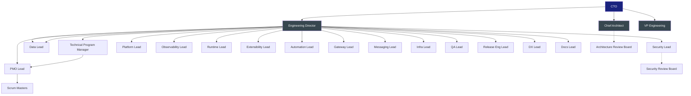

## 2.1 Roles

| Role | Title | Primary Responsibility |
|------|-------|------------------------|
| **CTO** | Chief Technology Officer | Ultimate technical authority; executive sponsor; final escalation |
| **Chief Architect** | Chief Architect | Architecture integrity; RFC compliance; ADR approval; technical direction |
| **Engineering Director** | Engineering Director | People management; resource allocation; delivery execution; team health |
| **VP Engineering** | VP Engineering | Strategic alignment; budget; hiring; executive communication |
| **Technical Program Manager** | TPM | Cross-team coordination; dependency tracking; risk management; schedule |
| **PMO Lead** | PMO Lead | Program governance; reporting; budget tracking; stakeholder communication |
| **DevOps Lead** | DevOps Lead | CI/CD platform; infrastructure automation; GitOps; developer productivity |
| **Security Lead** | Security Lead | Security architecture; compliance; threat modeling; incident response |
| **Platform Lead** | Platform Lead | Core services: Config, Health, Identity, AuthZ, Secrets, State, Workflow, Scheduler, Registry |
| **Observability Lead** | Observability Lead | OTel, Thanos, Loki, Tempo, Grafana, Profiling, Alerting, SLOs |
| **Runtime Lead** | Runtime Lead | Agent Lifecycle, Pools, ACP, WASM, Planner, Orchestrator, HITL, Checkpoint/Recovery |
| **Data Lead** | Data Lead | 4-Tier Memory, Knowledge Ingestion, RAG, Graph, Freshness |
| **Extensibility Lead** | Extensibility Lead | Tool/Plugin/Provider Registry, Plugin Loader, MCP Gateway, Provider Router, SDKs |
| **Automation Lead** | Automation Lead | Rule Engine, Scheduler, Anomaly Detection, Remediation, Profiling, Playbooks |
| **Gateway Lead** | Gateway Lead | Protocol Adapters (WS, gRPC, HTTP), Connection Manager, Rate Limiter, CRDT |
| **Messaging Lead** | Messaging Lead | NATS JetStream, Streams, Consumers, DLQ, Subject Governance |
| **Infra Lead** | Infra Lead | K8s, Terraform, Networking, Storage, DNS, Certs, Cloud Provider |
| **QA Lead** | QA Lead | Test strategy; conformance suites; contract testing; performance; chaos |
| **Release Eng Lead** | Release Eng Lead | Release process; artifact management; progressive delivery; rollback |
| **DX Lead** | Developer Experience Lead | SDKs, CLI, local dev, docs, onboarding, tooling |
| **Docs Lead** | Documentation Lead | Architecture docs, API specs, runbooks, user guides, migration guides |

## 2.2 Responsibilities (RACI)

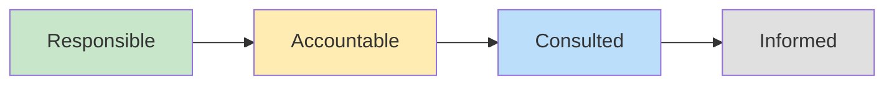

| Activity | CTO | Chief Architect | Eng Director | TPM | DevOps Lead | Security Lead | Platform Lead | Team Leads |
|----------|-----|-----------------|--------------|-----|-------------|---------------|---------------|------------|
| Architecture Decisions | I | **A/R** | C | I | C | C | R | I |
| Sprint Planning | I | C | A | R | C | C | C | R |
| Sprint Review | I | C | A | R | C | C | C | R |
| Architecture Review | C | **A/R** | C | I | C | C | R | C |
| Security Review | I | C | A | I | C | **A/R** | C | R |
| Release Approval | I | C | A | R | R | R | C | C |
| Incident Escalation | I | C | A | R | R | R | C | R |
| Hiring/Firing | A | C | R | I | C | I | C | C |
| Budget Approval | A | C | R | C | I | I | I | I |
| Technical Debt | I | A | C | C | R | C | R | R |

**Legend:** R = Responsible, A = Accountable, C = Consulted, I = Informed

## 2.3 Escalation Path

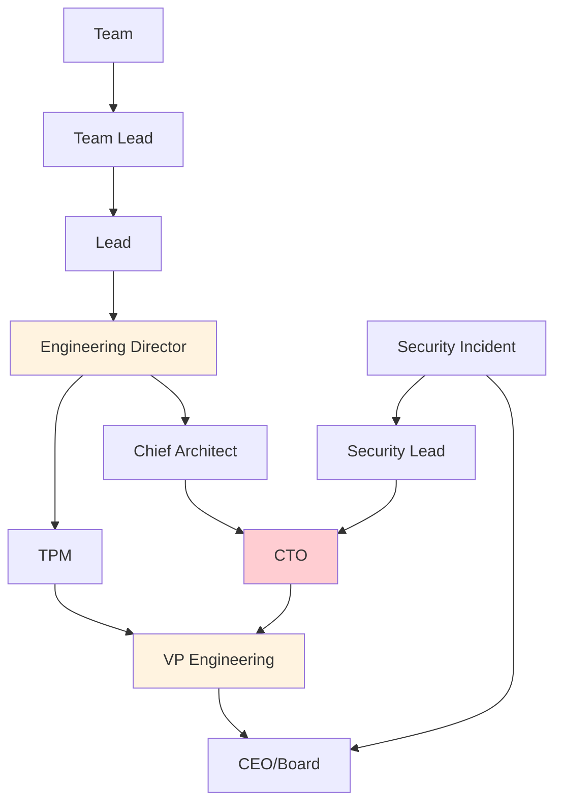

| Level | Trigger | SLA | Participants |
|-------|---------|-----|--------------|
| **L1 — Team** | Task blocked > 4 hours; sprint risk | 2 hours | Team Lead + affected engineers |
| **L2 — Lead** | Cross-team dependency; architecture question; sprint goal at risk | 4 hours | Lead + TPM + affected teams |
| **L3 — Engineering Director** | Sprint goal missed; cross-wave dependency; resource conflict; security issue | 8 hours | Eng Director + TPM + Leads |
| **L4 — Chief Architect** | Architecture deviation; RFC interpretation; technical strategy | 24 hours | Chief Architect + Eng Director + TPM |
| **L5 — CTO/VP** | Program scope change; budget > 10% variance; executive decision | 48 hours | CTO + VP Eng + Eng Director |
| **Security** | Any security incident; vuln exploit; compliance breach | 1 hour | Security Lead + CTO + Eng Director |

## 2.4 Communication Channels

| Channel | Purpose | Participants | Cadence | Tool |
|---------|---------|--------------|---------|------|
| **#hermes-program** | Program announcements; decisions; blockers | All engineering | As needed | Slack |
| **#hermes-leads** | Lead coordination; cross-team deps | Leads + TPM + Eng Director | Daily | Slack |
| **#hermes-architecture** | Architecture discussions; ADRs | Chief Architect + Leads | As needed | Slack |
| **#hermes-security** | Security alerts; incidents; reviews | Security Lead + affected | As needed | Slack |
| **#hermes-releases** | Release coordination; deploy status | Release Eng + TPM + Leads | Per release | Slack |
| **#hermes-incidents** | Incident coordination; war rooms | SRE + affected teams | During incidents | Slack |
| **#hermes-random** | Team building; culture | All engineering | Continuous | Slack |

## 2.5 Meeting Cadence

| Meeting | Cadence | Duration | Participants | Owner | Output |
|---------|---------|----------|--------------|-------|--------|
| **Daily Standup** | Daily | 15 min | Team | Scrum Master | Sprint progress; blockers |
| **Sprint Planning** | Bi-weekly | 2 hours | Team, PO, TPM | Scrum Master | Sprint commitment |
| **Daily Standup (Leads)** | Daily | 15 min | Leads + TPM + Eng Director | TPM | Cross-team deps; blockers |
| **Dependency Sync** | Weekly | 30 min | TPM + Leads | TPM | Dependency resolution |
| **Architecture Review** | Per Epic + Ad-hoc | 2 hours | ARB, Epic Owner, Security | Chief Architect | ADR or Rejection |
| **Engineering Review** | Bi-weekly | 1 hour | Eng Director, Leads | Eng Director | Sprint adjustments |
| **Security Review** | Per Release + Ad-hoc | 2 hours | SRB, Security Lead, Epic Owner | Security Lead | Exception or Approval |
| **Release Review** | Pre-Release | 1 hour | Release Mgr, TPM, Eng Dir, TPM, QA | Release Manager | Go/No-Go |
| **Sprint Review** | Bi-weekly | 1 hour | Team, Stakeholders | PO | Demo; feedback |
| **Sprint Retrospective** | Bi-weekly | 1 hour | Team | Scrum Master | Improvements |
| **Executive Review** | Monthly | 1 hour | CTO, Eng Dir, VP Eng, TPM | CTO | Program direction |
| **Board Review** | Quarterly | 30 min | CTO, CEO, VP Eng | CTO | Strategic alignment |
| **All-Hands** | Monthly | 30 min | All engineering | Eng Director | Program updates; celebration |

---

# 3. Team Structure

## 3.1 Platform Team

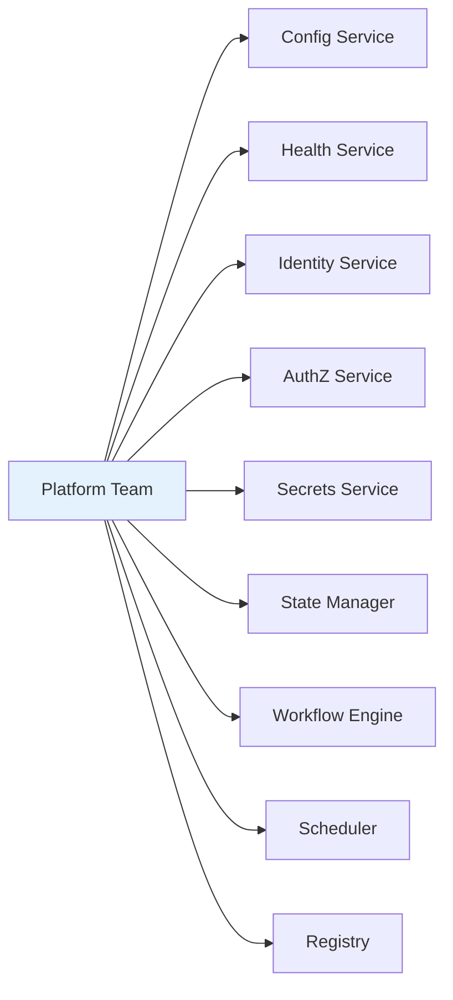

| Aspect | Detail |
|--------|--------|
| **Mission** | Build and operate the foundational platform services that all other teams depend on |
| **Scope** | Config, Health, Identity, AuthZ, Secrets, State Manager, Workflow Engine, Scheduler, Registry |
| **Responsibilities** | Service implementation; API design; SLA adherence; multi-tenancy; hot reload; schema evolution |
| **Deliverables** | 9 platform services; gRPC/HTTP APIs; CUE schemas; client libraries; integration tests |
| **KPIs** | API latency p99 < 10ms; hot reload < 1s; 99.9% uptime; schema validation < 100ms |
| **Dependencies** | NATS, PostgreSQL, Redis, SPIRE, Vault, CUE |
| **Team Size** | 6 engineers (1 Tech Lead, 5 Engineers) |
| **On-call** | Primary for platform services; secondary for dependent teams |

## 3.2 Infrastructure Team

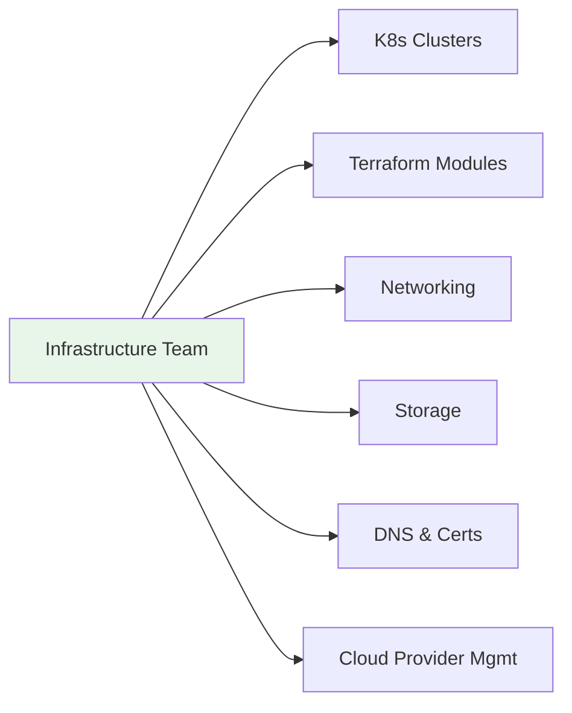

| Aspect | Detail |
|--------|--------|
| **Mission** | Provide reliable, scalable, secure cloud infrastructure as a platform |
| **Scope** | K8s clusters (dev/staging/prod), Terraform, Networking, Storage, DNS, Certificates, Cloud Provider Management |
| **Responsibilities** | Cluster provisioning; GitOps (FluxCD); NetworkPolicy; CSI; certificate management; quota management |
| **Deliverables** | 3 clusters (dev/staging/prod); Terraform modules; GitOps bootstrap; disaster recovery |
| **KPIs** | Cluster provisioning < 30 min; 99.9% cluster uptime; Terraform apply < 10 min; DR drill pass rate 100% |
| **Dependencies** | Cloud provider accounts; DNS; certificate authority |
| **Team Size** | 4 engineers (1 Tech Lead, 3 Engineers) |
| **On-call** | Primary for infrastructure; escalation for platform teams |

## 3.3 Runtime Team

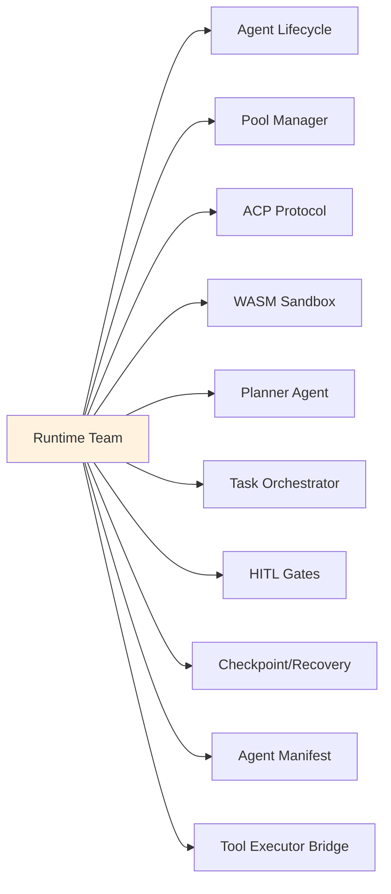

| Aspect | Detail |
|--------|--------|
| **Mission** | Build the agent execution engine — the heart of Hermes agent orchestration |
| **Scope** | Agent Lifecycle, Pool Manager, ACP, WASM Sandbox, Planner, Orchestrator, HITL, Checkpoint/Recovery, Manifest, Tool Executor Bridge |
| **Responsibilities** | Agent spawn/scale/drain/terminate; warm pools; ACP over NATS; Wasmtime + WASI 0.2; fuel metering; capability tokens; saga orchestration; HITL approval gates; checkpoint/recovery; supply chain attestation |
| **Deliverables** | Runtime binaries; ACP protocol impl; WASM sandbox; planner/orchestrator; HITL service; checkpoint service; manifest validator; tool executor client |
| **KPIs** | Agent spawn p99 < 5s; warm pool hit rate > 80%; ACP latency p99 < 50ms; WASM cold start < 100ms; checkpoint overhead < 5% |
| **Dependencies** | Platform services, NATS, WASI SDK, Wasmtime, PostgreSQL, Redis |
| **Team Size** | 6 engineers (1 Tech Lead, 5 Engineers) |
| **On-call** | Primary for runtime services |

## 3.4 AI Team

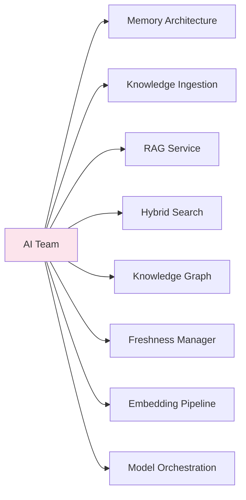

| Aspect | Detail |
|--------|--------|
| **Mission** | Build the cognitive layer — memory, knowledge, and reasoning capabilities for agents |
| **Scope** | 4-Tier Memory (Working, Episodic, Semantic, Procedural); Consolidation; Knowledge Ingestion (15+ parsers); RAG (retrieval, rerank, generation, citations); Hybrid Search (vector + keyword + graph, RRF); Knowledge Graph (Kuzu); Freshness (TTL, invalidation, refresh); Embedding Pipeline; Model Orchestration |
| **Responsibilities** | Vector DB ops; embedding models; chunking strategies; reranking; graph traversal; TTL/invalidation; model routing; cost optimization |
| **Deliverables** | Working Memory (Redis); Episodic Memory (PG + Qdrant); Semantic Memory (Qdrant + Kuzu + PG); Procedural Memory (PG + Redis); Ingestion Pipeline; RAG Service; Graph Service; Freshness Manager; Embedding Pipeline; Model Orchestrator |
| **KPIs** | Working Memory p99 < 2ms; Semantic Search p99 < 100ms; Ingestion > 10k docs/min; RAG answer p99 < 5s; Consolidation accuracy > 90% |
| **Dependencies** | Runtime, Platform, PostgreSQL, Qdrant, Kuzu, Embedding Models, LLM Providers |
| **Team Size** | 5 engineers (1 Tech Lead, 4 Engineers) |
| **On-call** | Primary for memory/knowledge services |

## 3.5 Security Team

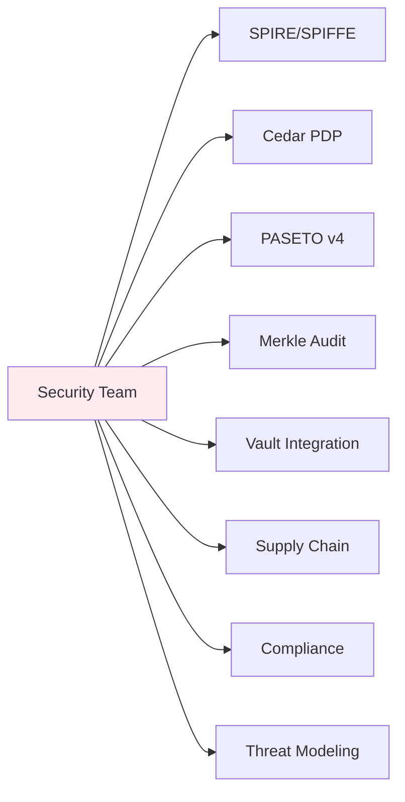

| Aspect | Detail |
|--------|--------|
| **Mission** | Build and operate the security substrate — identity, authorization, audit, and supply chain |
| **Scope** | SPIRE/SPIFFE, Cedar PDP, PASETO v4, Merkle Audit Log, Vault Integration, Supply Chain (sigstore, SLSA), Compliance (SOC2, GDPR, HIPAA), Threat Modeling |
| **Responsibilities** | SPIRE deployment; SVID lifecycle; Cedar policy authoring; PASETO token format; Merkle tree audit log; dynamic secrets; SLSA Level 3; compliance evidence; threat models |
| **Deliverables** | SPIRE cluster; Cedar PDP; PASETO library; Audit log service; Vault dynamic creds; sigstore pipeline; compliance dashboards; threat model artifacts |
| **KPIs** | SVID issuance < 10s; AuthZ decision p99 < 10ms; 100% mTLS enforcement; audit log integrity 100%; 0 critical vulns at GA |
| **Dependencies** | SPIRE, Istio/Cilium, Vault, PostgreSQL, S3, Cedar, PASETO, sigstore |
| **Team Size** | 4 engineers (1 Tech Lead, 3 Engineers) |
| **On-call** | Primary for security services; incident response lead |

## 3.6 Observability Team

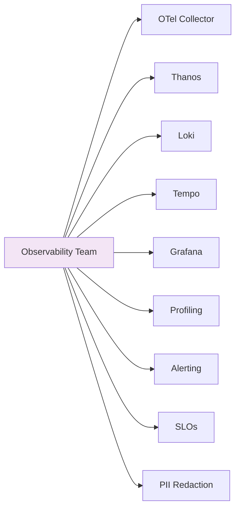

| Aspect | Detail |
|--------|--------|
| **Mission** | Provide comprehensive observability — metrics, logs, traces, profiles, SLOs, alerting |
| **Scope** | OTel Collector (Agent + Gateway), Thanos (Receive/Store/Query/Compact), Loki (Distributor/Ingester/Querier), Tempo (Distributor/Ingester/Querier), Grafana (dashboards/alerting), Continuous Profiling, Alerting, SLOs, PII Redaction |
| **Responsibilities** | Collector config; sampling policies; redaction rules; SLO definitions; dashboard provisioning; alert routing; cardinality management; cost optimization |
| **Deliverables** | OTel Collector (Agent + Gateway); Thanos (Receive/Store/Query/Compact); Loki (Distributor/Ingester/Querier/Compactor); Tempo (Distributor/Ingester/Querier/Compactor); Grafana (dashboards/alerting); Profiling Agent; Alerting rules; SLO dashboards |
| **KPIs** | Ingestion latency p99 < 5s (metrics), < 10s (logs), < 15s (traces); Query p99 < 3s (metrics), < 10s (logs), < 10s (traces); 99.9% collector availability; PII redaction 100% |
| **Dependencies** | All services (instrumentation); S3/GCS; PostgreSQL; NATS |
| **Team Size** | 4 engineers (1 Tech Lead, 3 Engineers) |
| **On-call** | Primary for observability stack |

## 3.7 Developer Experience Team

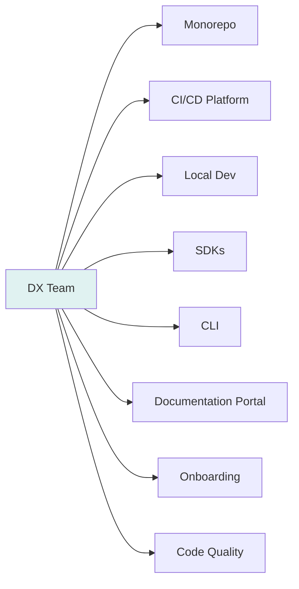

| Aspect | Detail |
|--------|--------|
| **Mission** | Maximize developer productivity — from first clone to production deploy |
| **Scope** | Monorepo, CI/CD Platform, Local Dev Environment, SDKs (Go, Python, TypeScript), CLI (hermesctl), Documentation Portal, Onboarding, Code Quality Tooling |
| **Responsibilities** | Monorepo structure; CI/CD pipelines; kind/tilt local dev; Go/Python/TS SDKs; hermesctl CLI; ReadTheDocs/Buf portal; onboarding flow; golangci-lint/buf/staticcheck |
| **Deliverables** | Monorepo bootstrap; CI pipelines (11 stages); kind/tilt dev stack; Go/Python/TS SDKs; hermesctl; Buf/ReadTheDocs portal; onboarding checklist; pre-commit hooks; code quality gates |
| **KPIs** | Time-to-first-commit < 30 min; CI pipeline < 30 min; `make dev-up` < 5 min; SDK coverage > 90% APIs; doc build < 5 min |
| **Dependencies** | GitHub, GitHub Actions, Buf, Cosign, Kind, Tilt, mkcert, ReadTheDocs |
| **Team Size** | 4 engineers (1 Tech Lead, 3 Engineers) |
| **On-call** | Primary for CI/CD, SDKs, CLI, docs |

## 3.8 QA Team

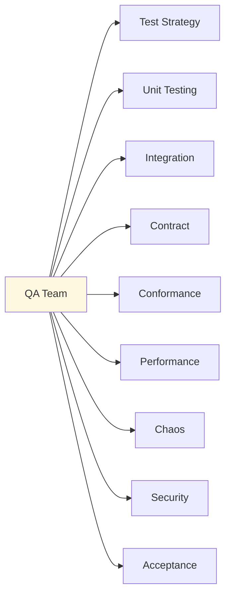

| Aspect | Detail |
|--------|--------|
| **Mission** | Ensure every release meets quality standards through comprehensive testing at all levels |
| **Scope** | Test Strategy; Unit; Integration; Contract (Pact); Conformance (RFC suites); Performance (k6); Chaos (Litmus); Security (Trivy/Gosec); Acceptance (AC validation) |
| **Responsibilities** | Test strategy; test infrastructure; conformance suites; contract broker; performance baselines; chaos experiments; security scanning; AC validation; test data management |
| **Deliverables** | Test strategy doc; conformance test suites (12 RFCs); Pact broker; k6 scripts; Litmus experiments; security pipelines; AC validation automation; test data generator |
| **KPIs** | Unit coverage > 80%; integration pass rate 100%; contract pass 100%; conformance 100% at GA; performance within SLOs; 0 critical vulns; AC completion 100% |
| **Dependencies** | All teams (test contracts); Pact Broker; k6; Litmus; Trivy; ArgoCD |
| **Team Size** | 4 engineers (1 QA Lead, 3 QA Engineers) |
| **On-call** | Primary for test infrastructure; release validation |

## 3.9 Release Engineering Team

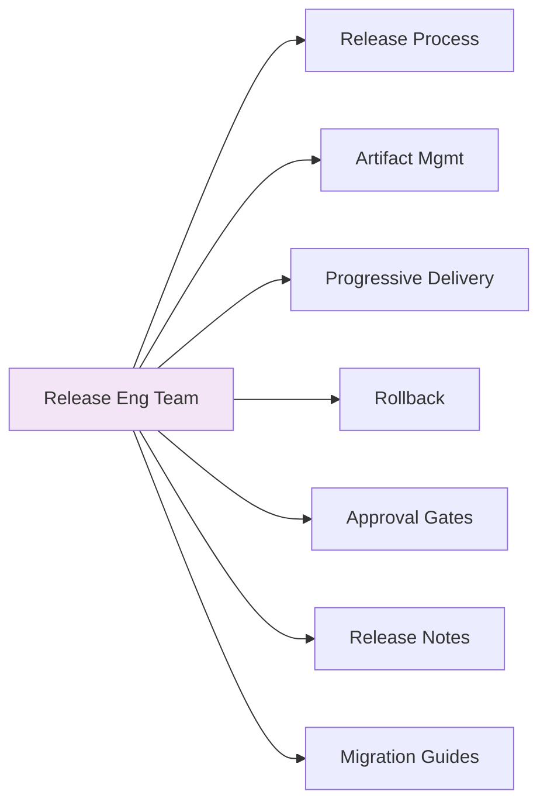

| Aspect | Detail |
|--------|--------|
| **Mission** | Orchestrate safe, reliable, auditable releases from artifact to production |
| **Scope** | Release Process, Artifact Management, Progressive Delivery, Rollback, Approval Gates, Release Notes, Migration Guides |
| **Responsibilities** | Release calendar; artifact promotion; progressive delivery (canary/blue-green); automated rollback; approval gates; release notes generation; migration guides; SBOM generation; cosign signing |
| **Deliverables** | Release calendar; artifact promotion pipeline; Argo Rollouts configs; rollback runbooks; approval gates; release notes generator; migration guide templates; SBOM generator; cosign verification |
| **KPIs** | Deploy frequency >= 5/week (post-Beta); deploy success > 99%; rollback < 5 min; release notes published same day; SBOM 100% |
| **Dependencies** | ArgoCD/FluxCD, Argo Rollouts, Harbor, Cosign, SBOM tools, Jira |
| **Team Size** | 3 engineers (1 Release Manager, 2 Engineers) |
| **On-call** | Primary for release pipeline; release day on-call |

## 3.10 Program Management Office

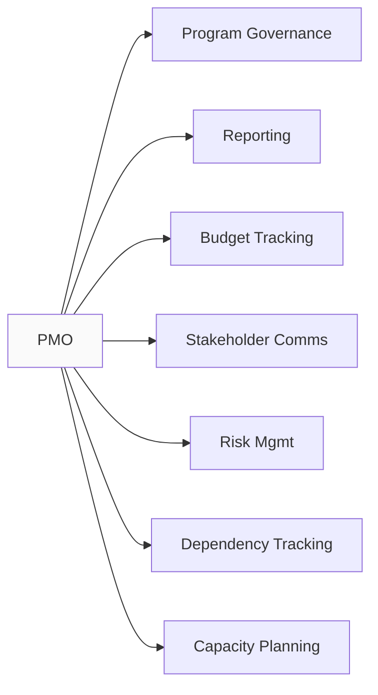

| Aspect | Detail |
|--------|--------|
| **Mission** | Ensure program governance, visibility, and alignment from kickoff to GA |
| **Scope** | Program Governance, Reporting, Budget Tracking, Stakeholder Communication, Risk Management, Dependency Tracking, Capacity Planning |
| **Responsibilities** | Weekly/Monthly/Quarterly reports; budget tracking ($23.8M); risk register; dependency matrix; capacity planning; executive reporting; stakeholder communication; decision log |
| **Deliverables** | Weekly status; monthly executive report; quarterly board report; release reports; risk register; dependency matrix; capacity plan; budget variance report |
| **KPIs** | Report on-time rate 100%; budget variance < 10%; risk mitigation progress; dependency resolution time |
| **Dependencies** | TPM; Engineering Director; Finance; Stakeholders |
| **Team Size** | 1 PMO Lead + 1 Analyst |
| **On-call** | Business hours; escalation for executive reporting |

---

# 4. Environment Strategy

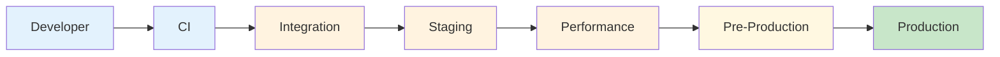

## 4.1 Developer Environment

| Aspect | Specification |
|--------|---------------|
| **Purpose** | Inner-loop development; fast feedback; isolated experimentation |
| **Infrastructure** | `kind` clusters (1 per developer); local NATS, PostgreSQL, Redis, Vault, SPIRE; tilt for live reload; mkcert for TLS |
| **Deployment Process** | `make dev-up` spins up local stack; `tilt up` syncs code changes in < 2s; `make dev-down` tears down |
| **Quality Gates** | Pre-commit hooks (golangci-lint, buf lint, staticcheck, hadolint); unit tests; `make test-short` |
| **Promotion Criteria** | Code compiles; `make test-short` passes; pre-commit clean; no linting errors |

## 4.2 CI Environment

| Aspect | Specification |
|--------|---------------|
| **Purpose** | Validate every PR; enforce quality gates; build artifacts |
| **Infrastructure** | GitHub Actions runners (self-hosted); ephemeral kind clusters per job; cached dependencies; artifact storage (Harbor) |
| **Deployment Process** | PR triggers CI; each job spins up isolated kind cluster; runs pipeline stages; publishes artifacts to Harbor on merge |
| **Quality Gates** | **MUST** pass: Architecture Compliance, Code Review (2 approvals), Unit Tests (>80%), Static Analysis (golangci-lint, staticcheck, govulncheck), Security Scan (Trivy, Gosec), Contract Tests (Pact), Unit Test Coverage > 80% |
| **Promotion Criteria** | All quality gates pass; artifacts published to Harbor; SBOM generated and signed with cosign |

## 4.3 Integration Environment

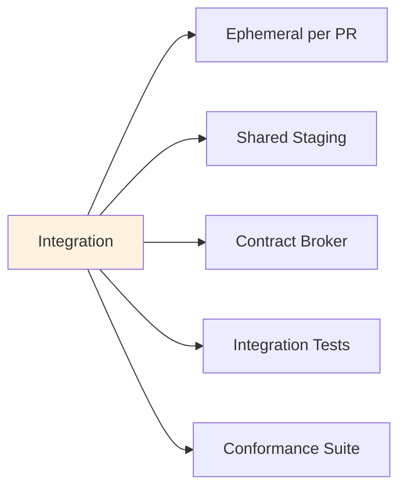

| Aspect | Specification |
|--------|---------------|
| **Purpose** | Cross-service integration validation; contract verification; conformance testing |
| **Infrastructure** | Dedicated K8s namespace per PR (ephemeral); shared integration cluster for long-running; Pact Broker; test data generator |
| **Deployment Process** | On PR merge to `develop`; Helm deploy via FluxCD to integration namespace; Pact contract verification; conformance suite execution |
| **Quality Gates** | **MUST** pass: Integration Tests (100%), Contract Tests (Pact verification 100%), Conformance Tests (RFC suites) |
| **Promotion Criteria** | All integration gates pass; no regressions vs baseline; performance within 10% of baseline |

## 4.4 Staging Environment

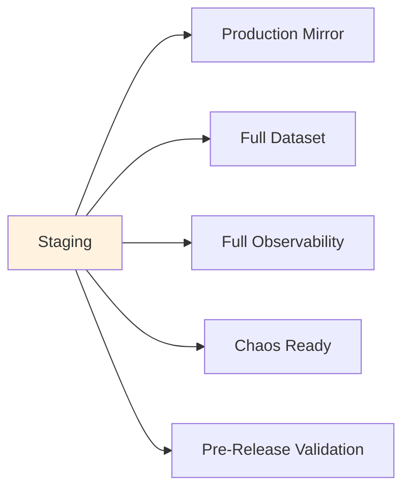

| Aspect | Specification |
|--------|---------------|
| **Purpose** | Production-mirror environment for release validation, chaos engineering, performance testing |
| **Infrastructure** | Dedicated K8s cluster mirroring production topology; production-scale NATS, PostgreSQL, Redis, Object Storage; full observability stack; chaos mesh |
| **Deployment Process** | Release branch promotion via ArgoCD; blue/green or canary via Argo Rollouts; automated smoke tests post-deploy |
| **Quality Gates** | **MUST** pass: Full conformance suite (100%), Load test at 2x projected peak, Chaos experiment pass, Security scan (0 CRITICAL/HIGH), SLO validation |
| **Promotion Criteria** | All gates pass; release manager approval; runbook reviewed; rollback plan tested |

## 4.5 Performance Environment

| Aspect | Specification |
|--------|---------------|
| **Purpose** | Sustained load testing; capacity planning; bottleneck identification; SLO validation |
| **Infrastructure** | Dedicated K8s cluster; production-scale infrastructure; k6 load generators; Grafana k6 dashboard; continuous profiling |
| **Deployment Process** | On-demand via CI/CD; `make perf-test` triggers k6 scenarios; results in Grafana; automated comparison vs baseline |
| **Quality Gates** | **MUST** pass: API latency p99 within SLO; error rate < 0.1%; throughput at target; no resource exhaustion; profile analysis clean |
| **Promotion Criteria** | All perf tests pass; no regressions > 10% vs baseline; capacity headroom > 2x projected peak |

## 4.6 Pre-Production Environment

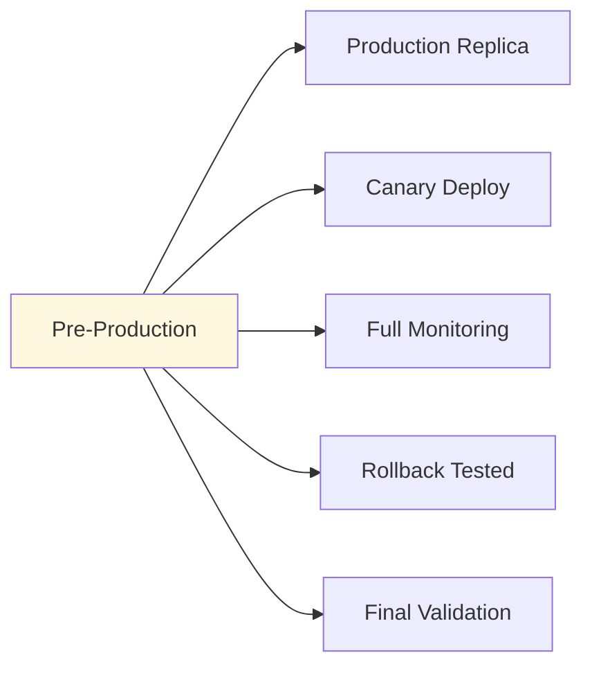

| Aspect | Specification |
|--------|---------------|
| **Purpose** | Final validation in production-like environment with real traffic shadowing |
| **Infrastructure** | Subset of production cluster; shadow traffic mirroring; full observability; rollback automated |
| **Deployment Process** | Canary deployment via Argo Rollouts (1% to 5% to 25% to 100%); automated rollback on SLO breach; shadow traffic mirroring |
| **Quality Gates** | **MUST** pass: Canary SLOs met; error rate < 0.1%; latency p99 within SLO; rollback < 5 min; shadow traffic parity > 99.9% |
| **Promotion Criteria** | Canary at 100% for 30 min with green SLOs; Release Manager approval; runbook reviewed; rollback tested |

## 4.6 Production Environment

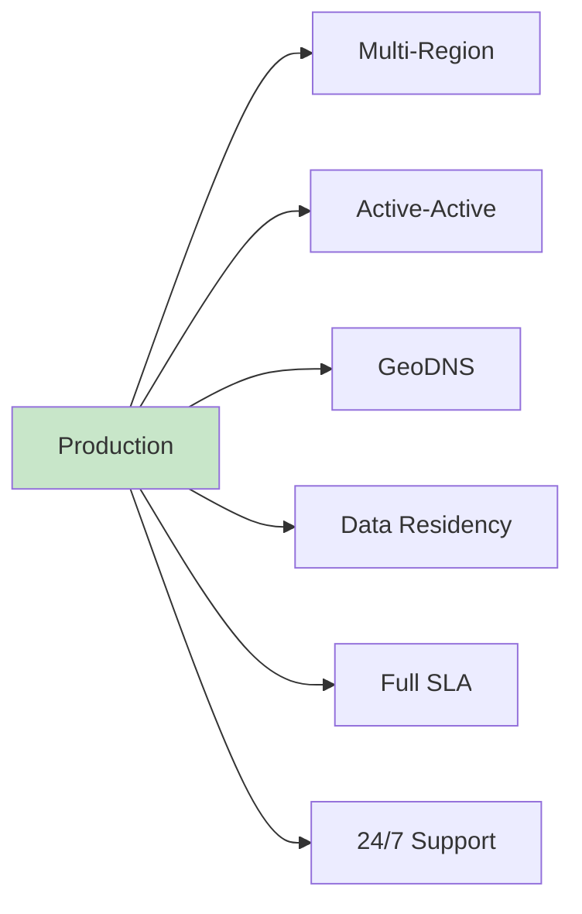

| Aspect | Specification |
|--------|---------------|
| **Purpose** | Serve customers with enterprise-grade SLA, multi-region, disaster recovery |
| **Infrastructure** | Multi-region K8s (active-active); NATS supercluster; GeoDNS; data residency controls; full observability; 24/7 on-call; runbook automation |
| **Deployment Process** | Progressive delivery via Argo Rollouts (canary to blue/green); automated rollback on SLO breach; feature flags; shadow traffic; capacity scaling |
| **Quality Gates** | **MUST** maintain: SLO compliance > 99.9%; MTTR < 30 min; availability > 99.9%; error rate < 0.1%; change failure rate < 5%; rollback < 5 min |
| **Operational Requirements** | 24/7 on-call; runbook automation; chaos engineering monthly; DR drill quarterly; capacity review monthly; SLO review weekly |

## 4.7 Environment Promotion Flow

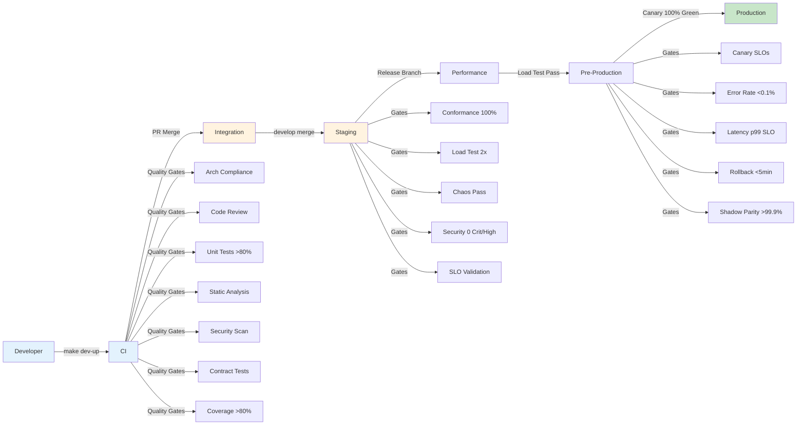

## 4.7 Environment Promotion Criteria Summary

| From to To | Criteria | Automation | Owner |
|------------|----------|------------|-------|
| Developer to CI | `make ci` passes locally | Manual trigger | Developer |
| CI to Integration | All CI quality gates pass | Auto on merge | CI System |
| Integration to Staging | All integration gates pass | Auto on `develop` merge | CI System |
| Staging to Performance | All staging gates pass | Auto on release branch | CI System |
| Performance to Pre-Prod | Load test pass; no regressions | Auto on perf pass | CI System |
| Pre-Prod to Production | Canary 100% green; SLOs met; RM approval | Argo Rollouts + Manual | Release Manager |

---

# 5. Repository Bootstrap

## 5.1 Repository Creation

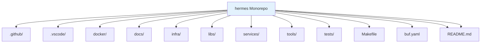

**MUST** create the monorepo with the following structure:

```
hermes/
├── .github/
│   ├── workflows/           # CI/CD pipelines (11 stages)
│   ├── CODEOWNERS           # Ownership rules
│   ├── dependabot.yml       # Dependency updates
│   └── pull_request_template.md
├── .vscode/
│   ├── settings.json        # Go, Protobuf, Docker, K8s extensions
│   ├── launch.json          # Debug configurations
│   └── extensions.json      # Recommended extensions
├── docker/
│   ├── base/                # Distroless base images
│   ├── profile-agent/
│   ├── ingestion/
│   └── ...
├── docs/
│   ├── architecture/        # RFCs, ADRs
│   ├── engineering/         # Handbooks, runbooks
│   └── api/                 # Protobuf, OpenAPI
├── infra/
│   ├── terraform/           # IaC modules (K8s, NATS, PG, Redis, Vault, SPIRE, Object Storage, Monitoring)
│   ├── kubernetes/          # Helm charts, Kustomize, FluxCD
│   └── scripts/             # Provisioning scripts
├── libs/
│   ├── go/                  # Go shared libraries
│   │   ├── otel/            # OTel SDK config
│   │   ├── nats/            # NATS client wrapper
│   │   ├── security/        # SPIFFE/PASETO/Cedar
│   │   ├── config/          # Config client
│   │   └── testing/         # Test utilities
│   └── proto/               # Protobuf definitions (buf)
├── services/
│   ├── core/                # RFC-0002 Core services
│   │   ├── state-manager/
│   │   ├── workflow-engine/
│   │   ├── scheduler/
│   │   └── registry/
│   ├── event-bus/           # RFC-0003 NATS operator
│   ├── gateway/             # RFC-0004 Gateway
│   ├── security/            # RFC-0007 Security Service
│   ├── config/              # Configuration Service
│   ├── health/              # Health Service
│   ├── identity/            # Identity Service
│   ├── observability/       # RFC-0010 Collectors
│   └── profiling/           # RFC-0012 Profile Agent
├── tools/
│   ├── hermesctl/           # CLI tool
│   └── conformance/         # Conformance test runner
├── tests/
│   ├── contract/            # Pact contract tests
│   ├── integration/         # Cross-service tests
│   ├── chaos/               # Litmus chaos experiments
│   └── conformance/         # RFC conformance suites
├── Makefile                 # Common targets (ci, dev-up, test, build, deploy)
├── buf.yaml                 # Protobuf configuration
├── go.work                  # Go workspace
└── README.md                # Project overview
```

**MUST** execute the following bootstrap sequence:

1. Create GitHub repository `hermes/hermes` with branch protection on `main` and `develop`
2. Initialize monorepo structure per above
3. Configure GitHub Actions workflows (11 stages)
4. Configure branch protection on `main` and `develop`
5. Configure `CODEOWNERS` per team ownership
6. Configure required status checks (11 CI stages)
6. Configure Dependabot for Go, Docker, GitHub Actions
8. Initialize `buf.yaml` with lint/breaking rules
9. Initialize `go.work` with all Go modules
10. Create initial `README.md` with project overview

## 5.2 Branch Protection

```mermaid
flowchart LR
    BR[Branch Protection] --> BP1[main]
    BR --> BP2[develop]
    BR --> BP3[release/v*]
    BR --> BP4[hotfix/*]
    
    BP1 --> R1[2 Approvals]
    BP1 --> R2[CI Pass]
    BP1 --> R3[Security Scan]
    BP1 --> R4[Linear History]
    BP1 --> R5[Signed Commits]
    
    BP2 --> R2a[1 Approval]
    BP2 --> R2b[CI Pass]
    BP2 --> R2c[Security Scan]
    
    BP3 --> R3a[2 Approvals]
    BP3 --> R3b[CI Pass]
    BP3 --> R3c[Conformance Pass]
    BP3 --> R3d[Security Scan]
    BP3 --> R3e[Release Approval]
    
    BP4 --> R4a[1 Approval]
    BP4 --> R4b[CI Pass]
    BP4 --> R4b2[Security Scan]
    BP4 --> R4b3[Expedited Approval]
    
    style BP1 fill:#ffcdd2
    style BP2 fill:#fff3e0
    style BP3 fill:#fff3e0
    style BP4 fill:#fff3e0
```

| Branch | Protection Rules | Required Checks |
|--------|------------------|-----------------|
| `main` | 2 approvals; CI pass; security scan; linear history; signed commits | Architecture Compliance, Code Review, Unit Tests >80%, Static Analysis, Security Scan, Contract Tests, Coverage >80% |
| `develop` | 1 approval; CI pass; security scan | CI Pass, Security Scan |
| `release/v*` | 2 approvals; CI pass; conformance pass; security scan; release approval | CI Pass, Conformance Pass, Security Scan, Release Approval |
| `hotfix/*` | 1 approval; CI pass; security scan; expedited approval | CI Pass, Security Scan, Expedited Approval |

**MUST** enforce via GitHub Branch Protection API; no bypass allowed.

## 5.3 CODEOWNERS

```mermaid
flowchart TD
    CO[CODEOWNERS] --> CO1[Global]
    CO --> CO2[Architecture]
    CO --> CO3[Infrastructure]
    CO --> CO3b[Libraries]
    CO --> CO4[Services]
    CO --> CO4b[CI/CD]
    CO --> CO5[Tests]
```

```
# Global owners
*                           @hermes/platform-leads

# Architecture docs
/docs/architecture/         @hermes/architects

# Infrastructure
/infra/terraform/           @hermes/infra-team
/infra/kubernetes/          @hermes/platform-team

# Libraries
/libs/go/                   @hermes/platform-team
/libs/proto/                @hermes/api-team

# Services - each service owned by its team
/services/core/             @hermes/core-team
/services/event-bus/        @hermes/messaging-team
/services/gateway/          @hermes/gateway-team
/services/security/         @hermes/security-team
/services/config/           @hermes/platform-team
/services/health/           @hermes/platform-team
/services/identity/         @hermes/security-team
/services/observability/    @hermes/observability-team
/services/profiling/        @hermes/profiling-team

# CI/CD
/.github/workflows/         @hermes/platform-team

# Tests
/tests/contract/            @hermes/qa-team
/tests/integration/         @hermes/qa-team
/tests/chaos/               @hermes/sre-team
/tests/conformance/         @hermes/qa-team
```

## 5.4 Required Checks

| Check | Stage | Blocking | Tool |
|-------|-------|----------|------|
| Architecture Compliance | PR Merge | Yes | Custom CI check |
| Code Review (2 approvals) | PR Merge | Yes | GitHub Branch Protection |
| Unit Tests (>80% coverage) | PR Merge | Yes | `go test -coverprofile` |
| Static Analysis | PR Merge | Yes | golangci-lint, staticcheck, govulncheck |
| Security Scan | PR Merge + Nightly | Yes | Trivy, Gosec |
| Contract Tests | PR Merge + Nightly | Yes | Pact Broker Webhook |
| Coverage > 80% | PR Merge | Yes | `go test -coverprofile` |
| Integration Tests | Nightly + Release Branch | Yes | CI Pipeline |
| Conformance Tests | Release Branch | Yes | CI Pipeline |
| Security Scan (Release) | Release Branch | Yes | CI Pipeline |
| Performance Tests | Release Branch | Yes | k6/hey in CI |
| Documentation | Release Branch | Yes | Doc Build + Lint |
| Release Approval | Tag Creation | Yes | Manual (Release Manager) |

## 5.4 Versioning

| Artifact | Versioning Scheme | Example |
|----------|-------------------|---------|
| **Services** | Semantic Versioning (SemVer 2.0) | `v1.2.3` |
| **Libraries (Go)** | Semantic Versioning | `v1.2.3` |
| **Docker Images** | SemVer + Git SHA | `v1.2.3-abc1234` |
| **Helm Charts** | SemVer + App Version | `hermes/state-manager-v1.2.3.tgz` |
| **Protobuf Modules** | Buf Schema Registry | `buf.build/hermes/state-manager:v1.2.3` |
| **SBOMs** | SPDX JSON | `hermes-state-manager-v1.2.3.spdx.json` |
| **Conformance Reports** | JSON + Release Tag | `conformance-v1.2.3.json` |

## 5.5 Release Branching

```mermaid
flowchart LR
    DEV[develop] --> RC[release/v1.0]
    RC --> MAIN[main]
    MAIN --> HOT[hotfix/v1.0.1]
    HOT --> MAIN
    HOT --> DEV
    
    style RC fill:#fff3e0
    style MAIN fill:#c8e6c9
```

| Branch | Purpose | Lifetime | Merge Target |
|--------|---------|----------|--------------|
| `develop` | Integration branch; auto-deploy to staging | Permanent | — |
| `release/vX.Y` | Release stabilization; conformance; hardening | Until GA | `main` + backport to `develop` |
| `main` | Production-ready; tagged releases | Permanent | — |
| `hotfix/vX.Y.Z` | Emergency production fixes | Until merged | `main` + `develop` |

## 5.5 Tagging Strategy

| Tag Format | Meaning | Example |
|------------|---------|---------|
| `vX.Y.Z` | GA Release | `v1.0.0` |
| `vX.Y.Z-rc.N` | Release Candidate | `v1.0.0-rc.1` |
| `vX.Y.Z-beta.N` | Beta Release | `v1.0.0-beta.1` |
| `vX.Y.Z-alpha.N` | Alpha Release | `v1.0.0-alpha.1` |
| `vX.Y.Z-hotfix.N` | Hotfix Release | `v1.0.1-hotfix.1` |

**MUST** sign all tags with cosign keyless signing; verify in admission controller.

---

# 6. Development Workflow

```mermaid
flowchart TD
    P[Planning] --> D[Design]
    D --> I[Implementation]
    I --> CR[Code Review]
    CR --> T[Testing]
    T --> SR[Security Review]
    SR --> M[Merge]
    M --> DPL[Deployment]
    DPL --> V[Verification]
    V --> R[Release]
    
    style P fill:#e3f2fd
    style D fill:#e3f2fd
    style I fill:#fff3e0
    style CR fill:#fff3e0
    style T fill:#fff3e0
    style SR fill:#ffcdd2
    style M fill:#c8e6c9
    style DPL fill:#e8f5e9
    style V fill:#e8f5e9
    style R fill:#e8eaf6
```

## 6.1 Planning

| Step | Activity | Owner | Output |
|------|----------|-------|--------|
| **Sprint Planning** | Select backlog items; estimate; commit | Team, PO, TPM | Sprint commitment |
| **Capacity Planning** | Assign engineers; account for leave | TPM + Leads | Sprint capacity |
| **Dependency Sync** | Identify cross-team deps | TPM | Dependency matrix |
| **Risk Assessment** | Identify sprint risks | Team + TPM | Risk register update |

**MUST** complete within first 2 hours of sprint start.

## 6.2 Design

| Step | Activity | Owner | Output |
|------|----------|-------|--------|
| **RFC Traceability** | Map feature to RFC sections | Engineer + Lead | Traceability matrix |
| **API Design** | Protobuf definition; OpenAPI spec | Engineer + API Team | `.proto` files; OpenAPI spec |
| **Data Model** | Schema design; migration plan | Engineer + Data Lead | CUE schema; migration script |
| **Architecture Review** | ARB review for new epics | ARB + Epic Owner | ADR or Rejection |
| **Security Design** | Threat model; Cedar policies | Security Lead + Engineer | Threat model; Cedar policy |
| **Observability Design** | Metrics/logs/traces/profiles spec | Engineer + Obs Lead | Instrumentation spec |
| **Test Plan** | Unit/Integration/Contract/Conformance | QA Lead + Engineer | Test plan doc |

**MUST** complete design before implementation starts; **MUST** pass Architecture Review for new epics.

## 6.3 Implementation

| Practice | Requirement |
|----------|-------------|
| **Branch Strategy** | `feature/<epic>-<feature>` from `develop`; short-lived (< 5 days) |
| **Commit Messages** | Conventional Commits: `feat(scope): description` |
| **Code Style** | golangci-lint config; gofmt; goimports |
| **Dependencies** | `go mod tidy`; minimal deps; vendor not committed |
| **Documentation** | Update API specs, runbooks, ADRs with code changes |
| **Feature Flags** | Use for incomplete features; clean up within 2 sprints |
| **Secrets** | **MUST NOT** commit secrets; use Vault Agent Injector |

## 6.4 Code Review

```mermaid
flowchart TD
    CR[Code Review] --> CR1[Architecture Alignment]
    CR --> CR2[Security Review]
    CR --> CR3[Performance]
    CR --> CR3b[Observability]
    CR --> CR4[Tests]
    CR --> CR5[Documentation]
    CR --> CR6[Standards]
    
    CR1 --> A[Approve]
    CR2 --> A
    CR3 --> A
    CR3b --> A
    CR4 --> A
    CR5 --> A
    CR6 --> A
    
    A --> M[Merge]
    
    style CR fill:#fff3e0
```

| Review Dimension | Checklist | Required Approvers |
|------------------|-----------|-------------------|
| **Architecture Alignment** | Matches RFC; no unapproved deviations | 1 Lead |
| **Security** | No secrets; PASETO/Cedar correct; threat model addressed | Security Lead (if security-sensitive) |
| **Performance** | No N+1; efficient queries; caching; resource limits | 1 Engineer |
| **Observability** | Metrics/logs/traces/profiles per spec | Observability Lead |
| **Tests** | Unit + Integration + Contract added/updated | 1 Engineer |
| **Documentation** | API spec; runbook; ADR updated | 1 Engineer |
| **Standards** | golangci-lint clean; gofmt; conventions | Automated |

**MUST** have 2 approvals (1 from different team if cross-team); security review if security-sensitive.

## 6.5 Testing

| Test Type | When | Scope | Owner | Pass Criteria |
|-----------|------|-------|-------|---------------|
| **Unit** | Every commit | Single package; mock deps | Engineer | >80% coverage; all pass |
| **Integration** | Nightly + PR | Cross-service; real deps | QA + Engineer | 100% pass |
| **Contract** | PR + Nightly | Pact contracts; provider/consumer | QA + Engineer | 100% pass |
| **Conformance** | Release Branch | RFC test suites | QA Lead | 100% pass |
| **Performance** | Release Branch | k6 scenarios; SLO validation | QA + SRE | Within SLO |
| **Chaos** | Monthly | Litmus experiments | SRE | Hypothesis validated |
| **Security** | PR + Nightly | Trivy, Gosec, govulncheck | Security Lead | 0 CRITICAL/HIGH |
| **Acceptance** | Per Feature | AC validation | QA + PO | 100% AC pass |

**MUST** run `make test` locally before push; CI runs full suite.

## 6.6 Security Review

| Trigger | Scope | Reviewer | Output |
|---------|-------|----------|--------|
| New Epic | Threat model; data flow; trust boundaries | Security Lead | Threat model doc |
| API Change | AuthZ; data exposure; PII | Security Lead | Approval/Exception |
| Dependency Update | CVE scan; license | Security Lead | Approval/Block |
| Release | Full security scan; SBOM; attestation | Security Lead | Go/No-Go |

**MUST** complete before Release Review; **MUST NOT** merge security-sensitive code without approval.

## 6.7 Merge

| Condition | Requirement |
|-----------|-------------|
| **Approvals** | 2 approvals (1 from different team if cross-team) |
| **CI Status** | All required checks pass |
| **Branch** | Up to date with `develop` (or `release/v*` for release branches) |
| **Conflicts** | None; rebase required |
| **Secrets** | None detected by secret scan |
| **Documentation** | Updated per changes |

**MUST** use squash merge for feature branches; merge commit for release/hotfix.

## 6.8 Deployment

```mermaid
flowchart LR
    M[Merge] --> A[ArgoCD Sync]
    A --> S[Staging Deploy]
    S --> P[Pre-Prod Canary]
    P --> PROD[Production Canary]
    PROD --> FULL[Full Rollout]
    
    style M fill:#c8e6c9
    style PROD fill:#c8e6c9
```

| Environment | Trigger | Strategy | Rollback |
|-------------|---------|----------|----------|
| **Staging** | Merge to `develop` | FluxCD sync (auto) | FluxCD rollback |
| **Pre-Production** | Release branch | Argo Rollouts canary (1% to 5% to 25% to 100%) | Argo Rollouts abort |
| **Production** | Release tag | Argo Rollouts canary (1% to 5% to 25% to 100%) | Argo Rollouts abort < 5 min |

**MUST** have runbook linked; **MUST** have rollback tested in last sprint.

## 6.9 Verification

| Check | Method | Owner | Pass Criteria |
|-------|--------|-------|---------------|
| **Smoke Tests** | Automated post-deploy | Release Eng | 100% pass |
| **SLO Validation** | Grafana SLO dashboard | SRE Lead | All SLOs green |
| **Error Budget** | Alertmanager | SRE Lead | No burn |
| **Canary Metrics** | Argo Rollouts dashboard | Release Eng | SLOs green at 100% |
| **Shadow Traffic** | Traffic mirroring diff | SRE Lead | < 0.1% diff |

## 6.10 Release

| Step | Activity | Owner | Gate |
|------|----------|-------|------|
| **Release Branch** | Cut `release/vX.Y` from `develop` | Release Manager | — |
| **Conformance** | Run full RFC conformance suites | QA Lead | 100% pass |
| **Security** | Full scan; SBOM; cosign sign | Security Lead | 0 CRITICAL/HIGH |
| **Performance** | Load test at target multiplier | SRE Lead | Within SLO |
| **Chaos** | Run chaos experiments | SRE Lead | Hypothesis validated |
| **Documentation** | Release notes; migration guide | Docs Lead | Published |
| **Approval** | Architecture Review Board; Eng Director; Chief Architect; Executive (GA) | Release Manager | Go/No-Go |
| **Tag & Sign** | `vX.Y.Z`; cosign sign | Release Manager | Signed |
| **Deploy** | Progressive rollout | Release Eng | Canary green |
| **Announce** | Release notes; migration guide | Docs Lead | Published |

---

# 7. CI/CD Execution

```mermaid
flowchart TD
    SRC[Source Commit] --> CI[CI Pipeline]
    CI --> S1[Stage 1: Architecture Compliance]
    S1 --> S2[Stage 2: Code Review]
    S2 --> S3[Stage 3: Unit Tests]
    S3 --> S4[Stage 4: Static Analysis]
    S4 --> S5[Stage 5: Security Scan]
    S5 --> S6[Stage 6: Contract Tests]
    S6 --> S7[Stage 7: Coverage Check]
    S7 --> S8[Stage 8: Build Artifacts]
    S8 --> S9[Stage 8b: SBOM Generation]
    S9 --> S10[Stage 9: Integration Tests]
    S10 --> S11[Stage 10: Conformance Tests]
    S11 --> S12[Stage 11: Artifact Publish]
    S12 --> CD[CD Pipeline]
    CD --> C1[Staging Deploy]
    C1 --> C2[Pre-Prod Canary]
    C2 --> C3[Production Canary]
    C3 --> C4[Full Rollout]
    
    style SRC fill:#e3f2fd
    style CI fill:#fff3e0
    style CD fill:#e8f5e9
```

## 7.1 Pipeline Stages

| Stage | Name | Trigger | Duration | Parallel | Failure Action |
|-------|------|---------|----------|----------|----------------|
| **1** | Architecture Compliance | PR Open | < 2 min | Yes | Block |
| **2** | Code Review | PR Ready | Human | — | Block |
| **3** | Unit Tests | PR Merge | < 10 min | Yes | Block |
| **4** | Static Analysis | PR Merge | < 5 min | Yes | Block |
| **4b** | Security Scan (PR) | PR Merge | < 5 min | Yes | Block |
| **5** | Contract Tests | PR Merge | < 10 min | Yes | Block |
| **6** | Coverage Check | PR Merge | < 2 min | — | Block |
| **7** | Build Artifacts | PR Merge | < 15 min | Yes | Block |
| **7b** | SBOM Generation | PR Merge | < 2 min | — | Block |
| **8** | Integration Tests | `develop` Merge | < 30 min | Yes | Block (Nightly) |
| **9** | Conformance Tests | Release Branch | < 30 min | Yes | Block (Release) |
| **10** | Artifact Publish | Release Branch | < 10 min | — | Block |

**MUST** complete full PR pipeline in < 30 minutes.

## 7.2 Artifact Generation

| Artifact | Format | Storage | Signing |
|----------|--------|---------|---------|
| **Docker Images** | OCI (multi-arch: amd64, arm64) | Harbor | cosign keyless |
| **Helm Charts** | `.tgz` | ChartMuseum / OCI Registry | cosign keyless |
| **Binaries** | ELF (static) / `.tar.gz` | Harbor / S3 | cosign keyless |
| **SBOM** | SPDX JSON | Harbor / S3 | cosign keyless |
| **Protobuf Modules** | Buf Module | Buf Schema Registry | — |
| **Conformance Reports** | JSON | S3 / CI Artifacts | — |
| **SBOM** | SPDX JSON | Harbor / S3 | cosign keyless |

**MUST** sign all artifacts with cosign keyless signing; verify in admission controller.

## 7.3 Container Publishing

```mermaid
flowchart LR
    BUILD[Build] --> PUSH[Push to Harbor]
    PUSH --> SCAN[Trivy Scan]
    SCAN --> SIGN[Cosign Sign]
    SIGN --> ATTEST[SBOM Attest]
    ATTEST --> PROMOTE[Promote to Staging]
    PROMOTE --> PROD[Promote to Production]
    
    style BUILD fill:#e3f2fd
    style SCAN fill:#ffcdd2
    style SIGN fill:#e8f5e9
```

| Step | Action | Tool | Gate |
|------|--------|------|------|
| **Build** | `docker buildx` (multi-arch) | BuildKit | — |
| **Push** | `docker push` to Harbor | Docker CLI | — |
| **Scan** | Trivy vulnerability scan | Trivy | Block on CRITICAL/HIGH |
| **Sign** | cosign keyless sign | cosign | Required |
| **SBOM** | syft generate SPDX | syft | Required |
| **Attest** | cosign attest SBOM | cosign | Required |
| **Promote** | Tag promotion in Harbor | Harbor API | Manual (Release Manager) |

**MUST** sign all images; **MUST** verify signatures in admission controller (Kyverno/Cosign).

## 7.4 Infrastructure Deployment

```mermaid
flowchart LR
    TF[Terraform Plan] --> TF2[Terraform Apply]
    TF2 --> FLUX[FluxCD Sync]
    FLUX --> K8S[K8s Resources]
    K8S --> HELM[Helm Releases]
    HELM --> ARGO[Argo Rollouts]
    ARGO --> CANARY[Canary Deploy]
    CANARY --> FULL[Full Rollout]
    
    style TF fill:#e3f2fd
    style TF2 fill:#fff3e0
    style FLUX fill:#fff3e0
    style K8S fill:#fff3e0
    style HELM fill:#fff3e0
    style ARGO fill:#e8f5e9
```

| Stage | Tool | Trigger | Approval |
|-------- | Plan | Terraform | PR Merge | Auto |
| **Apply** | Terraform | Release Branch | Manual (Infra Lead) |
| **FluxCD Sync** | FluxCD | Release Branch | Auto |
| **Helm Releases** | Helm | Release Branch | Auto |
| **Argo Rollouts** | Argo Rollouts | Release Branch | Auto |
| **Canary Deploy** | Argo Rollouts | Release Tag | Auto |
| **Full Rollout** | Argo Rollouts | Canary Green | Manual (Release Manager) |

**MUST** have rollback tested; **MUST** have runbook linked.

---

# 8. Engineering Standards

## 8.1 Coding Standards

| Standard | Specification | Enforcement |
|----------|---------------|-------------|
| **Language** | Go 1.23+ (services), TypeScript 5+ (SDKs) | CI check |
| **Formatting** | `gofmt` / `goimports` / `prettier` | Pre-commit + CI |
| **Linting** | `golangci-lint` (strict), `eslint` (TS) | CI gate |
| **Error Handling** | Explicit errors; no panics in production code | Code review |
| **Context** | Pass `context.Context` as first param | Code review |
| **Logging** | Structured JSON; zerolog; correlation IDs | Code review |
| **Metrics** | Prometheus client; histograms for latency | Code review |
| **Tracing** | OpenTelemetry; W3C TraceContext propagation | Code review |

## 8.2 API Standards

| Standard | Specification |
|----------|---------------|
| **Protocol** | gRPC (internal), REST/JSON (external), WebSocket (real-time) |
| **Definition** | Protocol Buffers v3 (`.proto`); OpenAPI 3.1 (REST) |
| **Versioning** | URL versioning (`/v1/`); protobuf package versioning (`v1`, `v2`) |
| **Errors** | gRPC status codes; RFC 7807 Problem Details (REST) |
| **Pagination** | Cursor-based (`cursor`, `limit`); no offset |
| **Filtering** | `filter[field]=value`; `filter[field][op]=value` |
| **Sorting** | `sort=field,-field` |
| **Rate Limiting** | `X-RateLimit-*` headers; 429 with `Retry-After` |
| **Idempotency** | `Idempotency-Key` header for mutating operations |

## 8.3 Documentation Standards

| Artifact | Standard | Tool |
|----------|----------|------|
| **Architecture** | RFCs, ADRs (Markdown) | GitHub + ReadTheDocs |
| **API Specs** | Protobuf + OpenAPI 3.1 | Buf / Swagger UI |
| **Runbooks** | Markdown; per service | GitHub + ReadTheDocs |
| **API Reference** | Auto-generated from proto | Buf / Redoc |
| **ADRs** | MADR format; numbered | GitHub |
| **Runbooks** | Structured: Symptoms, Diagnosis, Resolution | GitHub |
| **Onboarding** | Step-by-step; automated verification | GitHub + Portal |

## 8.4 Testing Standards

| Standard | Requirement |
|----------|-------------|
| **Naming** | `*_test.go`; `Test<Function>_<Scenario>_<Expected>` |
| **Table-driven** | Use table-driven tests for multiple cases |
| **Mocks** | `gomock` / `testify/mock`; interfaces for all external deps |
| **Fixtures** | Test fixtures in `testdata/`; deterministic data |
| **Parallel** | `t.Parallel()` for independent tests |
| **Cleanup** | `t.Cleanup()` for resource cleanup |
| **Flaky Tests** | Quarantine immediately; fix within 1 sprint |

## 8.5 Security Standards

| Standard | Requirement |
|----------|-------------|
| **Secrets** | Zero plaintext secrets; Vault Agent Injector only |
| **TLS** | mTLS everywhere; SPIFFE/SPIFFE identity |
| **AuthZ** | Cedar policies for all authorization decisions |
| **Tokens** | PASETO v4; short TTL (1h); rotation |
| **Input Validation** | Validate all inputs at API boundary |
| **Dependencies** | `govulncheck` in CI; update within 7 days of CVE |
| **SBOM** | Generated per build; SPDX JSON; cosign signed |
| **Supply Chain** | SLSA Level 3; sigstore attestation |

## 8.6 Performance Standards

| Standard | Requirement |
|----------|-------------|
| **Latency** | p99 < SLO per service; p50 < 50% of SLO |
| **Throughput** | Horizontal scaling; no single-instance bottlenecks |
| **Memory** | No leaks; GC pressure < 10% CPU |
| **CPU** | < 70% utilization at peak; headroom for 2x |
| **Connections** | Pooling; limits; graceful degradation |
| **Profiling** | Continuous profiling enabled in all envs |

## 8.7 Observability Standards

| Standard | Requirement |
|----------|-------------|
| **Metrics** | RED + USE; Prometheus exposition; histograms for latency |
| **Logs** | Structured JSON; correlation IDs; severity levels |
| **Traces** | W3C TraceContext; 100% sampling for errors; 10% for success |
| **Profiles** | Continuous CPU/memory/block/lock profiling |
| **SLOs** | Defined per service; error budget alerting |
| **Alerting** | Symptom-based; runbook-linked; no noise |

---

# 9. Delivery Strategy

## 9.1 Wave Execution

| Wave | Execution Model | Gate |
|------|-----------------|------|
| **Wave 1** | Sequential (Infra -> Platform -> Security -> Obs) | Architecture Review Board |
| **Wave 2** | Parallel (Core services + Event Bus + Security hardening) | Architecture Review Board |
| **Wave 3** | Parallel (Runtime + ACP + WASM + Planning) | Architecture Review Board + Security |
| **Wave 4** | Sequential (Memory -> Knowledge) | Architecture Review Board |
| **Wave 5** | Parallel (Registry + Plugin + MCP + Router) | Architecture Review Board |
| **Wave 6** | Parallel (Automation + Profiling) | Architecture Review Board; Exec Sponsor |
| **Wave 7** | Sequential (Multi-region -> DR -> Compliance -> GA) | Chief Architect + Exec Sponsor |

## 9.2 Sprint Execution

```mermaid
flowchart LR
    SP[Sprint Planning] --> SD[Sprint Execution]
    SD --> SR[Sprint Review]
    SR --> RT[Retrospective]
    RT --> SP
    
    SD --> DS[Daily Standup]
    SD --> BR[Backlog Refinement]
    SD --> DSY[Dependency Sync]
```

| Sprint Phase | Activity | Owner |
|--------------|----------|-------|
| **Sprint Planning** | Select backlog; estimate; commit | Team, PO, TPM |
| **Daily Standup** | Progress; blockers; help needed | Team |
| **Backlog Refinement** | Groom next sprint; estimate | PO + Team |
| **Dependency Sync** | Cross-team deps; blockers | TPM + Leads |
| **Sprint Review** | Demo; stakeholder feedback | PO + Team |
| **Retrospective** | Process improvement | Scrum Master |

## 9.3 Epic Completion

| Criterion | Requirement |
|-----------|-------------|
| **All Features Done** | All features in epic at Done |
| **Conformance Pass** | Epic's RFC conformance suite 100% pass |
| **Integration Tests** | Cross-epic integration tests pass |
| **Performance** | Epic-level SLOs met |
| **Security** | Security review passed |
| **Documentation** | Architecture docs, runbooks, API specs updated |
| **Operational** | Runbooks, dashboards, alerts deployed |

## 9.4 Feature Completion

| Criterion | Requirement |
|-----------|-------------|
| **All Tasks Done** | All tasks in feature at Done |
| **Acceptance Criteria** | All ACs verified |
| **Tests Pass** | Unit + Integration + Contract + Conformance |
| **Performance** | Feature-level SLOs met |
| **Security** | Security review passed (if applicable) |
| **Documentation** | API spec, runbook updated |
| **Feature Flag** | Removed (if used) |

## 9.5 Acceptance Validation

| Step | Activity | Owner |
|------|----------|-------|
| **AC Mapping** | Map feature ACs to test cases | QA + Engineer |
| **Test Execution** | Run AC validation tests | QA + Engineer |
| **Traceability** | Verify AC <-> Task <-> Feature <-> Epic <-> RFC | QA Lead |
| **Sign-off** | PO accepts feature | Product Owner |

## 9.6 Release Readiness

| Checklist | Criteria |
|-----------|----------|
| **Features Complete** | All planned features for release at Done |
| **Conformance** | All RFC conformance suites 100% pass |
| **Security** | 0 CRITICAL/HIGH; SBOM signed; attestations |
| **Performance** | Load test at target multiplier passed |
| **Chaos** | Chaos experiments passed |
| **Integration** | Cross-service integration tests pass |
| **Documentation** | Release notes, migration guide, API specs updated |
| **Rollback** | Rollback plan tested; runbook reviewed |
| **Approvals** | Go/No-Go checklist complete; approvals obtained |

---

# 10. Quality Assurance

## 10.1 Testing Pyramid

```mermaid
graph TD
    U[Unit Tests ~70%] --> I[Integration Tests ~20%]
    I --> C[Contract Tests ~5%]
    C --> CF[Conformance ~5%]
    CF --> P[Performance ~5%]
    P --> CH[Chaos ~1%]
    CH --> S[Security]
    S --> A[Acceptance]
```

## 10.2 Unit Testing

| Aspect | Standard |
|--------|----------|
| **Coverage** | > 80% per package; > 90% for critical paths |
| **Isolation** | Mock all external dependencies |
| **Speed** | < 100ms per test; < 10s per package |
| **Determinism** | No flaky tests; deterministic assertions |
| **Naming** | `Test<Function>_<Scenario>_<Expected>` |

## 10.3 Integration Testing

| Aspect | Standard |
|--------|----------|
| **Scope** | Cross-service; real dependencies |
| **Environment** | Integration environment (ephemeral or shared) |
| **Data** | Test data generator; deterministic fixtures |
| **Cleanup** | Automatic cleanup via `t.Cleanup()` |
| **Parallel** | Parallel execution where possible |

## 10.4 Contract Testing

| Aspect | Standard |
|--------|----------|
| **Framework** | Pact (Go + TypeScript) |
| **Broker** | Pact Broker (self-hosted) |
| **Consumer-Driven** | Consumers publish contracts; providers verify |
| **Versioning** | Semantic versioning on contracts |
| **CI** | Provider verification on every PR; consumer on merge |

## 10.5 Conformance Testing

| Aspect | Standard |
|--------|----------|
| **Coverage** | Every RFC MUST have conformance test suite |
| **Execution** | Release branch CI; nightly on `develop` |
| **Reporting** | JUnit XML + JSON report; CI artifact |
| **Failure** | Blocks release; must be fixed before GA |
| **Matrix** | Test matrix: kernel versions, Go versions, K8s versions |

## 10.6 Performance Testing

| Aspect | Standard |
|--------|----------|
| **Tool** | k6 (Go scripts) |
| **Scenarios** | Baseline, Load, Stress, Soak, Spike |
| **Metrics** | Latency (p50/p95/p99), throughput, error rate, resource usage |
| **Baseline** | Compare vs previous release; < 10% regression |
| **SLOs** | Validate all service SLOs |

## 10.7 Chaos Engineering

| Aspect | Standard |
|--------|----------|
| **Framework** | Litmus / Chaos Mesh |
| **Frequency** | Monthly; per release for RC/GA |
| **Experiments** | Pod kill, network partition, CPU/memory pressure, disk fill, clock skew |
| **Blast Radius** | Start small; expand with confidence |
| **Hypothesis** | Define expected behavior; validate |

## 10.7 Security Testing

| Aspect | Standard |
|--------|----------|
| **SAST** | golangci-lint, staticcheck, gosec, govulncheck (CI) |
| **DAST** | Trivy container scan; OWASP ZAP (staging) |
| **Dependency** | govulncheck; OSV Scanner; OSV-Scanner |
| **SBOM** | syft SPDX JSON; cosign signed |
| **Supply Chain** | SLSA Level 3; sigstore attestation |

## 10.8 Acceptance Testing

| Aspect | Standard |
|--------|----------|
| **Scope** | All acceptance criteria per feature |
| **Automation** | Automated where possible; manual for UX |
| **Traceability** | AC <-> Task <-> Feature <-> Epic <-> RFC |
| **Sign-off** | Product Owner acceptance |
| **Regression** | AC validation in regression suite |

---

# 11. Operational Readiness

## 11.1 Monitoring

```mermaid
flowchart LR
    M[Monitoring] --> M1[Infrastructure]
    M --> M2[Platform]
    M --> M3[Application]
    M --> M4[Business]
    M --> M5[Security]
    
    M1 --> M11[K8s Nodes]
    M1 --> M12[Network]
    M1 --> M13[Storage]
    M1 --> M14[Certificates]
    
    M2 --> M21[Core Services]
    M2 --> M22[Event Bus]
    M2 --> M23[Gateway]
    M2 --> M24[Runtime]
    
    M3 --> M31[Agents]
    M3 --> M32[Workflows]
    M3 --> M33[Tools]
    M3 --> M34[Memory/Knowledge]
```

| Layer | Key Metrics | Alerting |
|-------|-------------|----------|
| **Infrastructure** | Node CPU/Mem/Disk; Network I/O; Disk I/O; Cert expiry | PagerDuty |
| **Platform** | Service latency/error rate; NATS queue depth; Registry size | PagerDuty |
| **Application** | Agent spawn rate; Workflow success; Task duration; Memory usage | PagerDuty |
| **Business** | Active tenants; Agent count; Token usage; Revenue | Daily digest |
| **Security** | Auth failures; Audit log anomalies; Cert expiry | PagerDuty |

## 11.2 Logging

| Standard | Requirement |
|----------|-------------|
| **Format** | Structured JSON; zerolog |
| **Fields** | timestamp, level, service, trace_id, span_id, message, fields |
| **Levels** | DEBUG, INFO, WARN, ERROR, FATAL |
| **Correlation** | W3C TraceContext (trace_id, span_id) |
| **PII** | Automatic redaction (email, SSN, CC, API keys) |
| **Retention** | Hot 7d; Warm 90d; Cold 1y; Audit 7y |

## 11.3 Tracing

| Standard | Requirement |
|----------|-------------|
| **Propagation** | W3C TraceContext (traceparent, tracestate) |
| **Sampling** | 10% default; 100% errors; 100% high-value |
| **Context** | Service name; operation; attributes; events; links |
| **Export** | OTLP/gRPC to OTel Collector |
| **Correlation** | Logs <-> Traces <-> Metrics via trace_id |

## 11.4 Runbooks

```mermaid
flowchart TD
    RB[Runbook] --> RB1[Symptom]
    RB --> RB2[Diagnosis]
    RB --> RB3[Resolution]
    RB --> RB4[Verification]
    RB --> RB5[Postmortem]
    
    RB1 --> S1[Alert Name]
    RB1 --> S2[Severity]
    RB1 --> S3[Service]
    
    RB2 --> D1[Queries]
    RB2 --> D2[Dashboards]
    RB2 --> D3[Logs]
    
    RB3 --> R1[Steps]
    RB3 --> R2[Commands]
    RB3 --> R3[Rollback]
    
    RB4 --> V1[Checks]
    RB4 --> V2[SLOs]
    RB4 --> V3[Customer Impact]
```

| Runbook Element | Requirement |
|-----------------|-------------|
| **Header** | Alert name; severity; owning team; last updated |
| **Symptom** | Alert name; description; typical triggers |
| **Diagnosis** | Step-by-step; queries; dashboards; log queries |
| **Resolution** | Step-by-step commands; rollback; escalation |
| **Verification** | Post-fix checks; SLO validation; customer impact |
| **Postmortem** | Template link; timeline; root cause; action items |

## 11.5 Playbooks

| Playbook | Trigger | Owner |
|----------|---------|-------|
| **Incident Response** | SEV-1/SEV-2 alert | SRE Lead |
| **Deployment Rollback** | Failed deployment | Release Eng |
| **Capacity Scaling** | Capacity alert | SRE Lead |
| **Security Incident** | Security alert | Security Lead |
| **Data Corruption** | Data integrity alert | Data Lead |
| **DR Drill** | Quarterly schedule | SRE Lead |
| **Certificate Rotation** | Cert expiry alert | Security Lead |
| **Dependency Update** | Vulnerability alert | Security Lead |

## 11.6 Incident Response

```mermaid
flowchart TD
    I[Incident] --> I1[Detect]
    I1 --> I2[Triage]
    I2 --> I3[Escalate]
    I3 --> I4[Investigate]
    I4 --> I5[Resolve]
    I5 --> I6[Verify]
    I6 --> I7[Postmortem]
    
    I2 --> SEV[Severity]
    SEV --> S1[SEV-1]
    SEV --> S2[SEV-2]
    SEV --> S3[SEV-3]
    SEV --> S4[SEV-4]
```

| Severity | Definition | Response Time | Escalation |
|----------|------------|---------------|------------|
| **SEV-1** | Customer-facing outage; data loss | 15 min | CTO, Eng Director, Security Lead |
| **SEV-2** | Degraded performance; partial outage | 30 min | Eng Director, Leads |
| **SEV-3** | Minor issue; workaround exists | 2 hours | Team Lead |
| **SEV-4** | Low priority; cosmetic | Next business day | Team |

## 11.7 Disaster Recovery

| Aspect | Requirement |
|--------|-------------|
| **RTO** | < 1 hour (GA) |
| **RPO** | < 5 minutes (GA) |
| **Backup** | Daily full + hourly incremental; point-in-time recovery |
| **Failover** | Automated; cross-region; tested monthly |
| **Validation** | Quarterly DR drill; documented results |
| **Runbook** | Step-by-step; tested quarterly |

## 11.8 Business Continuity

| Aspect | Requirement |
|--------|-------------|
| **BCP Document** | Approved; tested annually |
| **Key Personnel** | Succession plan for all leads |
| **Vendor Risk** | SLA; backup vendors for critical deps |
| **Communication** | Stakeholder notification plan (internal/external) |
| **Alternate Site** | Defined; tested annually |

---

# 12. Go-Live Criteria

## 12.1 Mandatory Gates

| Gate | Criteria | Evidence |
|------|----------|----------|
| **Architecture** | All ADRs approved; no unapproved deviations | Architecture Review Board sign-off |
| **Conformance** | All 12 RFC conformance suites 100% pass | CI artifacts |
| **Security** | 0 CRITICAL/HIGH; SBOM signed; SLSA Level 3 | Security scan + SBOM |
| **Performance** | All SLOs met at 10x load test | k6 results |
| **Chaos** | All chaos experiments pass | Chaos results |
| **Integration** | Cross-service integration tests 100% pass | CI artifacts |
| **Documentation** | All runbooks, API specs, migration guides published | Documentation portal |
| **Runbooks** | 100% critical services covered; game day tested | Runbook index |
| **Rollback** | Tested < 5 min; automated | Drill results |
| **Support** | 24/7 on-call; escalation matrix; runbooks | PagerDuty config |
| **Compliance** | SOC2 Type II ready; GDPR DPA; HIPAA BAA | Compliance artifacts |

## 12.2 Release Approval

| Role | Alpha | Beta | RC | GA |
|------|-------|------|----|-----|
| **Chief Architect** | YES | YES | YES | YES |
| **Engineering Director** | YES | YES | YES | YES |
| **Security Lead** | YES | YES | YES | YES |
| **QA Lead** | YES | YES | YES | YES |
| **Release Manager** | YES | YES | YES | YES |
| **Engineering Director** | | YES | YES | YES |
| **Chief Architect (Exec)** | | | | YES |
| **Executive Sponsor** | | | | YES |

## 12.3 Rollback Readiness

| Release | Strategy | RTO | RPO | Tested |
|---------|----------|-----|-----|--------|
| Alpha | Full cluster reprovision | < 30 min | 0 | Weekly |
| Beta | Service-level FluxCD rollback | < 15 min | 0 | Per Sprint |
| RC | Blue/Green per service | < 10 min | 0 | Pre-RC |
| GA | Full platform rollback + DR | < 1 hour | < 5 min | GA - 2 weeks |

## 12.4 Support Readiness

| Item | Requirement | Status |
|------|-------------|--------|
| **24/7 On-call** | 3-tier rotation; max 2 weeks on-call | Not Started |
| **Escalation Matrix** | P0-P3; CTO for SEV-1 | Not Started |
| **Runbook Coverage** | 100% critical services | Not Started |
| **Customer Portal** | Tickets; knowledge base | Not Started |
| **SLA** | Response/resolution times defined | Not Started |

## 12.5 Customer Readiness

| Item | Requirement | Status |
|------|-------------|--------|
| **Design Partners** | 5+ active; feedback loop | Not Started |
| **Onboarding** | Self-serve + guided | Not Started |
| **Documentation** | API specs, guides, tutorials | Not Started |
| **Migration** | Per-release migration guides | Not Started |
| **Support Channels** | Slack, Email, Portal | Not Started |

## 12.6 Compliance Readiness

| Standard | Requirement | Status |
|----------|-------------|--------|
| **SOC2 Type II** | Audit ready | Not Started |
| **GDPR** | DPA, DPIA, breach process | Not Started |
| **HIPAA** | BAA, encryption, audit | Not Started |
| **Data Residency** | Per-region controls | Not Started |
| **Audit Trail** | Merkle audit log; 7-year retention | Not Started |

---

# 13. First 90-Day Plan

```mermaid
gantt
    title First 90 Days
    dateFormat  YYYY-MM-DD
    axisFormat  %W
    
    section Month 1
    Kickoff & Bootstrap          :crit, m1a, 2026-07-25, 14d
    Monorepo & CI/CD             :m1b, after m1a, 14d
    Infra Provisioning           :m1c, after m1a, 21d
    Security Foundation          :m1d, after m1a, 14d
    
    section Month 2
    Platform Services            :m2a, 2026-08-25, 28d
    Core Services                :m2b, after m2a, 28d
    Event Bus                    :m2c, after m2a, 28d
    
    section Month 3
    Gateway + Observability      :m3a, 2026-09-22, 28d
    Wave 1 Exit Review           :m3b, after m3a, 14d
    Alpha Release                :milestone, m3c, after m3b, 0d
    Wave 2 Planning              :m3d, after m3b, 14d
```

## 13.1 Week-by-Week Objectives

| Week | Focus | Key Deliverables | Owner |
|------|-------|------------------|-------|
| **1-2** | Kickoff; Monorepo bootstrap; CI/CD foundation | Repo; CI pipeline; dev env | TPM + Platform Lead |
| **3-4** | Infrastructure provisioning; NATS; SPIRE; Vault | K8s clusters; NATS; SPIRE; Vault | Infra Lead + Security Lead |
| **5-6** | Security foundation; mTLS; SPIRE; Vault | SPIRE clusters; mTLS mesh | Security Lead |
| **7-8** | Platform services (Config, Health, Identity, AuthZ, Secrets) | 5 platform services | Platform Lead |
| **9-10** | Core services (State, Workflow, Scheduler, Registry) | 4 core services | Core Lead |
| **11-12** | Event Bus (NATS Operator, Streams, Consumers, DLQ) | Event Bus operational | Messaging Lead |
| **13-14** | Gateway (WS, gRPC, HTTP) + Observability (OTel, Thanos, Loki, Tempo, Grafana) | Gateway + Obs stack | Gateway Lead + Obs Lead |
| **13** | Wave 1 Exit Review; Architecture Baseline sign-off | Baseline signed | Chief Architect |
| **14** | Alpha Release | Alpha released | Release Manager |

## 13.2 Major Milestones

| Milestone | Target Date | Criteria |
|-----------|-------------|----------|
| **M1** | Week 2 | Monorepo + CI/CD operational |
| **M2** | Week 4 | Infrastructure (K8s, NATS, DB, Vault, SPIRE) operational |
| **M3** | Week 6 | Security foundation (SPIRE, Vault, mTLS) operational |
| **M4** | Week 8 | Platform services operational |
| **M5** | Week 10 | Core services operational |
| **M6** | Week 12 | Event Bus operational |
| **M7** | Week 14 | Gateway + Observability operational |
| **M8** | Week 14 | Wave 1 Exit Review; Alpha Release |

## 13.3 Risk Checkpoints

| Checkpoint | Week | Assessment |
|------------|------|------------|
| **CP-1** | Week 2 | Monorepo/CI readiness; team onboarding |
| **CP-2** | Week 4 | Infrastructure readiness; NATS/SPIRE/Vault |
| **CP-3** | Week 6 | Security foundation; mTLS enforcement |
| **CP-4** | Week 8 | Platform services integration |
| **CP-5** | Week 10 | Core services integration |
| **CP-6** | Week 12 | Event Bus + Gateway integration |
| **CP-7** | Week 14 | Alpha release readiness |

## 13.4 Executive Reviews

| Review | Week | Participants | Agenda |
|--------|------|--------------|--------|
| **ER-1** | Week 2 | CTO, Eng Dir, TPM | Kickoff validation; team readiness |
| **ER-2** | Week 6 | CTO, Eng Dir, VP Eng, TPM | Infrastructure & Security readiness |
| **ER-3** | Week 10 | CTO, Eng Dir, VP Eng, TPM | Core platform readiness |
| **ER-4** | Week 14 | CTO, Eng Dir, VP Eng, TPM | Alpha release Go/No-Go |

---

# 14. Success Metrics

| Metric Category | Metric | Target | Owner | Data Source |
|-----------------|--------|--------|-------|-------------|
| **Engineering Velocity** | Sprint velocity (SP/sprint) | Stable +/-10% | Scrum Masters | Jira |
| | Sprint predictability | > 85% | Scrum Masters | Jira |
| **Cycle Time** | P0 task cycle time | < 5 days | Dev Leads | GitHub |
| | P1 task cycle time | < 10 days | Dev Leads | GitHub |
| | Lead time (idea to prod) | < 30 days | TPM | GitHub |
| **Quality** | Defect escape rate | < 5% | QA Lead | Jira |
| | Unit test coverage | > 80% | Dev Leads | CI |
| | Integration test pass rate | 100% | QA Lead | CI |
| | Conformance pass rate | 100% at GA | QA Lead | CI |
| **Performance** | API latency p99 | Per RFC SLOs | SRE Lead | Grafana |
| | System uptime | > 99.9% | SRE Lead | Prometheus |
| | Error rate | < 0.1% | SRE Lead | Prometheus |
| **Reliability** | MTTR | < 30 min | SRE Lead | Incident.io |
| | MTBF | > 720 hours | SRE Lead | Incident.io |
| | SLO compliance | > 99.9% | SRE Lead | Grafana |
| **Security** | Critical vulns in prod | 0 | Security Lead | Trivy |
| | High vulns unfixed > 7 days | 0 | Security Lead | Trivy |
| | mTLS enforcement | 100% | Security Lead | Istio |
| **Acceptance** | RFC implementation coverage | 100% P0/P1 | QA Lead | Traceability |
| | AC completion rate | 100% | QA Lead | Traceability |

---

# 15. Appendices

## 15.1 Communication Templates

### 15.1.1 Sprint Planning Template

```
## Sprint <N> Planning

**Sprint Goal:** <One sentence summary>

**Capacity:** <Total SP> SP (<N> engineers * <avg SP>)

**Committed Work:**
- <EPIC/Feature> - <SP> - <Owner>
- ...

**Dependencies:**
- <External dependency> - <Owner> - <Due date>

**Risks:**
- <Risk> - <Mitigation> - <Owner>

**Definition of Done:**
- [ ] All tasks Done
- [ ] All ACs verified
- [ ] Conformance pass
- [ ] Docs updated
- [ ] Runbook updated
```

### 15.1.2 Daily Standup Template

```
## Daily Standup - <Date>

**Yesterday:**
- <Task> - <Progress> - <Blocker?>

**Today:**
- <Task> - <Plan> - <Help needed?>

**Blockers:**
- <Blocker> - <Owner> - <Help needed>

**Notes:**
- <Any relevant info>
```

### 15.1.3 Incident Communication Template

```
## INCIDENT <SEV-#> - <Title>

**Status:** <Investigating/Mitigating/Resolved>
**Impact:** <Customer-facing/Internal/Degraded/Partial>
**Start Time:** <UTC>
**Services Affected:** <List>
**Lead:** <Name>
**Scribe:** <Name>

**Timeline:**
- <HH:MM> - <Event>

**Current Status:** <What we know>
**Next Steps:** <What we're doing>
**Next Update:** <Time>
```

## 15.2 Meeting Templates

### 15.2.1 Sprint Review Template

```
## Sprint <N> Review

**Sprint Goal:** <Goal>
**Completed:** <X>/<Y> SP (<Z>%)
**Carryover:** <Items>

**Demos:**
- <Feature> - <Demo link> - <Owner>

**Metrics:**
- Velocity: <SP>
- Predictability: <%
- Cycle Time: <P50/P95>

**Retro Action Items:**
- <Action> - <Owner> - <Due>
```

### 15.2.2 Architecture Review Template

```
## Architecture Review - <EPIC/Feature>

**Context:** <Problem statement>
**Proposed Solution:** <Summary>
**RFC Alignment:** <RFC sections>
**Alternatives Considered:** <List>

**Security:** <Threat model summary>
**Performance:** <Expected latency/throughput>
**Observability:** <Metrics/Logs/Traces/Profiles>
**Security:** <AuthZ; PII; Threat model>

**Decision:** <Approved/Rejected/Deferred>
**Conditions:** <If any>
```

## 15.3 Issue Escalation Matrix

| Level | Trigger | Response Time | Escalation Path |
|--------|---------|---------------|-----------------|
| **L1** | Task blocked > 4h; sprint risk | 2 hours | Team Lead -> Lead |
| **L2** | Cross-team dep; arch question; sprint goal risk | 4 hours | Lead -> TPM |
| **L3** | Sprint goal missed; cross-wave dep; resource conflict; security issue | 8 hours | Eng Director + TPM + Leads |
| **L4** | Arch deviation; RFC interpretation; tech strategy | 24 hours | Chief Architect + Eng Director + TPM |
| **L5** | Program scope change; budget > 10% variance; exec decision | 48 hours | CTO + VP Eng + Eng Director |
| **Security** | Any incident; vuln exploit; compliance breach | 1 hour | Security Lead + CTO + Eng Director |

## 15.4 Decision Log Template

```
## DEC-<NNN> - <Title>

**Date:** <Date>
**Decision:** <One sentence>
**Context:** <Why this decision was needed>
**Alternatives Considered:** <List with pros/cons>
**Rationale:** <Why this option was chosen>
**Impact:** <Teams, timeline, architecture, security, cost>
**Owner:** <Role>
**Status:** <Proposed/Approved/Implemented/Rejected>
**Review Date:** <When to revisit>
```

## 15.5 Release Checklist

```
## Release <Version> Checklist

**Pre-Release:**
- [ ] All features complete
- [ ] All ACs verified
- [ ] Conformance suites 100% pass
- [ ] Security scan: 0 CRITICAL/HIGH
- [ ] Performance benchmarks met
- [ ] Integration tests 100% pass
- [ ] Chaos engineering passed (RC/GA)
- [ ] Load test at target multiplier passed
- [ ] DR drill passed (GA)
- [ ] Compliance pre-audit passed (GA)
- [ ] Documentation complete (release notes, migration guide)
- [ ] Runbooks complete and reviewed
- [ ] Rollback plan tested
- [ ] Architecture Review Board approval
- [ ] Engineering Director approval
- [ ] Chief Architect approval
- [ ] Executive Sponsor approval (GA)

**Release Day:**
- [ ] Tag created and signed
- [ ] Artifacts published
- [ ] Progressive rollout initiated
- [ ] Canary metrics green
- [ ] Full rollout
- [ ] Release notes published
- [ ] Migration guide published
- [ ] Announcement sent

**Post-Release:**
- [ ] Monitoring enhanced (24h)
- [ ] Post-release retrospective (1 week)
- [ ] Metrics review (1 month)
```

## 15.6 Deployment Checklist

```
## Deployment Checklist - <Service> <Version>

**Pre-Deploy:**
- [ ] Release tag created and signed
- [ ] Artifacts published to Harbor
- [ ] SBOM generated and signed
- [ ] Runbook linked and reviewed
- [ ] Rollback plan reviewed
- [ ] Release Manager approval

**Deploy:**
- [ ] ArgoCD sync triggered (Staging)
- [ ] Argo Rollouts canary initiated (Pre-Prod/Prod)
- [ ] Canary metrics monitored (5 min intervals)
- [ ] SLO validation at each step
- [ ] Rollback triggered if SLO breach

**Post-Deploy:**
- [ ] Smoke tests pass
- [ ] SLO dashboard all green
- [ ] Error budget not burning
- [ ] Canary at 100% for 30 min
- [ ] Full rollout complete
- [ ] Release notes published
- [ ] Migration guide published (if applicable)
```

## 15.7 Incident Checklist

```
## Incident Response Checklist - <INC-####>

**Detection:**
- [ ] Alert received and acknowledged
- [ ] Severity assessed (SEV-1 to SEV-4)
- [ ] Incident channel created (#inc-####)
- [ ] Lead and Scribe assigned

**Triage:**
- [ ] Impact assessed (customer-facing / internal)
- [ ] Services affected identified
- [ ] Runbook consulted
- [ ] Initial hypothesis formed

**Investigation:**
- [ ] Relevant dashboards opened
- [ ] Logs queried
- [ ] Traces examined
- [ ] Recent changes reviewed
- [ ] Hypothesis tested

**Resolution:**
- [ ] Fix implemented
- [ ] Verification completed
- [ ] Customer impact assessed
- [ ] Communication sent (if needed)

**Post-Incident:**
- [ ] Incident closed
- [ ] Postmortem scheduled (within 5 business days)
- [ ] Action items created and assigned
- [ ] Runbook updated (if needed)
```

## 15.8 Architecture Compliance Checklist

```
## Architecture Compliance Checklist - <EPIC/Feature>

**RFC Alignment:**
- [ ] Maps to specific RFC sections
- [ ] No unapproved deviations from RFC
- [ ] ADR created for significant decisions

**API Design:**
- [ ] Protobuf defined; OpenAPI spec generated
- [ ] Versioning strategy followed
- [ ] Error handling per RFC
- [ ] Pagination, filtering, sorting per standard

**Security:**
- [ ] Threat model completed
- [ ] Cedar policies defined
- [ ] PASETO tokens with required claims
- [ ] mTLS enforced
- [ ] No plaintext secrets

**Observability:**
- [ ] Metrics defined (RED + USE)
- [ ] Logs structured (JSON + correlation IDs)
- [ ] Traces (W3C TraceContext)
- [ ] Profiles (continuous)
- [ ] SLOs defined

**Testing:**
- [ ] Unit tests > 80% coverage
- [ ] Integration tests defined
- [ ] Contract tests (Pact)
- [ ] Conformance suite updated

**Documentation:**
- [ ] API spec published
- [ ] Runbook created
- [ ] ADR written (if applicable)
- [ ] Migration guide (if breaking)
```

---

**Document Control**

| Version | Date | Authors | Change |
|---------|------|---------|--------|
| 1.0 | 2026-07-25 | CTO, Chief Architect, Engineering Director, DevOps Lead, Security Lead, Platform Lead, TPM | Initial approved version for execution |

**Approval Signatures**

| Role | Name | Signature | Date |
|------|------|-----------|------|
| CTO | | | |
| Chief Architect | | | |
| Engineering Director | | | |
| VP Engineering | | | |

---

End of Document
