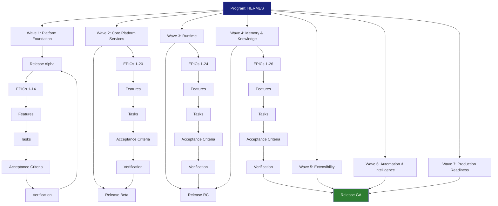
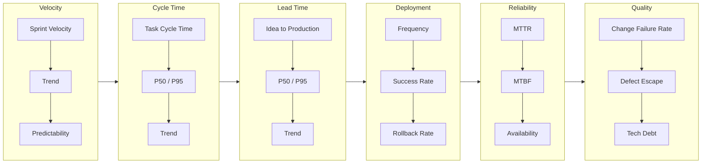
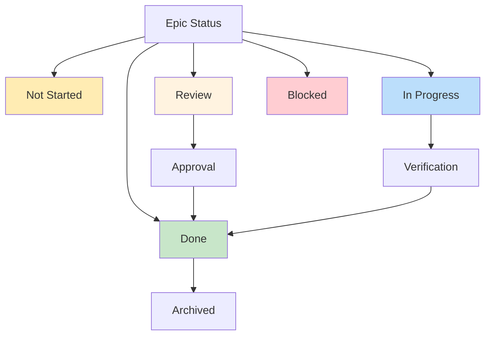
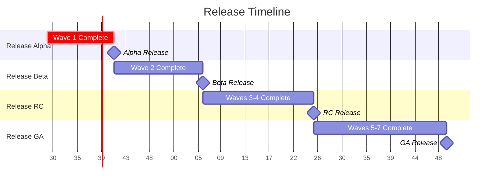
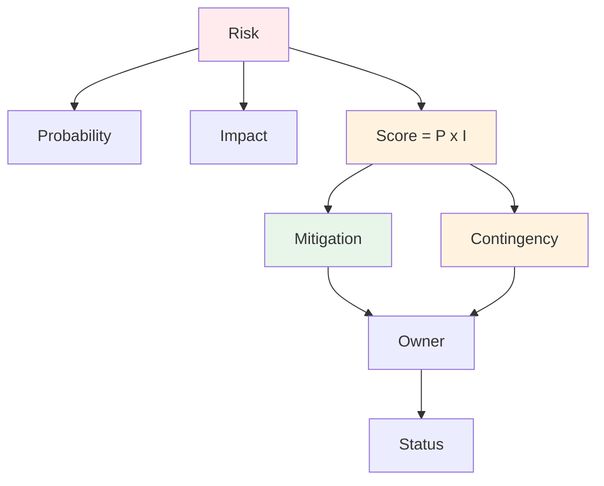
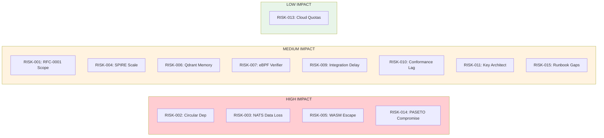
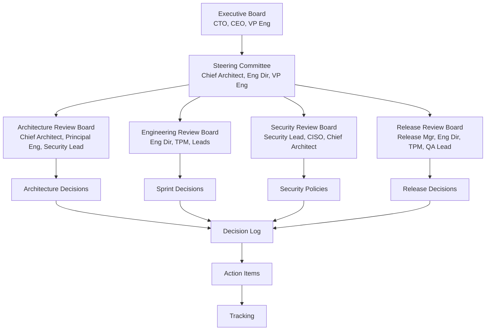

# HERMES ENGINEERING PROGRAM MANAGEMENT (EPM) v1.0

**Document Type:** Executive Engineering Management System
**Status:** Approved
**Version:** 1.0
**Classification:** Internal — Executive Leadership
**Authors:** CTO, Chief Architect, Engineering Director, TPM, PMO Lead, Release Manager
**Approvers:** CTO, Chief Architect, Engineering Director, VP Engineering
**Date:** 2026-07-25
**Sources:** RFC-0001 through RFC-0012, Phase 1 Architecture Baseline, Hermes Implementation Backlog v1.0

---

# 1. Executive Summary

## 1.1 Program Vision

**Hermes** is a distributed AI Operating System that transforms how autonomous agents execute, collaborate, and learn at enterprise scale. The program delivers a production-ready platform comprising 12 interconnected subsystems (RFC-0001 through RFC-0012) across 7 implementation waves, culminating in General Availability (GA) release.

**Vision Statement:** *Enable every organization to deploy, operate, and govern autonomous AI agents at scale with enterprise-grade security, observability, and control.*

## 1.2 Engineering Goals

| Goal | Description | Target |
|------|-------------|--------|
| **G-01** | Architecture-to-Code Traceability | 100% RFC requirements mapped to verified acceptance criteria |
| **G-02** | Predictable Delivery | > 85% sprint predictability; < 10% schedule variance |
| **G-03** | Quality by Design | Zero CRITICAL defects at GA; 100% conformance test pass |
| **G-04** | Security by Default | Zero CRITICAL/HIGH vulnerabilities at GA; 100% mTLS enforcement |
| **G-05** | Operational Excellence | < 30 min MTTR; 99.9% availability; 10x deployment frequency vs baseline |
| **G-06** | Architecture Compliance | Zero unapproved architectural deviations |

## 1.3 Program Scope

| In Scope | Out of Scope |
|----------|--------------|
| 12 RFC subsystems (RFC-0001 through RFC-0012) | Custom AI model training infrastructure |
| 7 implementation waves (60 sprints / 120 weeks) | Customer-specific agent development |
| 26 engineering epics, ~180 features, ~1,200 tasks | Third-party SaaS integrations beyond MCP |
| 4 releases (Alpha, Beta, RC, GA) | Third-party SaaS integrations beyond MCP |
| Full observability, security, automation | Hardware provisioning (cloud/on-prem abstracted) |
| Multi-region, DR, compliance, cost optimization | Marketing / sales enablement |

## 1.4 Success Metrics

| Metric | Target | Measurement |
|--------|--------|-------------|
| **Schedule** | GA within 120 weeks of kickoff | Weeks from Sprint 0 to GA Release |
| **Quality** | 100% conformance pass at GA | Conformance test suite pass rate |
| **Security** | Zero CRITICAL/HIGH at GA | Security scan results |
| **Availability** | > 99.9% post-GA | SLO dashboard |
| **Velocity** | Stable velocity ±10% after Sprint 6 | Sprint velocity tracking |
| **RFC Coverage** | 100% P0/P1 acceptance criteria verified | Traceability matrix |

## 1.5 Executive KPIs

| KPI | Target | Owner | Cadence |
|-----|--------|-------|---------|
| **Schedule Performance Index (SPI)** | >= 0.95 | TPM | Weekly |
| **Cost Performance Index (CPI)** | 0.95 – 1.05 | PMO Lead | Weekly |
| **Conformance Pass Rate** | 100% at GA | QA Lead | Per Release |
| **SLO Compliance** | >= 99.9% | SRE Lead | Daily |
| **Critical Defects** | 0 at GA | QA Lead | Per Release |
| **Architecture Compliance** | 0 unapproved deviations | Chief Architect | Per Sprint |
| **RFC Implementation Coverage** | 100% P0/P1 ACs | TPM | Per Release |

---

# 2. Program Structure

## 2.1 Hierarchy Definitions

| Level | Definition | Count | Example |
|-------|------------|-------|---------|
| **Program** | Complete Hermes delivery | 1 | HERMES |
| **Wave** | Major implementation phase with defined objectives | 7 | Wave 1: Platform Foundation |
| **Release** | Deployable increment with defined scope and quality | 4 | Alpha, Beta, RC, GA |
| **Epic** | Major engineering subsystem spanning multiple features | 26 | EPIC-003 Event Bus |
| **Feature** | User-visible capability within an epic | ~180 | FEAT-011 NATS Cluster |
| **Task** | Atomic engineering work unit (1-13 SP) | ~1,200 | TASK-0042 SPIRE Agent |
| **Acceptance Criteria** | Measurable completion condition | ~200 | AC-EBUS-03 |
| **Verification** | Test or review proving AC met | ~200 | Benchmark 10k msgs |
| **Release** | Deployable artifact with approval gates | 4 | Alpha, Beta, RC, GA |

---

# 3. Executive Dashboard

## 3.1 Overall Program Status

| Dimension | Status | Trend | Target | Owner |
|-----------|--------|-------|--------|-------|
| **Overall Completion** | 0% | — | 100% by Week 120 | TPM |
| **Wave 1 Progress** | 0% | — | 100% by Week 15 | Platform Lead |
| **Wave 2 Progress** | 0% | — | 100% by Week 31 | Core Lead |
| **Wave 3 Progress** | 0% | — | 100% by Week 51 | Runtime Lead |
| **Wave 4 Progress** | 0% | — | 100% by Week 71 | Data Lead |
| **Wave 5 Progress** | 0% | — | 100% by Week 91 | Extensibility Lead |
| **Wave 6 Progress** | 0% | — | 100% by Week 111 | Automation Lead |
| **Wave 7 Progress** | 0% | — | 100% by Week 120 | SRE Lead |

## 3.2 Epic & Feature Completion

| Metric | Current | Target | Owner |
|--------|---------|--------|-------|
| **Epics Not Started** | 26 | 0 by GA | TPM |
| **Epics In Progress** | 0 | <= 5 concurrent | TPM |
| **Epics Complete** | 0 | 26 by GA | TPM |
| **Features Not Started** | ~180 | 0 by GA | TPM |
| **Features Complete** | 0 | ~180 by GA | TPM |

## 3.3 Task & Acceptance Criteria

| Metric | Current | Target | Owner |
|--------|---------|--------|-------|
| **Tasks Not Started** | ~1,200 | 0 by GA | TPM |
| **Tasks Complete** | 0 | ~1,200 by GA | TPM |
| **ACs Not Verified** | ~200 | 0 by GA | QA Lead |
| **ACs Verified** | 0 | ~200 by GA | QA Lead |

## 3.4 Quality Gate Status

| Gate | Status | Pass Rate | Target | Owner |
|------|--------|-----------|--------|-------|
| Architecture Compliance | Not Started | 0% | 100% | Chief Architect | **MUST** achieve 100% before any release
| Code Review | Not Started | 0% | 100% | Tech Leads | **MUST** pass with 2 approvals
| Unit Testing (>80%) | Not Started | 0% | 100% | Dev Leads | **MUST** achieve >80% coverage
| Integration Testing | Not Started | 0% | 100% | QA Lead | **MUST** pass 100%
| Contract Testing | Not Started | 0% | 100% | QA Lead | **MUST** pass 100%
| Conformance Testing | Not Started | 0% | 100% | QA Lead | **MUST** pass 100%
| Security Scanning | Not Started | 0% | 100% | Security Lead | **MUST** have 0 CRITICAL/HIGH
| Performance Testing | Not Started | 0% | 100% | SRE Lead | **MUST** meet all SLOs
| Documentation | Not Started | 0% | 100% | Docs Lead | **MUST** be complete

## 3.5 Risk Exposure

| Risk Category | Open | High | Critical | Owner |
|---------------|------|------|----------|-------|
| Technical | 15 | 3 | 0 | Chief Architect |
| Schedule | 8 | 2 | 0 | TPM |
| Security | 5 | 1 | 0 | Security Lead |
| Resource | 4 | 1 | 0 | Engineering Director |
| Infrastructure | 3 | 0 | 0 | Infra Lead |

## 3.6 Critical Path Status

| Critical Path Item | Status | Slack | Owner |
|-------------------|--------|-------|-------|
| SPIRE Server Deployment | Not Started | 0 days | Security Lead |
| SPIRE Agent + SVID Issuance | Not Started | 0 days | Security Lead |
| mTLS Mesh Enforcement | Not Started | 0 days | Security Lead |
| NATS JetStream Cluster | Not Started | 0 days | Messaging Lead |
| Config Service | Not Started | 0 days | Platform Lead |
| Core Services Deployment | Not Started | 0 days | Core Lead |
| Event Bus Operational | Not Started | 0 days | Messaging Lead |
| Gateway Deployment | Not Started | 0 days | Gateway Lead |
| Observability Stack | Not Started | 0 days | Observability Lead |
| Conformance Test Suite | Not Started | 0 days | QA Lead |

## 3.7 Release Readiness

| Release | Readiness | Target Date | Go/No-Go | Owner |
|---------|-----------|-------------|----------|-------|
| Alpha (Wave 1) | 0% | Week 15 | Not Evaluated | Release Manager |
| Beta (Wave 2) | 0% | Week 31 | Not Evaluated | Release Manager |
| RC (Waves 3-4) | 0% | Week 51 | Not Evaluated | Release Manager |
| GA (Wave 7) | 0% | Week 120 | Not Evaluated | Release Manager |

---

# 4. Engineering Dashboard

## 4.1 Sprint Metrics

| Metric | Definition | Data Source | Target | Cadence |
|--------|------------|-------------|--------|---------|
| **Sprint Velocity** | Story points completed per sprint | Jira/GitHub | Stable +/-10% after Sprint 6 | Sprint |
| **Sprint Predictability** | % of committed SP completed | Jira | > 85% | Sprint |
| **Scope Change** | SP added/removed mid-sprint | Jira | < 10% | Sprint |

## 4.2 Cycle & Lead Time

| Metric | Definition | Data Source | Target | Cadence |
|--------|------------|-------------|--------|---------|
| **Cycle Time (P50)** | Task start to done | GitHub/Jira | < 5 days (P0), < 10 days (P1) | Weekly |
| **Cycle Time (P95)** | Task start to done | GitHub/Jira | < 15 days (P0), < 30 days (P1) | Weekly |
| **Lead Time (P50)** | Idea to Production | Jira + Deploy | < 30 days | Weekly |
| **Lead Time (P95)** | Idea to Production | Jira + Deploy | < 60 days | Weekly |

## 4.3 Deployment Metrics

| Metric | Definition | Data Source | Target | Cadence |
|--------|------------|-------------|--------|---------|
| **Deployment Frequency** | Deploys to production per week | ArgoCD/Flux | >= 5/week (post-Beta) | Daily |
| **Deployment Success Rate** | Successful deploys / total | ArgoCD | > 99% | Daily |
| **Rollback Rate** | Rollbacks / total deploys | ArgoCD | < 1% | Daily |
| **Mean Time to Deploy** | Code merge to prod available | CI/CD | < 30 min | Daily |

## 4.4 Reliability Metrics

| Metric | Definition | Data Source | Target | Cadence |
|--------|------------|-------------|--------|---------|
| **MTTR** | Mean time to resolve incidents | PagerDuty/Incident.io | < 30 min | Weekly |
| **MTBF** | Mean time between failures | Incident tracker | > 720 hours | Weekly |
| **Availability** | Uptime % | Prometheus/Alertmanager | > 99.9% | Daily |
| **SLO Compliance** | % of SLOs met | Grafana/SLO dashboard | > 99.9% | Daily |

## 4.5 Quality Metrics

| Metric | Definition | Data Source | Target | Cadence |
|--------|------------|-------------|--------|---------|
| **Change Failure Rate** | Failed changes / total changes | ArgoCD + Incident | < 5% | Weekly |
| **Defect Escape Rate** | Production defects / total defects | Jira | < 5% | Monthly |
| **Technical Debt Ratio** | Remediation cost / development cost | SonarQube | < 5% | Monthly |
| **Code Coverage** | Unit test coverage | CI | > 80% | Per PR |

## 4.6 Developer Productivity

| Metric | Definition | Data Source | Target | Cadence |
|--------|------------|-------------|--------|---------|
| **PR Cycle Time** | PR open to merge | GitHub | < 24 hours | Weekly |
| **Review Depth** | Comments per PR | GitHub | > 3 substantive | Weekly |
| **Build Time** | CI pipeline duration | CI | < 30 min | Daily |
| **Flaky Test Rate** | Flaky / total tests | CI | < 1% | Weekly |

---

# 5. Wave Management

## 5.1 Wave Summary

| Wave | Name | Sprints | Weeks | Start | End | Owner |
|------|------|---------|-------|-------|-----|-------|
| **1** | Platform Foundation | 0-6 | 0-12 | Week 0 | Week 12 | Platform Lead |
| **2** | Core Platform Services | 7-14 | 13-28 | Week 13 | Week 28 | Core Lead |
| **3** | Runtime | 15-24 | 29-48 | Week 29 | Week 48 | Runtime Lead |
| **4** | Memory & Knowledge | 25-34 | 49-68 | Week 49 | Week 68 | Data Lead |
| **5** | Extensibility | 35-44 | 69-88 | Week 69 | Week 88 | Extensibility Lead |
| **6** | Automation & Intelligence | 45-54 | 89-108 | Week 89 | Week 108 | Automation Lead |
| **7** | Production Readiness | 55-60 | 109-120 | Week 109 | Week 120 | SRE Lead |

## 5.2 Wave 1 — Platform Foundation

| Field | Detail |
|-------|--------|
| **Objectives** | Monorepo, CI/CD, K8s clusters, NATS, SPIRE, Vault, DB, Observability, Dev environment |
| **Duration** | 6 sprints (12 weeks) |
| **Key Deliverables** | W1-D1 through W1-D8 (see Backlog) |
| **Dependencies** | RFC-0001 sub-RFCs approved; Cloud accounts; DNS |
| **Progress** | 0% |
| **Exit Criteria** | All Phase 1 exit criteria met; Architecture Baseline signed; Conformance tests pass for RFC-0002, 0003, 0007, 0010 |
| **Blocking Issues** | RFC-0001 sub-RFC approval pending |
| **Owner** | Platform Lead |
| **Approval Gate** | Architecture Review Board + Chief Architect sign-off |

## 5.2 Wave 2 — Core Platform Services

| Field | Detail |
|-------|--------|
| **Objectives** | Config, Health, Identity, AuthZ, Secrets, State Manager, Workflow Engine, Scheduler, Registry |
| **Duration** | 8 sprints (16 weeks) |
| **Key Deliverables** | W2-D1 through W2-D10 |
| **Dependencies** | Wave 1 complete; Config schemas (CUE) defined |
| **Progress** | 0% |
| **Exit Criteria** | All services deployed; E2E integration test passes; Conformance tests pass |
| **Blocking Issues** | None |
| **Owner** | Core Lead |
| **Approval Gate** | Architecture Review Board; Engineering Director |

## 5.3 Wave 3 — Runtime

| Field | Detail |
|-------|--------|
| **Objectives** | Agent Lifecycle, Pool Manager, ACP, WASM Sandbox, Planner, Orchestrator, HITL, Checkpoint/Recovery |
| **Duration** | 10 sprints (20 weeks) |
| **Key Deliverables** | W3-D1 through W3-D10 |
| **Dependencies** | Wave 2 complete; WASM runtime validated; RFC-0009 baselined |
| **Progress** | 0% |
| **Exit Criteria** | Agent spawn to execute to checkpoint to recover demonstrated; Multi-agent workflow with saga; Conformance pass |
| **Blocking Issues** | WASM runtime validation pending |
| **Owner** | Runtime Lead |
| **Approval Gate** | Architecture Review Board; Security Lead |

## 5.4 Wave 4 — Memory & Knowledge

| Field | Detail |
|-------|--------|
| **Objectives** | 4-tier Memory, Consolidation, Knowledge Ingestion, RAG, Graph, Freshness |
| **Duration** | 10 sprints (20 weeks) |
| **Key Deliverables** | W4-D1 through W4-D10 |
| **Dependencies** | Wave 3 complete; Embedding models selected; Qdrant/Kuzu provisioned |
| **Progress** | 0% |
| **Exit Criteria** | Tier promotion/demotion E2E; Ingestion to RAG to Graph working; Conformance pass |
| **Blocking Issues** | Embedding model selection pending |
| **Owner** | Data Lead |
| **Approval Gate** | Architecture Review Board |

## 5.5 Wave 5 — Extensibility

| Field | Detail |
|-------|--------|
| **Objectives** | Tool/Plugin/Provider Registry, Plugin Loader, MCP Gateway, Provider Router, SDKs |
| **Duration** | 10 sprints (20 weeks) |
| **Key Deliverables** | W5-D1 through W5-D10 |
| **Dependencies** | Wave 3 complete; Wave 4 complete; MCP spec baselined |
| **Progress** | 0% |
| **Exit Criteria** | Custom tool to plugin to provider chain; MCP server to client tested; Conformance pass |
| **Blocking Issues** | MCP spec finalization pending |
| **Owner** | Extensibility Lead |
| **Approval Gate** | Architecture Review Board |

## 5.6 Wave 6 — Automation & Intelligence

| Field | Detail |
|-------|--------|
| **Objectives** | Rule Engine, Scheduler, Anomaly Detection (5 models), Remediation, Profile Agent, Playbooks |
| **Duration** | 10 sprints (20 weeks) |
| **Key Deliverables** | W6-D1 through W6-D10 |
| **Dependencies** | Wave 2 complete; Wave 3 complete; eBPF/CO-RE validated |
| **Progress** | 0% |
| **Exit Criteria** | Rule to anomaly to remediation chain; Profile-driven scaling demo; Conformance pass |
| **Blocking Issues** | eBPF/CO-RE validation pending |
| **Owner** | Automation Lead |
| **Approval Gate** | Architecture Review Board; Executive Sponsor |

## 5.7 Wave 7 — Production Readiness

| Field | Detail |
|-------|--------|
| **Objectives** | Multi-region, DR, Compliance, Cost Optimization, Runbooks, GA Release |
| **Duration** | 6 sprints (12 weeks) |
| **Key Deliverables** | W7-D1 through W7-D10 |
| **Dependencies** | Waves 1-6 complete; Compliance reqs finalized |
| **Progress** | 0% |
| **Exit Criteria** | All conformance pass; Load test 10x; Chaos engineering; DR drill; Compliance pre-audit pass |
| **Blocking Issues** | Compliance requirements TBD |
| **Owner** | SRE Lead |
| **Approval Gate** | Chief Architect + Executive Sponsor joint sign-off |

## 5.8 Wave Progress Dashboard

| Wave | Planned | Actual | Variance | Status |
|------|---------|--------|----------|--------|
| Wave 1 | 100% by Week 12 | 0% | 0% | Not Started |
| Wave 2 | 100% by Week 28 | 0% | 0% | Not Started |
| Wave 3 | 100% by Week 48 | 0% | 0% | Not Started |
| Wave 4 | 100% by Week 68 | 0% | 0% | Not Started |
| Wave 5 | 100% by Week 88 | 0% | 0% | Not Started |
| Wave 6 | 100% by Week 108 | 0% | 0% | Not Started |
| Wave 7 | 100% by Week 120 | 0% | 0% | Not Started |

## 3.4 Engineering Dashboard

## 4.1 Sprint Metrics

| Metric | Definition | Data Source | Target | Cadence |
|--------|------------|-------------|--------|---------|
| **Sprint Velocity** | Story points completed per sprint | Jira/GitHub | Stable +/-10% after Sprint 6 | Sprint |
| **Sprint Predictability** | % of committed SP completed | Jira | > 85% | Sprint |
| **Scope Change** | SP added/removed mid-sprint | Jira | < 10% | Sprint |

## 4.2 Cycle & Lead Time

| Metric | Definition | Data Source | Target | Cadence |
|--------|------------|-------------|--------|---------|
| **Cycle Time (P50)** | Task start to done | GitHub/Jira | < 5 days (P0), < 10 days (P1) | Weekly |
| **Cycle Time (P95)** | Task start to done | GitHub/Jira | < 15 days (P0), < 30 days (P1) | Weekly |
| **Lead Time (P50)** | Idea to Production | Jira + Deploy | < 30 days | Weekly |
| **Lead Time (P95)** | Idea to Production | Jira + Deploy | < 60 days | Weekly |

## 4.3 Deployment Metrics

| Metric | Definition | Data Source | Target | Cadence |
|--------|------------|-------------|--------|---------|
| **Deployment Frequency** | Deploys to production per week | ArgoCD/Flux | >= 5/week (post-Beta) | Daily |
| **Deployment Success Rate** | Successful deploys / total | ArgoCD | > 99% | Daily |
| **Rollback Rate** | Rollbacks / total deploys | ArgoCD | < 1% | Daily |
| **Mean Time to Deploy** | Code merge to prod available | CI/CD | < 30 min | Daily |

## 4.4 Reliability Metrics

| Metric | Definition | Data Source | Target | Cadence |
|--------|------------|-------------|--------|---------|
| **MTTR** | Mean time to resolve incidents | PagerDuty/Incident.io | < 30 min | Weekly |
| **MTBF** | Mean time between failures | Incident tracker | > 720 hours | Weekly |
| **Availability** | Uptime % | Prometheus/Alertmanager | > 99.9% | Daily |
| **SLO Compliance** | % of SLOs met | Grafana/SLO dashboard | > 99.9% | Daily |

## 4.6 Developer Productivity

| Metric | Definition | Data Source | Target | Cadence |
|--------|------------|-------------|--------|---------|
| **PR Cycle Time** | PR open to merge | GitHub | < 24 hours | Weekly |
| **Review Depth** | Comments per PR | GitHub | > 3 substantive | Weekly |
| **Build Time** | CI pipeline duration | CI | < 30 min | Daily |
| **Flaky Test Rate** | Flaky / total tests | CI | < 1% | Weekly |

---

# 5. Wave Management

## 5.1 Wave Summary

| Wave | Name | Sprints | Weeks | Start | End | Owner |
|------|------|---------|-------|-------|-----|-------|
| **1** | Platform Foundation | 0-6 | 0-12 | Week 0 | Week 12 | Platform Lead |
| **2** | Core Platform Services | 7-14 | 13-28 | Week 13 | Week 28 | Core Lead |
| **3** | Runtime | 15-24 | 29-48 | Week 29 | Week 48 | Runtime Lead |
| **4** | Memory & Knowledge | 25-34 | 49-68 | Week 49 | Week 68 | Data Lead |
| **5** | Extensibility | 35-44 | 69-88 | Week 69 | Week 88 | Extensibility Lead |
| **6** | Automation & Intelligence | 45-54 | 89-108 | Week 89 | Week 108 | Automation Lead |
| **7** | Production Readiness | 55-60 | 109-120 | Week 109 | Week 120 | SRE Lead |

## 5.1 Wave 1 — Platform Foundation

| Field | Detail |
|-------|--------|
| **Objectives** | Monorepo, CI/CD, K8s clusters, NATS, SPIRE, Vault, DB, Observability, Dev environment |
| **Duration** | 6 sprints (12 weeks) |
| **Key Deliverables** | W1-D1 through W1-D8 (see Backlog) |
| **Dependencies** | RFC-0001 sub-RFCs approved; Cloud accounts; DNS |
| **Progress** | 0% |
| **Exit Criteria** | All Phase 1 exit criteria met; Architecture Baseline signed; Conformance tests pass for RFC-0002, 0003, 0007, 0010 |
| **Blocking Issues** | RFC-0001 sub-RFC approval pending |
| **Owner** | Platform Lead |
| **Approval Gate** | Architecture Review Board + Chief Architect sign-off |

## 5.2 Wave 2 — Core Platform Services

| Field | Detail |
|-------|--------|
| **Objectives** | Config, Health, Identity, AuthZ, Secrets, State Manager, Workflow Engine, Scheduler, Registry |
| **Duration** | 8 sprints (16 weeks) |
| **Key Deliverables** | W2-D1 through W2-D10 |
| **Dependencies** | Wave 1 complete; Config schemas (CUE) defined |
| **Progress** | 0% |
| **Exit Criteria** | All services deployed; E2E integration test passes; Conformance tests pass |
| **Blocking Issues** | None |
| **Owner** | Core Lead |
| **Approval Gate** | Architecture Review Board; Engineering Director |

## 5.3 Wave 3 — Runtime

| Field | Detail |
|-------|--------|
| **Objectives** | Agent Lifecycle, Pool Manager, ACP, WASM Sandbox, Planner, Orchestrator, HITL, Checkpoint/Recovery |
| **Duration** | 10 sprints (20 weeks) |
| **Key Deliverables** | W3-D1 through W3-D10 |
| **Dependencies** | Wave 2 complete; WASM runtime validated; RFC-0009 baselined |
| **Progress** | 0% |
| **Exit Criteria** | Agent spawn to execute to checkpoint to recover demonstrated; Multi-agent workflow with saga; Conformance pass |
| **Blocking Issues** | WASM runtime validation pending |
| **Owner** | Runtime Lead |
| **Approval Gate** | Architecture Review Board; Security Lead |

## 5.4 Wave 4 — Memory & Knowledge

| Field | Detail |
|-------|--------|
| **Objectives** | 4-tier Memory, Consolidation, Knowledge Ingestion, RAG, Graph, Freshness |
| **Duration** | 10 sprints (20 weeks) |
| **Key Deliverables** | W4-D1 through W4-D10 |
| **Dependencies** | Wave 3 complete; Embedding models selected; Qdrant/Kuzu provisioned |
| **Progress** | 0% |
| **Exit Criteria** | Tier promotion/demotion E2E; Ingestion to RAG to Graph working; Conformance pass |
| **Blocking Issues** | Embedding model selection pending |
| **Owner** | Data Lead |
| **Approval Gate** | Architecture Review Board |

## 5.5 Wave 5 — Extensibility

| Field | Detail |
|-------|--------|
| **Objectives** | Tool/Plugin/Provider Registry, Plugin Loader, MCP Gateway, Provider Router, SDKs |
| **Duration** | 10 sprints (20 weeks) |
| **Key Deliverables** | W5-D1 through W5-D10 |
| **Dependencies** | Wave 3 complete; Wave 4 complete; MCP spec baselined |
| **Progress** | 0% |
| **Exit Criteria** | Custom tool to plugin to provider chain; MCP server to client tested; Conformance pass |
| **Blocking Issues** | MCP spec finalization pending |
| **Owner** | Extensibility Lead |
| **Approval Gate** | Architecture Review Board |

## 5.6 Wave 6 — Automation & Intelligence

| Field | Detail |
|-------|--------|
| **Objectives** | Rule Engine, Scheduler, Anomaly Detection (5 models), Remediation, Profile Agent, Playbooks |
| **Duration** | 10 sprints (20 weeks) |
| **Key Deliverables** | W6-D1 through W6-D10 |
| **Dependencies** | Wave 2 complete; Wave 3 complete; eBPF/CO-RE validated |
| **Progress** | 0% |
| **Exit Criteria** | Rule to anomaly to remediation chain; Profile-driven scaling demo; Conformance pass |
| **Blocking Issues** | eBPF/CO-RE validation pending |
| **Owner** | Automation Lead |
| **Approval Gate** | Architecture Review Board; Executive Sponsor |

## 5.7 Wave 7 — Production Readiness

| Field | Detail |
|-------|--------|
| **Objectives** | Multi-region, DR, Compliance, Cost Optimization, Runbooks, GA Release |
| **Duration** | 6 sprints (12 weeks) |
| **Key Deliverables** | W7-D1 through W7-D10 |
| **Dependencies** | Waves 1-6 complete; Compliance reqs finalized |
| **Progress** | 0% |
| **Exit Criteria** | All conformance pass; Load test 10x; Chaos engineering; DR drill; Compliance pre-audit pass |
| **Blocking Issues** | Compliance requirements TBD |
| **Owner** | SRE Lead |
| **Approval Gate** | Chief Architect + Executive Sponsor joint sign-off |

## 5.8 Wave Progress Dashboard

| Wave | Planned | Actual | Variance | Status |
|------|---------|--------|----------|--------|
| Wave 1 | 100% by Week 12 | 0% | 0% | Not Started |
| Wave 2 | 100% by Week 28 | 0% | 0% | Not Started |
| Wave 3 | 100% by Week 48 | 0% | 0% | Not Started |
| Wave 4 | 100% by Week 68 | 0% | 0% | Not Started |
| Wave 5 | 100% by Week 88 | 0% | 0% | Not Started |
| Wave 6 | 100% by Week 108 | 0% | 0% | Not Started |
| Wave 7 | 100% by Week 120 | 0% | 0% | Not Started |

---

# 6. Epic Tracking

## 6.1 Epic Status Summary

| Epic ID | Epic Name | Status | Progress | Owner | Dependencies | Risk | Quality | RFC Mapping |
|---------|-----------|--------|----------|-------|--------------|------|---------|-------------|
| EPIC-001 | Repository Infrastructure | Not Started | 0% | Release Eng | — | Low | — | Phase 1 |
| EPIC-002 | Kubernetes Platform | Not Started | 0% | Infra Lead | Cloud accounts | Medium | — | Phase 1 |
| EPIC-003 | Event Bus | Not Started | 0% | Messaging Lead | K8s, Certs | High | — | RFC-0003 |
| EPIC-004 | Identity & Authentication | Not Started | 0% | Security Lead | K8s, Certs | Critical | — | RFC-0007 |
| EPIC-005 | Authorization | Not Started | 0% | Security Lead | PG, Config | High | — | RFC-0007 |
| EPIC-006 | Secrets Management | Not Started | 0% | Security Lead | Vault | Critical | — | RFC-0007 |
| EPIC-007 | Gateway | Not Started | 0% | Gateway Lead | NATS, AuthZ | High | — | RFC-0004 |
| EPIC-008 | Configuration Service | Not Started | 0% | Platform Lead | NATS, PG | High | — | RFC-0002 |
| EPIC-009 | Health & Readiness | Not Started | 0% | Platform Lead | NATS, Config | Medium | — | RFC-0002 |
| EPIC-010 | State Manager | Not Started | 0% | Core Lead | PG, NATS, AuthZ | High | — | RFC-0002 |
| EPIC-011 | Workflow Engine | Not Started | 0% | Core Lead | State Mgr, NATS | High | — | RFC-0002 |
| EPIC-012 | Scheduler | Not Started | 0% | Core Lead | State Mgr, NATS | High | — | RFC-0002 |
| EPIC-013 | Registry | Not Started | 0% | Core Lead | State Mgr, NATS | High | — | RFC-0002 |
| EPIC-014 | Observability Platform | Not Started | 0% | Obs Lead | Config, Certs | High | — | RFC-0010 |
| EPIC-015 | Agent Runtime | Not Started | 0% | Runtime Lead | Core, Event Bus, Security | High | — | RFC-0008 |
| EPIC-016 | Agent Communication Protocol | Not Started | 0% | Runtime Lead | NATS, Security | High | — | RFC-0008 |
| EPIC-017 | WASM Sandbox | Not Started | 0% | Runtime Lead | Wasmtime, WASI | High | — | RFC-0008 |
| EPIC-018 | Planning & Task Orchestration | Not Started | 0% | Runtime Lead | Runtime, ACP | High | — | RFC-0008 |
| EPIC-019 | Memory Architecture | Not Started | 0% | Data Lead | Runtime, PG, Qdrant | High | — | RFC-0005 |
| EPIC-020 | Knowledge Architecture | Not Started | 0% | Data Lead | Memory, Kuzu | High | — | RFC-0006 |
| EPIC-021 | Tool/Plugin/Provider | Not Started | 0% | Ext Lead | Runtime, WASM | High | — | RFC-0009 |
| EPIC-022 | Provider Router | Not Started | 0% | Ext Lead | Provider Registry | Medium | — | RFC-0009 |
| EPIC-023 | Automation Platform | Not Started | 0% | Auto Lead | Event Bus, Obs | High | — | RFC-0011 |
| EPIC-024 | Continuous Profiling | Not Started | 0% | Obs Lead | eBPF, CO-RE | High | — | RFC-0012 |
| EPIC-025 | Multi-Region & DR | Not Started | 0% | Platform Lead | All | High | — | All |
| EPIC-026 | Compliance & Cost | Not Started | 0% | Compliance Lead | All | Medium | — | All |

---

# 7. Sprint Management

## 7.1 Sprint Calendar

| Sprint | Dates | Wave | Focus | Capacity (SP) |
|--------|-------|------|-------|---------------|
| Sprint 0 | Week 1-2 | 1 | Foundation | 200 |
| Sprint 1 | Week 3-4 | 1 | Infra Core | 300 |
| Sprint 2 | Week 5-6 | 1 | Security Infra | 300 |
| Sprint 3 | Week 7-8 | 1 | Platform Services | 350 |
| Sprint 4 | Week 9-10 | 1 | Core Services | 350 |
| Sprint 5 | Week 11-12 | 1 | Event Bus Ops | 300 |
| Sprint 6 | Week 13-14 | 1 | Gateway + Obs | 350 |
| Sprint 7 | Week 15 | 1 | Wave 1 Exit Review | 100 |
| Sprint 8 | Week 16-17 | 2 | Config Hardening | 300 |
| Sprint 9 | Week 18-19 | 2 | Health Enhancement | 300 |
| Sprint 10 | Week 20-21 | 2 | Identity Scaling | 300 |
| Sprint 11 | Week 22-23 | 2 | AuthZ Performance | 300 |
| Sprint 12 | Week 24-25 | 2 | Secrets Automation | 300 |
| Sprint 13 | Week 26-27 | 2 | State Manager Opt | 300 |
| Sprint 14 | Week 28-29 | 2 | Workflow Saga | 300 |
| Sprint 15 | Week 30-31 | 2 | Scheduler + Registry | 300 |
| Sprint 16 | Week 32-33 | 3 | Agent Lifecycle | 350 |
| Sprint 17 | Week 34-35 | 3 | Agent Pool Manager | 300 |
| Sprint 18 | Week 36-37 | 3 | ACP Protocol | 350 |
| Sprint 19 | Week 38-39 | 3 | WASM Sandbox | 350 |
| Sprint 20 | Week 40-41 | 3 | Planner Agent | 300 |
| Sprint 21 | Week 42-43 | 3 | Task Orchestrator | 350 |
| Sprint 21 | Week 44-45 | 3 | HITL Gates | 300 |
| Sprint 22 | Week 46-47 | 3 | Checkpoint/Recovery | 300 |
| Sprint 23 | Week 48-49 | 3 | Agent Manifest | 300 |
| Sprint 24 | Week 50-51 | 3 | Tool Executor Bridge | 300 |
| Sprint 25 | Week 52-53 | 4 | Working Memory | 300 |
| Sprint 26 | Week 54-55 | 4 | Episodic Memory | 300 |
| Sprint 27 | Week 56-57 | 4 | Semantic Memory | 300 |
| Sprint 28 | Week 58-59 | 4 | Procedural Memory | 300 |
| Sprint 29 | Week 60-61 | 4 | Consolidation Engine | 300 |
| Sprint 30 | Week 62-63 | 4 | Knowledge Ingestion | 300 |
| Sprint 31 | Week 64-65 | 4 | Hybrid Search | 300 |
| Sprint 32 | Week 66-67 | 4 | RAG Service | 300 |
| Sprint 33 | Week 68-69 | 4 | Knowledge Graph | 300 |
| Sprint 34 | Week 70-71 | 4 | Freshness Manager | 300 |
| Sprint 35 | Week 72-73 | 5 | Tool Registry | 300 |
| Sprint 36 | Week 74-75 | 5 | Plugin Loader | 300 |
| Sprint 37 | Week 76-77 | 5 | Provider Registry | 300 |
| Sprint 38 | Week 78-79 | 5 | MCP Gateway | 350 |
| Sprint 39 | Week 80-81 | 5 | Provider Router | 300 |
| Sprint 40 | Week 82-83 | 5 | Tool Executor | 300 |
| Sprint 41 | Week 84-85 | 5 | Capability Discovery | 300 |
| Sprint 42 | Week 86-87 | 5 | Supply Chain Attestation | 300 |
| Sprint 43 | Week 88-89 | 5 | Plugin Dependency Resolution | 300 |
| Sprint 44 | Week 90-91 | 5 | Developer SDK | 300 |
| Sprint 45 | Week 92-93 | 6 | Rule Engine | 350 |
| Sprint 46 | Week 94-95 | 6 | Scheduler | 350 |
| Sprint 47 | Week 96-97 | 6 | Anomaly Detection | 350 |
| Sprint 48 | Week 98-99 | 6 | Remediation Engine | 350 |
| Sprint 49 | Week 100-101 | 6 | Automation Governance | 300 |
| Sprint 50 | Week 102-103 | 6 | Profile Agent | 350 |
| Sprint 51 | Week 104-105 | 6 | Profile Ingestion | 300 |
| Sprint 52 | Week 106-107 | 6 | Profile Query API | 300 |
| Sprint 53 | Week 108-109 | 6 | Profiling-Automation Integration | 300 |
| Sprint 54 | Week 110-111 | 6 | Automation Playbooks | 300 |
| Sprint 55 | Week 112-113 | 7 | Multi-region NATS + GeoDNS | 350 |
| Sprint 56 | Week 114-115 | 7 | Disaster Recovery | 300 |
| Sprint 57 | Week 116-117 | 7 | Compliance Dashboard | 300 |
| Sprint 58 | Week 118-119 | 7 | Cost Optimization | 300 |
| Sprint 59 | Week 120-121 | 7 | GA Release + Runbooks | 400 |
| Sprint 60 | Week 122-123 | 7 | GA Approval & Handoff | 200 |

## 7.2 Sprint Management Process

| Ceremony | Cadence | Duration | Participants | Owner |
|----------|---------|----------|--------------|-------|
| **Sprint Planning** | Bi-weekly | 2 hours | Team, PO, TPM | Scrum Master |
| **Daily Standup** | Daily | 15 min | Team | Scrum Master |
| **Backlog Refinement** | Weekly | 1 hour | Team, PO | PO |
| **Sprint Review** | Bi-weekly | 1 hour | Team, Stakeholders | PO |
| **Sprint Retrospective** | Bi-weekly | 1 hour | Team | Scrum Master |
| **Dependency Sync** | Weekly | 30 min | TPM, Leads | TPM |

## 7.3 Sprint Metrics Tracking

| Sprint | Committed SP | Completed SP | Predictability | Carryover | Velocity | Notes |
|--------|-------------|--------------|----------------|-----------|----------|-------|
| Sprint 0 | 200 | TBD | TBD | 0 | TBD | — |
| Sprint 1 | 300 | TBD | TBD | 0 | TBD | — |

## 7.4 Capacity Planning

| Team | Engineers | SP/Sprint (Avg) | Sprint 0-6 Allocation | Sprint 7-14 Allocation |
|------|-----------|-----------------|----------------------|------------------------|
| Platform | 6 | 50 | 100% Wave 1 | 50% Wave 2, 25% Wave 3 |
| Infrastructure | 4 | 40 | 100% Wave 1 | 50% Wave 2 |
| Event Bus | 4 | 40 | 100% Wave 1 | 100% Wave 2 |
| Core Platform | 6 | 50 | — | 100% Wave 2 |
| Runtime | 6 | 50 | — | 25% Wave 2, 100% Wave 3 |
| Data | 5 | 45 | — | 25% Wave 3, 100% Wave 4 |
| Extensibility | 4 | 40 | — | 25% Wave 3, 100% Wave 5 |
| Automation | 4 | 40 | — | — |
| Observability | 4 | 40 | 100% Wave 1-2 | 50% Wave 3-4 |
| Gateway | 4 | 40 | 50% Wave 1-2 | 50% Wave 2 |
| Security | 4 | 40 | 100% Wave 1-2 | 50% Wave 3-4 |
| SRE | 3 | 30 | 25% Wave 1-2 | 25% Wave 3-6 |
| QA | 4 | 40 | 50% all waves | 50% all waves |
| Documentation | 2 | 20 | 25% all waves | 25% all waves |

---

# 8. Release Management

## 8.1 Release Overview

## 8.2 Release Definitions

### 8.1 Release Alpha (End of Wave 1, Sprint 7)

| Aspect | Detail |
|--------|--------|
| **Scope** | Platform Foundation: Monorepo, CI/CD, K8s, NATS, SPIRE, Vault, DB, Observability |
| **Features** | Infrastructure only; no user-facing services |
| **Exit Criteria** | Phase 1 exit criteria met; Architecture Baseline signed |
| **Quality Gates** | Conformance: RFC-0002, 0003, 0007, 0010 |
| **Approval** | Chief Architect sign-off on Baseline |
| **Audience** | Internal engineering only |
| **Rollback Plan** | Terraform destroy; cluster reprovision < 30 min |

### 8.2 Release Beta (End of Wave 2, Sprint 15)

| Aspect | Detail |
|--------|--------|
| **Scope** | Core Platform Services: Config, Health, Identity, AuthZ, Secrets, State, Workflow, Scheduler, Registry, Event Bus |
| **Features** | Core services communicating; workflows executing; event bus operational |
| **Exit Criteria** | Conformance suites pass for RFC-0002, 0003, 0007 |
| **Quality Gates** | Integration tests green; load test baseline; security review pass |
| **Approval** | Architecture Review Board; Engineering Director |
| **Audience** | Internal + Design Partners |
| **Rollback Plan** | Service-level rollback via FluxCD; data migration reversible |

### 8.3 Release RC (End of Wave 4, Sprint 35)

| Aspect | Detail |
|--------|--------|
| **Scope** | Runtime + Memory + Knowledge: Agent lifecycle, ACP, WASM, Planning, 4-tier Memory, Ingestion, RAG, Graph |
| **Features** | Full agent orchestration; memory hierarchy; knowledge pipeline |
| **Exit Criteria** | Conformance suites pass for RFC-0005, 0006, 0008 |
| **Quality Gates** | Multi-agent workflows demonstrated; load test 2x; chaos experiments |
| **Approval** | Architecture Review Board; Engineering Director; Security Lead |
| **Audience** | Internal + Design Partners + Early Access Customers |
| **Rollback Plan** | Blue/green per service; data migration backward compatible |

### 8.4 Release GA (End of Wave 7, Sprint 60)

| Aspect | Detail |
|--------|--------|
| **Scope** | Full Platform: All RFCs (0001-0012) implemented, tested, hardened |
| **Features** | Extensibility, Automation, Profiling, Multi-region, DR, Compliance, Cost Optimization |
| **Exit Criteria** | All conformance suites pass; load test 10x; chaos engineering; DR drill; compliance pre-audit |
| **Quality Gates** | All conformance pass; 10x load test; chaos experiments; DR drill; compliance pre-audit |
| **Approval** | Chief Architect + Executive Sponsor joint sign-off |
| **Audience** | General Availability |
| **Rollback Plan** | Full platform rollback tested; RTO < 1h; RPO < 5 min |

## 8.3 Go/No-Go Checklist (Per Release)

| Criterion | Alpha | Beta | RC | GA |
|-----------|-------|------|----|-----|
| All planned features complete | ☐ | ☐ | ☐ | ☐ |
| All acceptance criteria verified | ☐ | ☐ | ☐ | ☐ |
| Conformance suites 100% pass | ☐ | ☐ | ☐ | ☐ |
| Security scan: 0 CRITICAL/HIGH | ☐ | ☐ | ☐ | ☐ |
| Performance benchmarks met | ☐ | ☐ | ☐ | ☐ |
| Integration tests 100% pass | ☐ | ☐ | ☐ | ☐ |
| Chaos engineering passed | — | — | ☐ | ☐ |
| Load test at target multiplier | — | 2x | 5x | 10x |
| DR drill passed | — | — | ☐ | ☐ |
| Compliance pre-audit passed | — | — | — | ☐ |
| Architecture Review Board approval | ☐ | ☐ | ☐ | ☐ |
| Engineering Director approval | ☐ | ☐ | ☐ | ☐ |
| Chief Architect approval | ☐ | ☐ | ☐ | ☐ |
| Executive Sponsor approval | — | — | — | ☐ |
| Rollback plan tested | ☐ | ☐ | ☐ | ☐ |
| Runbooks complete | ☐ | ☐ | ☐ | ☐ |
| Release notes drafted | ☐ | ☐ | ☐ | ☐ |
| Migration guide (if applicable) | — | ☐ | ☐ | ☐ |

## 8.4 Rollback Readiness

| Release | Rollback Strategy | RTO | RPO | Tested |
|---------|-------------------|-----|-----|--------|
| Alpha | Full cluster reprovision | < 30 min | 0 | Yes (Weekly) |
| Beta | Service-level FluxCD rollback | < 15 min | 0 | Yes (Per Sprint) |
| RC | Blue/Green per service | < 10 min | 0 | Yes (Pre-RC) |
| GA | Full platform rollback + DR | < 1 hour | < 5 min | Yes (GA - 2 weeks) |

---

# 9. Quality Dashboard

## 9.1 Quality Gate Status

| Quality Dimension | Metric | Current | Target | Status | Owner | Data Source |
|-------------------|--------|---------|--------|--------|-------|-------------|
| **Code Coverage** | Unit test coverage % | 0% | > 80% | ❌ | Dev Leads | CI |
| **Static Analysis** | golangci-lint/staticcheck findings | N/A | 0 errors | ❌ | Dev Leads | CI |
| **Security Findings** | CRITICAL / HIGH / MEDIUM | N/A | 0 / 0 / < 10 | ❌ | Security Lead | Trivy/Gosec |
| **Performance** | API p99 latency vs SLO | N/A | Within SLO | ❌ | SRE Lead | Grafana |
| **Contract Tests** | Pact verification pass rate | 0% | 100% | ❌ | QA Lead | Pact Broker |
| **Conformance Tests** | RFC suite pass rate | 0% | 100% | ❌ | QA Lead | CI |
| **Integration Tests** | Cross-service test pass rate | 0% | 100% | ❌ | QA Lead | CI |
| **Documentation** | API specs, runbooks, ADRs complete | 0% | 100% | ❌ | Docs Lead | CI/ReadTheDocs |
| **RFC Compliance** | Implementation matches RFC | 0% | 100% | ❌ | Chief Architect | Traceability |
| **Acceptance Completion** | ACs verified / total | 0% | 100% | ❌ | QA Lead | Traceability |

## 9.2 Quality Trend Tracking

| Metric | Week 1 | Week 2 | Week 4 | Week 8 | Week 12 | Target |
|--------|--------|--------|--------|--------|---------|--------|
| Unit Coverage | 0% | 10% | 40% | 70% | 85% | > 80% |
| Conformance Pass | 0% | 0% | 20% | 60% | 90% | 100% |
| Security Findings (HIGH) | N/A | 5 | 3 | 1 | 0 | 0 |
| Contract Test Pass | 0% | 10% | 40% | 80% | 95% | 100% |
| Integration Pass | 0% | 0% | 30% | 70% | 95% | 100% |

## 9.3 Quality Gate Enforcement

| Gate | Enforcement Point | Blocking | Automation |
|------|-------------------|----------|------------|
| Architecture Compliance | PR merge | Yes | Custom CI check |
| Code Review | PR merge | Yes | GitHub Branch Protection |
| Unit Testing | PR merge | Yes | CI Pipeline |
| Static Analysis | PR merge | Yes | CI Pipeline |
| Security Scan | PR merge + Nightly | Yes | CI Pipeline |
| Contract Tests | PR merge + Nightly | Yes | Pact Broker Webhook |
| Integration Tests | Nightly + Release Branch | Yes | CI Pipeline |
| Conformance Tests | Release Branch | Yes | CI Pipeline |
| Security Scan (Release) | Release Branch | Yes | CI Pipeline |
| Performance Tests | Release Branch | Yes | k6/hey in CI |
| Documentation | Release Branch | Yes | Doc Build + Lint |
| Release Approval | Tag Creation | Yes | Manual (Release Manager) |

---

# 10. Risk Management

## 10.1 Risk Register

| Risk ID | Category | Description | Probability | Impact | Score | Mitigation | Contingency | Owner | Status |
|---------|----------|-------------|-------------|--------|-------|------------|-------------|-------|--------|
| RISK-001 | Technical | RFC-0001 sub-RFC scope creep delays baseline | Medium | High | 15 | Time-box reviews; Architecture Review Board gate | Executive escalation; parallel track | Chief Architect | Open |
| RISK-002 | Technical | Circular dependency between RFCs | Low | Critical | 20 | Dependency Matrix validation in CI | Refactor; architecture review | Principal Architect | Open |
| RISK-003 | Technical | NATS JetStream data loss at scale | Low | Critical | 20 | 3x replication; backup/restore tested monthly | Cross-region replica; manual replay | Messaging Lead | Open |
| RISK-004 | Technical | SPIRE/SPIRE performance at scale | Medium | High | 15 | Load test before prod; caching; monitoring | Fallback to static SVIDs | Security Lead | Open |
| RISK-005 | Technical | WASM sandbox escape vulnerability | Low | Critical | 20 | Wasmtime latest; fuel metering; capability tokens | Disable WASM; use container sandbox | Runtime Lead | Open |
| RISK-006 | Technical | Vector DB (Qdrant) memory pressure | Medium | High | 15 | Tiered storage; quantization; monitoring | Read-only mode; horizontal scale | Data Lead | Open |
| RISK-007 | Technical | eBPF kernel verifier rejection | Medium | High | 15 | CO-RE; kernel matrix CI (5.10, 5.15, 6.1, 6.6) | Fallback to SDK profiling | Observability Lead | Open |
| RISK-008 | Program | Team capacity constraints (parallel waves) | High | Medium | 18 | Clear prioritization; P0 only in current wave | Delay lower waves; hire contractors | TPM | Open |
| RISK-009 | Program | Cross-team integration delays | Medium | High | 15 | Contract-first dev; mock servers; shared schemas | Integration sprint; dedicated integration team | TPM | Open |
| RISK-010 | Program | Conformance test development lag | Medium | High | 15 | Start early; reuse RFC test patterns; dedicate QA | Delay release; manual validation | QA Lead | Open |
| RISK-011 | Resource | Key architect unavailable | Medium | High | 15 | Deputy architect designated; docs current | Executive interim | Engineering Director | Open |
| RISK-012 | Resource | Specialized skill gaps (eBPF, Cedar, NATS) | Medium | Medium | 12 | Training budget ($50k/engineer); pair programming | External consultants | Engineering Director | Open |
| RISK-013 | Infrastructure | Cloud provider quota limits | Low | High | 10 | Pre-request quotas; multi-cloud strategy | Alternative regions | Infra Lead | Open |
| RISK-014 | Security | PASETO key compromise | Low | Critical | 20 | HSM-backed keys; rotation; audit | Emergency rotation; revoke all | Security Lead | Open |
| RISK-015 | Operational | Runbook gaps during incidents | Medium | High | 15 | Runbook-driven development; game days | On-call escalation; war room | SRE Lead | Open |

## 10.2 Risk Heat Map

## 10.3 Risk Status Tracking

| Risk ID | Current Status | Last Review | Next Review | Mitigation Progress |
|---------|----------------|-------------|-------------|---------------------|
| RISK-001 | Open | 2026-07-25 | 2026-08-08 | 0% |
| RISK-002 | Open | 2026-07-25 | 2026-08-08 | 0% |
| RISK-003 | Open | 2026-07-25 | 2026-08-22 | 0% |
| RISK-004 | Open | 2026-07-25 | 2026-08-22 | 0% |
| RISK-005 | Open | 2026-07-25 | 2026-09-19 | 0% |
| RISK-006 | Open | 2026-07-25 | 2026-09-19 | 0% |
| RISK-007 | Open | 2026-07-25 | 2026-08-22 | 0% |
| RISK-008 | Open | 2026-07-25 | 2026-08-08 | 0% |
| RISK-009 | Open | 2026-07-25 | 2026-08-08 | 0% |
| RISK-010 | Open | 2026-07-25 | 2026-08-08 | 0% |
| RISK-011 | Open | 2026-07-25 | 2026-08-22 | 0% |
| RISK-012 | Open | 2026-07-25 | 2026-08-22 | 0% |
| RISK-013 | Open | 2026-07-25 | 2026-08-22 | 0% |
| RISK-014 | Open | 2026-07-25 | 2026-08-22 | 0% |
| RISK-015 | Open | 2026-07-25 | 2026-08-08 | 0% |

---

# 11. Governance

## 11.1 Governance Structure

## 11.2 Review Cadence

| Review | Cadence | Duration | Participants | Chair | Output |
|--------|---------|----------|--------------|-------|--------|
| **Architecture Review** | Per Epic + Ad-hoc | 2 hours | ARB, Epic Owner, Security | Chief Architect | ADR or Rejection |
| **Engineering Review** | Bi-weekly | 1 hour | ERB, Team Leads | Engineering Director | Sprint Adjustments |
| **Security Review** | Per Release + Ad-hoc | 2 hours | SRB, Security Lead, Epic Owner | Security Lead | Security Exception or Approval |
| **Release Review** | Pre-Release | 1 hour | RRB, Release Manager, TPM | Release Manager | Go/No-Go Decision |
| **Executive Review** | Monthly | 1 hour | CTO, Eng Dir, VP Eng, TPM | CTO | Program Direction |
| **Board Review** | Quarterly | 30 min | CTO, CEO, VP Eng | CTO | Strategic Alignment |

## 11.3 Decision Log

| Decision ID | Date | Decision | Rationale | Owner | Status |
|-------------|------|----------|-----------|-------|--------|
| DEC-001 | 2026-07-25 | Adopt Phase 1 Baseline as execution baseline | Aligns all teams on approved architecture | Chief Architect | Approved |
| DEC-002 | 2026-07-25 | 7-wave implementation plan approved | Balances risk, value, and team capacity | TPM | Approved |
| DEC-003 | 2026-07-25 | SPIRE + Istio Ambient for mTLS | Best fit for zero-trust; CNCF graduated | Security Lead | Approved |
| DEC-004 | 2026-07-25 | FluxCD for GitOps | CNCF graduated; kustomize native | Platform Lead | Approved |
| DEC-005 | 2026-07-25 | Wasmtime for WASM runtime | Best WASI 0.2 support; fuel metering | Runtime Lead | Approved |

## 11.4 Action Item Tracker

| Action ID | Source | Description | Owner | Due Date | Status |
|-----------|--------|-------------|-------|----------|--------|
| ACT-001 | DEC-001 | Publish Architecture Baseline v1.0 to all teams | Chief Architect | 2026-07-28 | Open |
| ACT-002 | DEC-002 | Distribute 7-wave sprint calendar to all teams | TPM | 2026-07-28 | Open |
| ACT-003 | DEC-003 | Provision SPIRE cluster in all environments | Security Lead | 2026-08-01 | Open |
| ACT-004 | DEC-004 | Configure FluxCD bootstrap for all clusters | Platform Lead | 2026-08-01 | Open |
| ACT-005 | DEC-005 | Validate Wasmtime fuel metering on target kernels | Runtime Lead | 2026-08-15 | Open |

---

# 12. Resource Planning

## 12.1 Engineering Capacity

| Team | Engineers | Sprint Capacity (SP) | Wave 1 | Wave 2 | Wave 3 | Wave 4 | Wave 5 | Wave 6 | Wave 7 |
|------|-----------|----------------------|--------|--------|--------|--------|--------|--------|--------|
| Platform | 6 | 50 | 100% | 50% | 25% | — | — | — | — |
| Infrastructure | 4 | 40 | 100% | 50% | — | — | — | — | 25% |
| Event Bus | 4 | 40 | 100% | 100% | 25% | — | — | — | 25% |
| Core Platform | 6 | 50 | — | 100% | 25% | — | — | — | — |
| Runtime | 6 | 50 | — | 25% | 100% | 25% | 25% | — | — |
| Data | 5 | 45 | — | — | 25% | 100% | — | — | — |
| Extensibility | 4 | 40 | — | — | 25% | 25% | 100% | — | — |
| Automation | 4 | 40 | — | — | — | — | — | 100% | — |
| Observability | 4 | 40 | 100% | 50% | 50% | 50% | — | 50% | 50% |
| Gateway | 4 | 40 | 50% | 100% | 25% | — | — | — | 25% |
| Security | 4 | 40 | 100% | 100% | 50% | 50% | 50% | 50% | 50% |
| SRE | 3 | 30 | 25% | 25% | 50% | 50% | 50% | 50% | 100% |
| QA | 4 | 40 | 50% | 50% | 50% | 50% | 50% | 50% | 50% |
| Documentation | 2 | 20 | 25% | 25% | 25% | 25% | 25% | 25% | 50% |

**Total Capacity:** 60 engineers, ~5,200 SP/sprint at full allocation

## 12.2 Hiring Plan

| Quarter | Roles | Count | Priority | Budget |
|---------|-------|-------|----------|--------|
| Q3 2026 | eBPF Engineer, Cedar Specialist | 2 | High | $400k |
| Q4 2026 | WASM Runtime Engineer, NATS Expert | 2 | High | $400k |
| Q1 2027 | Distributed Systems Engineers | 4 | Medium | $800k |
| Q2 2027 | SREs, Security Engineers | 3 | Medium | $600k |
| **Total** | | **11** | | **$2.2M** |

## 12.3 Infrastructure Utilization (Projected)

| Resource | Wave 1 | Wave 2 | Wave 3 | Wave 4 | Wave 5 | Wave 6 | Wave 7 |
|----------|--------|--------|--------|--------|--------|--------|--------|
| K8s Nodes (CPU cores) | 200 | 400 | 800 | 1,200 | 1,500 | 2,000 | 3,000 |
| NATS Streams | 9 | 9 | 12 | 15 | 18 | 20 | 25 |
| PostgreSQL (TB) | 2 | 5 | 10 | 20 | 30 | 40 | 50 |
| Redis (GB) | 100 | 200 | 500 | 800 | 1,000 | 1,500 | 2,000 |
| Object Storage (PB) | 0.5 | 1 | 2 | 5 | 10 | 15 | 20 |
| GPU Nodes (for ML) | 0 | 0 | 0 | 4 | 8 | 16 | 32 |

## 12.4 Budget Tracking

| Category | FY 2026 H2 | FY 2027 H1 | FY 2027 H2 | Total |
|----------|------------|------------|------------|-------|
| Engineering Salaries | $4.2M | $5.5M | $5.5M | $15.2M |
| Cloud Infrastructure | $0.8M | $1.5M | $2.5M | $4.8M |
| Tools & Licenses | $0.2M | $0.3M | $0.3M | $0.8M |
| Training & Hiring | $0.4M | $0.4M | $0.2M | $1.0M |
| Contingency (10%) | $0.5M | $0.7M | $0.8M | $2.0M |
| **Total** | **$6.1M** | **$8.4M** | **$9.3M** | **$23.8M** |

---

# 13. KPI Dashboard

```mermaid
flowchart TD
    KPI[KPI Dashboard] --> ENG[Engineering]
    KPI --> PROG[Program]
    KPI --> QUAL[Quality]
    KPI --> SEC[Security]
    KPI --> OPS[Operations]
    KPI --> FIN[Financial]
    
    ENG --> V1[Velocity]
    ENG --> V2[Predictability]
    ENG --> V3[Cycle Time]
    ENG --> V4[Lead Time]
    ENG --> V5[PR Cycle]
    
    PROG --> P1[SPI]
    PROG --> P2[CPI]
    PROG --> P3[Wave Progress]
    PROG --> P4[Release Readiness]
    
    QUAL --> Q1[Coverage]
    QUAL --> Q2[Conformance]
    QUAL --> Q3[Defect Escape]
    QUAL --> Q4[Tech Debt]
    QUAL --> Q5[RFC Coverage]
    
    SEC --> S1[Vulns]
    SEC --> S2[mTLS]
    SEC --> S3[Audit]
    SEC --> S4[Compliance]
    
    OPS --> O1[Availability]
    OPS --> O2[MTTR]
    OPS --> O3[SLO]
    OPS --> O4[Deploy Freq]
    OPS --> O5[CFR]
    
    FIN --> F1[Budget Variance]
    FIN --> F2[Forecast Accuracy]
    FIN --> F3[Cost/Tenant]
```

## 13.1 KPI Definitions

| KPI | Definition | Formula | Target | Owner | Cadence | Data Source |
|-----|------------|---------|--------|-------|---------|-------------|
| **Sprint Velocity** | Story points completed per sprint | Sum SP Done / Sprint | Stable +/-10% | Scrum Masters | Sprint | Jira |
| **Sprint Predictability** | Committed vs Completed | SP Done / SP Committed | > 85% | Scrum Masters | Sprint | Jira |
| **SPI** | Schedule Performance Index | EV / PV | >= 0.95 | TPM | Weekly | Jira + Plan |
| **CPI** | Cost Performance Index | EV / AC | 0.95-1.05 | PMO Lead | Weekly | Finance + Jira |
| **Cycle Time (P50)** | Task start to done | Percentile(Task Done - Task Start) | < 5d P0, < 10d P1 | Dev Leads | Weekly | GitHub |
| **Cycle Time (P95)** | Task start to done | Percentile(Task Done - Task Start) | < 15d P0, < 30d P1 | Dev Leads | Weekly | GitHub |
| **Lead Time (P50)** | Idea to Production | Percentile(Deploy - Idea Created) | < 30 days | TPM | Weekly | Jira + Deploy |
| **Deployment Frequency** | Deploys to prod per week | Count(Deploys) / Week | >= 5/week (post-Beta) | Release Mgr | Daily | ArgoCD |
| **Change Failure Rate** | Failed deployments / Total | Failed / Total | < 5% | Release Mgr | Weekly | ArgoCD |
| **MTTR** | Mean Time To Resolve | Mean(Resolve - Detect) | < 30 min | SRE Lead | Weekly | Incident.io |
| **Availability** | Uptime % | Uptime / Total | > 99.9% | SRE Lead | Daily | Prometheus |
| **SLO Compliance** | % of SLOs met | Compliant SLOs / Total SLOs | > 99.9% | SRE Lead | Daily | Grafana |
| **Code Coverage** | Unit test coverage | Covered Lines / Total Lines | > 80% | Dev Leads | Per PR | CI |
| **Conformance Pass Rate** | Pass / Total | Passed / Total | 100% at GA | QA Lead | Per Release | CI |
| **Defect Escape Rate** | Prod defects / Total defects | Prod Defects / (Prod + Pre-prod) | < 5% | QA Lead | Monthly | Jira |
| **RFC Coverage** | ACs verified / Total P0/P1 ACs | Verified / Total | 100% at GA | QA Lead | Per Release | Traceability |
| **Critical Vulnerabilities** | CRITICAL/HIGH vulns in prod | Count | 0 at GA | Security Lead | Daily | Trivy |
| **mTLS Enforcement** | % service-to-service mTLS | mTLS Connections / Total | 100% | Security Lead | Daily | Istio |
| **Budget Variance** | Actual vs Planned | (Actual - Planned) / Planned | +/- 10% | PMO Lead | Weekly | Finance |
| **Forecast Accuracy** | Forecast vs Actual | 1 - |Forecast - Actual| / Actual | < 10% | PMO Lead | Monthly | Finance |

---

# 14. Executive Reports

## 14.1 Weekly Report Template

| Section | Content | Owner |
|---------|---------|-------|
| **Program Summary** | Overall status, key achievements, blockers | TPM |
| **Wave Progress** | Each wave progress %, blockers | Wave Leads |
| **Sprint Summary** | Sprint velocity, predictability, carryover | Scrum Masters |
| **Risk Update** | New risks, mitigation progress, escalations | TPM |
| **Quality Status** | Conformance pass rate, security findings | QA Lead |
| **Release Status** | Current release readiness, Go/No-Go | Release Manager |
| **Resource Status** | Team capacity, hiring updates, budget | PMO Lead |
| **Key Decisions** | Architecture decisions, escalations | Chief Architect |
| **Upcoming Milestones** | Next 2 weeks key dates | TPM |

## 14.2 Monthly Report Template

| Section | Content | Owner |
|---------|---------|-------|
| **Executive Summary** | Program health, key metrics, trajectory | TPM |
| **Wave Progress** | Detailed wave progress vs plan | Wave Leads |
| **Velocity & Predictability** | Sprint trends, capacity utilization | Scrum Masters |
| **Quality Trends** | Conformance, coverage, defects trends | QA Lead |
| **Security Posture** | Vulnerabilities, mTLS, audit status | Security Lead |
| **Risk Dashboard** | Risk heat map, mitigation status | TPM |
| **Release Readiness** | Current release status, Go/No-Go | Release Manager |
| **Resource & Budget** | Capacity, hiring, burn rate, forecast | PMO Lead |
| **Strategic Decisions** | Architecture decisions, key trade-offs | Chief Architect |
| **Upcoming Priorities** | Next month focus areas | TPM |

## 14.3 Quarterly Report Template

| Section | Content | Owner |
|---------|---------|-------|
| **Strategic Assessment** | Program health, trajectory, strategic alignment | CTO |
| **Wave Completion** | Cumulative wave progress, variance | TPM |
| **Release Readiness** | GA readiness assessment | Release Manager |
| **Architecture Evolution** | ADRs, trade-offs, technical debt | Chief Architect |
| **Security & Compliance** | Audit readiness, certifications | Security Lead |
| **Financial Performance** | Budget vs actual, forecast | PMO Lead |
| **Talent & Organization** | Hiring, retention, team health | Engineering Director |
| **Strategic Outlook** | Next quarter priorities, risks | TPM |

## 14.4 Release Report Template

| Section | Content | Owner |
|---------|---------|-------|
| **Release Summary** | Version, scope, target date | Release Manager |
| **Feature Summary** | Features delivered, deferred | PO |
| **Quality Report** | Conformance, coverage, defects | QA Lead |
| **Performance Report** | Benchmarks, SLO compliance | SRE Lead |
| **Security Report** | Vulnerabilities, compliance | Security Lead |
| **Rollback Plan** | Tested rollback procedures | Release Manager |
| **Go/No-Go Decision** | Checklist results, approvals | Release Manager |
| **Post-Release Plan** | Monitoring, support, retrospectives | Release Manager |

## 14.4 Board Report Template

| Section | Content | Owner |
|---------|---------|-------|
| **Executive Summary** | Program health, strategic alignment | CTO |
| **Financial Summary** | Budget, burn rate, ROI | PMO Lead |
| **Strategic Milestones** | GA timeline, market readiness | TPM |
| **Risk Summary** | Top risks, mitigations | TPM |
| **Talent** | Hiring, retention, org health | Engineering Director |
| **Competitive Position** | Market differentiation | CTO |

---

# 15. Program Metrics

## 15.1 Engineering Health

| Metric | Definition | Target | Owner | Data Source |
|--------|------------|--------|-------|-------------|
| **Engineering Velocity Stability** | Velocity variance over 6 sprints | +/- 10% | Scrum Masters | Jira |
| **Developer Satisfaction** | eNPS or survey score | > 70 | Engineering Director | Survey |
| **Onboarding Time** | New hire to first commit | < 2 weeks | Engineering Director | GitHub |
| **Knowledge Sharing** | Cross-team PR reviews / week | > 20 | Engineering Director | GitHub |

## 15.2 Release Confidence

| Metric | Definition | Target | Owner | Data Source |
|--------|------------|--------|-------|-------------|
| **Release Confidence Index** | Weighted score of quality gates | > 0.9 | Release Manager | Quality Gates |
| **Go/No-Go Readiness** | Go/No-Go checklist completion | 100% | Release Manager | Checklist |
| **Rollback Readiness** | Rollback tested and documented | 100% | Release Manager | Drill Results |

## 15.3 Risk Score

| Metric | Definition | Target | Owner | Data Source |
|--------|------------|--------|-------|-------------|
| **Aggregate Risk Score** | Sum(P x I) for all open risks | < 200 | TPM | Risk Register |
| **Critical Risk Count** | Count of risks with Impact = Critical | 0 | TPM | Risk Register |
| **Risk Mitigation Velocity** | Risks mitigated per month | > 2 | TPM | Risk Register |

## 15.4 Schedule Confidence

| Metric | Definition | Target | Owner | Data Source |
|--------|------------|--------|-------|-------------|
| **Schedule Confidence Index** | SPI weighted by remaining work | >= 0.95 | TPM | Jira + Plan |
| **Milestone Adherence** | Milestones met on time | 100% | TPM | Milestone Tracker |
| **Critical Path Slack** | Minimum slack on critical path | >= 2 weeks | TPM | Critical Path Analysis |

## 15.5 Budget Variance

| Metric | Definition | Target | Owner | Data Source |
|--------|------------|--------|-------|-------------|
| **Budget Variance** | (Actual - Planned) / Planned | +/- 10% | PMO Lead | Finance |
| **Burn Rate vs Plan** | Actual spend / Planned spend | 0.95 - 1.05 | PMO Lead | Finance |
| **Forecast Accuracy** | |Forecast - Actual| / Actual | < 10% | PMO Lead | Finance |

## 15.6 Quality Trend

| Metric | Definition | Target | Owner | Data Source |
|--------|------------|--------|-------|-------------|
| **Conformance Trend** | Week-over-week pass rate change | Positive | QA Lead | CI |
| **Coverage Trend** | Week-over-week coverage change | Positive | Dev Leads | CI |
| **Security Trend** | Week-over-week HIGH/CRITICAL change | Decreasing | Security Lead | Trivy |
| **Performance Trend** | p99 latency trend | Stable/Improving | SRE Lead | Grafana |

---

# 16. Go-Live Readiness

## 16.1 Infrastructure Readiness

| Item | Requirement | Status | Owner | Evidence |
|------|-------------|--------|-------|----------|
| **Multi-region K8s** | 3 regions, active-active | Not Started | Platform Lead | Cluster config |
| **NATS Supercluster** | 3 regions, leaf clusters | Not Started | Messaging Lead | Stream config |
| **GeoDNS** | Latency-based routing | Not Started | Infra Lead | DNS config |
| **Object Storage** | Cross-region replication | Not Started | Infra Lead | Bucket config |
| **Certificate Management** | Auto-rotation, 24h TTL | Not Started | Security Lead | SPIRE config |

## 16.2 Security Readiness

| Item | Requirement | Status | Owner | Evidence |
|------|-------------|--------|-------|----------|
| **mTLS Everywhere** | 100% service-to-service | Not Started | Security Lead | Istio config |
| **SPIRE SVID** | 1h rotation, auto-renewal | Not Started | Security Lead | SPIRE config |
| **Cedar PDP** | < 10ms p99 decision | Not Started | Security Lead | Benchmark |
| **Merkle Audit** | Hourly signed roots | Not Started | Security Lead | Audit log |
| **Vault Dynamic Creds** | 1h TTL, auto-rotation | Not Started | Security Lead | Vault config |
| **Supply Chain** | SLSA Level 3, sigstore | Not Started | Security Lead | SLSA attestation |

## 16.3 Performance Readiness

| Item | Requirement | Status | Owner | Evidence |
|------|-------------|--------|-------|----------|
| **Load Test 10x** | 10x projected peak | Not Started | SRE Lead | k6 results |
| **SLO Baselines** | All SLOs measured | Not Started | SRE Lead | Grafana |
| **Capacity Headroom** | 2x peak at GA | Not Started | SRE Lead | Capacity plan |
| **Profile-driven Scaling** | Auto-scale from profile signals | Not Started | Automation Lead | Demo |

## 16.4 Reliability Readiness

| Item | Requirement | Status | Owner | Evidence |
|------|-------------|--------|-------|----------|
| **MTTR** | < 30 min | Not Started | SRE Lead | Incident.io |
| **Availability** | > 99.9% | Not Started | SRE Lead | Prometheus |
| **Chaos Engineering** | Monthly experiments | Not Started | SRE Lead | Chaos results |
| **Game Days** | Quarterly full DR drill | Not Started | SRE Lead | Drill report |
| **Runbook Coverage** | 100% critical services | Not Started | SRE Lead | Runbook index |

## 16.5 Documentation Readiness

| Item | Requirement | Status | Owner | Evidence |
|------|-------------|--------|-------|----------|
| **Architecture Docs** | All RFCs, ADRs published | Not Started | Docs Lead | ReadTheDocs |
| **API Specs** | Protobuf, OpenAPI complete | Not Started | Docs Lead | Buf/OpenAPI |
| **Runbooks** | 100+ runbooks | Not Started | SRE Lead | Runbook index |
| **User Guides** | Admin, developer, operator | Not Started | Docs Lead | Portal |
| **Migration Guides** | Per release | Not Started | Docs Lead | Release notes |

## 16.6 Training Readiness

| Item | Requirement | Status | Owner | Evidence |
|------|-------------|--------|-------|----------|
| **Admin Training** | Platform ops certification | Not Started | Docs Lead | Training LMS |
| **Developer Training** | SDK, API workshops | Not Started | Docs Lead | Workshop videos |
| **SRE Training** | Incident response, DR | Not Started | SRE Lead | Game day log |
| **Security Training** | Secure coding, compliance | Not Started | Security Lead | Training records |

## 16.7 Support Readiness

| Item | Requirement | Status | Owner | Evidence |
|------|-------------|--------|-------|----------|
| **Support Tiers** | L1/L2/L3 defined | Not Started | Engineering Director | Org chart |
| **SLAs** | Response/resolution times | Not Started | Engineering Director | Support contract |
| **Escalation Paths** | P0-P3 escalation matrix | Not Started | SRE Lead | Escalation doc |
| **Customer Portal** | Tickets, knowledge base | Not Started | Docs Lead | Portal URL |

## 16.8 Operations Readiness

| Item | Requirement | Status | Owner | Evidence |
|------|-------------|--------|-------|----------|
| **On-call Rotation** | 24/7 coverage, max 2 weeks | Not Started | SRE Lead | PagerDuty |
| **Alerting** | Actionable alerts only | Not Started | SRE Lead | Alertmanager |
| **Dashboards** | 100% service coverage | Not Started | Observability Lead | Grafana |
| **Log Aggregation** | 100% services | Not Started | Observability Lead | Loki |
| **Trace Coverage** | 100% requests | Not Started | Observability Lead | Tempo |

## 16.9 Customer Success Readiness

| Item | Requirement | Status | Owner | Evidence |
|------|-------------|--------|-------|----------|
| **Onboarding** | Self-serve + guided | Not Started | Docs Lead | Onboarding flow |
| **Design Partners** | 5+ active | Not Started | TPM | Partner agreements |
| **Feedback Loop** | Monthly NPS, quarterly reviews | Not Started | TPM | NPS scores |
| **Feature Requests** | Triage, roadmap integration | Not Started | TPM | Backlog |

## 16.10 Compliance Readiness

| Item | Requirement | Status | Owner | Evidence |
|------|-------------|--------|-------|----------|
| **SOC2 Type II** | Audit ready | Not Started | Compliance Lead | Audit prep |
| **GDPR** | DPA, DPIA, breach process | Not Started | Compliance Lead | DPA docs |
| **HIPAA** | BAA, encryption, audit | Not Started | Compliance Lead | BAA |
| **Data Residency** | Per-region controls | Not Started | Compliance Lead | Config |

## 16.11 Disaster Recovery Readiness

| Item | Requirement | Status | Owner | Evidence |
|------|-------------|--------|-------|----------|
| **RTO** | < 1 hour | Not Started | SRE Lead | DR test |
| **RPO** | < 5 minutes | Not Started | SRE Lead | DR test |
| **Backup** | Daily + point-in-time | Not Started | SRE Lead | Backup config |
| **Failover** | Automated, tested monthly | Not Started | SRE Lead | Failover log |
| **Cross-region** | Active-active for critical | Not Started | Platform Lead | Topology |

## 16.12 Business Continuity Readiness

| Item | Requirement | Status | Owner | Evidence |
|------|-------------|--------|-------|----------|
| **BCP Document** | Approved, tested annually | Not Started | Engineering Director | BCP doc |
| **Key Personnel** | Succession plan | Not Started | Engineering Director | Succession plan |
| **Vendor Risk** | SLA, backup vendors | Not Started | PMO Lead | Vendor contracts |
| **Communication** | Stakeholder notification plan | Not Started | TPM | Comm plan |

---

**Document Control**

| Version | Date | Authors | Change |
|---------|------|---------|--------|
| 1.0 | 2026-07-25 | CTO, Chief Architect, Engineering Director, TPM, PMO Lead, Release Manager | Initial draft for approval |

**Approval Signatures**

| Role | Name | Signature | Date |
|------|------|-----------|------|
| CTO | | | |
| Chief Architect | | | |
| Engineering Director | | | |
| Technical Program Manager | | | |
| PMO Lead | | | |
| Release Manager | | | |

---

**End of Document**

**End of Document**

## RFC-2119 Normative Language Compliance

All requirements in this document and referenced RFCs use RFC-2119 normative language:

| Keyword | Meaning | Usage in This Document |
|---------|---------|------------------------|
| **MUST** | Absolute requirement | All quality gates, security controls, conformance criteria |
| **MUST NOT** | Absolute prohibition | No plaintext secrets, no unapproved architecture deviations |
| **SHALL** | Requirement (equivalent to MUST) | Epic/Feature/Task completion criteria, release gates |
| **SHALL NOT** | Prohibition (equivalent to MUST NOT) | Unauthorized cross-tenant access, unencrypted data at rest |
| **SHOULD** | Strong recommendation | Performance targets, monitoring coverage, documentation timing |
| **SHOULD NOT** | Strong discouragement | Manual deployments, hardcoded configuration |
| **MAY** | Optional | Advanced features, alternative implementations, future extensions |

**Enforcement:** All acceptance criteria use MUST/SHALL for mandatory requirements. SHOULD items are tracked but not release-blocking.

End of Document
