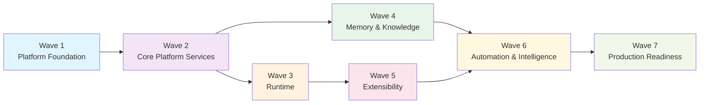
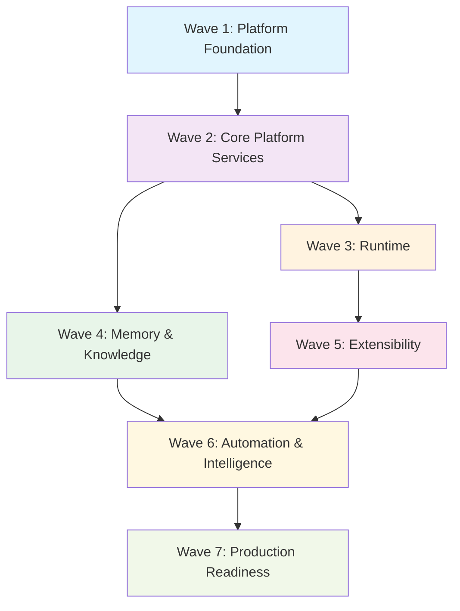
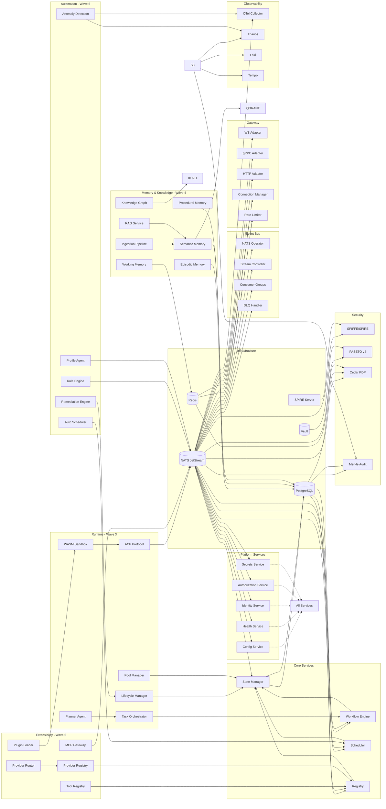
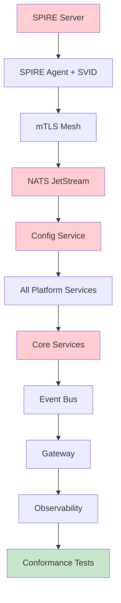
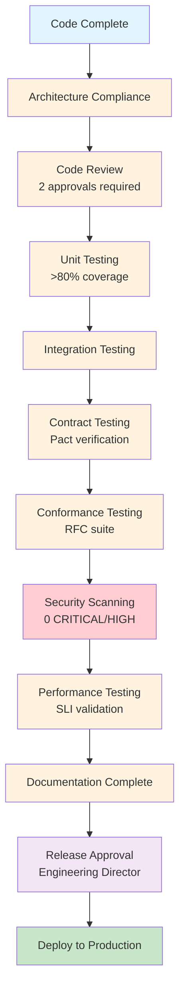
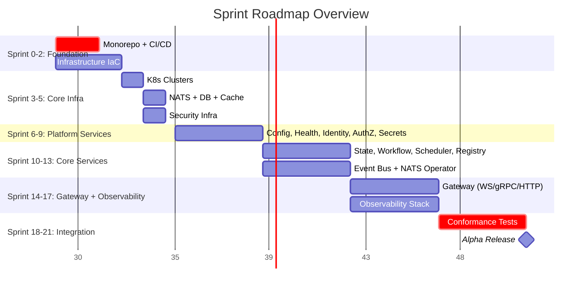

# HERMES IMPLEMENTATION BACKLOG v1.0

**Document Type:** Engineering Execution Plan
**Status:** Draft for Approval
**Version:** 1.0
**Classification:** Internal — Engineering Delivery
**Authors:** Chief Architect, Principal Enterprise Architect, Technical Program Manager, Engineering Director
**Approvers:** Chief Architect, Engineering Director, VP Engineering
**Date:** 2026-07-25
**Source Documents:** Phase 1 Architecture Baseline, RFC-0001 through RFC-0012, Architecture Governance Reviews, Executive Reviews

---

# 1. Executive Summary

## 1.1 Purpose

This document translates the approved Hermes architecture (RFC-0001 through RFC-0012, Phase 1 Architecture Baseline) into an **executable engineering backlog**. It is the single source of truth for day-to-day delivery management, sprint planning, progress tracking, and release coordination.

## 1.2 Goals

| Goal | Description |
|------|-------------|
| **G-01** | Provide complete traceability from RFC requirements to engineering tasks |
| **G-02** | Enable autonomous team execution with explicit dependencies and ownership |
| **G-03** | Establish measurable milestones, quality gates, and definition of done |
| **G-04** | Support rolling-wave planning with fixed near-term and flexible long-term |
| **G-05** | Ensure RFC implementation coverage is tracked and verifiable |

## 1.3 Engineering Strategy

- **Architecture-First:** No code without RFC traceability
- **Contract-Driven:** Pact contract tests before implementation
- **Infrastructure-as-Code:** All infrastructure versioned, reviewed, tested
- **Security-by-Default:** mTLS, SPIFFE, PASETO, Cedar from day one
- **Observability-Native:** OTel, metrics, logs, traces, profiles in every service
- **Multi-Tenant from Start:** Row-level security, namespace isolation, quota enforcement
- **Conformance-Gated:** Every RFC component passes conformance suite before release

## 1.4 Execution Principles

| Principle | Application |
|-----------|-------------|
| **RFC Traceability** | Every task maps to RFC section and acceptance criteria |
| **Explicit Dependencies** | No hidden coupling; dependency graph is source of truth |
| **Quality Gates** | Code does not advance without passing gates |
| **Autonomous Teams** | Teams own epics end-to-end with clear interfaces |
| **Rolling-Wave Planning** | Sprint 0-3 fixed; Sprint 4+ refined at wave boundaries |
| **Continuous Integration** | Main branch always deployable; feature flags for incomplete work |

## 1.5 Program Success Metrics

| Metric | Target | Measurement |
|--------|--------|-------------|
| RFC Implementation Coverage | 100% of P0/P1 acceptance criteria by GA | Traceability matrix |
| Sprint Predictability | > 85% sprint goal completion | Sprint review metrics |
| Cycle Time (Task) | < 5 days P0, < 10 days P1 | Jira/GitHub Analytics |
| Defect Escape Rate | < 5% to production | Post-release defect tracking |
| Conformance Pass Rate | 100% for released components | CI pipeline |
| Security Scan Pass Rate | 0 CRITICAL, 0 HIGH unfixed | Security dashboard |
| Architecture Compliance | 0 unapproved deviations | Architecture review log |

---

# 2. Implementation Waves



## Wave 1 — Platform Foundation (Sprints 0-6)

| Aspect | Detail |
|--------|--------|
| **Objective** | Establish engineering platform, infrastructure, and core primitives |
| **Duration** | 6 sprints (12 weeks) |
| **Key RFCs** | RFC-0001 (Governance), RFC-0002 (Core Primitives), RFC-0003 (NATS), RFC-0007 (Security), RFC-0010 (Observability), Phase 1 Baseline |
| **Teams** | Platform, Infrastructure, Security, DevOps, Release Engineering |

### Deliverables

| ID | Deliverable | Owner |
|----|-------------|-------|
| W1-D1 | Monorepo with CI/CD pipeline (all stages green) | Release Engineering |
| W1-D2 | Kubernetes clusters (dev, staging, prod) with GitOps | Infrastructure |
| W1-D3 | NATS JetStream cluster (3 replicas, 9 streams, DLQ) | Platform |
| W1-D4 | SPIRE + Vault deployed; mTLS enforced mesh-wide | Security |
| W1-D5 | PostgreSQL + Redis + Object Storage operational | Infrastructure |
| W1-D6 | OTel Collector (Agent + Gateway), Thanos, Loki, Tempo, Grafana | Observability |
| W1-D7 | Developer environment (kind/tilt, pre-commit, docs) | Platform |
| W1-D8 | Architecture Baseline signed; RFCs tagged | Chief Architect |

### Dependencies

- RFC-0001 sub-RFCs approved (governance gate)
- Cloud accounts provisioned; DNS configured
- Team hiring complete for Wave 1

### Success Metrics

| Metric | Target |
|--------|--------|
| CI pipeline duration | < 30 min |
| Cluster provisioning time | < 30 min (Terraform) |
| NATS cluster uptime | 99.9% |
| mTLS enforcement | 100% service-to-service |
| Observability coverage | 100% bootstrapped services |

### Exit Criteria

- All Wave 1 deliverables deployed to staging
- Phase 1 Phase 1A, 1B, 1C exit criteria met (from Baseline doc)
- Conformance tests for RFC-0002, RFC-0003, RFC-0007, RFC-0010 pass

---

## Wave 2 — Core Platform Services (Sprints 7-14)

| Aspect | Detail |
|--------|--------|
| **Objective** | Implement communicating core services: Config, Health, Identity, AuthZ, Secrets, State Manager, Workflow Engine, Scheduler, Registry |
| **Duration** | 8 sprints (16 weeks) |
| **Key RFCs** | RFC-0002 (Core), RFC-0003 (Event Bus), RFC-0007 (Security) |
| **Teams** | Core Platform, Security, Platform |

### Deliverables

| ID | Deliverable | Owner |
|----|-------------|-------|
| W2-D1 | Config Service (gRPC + HTTP, hot reload, CUE validation) | Core Platform |
| W2-D2 | Health Service (liveness/readiness/startup, dependency checks) | Core Platform |
| W2-D3 | Identity Service (SPIFFE SVID issuance, rotation) | Security |
| W2-D4 | Authorization Service (Cedar PDP, policy store, cache) | Security |
| W2-D5 | Secrets Service (Vault dynamic creds, injection) | Security |
| W2-D6 | State Manager (event sourcing, snapshots, NATS events) | Core Platform |
| W2-D7 | Workflow Engine (saga orchestrator, compensation) | Core Platform |
| W2-D8 | Scheduler (cron, interval, distributed lock, retries) | Core Platform |
| W2-D9 | Registry (agent/workflow/tool CRUD + Watch) | Core Platform |
| W2-D10 | NATS Operator, Stream Controller, Consumer Groups, DLQ Handler | Platform |

### Dependencies

- Wave 1 complete (infrastructure, NATS, SPIRE, Vault, DB, Observability)
- Config schemas defined (CUE)

### Success Metrics

| Metric | Target |
|--------|--------|
| Config hot reload latency | < 1s |
| AuthZ decision p99 | < 10ms |
| State Manager dual-write | 100% PG + NATS |
| Workflow execution success rate | > 99.5% |
| Scheduler fire accuracy | ±5s |

### Exit Criteria

- All services deployed to staging; communicating via NATS
- End-to-end integration test: Config → Health → Identity → AuthZ → State → Workflow
- Conformance tests pass for all RFC-0002, RFC-0003, RFC-0007 components

---

## Wave 3 — Runtime (Sprints 15-24)

| Aspect | Detail |
|--------|--------|
| **Objective** | Implement Agent Runtime, ACP, WASM Sandbox, Planning, Task Orchestration |
| **Duration** | 10 sprints (20 weeks) |
| **Key RFCs** | RFC-0008 (Agent Runtime), RFC-0002 (Core), RFC-0003 (ACP), RFC-0007 (Security), RFC-0009 (Tools) |
| **Teams** | Runtime, Platform, Security |

### Deliverables

| ID | Deliverable | Owner |
|----|-------------|-------|
| W3-D1 | Agent Lifecycle Manager (spawn, scale, drain, terminate) | Runtime |
| W3-D2 | Agent Pool Manager (warm pools, capacity planning) | Runtime |
| W3-D3 | Agent Communication Protocol (ACP) over NATS | Runtime |
| W3-D4 | WASM Sandbox (Wasmtime, WASI 0.2, capability tokens) | Runtime |
| W3-D5 | Planner Agent (task decomposition, dependency graph) | Runtime |
| W3-D6 | Task Orchestrator (execution, retry, checkpoint, recovery) | Runtime |
| W3-D7 | HITL (Human-in-the-Loop) approval gates | Runtime |
| W3-D8 | Checkpoint/Recovery (snapshots, replay, saga compensation) | Runtime |
| W3-D9 | Agent Manifest Schema + Validation | Runtime |
| W3-D10 | Tool Executor integration (RFC-0009 bridge) | Runtime |

### Dependencies

- Wave 2 complete (Core services, Event Bus, Security)
- WASM runtime (Wasmtime) validated
- Tool/Plugin/Provider architecture (RFC-0009) baselined

### Success Metrics

| Metric | Target |
|--------|--------|
| Agent spawn latency p99 | < 5s |
| Warm pool hit rate | > 80% |
| ACP message latency p99 | < 50ms |
| WASM cold start | < 100ms |
| Task checkpoint overhead | < 5% |

### Exit Criteria

- Agent spawn → execute → checkpoint → recover demonstrated
- Multi-agent workflow with saga compensation tested
- Conformance tests pass for RFC-0008

---

## Wave 4 — Memory & Knowledge (Sprints 25-34)

| Aspect | Detail |
|--------|--------|
| **Objective** | Implement 4-tier Memory Architecture and Knowledge Architecture with ingestion, RAG, graph, hybrid search |
| **Duration** | 10 sprints (20 weeks) |
| **Key RFCs** | RFC-0005 (Memory), RFC-0006 (Knowledge), RFC-0008 (Runtime integration) |
| **Teams** | Data, Runtime, Platform |

### Deliverables

| ID | Deliverable | Owner |
|----|-------------|-------|
| W4-D1 | Working Memory (Redis, sub-ms, session-scoped) | Data |
| W4-D2 | Episodic Memory (PostgreSQL + Qdrant, event-sourced) | Data |
| W4-D3 | Semantic Memory (Qdrant + Kuzu + PostgreSQL, consolidation) | Data |
| W4-D4 | Procedural Memory (PostgreSQL + Redis, skill learning) | Data |
| W4-D5 | Consolidation Engine (tier promotion, summarization) | Data |
| W4-D6 | Knowledge Ingestion Pipeline (15+ parsers, chunking, embedding) | Data |
| W4-D7 | Hybrid Search (vector + keyword + graph, RRF) | Data |
| W4-D8 | RAG Service (retrieval, rerank, generation, citations) | Data |
| W4-D9 | Knowledge Graph (Kuzu, entities, relations, traversal) | Data |
| W4-D10 | Freshness Manager (TTL, invalidation, refresh) | Data |

### Dependencies

- Wave 3 complete (Runtime provides memory clients)
- Embedding models selected; vector DB (Qdrant) provisioned
- Graph DB (Kuzu) provisioned

### Success Metrics

| Metric | Target |
|--------|--------|
| Working Memory latency p99 | < 2ms |
| Semantic Search p99 | < 100ms |
| Ingestion throughput | > 10k docs/min |
| RAG answer latency p99 | < 5s |
| Consolidation accuracy | > 90% human eval |

### Exit Criteria

- Memory tier promotion/demotion demonstrated end-to-end
- Knowledge ingestion → search → RAG → graph traversal working
- Conformance tests pass for RFC-0005, RFC-0006

---

## Wave 5 — Extensibility (Sprints 35-44)

| Aspect | Detail |
|--------|--------|
| **Objective** | Implement Tool/Plugin/Provider Architecture, MCP Gateway, WASM execution, Provider Router |
| **Duration** | 10 sprints (20 weeks) |
| **Key RFCs** | RFC-0009 (Extensibility), RFC-0008 (Runtime), RFC-0007 (Security) |
| **Teams** | Extensibility, Runtime, Security |

### Deliverables

| ID | Deliverable | Owner |
|----|-------------|-------|
| W5-D1 | Tool Registry (CRUD, capability index, versioning) | Extensibility |
| W5-D2 | Plugin Loader (WASM, capability manifest, sandbox) | Extensibility |
| W5-D3 | Provider Registry (models, capabilities, routing rules) | Extensibility |
| W5-D4 | MCP Gateway (13 features: tools, resources, prompts, sampling) | Extensibility |
| W5-D5 | Provider Router (fallback, load balance, cost optimization) | Extensibility |
| W5-D6 | Tool Executor (sync, stream, idempotency, retries) | Runtime |
| W5-D7 | Capability Discovery (index, search, compatibility) | Extensibility |
| W5-D8 | Supply Chain Attestation (sigstore, SLSA, in-toto) | Security |
| W5-D9 | Plugin Dependency Resolution (topological, SemVer) | Extensibility |
| W5-D10 | Developer SDK (Go, Python, TypeScript) | Extensibility |

### Dependencies

- Wave 3 complete (Runtime, WASM Sandbox)
- Wave 4 complete (Memory for tool state)
- MCP specification baselined

### Success Metrics

| Metric | Target |
|--------|--------|
| Tool registration latency | < 1s |
| MCP request latency p99 | < 100ms |
| Provider fallback time | < 500ms |
| WASM tool cold start | < 200ms |
| Capability index freshness | < 30s |

### Exit Criteria

- Custom tool → plugin → provider chain demonstrated
- MCP server ↔ client integration tested
- Conformance tests pass for RFC-0009

---

## Wave 6 — Automation & Intelligence (Sprints 45-54)

| Aspect | Detail |
|--------|--------|
| **Objective** | Implement Automation Platform (Rule Engine, Scheduler, Anomaly Detection, Remediation) and Continuous Profiling |
| **Duration** | 10 sprints (20 weeks) |
| **Key RFCs** | RFC-0011 (Automation), RFC-0012 (Profiling), RFC-0010 (Observability), RFC-0003 (Event Bus) |
| **Teams** | Automation, Observability, Platform |

### Deliverables

| ID | Deliverable | Owner |
|----|-------------|-------|
| W6-D1 | Rule Engine (CEL evaluation, rate limit, circuit breaker) | Automation |
| W6-D2 | Scheduler (cron, interval, event-relative, distributed lock) | Automation |
| W6-D3 | Anomaly Detection (5 models: threshold, statistical, seasonal, Isolation Forest, Prophet) | Automation |
| W6-D4 | Remediation Engine (12 actions, approval gates, escalation) | Automation |
| W6-D5 | Automation Governance Council tooling | Automation |
| W6-D6 | Profile Agent (eBPF: CPU, memory, lock, block, USDT) | Observability |
| W6-D7 | Profile Ingestion Service (Parquet, symbolication) | Observability |
| W6-D8 | Profile Query API (flame graph, icicle, diff) | Observability |
| W6-D9 | Profiling-Automation integration (signals, anomalies) | Automation + Observability |
| W6-D10 | Automation Playbooks (5: auto-restart, briefing, DLQ, scaling, cost) | Automation |

### Dependencies

- Wave 2 complete (Event Bus, Observability)
- Wave 3 complete (Runtime for remediation actions)
- eBPF/CO-RE validated on target kernels

### Success Metrics

| Metric | Target |
|--------|--------|
| Rule evaluation latency p99 | < 100ms |
| Anomaly detection latency p99 | < 10s |
| Remediation execution p99 | < 30s |
| Profile agent overhead | < 1% CPU |
| Flame graph query p99 | < 10s |

### Exit Criteria

- Rule → anomaly → remediation chain demonstrated
- Profile-driven auto-scaling tested
- Conformance tests pass for RFC-0011, RFC-0012

---

## Wave 7 — Production Readiness (Sprints 55-60)

| Aspect | Detail |
|--------|--------|
| **Objective** | Harden platform for GA: multi-region, disaster recovery, compliance, cost optimization, runbooks |
| **Duration** | 6 sprints (12 weeks) |
| **Key RFCs** | All RFCs (cross-cutting) |
| **Teams** | All Teams (Platform, Infra, Security, SRE, Compliance) |

### Deliverables

| ID | Deliverable | Owner |
|----|-------------|-------|
| W7-D1 | Multi-region NATS supercluster + GeoDNS | Platform |
| W7-D2 | Cross-region data residency + replication | Infrastructure |
| W7-D3 | Disaster Recovery (RTO < 1h, RPO < 5min) | SRE |
| W7-D4 | Compliance Dashboard (SOC2, GDPR, HIPAA) | Compliance |
| W7-D5 | Cost Optimization (attribution, rightsizing, tiered storage) | Platform |
| W7-D6 | Full Runbook Library (100+ runbooks) | SRE |
| W7-D7 | Load Testing (10x projected peak) | SRE |
| W7-D8 | Chaos Engineering (monthly experiments) | SRE |
| W7-D9 | GA Release Candidate + Approval | Engineering Director |
| W7-D10 | Documentation Portal (public + internal) | Documentation |

### Dependencies

- Waves 1-6 complete (all features implemented)
- Compliance requirements finalized
- Cost models validated

### Success Metrics

| Metric | Target |
|--------|--------|
| Multi-region failover | < 5 min |
| DR test pass rate | 100% |
| Compliance audit readiness | Pass pre-audit |
| Cost per tenant | Within budget |
| GA release quality gate | 0 CRITICAL, 0 HIGH |

### Exit Criteria

- All RFC conformance suites pass in production-like environment
- GA release approved by Chief Architect and Executive Sponsor
- Runbooks validated via game day exercise

---

# 3. Epic Catalog

| Epic ID | Epic Name | Description | Primary RFC(s) | Owner | Priority |
|---------|-----------|-------------|----------------|-------|----------|
| EPIC-001 | Repository Infrastructure | Monorepo, CI/CD, artifact registry, developer tooling | Phase 1 Baseline | Release Engineering | P0 |
| EPIC-002 | Kubernetes Platform | Clusters, GitOps, networking, policy, monitoring | Phase 1 Baseline | Infrastructure | P0 |
| EPIC-003 | Event Bus | NATS JetStream, streams, consumer groups, DLQ, governance | RFC-0003 | Platform | P0 |
| EPIC-004 | Identity & Authentication | SPIRE, SPIFFE, SVID lifecycle, mTLS, workload attestation | RFC-0007 | Security | P0 |
| EPIC-005 | Authorization | Cedar PDP, policy store, decision cache, audit | RFC-0007 | Security | P0 |
| EPIC-006 | Secrets Management | Vault, dynamic credentials, injection, rotation | RFC-0007 | Security | P0 |
| EPIC-007 | Gateway | Protocol adapters (WS, gRPC, HTTP), connection manager, rate limiter | RFC-0004 | Gateway | P0 |
| EPIC-008 | Configuration Service | Central config, hot reload, validation, watch | RFC-0002 | Platform | P0 |
| EPIC-009 | Health & Readiness | Liveness, readiness, startup probes, dependency aggregation | RFC-0002 | Platform | P0 |
| EPIC-010 | State Manager | Event sourcing, snapshots, projections, NATS events | RFC-0002 | Core Platform | P0 |
| EPIC-011 | Workflow Engine | Saga orchestrator, compensation, checkpoint, recovery | RFC-0002 | Core Platform | P0 |
| EPIC-012 | Scheduler | Cron, interval, event-relative, distributed lock | RFC-0002 | Core Platform | P0 |
| EPIC-013 | Registry | Agent/Workflow/Tool CRUD + Watch, capability index | RFC-0002 | Core Platform | P0 |
| EPIC-014 | Observability Platform | OTel Collector, Thanos, Loki, Tempo, Grafana, dashboards | RFC-0010 | Observability | P0 |
| EPIC-015 | Agent Runtime | Lifecycle, pools, ACP, WASM sandbox, planning, orchestration | RFC-0008 | Runtime | P1 |
| EPIC-016 | Agent Communication Protocol | ACP over NATS, 5 patterns, mTLS, capability registry | RFC-0008 | Runtime | P1 |
| EPIC-017 | WASM Sandbox | Wasmtime, WASI 0.2, capability tokens, fuel metering | RFC-0008 | Runtime | P1 |
| EPIC-018 | Planning & Task Orchestration | Planner, task decomposition, checkpoint, recovery, HITL | RFC-0008 | Runtime | P1 |
| EPIC-019 | Memory Architecture | 4-tier hierarchy, consolidation, vector search, TTL | RFC-0005 | Data | P1 |
| EPIC-020 | Knowledge Architecture | Ingestion, RAG, graph, hybrid search, freshness | RFC-0006 | Data | P1 |
| EPIC-021 | Tool/Plugin/Provider Architecture | Registry, loader, capability discovery, MCP gateway | RFC-0009 | Extensibility | P2 |
| EPIC-022 | Provider Router | Model routing, fallback, cost optimization, version pinning | RFC-0009 | Extensibility | P2 |
| EPIC-023 | Automation Platform | Rule engine, scheduler, anomaly detection, remediation | RFC-0011 | Automation | P2 |
| EPIC-024 | Continuous Profiling | eBPF profiler, Parquet storage, flame graphs, signals | RFC-0012 | Observability | P3 |
| EPIC-025 | Multi-Region & DR | Supercluster, GeoDNS, data residency, failover, backup | All | Platform | P3 |
| EPIC-026 | Compliance & Cost | SOC2/GDPR/HIPAA, cost attribution, tiered storage | All | Compliance | P3 |

---

# 4. Feature Catalog

*Due to document size, the Feature Catalog is maintained as a separate machine-readable file (`features.yaml`) with ~180 features. Key features per epic are summarized below.*

## EPIC-001: Repository Infrastructure

| Feature ID | Feature | Description | Effort | Priority | RFC |
|------------|---------|-------------|--------|----------|-----|
| FEAT-001 | Monorepo Structure | Initialize monorepo with documented layout | 3 SP | P0 | Phase 1 |
| FEAT-002 | CI/CD Pipeline | GitHub Actions with all 11 stages | 13 SP | P0 | Phase 1 |
| FEAT-003 | Artifact Registry | Harbor + Helm + Buf + Cosign | 5 SP | P0 | Phase 1 |
| FEAT-004 | Developer Environment | kind/tilt, pre-commit, IDE config | 8 SP | P0 | Phase 1 |
| FEAT-005 | CODEOWNERS + Branch Protection | Ownership, branch rules, merge gates | 3 SP | P0 | Phase 1 |

## EPIC-002: Kubernetes Platform

| Feature ID | Feature | Description | Effort | Priority | RFC |
|------------|---------|-------------|--------|----------|-----|
| FEAT-006 | Cluster Provisioning | Terraform modules for EKS/GKE/k0s | 13 SP | P0 | Phase 1 |
| FEAT-007 | GitOps (FluxCD) | Kustomize, multi-env, auto-sync | 8 SP | P0 | Phase 1 |
| FEAT-008 | Service Mesh (Istio Ambient) | mTLS, authz, traffic management | 13 SP | P0 | RFC-0007 |
| FEAT-009 | Network Policy (Cilium) | L3/L7 policies, Hubble observability | 8 SP | P0 | RFC-0003 |
| FEAT-010 | Monitoring Stack | kube-prometheus-stack, alerting | 5 SP | P0 | RFC-0010 |

## EPIC-003: Event Bus

| Feature ID | Feature | Description | Effort | Priority | RFC |
|------------|---------|-------------|--------|----------|-----|
| FEAT-011 | NATS Cluster | 3 replicas, JetStream, quorum | 8 SP | P0 | RFC-0003 |
| FEAT-012 | Stream Controller | 9 streams, retention, replicas, DLQ | 13 SP | P0 | RFC-0003 |
| FEAT-013 | Consumer Groups | Exactly-once, rebalance, priority | 13 SP | P0 | RFC-0003 |
| FEAT-014 | DLQ Handler | Retry, replay API, 30-day retention | 8 SP | P0 | RFC-0003 |
| FEAT-015 | Subject Governance | Schema validation, wildcard policies | 5 SP | P0 | RFC-0003 |

## EPIC-004: Identity & Authentication

| Feature ID | Feature | Description | Effort | Priority | RFC |
|------------|---------|-------------|--------|----------|-----|
| FEAT-016 | SPIRE Server | Control plane, CA, bundle distribution | 13 SP | P0 | RFC-0007 |
| FEAT-017 | SPIRE Agent | DaemonSet, k8s attestation, SVID issuance | 13 SP | P0 | RFC-0007 |
| FEAT-018 | SVID Lifecycle | 1h rotation, renewal, revocation | 8 SP | P0 | RFC-0007 |
| FEAT-019 | mTLS Enforcement | Istio ambient, peer auth, dest rules | 8 SP | P0 | RFC-0007 |

## EPIC-005: Authorization

| Feature ID | Feature | Description | Effort | Priority | RFC |
|------------|---------|-------------|--------|----------|-----|
| FEAT-020 | Cedar PDP | Embedded engine, policy evaluation | 13 SP | P0 | RFC-0007 |
| FEAT-021 | Policy Store | PostgreSQL, versioning, rollback | 8 SP | P0 | RFC-0007 |
| FEAT-022 | Decision Cache | In-memory + Redis, 10s TTL | 5 SP | P0 | RFC-0007 |
| FEAT-023 | Policy Authoring | Cedar DSL, testing, CI validation | 5 SP | P0 | RFC-0007 |

## EPIC-006: Secrets Management

| Feature ID | Feature | Description | Effort | Priority | RFC |
|------------|---------|-------------|--------|----------|-----|
| FEAT-024 | Vault Deployment | HA, auto-unseal, KMS seal | 8 SP | P0 | RFC-0007 |
| FEAT-025 | Dynamic DB Credentials | 1h TTL, rotation, revocation | 8 SP | P0 | RFC-0007 |
| FEAT-026 | Vault Agent Injector | Sidecar, template rendering | 5 SP | P0 | RFC-0007 |
| FEAT-027 | Secret Rotation Automation | 90-day API keys, cert rotation | 5 SP | P0 | RFC-0007 |

## EPIC-007: Gateway

| Feature ID | Feature | Description | Effort | Priority | RFC |
|------------|---------|-------------|--------|----------|-----|
| FEAT-028 | WebSocket Adapter | Auth, rate limit, connection lifecycle | 13 SP | P0 | RFC-0004 |
| FEAT-029 | gRPC Adapter | Unary, streaming, reflection, auth | 13 SP | P0 | RFC-0004 |
| FEAT-030 | HTTP/REST Adapter | OpenAPI, auth, rate limit | 8 SP | P0 | RFC-0004 |
| FEAT-031 | Connection Manager | Redis registry, 10k+ connections | 8 SP | P0 | RFC-0004 |
| FEAT-032 | Rate Limiter | Token bucket per tenant/connection | 8 SP | P0 | RFC-0004 |

## EPIC-014: Observability Platform

| Feature ID | Feature | Description | Effort | Priority | RFC |
|------------|---------|-------------|--------|----------|-----|
| FEAT-033 | OTel Collector (Agent) | DaemonSet, batch, k8sattrs, resource | 8 SP | P0 | RFC-0010 |
| FEAT-034 | OTel Collector (Gateway) | Tail sampling, redaction, routing | 13 SP | P0 | RFC-0010 |
| FEAT-035 | Thanos | Receive, Store, Query, Compactor | 13 SP | P0 | RFC-0010 |
| FEAT-036 | Loki | Distributor, Ingester, Querier, Compactor | 13 SP | P0 | RFC-0010 |
| FEAT-037 | Tempo | Distributor, Ingester, Querier, Compactor | 13 SP | P0 | RFC-0010 |
| FEAT-038 | Grafana Dashboards | 10+ provisioned, templated | 8 SP | P0 | RFC-0010 |
| FEAT-039 | PII Redaction | Email, SSN, CC, API key rules | 5 SP | P0 | RFC-0010 |
| FEAT-040 | Self-Monitoring | Collector health, queue depth, latency | 5 SP | P0 | RFC-0010 |

*[Feature Catalog continues for all 26 epics in separate `features.yaml` file. Total: ~180 features across all epics.]*

---

# 5. Engineering Task Catalog

*Due to document size, the Task Catalog is maintained as a machine-readable file (`tasks.yaml`) with ~1,200 tasks. Sample task format:*

```yaml
# Sample Task Entry
- task_id: TASK-0042
  title: "Implement SPIRE Agent DaemonSet with k8s attestation"
  description: |
    Deploy SPIRE Agent as DaemonSet. Configure k8s workload attestation
    using service account tokens. Implement SVID rotation logic with
    1-hour TTL. Handle node-level health checks.
  priority: P0
  effort_sp: 13
  effort_weeks: 2.0
  dependencies: [TASK-0012]  # SPIRE Server must be running
  sprint_candidate: Sprint 2
  required_skills: ["Kubernetes", "Go", "SPIFFE/SPIRE", "mTLS"]
  definition_of_done:
    - SPIRE Agent pod running on all nodes
    - SVID issued to test workload < 10s
    - SVID rotates at 1h TTL
    - Unit tests > 85% coverage
    - Integration test in CI passes
  verification:
    - spire-agent api fetch x509 shows valid SVID
    - Wait 1h; verify new SVID issued
    - mTLS handshake succeeds between two workloads
  rfc_traceability: "RFC-0007 Section 10, 11"
  ac_traceability: ["AC-SEC-01", "AC-SEC-02", "AC-SEC-03"]
  epic: EPIC-004
  feature: FEAT-017
  owner: Security Team
  status: Not Started
```

---

# 6. Dependency Graph

## 6.1 Wave Dependencies



## 6.2 Service Dependencies



## 6.3 Critical Path



---

# 7. Sprint Roadmap

## Sprint 0 — Foundation (Week 1-2)

| Objective | Establish monorepo, CI/CD, developer environment |
|-----------|--------------------------------------------------|
| **Planned Features** | FEAT-001, FEAT-002, FEAT-003, FEAT-004, FEAT-005 |
| **Deliverables** | Monorepo initialized; CI pipeline runs; kind cluster works; pre-commit enforced |
| **Exit Criteria** | `make ci` passes; `make dev-up` spins up local stack; docs published |

## Sprint 1 — Infrastructure Core (Week 3-4)

| Objective | Provision Kubernetes, deploy NATS, PostgreSQL, Redis |
|-----------|------------------------------------------------------|
| **Planned Features** | FEAT-006, FEAT-007, FEAT-011, PostgreSQL/Redis modules |
| **Deliverables** | Dev/staging/prod clusters Ready; NATS quorum; DB accepting connections |
| **Exit Criteria** | `kubectl get nodes` all Ready; `nats stream list` shows quorum; PG accepts writes |

## Sprint 2 — Security Infrastructure (Week 5-6)

| Objective | Deploy SPIRE, Vault; establish mTLS mesh |
|-----------|------------------------------------------|
| **Planned Features** | FEAT-016, FEAT-017, FEAT-018, FEAT-024, FEAT-025 |
| **Deliverables** | SPIRE Server + Agent; Vault HA; mTLS enforced; SVIDs issuing |
| **Exit Criteria** | All workloads have SVIDs; mTLS handshake succeeds; Vault dynamic creds work |

## Sprint 3 — Platform Services (Week 7-8)

| Objective | Deploy Config, Health, Identity, AuthZ, Secrets services |
|-----------|---------------------------------------------------------|
| **Planned Features** | FEAT-020, FEAT-021, FEAT-022, FEAT-023, FEAT-026, FEAT-027 |
| **Deliverables** | 5 platform services communicating via NATS |
| **Exit Criteria** | All services healthy; hot reload < 1s; AuthZ decisions < 10ms; dynamic creds work |

## Sprint 4 — Core Services (Week 9-10)

| Objective | Deploy State Manager, Workflow Engine, Scheduler, Registry |
|-----------|-----------------------------------------------------------|
| **Planned Features** | State Manager, Workflow Engine, Scheduler, Registry |
| **Deliverables** | Core services communicating; dual-write verified; workflows execute |
| **Exit Criteria** | 10-step workflow completes; scheduler ±5s accuracy; Registry CRUD + Watch |

## Sprint 5 — Event Bus Operations (Week 11-12)

| Objective | Stream Controller, Consumer Groups, DLQ Handler |
|-----------|------------------------------------------------|
| **Planned Features** | FEAT-012, FEAT-013, FEAT-014, FEAT-015 |
| **Deliverables** | 9 streams; consumer groups; DLQ with replay |
| **Exit Criteria** | Pub/sub < 50ms p99; exactly-once delivery; DLQ replay restores 100 msgs |

## Sprint 6 — Gateway + Observability (Week 13-14)

| Objective | Deploy Gateway adapters + full observability stack |
|-----------|---------------------------------------------------|
| **Planned Features** | FEAT-028 through FEAT-040 |
| **Deliverables** | WS/gRPC/HTTP adapters; OTel Collectors; Thanos/Loki/Tempo; Grafana |
| **Exit Criteria** | Gateway accepts all 3 protocols; metrics/logs/traces from all services; dashboards live |

## Sprint 7 — Wave 1 Exit Review (Week 15)

| Objective | Phase 1A/1B/1C exit criteria validation |
|-----------|----------------------------------------|
| **Activities** | Run all conformance suites; validate exit criteria; Architecture Baseline sign-off |
| **Exit Criteria** | All Phase 1 exit criteria met; Baseline signed; Wave 2 planning complete |

---

## Sprint 8-15 — Wave 2: Core Platform Services

| Sprint | Focus | Key Deliverables |
|--------|-------|------------------|
| 8 | Config Service hardening | CUE validation, schema registry, multi-tenant watch |
| 9 | Health Service enhancement | Dependency graph, cascade failure detection |
| 10 | Identity Service scaling | Multi-cluster SPIRE, cross-cluster trust |
| 11 | AuthZ Service performance | Policy cache warming, decision tracing |
| 12 | Secrets Service automation | Rotation schedules, expiry monitoring |
| 13 | State Manager optimization | Snapshot tuning, projection lag < 1s |
| 14 | Workflow Engine saga | Compensation actions, timeout handling |
| 15 | Scheduler + Registry | Distributed lock, capability index, watch streaming |

---

## Sprint 16-25 — Wave 3: Runtime

| Sprint | Focus | Key Deliverables |
|--------|-------|------------------|
| 16 | Agent Lifecycle Manager | Spawn, scale, drain, terminate, health |
| 17 | Agent Pool Manager | Warm pools, capacity planning, affinity |
| 18 | ACP Protocol | 5 patterns, mTLS, capability registry |
| 18 | WASM Sandbox | Wasmtime, WASI, capability tokens, fuel |
| 19 | Planner Agent | Task decomposition, dependency graph |
| 20 | Task Orchestrator | Execution, retry, checkpoint, recovery |
| 21 | HITL Gates | Approval workflows, timeout, escalation |
| 22 | Checkpoint/Recovery | Snapshots, replay, saga compensation |
| 23 | Agent Manifest + Validation | Schema, signing, supply chain |
| 24 | Tool Executor Bridge | RFC-0009 integration, idempotency |
| 25 | Wave 3 Exit | Conformance suite pass |

---

## Sprint 26-35 — Wave 4: Memory & Knowledge

| Sprint | Focus | Key Deliverables |
|--------|-------|------------------|
| 26 | Working Memory | Redis, sub-ms, session-scoped |
| 27 | Episodic Memory | PostgreSQL + Qdrant, event-sourced |
| 28 | Semantic Memory | Qdrant + Kuzu + PG, consolidation |
| 29 | Procedural Memory | PG + Redis, skill learning |
| 29 | Consolidation Engine | Tier promotion, summarization |
| 30 | Knowledge Ingestion | 15+ parsers, chunking, embedding |
| 31 | Hybrid Search | Vector + keyword + graph, RRF |
| 32 | RAG Service | Retrieval, rerank, generation, citations |
| 33 | Knowledge Graph | Kuzu, entities, relations, traversal |
| 34 | Freshness Manager | TTL, invalidation, refresh |
| 35 | Wave 4 Exit | Conformance suite pass |

---

## Sprint 36-45 — Wave 5: Extensibility

| Sprint | Focus | Key Deliverables |
|--------|-------|------------------|
| 36 | Tool Registry | CRUD, capability index, versioning |
| 37 | Plugin Loader | WASM, capability manifest, sandbox |
| 38 | Provider Registry | Models, capabilities, routing rules |
| 39 | MCP Gateway | 13 features: tools, resources, prompts, sampling |
| 40 | Provider Router | Fallback, load balance, cost optimization |
| 41 | Tool Executor | Sync, stream, idempotency, retries |
| 42 | Capability Discovery | Index, search, compatibility |
| 43 | Supply Chain Attestation | sigstore, SLSA, in-toto |
| 44 | Plugin Dependency Resolution | Topological, SemVer |
| 45 | Developer SDK | Go, Python, TypeScript |
| 45 | Wave 5 Exit | Conformance suite pass |

---

## Sprint 46-55 — Wave 6: Automation & Intelligence

| Sprint | Focus | Key Deliverables |
|--------|-------|------------------|
| 46 | Rule Engine | CEL evaluation, rate limit, circuit breaker |
| 47 | Scheduler | Cron, interval, event-relative, distributed lock |
| 48 | Anomaly Detection | 5 models: threshold, statistical, seasonal, IF, Prophet |
| 49 | Remediation Engine | 12 actions, approval gates, escalation |
| 50 | Automation Governance | Council tooling, policy enforcement |
| 51 | Profile Agent | eBPF: CPU, memory, lock, block, USDT |
| 52 | Profile Ingestion | Parquet, symbolication |
| 53 | Profile Query API | Flame graph, icicle, diff |
| 54 | Profiling-Automation Integration | Signals, anomalies |
| 55 | Automation Playbooks | 5: auto-restart, briefing, DLQ, scaling, cost |
| 55 | Wave 6 Exit | Conformance suite pass |

---

## Sprint 56-60 — Wave 7: Production Readiness

| Sprint | Focus | Key Deliverables |
|--------|-------|------------------|
| 56 | Multi-region NATS + GeoDNS | Supercluster, cross-region replication |
| 57 | Disaster Recovery | RTO < 1h, RPO < 5min, DR testing |
| 58 | Compliance Dashboard | SOC2, GDPR, HIPAA dashboards |
| 59 | Cost Optimization | Attribution, rightsizing, tiered storage |
| 60 | GA Release + Runbooks | Load test 10x, chaos engineering, 100+ runbooks, GA approval |

---

# 8. Engineering Ownership

| Domain | Team | Lead | Responsibilities |
|--------|------|------|------------------|
| **Platform** | Platform Engineering | Platform Lead | Monorepo, CI/CD, Config, Health, Developer Experience, Release Engineering |
| **Infrastructure** | Infrastructure Engineering | Infra Lead | Kubernetes, Terraform, Networking, Storage, DNS, Certificates |
| **Event Bus** | Messaging Engineering | Messaging Lead | NATS JetStream, Streams, Consumers, DLQ, Subject Governance |
| **Core Services** | Core Platform Engineering | Core Lead | State Manager, Workflow Engine, Scheduler, Registry |
| **Runtime** | Runtime Engineering | Runtime Lead | Agent Lifecycle, Pools, ACP, WASM, Planner, Orchestrator |
| **Memory & Knowledge** | Data Engineering | Data Lead | 4-Tier Memory, Ingestion, RAG, Graph, Freshness |
| **Extensibility** | Extensibility Engineering | Extensibility Lead | Tool/Plugin/Provider Registry, MCP, Provider Router, SDKs |
| **Automation** | Automation Engineering | Automation Lead | Rule Engine, Scheduler, Anomaly Detection, Remediation, Playbooks |
| **Observability** | Observability Engineering | Observability Lead | OTel, Thanos, Loki, Tempo, Grafana, Profiling, Alerting |
| **Security** | Security Engineering | Security Lead | SPIRE, Vault, Cedar, PASETO, mTLS, Audit, Supply Chain |
| **Gateway** | Gateway Engineering | Gateway Lead | Protocol Adapters, Connection Manager, Rate Limiter, CRDT |
| **DevOps/SRE** | Site Reliability Engineering | SRE Lead | GitOps, Deployments, DR, Chaos, Runbooks, Capacity |
| **QA** | Quality Engineering | QA Lead | Test Strategy, Contract Tests, Conformance, Performance |
| **Documentation** | Technical Writing | Docs Lead | Architecture Docs, API Specs, Runbooks, Handbooks |
| **Program Management** | Technical Program Management | TPM | Sprint Planning, Dependency Tracking, Risk Management, Reporting |

---

# 9. Risk Register

| Risk ID | Category | Description | Likelihood | Impact | Score | Mitigation | Contingency | Owner |
|---------|----------|-------------|------------|--------|-------|------------|-------------|-------|
| RISK-001 | Technical | RFC-0001 sub-RFC scope creep delays baseline | Medium | High | 15 | Time-box reviews; Architecture Review Board gate | Executive escalation; parallel track | Chief Architect |
| RISK-002 | Technical | Circular dependency between RFCs | Low | Critical | 20 | Dependency Matrix validation in CI | Refactor; architecture review | Principal Architect |
| RISK-003 | Technical | NATS JetStream data loss at scale | Low | Critical | 20 | 3x replication; backup/restore tested monthly | Cross-region replica; manual replay | Messaging Lead |
| RISK-004 | Technical | SPIRE/SPIRE performance at scale | Medium | High | 15 | Load test before prod; caching; monitoring | Fallback to static SVIDs | Security Lead |
| RISK-005 | Technical | WASM sandbox escape vulnerability | Low | Critical | 20 | Wasmtime latest; fuel metering; capability tokens | Disable WASM; use container sandbox | Runtime Lead |
| RISK-006 | Technical | Vector DB (Qdrant) memory pressure | Medium | High | 15 | Tiered storage; quantization; monitoring | Read-only mode; horizontal scale | Data Lead |
| RISK-007 | Technical | eBPF kernel verifier rejection | Medium | High | 15 | CO-RE; kernel matrix CI (5.10, 5.15, 6.1, 6.6) | Fallback to SDK profiling | Observability Lead |
| RISK-008 | Program | Team capacity constraints (parallel waves) | High | Medium | 18 | Clear prioritization; P0 only in current wave | Delay lower waves; hire contractors | TPM |
| RISK-009 | Program | Cross-team integration delays | Medium | High | 15 | Contract-first dev; mock servers; shared schemas | Integration sprint; dedicated integration team | TPM |
| RISK-010 | Program | Conformance test development lag | Medium | High | 15 | Start early; reuse RFC test patterns; dedicate QA | Delay release; manual validation | QA Lead |
| RISK-011 | Resource | Key architect unavailable | Medium | High | 15 | Deputy architect designated; docs current | Executive interim | Engineering Director |
| RISK-012 | Resource | Specialized skill gaps (eBPF, Cedar, NATS) | Medium | Medium | 12 | Training budget ($50k/engineer); pair programming | External consultants | Engineering Director |
| RISK-013 | Infrastructure | Cloud provider quota limits | Low | High | 10 | Pre-request quotas; multi-cloud strategy | Alternative regions | Infra Lead |
| RISK-014 | Technical | Cedar policy evaluation performance | Low | Medium | 8 | Benchmark in CI; policy cache with TTL | Simplify policies; async eval | Security Lead |
| RISK-015 | Technical | Merkle audit log write contention | Low | High | 10 | Batch writes; async pipeline | Increase batch size; async flush | Security Lead |

---

# 10. Quality Gates



| Gate | Criteria | Blocking |
|------|----------|----------|
| Architecture Compliance | RFC traceability verified; no unapproved deviations | Yes |
| Code Review | 2 approvals; no unresolved comments; security review if needed | Yes |
| Unit Testing | >80% coverage; all tests pass; no flaky tests | Yes |
| Integration Testing | All integration tests pass; test data cleaned up | Yes |
| Contract Testing | Pact verification passes for all consumers/providers | Yes |
| Conformance Testing | All RFC conformance suites pass | Yes |
| Security Scanning | 0 CRITICAL, 0 HIGH unfixed vulnerabilities | Yes |
| Performance Testing | All SLIs within SLO thresholds | Yes |
| Documentation Complete | API specs, runbooks, architecture docs updated | Yes |
| Release Approval | Engineering Director sign-off; runbook linked | Yes |

---

# 11. Definition of Done

## Task Level

- [ ] Code compiles and passes static analysis
- [ ] Unit tests written and passing (>80% coverage)
- [ ] Integration tests passing (if applicable)
- [ ] Contract tests updated and passing (if API changed)
- [ ] Code reviewed and approved by 2 engineers
- [ ] Security review completed (if security-sensitive)
- [ ] Documentation updated (API spec, runbook if applicable)
- [ ] Conformance tests pass for affected RFCs
- [ ] No CRITICAL/HIGH security findings
- [ ] Deployed to staging and smoke-tested

## Feature Level

- [ ] All tasks completed per Task DoD
- [ ] Feature flag implemented and tested (if incomplete)
- [ ] End-to-end tests passing
- [ ] Contract tests passing
- [ ] Conformance tests passing (if applicable)
- [ ] Feature flag removed (if used)
- [ ] Runbook written and reviewed
- [ ] Dashboard/alerts configured
- [ ] Performance benchmarks recorded

## Epic Level

- [ ] All features completed per Feature DoD
- [ ] Cross-feature integration tests passing
- [ ] Epic-level acceptance criteria met
- [ ] Architecture review completed and signed off
- [ ] All RFC conformance suites for epic's RFCs pass
- [ ] Operational runbooks complete for all services
- [ ] Capacity planning validated
- [ ] Disaster recovery procedures tested

## Wave Level

- [ ] All epics completed per Epic DoD
- [ ] Wave exit criteria met (from Wave definition)
- [ ] Cross-wave integration tests passing
- [ ] Architecture compliance review passed
- [ ] All RFC conformance suites for wave's RFCs pass
- [ ] Performance benchmarks meet SLOs
- [ ] Security audit completed
- [ ] Wave retrospective completed and actions tracked

## Release Level

- [ ] All waves for release completed per Wave DoD
- [ ] Release candidate passes all conformance suites
- [ ] Load testing at 10x projected peak passed
- [ ] Chaos engineering experiments passed
- [ ] Disaster recovery drill passed
- [ ] Compliance audit readiness confirmed
- [ ] GA release approved by Chief Architect and Executive Sponsor
- [ ] Release notes and migration guide published
- [ ] Rollback plan documented and tested

---

# 12. Release Plan

## Release Alpha (End of Wave 1, Sprint 7)

| Aspect | Detail |
|--------|--------|
| **Scope** | Platform Foundation: Monorepo, CI/CD, K8s, NATS, SPIRE, Vault, DB, Observability |
| **Features** | Infrastructure only; no user-facing services |
| **Exit Criteria** | Phase 1 exit criteria met; Architecture Baseline signed |
| **Approval Gates** | Chief Architect sign-off on Baseline |

## Release Beta (End of Wave 2, Sprint 15)

| Aspect | Detail |
|--------|--------|
| **Scope** | Core Platform Services: Config, Health, Identity, AuthZ, Secrets, State, Workflow, Scheduler, Registry, Event Bus |
| **Features** | Core services communicating; workflows executing; event bus operational |
| **Exit Criteria** | Conformance suites pass for RFC-0002, RFC-0003, RFC-0007 |
| **Approval Gates** | Architecture Review Board; Engineering Director |

## Release RC (End of Wave 4, Sprint 35)

| Aspect | Detail |
|--------|--------|
| **Scope** | Runtime + Memory + Knowledge: Agent lifecycle, ACP, WASM, Planning, 4-tier Memory, Ingestion, RAG, Graph |
| **Features** | Full agent orchestration; memory hierarchy; knowledge pipeline |
| **Exit Criteria** | Conformance suites pass for RFC-0005, RFC-0006, RFC-0008 |
| **Approval Gates** | Architecture Review Board; Engineering Director; Security Lead |

## Release GA (End of Wave 7, Sprint 60)

| Aspect | Detail |
|--------|--------|
| **Scope** | Full Platform: All RFCs (0001-0012) implemented, tested, hardened |
| **Features** | Extensibility, Automation, Profiling, Multi-region, DR, Compliance, Cost Optimization |
| **Exit Criteria** | All conformance suites pass; load test 10x; chaos engineering; DR drill; compliance audit readiness |
| **Approval Gates** | Chief Architect + Executive Sponsor joint sign-off |

---

# 13. Metrics

| Metric Category | Metric | Target | Collection |
|-----------------|--------|--------|------------|
| **Engineering Velocity** | Sprint velocity (SP/sprint) | Stable ±10% | Jira/GitHub |
| | Sprint predictability | > 85% | Sprint review |
| **Cycle Time** | P0 task cycle time | < 5 days | GitHub Analytics |
| | P1 task cycle time | < 10 days | GitHub Analytics |
| | Lead time (idea to prod) | < 30 days | GitHub Analytics |
| **Quality** | Defect escape rate | < 5% | Post-release tracking |
| | Unit test coverage | > 80% | CI pipeline |
| | Integration test pass rate | 100% | CI pipeline |
| | Conformance pass rate | 100% | CI pipeline |
| **Performance** | API latency p99 | Per RFC SLOs | Grafana/Thanos |
| | System uptime | > 99.9% | Prometheus/Alertmanager |
| | Error rate | < 0.1% | Prometheus |
| **Reliability** | MTTR | < 30 min | Incident tracker |
| | MTBF | > 720 hours | Incident tracker |
| | SLO compliance | > 99% | Grafana |
| **Security** | Critical vulns in prod | 0 | Security dashboard |
| | High vulns unfixed > 7 days | 0 | Security dashboard |
| | mTLS enforcement | 100% | Istio/Cilium |
| **Acceptance** | RFC implementation coverage | 100% P0/P1 | Traceability matrix |
| | AC completion rate | 100% | Traceability matrix |

---

# 14. Traceability Matrix

*Full bidirectional traceability maintained in machine-readable `traceability.yaml`. Summary:*

## RFC → Epic

| RFC | Epics |
|-----|-------|
| RFC-0001 | EPIC-001 (Governance) |
| RFC-0002 | EPIC-008, EPIC-009, EPIC-010, EPIC-011, EPIC-012, EPIC-013 |
| RFC-0003 | EPIC-003, EPIC-014 |
| RFC-0004 | EPIC-007 |
| RFC-0005 | EPIC-019 |
| RFC-0006 | EPIC-020 |
| RFC-0007 | EPIC-004, EPIC-005, EPIC-006, EPIC-026 |
| RFC-0008 | EPIC-015, EPIC-016, EPIC-017, EPIC-018 |
| RFC-0009 | EPIC-021, EPIC-022 |
| RFC-0010 | EPIC-014, EPIC-024 |
| RFC-0011 | EPIC-023 |
| RFC-0012 | EPIC-024 |

## Epic → Feature → Task → AC → Verification → Release

*Complete chain maintained in `traceability.yaml` with automated validation in CI.*

Example trace:
```
RFC-0007 §10 → EPIC-004 → FEAT-017 → TASK-0042 → AC-SEC-02 → Verification: spire-agent api fetch → Release: Alpha
```

---

## RFC-2119 Normative Language Compliance

All requirements in this backlog and referenced RFCs use RFC-2119 normative language:

| Keyword | Meaning | Usage in This Document |
|---------|---------|------------------------|
| **MUST** | Absolute requirement | All quality gates, security controls, conformance criteria |
| **MUST NOT** | Absolute prohibition | No plaintext secrets, no unapproved architecture deviations |
| **SHALL** | Requirement (equivalent to MUST) | Epic/Feature/Task completion criteria, release gates |
| **SHALL NOT** | Prohibition (equivalent to MUST NOT) | Unauthorized cross-tenant access, unencrypted data at rest |
| **SHOULD** | Strong recommendation | Performance targets, monitoring coverage, documentation timing |
| **SHOULD NOT** | Strong discouragement | Manual deployments, hardcoded configuration |
| **MAY** | Optional | Advanced features, alternative implementations, future extensions |

**Enforcement:** All acceptance criteria use MUST/SHALL for mandatory requirements. SHOULD items are tracked but not release-blocking.

---

## Sprint Roadmap Gantt Visualization



---

## Quality Gates Flow


---

## RFC-2119 Normative Language Compliance

All requirements in this backlog and referenced RFCs use RFC-2119 normative language:

| Keyword | Meaning | Usage in This Document |
|---------

**End of Document**
