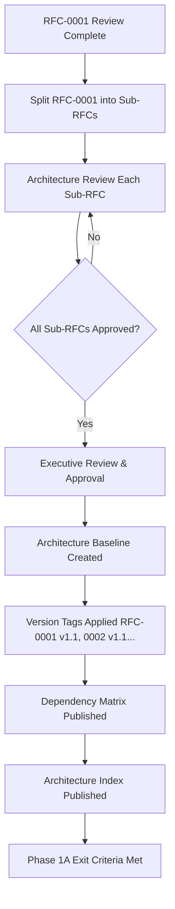
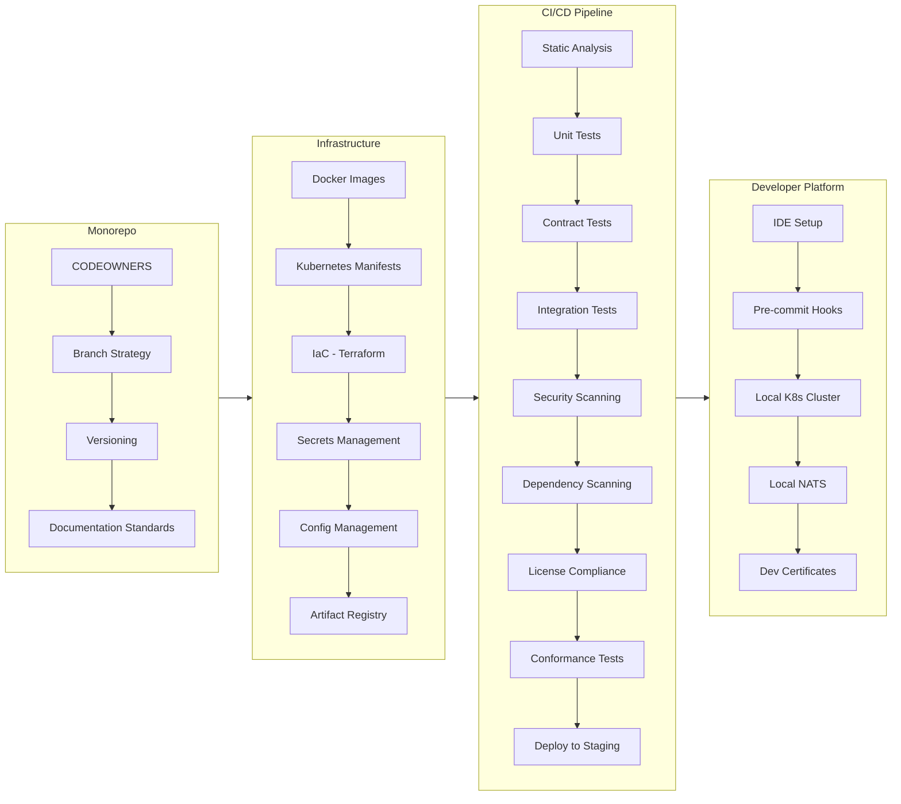
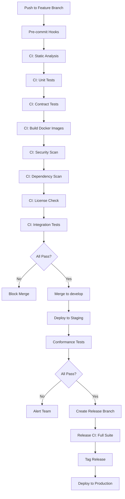
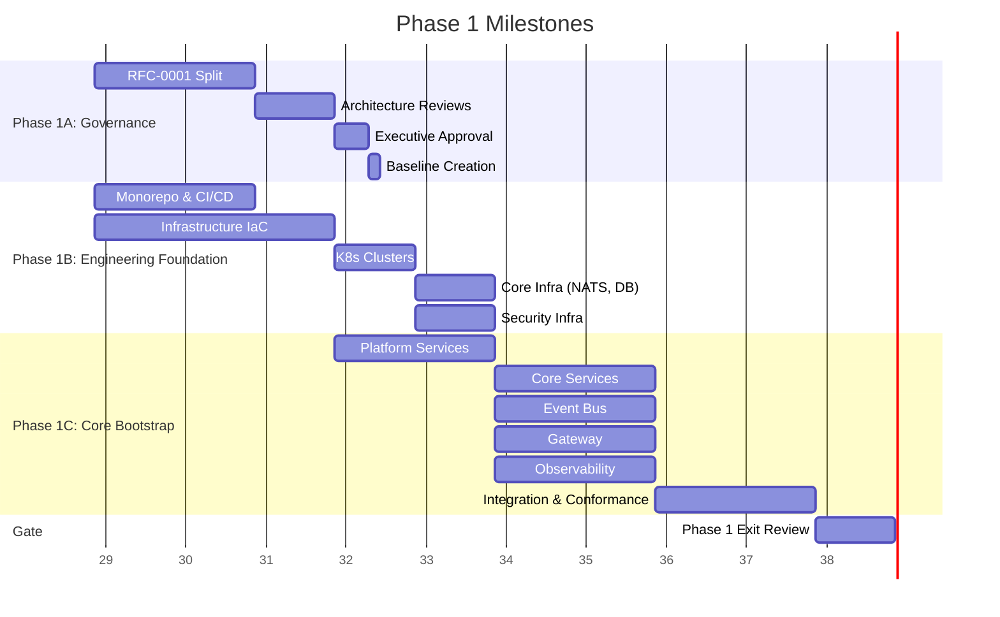

# Hermes Phase 1 — Architecture Baseline & Engineering Readiness

**Document Type:** Implementation Roadmap (Non-RFC)
**Status:** Draft for Approval
**Version:** 1.0
**Classification:** Internal — Architecture Governance
**Authors:** Chief Architect, Principal Enterprise Architect
**Approvers:** Chief Architect, Executive Sponsor
**Date:** 2026-07-25

---

# 1. Executive Summary

## 1.1 Purpose of Phase 1

Phase 1 establishes the **Architecture Baseline** and **Engineering Readiness** for Project Hermes. It transforms the approved RFC architecture (RFC-0002 through RFC-0012) into an implementable, tested, and governed engineering platform. Phase 1 is the **mandatory prerequisite** for all subsequent implementation phases.

## 1.2 Objectives

| Objective | Description |
|-----------|-------------|
| **O-01** | Resolve RFC-0001 governance and achieve Architecture Baseline approval |
| **O-02** | Establish monorepo, CI/CD, and developer platform |
| **O-03** | Deploy core infrastructure: NATS, Identity, Config, Gateway, Observability |
| **O-04** | Implement RFC-0002 Core, RFC-0003 Event Bus, RFC-0007 Security as communicating services |
| **O-05** | Achieve end-to-end conformance testing for bootstrapped components |
| **O-06** | Deliver engineering handbook and operational runbooks |

## 1.3 Success Definition

Phase 1 is **successful** when:

1. All RFCs (0001 to 0012) are baselined with version tags
2. CI/CD pipeline builds, tests, and deploys all Phase 1 components
3. NATS JetStream cluster operates with multi-tenant streams
4. SPIFFE/PASETO identity system issues and validates credentials
5. Gateway accepts WebSocket, gRPC, and HTTP connections with rate limiting
6. Observability plane ingests metrics, logs, traces from all bootstrapped services
7. Conformance test suite passes for RFC-0002, RFC-0003, RFC-0007, RFC-0010
8. Engineering team can develop, test, and deploy new components independently

## 1.4 Scope

| In Scope | Description |
|----------|-------------|
| RFC-0001 Resolution | Governance completion, split into sub-RFCs, approval |
| Architecture Baseline | Version tagging, dependency matrix, architecture index |
| Monorepo & CI/CD | Repository, pipelines, artifact registry, security scanning |
| Core Infrastructure | Kubernetes, NATS, PostgreSQL, Redis, Object Storage, Secrets |
| Identity & AuthZ | SPIFFE/SPIRE, PASETO v4, Cedar policies, mTLS everywhere |
| Configuration Service | Central config, hot reload, validation gates |
| Gateway (Minimal) | Protocol adapters (WS, gRPC, HTTP), connection manager, rate limiter |
| Event Bus | NATS JetStream, consumer groups, DLQ, subject governance |
| Observability (Minimal) | OTel Collector, Thanos, Loki, Tempo, basic dashboards |
| Conformance Testing | Contract tests, integration tests, chaos tests for bootstrapped components |

## 1.5 Out of Scope

| Out of Scope | Deferred To |
|--------------|-------------|
| Agent Runtime (RFC-0008) | Phase 2 |
| Memory Architecture (RFC-0005) | Phase 2 |
| Knowledge Architecture (RFC-0006) | Phase 2 |
| Tool/Plugin/Provider (RFC-0009) | Phase 3 |
| Automation Platform (RFC-0011) | Phase 2/5 |
| Continuous Profiling (RFC-0012) | Phase 4 |
| Advanced Gateway (CRDT, multi-region) | Phase 3 |
| Multi-region deployment | Phase 3 |

---

# 2. Phase 1A — Architecture Governance



## 2.1 RFC Governance Completion

### 2.1.1 RFC-0001 Resolution

RFC-0001 (Foundation Architecture) received a **DO NOT APPROVE** verdict with 18 weaknesses, 15 missing components, and 12 risks. It **MUST** be split into the following sub-RFCs before baseline:

| Sub-RFC | Title | Origin |
|---------|-------|--------|
| RFC-0001-A | System Context & Top-Level Decomposition | RFC-0001 Sections 1-3 |
| RFC-0001-B | Architectural Principles & Constraints | RFC-0001 Section 4 |
| RFC-0001-C | Quality Attributes & NFRs | RFC-0001 Section 5 |
| RFC-0001-D | Technology Stack Baseline | RFC-0001 Section 6 |
| RFC-0001-E | Deployment Model | RFC-0001 Section 7 |
| RFC-0001-F | Operational Model | RFC-0001 Section 8 |
| RFC-0001-G | Evolution Strategy | RFC-0001 Section 9 |
| RFC-0001-H | Glossary & References | RFC-0001 Section 10 |

**Owner:** Chief Architect
**Duration:** 2 weeks
**Exit Criteria:** All 8 sub-RFCs approved by Architecture Review Board

### 2.1.2 Architecture Review & Executive Approval

| Review | Participants | Duration | Artifact |
|--------|--------------|----------|----------|
| Architecture Review Board | Chief Architect, Principal Engineers, Security Lead | 1 week | Review reports for each sub-RFC |
| Executive Review | Chief Executive, Executive Sponsor, CTO | 3 days | Executive approval memo |
| Baseline Sign-off | Chief Architect + Executive Sponsor | 1 day | Signed Architecture Baseline v1.0 |

### 2.1.3 Architecture Baseline Creation

**Deliverable:** `ARCHITECTURE-BASELINE-v1.0.yaml`

```yaml
baseline:
  version: "1.0"
  date: "2026-07-25"
  rfc_versions:
    RFC-0001: "v1.1"    # Sub-RFCs approved
    RFC-0002: "v1.1"
    RFC-0003: "v1.1"
    RFC-0004: "v1.1"
    RFC-0005: "v1.1"
    RFC-0006: "v1.1"
    RFC-0007: "v1.1"
    RFC-0008: "v1.1"
    RFC-0009: "v1.1"
    RFC-0010: "v1.0"
    RFC-0011: "v1.1"
    RFC-0012: "v1.0"
  dependencies: "DEPENDENCY-MATRIX.csv"
  index: "ARCHITECTURE-INDEX.md"
  approved_by:
    chief_architect: "NAME"
    executive_sponsor: "NAME"
```

## 2.2 Dependency Matrix

**Deliverable:** `DEPENDENCY-MATRIX.csv`

| From | To | Type | Version Constraint |
|------|-----|------|-------------------|
| RFC-0002 | RFC-0003 | Hard | NATS JetStream API v1 |
| RFC-0002 | RFC-0007 | Hard | SPIFFE/PASETO v4 |
| RFC-0003 | RFC-0004 | Hard | Gateway consumer group protocol |
| RFC-0003 | RFC-0008 | Hard | Agent lifecycle events |
| RFC-0004 | RFC-0007 | Hard | mTLS, PASETO validation |
| RFC-0005 | RFC-0002 | Hard | State Manager API |
| RFC-0006 | RFC-0005 | Hard | Semantic Memory API |
| RFC-0007 | RFC-0002 | Soft | Security Service client |
| RFC-0008 | RFC-0002 | Hard | Core gRPC services |
| RFC-0008 | RFC-0003 | Hard | ACP over NATS |
| RFC-0009 | RFC-0002 | Hard | Registry API |
| RFC-0009 | RFC-0007 | Hard | Capability tokens |
| RFC-0010 | RFC-0002 | Soft | OTel SDK integration |
| RFC-0010 | RFC-0003 | Hard | Event correlation |
| RFC-0011 | RFC-0003 | Hard | Event triggers |
| RFC-0011 | RFC-0008 | Hard | Action dispatch |
| RFC-0011 | RFC-0010 | Hard | PromQL queries |
| RFC-0012 | RFC-0003 | Hard | Profile events |
| RFC-0012 | RFC-0010 | Hard | Trace correlation |
| RFC-0012 | RFC-0011 | Soft | Anomaly signals |

## 2.3 Architecture Index

**Deliverable:** `ARCHITECTURE-INDEX.md`

| RFC | Title | Version | Status | Owner | Last Review |
|-----|-------|---------|--------|-------|-------------|
| 0001 | Foundation (Sub-RFCs) | v1.1 | Approved | Chief Architect | 2026-07-25 |
| 0002 | Core Architecture | v1.1 | Approved | Platform Lead | 2026-07-25 |
| 0003 | Event Bus & Messaging | v1.1 | Approved | Messaging Lead | 2026-07-25 |
| 0004 | Gateway & Communication | v1.1 | Approved | Gateway Lead | 2026-07-25 |
| 0005 | Memory Architecture | v1.1 | Approved | Data Lead | 2026-07-25 |
| 0006 | Knowledge Architecture | v1.1 | Approved | Knowledge Lead | 2026-07-25 |
| 0007 | Security & Identity | v1.1 | Approved | Security Lead | 2026-07-25 |
| 0008 | Agent Runtime | v1.1 | Approved | Runtime Lead | 2026-07-25 |
| 0009 | Tool/Plugin/Provider | v1.1 | Approved | Extensibility Lead | 2026-07-25 |
| 0010 | Observability & Telemetry | v1.0 | Approved | Observability Lead | 2026-07-25 |
| 0011 | Automation Platform | v1.1 | Approved w/ Conditions | Automation Lead | 2026-07-25 |
| 0012 | Continuous Profiling | v1.0 | Approved | Profiling Lead | 2026-07-25 |

## 2.4 Phase 1A Deliverables

| ID | Deliverable | Owner | Due |
|----|-------------|-------|-----|
| 1A-01 | RFC-0001 Sub-RFCs (8 documents) | Chief Architect | Week 2 |
| 1A-02 | Architecture Review Reports (8) | Architecture Review Board | Week 3 |
| 1A-03 | Executive Approval Memo | Executive Sponsor | Week 3 |
| 1A-04 | Architecture Baseline v1.0 (YAML) | Chief Architect | Week 3 |
| 1A-05 | Dependency Matrix (CSV) | Principal Architect | Week 3 |
| 1A-06 | Architecture Index (MD) | Principal Architect | Week 3 |
| 1A-07 | RFC Version Tags (Git) | Release Engineer | Week 3 |

## 2.5 Phase 1A Exit Criteria

| Criterion | Verification |
|-----------|--------------|
| EC-1A-01 | All 8 RFC-0001 sub-RFCs have APPROVED status |
| EC-1A-02 | Executive approval memo signed by Executive Sponsor |
| EC-1A-03 | Architecture Baseline v1.0 YAML committed to monorepo |
| EC-1A-04 | All 12 RFCs tagged with approved versions in Git |
| EC-1A-05 | Dependency Matrix validated (no circular hard dependencies) |
| EC-1A-06 | Architecture Index published and accessible |

## 2.6 Phase 1A Risks

| Risk | Likelihood | Impact | Mitigation |
|------|------------|--------|------------|
| RFC-0001 sub-RFC approval delays | Medium | High | Time-box reviews; escalate to Executive Sponsor |
| Circular dependencies discovered | Low | Critical | Pre-review dependency analysis; refactor if needed |
| Executive availability for approval | Medium | Medium | Pre-schedule approval window; delegate if needed |

---

# 3. Phase 1B — Engineering Foundation



## 3.1 Repository

### 3.1.1 Monorepo Layout

```
hermes/
├── .github/
│   ├── workflows/           # CI/CD pipelines
│   ├── CODEOWNERS           # Ownership rules
│   └── dependabot.yml       # Dependency updates
├── .vscode/                 # IDE settings
├── .pre-commit-config.yaml  # Pre-commit hooks
├── docker/
│   ├── base/                # Base images (distroless)
│   ├── profile-agent/
│   ├── ingestion/
│   └── ...
├── docs/
│   ├── architecture/        # RFCs, ADRs
│   ├── engineering/         # Handbooks, runbooks
│   └── api/                 # Protobuf, OpenAPI
├── infra/
│   ├── terraform/           # Infrastructure as Code
│   ├── kubernetes/          # K8s manifests (Helm/Kustomize)
│   └── scripts/             # Provisioning scripts
├── libs/
│   ├── go/                  # Go shared libraries
│   │   ├── otel/            # OTel SDK config
│   │   ├── nats/            # NATS client wrapper
│   │   ├── security/        # SPIFFE/PASETO/Cedar
│   │   ├── config/          # Config client
│   │   └── testing/         # Test utilities
│   └── proto/               # Protobuf definitions (buf)
├── services/
│   ├── core/                # RFC-0002 Core services
│   │   ├── state-manager/
│   │   ├── workflow-engine/
│   │   ├── scheduler/
│   │   └── registry/
│   ├── event-bus/           # RFC-0003 NATS operator
│   ├── gateway/             # RFC-0004 Gateway
│   ├── security/            # RFC-0007 Security Service
│   ├── config/              # Configuration Service
│   ├── health/              # Health Service
│   ├── identity/            # SPIFFE/SPIRE deployment
│   ├── observability/       # RFC-0010 collectors
│   └── profiling/           # RFC-0012 Profile Agent
├── tools/
│   ├── hermesctl/           # CLI tool
│   └── conformance/         # Conformance test runner
├── tests/
│   ├── contract/            # Pact contract tests
│   ├── integration/         # Cross-service tests
│   ├── chaos/               # Chaos engineering
│   └── conformance/         # RFC conformance suites
├── Makefile
├── buf.yaml                 # Protobuf config
├── go.work                  # Go workspace
└── README.md
```

### 3.1.2 CODEOWNERS

```
# Global owners
*                           @hermes/platform-leads

# Architecture docs
/docs/architecture/         @hermes/architects

# Infrastructure
/infra/terraform/           @hermes/infra-team
/infra/kubernetes/          @hermes/platform-team

# Libraries
/libs/go/                   @hermes/platform-team
/libs/proto/                @hermes/api-team

# Services - each service owned by its team
/services/core/             @hermes/core-team
/services/event-bus/        @hermes/messaging-team
/services/gateway/          @hermes/gateway-team
/services/security/         @hermes/security-team
/services/config/           @hermes/platform-team
/services/observability/    @hermes/observability-team
/services/profiling/        @hermes/profiling-team

# CI/CD
/.github/workflows/         @hermes/platform-team
```

### 3.1.3 Branch Strategy

| Branch | Purpose | Protection |
|--------|---------|------------|
| `main` | Production-ready; tagged releases | Required: 2 approvals, CI pass, security scan pass |
| `develop` | Integration branch; auto-deploy to staging | Required: 1 approval, CI pass |
| `feature/*` | Feature development | No protection |
| `release/vX.Y` | Release stabilization | Required: 2 approvals, CI pass, conformance pass |
| `hotfix/*` | Production hotfixes | Required: 1 approval, CI pass |

### 3.1.4 Versioning

- **Semantic Versioning** (SemVer 2.0) for all services and libraries
- **Git Tags:** `v{major}.{minor}.{patch}` (e.g., `v1.2.3`)
- **Pre-release:** `v1.2.3-rc.1`, `v1.2.3-alpha.1`
- **Go Modules:** `github.com/hermes/{module} v1.2.3`
- **Docker Images:** `registry.hermes.io/{service}:v1.2.3`
- **Helm Charts:** `hermes/{chart}-v1.2.3.tgz`

### 3.1.5 Documentation Standards

| Document Type | Format | Location | Review Required |
|---------------|--------|----------|-----------------|
| RFC | Markdown | `/docs/architecture/` | Architecture Review |
| ADR | Markdown | `/docs/architecture/adr/` | Architecture Review |
| API Spec | Protobuf/OpenAPI | `/docs/api/` | API Review |
| Runbook | Markdown | `/docs/engineering/runbooks/` | SRE Review |
| Handbook | Markdown | `/docs/engineering/handbook/` | Team Lead Review |
| Conformance Report | JSON | CI Artifacts | Automated |

---

## 3.2 Infrastructure

### 3.2.1 Docker

| Requirement | Specification |
|-------------|---------------|
| Base Image | `gcr.io/distroless/static:nonroot` (Go) / `gcr.io/distroless/java17` (Java) |
| Multi-stage Build | Build stage (golang:1.23) to Runtime stage (distroless) |
| Non-root User | `USER 65532:65532` (nonroot) |
| Read-only Root FS | `readOnlyRootFilesystem: true` |
| Capabilities | Drop ALL; add only `CAP_NET_BIND_SERVICE` if needed |
| Health Check | `HEALTHCHECK --interval=30s --timeout=5s CMD ["/healthz"]` |
| SBOM | Generated via `syft` in CI; attached to image |
| Signing | `cosign` keyless signing; verified in admission controller |

### 3.2.2 Kubernetes

| Component | Specification |
|-----------|---------------|
| Distribution | EKS/GKE/AKS (managed) or k0s (self-managed) |
| Version | n-1 stable (e.g., 1.29 if 1.30 latest) |
| CNI | Cilium (eBPF, NetworkPolicy, Hubble) |
| CSI | AWS EBS / GCP PD / Azure Disk + S3/GCS for object storage |
| Ingress | Envoy Gateway (gRPC, WebSocket, HTTP/2) |
| Service Mesh | Istio (ambient mode) for mTLS, authorization |
| Policy | Kyverno (admission) + Cilium NetworkPolicy |
| GitOps | FluxCD (kustomize) |
| Monitoring | kube-prometheus-stack (Prometheus Operator) |
| Logging | Loki + Promtail (DaemonSet) |
| Tracing | Tempo + OpenTelemetry Collector |

### 3.2.3 Infrastructure as Code (Terraform)

```
infra/terraform/
├── modules/
│   ├── kubernetes-cluster/
│   ├── nats-jetstream/
│   ├── postgresql/
│   ├── redis/
│   ├── object-storage/
│   ├── vault/
│   ├── certificates/
│   └── monitoring/
├── environments/
│   ├── dev/
│   ├── staging/
│   └── prod/
└── root.tf
```

**State Management:** Remote state in S3/GCS with DynamoDB/CloudSQL locking; per-environment workspaces.

### 3.2.4 Secrets Management

| Secret Type | Store | Rotation | Access |
|-------------|-------|----------|--------|
| TLS Certificates | SPIRE (auto-rotated) | 24h (SVID) | Workload API |
| Database Credentials | Vault (dynamic) | 1h TTL | Vault Agent Injector |
| API Keys | Vault KV v2 | 90 days | Vault Agent Injector |
| Encryption Keys | KMS (Cloud) / HSM (On-prem) | 90 days | KMS API |
| Service Account Keys | Vault | 30 days | Vault Agent |

**Admission:** All pods **MUST** use Vault Agent Injector or CSI driver for secrets; no plaintext secrets in etcd.

### 3.2.5 Configuration Management

| Layer | Technology | Scope |
|-------|------------|-------|
| Platform | ConfigMap + Kustomize | Cluster-wide |
| Service | ConfigMap + Hot Reload (fsnotify) | Per-service |
| Feature Flags | LaunchDarkly / Unleash | Per-tenant |
| Runtime | etcd (via Config Service) | Dynamic |

**Validation:** All config changes **MUST** pass schema validation (CUE/JSON Schema) before apply.

### 3.2.6 Artifact Registry

| Artifact | Registry | Retention |
|----------|----------|-----------|
| Docker Images | Harbor / ECR / GCR / ACR | 90 days (untagged), forever (tagged) |
| Helm Charts | ChartMuseum / OCI Registry | Forever |
| Protobuf Modules | Buf Schema Registry | Forever |
| SBOMs | In-toto / Cosign transparency log | 7 years |
| Conformance Reports | S3/GCS | 1 year |

---

## 3.3 CI/CD Pipeline



### 3.3.1 Pipeline Stages

| Stage | Tools | Timeout | Required |
|-------|-------|---------|----------|
| Pre-commit | `golangci-lint`, `buf lint`, `prettier`, `hadolint` | 2 min | Yes |
| Static Analysis | `go vet`, `staticcheck`, `govulncheck` | 5 min | Yes |
| Unit Tests | `go test -race -count=1` | 10 min | Yes |
| Contract Tests | `pact-go` (provider/verifier) | 10 min | Yes |
| Build | `docker buildx` (multi-arch) | 15 min | Yes |
| Security Scan | `trivy`, `grype`, `cosign verify` | 10 min | Yes |
| Dependency Scan | `govulncheck`, `osv-scanner` | 5 min | Yes |
| License Check | `go-licenses`, `fossa` | 5 min | Yes |
| Integration Tests | `go test -tags=integration` | 30 min | Yes |
| Conformance Tests | Custom runner (see Section 9) | 20 min | Release only |
| Chaos Tests | Custom (Litmus/Chaos Mesh) | 60 min | Weekly |

### 3.3.2 Quality Gates

| Gate | Criteria | Blocking |
|------|----------|----------|
| Merge to develop | All CI stages pass; code coverage > 80% | Yes |
| Release branch | Integration + Conformance pass; no CRITICAL vulns | Yes |
| Production deploy | Release branch green; manual approval; runbook linked | Yes |

---

## 3.4 Testing Strategy

### 3.4.1 Static Analysis

| Tool | Config | Failure Threshold |
|------|--------|-------------------|
| `golangci-lint` | `.golangci.yml` | Any error |
| `staticcheck` | Default | Any finding |
| `govulncheck` | Default | Any HIGH/CRITICAL |
| `buf lint` | `buf.yaml` | Any error |
| `hadolint` | Default | Any error |

### 3.4.2 Security Scanning

| Layer | Tool | Policy |
|-------|------|--------|
| Container | Trivy, Grype | Fail on HIGH/CRITICAL; ignore unfixed |
| Dependencies | `govulncheck`, OSV Scanner | Fail on HIGH/CRITICAL |
| Code | `gosec`, `semgrep` | Fail on HIGH |
| IaC | `checkov`, `tfsec` | Fail on HIGH |
| Runtime | Falco (Falco rules) | Alert on CRITICAL |

### 3.4.3 Dependency Scanning

- **Direct Dependencies:** `go list -m -json all` to OSV API
- **Transitive Dependencies:** `go mod graph` to OSV API
- **License Compliance:** `go-licenses` with allowlist (MIT, Apache-2.0, BSD-3, MPL-2.0)
- **SBOM Generation:** `syft` to SPDX JSON to Cosign transparency log

### 3.4.4 Contract Testing

| Provider | Consumer | Contract Type | CI Stage |
|----------|----------|---------------|----------|
| Event Bus (NATS) | All services | Async (Pact) | PR + Release |
| Security Service | All services | Sync gRPC (Pact) | PR + Release |
| Config Service | All services | Sync gRPC (Pact) | PR + Release |
| Gateway | External clients | Sync HTTP/gRPC (Pact) | PR + Release |
| Observability | All services | Sync gRPC (Pact) | PR + Release |
| Agent Runtime | Core, Gateway | Sync gRPC (Pact) | Phase 2 |
| Memory | Core, Runtime | Sync gRPC (Pact) | Phase 2 |

**Contract Storage:** Pact Broker (self-hosted); versioned with semantic tags.

### 3.4.5 Conformance Testing

See **Section 9** for complete conformance acceptance criteria. Each RFC component **MUST** have a conformance test suite that validates:

- API contract compliance
- Event schema compliance
- Security requirements (mTLS, authZ)
- Multi-tenant isolation
- Performance SLIs/SLOs
- Failure behavior

---

## 3.5 Developer Environments

### 3.5.1 IDE Setup

| IDE | Configuration | Extensions |
|-----|---------------|------------|
| VS Code | `.vscode/settings.json`, `launch.json` | Go, Protobuf, Docker, Kubernetes, GitLens, Error Lens |
| GoLand | Project settings | Built-in |
| Neovim | `lsp-config`, `null-ls` | LSP, DAP |

### 3.5.2 Pre-commit Hooks

```yaml
# .pre-commit-config.yaml
repos:
  - repo: https://github.com/golangci/golangci-lint
    rev: v1.59.0
    hooks:
      - id: golangci-lint
  - repo: https://github.com/bufbuild/buf
    rev: v1.32.0
    hooks:
      - id: buf-lint
      - id: buf-breaking
  - repo: https://github.com/pre-commit/pre-commit-hooks
    rev: v4.6.0
    hooks:
      - id: trailing-whitespace
      - id: end-of-file-fixer
      - id: check-yaml
      - id: check-added-large-files
  - repo: local
    hooks:
      - id: go-test-short
        name: go test short
        entry: go test -short ./...
        language: system
        pass_filenames: false
```

### 3.5.3 Local Clusters

| Option | Tool | Use Case |
|--------|------|----------|
| Full Stack | `kind` + `tilt` | Full integration testing |
| Lightweight | `k3d` | Fast iteration |
| NATS Only | `nats-server -js` | Event bus development |
| Services Only | `docker compose` | Service-to-service testing |

**Dev Certificates:** `mkcert` for local TLS; `spire-server` in dev mode for SPIFFE.

---

## 3.6 Phase 1B Deliverables

| ID | Deliverable | Owner | Due |
|----|-------------|-------|-----|
| 1B-01 | Monorepo initialized with structure | Release Engineer | Week 1 |
| 1B-02 | CI/CD pipeline operational | Platform Team | Week 2 |
| 1B-03 | Terraform modules for all infra | Infra Team | Week 3 |
| 1B-04 | Kubernetes clusters (dev, staging, prod) | Infra Team | Week 3 |
| 1B-05 | NATS JetStream cluster deployed | Messaging Team | Week 3 |
| 1B-06 | PostgreSQL + Redis deployed | Data Team | Week 3 |
| 1B-07 | Vault + SPIRE deployed | Security Team | Week 3 |
| 1B-08 | Object storage + CDN | Infra Team | Week 3 |
| 1B-09 | Artifact registry configured | Release Engineer | Week 2 |
| 1B-10 | Developer environment documented | Platform Team | Week 2 |
| 1B-11 | Pre-commit hooks enforced | All Teams | Week 1 |
| 1B-12 | SBOM generation in CI | Security Team | Week 2 |

---

# 4. Phase 1C — Core Platform Bootstrap

```mermaid
flowchart TB
    subgraph BOOTSTRAP[Phase 1C Bootstrap]
        direction TB
        
        subgraph INFRA[Infrastructure Layer]
            NATS[(NATS JetStream)]
            PG[(PostgreSQL)]
            REDIS[(Redis)]
            S3[(Object Storage)]
            VAULT[(Vault)]
            SPIRE[SPIRE Server]
        end
        
        subgraph PLATFORM[Platform Services]
            CONFIG[Config Service]
            HEALTH[Health Service]
            IDENTITY[Identity Service]
            AUTHZ[Authorization Service]
            SECRETS[Secrets Service]
        end
        
        subgraph CORE[RFC-0002 Core]
            STATE[State Manager]
            WORKFLOW[Workflow Engine]
            SCHED[Scheduler]
            REGISTRY[Registry]
        end
        
        subgraph EVENTBUS[RFC-0003 Event Bus]
            NATS_OP[NATS Operator]
            STREAMS[Stream Controller]
            CONSUMER[Consumer Groups]
            DLQ[DLQ Handler]
        end
        
        subgraph SECURITY[RFC-0007 Security]
            SPIFFE[SPIFFE/SPIRE]
            PASETO[PASETO v4]
            CEDAR[Cedar PDP]
            AUDIT[Merkle Audit]
        end
        
        subgraph GATEWAY[RFC-0004 Gateway - Minimal]
            WS[WS Adapter]
            GRPC[gRPC Adapter]
            HTTP[HTTP Adapter]
            CONN[Connection Manager]
            RATE[Rate Limiter]
        end
        
        subgraph OBS[RFC-0010 Observability - Minimal]
            OTEL[OTel Collector]
            THANOS[Thanos]
            LOKI[Loki]
            TEMPO[Tempo]
            GRAFANA[Grafana]
        end
    end
    
    NATS --> CONFIG
    NATS --> HEALTH
    NATS --> IDENTITY
    NATS --> AUTHZ
    NATS --> SECRETS
    NATS --> STATE
    NATS --> WORKFLOW
    NATS --> SCHED
    NATS --> REGISTRY
    NATS --> NATS_OP
    NATS --> STREAMS
    NATS --> CONSUMER
    NATS --> DLQ
    NATS --> SPIFFE
    NATS --> PASETO
    NATS --> CEDAR
    NATS --> AUDIT
    NATS --> WS
    NATS --> GRPC
    NATS --> HTTP
    NATS --> CONN
    NATS --> RATE
    
    CONFIG -.-> ALL[All Services]
    HEALTH -.-> ALL
    IDENTITY -.-> ALL
    AUTHZ -.-> ALL
    SECRETS -.-> ALL
    
    STATE --> PG
    WORKFLOW --> PG
    SCHED --> PG
    REGISTRY --> PG
    NATS_OP --> NATS
    STREAMS --> NATS
    CONSUMER --> NATS
    DLQ --> NATS
    SPIFFE --> VAULT
    PASETO --> VAULT
    CEDAR --> PG
    AUDIT --> PG
    AUDIT --> S3
    WS --> NATS
    GRPC --> NATS
    HTTP --> NATS
    CONN --> REDIS
    RATE --> REDIS
    OTEL --> THANOS
    OTEL --> LOKI
    OTEL --> TEMPO
    THANOS --> S3
    LOKI --> S3
    TEMPO --> S3
    GRAFANA --> THANOS
    GRAFANA --> LOKI
    GRAFANA --> TEMPO
```



## 4.1 Implementation Priority Order

| Priority | Component | RFC | Dependencies | Duration |
|----------|-----------|-----|--------------|----------|
| **P0-1** | NATS JetStream Cluster | 0003 | K8s, Certs | Week 1 |
| **P0-2** | SPIRE + Vault | 0007 | K8s, Certs | Week 1 |
| **P0-3** | PostgreSQL + Redis | 0002, 0007 | K8s, Storage | Week 1 |
| **P0-4** | Config Service | 0002 | NATS, PG | Week 2 |
| **P0-5** | Health Service | 0002 | NATS, Config | Week 2 |
| **P0-6** | Identity Service (SPIFFE client) | 0007 | SPIRE | Week 2 |
| **P0-7** | Authorization Service (Cedar PDP) | 0007 | PG, Config | Week 2 |
| **P0-8** | Secrets Service (Vault Agent) | 0007 | Vault | Week 2 |
| **P1-1** | State Manager | 0002 | PG, NATS, AuthZ | Week 3 |
| **P1-2** | Workflow Engine | 0002 | State Mgr, NATS | Week 3 |
| **P1-3** | Scheduler | 0002 | State Mgr, NATS | Week 3 |
| **P1-4** | Registry | 0002 | State Mgr, NATS | Week 3 |
| **P1-5** | NATS Operator | 0003 | NATS, Config | Week 3 |
| **P1-6** | Stream Controller | 0003 | NATS, Config | Week 3 |
| **P1-7** | Consumer Groups | 0003 | NATS, Config | Week 3 |
| **P1-8** | DLQ Handler | 0003 | NATS, Config | Week 3 |
| **P1-9** | WS Adapter | 0004 | NATS, Config, AuthZ | Week 3 |
| **P1-10** | gRPC Adapter | 0004 | NATS, Config, AuthZ | Week 3 |
| **P1-11** | HTTP Adapter | 0004 | NATS, Config, AuthZ | Week 3 |
| **P1-12** | Connection Manager | 0004 | Redis, Config | Week 3 |
| **P1-13** | Rate Limiter | 0004 | Redis, Config | Week 3 |
| **P1-14** | OTel Collector (Agent) | 0010 | NATS, Config | Week 3 |
| **P1-15** | OTel Collector (Gateway) | 0010 | NATS, Config | Week 3 |
| **P1-16** | Thanos + Loki + Tempo | 0010 | S3, Config | Week 3 |
| **P1-17** | Grafana Dashboards | 0010 | Thanos, Loki, Tempo | Week 3 |

---

# 5. Deliverables

| # | Deliverable | Owner | Phase |
|---|-------------|-------|-------|
| D-01 | Repository created with full structure | Release Engineer | 1B |
| D-02 | CI/CD pipeline operational (all stages) | Platform Team | 1B |
| D-03 | NATS JetStream cluster operational | Messaging Team | 1C |
| D-04 | Identity system operational (SPIFFE/PASETO) | Security Team | 1C |
| D-05 | Configuration service operational | Platform Team | 1C |
| D-06 | Gateway operational (WS, gRPC, HTTP) | Gateway Team | 1C |
| D-07 | Health endpoints operational (all services) | All Teams | 1C |
| D-08 | Telemetry operational (metrics, logs, traces) | Observability Team | 1C |
| D-09 | Engineering handbook published | Platform Team | 1B |
| D-10 | Architecture index published | Principal Architect | 1A |
| D-11 | RFC-0001 sub-RFCs approved | Chief Architect | 1A |
| D-12 | Architecture baseline signed | Chief Architect + Exec Sponsor | 1A |
| D-13 | Conformance test suites operational | All Teams | 1C |

---

# 6. Milestones



| Milestone | Owner | Duration | Dependencies | Acceptance |
|-----------|-------|----------|--------------|------------|
| **M1** RFC-0001 Sub-RFCs Approved | Chief Architect | 2 weeks | RFC-0001 review | All 8 sub-RFCs APPROVED |
| **M2** Executive Baseline Approval | Executive Sponsor | 3 days | M1 | Signed baseline YAML |
| **M3** Monorepo + CI/CD Live | Release Engineer | 2 weeks | M2 | Pipeline passes on `main` |
| **M4** Infrastructure Deployed | Infra Team | 3 weeks | M3 | All clusters Ready; NATS quorum |
| **M5** Security Infra Live | Security Team | 1 week | M4 | SPIRE issues SVIDs; Vault unsealed |
| **M6** Platform Services Live | Platform Team | 2 weeks | M4, M5 | Config, Health, Identity, AuthZ, Secrets responding |
| **M7** Core Services Live | Core Team | 2 weeks | M6 | State Mgr, Workflow, Scheduler, Registry communicating |
| **M8** Event Bus Live | Messaging Team | 2 weeks | M6 | Streams created; consumer groups working; DLQ functional |
| **M9** Gateway Live | Gateway Team | 2 weeks | M6 | WS/gRPC/HTTP adapters accepting connections |
| **M10** Observability Live | Observability Team | 2 weeks | M6 | Metrics, logs, traces from all 25+ services |
| **M11** Conformance Tests Pass | All Teams | 2 weeks | M7-M10 | All 12 RFC conformance suites green |
| **M12** Phase 1 Exit Review | Chief Architect + Exec Sponsor | 1 week | M11 | All exit criteria met |

---

# 7. Risks

## 7.1 Architecture Risks

| Risk | Likelihood | Impact | Mitigation |
|------|------------|--------|------------|
| RFC-0001 sub-RFC scope creep | Medium | High | Strict time-box; Architecture Review Board gate |
| Circular dependency between RFCs | Low | Critical | Dependency Matrix validation in CI |
| Technology choices invalidated | Low | High | ADR process; spike before commit |
| Cross-RFC contract drift | Medium | High | Pact contract tests on every PR |

## 7.2 Infrastructure Risks

| Risk | Likelihood | Impact | Mitigation |
|------|------------|--------|------------|
| Kubernetes version incompatibility | Low | High | Pin to n-1; test matrix in CI |
| NATS JetStream data loss | Low | Critical | 3x replication; backup/restore tested |
| SPIRE/SPIRE performance at scale | Medium | High | Load test before prod; caching |
| Vault unseal automation failure | Low | Critical | Auto-unseal with KMS; runbook |
| Object storage regional outage | Low | High | Cross-region replication; multi-AZ |

## 7.3 Security Risks

| Risk | Likelihood | Impact | Mitigation |
|------|------------|--------|------------|
| mTLS certificate expiry | Medium | High | 24h rotation; monitoring alerts at 72h |
| PASETO key compromise | Low | Critical | HSM-backed keys; rotation policy |
| Cedar policy misconfiguration | Medium | High | Policy unit tests; staging validation |
| Merkle audit log tampering | Low | Critical | Hourly signed roots; verification job |
| Secret leakage in CI logs | Medium | High | Secret scanning in CI; masked logs |

## 7.4 Schedule Risks

| Risk | Likelihood | Impact | Mitigation |
|------|------------|--------|------------|
| RFC-0001 sub-RFC delays | Medium | High | Parallel review tracks; exec escalation |
| Infra provisioning delays | Medium | Medium | Pre-provisioned accounts; IaC tested |
| Team onboarding ramp | Medium | Medium | Pair programming; shared handbook |
| Conformance test development | Medium | High | Start early; reuse RFC test patterns |

## 7.5 Resource Risks

| Risk | Likelihood | Impact | Mitigation |
|------|------------|--------|------------|
| Key architect availability | Medium | High | Deputy architect designated |
| Specialized skill gaps (eBPF, Cedar) | Medium | Medium | Training budget; external consultants |
| Team capacity conflicts | Medium | Medium | Sprint planning; priority alignment |

---

# 8. Exit Criteria

Phase 1 completes **ONLY** when:

| # | Criterion | Verification |
|---|-----------|--------------|
| **EC-01** | RFC-0001 approved (all 8 sub-RFCs) | Architecture Index shows APPROVED |
| **EC-02** | RFC suite baselined (versions tagged) | Git tags match baseline YAML |
| **EC-03** | CI/CD operational (all stages green) | `main` pipeline passes |
| **EC-04** | Security operational (mTLS, SPIFFE, PASETO, Audit) | All AC-SEC criteria pass |
| **EC-05** | NATS operational (cluster, streams, DLQ) | All AC-EBUS criteria pass |
| **EC-06** | Core services communicate (State, Workflow, Scheduler, Registry) | Integration tests pass |
| **EC-07** | Observability operational (metrics, logs, traces) | All AC-OBS criteria pass |
| **EC-08** | Conformance tests operational (all 12 RFCs) | Conformance CI stage green |
| **EC-09** | Engineering platform ready (scaffold < 10 min) | `make new-service` benchmark |
| **EC-10** | Architecture Baseline signed | Two signatures in baseline YAML |

---

# 9. Acceptance Criteria

**60 Measurable Acceptance Criteria**

### 9.1 Architecture Governance (AC-GOV-01 to AC-GOV-10)

| AC-ID | Criterion | Test Method |
|-------|-----------|-------------|
| **AC-GOV-01** | All 8 RFC-0001 sub-RFCs have APPROVED status | Query Architecture Index API |
| **AC-GOV-02** | Executive approval memo signed and committed | Git log shows signed PDF in `/docs/governance/` |
| **AC-GOV-03** | Architecture Baseline v1.0 YAML validates against schema | `yamllint` + custom schema validation in CI |
| **AC-GOV-04** | All 12 RFCs tagged with correct versions in Git | `git tag -l 'RFC-*'` matches baseline YAML |
| **AC-GOV-05** | Dependency Matrix has zero circular HARD dependencies | Graph cycle detection script in CI |
| **AC-GOV-06** | Architecture Index accessible via HTTP/HTTPS | `curl -f https://arch.hermes.io/index.md` |
| **AC-GOV-07** | Each sub-RFC has Architecture Review Report | 8 PDF reports in `/docs/reviews/` |
| **AC-GOV-08** | Review reports reference specific RFC sections | Automated check: report contains RFC section IDs |
| **AC-GOV-09** | No CRITICAL findings unresolved in any review | Parsed review reports; CRITICAL count = 0 |
| **AC-GOV-10** | Baseline signed by Chief Architect + Executive Sponsor | Two signatures in baseline YAML metadata |

### 9.2 Repository & CI/CD (AC-CICD-01 to AC-CICD-12)

| AC-ID | Criterion | Test Method |
|-------|-----------|-------------|
| **AC-CICD-01** | Monorepo structure matches specification | `tree -L 3` matches documented layout |
| **AC-CICD-02** | `main` branch protected (2 approvals, CI pass) | GitHub Branch Protection API |
| **AC-CICD-03** | CI pipeline completes < 30 min for PR | GitHub Actions workflow timing |
| **AC-CICD-04** | Static analysis fails on any HIGH finding | `golangci-lint` exit code != 0 on seeded violation |
| **AC-CICD-05** | Unit test coverage > 80% for all packages | `go test -coverprofile` + threshold check |
| **AC-CICD-06** | Contract tests run on every PR | Pact Broker webhook triggers on PR |
| **AC-CICD-07** | Security scan fails on CRITICAL vulnerability | Trivy/Gosec seeded with CVE; build fails |
| **AC-CICD-08** | Dependency scan blocks on unfixed HIGH | OSV scanner seeded; build fails |
| **AC-CICD-09** | License check fails on disallowed license | `go-licenses` seeded with GPL; build fails |
| **AC-CICD-10** | SBOM generated and signed for every release | Cosign verify passes on release artifacts |
| **AC-CICD-11** | Integration tests run on `develop` branch | Nightly workflow executes integration suite |
| **AC-CICD-12** | Conformance tests run on release branches | Release workflow includes conformance stage |

### 9.3 Infrastructure (AC-INFRA-01 to AC-INFRA-10)

| AC-ID | Criterion | Test Method |
|-------|-----------|-------------|
| **AC-INFRA-01** | K8s cluster API responds < 500ms | `kubectl get --raw=/healthz` latency |
| **AC-INFRA-02** | All nodes Ready; no NotReady > 5m | `kubectl get nodes` JSON parse |
| **AC-INFRA-03** | CNI (Cilium) enforces NetworkPolicy | Pod-to-pod deny policy test |
| **AC-INFRA-04** | CSI provisions PVs < 30s | PVC create to Bound timing |
| **AC-INFRA-05** | Ingress terminates TLS; routes gRPC/WS/HTTP | `curl -k https://gw.hermes.io/healthz` |
| **AC-INFRA-06** | Service mesh mTLS enforced | `istioctl x authz check` between services |
| **AC-INFRA-07** | FluxCD syncs Git to Cluster < 2 min | Flux Kustomization status |
| **AC-INFRA-08** | Prometheus scrapes all targets > 95% | `/api/v1/targets` health check |
| **AC-INFRA-09** | Loki receives logs from all pods | LogQL query returns entries per namespace |
| **AC-INFRA-10** | Tempo receives traces from all services | TraceQL query returns spans per service |

### 9.4 Core Services (AC-CORE-01 to AC-CORE-15)

| AC-ID | Criterion | Test Method |
|-------|-----------|-------------|
| **AC-CORE-01** | Config Service: gRPC Create/Get/Watch works | gRPCurl integration test |
| **AC-CORE-02** | Config Service: Hot reload < 1s after ConfigMap change | Timestamp comparison |
| **AC-CORE-03** | Config Service: Invalid config rejected (CUE) | Submit invalid; expect 400 |
| **AC-CORE-04** | Health Service: `/healthz` returns 200 for healthy | HTTP GET |
| **AC-CORE-05** | Health Service: `/readyz` returns 503 when deps down | Simulate DB down; check 503 |
| **AC-CORE-06** | Identity Service: SPIFFE SVID issued < 10s | SPIRE Agent log timestamp |
| **AC-CORE-07** | Identity Service: SVID rotates at 1h TTL | Wait 1h; verify new SVID |
| **AC-CORE-08** | AuthZ Service: Cedar policy allow/deny correct | Decision test matrix (10 cases) |
| **AC-CORE-09** | AuthZ Service: Decision latency p99 < 10ms | Load test (1000 QPS) |
| **AC-CORE-10** | Secrets Service: Vault dynamic creds work | App reads DB creds; connects |
| **AC-CORE-11** | State Manager: Event persisted to PG + NATS | Dual-write verification |
| **AC-CORE-12** | Workflow Engine: Executes 10-step workflow | BPMN test workflow |
| **AC-CORE-13** | Scheduler: Cron fires ±5s accuracy | 100 cron runs; measure drift |
| **AC-CORE-14** | Registry: CRUD + Watch for agents | gRPC + Watch stream test |
| **AC-CORE-15** | All Core services expose `/healthz`/`/readyz` | Kubernetes probe success |

### 9.5 Event Bus (AC-EBUS-01 to AC-EBUS-10)

| AC-ID | Criterion | Test Method |
|-------|-----------|-------------|
| **AC-EBUS-01** | NATS cluster: 3 replicas; quorum | `nats server list` |
| **AC-EBUS-02** | All 9 streams created with correct config | `nats stream list` JSON |
| **AC-EBUS-03** | Publish Consume latency p99 < 50ms | Benchmark 10k msgs |
| **AC-EBUS-04** | Consumer group: exactly-once delivery | Duplicate detection test |
| **AC-EBUS-05** | DLQ captures failed messages > 3 retries | Force failure; check DLQ |
| **AC-EBUS-06** | DLQ replay API restores messages | Replay 100; verify redelivery |
| **AC-EBUS-07** | Subject governance: invalid subject rejected | Publish `foo.bar`; expect 400 |
| **AC-EBUS-08** | Multi-tenant: Tenant A cannot sub to Tenant B | Cross-tenant sub attempt |
| **AC-EBUS-09** | Event schema validation on publish | Invalid protobuf; expect 400 |
| **AC-EBUS-10** | Consumer group rebalance < 30s | Kill consumer; measure rebalance |

### 9.6 Security (AC-SEC-01 to AC-SEC-12)

| AC-ID | Criterion | Test Method |
|-------|-----------|-------------|
| **AC-SEC-01** | All service-to-service: mTLS enforced | `istioctl x authz check` all pairs |
| **AC-SEC-02** | SPIRE issues SVIDs to all workloads | `spire-agent api fetch` all pods |
| **AC-SEC-03** | PASETO v4 tokens validate correctly | Token with valid/invalid sig |
| **AC-SEC-04** | PASETO tokens include required claims | `tenant_id`, `capabilities`, `exp` |
| **AC-SEC-05** | Cedar PDP: allow/deny matches policy | 20 decision test cases |
| **AC-SEC-06** | Cedar PDP: cache TTL respected | Update policy; verify propagation |
| **AC-SEC-07** | Merkle Audit: every authZ decision logged | Query audit log for test decisions |
| **AC-SEC-08** | Merkle Audit: inclusion proof verifies | `audit verify --proof` |
| **AC-SEC-09** | Merkle Root: signed hourly | Check timestamp on latest root |
| **AC-SEC-10** | Secrets: no plaintext in etcd | `etcdctl get --prefix /secrets` |
| **AC-SEC-11** | Vault: dynamic DB creds rotate on TTL | Wait TTL; verify new creds |
| **AC-SEC-12** | mTLS cert rotation < 24h without restart | Wait 24h; verify new cert |

### 9.7 Gateway (AC-GW-01 to AC-GW-08)

| AC-ID | Criterion | Test Method |
|-------|-----------|-------------|
| **AC-GW-01** | WS adapter: connect + auth + message round-trip | `wscat` + token |
| **AC-GW-02** | gRPC adapter: unary + streaming RPC | `grpcurl` test |
| **AC-GW-03** | HTTP adapter: REST + OpenAPI spec served | `curl` + spec validation |
| **AC-GW-04** | Connection Manager: tracks 10k connections | Load test; Redis key count |
| **AC-GW-05** | Rate Limiter: token bucket per tenant | Exceed limit; expect 429 |
| **AC-GW-06** | Protocol translation: WS to gRPC to Service | WS client calls gRPC service |
| **AC-GW-07** | Multi-tenant: Tenant A cannot reach Tenant B | Cross-tenant request |
| **AC-GW-08** | Gateway exposes `/healthz` + `/readyz` | K8s probe success |

### 9.8 Observability (AC-OBS-01 to AC-OBS-12)

| AC-ID | Criterion | Test Method |
|-------|-----------|-------------|
| **AC-OBS-01** | OTel Collector (Agent): receives OTLP from all services | Metric `otelcol_receiver_accepted_spans` > 0 |
| **AC-OBS-02** | OTel Collector (Gateway): tail sampling works | Error trace sampled 100%; normal 10% |
| **AC-OBS-03** | Thanos: query returns data from all replicas | PromQL `up` returns all targets |
| **AC-OBS-04** | Loki: logs queryable by tenant + label | LogQL `{tenant="A"} |~ "error"` |
| **AC-OBS-05** | Tempo: trace by ID < 5s | TraceQL `traceId = "..."` |
| **AC-OBS-06** | Grafana: 10+ dashboards provisioned | `/api/dashboards/db/` count |
| **AC-OBS-07** | Metrics: all required labels present (Section 9.2 RFC-0010) | PromQL label check |
| **AC-OBS-08** | Logs: all required fields present (Section 9.3 RFC-0010) | LogQL field check |
| **AC-OBS-09** | Traces: W3C TraceContext propagated 5+ hops | Trace with 5+ spans |
| **AC-OBS-10** | PII redaction: no emails/SSN in Loki | LogQL regex scan |
| **AC-OBS-11** | Alerting: self-monitoring alerts fire | Alertmanager test alerts |
| **AC-OBS-12** | Conformance: OTel SDK passes conformance suite | Upstream conformance test |

---

# 10. Future Phases

## Phase 2 — Runtime & Intelligence (Q4 2026)

| Focus | RFCs | Key Deliverables |
|-------|------|------------------|
| Agent Runtime | RFC-0008 | Agent lifecycle, pool manager, scheduler integration |
| Memory | RFC-0005 | 4-tier hierarchy (Working, Episodic, Semantic, Procedural) |
| Knowledge | RFC-0006 | Ingestion pipeline, RAG, graph, hybrid search |
| Automation (Core) | RFC-0011 | Rule engine, scheduler, static anomaly detection, remediation |
| Observability (Full) | RFC-0010 | Full SLOs, dashboards, alerting, audit integration |

## Phase 3 — Extensibility (Q1 2027)

| Focus | RFCs | Key Deliverables |
|-------|------|------------------|
| Tool/Plugin/Provider | RFC-0009 | Registry, capability discovery, MCP gateway, WASM sandbox |
| Gateway (Advanced) | RFC-0004 | CRDT sync, multi-region, advanced rate limiting |
| Multi-region | RFC-0003/0004 | NATS supercluster, GeoDNS, data residency |
| Developer Platform | — | SDKs, CLI, marketplace, documentation portal |

## Phase 4 — Operations (Q2 2027)

| Focus | RFCs | Key Deliverables |
|-------|------|------------------|
| Continuous Profiling | RFC-0012 | eBPF profiler, Parquet storage, flame graphs, diff profiles |
| Cost Optimization | — | ML-based attribution, rightsizing, tiered storage |
| Compliance Dashboard | — | SOC2/GDPR/HIPAA pre-built dashboards |
| Disaster Recovery | — | Backup/restore, RTO/RPO validation, chaos engineering |

## Phase 5 — Automation & AI (Q3 2027+)

| Focus | RFCs | Key Deliverables |
|-------|------|------------------|
| Automation (ML) | RFC-0011 v2 | ML anomaly detection, predictive scaling, custom models |
| Agent Marketplace | — | Cross-tenant discovery, ratings, monetization |
| Policy-as-Code | RFC-0011 v2 | OPA/Cedar integration, automated compliance |
| Visual Rule Builder | — | Low-code automation for non-technical operators |
| ChatOps Integration | — | Telegram/Discord bot for approval and remediation |

---

**Document Control**

| Version | Date | Author | Change |
|---------|------|--------|--------|
| 1.0 | 2026-07-25 | Chief Architect, Principal Enterprise Architect | Initial draft for approval |

**Approval Signatures**

| Role | Name | Signature | Date |
|------|------|-----------|------|
| Chief Architect | | | |
| Executive Sponsor | | | |

---

**End of Document**
