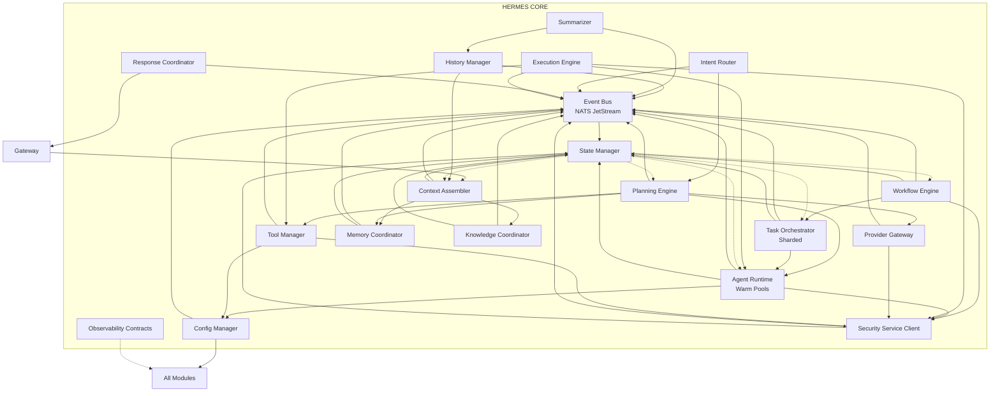
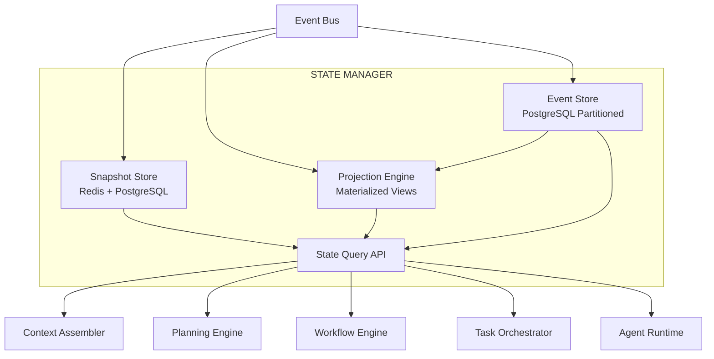
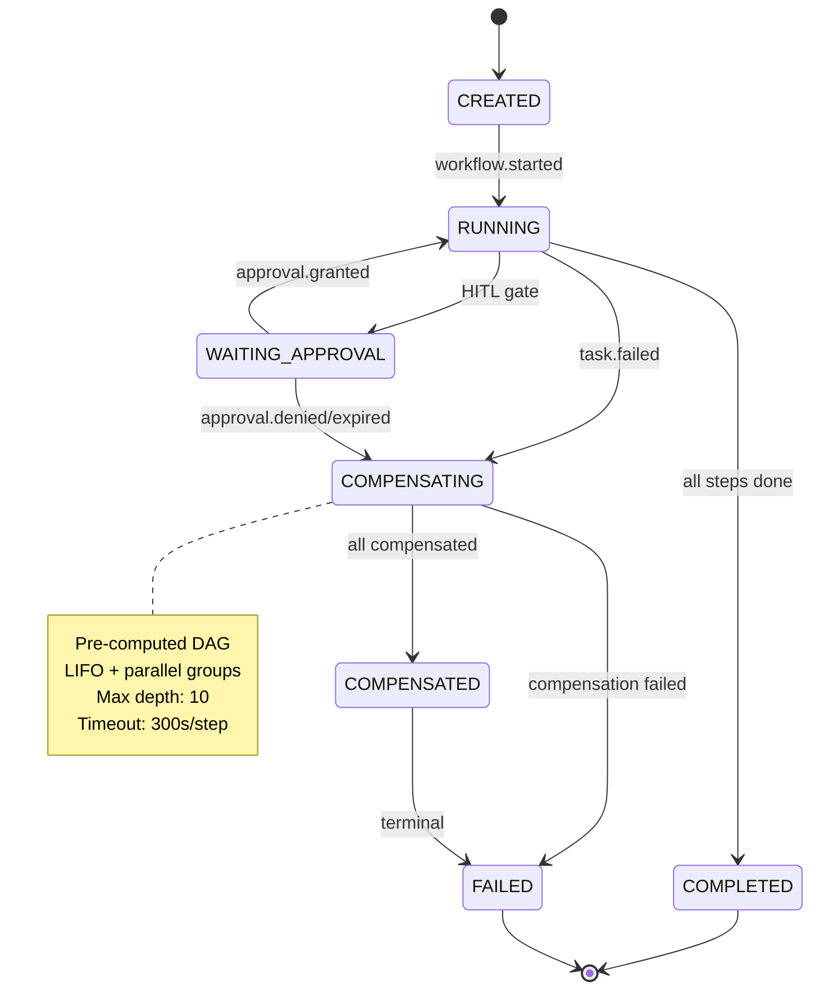

# RFC-0002 v1.1 — Complete Document (Sections 18-21)

---

## 18. Configuration Management (H-01)

### 18.1 Config Manager Module

| Responsibility | Implementation |
|----------------|----------------|
| **Central Config** | etcd cluster (3-node); key-value with schema validation (JSON Schema) |
| **Schema Validation** | All config changes validated against schema before apply; rejected on failure |
| **Feature Flags** | Boolean/percentage rollout; per-tenant, per-workspace, global; evaluated at module startup + hot-reload |
| **Secrets** | HashiCorp Vault integration; dynamic secrets for DB, providers, APIs; rotation via `config.secret.rotated` event |
| **Hot Reload** | Modules watch `config.updated` NATS topic; apply changes without restart (where safe) |
| **Config Versioning** | Every change versioned; rollback via `config.updated` with previous version |

### 18.2 Config Schema Example

```yaml
# config/hermes-core.yaml
hermes_core:
  event_bus:
    nats_servers: ["nats://nats-0:4222", "nats://nats-1:4222", "nats://nats-2:4222"]
    stream_replicas: 3
    max_ack_pending: 100
  state_manager:
    event_store_partitions: 64
    snapshot_interval_conversation: 50
    snapshot_interval_workflow: 5
    redis_ttl_seconds: 3600
  task_orchestrator:
    shard_count: 64
    max_tasks_per_shard: 50
    global_max_tasks: 100
  agent_runtime:
    default_idle_ttl_seconds: 300
    default_min_instances: 1
    default_max_instances: 10
  planning:
    token_budget_per_plan: 10000
    llm_planner_max_tokens: 4000
    plan_cache_ttl_hours: 24
  workflow:
    global_timeout_hours: 48
    compensation_timeout_seconds: 300
    max_compensation_depth: 10
  execution:
    wasm_runtime: "wasmtime"
    capability_token_ttl_minutes: 5
    max_ack_pending: 100
  security:
    token_verification_cache_ttl_seconds: 60
    pii_detection_enabled: true
  observability:
    trace_sampling_rate: 0.1
    error_trace_sampling_rate: 1.0
    metrics_interval_seconds: 15
```

### 18.3 Feature Flag Evaluation

```go
// Module startup
config := config_service.GetConfig("hermes_core")
featureFlags := config_service.GetFeatureFlags()

// Hot reload via NATS
nats.Subscribe("config.updated", func(msg *nats.Msg) {
    newConfig := parseConfig(msg.Data)
    applyConfig(newConfig)  // No restart required for most settings
})
```

---

## 19. Observability Contracts (H-03)

### 19.1 OpenTelemetry Span Attributes (Per Module)

| Module | Required Span Attributes |
|--------|-------------------------|
| **All** | `hermes.module`, `hermes.tenant_id`, `hermes.workspace_id`, `hermes.correlation_id`, `hermes.causation_id` |
| **Context Assembler** | `hermes.token_budget`, `hermes.context_sources` (working/episodic/semantic/workflow) |
| **Planning Engine** | `hermes.plan_id`, `hermes.task_count`, `hermes.parallel_groups`, `hermes.from_cache`, `hermes.fallback_used` |
| **Workflow Engine** | `hermes.workflow_id`, `hermes.workflow_step`, `hermes.compensation_triggered`, `hermes.hitl_required` |
| **Task Orchestrator** | `hermes.shard_id`, `hermes.task_id`, `hermes.agent_id`, `hermes.pool_type` |
| **Agent Runtime** | `hermes.agent_type`, `hermes.pool_size`, `hermes.instance_state`, `hermes.checkpoint_age` |
| **Execution Engine** | `hermes.tool_name`, `hermes.tool_version`, `hermes.wasm_instantiation_ms`, `hermes.artifact_count` |
| **Provider Gateway** | `hermes.provider`, `hermes.model`, `hermes.routing_score`, `hermes.fallback_triggered`, `hermes.cost_usd` |

### 19.2 Prometheus Metrics (Standard Names)

| Metric | Type | Labels | Description |
|--------|------|--------|-------------|
| `hermes_requests_total` | Counter | `module`, `status` | Total requests processed |
| `hermes_request_duration_seconds` | Histogram | `module`, `operation` | Request latency |
| `hermes_active_workflows` | Gauge | `tenant_id`, `workspace_id` | Active workflows |
| `hermes_active_tasks` | Gauge | `shard_id`, `agent_type` | Active tasks |
| `hermes_agent_pool_size` | Gauge | `agent_type`, `state` (idle/busy) | Pool size by state |
| `hermes_wasm_execution_duration_seconds` | Histogram | `tool_name`, `status` | WASM execution time |
| `hermes_provider_cost_usd_total` | Counter | `provider`, `model`, `tenant_id` | Provider costs |
| `hermes_tokens_consumed_total` | Counter | `module`, `direction` (input/output) | Token usage |
| `hermes_errors_total` | Counter | `module`, `error_category` | Errors by category |
| `hermes_circuit_breaker_state` | Gauge | `service`, `state` (closed/open/half-open) | Circuit breaker state |

### 19.3 Structured Log Format (JSON)

```json
{
  "timestamp": "2026-07-24T10:30:45.123Z",
  "level": "INFO",
  "module": "planning-engine",
  "trace_id": "abc123",
  "span_id": "def456",
  "tenant_id": "tenant-456",
  "workspace_id": "ws-123",
  "correlation_id": "conv-789",
  "message": "Plan created successfully",
  "fields": {
    "plan_id": "plan-001",
    "task_count": 5,
    "parallel_groups": 2,
    "from_cache": false,
    "token_estimate": 3421
  }
}
```

### 19.4 Trace Sampling

- **Head sampling**: 10% of all traces (configurable via `observability.trace_sampling_rate`)
- **Tail sampling**: 100% of error traces (configurable via `observability.error_trace_sampling_rate`)
- **Correlation**: `trace_id` propagated via `EventEnvelope.metadata.trace_id` and gRPC metadata

---

## 20. Multi-Region / Disaster Recovery (H-04)

### 20.1 NATS Supercluster Topology

```
┌─────────────────────────────────────────────────────────────────┐
│                      NATS SUPERCLUSTER                           │
│                                                                  │
│   ┌──────────────┐    ┌──────────────┐    ┌──────────────┐     │
│   │  REGION US-EAST  │  │  REGION EU-WEST  │  │ REGION AP-SE  │     │
│   │               │    │               │    │               │     │
│   │ Gateway       │    │ Gateway       │    │ Gateway       │     │
│   │ Leaf Node 1   │◀──▶│ Leaf Node 2   │◀──▶│ Leaf Node 3   │     │
│   │               │    │               │    │               │     │
│   └──────────────┘    └──────────────┘    └──────────────┘     │
│         │                   │                   │                │
│         └───────────────────┼───────────────────┘                │
│                             ▼                                    │
│                    ┌────────────────┐                             │
│                    │  GLOBAL TOPICS │                             │
│                    │ (Replicated)   │                             │
│                    └────────────────┘                             │
└─────────────────────────────────────────────────────────────────┘
```

- **Leaf nodes per region**: 3 for HA
- **Gateway per region**: Terminates client connections locally
- **Global topics**: `hermes.*` replicated across all regions
- **Local topics**: `hermes.local.*` for region-specific events

### 20.2 PostgreSQL Multi-Region

- **Primary**: Single write region (configurable)
- **Streaming replicas**: One per region; async replication
- **Failover**: Patroni + etcd; RTO < 5 min, RPO < 1 min
- **Read replicas**: Local reads in each region for projections

### 20.3 Data Residency

- **Tenant configuration**: `data_residency_region` per tenant
- **Event routing**: Events for tenant routed to resident region
- **Cross-region queries**: Proxied via Gateway; latency documented

### 20.4 DR Runbook

| Scenario | RTO | RPO | Action |
|----------|-----|-----|--------|
| Region outage | < 5 min | < 1 min | Promote replica; update DNS; drain connections |
| NATS cluster loss | < 2 min | 0 | Supercluster auto-heals; leaf nodes reconnect |
| PostgreSQL primary loss | < 5 min | < 1 min | Patroni failover; promote replica |
| Data corruption | < 30 min | 0 | Point-in-time recovery from WAL + base backup |

---

## 21. Contract Testing Framework (H-05)

### 21.1 gRPC Contract Testing (Pact)

```yaml
# pact/contracts/planning-engine.yaml
provider: "PlanningService"
consumer: "IntentRouter"
interactions:
  - description: "Create plan for valid intent"
    request:
      method: "POST"
      path: "/v1/plans"
      body:
        intent: "Create REST API for user management"
        context: { ... }
    response:
      status: 200
      body:
        plan_id: "plan-123"
        tasks: [...]
        from_cache: false
```

- **CI Gate**: `pact-verifier` runs on every PR; fails on contract breach
- **Provider publishes**: Contracts to Pact Broker on release
- **Consumer validates**: Against published contracts on PR

### 21.2 NATS Event Schema Testing (Schemathesis)

```python
# tests/contract/test_event_schemas.py
import schemathesis
from hermes_schemas import event_envelope

schema = schemathesis.from_path("schemas/event_envelope.proto")

@schema.parametrize()
def test_event_envelope_conformance(case):
    response = case.call()
    case.validate_response(response)
```

- **Schema Registry**: Buf Schema Registry for Protobuf
- **CI Gate**: `buf breaking` check on every PR; fails on breaking changes
- **Consumer-driven**: Consumers register expected schemas; producers must satisfy

### 21.3 Integration Test Architecture

```
┌─────────────────────────────────────────────────────────────────┐
│                    CONTRACT TEST LAYER                           │
│                                                                  │
│  ┌─────────────┐  ┌─────────────┐  ┌─────────────┐             │
│  │  PACT       │  │ SCHEMATHESIS│  │  INTEGRATION│             │
│  │  (gRPC)     │  │  (NATS)     │  │  (E2E)      │             │
│  │             │  │             │  │             │             │
│  │ - Provider  │  │ - Schema    │  │ - Full flow │             │
│  │   verifies  │  │   registry  │  │ - Chaos     │             │
│  │ - Consumer  │  │ - Breaking  │  │   engineering│            │
│  │   mocks     │  │   detection │  │ - Perf      │             │
│  └─────────────┘  └─────────────┘  └─────────────┘             │
└─────────────────────────────────────────────────────────────────┘
```

---

## 22. Architecture Diagrams (Updated)

### 22.1 Core Module Dependency Graph (Mermaid)



### 22.2 State Manager Architecture Diagram (Mermaid)



### 22.3 Workflow State Machine with Compensation (Mermaid)



---

## 23. Acceptance Criteria (Updated)

This RFC is considered complete when:

### 23.1 Architecture Completeness

- [ ] All 18 core modules defined with clear responsibilities and event ownership
- [ ] Event Bus specification complete (topics, schema, guarantees, domain ownership, multi-region)
- [ ] Workflow Engine DSL and state machine specified with compensation DAG, deadlock prevention
- [ ] State Manager event sourcing, snapshots, projections, partitioned event store defined
- [ ] ACP specification complete (envelope, patterns, registry, security)
- [ ] Internal APIs defined (both gRPC and event-driven)
- [ ] Component interaction flows documented for all major paths
- [ ] Security Service interface defined (standalone, RFC-0007)
- [ ] Config Manager module defined with schema, feature flags, secrets, hot-reload
- [ ] Observability contracts defined (OTel, Prometheus, JSON logs, sampling)

### 23.2 Technical Specifications

- [ ] Protobuf schemas for all events and internal APIs (v1)
- [ ] Error classification and retry policies per module
- [ ] Circuit breaker thresholds defined for all external dependencies
- [ ] Compensation patterns for all workflow step types with DAG validation
- [ ] WASM sandbox capability model specified (Wasmtime, WASI, host functions, supply chain)
- [ ] Agent manifest schema defined with versioning, migration, pool config
- [ ] Scalability targets and capacity planning documented (1x/10x/100x)
- [ ] Multi-region architecture defined (NATS supercluster, PostgreSQL replicas, DR runbook)
- [ ] Contract testing framework defined (Pact, Schemathesis, CI gates)

### 23.3 Diagrams

- [ ] Core module dependency graph (Mermaid)
- [ ] Request lifecycle sequence diagram (Mermaid)
- [ ] Agent communication topology (Mermaid)
- [ ] Workflow state machine diagram (Mermaid)
- [ ] State Manager architecture diagram (Mermaid)
- [ ] NATS supercluster topology (Mermaid)
- [ ] Task Orchestrator sharded architecture (Mermaid)
- [ ] Agent Runtime pool architecture (Mermaid)

### 23.4 Cross-RFC Consistency

- [ ] Aligns with RFC-0001 (Foundation) vision and principles
- [ ] Interfaces match RFC-0004 (Gateway) contract
- [ ] Memory Coordinator interface matches RFC-0005 (Memory Engine)
- [ ] Knowledge Coordinator interface matches RFC-0006 (Knowledge Engine)
- [ ] Security Service interface matches RFC-0007 (Security & Tenancy)
- [ ] Tool Manager interface matches RFC-0008 (Plugin SDK)
- [ ] Automation Engine interface matches RFC-0009 (Automation Platform)

### 23.5 Review Gates

- [ ] Chief System Architect sign-off
- [ ] Security Architect review (AuthZ, sandbox, PII, supply chain)
- [ ] Platform Engineer review (operability, scaling, deployment, DR)
- [ ] Agent Framework Lead review (ACP, agent lifecycle, pools, capabilities)
- [ ] Data Architect review (event store partitioning, projections, multi-region)

---

## 24. Open Questions (Resolved via ADRs)

| # | Question | ADR | Status |
|---|----------|-----|--------|
| 1 | NATS JetStream vs Kafka for Event Bus? | ADR-001 | **Resolved: NATS JetStream** |
| 2 | Wasmtime vs Wasmer for WASM sandbox? | ADR-002 | **Resolved: Wasmtime primary** |
| 3 | gRPC vs NATS for internal RPC? | ADR-003 | **Resolved: Event-driven primary, gRPC for queries** |
| 4 | Workflow partitioning strategy? | ADR-004 | **Resolved: Sharded by conversation_id** |
| 5 | Agent process model (pool vs per-task)? | ADR-005 | **Resolved: Warm pools with checkpoint/restore** |
| 6 | ACP payload: Protobuf vs JSON? | ADR-006 | **Resolved: Protobuf** |
| 7 | Embedded vs external NATS? | ADR-007 | **Resolved: External cluster** |

---

## 25. References

- RFC-0001: Hermes Agent OS v2 — Foundation Architecture
- RFC-0003: Mission Control Architecture (planned)
- RFC-0004: Hermes Gateway & Communication Channels (planned)
- RFC-0005: Memory Engine Architecture (planned)
- RFC-0006: Knowledge Engine & RAG Architecture (planned)
- RFC-0007: Security & Tenancy Model (planned)
- RFC-0008: Plugin/Tool SDK & WASM Sandbox (planned)
- RFC-0009: Automation Platform (planned)
- NATS JetStream Documentation
- Wasmtime Documentation
- OpenTelemetry Specification
- CNCF CloudEvents Specification
- OPA/Cedar Policy Language
- Sigstore/cosign Documentation

---

## 26. Glossary (L-05)

| Term | Definition |
|------|------------|
| **correlation_id** | Groups related events (typically conversation_id) |
| **causation_id** | Event that caused this event (for tracing causality) |
| **idempotency_key** | Unique key per operation to enable safe retry |
| **saga** | Sequence of operations with compensating actions for rollback |
| **HITL** | Human-in-the-Loop; approval gate in workflow |
| **ACP** | Agent Communication Protocol; message-based agent interaction |
| **WASI** | WebAssembly System Interface; standardized syscalls for WASM |
| **DLQ** | Dead Letter Queue; failed events after max retries |
| **CRDT** | Conflict-free Replicated Data Type; for client sync |
| **SPIFFE** | Secure Production Identity Framework For Everyone; workload identity |
| **OPA/Cedar** | Open Policy Agent / Cedar policy language for AuthZ |
| **Sigstore** | Software signing and transparency service |
| **Patroni** | PostgreSQL HA solution for failover |
| **MaxAckPending** | NATS consumer limit for unacknowledged messages (backpressure) |

---

**End of RFC-0002 v1.1**

*This document supersedes RFC-0002 v1.0. No implementation shall begin until this RFC is reviewed, approved, and all ADRs resolved.*