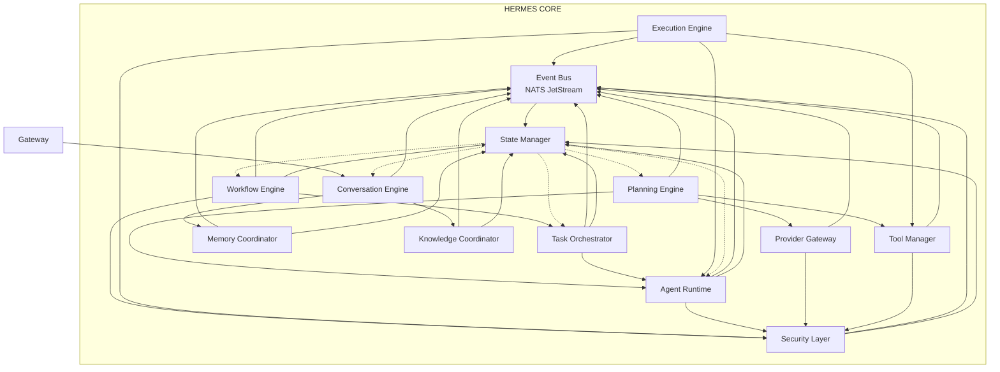
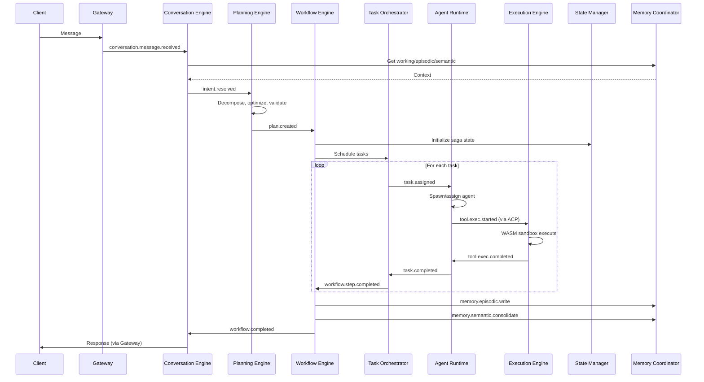

# RFC-0002
# Hermes Core Architecture

**Status:** Draft  
**Author:** Hermes Team  
**Owner:** Chief System Architect  
**Version:** 1.0  
**Priority:** Critical  
**Depends On:** RFC-0001 (Foundation Architecture)

---

## 1. Purpose

This RFC defines the internal architecture of **Hermes Core** — the central execution engine of Hermes Agent OS v2.

Hermes Core is the single source of truth for all execution, state, memory, and agent coordination. Every client (Desktop, Mission Control, Telegram, Discord, WhatsApp, Mobile, Web) connects to Hermes Core via the Hermes Gateway (RFC-0004). No client executes logic locally; all intelligence, planning, and orchestration reside in Core.

This RFC specifies:
- Core responsibilities and boundaries
- Module decomposition with clear interfaces
- Event-driven architecture (Event Bus, Workflow Engine, State Manager)
- Agent Runtime and Agent Communication Protocol (ACP)
- Request lifecycle from intent to response
- Error handling, scalability, and acceptance criteria

**No implementation code shall be generated from this RFC until approved.**

---

## 2. Scope

| In Scope | Out of Scope |
|----------|--------------|
| Hermes Core module architecture | Hermes Gateway / Protocol Adapters (RFC-0004) |
| Event Bus, Workflow Engine, State Manager | Client applications (Desktop, Mobile, Web) |
| Conversation, Planning, Task Orchestration, Execution | Mission Control UI (RFC-0003) |
| Agent Runtime, ACP, Internal APIs | Memory Engine detail (RFC-0005) |
| Component interactions, request lifecycle | Knowledge/RAG Engine detail (RFC-0006) |
| Error handling, scalability patterns | Security & Tenancy detail (RFC-0007) |
| Architecture diagrams | Plugin/Tool SDK detail (RFC-0008) |
| Acceptance criteria | Automation Platform (RFC-0009) |

---

## 3. Hermes Core Responsibilities

Hermes Core **shall**:

| Responsibility | Description |
|----------------|-------------|
| **Request Ingestion** | Accept normalized requests from Hermes Gateway; emit `conversation.message.received` |
| **Intent Understanding** | Parse, classify, enrich user intent; resolve ambiguity; emit `intent.resolved` |
| **Execution Planning** | Decompose intent into task DAG with dependencies, estimates, resource requirements; emit `plan.created` |
| **Task Orchestration** | Schedule tasks, assign agents, manage parallelism, enforce quotas; emit `task.assigned`, `task.started`, `task.completed`, `task.failed` |
| **Agent Lifecycle Management** | Spawn, health-check, checkpoint, restart, scale, drain agents; enforce resource limits |
| **Agent Communication** | Route ACP messages between agents; manage capability registry; enforce authZ |
| **State Management** | Maintain conversation, workflow, and agent state via event sourcing; provide snapshots |
| **Workflow Execution** | Execute saga-based workflows with compensation, HITL gates, checkpointing, idempotency |
| **Execution Sandbox** | Run tools/plugins in WASM sandbox; enforce capability tokens; capture stdout/stderr/artifacts |
| **Memory Coordination** | Coordinate with Memory Engine (RFC-0005) for working/episodic/semantic/procedural writes |
| **Observability Emission** | Emit structured traces (OTel), metrics, logs, audit events for every decision |
| **Multi-Client Sync** | Publish state changes to Sync Engine for CRDT-based client synchronization |

Hermes Core **shall not**:
- Handle protocol-specific logic (Telegram, Discord, etc.) — Gateway responsibility
- Render UI — Mission Control / Client responsibility
- Store long-term vectors/graphs directly — delegates to Memory/Knowledge Engines
- Manage user authentication — delegates to Security Layer (RFC-0007)

---

## 4. Core Module Decomposition

```
┌────────────────────────────────────────────────────────────────────────────────────┐
│                                    HERMES CORE                                      │
│                                                                                     │
│  ┌──────────────────────────────────────────────────────────────────────────────┐  │
│  │                              EVENT BUS (NATS/Kafka)                           │  │
│  │  Topics: conversation.*, intent.*, plan.*, task.*, agent.*, memory.*,       │  │
│  │          approval.*, audit.*, sync.*, system.*                               │  │
│  │  Schema Registry: Protobuf | Exactly-once | DLQ | Consumer Groups            │  │
│  └──────────────────────────────────────────────────────────────────────────────┘  │
│                                                                                     │
│  ┌──────────────┐ ┌──────────────┐ ┌──────────────┐ ┌──────────────┐ ┌──────────┐  │
│  │ CONVERSATION │ │   PLANNING   │ │   TASK       │ │  EXECUTION   │ │  AGENT   │  │
│  │   ENGINE     │ │   ENGINE     │ │ ORCHESTRATOR │ │   ENGINE     │ │ RUNTIME  │  │
│  │              │ │              │ │              │ │              │ │          │  │
│  │ - Ingest     │ │ - Decompose  │ │ - Schedule   │ │ - Sandbox    │ │ - Spawn  │  │
│  │ - Context    │ │ - DAG Build  │ │ - Assign     │ │ - Tool Exec  │ │ - Health │  │
│  │ - History    │ │ - Estimate   │ │ - Parallel   │ │ - Artifacts  │ │ - Checkpt│  │
│  │ - Summarize  │ │ - Optimize   │ │ - Quotas     │ │ - Streaming  │ │ - Scale  │  │
│  └──────┬───────┘ └──────┬───────┘ └──────┬───────┘ └──────┬───────┘ └────┬─────┘  │
│         │                │                │                │               │        │
│         └────────────────┼────────────────┼────────────────┼───────────────┘        │
│                          ▼                ▼                ▼                        │
│               ┌──────────────────────────────────────────────────────────────┐      │
│               │                      WORKFLOW ENGINE                          │      │
│               │  - Saga State Machine  - Compensation  - HITL Gates         │      │
│               │  - Checkpointing       - Idempotency   - Retry Policies      │      │
│               └──────────────────────────────────────────────────────────────┘      │
│                                      │                                               │
│                                      ▼                                               │
│               ┌──────────────────────────────────────────────────────────────┐      │
│               │                       STATE MANAGER                           │      │
│               │  - Event Sourcing    - Snapshots      - Projections           │      │
│               │  - Conversation State - Workflow State - Agent State          │      │
│               └──────────────────────────────────────────────────────────────┘      │
│                                                                                     │
│  ┌──────────────┐ ┌──────────────┐ ┌──────────────┐ ┌──────────────┐ ┌──────────┐  │
│  │   PROVIDER   │ │    TOOL      │ │   MEMORY     │ │  KNOWLEDGE   │ │ SECURITY │  │
│  │   GATEWAY    │ │   MANAGER    │ │  COORDINATOR │ │  COORDINATOR │ │  LAYER   │  │
│  │              │ │  (SDK/WASM)  │ │              │ │              │ │          │  │
│  │ - Router     │ │ - Manifest   │ │ - Working    │ │ - RAG Pipe   │ │ - AuthZ  │  │
│  │ - Fallback   │ │ - Sandbox    │ │ - Episodic   │ │ - Chunk/Emb  │ │ - Audit  │  │
│  │ - Cost Ctrl  │ │ - Marketplace│ │ - Semantic   │ │ - Hybrid Srch│ │ - PII    │  │
│  │ - Streaming  │ │ - Capability │ │ - Procedural │ │ - Freshness  │ │ - Sandbox│  │
│  └──────────────┘ └──────────────┘ └──────────────┘ └──────────────┘ └──────────┘  │
│                                                                                     │
└────────────────────────────────────────────────────────────────────────────────────┘
```

### 4.1 Module Specifications

| Module | Responsibility | Key Events Emitted | Key Events Consumed |
|--------|----------------|-------------------|---------------------|
| **Conversation Engine** | Request ingestion, context assembly, history management, summarization | `conversation.message.received`, `conversation.context.assembled`, `conversation.summarized` | `gateway.request.normalized`, `memory.episodic.retrieved` |
| **Planning Engine** | Intent → task DAG decomposition, estimation, optimization, dependency resolution | `plan.created`, `plan.optimized`, `plan.failed` | `intent.resolved`, `agent.capabilities.queried`, `tool.registry.queried` |
| **Task Orchestrator** | Scheduling, agent assignment, parallelism control, quota enforcement, priority handling | `task.assigned`, `task.started`, `task.completed`, `task.failed`, `task.retry` | `plan.created`, `agent.health.updated`, `agent.capacity.updated` |
| **Execution Engine** | Tool/plugin execution in WASM sandbox, artifact capture, streaming output, timeout enforcement | `tool.exec.started`, `tool.exec.completed`, `tool.exec.failed`, `tool.exec.stream` | `task.assigned`, `tool.manifest.queried`, `security.capability.granted` |
| **Agent Runtime** | Agent process lifecycle (spawn, health, checkpoint, restart, scale, drain), resource quotas | `agent.spawned`, `agent.healthy`, `agent.unhealthy`, `agent.checkpointed`, `agent.terminated` | `task.assigned`, `system.resources.updated`, `agent.config.updated` |
| **Workflow Engine** | Saga orchestration: state machine, compensation, HITL gates, checkpointing, idempotency, retry | `workflow.started`, `workflow.step.completed`, `workflow.compensating`, `workflow.hitl.required`, `workflow.completed`, `workflow.failed` | `plan.created`, `task.completed`, `task.failed`, `approval.granted`, `approval.denied` |
| **State Manager** | Event sourcing, snapshotting, projections, state queries for conversation/workflow/agent | `state.snapshot.created`, `state.projection.updated` | All domain events (consumer) |
| **Provider Gateway** | Model routing (cost/latency/capability), fallback chains, streaming, structured output, cost tracking | `provider.request.routed`, `provider.response.received`, `provider.fallback.triggered` | `plan.created`, `task.assigned` (for model calls) |
| **Tool Manager** | Plugin SDK, manifest registry, WASM sandbox, capability tokens, marketplace, versioning | `tool.manifest.registered`, `tool.manifest.updated`, `tool.execution.sandboxed` | `task.assigned`, `security.capability.verified` |
| **Memory Coordinator** | Interface to Memory Engine (RFC-0005): working/episodic/semantic/procedural read/write | `memory.working.write`, `memory.episodic.write`, `memory.semantic.query`, `memory.procedural.query` | `conversation.context.assembled`, `workflow.completed`, `tool.exec.completed` |
| **Knowledge Coordinator** | Interface to Knowledge Engine (RFC-0006): RAG pipeline, chunking, embedding, hybrid search | `knowledge.rag.query`, `knowledge.rag.response`, `knowledge.index.updated` | `plan.created`, `memory.semantic.consolidated` |
| **Security Layer** | AuthZ decisions, audit logging, PII detection, capability tokens, sandbox policy | `security.authz.decided`, `security.audit.logged`, `security.pii.detected` | All mutating operations (interceptor) |

---

## 5. Event Bus Architecture

### 5.1 Technology Choice

| Option | Recommendation | Rationale |
|--------|----------------|-----------|
| **NATS JetStream** | **Primary** | Lightweight, embedded-friendly, native streaming, consumer groups, exactly-once, low latency |
| **Apache Kafka** | Alternative | Higher throughput, mature ecosystem, but heavier operational burden |
| **Redpanda** | Alternative | Kafka-compatible, simpler, Rust-based |

**Decision:** NATS JetStream for Phase 1–3; evaluate Kafka migration at scale (>10K events/sec sustained).

### 5.2 Topic Taxonomy

```
hermes.
├── conversation.
│   ├── message.received
│   ├── context.assembled
│   ├── summarized
│   └── sync.required
├── intent.
│   ├── resolved
│   └── clarification.required
├── plan.
│   ├── created
│   ├── optimized
│   └── failed
├── task.
│   ├── assigned
│   ├── started
│   ├── completed
│   ├── failed
│   ├── retry
│   └── cancelled
├── agent.
│   ├── spawned
│   ├── healthy
│   ├── unhealthy
│   ├── checkpointed
│   ├── terminated
│   └── capacity.updated
├── workflow.
│   ├── started
│   ├── step.completed
│   ├── compensating
│   ├── hitl.required
│   ├── completed
│   └── failed
├── tool.
│   ├── exec.started
│   ├── exec.completed
│   ├── exec.failed
│   └── exec.stream
├── provider.
│   ├── request.routed
│   ├── response.received
│   └── fallback.triggered
├── memory.
│   ├── working.write
│   ├── episodic.write
│   ├── semantic.query
│   ├── semantic.response
│   └── procedural.query
├── knowledge.
│   ├── rag.query
│   ├── rag.response
│   └── index.updated
├── approval.
│   ├── requested
│   ├── granted
│   ├── denied
│   └── expired
├── audit.
│   ├── decision
│   ├── tool.call
│   └── data.access
├── sync.
│   ├── state.delta
│   ├── presence
│   └── read.receipt
└── system.
    ├── health.check
    ├── metrics.flushed
    └── config.updated
```

### 5.3 Event Envelope (Protobuf)

```protobuf
message EventEnvelope {
  string event_id = 1;           // UUID v7 (time-ordered)
  string correlation_id = 2;     // Groups related events (conversation_id)
  string causation_id = 3;       // Event that caused this event
  int64 timestamp_us = 4;        // Unix microseconds
  string source_module = 5;      // e.g., "conversation-engine"
  string event_type = 6;         // e.g., "conversation.message.received"
  bytes payload = 7;             // Protobuf payload (schema registry)
  map<string, string> metadata = 8;  // trace_id, span_id, tenant_id, workspace_id
}
```

### 5.4 Guarantees

| Guarantee | Implementation |
|-----------|----------------|
| **Ordering** | Per-correlation_id (conversation) ordering via NATS ordered consumer |
| **Exactly-once** | Deduplication via event_id + consumer acknowledgment |
| **Durability** | JetStream replication (3x) + persistent storage |
| **Replay** | Consumer groups with configurable start position (sequence, timestamp, new) |
| **DLQ** | Max 3 redelivery attempts → `hermes.dlq.{topic}` with original envelope + error context |
| **Schema Evolution** | Protobuf + Buf Schema Registry; backward/forward compatibility enforced in CI |

---

## 6. Workflow Engine (Saga Orchestrator)

### 6.1 Design Principles

- **Event-sourced**: Every workflow state transition is an event
- **Compensatable**: Every forward action has a defined compensation
- **Checkpointable**: State snapshots at configurable intervals
- **HITL-native**: Human approval as first-class workflow step
- **Idempotent**: All operations carry idempotency keys
- **Recoverable**: Workflow can resume from any checkpoint

### 6.2 Workflow Definition (DSL)

```yaml
# Example: Code Review Workflow
workflow:
  id: "code-review-v1"
  version: 1
  steps:
    - id: "analyze"
      agent: "code-analyst"
      action: "analyze_pr"
      compensation: "noop"
      checkpoint: true
    - id: "security-scan"
      agent: "security-agent"
      action: "scan"
      compensation: "noop"
      parallel: true
    - id: "human-review"
      type: "hitl"
      approvers: ["team-lead"]
      sla_hours: 24
      escalation: "engineering-manager"
      compensation: "notify_reviewer_cancelled"
    - id: "merge"
      agent: "git-agent"
      action: "merge_pr"
      compensation: "revert_merge"
      requires_approval: "human-review"
  on_failure: "compensate_all"
  timeout_hours: 48
```

### 6.3 State Machine

```
┌─────────┐     ┌──────────┐     ┌───────────┐     ┌───────────┐     ┌────────────┐
│ CREATED │────▶│  RUNNING │────▶│ COMPENSATING│────▶│ COMPLETED │     │   FAILED   │
└─────────┘     └────┬─────┘     └─────┬──────┘     └───────────┘     └────────────┘
                     │                 │
                     │ HITL            │ All compensated
                     ▼                 ▼
              ┌─────────────┐   ┌─────────────┐
              │  WAITING    │   │  COMPENSATED│
              │  APPROVAL   │   │             │
              └──────┬──────┘   └─────────────┘
                     │
            ┌────────┴────────┐
            ▼                 ▼
       ┌─────────┐       ┌─────────┐
       │ GRANTED │       │  DENIED │
       └────┬────┘       └────┬────┘
            │                 │
            ▼                 ▼
       (resume)          (compensate)
```

### 6.4 Checkpointing

| Trigger | Action |
|---------|--------|
| Every N steps (configurable, default 5) | Snapshot workflow state + variable bindings to State Manager |
| Before HITL gate | Snapshot + persist approval request |
| Before external API call | Snapshot + store idempotency key |
| On compensation start | Snapshot pre-compensation state |

### 6.5 Retry & Compensation Policies

```yaml
retry_policy:
  max_attempts: 3
  backoff: "exponential"
  base_delay_ms: 1000
  max_delay_ms: 30000
  retry_on: ["transient_error", "timeout", "rate_limit"]
  dead_letter_on: ["permanent_error", "validation_error"]

compensation:
  order: "reverse"  # LIFO
  parallel: false   # Sequential by default
  timeout_per_step: 300s
  on_compensation_failure: "escalate_to_operator"
```

---

## 7. State Manager

### 7.1 Architecture

```
┌─────────────────────────────────────────────────────────────────┐
│                        STATE MANAGER                             │
│                                                                  │
│  ┌─────────────┐  ┌─────────────┐  ┌─────────────┐             │
│  │  EVENT STORE│  │  SNAPSHOT   │  │ PROJECTION  │             │
│  │  (Append-   │  │   STORE     │  │   ENGINE    │             │
│  │   Only Log) │  │  (Redis +   │  │  (Material- │             │
│  │             │  │   PostgreSQL)│  │   ized Views)│             │
│  └──────┬──────┘  └──────┬──────┘  └──────┬──────┘             │
│         │                │                │                     │
│         └────────────────┼────────────────┘                     │
│                          ▼                                     │
│              ┌─────────────────────┐                            │
│              │   STATE QUERY API   │                            │
│              │  - get_conversation │                            │
│              │  - get_workflow     │                            │
│              │  - get_agent_state  │                            │
│              │  - replay_events    │                            │
│              └─────────────────────┘                            │
└─────────────────────────────────────────────────────────────────┘
```

### 7.2 Event Store

- **Storage**: PostgreSQL (event_store table) + NATS JetStream (live tail)
- **Schema**: `event_id, correlation_id, causation_id, timestamp, event_type, payload, metadata`
- **Indexing**: `(correlation_id, timestamp)`, `(event_type, timestamp)`, `(metadata->>'tenant_id', timestamp)`
- **Retention**: 7 years (configurable per tenant); cold storage to S3 after 90 days

### 7.3 Snapshots

| Entity | Snapshot Interval | Storage |
|--------|-------------------|---------|
| Conversation | Every 50 events or 5 min | Redis (hot) + PostgreSQL (durable) |
| Workflow | Every checkpoint trigger | Redis + PostgreSQL |
| Agent | Every health check (30s) | Redis only (ephemeral) |

### 7.4 Projections (Materialized Views)

| Projection | Source Events | Use Case |
|------------|---------------|----------|
| `conversation_summary` | `conversation.*`, `intent.*`, `plan.*` | Mission Control conversation list |
| `workflow_status` | `workflow.*`, `task.*`, `approval.*` | Mission Control workflow dashboard |
| `agent_registry` | `agent.*`, `task.assigned`, `task.completed` | Agent discovery, capacity planning |
| `token_usage` | `provider.response.received`, `tool.exec.completed` | Cost tracking, quotas |
| `audit_trail` | `audit.*` | Compliance, debugging |

---

## 8. Conversation Engine

### 8.1 Responsibilities

1. **Request Normalization** — Convert Gateway request to internal `ConversationMessage`
2. **Context Assembly** — Retrieve working memory, relevant episodic/semantic memory, active workflow state
3. **History Management** — Maintain conversation thread, summarize on token budget pressure
4. **Intent Delegation** — Emit `intent.resolve` with assembled context
5. **Response Streaming** — Coordinate streaming response back to Gateway

### 8.2 Context Assembly Algorithm

```python
def assemble_context(conversation_id, message, token_budget=8000):
    # 1. Working memory (always included)
    working = memory.working.get(conversation_id)
    
    # 2. Recent history (last N turns, fit in budget)
    recent = conversation.history.get_recent(conversation_id, max_tokens=token_budget * 0.3)
    
    # 3. Relevant episodic memories (semantic search)
    episodic = memory.episodic.search(
        query=message.content,
        conversation_id=conversation_id,
        limit=5,
        max_tokens=token_budget * 0.2
    )
    
    # 4. Relevant semantic knowledge (RAG)
    semantic = knowledge.rag.query(
        query=message.content,
        filters={"workspace_id": working.workspace_id},
        max_tokens=token_budget * 0.3
    )
    
    # 5. Active workflow state
    workflow = state_manager.get_workflow(conversation_id)
    
    return Context(
        working=working,
        recent_history=recent,
        episodic_memories=episodic,
        semantic_knowledge=semantic,
        active_workflow=workflow,
        token_estimate=estimate_tokens(...)
    )
```

### 8.3 Summarization Policy

| Trigger | Action |
|---------|--------|
| Context > 80% token budget | Summarize oldest 50% of history → store as episodic memory |
| Conversation idle > 1 hour | Full summarization → episodic memory |
| User requests "summarize" | Generate structured summary → episodic + semantic |

---

## 9. Planning Engine

### 9.1 Responsibilities

1. **Intent Decomposition** — Break intent into atomic tasks
2. **DAG Construction** — Build task dependency graph
3. **Resource Estimation** — Estimate tokens, time, cost, required capabilities
4. **Optimization** — Parallelize independent tasks, merge compatible tasks
5. **Validation** — Verify all capabilities exist in Agent/Tool Registry

### 9.2 Plan Schema (Protobuf)

```protobuf
message Task {
  string task_id = 1;
  string name = 2;
  string agent_role = 3;           // e.g., "backend-agent"
  string action = 4;               // e.g., "create_api_endpoint"
  map<string, string> inputs = 5;  // Parameter bindings
  repeated string depends_on = 6;  // Task IDs
  CapabilityRequirements caps = 7; // Required agent/tool capabilities
  EstimatedResources estimate = 8; // tokens, time_ms, cost_usd
  int32 priority = 9;              // 0-100
  bool parallelizable = 10;
  string idempotency_key = 11;
}

message Plan {
  string plan_id = 1;
  string conversation_id = 2;
  string intent = 3;
  repeated Task tasks = 4;
  map<string, string> variables = 5;  // Shared variables across tasks
  int64 created_at = 6;
  int32 version = 7;
}
```

### 9.3 Planning Algorithm

```
1. Parse intent → structured goal (LLM with structured output)
2. Retrieve relevant procedural memories (skills, workflows, patterns)
3. Query Agent Registry for available capabilities
4. Query Tool Registry for available tools
5. Generate candidate task DAG (LLM planner)
6. Validate DAG: no cycles, all capabilities satisfied, estimates reasonable
7. Optimize: topological sort → identify parallel groups → merge compatible
8. Assign provisional agents (capability match + capacity)
9. Emit plan.created
```

### 9.4 Re-planning Triggers

| Trigger | Action |
|---------|--------|
| Task fails (non-retryable) | Re-plan from failed task onward; preserve completed task outputs |
| Human approval denied | Re-plan with alternative path (compensation tasks) |
| New information (tool result) | Incremental re-plan: insert/modify downstream tasks |
| Resource exhaustion | Re-plan with reduced parallelism / cheaper models |

---

## 10. Task Orchestrator

### 10.1 Responsibilities

1. **Scheduling** — Convert plan DAG into executable task queue
2. **Agent Assignment** — Match tasks to agents (capability + capacity + affinity)
3. **Parallelism Control** — Enforce max concurrent tasks per agent, per conversation, global
4. **Priority Handling** — Preempt lower-priority tasks when quota exceeded
5. **Monitoring** — Track task lifecycle, emit events, detect stalls

### 10.2 Scheduling Algorithm

```python
def schedule_tasks(plan: Plan):
    # 1. Topological sort
    ready = [t for t in plan.tasks if not t.depends_on]
    running = {}
    completed = set()
    
    while ready or running:
        # 2. Assign ready tasks to agents
        for task in ready[:]:
            agent = agent_runtime.select_agent(task)
            if agent:
                agent_runtime.assign_task(agent, task)
                running[task.task_id] = (task, agent)
                ready.remove(task)
            else:
                # No capacity — wait or requeue
                task_queue.requeue(task, delay=5s)
        
        # 3. Monitor running tasks (event-driven in practice)
        for task_id, (task, agent) in list(running.items()):
            status = task_monitor.get_status(task_id)
            if status == COMPLETED:
                completed.add(task_id)
                # Unblock dependent tasks
                for t in plan.tasks:
                    if task_id in t.depends_on and all(d in completed for d in t.depends_on):
                        ready.append(t)
                del running[task_id]
            elif status == FAILED:
                # Trigger workflow compensation
                workflow_engine.handle_task_failure(task, agent)
                return
        
        yield_control()  # Event loop
```

### 10.3 Agent Selection Policy

| Factor | Weight | Description |
|--------|--------|-------------|
| Capability match | 40% | Required capabilities ⊆ agent capabilities |
| Current load | 25% | Fewer assigned tasks preferred |
| Affinity | 15% | Same agent for related tasks (context reuse) |
| Specialization | 10% | Prefer specialist over generalist |
| Cost efficiency | 10% | Lower cost per token for model-backed agents |

### 10.4 Quotas & Limits

| Limit | Default | Configurable |
|-------|---------|--------------|
| Max concurrent tasks per conversation | 10 | Yes |
| Max concurrent tasks per agent | 5 | Yes |
| Global max concurrent tasks | 100 | Yes |
| Task timeout | 30 min | Per-task |
| Task retry max | 3 | Per-task |

---

## 11. Execution Engine

### 11.1 Responsibilities

1. **Tool/Plugin Execution** — Run tools in WASM sandbox with capability tokens
2. **Streaming Support** — Stream stdout/stderr/structured output to clients
3. **Artifact Management** — Capture files, outputs, logs; store in Object Storage
4. **Timeout Enforcement** — Hard kill on timeout; emit failure event
5. **Resource Accounting** — Track CPU, memory, network, token usage per execution

### 11.2 WASM Sandbox Specification

| Feature | Implementation |
|---------|----------------|
| **Runtime** | Wasmtime (Rust) / wasmer (Go) — embedded in Execution Engine |
| **Capabilities** | WASI 0.2 + custom host functions (fs, net, crypto, model calls) |
| **Capability Tokens** | JWT signed by Security Layer; embedded in WASM module at instantiation |
| **Filesystem** | Virtual FS: `/workspace` (per-task), `/tmp` (ephemeral), `/tools` (read-only) |
| **Network** | Deny by default; allowlisted via capability token |
| **Resource Limits** | CPU time, memory, wall clock, file descriptors — enforced by host |
| **Determinism** | No system time, no random (unless capability granted) |

### 11.3 Execution Envelope

```protobuf
message ToolExecutionRequest {
  string execution_id = 1;
  string task_id = 2;
  string tool_name = 3;
  string tool_version = 4;
  bytes input = 5;                    // Protobuf (tool-specific)
  CapabilityToken capability_token = 6;
  ResourceLimits limits = 7;
  int64 timeout_ms = 8;
  bool stream_output = 9;
}

message ToolExecutionResponse {
  string execution_id = 1;
  ExecutionStatus status = 2;         // RUNNING, COMPLETED, FAILED, TIMEOUT
  bytes output = 3;                   // Protobuf (tool-specific)
  repeated Artifact artifacts = 4;    // Files produced
  ResourceUsage usage = 5;
  string error = 6;
  // Streaming: multiple responses with status=RUNNING, final with COMPLETED/FAILED
}
```

### 11.4 Streaming Protocol

- **Transport**: NATS JetStream consumer (pull-based) or WebSocket (Gateway)
- **Format**: NDJSON or Protobuf-delimited
- **Events**: `stdout`, `stderr`, `structured_log`, `artifact_created`, `progress`

---

## 12. Agent Runtime

### 12.1 Responsibilities

1. **Agent Process Management** — Spawn, monitor, checkpoint, restart, terminate
2. **Health & Capacity** — Report health, current load, available capacity
3. **Configuration** — Hot-reload agent config (model, tools, prompts)
4. **Communication** — Route ACP messages to/from agent processes
5. **Resource Enforcement** — CPU, memory, token quotas per agent

### 12.2 Agent Lifecycle

```
┌─────────┐     ┌──────────┐     ┌──────────┐     ┌───────────┐     ┌────────────┐
│ DEFINED │────▶│ SPAWNING │────▶│  HEALTHY │────▶│  BUSY     │────▶│  DRAINING  │
└─────────┘     └──────────┘     └────┬─────┘     └─────┬─────┘     └─────┬──────┘
                                      │                   │               │
                                      │  UNHEALTHY        │  IDLE         │  TERMINATED
                                      ▼                   ▼               ▼
                               ┌────────────┐      ┌────────────┐  ┌────────────┐
                               │ RESTARTING │      │  IDLE      │  │ TERMINATED │
                               └─────┬──────┘      └────────────┘  └────────────┘
                                     │
                                     ▼
                               (max 3 retries)
                                     │
                                     ▼
                               ┌────────────┐
                               │  FAILED    │ → Alert, DLQ, Operator
                               └────────────┘
```

### 12.3 Agent Definition (Manifest)

```yaml
# agent-manifest.yaml
agent:
  id: "backend-agent"
  version: "1.2.0"
  role: "specialist"
  category: "backend"
  capabilities:
    - "code-generation"
    - "api-design"
    - "database-schema"
    - "testing"
  model:
    provider: "anthropic"
    name: "claude-sonnet-4"
    parameters:
      temperature: 0.2
      max_tokens: 8192
  tools:
    - "filesystem"
    - "git"
    - "database"
    - "http-client"
  resources:
    max_concurrent_tasks: 3
    memory_limit_mb: 2048
    cpu_limit_cores: 2
    token_budget_per_task: 50000
  prompts:
    system: "prompts/backend-system.md"
    task: "prompts/backend-task.md"
  health_check:
    interval_seconds: 30
    timeout_seconds: 10
  checkpoint:
    enabled: true
    interval_tasks: 5
```

### 12.4 Agent Communication (ACP) — See Section 13

---

## 13. Agent Communication Protocol (ACP)

### 13.1 Design Goals

- **Decoupled**: Agents communicate via messages, not direct RPC
- **Observable**: Every message traced end-to-end
- **Secure**: Capability-based authZ, mTLS transport
- **Flexible**: Support request/response, streaming, pub/sub, handoff
- **Versioned**: Schema evolution via Protobuf

### 13.2 Transport

| Layer | Technology |
|-------|------------|
| **Message Bus** | NATS JetStream (core), Kafka (high-throughput alt) |
| **Service Mesh** | mTLS via SPIFFE/SPIRE (agent-to-agent) |
| **Real-time** | WebSocket (Gateway ↔ Agent for streaming) |

### 13.3 Message Envelope

```protobuf
message ACPMessage {
  string message_id = 1;           // UUID v7
  string correlation_id = 2;       // Workflow/conversation ID
  string causation_id = 3;         // Message this replies to
  int64 timestamp_us = 4;
  AgentIdentity source = 5;
  AgentIdentity target = 6;        // Empty for broadcast/pubsub
  MessagePattern pattern = 7;      // REQUEST, RESPONSE, STREAM, EVENT, HANDOFF
  string capability = 8;           // Required capability (for authZ)
  bytes payload = 9;               // Protobuf (schema per capability)
  map<string, string> metadata = 10; // trace_id, span_id, priority, ttl
}

message AgentIdentity {
  string agent_id = 1;             // e.g., "backend-agent-3"
  string agent_type = 2;           // e.g., "backend-agent"
  string workspace_id = 3;
  string tenant_id = 4;
}
```

### 13.4 Communication Patterns

| Pattern | Use Case | Example |
|---------|----------|---------|
| **REQUEST/RESPONSE** | Synchronous task delegation | Planner → Coder: "implement function" |
| **STREAMING** | Long-running with progress | Coder → Planner: streaming code chunks |
| **EVENT (Pub/Sub)** | Broadcast state changes | Agent → All: "capability.registered" |
| **HANDOFF** | Transfer ownership with context | Coder → Reviewer: "review this PR" |
| **NEGOTIATION** | Contract net protocol | Manager → Specialists: "who can do X cheapest?" |

### 13.5 Capability Registry

- **Storage**: etcd / Consul (watchable, TTL-based health)
- **Registration**: Agent Runtime registers on spawn; heartbeats every 10s
- **Schema**: `agent_id, agent_type, capabilities[], version, capacity, health, endpoint`
- **Discovery**: Task Orchestrator queries registry for capability match

### 13.6 Security

- **Transport**: mTLS (SPIFFE certificates, auto-rotated)
- **AuthZ**: Capability tokens in message metadata; verified by Security Layer interceptor
- **Audit**: All ACP messages logged to `audit.agent.communication`

---

## 14. Internal APIs

### 14.1 Module-to-Module (gRPC)

| Service | Methods | Consumers |
|---------|---------|-----------|
| `ConversationService` | `AssembleContext`, `GetHistory`, `Summarize` | Planning Engine, Workflow Engine |
| `PlanningService` | `CreatePlan`, `Replan`, `ValidatePlan` | Conversation Engine, Workflow Engine |
| `TaskOrchestrationService` | `ScheduleTasks`, `AssignTask`, `GetTaskStatus` | Workflow Engine, Agent Runtime |
| `ExecutionService` | `ExecuteTool`, `StreamOutput`, `GetArtifacts` | Task Orchestrator, Agent Runtime |
| `AgentRuntimeService` | `SpawnAgent`, `HealthCheck`, `Checkpoint`, `Terminate` | Task Orchestrator, Workflow Engine |
| `StateService` | `GetState`, `ReplayEvents`, `CreateSnapshot` | All modules |
| `ProviderService` | `RouteRequest`, `StreamResponse`, `GetModels` | Planning Engine, Agent Runtime, Execution Engine |
| `ToolService` | `RegisterTool`, `GetManifest`, `VerifyCapability` | Execution Engine, Agent Runtime |
| `MemoryService` | `ReadWorking`, `WriteEpisodic`, `QuerySemantic`, `QueryProcedural` | Conversation Engine, Workflow Engine, Agent Runtime |
| `KnowledgeService` | `RAGQuery`, `IndexDocument`, `HybridSearch` | Planning Engine, Conversation Engine |
| `SecurityService` | `Authorize`, `AuditLog`, `DetectPII`, `IssueCapabilityToken` | All modules (interceptor) |

### 14.2 Event-Driven (NATS) — Primary Integration Pattern

All modules **prefer** event emission over synchronous RPC. RPC used only for:
- Query operations requiring immediate response
- Operations requiring transactional consistency across modules
- Health checks and control plane operations

---

## 15. Component Interactions

### 15.1 Request Lifecycle (Complete Flow)

```
┌─────────────┐
│   GATEWAY   │  (Normalizes protocol-specific request)
└──────┬──────┘
       │ conversation.message.received
       ▼
┌─────────────────────────────────────────────────────────────────┐
│                    CONVERSATION ENGINE                          │
│  1. Assemble context (working + episodic + semantic + workflow) │
│  2. Emit intent.resolved                                        │
└──────────────────────────┬──────────────────────────────────────┘
                           │ intent.resolved
                           ▼
┌─────────────────────────────────────────────────────────────────┐
│                     PLANNING ENGINE                             │
│  1. Decompose intent → Task DAG                                 │
│  2. Query Agent/Tool Registry for capabilities                  │
│  3. Estimate resources, optimize parallelism                    │
│  4. Emit plan.created                                           │
└──────────────────────────┬──────────────────────────────────────┘
                           │ plan.created
                           ▼
┌─────────────────────────────────────────────────────────────────┐
│                      WORKFLOW ENGINE                            │
│  1. Initialize saga state machine                               │
│  2. Emit workflow.started                                       │
│  3. Delegate to Task Orchestrator                               │
└──────────────────────────┬──────────────────────────────────────┘
                           │ task.assigned (per task)
                           ▼
┌─────────────────────────────────────────────────────────────────┐
│                     TASK ORCHESTRATOR                           │
│  1. Select agent (capability + capacity + affinity)             │
│  2. Emit task.assigned → Agent Runtime                          │
└──────────────────────────┬──────────────────────────────────────┘
                           │ task.assigned
                           ▼
┌─────────────────────────────────────────────────────────────────┐
│                       AGENT RUNTIME                             │
│  1. Spawn/assign agent process                                  │
│  2. Route ACP message to agent                                  │
│  3. Agent executes (may call tools via Execution Engine)        │
└──────────────────────────┬──────────────────────────────────────┘
                           │ tool.exec.started (per tool call)
                           ▼
┌─────────────────────────────────────────────────────────────────┐
│                      EXECUTION ENGINE                           │
│  1. Instantiate WASM sandbox with capability token              │
│  2. Execute tool, stream output                                 │
│  3. Capture artifacts, emit tool.exec.completed/failed          │
└──────────────────────────┬──────────────────────────────────────┘
                           │ task.completed / task.failed
                           ▼
┌─────────────────────────────────────────────────────────────────┐
│                      WORKFLOW ENGINE                            │
│  1. Advance saga state machine                                  │
│  2. If HITL gate → emit approval.requested → WAITING            │
│  3. If all tasks done → emit workflow.completed                 │
│  4. If failure → emit workflow.compensating                     │
└──────────────────────────┬──────────────────────────────────────┘
                           │ workflow.completed
                           ▼
┌─────────────────────────────────────────────────────────────────┐
│                    CONVERSATION ENGINE                          │
│  1. Coordinate memory writes (episodic, semantic, procedural)   │
│  2. Emit conversation.sync.required                             │
│  3. Stream final response via Gateway                           │
└─────────────────────────────────────────────────────────────────┘
```

### 15.2 HITL (Human-in-the-Loop) Flow

```
WORKFLOW ENGINE                          GATEWAY                          CLIENT
     │                                     │                                 │
     ├─ approval.requested ──────────────▶│                                 │
     │                                     ├─ Push notification ──────────▶│
     │                                     │                                 │
     │                                     │◀─ approval.granted ───────────┤
     │◀─ approval.granted ────────────────┤                                 │
     │                                     │                                 │
     ├─ workflow resumed ────────────────▶│                                 │
```

- **SLA**: Configurable per approval (default 24h)
- **Escalation**: Auto-escalate to role/group on expiry
- **Delegation**: Approver can delegate to another user
- **Audit**: Full trail in `audit.approval.*`

---

## 16. Error Handling

### 16.1 Error Classification

| Category | Examples | Handling |
|----------|----------|----------|
| **TRANSIENT** | Network timeout, rate limit, temporary unavailable | Retry with exponential backoff (max 3) |
| **RESOURCE** | OOM, CPU quota, token budget exceeded | Re-plan with reduced scope / cheaper model |
| **VALIDATION** | Schema violation, capability missing, authZ denied | Fail fast; no retry; emit audit event |
| **PERMANENT** | Bug, data corruption, unsupported operation | DLQ + operator alert; no automatic retry |
| **HUMAN** | Approval denied, clarification needed | Workflow HITL path; not an "error" |

### 16.2 Retry Policy (Configurable per Module)

```yaml
retry:
  max_attempts: 3
  backoff:
    strategy: "exponential"
    base_ms: 1000
    max_ms: 30000
    jitter: true
  retry_on:
    - "TRANSIENT"
    - "RESOURCE"  # With re-plan
  dead_letter_on:
    - "VALIDATION"
    - "PERMANENT"
  dead_letter_topic: "hermes.dlq.{original_topic}"
```

### 16.3 Circuit Breaker

| Service | Threshold | Timeout | Half-Open Requests |
|---------|-----------|---------|-------------------|
| Provider Gateway | 50% errors in 10s | 30s | 3 |
| Tool Execution | 30% failures in 30s | 60s | 2 |
| Agent Runtime | 3 consecutive health failures | 120s | 1 |
| Memory/Knowledge | 20% errors in 60s | 60s | 5 |

### 16.4 Compensation & Saga Rollback

- Every workflow step **must** define compensation
- Compensation executes in reverse order (LIFO)
- Compensation failures → escalate to operator (DLQ + alert)
- Idempotency keys prevent duplicate compensation

---

## 17. Scalability Considerations

### 17.1 Horizontal Scaling

| Component | Scaling Strategy |
|-----------|------------------|
| **Conversation Engine** | Stateless; scale behind load balancer; sticky session by conversation_id |
| **Planning Engine** | Stateless; scale horizontally; cache procedural memories in Redis |
| **Task Orchestrator** | Single leader (election via NATS); followers for read queries |
| **Execution Engine** | Stateless workers; scale by queue depth; WASM sandbox per worker |
| **Agent Runtime** | One process per agent instance; scale agent types independently |
| **Workflow Engine** | Partition by workflow_id; each partition single-threaded for ordering |
| **State Manager** | Read replicas for projections; single writer for event store |
| **Provider Gateway** | Stateless; scale horizontally; provider connections pooled |
| **Tool Manager** | Registry: etcd (consistent); Execution: stateless workers |

### 17.2 Performance Targets

| Metric | Target (P99) |
|--------|--------------|
| Request ingestion → `intent.resolved` | < 500ms |
| `intent.resolved` → `plan.created` | < 2s |
| `plan.created` → first `task.assigned` | < 100ms |
| Tool execution overhead (sandbox) | < 50ms |
| Event Bus latency (publish → consume) | < 10ms |
| State Manager query (projection) | < 50ms |
| State Manager query (replay) | < 500ms |
| HITL approval → workflow resume | < 1s (push) |

### 17.3 Capacity Planning

| Resource | Baseline | 10x Scale | 100x Scale |
|----------|----------|-----------|------------|
| Concurrent conversations | 100 | 1,000 | 10,000 |
| Concurrent workflows | 50 | 500 | 5,000 |
| Concurrent agent instances | 20 | 200 | 2,000 |
| Events/second | 1,000 | 10,000 | 100,000 |
| NATS JetStream storage | 10 GB | 100 GB | 1 TB |
| PostgreSQL (event store) | 50 GB | 500 GB | 5 TB |
| Redis (snapshots/cache) | 10 GB | 50 GB | 200 GB |

---

## 18. Architecture Diagrams

### 18.1 Core Module Dependency Graph



### 18.2 Request Lifecycle Sequence Diagram



### 18.3 Agent Communication Topology

```mermaid
graph LR
    subgraph "ACP over NATS JetStream"
        A1[Planner Agent]
        A2[Coder Agent]
        A3[Reviewer Agent]
        A4[Security Agent]
        A5[Git Agent]
    end
    
    A1 -.->|REQUEST: implement| A2
    A2 -.->|STREAM: code chunks| A1
    A2 -.->|HANDOFF: review| A3
    A3 -.->|REQUEST: scan| A4
    A4 -.->|RESPONSE: findings| A3
    A3 -.->|HANDOFF: merge| A5
    A5 -.->|RESPONSE: merged| A3
    
    Registry[Capability Registry\n(etcd)] --> A1
    Registry --> A2
    Registry --> A3
    Registry --> A4
    Registry --> A5
```

---

## 19. Acceptance Criteria

This RFC is considered complete when:

### 19.1 Architecture Completeness

- [ ] All 12 core modules defined with clear responsibilities
- [ ] Event Bus specification complete (topics, schema, guarantees)
- [ ] Workflow Engine DSL and state machine specified
- [ ] State Manager event sourcing, snapshots, projections defined
- [ ] ACP specification complete (envelope, patterns, registry, security)
- [ ] Internal APIs defined (both gRPC and event-driven)
- [ ] Component interaction flows documented for all major paths

### 19.2 Technical Specifications

- [ ] Protobuf schemas for all events and internal APIs
- [ ] Error classification and retry policies per module
- [ ] Circuit breaker thresholds defined
- [ ] Compensation patterns for all workflow step types
- [ ] WASM sandbox capability model specified
- [ ] Agent manifest schema defined
- [ ] Scalability targets and capacity planning documented

### 19.3 Diagrams

- [ ] Core module dependency graph (Mermaid)
- [ ] Request lifecycle sequence diagram (Mermaid)
- [ ] Agent communication topology (Mermaid)
- [ ] Workflow state machine diagram
- [ ] State Manager architecture diagram

### 19.4 Cross-RFC Consistency

- [ ] Aligns with RFC-0001 (Foundation) vision and principles
- [ ] Interfaces match RFC-0004 (Gateway) contract
- [ ] Memory Coordinator interface matches RFC-0005 (Memory Engine)
- [ ] Knowledge Coordinator interface matches RFC-0006 (Knowledge Engine)
- [ ] Security Layer interface matches RFC-0007 (Security & Tenancy)
- [ ] Tool Manager interface matches RFC-0008 (Plugin SDK)
- [ ] Automation Engine interface matches RFC-0009 (Automation Platform)

### 19.5 Review Gates

- [ ] Principal Architect sign-off
- [ ] Security Architect review (authZ, sandbox, PII)
- [ ] Platform Engineer review (operability, scaling, deployment)
- [ ] Agent Framework Lead review (ACP, agent lifecycle, capabilities)

---

## 20. Open Questions

| # | Question | Impact | Decision Needed By |
|---|----------|--------|-------------------|
| 1 | NATS JetStream vs Kafka for Event Bus? | Operational complexity, scaling | Phase 1 kickoff |
| 2 | Wasmtime vs Wasmer for WASM sandbox? | Language binding | Phase 1 kickoff |
| 3 | gRPC vs NATS for internal RPC? | Latency, complexity | Phase 1 design |
| 4 | Single workflow partition vs sharded? | Ordering guarantees | Phase 1 design |
| 5 | Agent process per task vs pooled? | Resource isolation vs overhead | Phase 1 prototype |
| 6 | Protobuf vs JSON for ACP payload? | Schema evolution, debugging | Phase 1 design |
| 7 | Embedded NATS vs external cluster? | Operational model | Phase 1 infra |

---

## 21. References

- RFC-0001: Hermes Agent OS v2 — Foundation Architecture
- RFC-0003: Mission Control Architecture (planned)
- RFC-0004: Hermes Gateway & Communication Channels (planned)
- RFC-0005: Memory Engine Architecture (planned)
- RFC-0006: Knowledge Engine & RAG Architecture (planned)
- RFC-0007: Security & Tenancy Model (planned)
- RFC-0008: Plugin/Tool SDK & WASM Sandbox (planned)
- RFC-0009: Automation Platform (planned)
- NATS JetStream Documentation
- Wasmtime Documentation
- OpenTelemetry Specification
- CNCF CloudEvents Specification

---

**End of RFC-0002**

*This document is a draft. No implementation shall begin until this RFC is reviewed, approved, and all open questions resolved.*