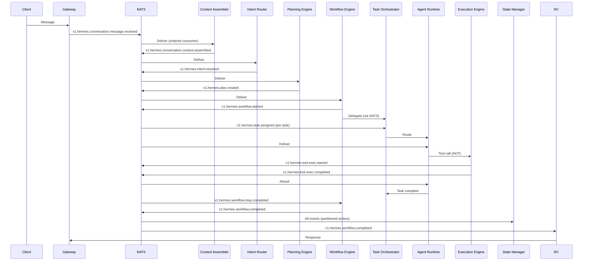
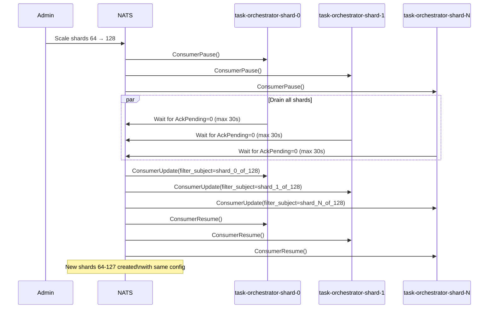

# RFC-0003
# Hermes Event Bus & Messaging Architecture

**Status:** Draft  
**Author:** Hermes Team  
**Owner:** Chief System Architect  
**Version:** 1.1  
**Priority:** Critical  
**Depends On:** RFC-0001 (Foundation Architecture), RFC-0002 (Core Architecture v1.1)  
**Supersedes:** RFC-0003 v1.0

---

## 1. Purpose

This RFC defines the **Event Bus and Messaging Architecture** for Hermes Agent OS v2 — the central nervous system that enables all communication between modules, agents, and external systems.

The Event Bus is the **single source of truth for all state changes** in Hermes. Every module publishes domain events; every module subscribes via consumer-driven contracts. No direct RPC between modules for state mutations.

**Scope:** This RFC covers only the messaging foundation. It does not cover:
- Business logic of modules (RFC-0002)
- Gateway protocols (RFC-0004)
- Memory/Knowledge engines (RFC-0005, RFC-0006)
- Security policy (RFC-0007)

---

## 2. Design Principles

| Principle | Description |
|-----------|-------------|
| **Event-First** | All state changes are events; commands are derived from events |
| **Domain Ownership** | Each topic namespace owned by exactly one module |
| **Consumer-Driven Contracts** | Consumers define expectations; producers must satisfy |
| **Exactly-Once Semantics** | Deduplication via event_id + acknowledgment |
| **Ordered per Correlation** | Events for same conversation/workflow ordered |
| **Observable by Default** | Every event traced, metered, logged |
| **Multi-Tenant Isolation** | Tenant/workspace in every event; per-tenant quotas enforced |
| **Schema Evolution** | Protobuf + Buf Registry; backward/forward compatibility matrix enforced |
| **Resilient** | DLQ, retry, replay, circuit breaker built-in |
| **Multi-Region** | NATS supercluster with global topic replication |

---

## 3. Event Bus Architecture

### 3.1 Technology Choice: NATS JetStream

| Requirement | NATS JetStream Solution |
|-------------|-------------------------|
| **Embedded-friendly** | Single binary, no JVM, ~10MB |
| **Streaming** | Native streams, consumer groups, pull/push |
| **Exactly-once** | Deduplication window + ack policy |
| **Ordering** | Ordered consumer per subject |
| **Replication** | Reseek by sequence, timestamp, or new |
| **Multi-region** | Supercluster with leaf nodes |
| **Schema registry** | Protobuf via Buf (external) |
| **Observability** | Built-in metrics, Prometheus exporter |
| **Log Compaction** | Key-based retention for state subjects |
| **Per-Account Quotas** | Tenant isolation via NATS accounts |

**Decision:** NATS JetStream is the **mandatory** Event Bus for Phase 1–3. Kafka migration evaluated at >100K events/sec sustained (ADR-001).

### 3.2 Topology

```
┌─────────────────────────────────────────────────────────────────────────────┐
│                         NATS JETSTREAM CLUSTER                               │
│                                                                              │
│   ┌─────────────────────────────────────────────────────────────────────┐   │
│   │                        STREAM: HERMES                                │   │
│   │  Subjects: hermes.>, hermes.local.>                                 │   │
│   │  Replicas: 3                                                        │   │
│   │  Retention: Per-domain (configurable per tenant)                    │   │
│   │  Storage: File-based (NVMe recommended)                             │   │
│   │  Max message size: 1 MB (larger via chunked payload protocol)       │   │
│   │  Log Compaction: hermes.agent.*.state (key=agent_id),               │   │
│   │                hermes.workflow.status (key=workflow_id)             │   │
│   └─────────────────────────────────────────────────────────────────────┘   │
│                                                                              │
│   ┌─────────────┐  ┌─────────────┐  ┌─────────────┐  ┌─────────────┐      │
│   │  CONSUMER   │  │  CONSUMER   │  │  CONSUMER   │  │   CONSUMER  │      │
│   │  GROUP:     │  │  GROUP:     │  │  GROUP:     │  │   GROUP:    │      │
│   │  planning   │  │  workflow   │  │  task-orch  │  │  state-mgr  │      │
│   │  - pull     │  │  - pull     │  │  - pull     │  │  - pull     │      │
│   │  - ack      │  │  - ack      │  │  - ack      │  │  - ack      │      │
│   └─────────────┘  └─────────────┘  └─────────────┘  └─────────────┘      │
│                                                                              │
└─────────────────────────────────────────────────────────────────────────────┘
```

### 3.3 Stream Configuration

```yaml
# NATS JetStream Stream Config (hermes stream)
name: "HERMES"
description: "Hermes Agent OS Event Bus"
subjects:
  - "hermes.>"
  - "hermes.local.>"
  - "hermes.dlq.>"
  - "hermes.large_payload.>"
  - "hermes.system.backpressure.>"
retention: "limits"          # Retain until limits reached
max_msgs: -1                 # Unlimited messages (bounded by per-tenant quotas)
max_bytes: -1                # Unlimited bytes (bounded by per-tenant quotas)
max_age: 168h                # 7 days default (overridden per-domain)
max_msg_size: 1048576        # 1 MB
storage: "file"              # File-based storage
replicas: 3                  # 3x replication
no_ack: false                # Require acknowledgment
duplicate_window: 120s       # Deduplication window
discard: "old"               # Discard oldest when full
allow_rollup_hdrs: true      # Allow rollup headers
```

### 3.4 Per-Tenant Account Configuration (C-02)

```yaml
# NATS Account per tenant (enforced via nats-server config)
accounts:
  tenant-{tenant_id}:
    jetstream:
      max_memory: 4GB           # Configurable per tier
      max_storage: 100GB        # Configurable per tier
      max_streams: 10
      max_consumers: 50
      max_ack_pending: 10000
      max_bytes_required: 1048576
    exports:
      - stream: HERMES          # Global topics (read-only for tenant)
    imports:
      - account: SYSTEM         # For system events
    limits:
      conn: 1000
      subs: 5000
      data: 10GB
      payload: 1048576          # 1 MB per message
```

---

## 4. Event Ownership Model

### 4.1 Domain Ownership Rule

**Each topic namespace is owned by exactly one module.** Only the owning module may **publish** events in its namespace. Other modules **subscribe** via consumer-driven contracts.

| Namespace | Owner Module | Consumers |
|-----------|--------------|-----------|
| `hermes.conversation.*` | Conversation Modules (Context/History/Summarizer/Intent/Response) | Planning, Workflow, State, Sync |
| `hermes.intent.*` | Intent Router | Planning, Conversation |
| `hermes.plan.*` | Planning Engine | Workflow, Task Orchestrator, Agent Runtime |
| `hermes.task.*` | Task Orchestrator | Workflow, Agent Runtime, Execution, State |
| `hermes.agent.*` | Agent Runtime | Task Orchestrator, Workflow, Planning, State |
| `hermes.workflow.*` | Workflow Engine | Task Orchestrator, Conversation, State, Approval |
| `hermes.tool.*` | Execution Engine | Agent Runtime, Task Orchestrator, State |
| `hermes.provider.*` | Provider Gateway | Planning, Agent Runtime, Execution, State |
| `hermes.memory.*` | Memory Coordinator | Conversation, Workflow, Agent Runtime, Knowledge |
| `hermes.knowledge.*` | Knowledge Coordinator | Planning, Conversation, Memory |
| `hermes.approval.*` | Workflow Engine | Gateway, Mission Control, State |
| `hermes.audit.*` | Security Service | All modules (read-only), Compliance |
| `hermes.sync.*` | Response Coordinator | Gateway, Clients |
| `hermes.config.*` | Config Manager | All modules |
| `hermes.system.*` | Platform/Infra | All modules |
| `hermes.large_payload.*` | Platform/Infra | All modules (chunked payloads) |
| `hermes.dlq.*` | Platform/Infra | Operators, Mission Control |

### 4.2 Ownership Enforcement

- **CI Gate**: `buf breaking` check on producer schemas; consumer contracts validated
- **Runtime**: NATS permissions — only owner service account has `publish` on namespace
- **Breaking Changes**: Require consumer approval via contract test update
- **Schema Compatibility Matrix** enforced (see §6.5)

---

## 5. Topic Naming Conventions

### 5.1 Full Topic Format

```
hermes.{domain}.{entity}.{action}[.{qualifier}]
```

| Component | Format | Examples |
|-----------|--------|----------|
| **Prefix** | `hermes` | Always `hermes` |
| **Domain** | Module-owned namespace | `conversation`, `plan`, `task`, `agent` |
| **Entity** | Domain entity | `message`, `context`, `turn`, `summary` |
| **Action** | Past tense verb | `received`, `assembled`, `appended`, `stored` |
| **Qualifier** (optional) | Additional context | `requested`, `granted`, `denied`, `expired` |

### 5.2 Special Topic Patterns

| Pattern | Purpose | Example |
|---------|---------|---------|
| `hermes.local.{domain}.*` | Region-local events | `hermes.local.conversation.presence` |
| `hermes.dlq.{topic}` | Dead letter queue | `hermes.dlq.v1.hermes.task.assigned` |
| `hermes.large_payload.{chunk_id}` | Chunked payload | `hermes.large_payload.abc123.chunk.001` |
| `hermes.system.backpressure.{consumer_group}` | Backpressure signal | `hermes.system.backpressure.task-orchestrator-shard-0` |
| `v{N}.hermes.{domain}.{entity}.{action}` | Versioned topic | `v2.hermes.plan.created` |

### 5.3 Examples (v1)

| Topic | Owner | Description |
|-------|-------|-------------|
| `v1.hermes.conversation.message.received` | Context Assembler | Inbound message from Gateway |
| `v1.hermes.conversation.context.assembled` | Context Assembler | Context ready for intent |
| `v1.hermes.conversation.turn.appended` | History Manager | Turn added to history |
| `v1.hermes.conversation.summary.stored` | History Manager | Summary persisted |
| `v1.hermes.conversation.summarized` | Summarizer | Summarization complete |
| `v1.hermes.conversation.response.streaming` | Response Coordinator | Streaming chunk to client |
| `v1.hermes.conversation.sync.required` | Response Coordinator | Client sync needed |
| `v1.hermes.intent.resolved` | Intent Router | Intent classified |
| `v1.hermes.intent.clarification.required` | Intent Router | Ambiguity detected |
| `v1.hermes.plan.created` | Planning Engine | New plan emitted |
| `v1.hermes.plan.optimized` | Planning Engine | Plan re-optimized |
| `v1.hermes.plan.cached` | Planning Engine | Plan served from cache |
| `v1.hermes.task.assigned` | Task Orchestrator | Task → agent mapping |
| `v1.hermes.task.started` | Task Orchestrator | Agent began execution |
| `v1.hermes.task.completed` | Task Orchestrator | Task finished successfully |
| `v1.hermes.task.failed` | Task Orchestrator | Task failed |
| `v1.hermes.task.retry` | Task Orchestrator | Task retry initiated |
| `v1.hermes.workflow.started` | Workflow Engine | Saga initialized |
| `v1.hermes.workflow.step.completed` | Workflow Engine | Step done |
| `v1.hermes.workflow.compensating` | Workflow Engine | Compensation started |
| `v1.hermes.workflow.hitl.required` | Workflow Engine | Human approval needed |
| `v1.hermes.workflow.completed` | Workflow Engine | Saga complete |
| `v1.hermes.workflow.checkpoint.created` | Workflow Engine | Checkpoint saved |

---

## 6. Event Versioning Strategy

### 6.1 Version in Topic

**Major version encoded in topic entity:**

```
v1.hermes.conversation.message.received
v2.hermes.conversation.message.received
```

- Only **major** version in topic (breaking changes)
- Minor/patch versions handled via Protobuf field evolution

### 6.2 Version in Event Envelope

```protobuf
message EventEnvelope {
  string event_id = 1;              // UUID v7 (time-ordered, globally unique)
  string correlation_id = 2;        // Conversation/workflow ID (tenant-prefixed)
  string causation_id = 3;          // Parent event ID
  int64 timestamp_us = 4;           // Unix microseconds (UTC)
  string source_module = 5;         // Module name (kebab-case)
  string event_type = 6;            // Full topic with version: "v1.hermes.plan.created"
  bytes payload = 7;                // Protobuf payload (schema registry)
  map<string, string> metadata = 8; // trace_id, span_id, tenant_id, workspace_id, version, priority
}
```

### 6.3 Correlation ID Format (Tenant-Prefixed)

```
{tenant_id}:{uuid_v7}
```

Example: `tenant-123:018f8a7b-4c2d-7e8f-9a1b-cdef01234567`

- Guarantees global uniqueness across tenants
- Enables tenant-scoped queries without cross-tenant leakage

### 6.4 Compatibility Rules

| Change Type | Allowed? | Migration |
|-------------|----------|-----------|
| Add optional field | ✅ Yes | Auto-compatible |
| Add required field | ❌ No (major) | New topic version |
| Remove field | ✅ Yes (if optional) | Deprecate first (2 versions) |
| Change field type | ❌ No (major) | New topic version |
| Rename field | ❌ No (major) | New topic version |
| Add new event type | ✅ Yes | New topic, same version |
| Add new enum value | ✅ Yes | Consumers must handle unknown |

### 6.5 Schema Compatibility Matrix (C-01)

| Field Type | Add Optional | Remove Optional | Change Type | Rename | Add Required |
|------------|--------------|-----------------|-------------|--------|--------------|
| **Primitive** (string, int, bool) | ✅ | ✅ | ❌ | ❌ | ❌ |
| **Message** (nested) | ✅ | ✅ | ❌ | ❌ | ❌ |
| **Repeated** | ✅ | ✅ | ❌ | ❌ | ❌ |
| **Map** | ✅ | ✅ | ❌ | ❌ | ❌ |
| **Enum** | ✅ (new value) | ❌ | ❌ | ❌ | ❌ |
| **Oneof** | ✅ (new field) | ❌ | ❌ | ❌ | ❌ |

**Enforcement:**
- `buf breaking` runs on every PR with custom rules
- Producers must register contract tests for each consumer
- Breaking change = new major version topic + 2-version deprecation window

### 6.6 Schema Registry

- **Registry**: Buf Schema Registry (BSR)
- **Format**: Protobuf v3
- **Validation**: `buf breaking` on every PR + custom compatibility matrix linter
- **Packages**: `hermes.events.v1`, `hermes.events.v2`, etc.
- **Deprecation Policy**: 2 major versions before removal

---

## 7. Event Schemas

### 7.1 Core Event Envelope (v1)

```protobuf
// hermes/events/v1/envelope.proto
package hermes.events.v1;

message EventEnvelope {
  string event_id = 1;              // UUID v7 (time-ordered, globally unique)
  string correlation_id = 2;        // tenant:conversation_id
  string causation_id = 3;          // Parent event ID
  int64 timestamp_us = 4;           // Unix microseconds (UTC)
  string source_module = 5;         // Module name (kebab-case)
  string event_type = 6;            // Full topic with version: "v1.hermes.plan.created"
  bytes payload = 7;                // Protobuf payload (schema registry)
  map<string, string> metadata = 8; // trace_id, span_id, tenant_id, workspace_id, version, priority
}

message EventMetadata {
  string trace_id = 1;              // W3C traceparent trace-id
  string span_id = 2;               // W3C traceparent parent-id
  string tenant_id = 3;             // Tenant identifier
  string workspace_id = 4;          // Workspace identifier
  string version = 5;               // Schema minor version: "1.2"
  string priority = 6;              // "low", "normal", "high", "critical"
  string idempotency_key = 7;       // For deduplication
  string payload_ref = 8;           // For large payloads: s3://bucket/key
}
```

### 7.2 Large Payload Protocol (C-03)

For payloads > 1 MB:

1. **Producer** chunks payload into 1 MB pieces
2. **Uploads** chunks to S3/MinIO: `s3://hermes-payloads/{tenant_id}/{event_id}/chunk.{n}`
3. **Publishes** `hermes.large_payload.{event_id}.chunk.{n}` with chunk metadata
4. **Final chunk** includes `payload_ref` in EventEnvelope metadata
5. **Consumer** reassembles from object store before processing
6. **Lifecycle**: 7-day TTL, then auto-delete

```protobuf
// hermes/events/v1/large_payload.proto
package hermes.events.v1;

message LargePayloadChunk {
  string event_id = 1;
  int32 chunk_index = 2;
  int32 total_chunks = 3;
  bytes data = 4;
  bool is_final = 5;
  string payload_ref = 6;           // Set on final chunk
  int64 total_size_bytes = 7;
  string content_type = 8;
}
```

### 7.3 Domain Event Payloads (Examples)

```protobuf
// hermes/events/v1/conversation.proto
package hermes.events.v1;

message ConversationMessageReceived {
  string conversation_id = 1;
  string message_id = 2;
  string user_id = 3;
  string content = 4;
  map<string, string> metadata = 5;
  int64 received_at_us = 6;
}

message ConversationContextAssembled {
  string conversation_id = 1;
  Context context = 2;
  int32 token_estimate = 3;
  repeated string source_events = 4;
}

// hermes/events/v1/plan.proto
package hermes.events.v1;

message PlanCreated {
  string plan_id = 1;
  string conversation_id = 2;
  string intent = 3;
  repeated Task tasks = 4;
  map<string, string> variables = 5;
  CompensationDAG compensation_dag = 6;
  string intent_fingerprint = 7;
  bool from_cache = 8;
  int64 created_at_us = 9;
}

message Task {
  string task_id = 1;
  string name = 2;
  string agent_role = 3;
  string action = 4;
  map<string, string> inputs = 5;
  repeated string depends_on = 6;
  CapabilityRequirements caps = 7;
  EstimatedResources estimate = 8;
  int32 priority = 9;
  bool parallelizable = 10;
  string idempotency_key = 11;
  string compensation_action = 12;
}

// hermes/events/v1/task.proto
package hermes.events.v1;

message TaskAssigned {
  string task_id = 1;
  string plan_id = 2;
  string agent_id = 3;
  string agent_type = 4;
  string pool_id = 5;
  int64 assigned_at_us = 6;
  int64 deadline_us = 7;
}

message TaskCompleted {
  string task_id = 1;
  string execution_id = 2;
  bytes output = 3;
  repeated Artifact artifacts = 4;
  ResourceUsage usage = 5;
  int64 completed_at_us = 6;
}

// hermes/events/v1/workflow.proto
package hermes.events.v1;

message WorkflowStarted {
  string workflow_id = 1;
  string plan_id = 2;
  string conversation_id = 3;
  int64 started_at_us = 4;
  int64 global_timeout_us = 5;
}

message WorkflowStepCompleted {
  string workflow_id = 1;
  string step_id = 2;
  string task_id = 3;
  bool is_hitl_gate = 4;
  int64 completed_at_us = 5;
}

message WorkflowHitlRequired {
  string workflow_id = 1;
  string step_id = 2;
  string approval_id = 3;
  repeated string approvers = 4;
  int32 sla_hours = 5;
  string escalation_role = 6;
  ApprovalPayload payload = 7;
  int64 requested_at_us = 8;
  int64 expires_at_us = 9;
  repeated string delegation_chain = 10;  // v2 addition
}

// hermes/events/v1/approval.proto
package hermes.events.v1;

message ApprovalRequested {
  string approval_id = 1;
  string workflow_id = 2;
  string step_id = 3;
  repeated string approvers = 4;
  int32 sla_hours = 5;
  string escalation_role = 6;
  ApprovalPayload payload = 7;
  int64 requested_at_us = 8;
  int64 expires_at_us = 9;
}

message ApprovalGranted {
  string approval_id = 1;
  string approver_id = 2;
  string decision = 3;
  string comment = 4;
  int64 decided_at_us = 5;
}

message ApprovalPayload {
  string title = 1;
  string description = 2;
  map<string, string> context = 3;
  repeated string required_reviews = 4;
}
```

### 7.4 Log Compaction Subjects (C-04)

| Subject | Key | Retention | Purpose |
|---------|-----|-----------|---------|
| `hermes.agent.{agent_type}.state` | `agent_id` | 7 days | Latest agent health/capacity |
| `hermes.workflow.status` | `workflow_id` | 30 days | Current workflow state |
| `hermes.agent.pool.status` | `pool_id` | 1 day | Pool sizing decisions |

---

## 8. Event Lifecycle

```
┌─────────────┐     ┌─────────────┐     ┌─────────────┐     ┌─────────────┐
│   PRODUCE   │────▶│  PERSIST    │────▶│  CONSUME    │────▶│  ACKNOWLEDGE│
│             │     │  (Stream)   │     │  (Consumer) │     │             │
└─────────────┘     └─────────────┘     └─────────────┘     └─────────────┘
       │                   │                   │                   │
       │                   │                   │                   │
       ▼                   ▼                   ▼                   ▼
  - Validate          - Replicate         - Deserialize       - Mark processed
  - schema            - (3x)              - Validate          - Update cursor
  - Enrich            - Index             - Process           - Emit metrics
  - metadata          - Deduplicate       - Emit downstream   - Handle errors
  - Assign            - (window)          - events            - (retry/DLQ)
  - event_id          - Compaction        - Handle backpressure
```

### 8.1 Produce Phase

1. **Validate** payload against Protobuf schema (Buf registry)
2. **Enrich** with metadata: `trace_id`, `span_id`, `tenant_id`, `workspace_id`, `correlation_id`, `causation_id`
3. **Assign** `event_id` (UUID v7 — time-ordered, globally unique)
4. **Large payload check**: If > 1 MB → chunk and upload (§7.2)
5. **Publish** to NATS subject with `MsgHeader` for metadata

### 8.2 Persist Phase (NATS JetStream)

1. **Replicate** to 3 nodes (RAFT consensus)
2. **Index** by: `correlation_id`, `event_type`, `timestamp`, `tenant_id`
3. **Deduplicate** via `event_id` within 120s window
4. **Compaction** for state subjects (latest by key)
5. **Retain** per-domain TTL (§17.1)

### 8.3 Consume Phase

1. **Pull** batch (configurable, default 100)
2. **Deserialize** envelope + payload
3. **Validate** `correlation_id` ordering (ordered consumer)
4. **Idempotency check** via Redis (§15)
5. **Process** business logic
6. **Emit** downstream events (new `causation_id` = this `event_id`)

### 8.4 Acknowledge Phase

1. **Success**: `Ack()` — cursor advances
2. **Retryable error**: `Nak()` with delay — requeued
3. **Non-retryable**: `Term()` — sent to DLQ
4. **Backpressure**: If `MaxAckPending` exceeded, publish `hermes.system.backpressure.{consumer_group}`
5. **Metrics**: Latency, throughput, error rates recorded

---

## 9. Publisher/Subscriber Model

### 9.1 Publisher Responsibilities

| Responsibility | Implementation |
|----------------|----------------|
| **Schema compliance** | Validate against BSR before publish |
| **Metadata enrichment** | Auto-inject trace/tenant/correlation IDs |
| **Idempotency key** | Include in metadata for deduplication |
| **Ordering** | Use ordered consumer for correlation_id |
| **Error handling** | Retry with backoff; circuit breaker on NATS |
| **Large payload** | Chunk + upload if > 1 MB |
| **Backpressure response** | Throttle on `hermes.system.backpressure.*` |

### 9.2 Subscriber Responsibilities

| Responsibility | Implementation |
|----------------|----------------|
| **Consumer group** | Join appropriate group (e.g., `planning`, `workflow`) |
| **Ack policy** | Explicit ack after successful processing |
| **Replay safety** | Handle duplicate delivery (idempotency keys) |
| **Backpressure** | `MaxAckPending=100`; monitor queue depth; signal upstream |
| **Dead letter** | Process DLQ events; alert on accumulation |
| **Rebalance protocol** | Pause → drain → reassign → resume (§10.4) |

### 9.3 Consumer Group Configuration

```yaml
# Example consumer config per module
consumer_groups:
  planning-engine:
    stream: "HERMES"
    filter_subject: "v1.hermes.intent.resolved"
    deliver_policy: "all"
    ack_policy: "explicit"
    ack_wait: 60s                   # LLM calls may be slow
    max_deliver: 3
    max_ack_pending: 100
    replay_policy: "instant"
    durable_name: "planning-engine"
    headers_only: false
  
  workflow-engine:
    stream: "HERMES"
    filter_subject: "v1.hermes.plan.created,v1.hermes.task.completed,v1.hermes.task.failed,v1.hermes.approval.granted,v1.hermes.approval.denied"
    ack_wait: 30s
    max_deliver: 5                  # Critical path, more retries
    max_ack_pending: 100
    durable_name: "workflow-engine"
  
  state-manager-conversation:
    stream: "HERMES"
    filter_subject: "v1.hermes.conversation.*"
    ack_wait: 10s
    max_deliver: 10                 # Must not lose events
    max_ack_pending: 500
    durable_name: "state-manager-conversation"
  
  state-manager-workflow:
    stream: "HERMES"
    filter_subject: "v1.hermes.workflow.*,v1.hermes.task.*,v1.hermes.approval.*"
    ack_wait: 10s
    max_deliver: 10
    max_ack_pending: 500
    durable_name: "state-manager-workflow"
  
  state-manager-agent:
    stream: "HERMES"
    filter_subject: "v1.hermes.agent.*"
    ack_wait: 10s
    max_deliver: 10
    max_ack_pending: 500
    durable_name: "state-manager-agent"
  
  state-manager-audit:
    stream: "HERMES"
    filter_subject: "v1.hermes.audit.*"
    ack_wait: 10s
    max_deliver: 10
    max_ack_pending: 500
    durable_name: "state-manager-audit"
```

---

## 10. Consumer Groups

### 10.1 Group Design

| Consumer Group | Modules | Purpose |
|----------------|---------|---------|
| `context-assembler` | Context Assembler | Consumes `gateway.request.normalized`, memory events |
| `intent-router` | Intent Router | Consumes `v1.hermes.conversation.context.assembled` |
| `planning-engine` | Planning Engine | Consumes `v1.hermes.intent.resolved`, agent/tool registry |
| `workflow-engine` | Workflow Engine | Consumes `v1.hermes.plan.created`, `v1.hermes.task.*`, `v1.hermes.approval.*` |
| `task-orchestrator-shard-{0..63}` | Task Orchestrator (per shard) | Consumes `v1.hermes.workflow.started`, `v1.hermes.workflow.step.completed`, agent health |
| `agent-runtime` | Agent Runtime | Consumes `v1.hermes.task.assigned`, config updates |
| `execution-engine` | Execution Engine | Consumes `v1.hermes.task.assigned` (for tool calls) |
| `state-manager-conversation` | State Manager | Consumes `v1.hermes.conversation.*` |
| `state-manager-workflow` | State Manager | Consumes `v1.hermes.workflow.*, v1.hermes.task.*, v1.hermes.approval.*` |
| `state-manager-agent` | State Manager | Consumes `v1.hermes.agent.*` |
| `state-manager-audit` | State Manager | Consumes `v1.hermes.audit.*` |
| `memory-coordinator` | Memory Coordinator | Consumes `v1.hermes.workflow.completed`, `v1.hermes.tool.exec.completed` |
| `knowledge-coordinator` | Knowledge Coordinator | Consumes `v1.hermes.plan.created`, `v1.hermes.memory.semantic.consolidated` |
| `response-coordinator` | Response Coordinator | Consumes `v1.hermes.workflow.completed`, `v1.hermes.memory.writes.completed` |
| `audit-logger` | Security Service | Consumes `v1.hermes.audit.*` |

### 10.2 Sharded Consumers (Task Orchestrator)

```yaml
# Task Orchestrator: one consumer group per shard (64 total)
task-orchestrator-shard-0:
  filter_subject: "v1.hermes.workflow.started,v1.hermes.workflow.step.completed,v1.hermes.task.*"
  # Shard routing via correlation_id hash in processor

task-orchestrator-shard-1:
  filter_subject: "v1.hermes.workflow.started,v1.hermes.workflow.step.completed,v1.hermes.task.*"
  # ... 64 shards total
```

### 10.3 Consumer Lifecycle

```
┌──────────┐     ┌──────────┐     ┌──────────┐     ┌──────────┐
│  START   │────▶│  CATCHUP │────▶│  STEADY  │────▶│  SHUTDOWN│
└──────────┘     └──────────┘     └──────────┘     └──────────┘
      │              │              │              │
      ▼              ▼              ▼              ▼
  - Connect     - Replay from    - Process      - Drain
  - Create      cursor/last      - Ack          - Ack pending
  - Subscribe   - Verify         - Metrics      - Close conn
  - Register    ordering         - Backpressure - Leave group
```

### 10.4 Consumer Group Rebalance Protocol (H-01)

**Trigger:** Shard count change, node failure, scale event

```
┌─────────────┐     ┌─────────────┐     ┌─────────────┐     ┌─────────────┐
│   PAUSE     │────▶│   DRAIN     │────▶│  REASSIGN   │────▶│  RESUME     │
│  (pause)    │     │  (ack pending)│    │ (new shards) │     │  (resume)   │
└─────────────┘     └─────────────┘     └─────────────┘     └─────────────┘
```

**Implementation via NATS Consumer API:**

```go
// 1. Pause all consumers in group
for _, consumer := range consumers {
    nats.ConsumerPause(consumer)
}

// 2. Drain: wait for AckPending to reach 0 (max 30s)
waitForDrain(consumers, 30*time.Second)

// 3. Update consumer config (new filter_subject per shard)
for i, consumer := range consumers {
    newFilter := computeShardFilter(i, newShardCount)
    nats.ConsumerUpdate(consumer, filter_subject: newFilter)
}

// 4. Resume
for _, consumer := range consumers {
    nats.ConsumerResume(consumer)
}
```

**Safety:** Max drain time 30s; if exceeded, force-reassign with replay from last acknowledged sequence.

---

## 11. Dead Letter Queues (DLQ)

### 11.1 DLQ Strategy

| Failure Type | Handling |
|--------------|----------|
| **Max retries exceeded** (3) | Move to DLQ |
| **Non-retryable error** (validation, authZ) | Move to DLQ immediately |
| **Processing timeout** (ack_wait) | Nak → retry → DLQ |
| **Deserialization failure** | Move to DLQ immediately |
| **Circuit breaker open** | Move to DLQ after 5 failures |

### 11.2 DLQ Topic Structure

```
hermes.dlq.{version}.{original_topic}
```

Examples:
- `hermes.dlq.v1.hermes.task.assigned`
- `hermes.dlq.v1.hermes.workflow.hitl.required`

### 11.3 DLQ Event Envelope

```protobuf
message DeadLetterEvent {
  EventEnvelope original_event = 1;
  string error_message = 2;
  string error_category = 3;        // "TRANSIENT", "VALIDATION", "PERMANENT", "TIMEOUT", "CB_OPEN"
  int32 delivery_attempt = 4;
  int64 first_attempt_us = 5;
  int64 last_attempt_us = 6;
  string consumer_group = 7;
  string stack_trace = 8;
  string circuit_breaker_state = 9; // "closed", "open", "half-open"
}
```

### 11.4 DLQ Processing

| Action | Trigger |
|--------|---------|
| **Alert** | DLQ depth > 100 events (per topic) |
| **Auto-retry** | After fix deployment (via admin API `ReplayDLQ`) |
| **Manual replay** | Operator initiates via Mission Control |
| **Circuit breaker on DLQ consumer** | If > 5 consecutive failures, pause DLQ consumer |
| **Retention** | 30 days, then archive to S3 (Parquet) |

### 11.5 DLQ Circuit Breaker (EVT-006 Mitigation)

```yaml
dlq_circuit_breaker:
  failure_threshold: 5
  timeout: 60s
  half_open_requests: 1
  on_open: "pause_dlq_consumer"
```

---

## 12. Retry Policies

### 12.1 Standard Retry Configuration

```yaml
retry_policy:
  max_attempts: 3
  backoff:
    strategy: "exponential"
    base_delay_ms: 1000
    max_delay_ms: 30000
    jitter: true
    multiplier: 2.0
  retry_on_categories:
    - "TRANSIENT"
    - "TIMEOUT"
    - "RESOURCE"
  dead_letter_on_categories:
    - "VALIDATION"
    - "PERMANENT"
    - "AUTHZ_DENIED"
    - "DESERIALIZATION"
```

### 12.2 Per-Consumer Overrides

| Consumer Group | Max Attempts | Ack Wait | Rationale |
|----------------|--------------|----------|-----------|
| `planning-engine` | 3 | 60s | LLM calls may be slow |
| `workflow-engine` | 5 | 30s | Critical path, more retries |
| `task-orchestrator-shard-*` | 3 | 30s | Standard |
| `execution-engine` | 2 | 120s | WASM execution varies |
| `state-manager-*` | 10 | 10s | Must not lose events |
| `agent-runtime` | 3 | 30s | Standard |
| `memory-coordinator` | 3 | 30s | Standard |

### 12.3 Retry with Idempotency

- Every event carries `idempotency_key` in metadata
- Consumers **must** track processed keys (Redis SET with TTL)
- Duplicate detection before processing

---

## 13. Event Replay

### 13.1 Replay Triggers

| Trigger | Method |
|---------|--------|
| **New consumer** | `deliver_policy: "all"` — replay from start |
| **Schema migration** | Admin API: `Replay(subject, start_sequence, end_sequence)` |
| **Bug fix** | Replay affected correlation_ids |
| **Projection rebuild** | State Manager: full replay |
| **Disaster recovery** | Cross-region replay from replica |
| **DLQ reprocessing** | Admin API: `ReplayDLQ(topic, correlation_ids)` |

### 13.2 Replay API

```protobuf
service ReplayService {
  rpc ReplayFromSequence(ReplayRequest) returns (ReplayResponse);
  rpc ReplayByTimeRange(TimeRangeRequest) returns (ReplayResponse);
  rpc ReplayByCorrelationId(CorrelationReplayRequest) returns (ReplayResponse);
  rpc ReplayDLQ(DLQReplayRequest) returns (ReplayResponse);
}

message ReplayRequest {
  string stream = 1;
  string consumer = 2;
  uint64 start_sequence = 3;
  uint64 end_sequence = 4;          // 0 = latest
  bool reset_cursor = 5;            // Reset consumer cursor after replay
}

message CorrelationReplayRequest {
  string stream = 1;
  string consumer = 2;
  repeated string correlation_ids = 3;
  bool reset_cursor = 4;
}

message DLQReplayRequest {
  string dlq_topic = 1;
  repeated string correlation_ids = 2;
  bool reset_cursor = 3;
}
```

### 13.3 Replay Safety

- **Idempotent consumers**: Safe to replay any event
- **Ordered replay**: Per-correlation_id ordering preserved
- **Rate limiting**: Max 10K events/sec during replay
- **Backpressure during replay**: `MaxAckPending=500` for replay consumers
- **Metrics**: `hermes_replay_events_total`, `hermes_replay_duration_seconds`, `hermes_replay_rate_limited_total`

### 13.4 Replay Storm Protection (EVT-009 Mitigation)

- New consumers on high-volume topics: `deliver_policy: "last"` by default
- `deliver_policy: "all"` requires explicit opt-in + rate limit
- Replay consumers get dedicated `MaxAckPending=500`

---

## 14. Ordering Guarantees

### 14.1 Guarantee Levels

| Level | Scope | Implementation |
|-------|-------|----------------|
| **Per-Correlation** | Single conversation/workflow | NATS ordered consumer on `correlation_id` |
| **Per-Causation** | Direct cause-effect chain | Single-threaded consumer per correlation_id |
| **Global** | None (eventual) | Not guaranteed; use saga for coordination |

### 14.2 Ordered Consumer Configuration

```yaml
consumer:
  ordered_consumer: true
  deliver_policy: "all"
  ack_policy: "explicit"
  # NATS ensures messages with same correlation_id
  # delivered in order to same consumer instance
```

### 14.3 Ordering Caveats

- **Replay breaks ordering** if multiple consumers process same correlation_id
- **Sharding** splits ordering — Task Orchestrator shards by conversation_id
- **Compensation events** may arrive out of order — handled by Workflow Engine state machine
- **Cross-shard dependencies** — Global Coordinator sequences via `hermes.system.sequencing` topic

---

## 15. Idempotency

### 15.1 Idempotency Key

Every event **must** include `idempotency_key` in metadata:

```protobuf
message EventMetadata {
  // ...
  string idempotency_key = 7;       // Required for all mutating events
}
```

### 15.2 Key Generation

| Event Type | Key Format |
|------------|------------|
| `task.assigned` | `task:{task_id}:assign:{attempt}` |
| `tool.exec.started` | `tool:{execution_id}:exec` |
| `workflow.step.completed` | `workflow:{workflow_id}:step:{step_id}:complete` |
| `memory.episodic.write` | `memory:episodic:{conversation_id}:{turn_id}` |
| `hermes.large_payload.*` | `payload:{event_id}:chunk:{index}` |

### 15.3 Consumer Implementation

```go
func (c *Consumer) Process(ctx context.Context, msg *nats.Msg) error {
    envelope := parseEnvelope(msg)
    
    // 1. Check idempotency
    key := fmt.Sprintf("idem:%s", envelope.Metadata["idempotency_key"])
    processed, err := c.redis.SetNX(ctx, key, "1", 24*time.Hour).Result()
    if err != nil || !processed {
        // Already processed — ack and return
        msg.Ack()
        return nil
    }
    
    // 2. Process business logic
    if err := c.handle(envelope); err != nil {
        // On failure, DON'T delete idempotency key (allow retry)
        return err
    }
    
    // 3. Success — ack
    msg.Ack()
    return nil
}
```

### 15.4 Idempotency Key TTL

| Event Category | TTL |
|----------------|-----|
| Task execution | 24 hours |
| Workflow steps | 7 days |
| Memory writes | 30 days |
| Large payload chunks | 7 days |

---

## 16. Correlation & Causation IDs

### 16.1 Correlation ID

- **Purpose**: Group all events for a single conversation/workflow
- **Format**: `{tenant_id}:{uuid_v7}` (tenant-prefixed UUID v7)
- **Propagation**: Copied from triggering event to all downstream events
- **Usage**: Query, debugging, tracing, replay

### 16.2 Causation ID

- **Purpose**: Link cause → effect for traceability
- **Format**: `event_id` of the event that triggered this event
- **Chain**: `event_A.causation_id = event_B.event_id`
- **Usage**: Root cause analysis, distributed tracing

### 16.3 Propagation Rules

```
Event A (event_id: "evt-1") 
  → triggers → 
Event B (event_id: "evt-2", causation_id: "evt-1", correlation_id: "tenant-123:conv-uuid")
  → triggers → 
Event C (event_id: "evt-3", causation_id: "evt-2", correlation_id: "tenant-123:conv-uuid")
```

### 16.4 Trace Integration

```json
// EventEnvelope.metadata maps to W3C traceparent
{
  "trace_id": "abc123",           // correlation_id or dedicated trace
  "span_id": "def456",            // event_id
  "parent_span_id": "ghi789"      // causation_id
}
```

---

## 17. Event Persistence

### 17.1 NATS JetStream (Hot Storage) — Per-Domain TTL (H-05)

| Domain | Retention | Rationale |
|--------|-----------|-----------|
| `hermes.audit.*` | 7 years | Compliance |
| `hermes.approval.*` | 1 year | Audit trail |
| `hermes.workflow.*` | 30 days | Debugging |
| `hermes.conversation.*` | 90 days | Context reconstruction |
| `hermes.task.*` | 7 days | Debugging |
| `hermes.agent.*` | 7 days | Health history |
| `hermes.tool.*` | 7 days | Debugging |
| `hermes.provider.*` | 30 days | Cost tracking |
| `hermes.memory.*` | 90 days | Consolidation |
| `hermes.knowledge.*` | 90 days | Freshness |
| `hermes.system.*` | 1 day | Operations |
| `hermes.config.*` | 7 days | Rollback |
| `hermes.large_payload.*` | 7 days | Reassembly |
| `hermes.dlq.*` | 30 days | Investigation |

**Configurable per tenant** via stream config overrides.

### 17.2 PostgreSQL Event Store (Cold/Archive)

- **Schema**: `event_store` table partitioned by `correlation_id` hash (64 partitions)
- **Columns**: `event_id`, `correlation_id`, `causation_id`, `timestamp_us`, `event_type`, `payload`, `metadata`, `partition_id`
- **Retention**: 7 years (configurable per tenant)
- **Cold tier**: S3 after 90 days (Parquet format, partitioned by date)
- **PITR**: Point-in-time recovery via WAL
- **Exactly-once**: `event_id` deduplication via unique constraint

### 17.3 Dual-Write Pattern (Partitioned Writers, C-05)

```
Publisher → NATS JetStream (hot, real-time)
            ↓ (async, via State Manager consumers)
         ┌────────────────────────────────────────┐
         │  STATE MANAGER (4 partitioned writers) │
         ├────────────────────────────────────────┤
         │  state-manager-conversation → PG pool  │
         │  state-manager-workflow     → PG pool  │
         │  state-manager-agent        → PG pool  │
         │  state-manager-audit        → PG pool  │
         └────────────────────────────────────────┘
```

- Each writer consumes disjoint topic sets
- Each has dedicated PostgreSQL connection pool (20 conns)
- Exactly-once via `event_id` unique constraint
- Read models (projections) built from PostgreSQL

### 17.4 Capacity Planning Calculator (H-02)

```python
# Capacity Planning Formula

def calculate_nats_storage(peak_eps, avg_bytes, retention_days, replication_factor=3):
    """Returns storage in GB"""
    daily_events = peak_eps * 86400
    daily_bytes = daily_events * avg_bytes
    total_bytes = daily_bytes * retention_days * replication_factor
    return total_bytes / (1024**3)

def calculate_nats_nodes(peak_eps, max_eps_per_node=50000):
    """Returns minimum node count"""
    return math.ceil(peak_eps / max_eps_per_node)

def calculate_postgres_storage(peak_eps, avg_bytes, retention_years, replication=1):
    """PostgreSQL cold storage in GB"""
    daily_events = peak_eps * 86400
    daily_bytes = daily_events * avg_bytes
    total_bytes = daily_bytes * 365 * retention_years * replication
    return total_bytes / (1024**3)

# Example: 100K eps, 2 KB avg, 7-day hot, 7-year cold
# NATS: 100000 * 2048 * 86400 * 7 * 3 / 1e9 = 3.7 TB (NVMe)
# PG: 100000 * 2048 * 86400 * 365 * 7 / 1e9 = 44 TB (HDD/S3)
```

---

## 18. Multi-Region Replication

### 18.1 NATS Supercluster

```
┌─────────────────────────────────────────────────────────────────┐
│                      NATS SUPERCLUSTER                           │
│                                                                  │
│   ┌──────────────┐    ┌──────────────┐    ┌──────────────┐     │
│   │  REGION US-EAST  │  │  REGION EU-WEST  │  │ REGION AP-SE  │     │
│   │               │    │               │    │               │     │
│   │ Gateway       │    │ Gateway       │    │ Gateway       │     │
│   │ Leaf Node 1   │◀──▶│ Leaf Node 2   │◀──▶│ Leaf Node 3   │     │
│   │               │    │               │    │               │     │
│   └──────────────┘    └──────────────┘    └──────────────┘     │
│         │                   │                   │                │
│         └───────────────────┼───────────────────┘                │
│                             ▼                                    │
│                    ┌────────────────┐                             │
│                    │  GLOBAL TOPICS │                             │
│                    │ (Replicated)   │                             │
│                    └────────────────┘                             │
└─────────────────────────────────────────────────────────────────┘
```

### 18.2 Replication Rules

| Topic Type | Replication |
|------------|-------------|
| `v{N}.hermes.*` (global) | Full replication across all regions |
| `hermes.local.*` | Local only (region-specific) |
| `hermes.dlq.*` | Replicated for cross-region debugging |
| `hermes.large_payload.*` | Replicated (chunks) |
| `hermes.system.backpressure.*` | Local only |

### 18.3 Gateway Routing

- Client connects to **nearest region** gateway
- Gateway publishes to local leaf node
- Leaf node replicates global topics to other regions
- Consumers in each region process local events

### 18.4 Data Residency

- Tenant config: `data_residency_region: "eu-west-1"`
- Events for tenant routed to resident region
- Cross-region queries proxied via Gateway

### 18.5 DR Validation Procedure (H-04 Follow-up)

| Quarter | Test | Measurement |
|---------|------|-------------|
| Q1 | Region failover (US-EAST → EU-WEST) | RTO, RPO, data consistency |
| Q2 | NATS supercluster partition | Quorum behavior, split-brain prevention |
| Q3 | PostgreSQL primary failover | Patroni promotion time, WAL lag |
| Q4 | Full DR rehearsal | End-to-end recovery, runbook accuracy |

---

## 19. Monitoring & Observability

### 19.1 Key Metrics (Prometheus)

| Metric | Type | Labels | Description |
|--------|------|--------|-------------|
| `hermes_events_published_total` | Counter | `topic`, `source_module`, `status`, `tenant_id` | Events published |
| `hermes_events_consumed_total` | Counter | `topic`, `consumer_group`, `status`, `tenant_id` | Events consumed |
| `hermes_event_latency_seconds` | Histogram | `topic`, `phase` (publish/consume/process), `tenant_id` | End-to-end latency |
| `hermes_consumer_lag` | Gauge | `consumer_group`, `topic`, `tenant_id` | Messages behind head |
| `hermes_dlq_depth` | Gauge | `topic`, `tenant_id` | Dead letter queue depth |
| `hermes_retry_total` | Counter | `topic`, `attempt`, `tenant_id` | Retry attempts |
| `hermes_stream_size_bytes` | Gauge | `stream`, `tenant_id` | JetStream storage size |
| `hermes_ack_wait_seconds` | Histogram | `consumer_group`, `tenant_id` | Time to ack |
| `hermes_backpressure_signals_total` | Counter | `consumer_group`, `tenant_id` | Backpressure events |
| `hermes_replay_events_total` | Counter | `consumer_group`, `trigger`, `tenant_id` | Replay events |
| `hermes_large_payload_chunks_total` | Counter | `topic`, `status`, `tenant_id` | Chunked payload events |
| `hermes_schema_violations_total` | Counter | `topic`, `error_type`, `tenant_id` | Schema validation failures |

### 19.2 Per-Consumer-Group Alert Baselines (H-05 Enhancement)

| Consumer Group | Lag Warning | Lag Critical | DLQ Warning | DLQ Critical |
|----------------|-------------|--------------|-------------|--------------|
| `planning-engine` | 1,000 | 5,000 | 10 | 50 |
| `workflow-engine` | 500 | 2,000 | 5 | 20 |
| `task-orchestrator-shard-*` | 2,000 | 10,000 | 20 | 100 |
| `state-manager-*` | 100 | 500 | 0 | 10 |
| `agent-runtime` | 1,000 | 5,000 | 10 | 50 |
| `execution-engine` | 500 | 2,000 | 5 | 20 |

### 19.3 Distributed Tracing

- **Trace context**: W3C `traceparent` in `EventEnvelope.metadata`
- **Span per event**: `hermes.event.publish`, `hermes.event.consume`, `hermes.event.process`
- **Sampling**: Head 10% + tail 100% errors

### 19.4 Structured Logging

```json
{
  "timestamp": "2026-07-24T10:30:45.123Z",
  "level": "INFO",
  "module": "planning-engine",
  "trace_id": "abc123",
  "span_id": "def456",
  "event_id": "evt-789",
  "event_type": "v1.hermes.plan.created",
  "correlation_id": "tenant-123:conv-456",
  "message": "Plan created",
  "fields": {
    "plan_id": "plan-001",
    "task_count": 5
  }
}
```

### 19.5 Alerts

| Alert | Condition | Severity |
|-------|-----------|----------|
| `HermesConsumerLagHigh` | `hermes_consumer_lag > baseline_warning` for 5m | Warning |
| `HermesConsumerLagCritical` | `hermes_consumer_lag > baseline_critical` for 2m | Critical |
| `HermesDLQDepthHigh` | `hermes_dlq_depth > baseline_warning` | Warning |
| `HermesDLQDepthCritical` | `hermes_dlq_depth > baseline_critical` | Critical |
| `HermesPublishLatencyHigh` | `p99 > 500ms` for 5m | Warning |
| `HermesEventLoss` | Gap in sequence numbers | Critical |
| `HermesReplicationLag` | Cross-region lag > 30s | Warning |
| `HermesBackpressureActive` | `hermes_backpressure_signals_total` increasing | Warning |
| `HermesSchemaViolation` | `hermes_schema_violations_total > 0` | Critical |

---

## 20. Security for Events

### 20.1 Transport Security

- **mTLS**: All NATS connections use mutual TLS (SPIFFE certificates)
- **Certificate rotation**: Automated via SPIRE (24h TTL)

### 20.2 Authorization

| Operation | Permission |
|-----------|------------|
| **Publish** | Only owning module's service account (per namespace) |
| **Subscribe** | Consumer group service accounts |
| **Admin** | Platform team only |

### 20.3 Data Protection

| Protection | Implementation |
|------------|----------------|
| **PII in events** | Auto-detected (Presidio); encrypted at rest |
| **Encryption at rest** | NATS file storage encrypted (AES-256) |
| **Encryption in transit** | TLS 1.3 |
| **Field-level encryption** | **Mandatory** for `user_id`, `email`, `pii.*` fields via Vault transit (H-06) |
| **Large payload encryption** | SSE-S3 + envelope encryption via Vault |

### 20.4 Audit

- All publish/consume operations logged to `v1.hermes.audit.*`
- Immutable audit trail in PostgreSQL + S3

---

## 21. Performance Targets

| Metric | Target (P99) | Measurement |
|--------|--------------|-------------|
| **Publish latency** | < 5 ms | Client → NATS ack |
| **Consume latency** | < 10 ms | NATS → consumer ack |
| **End-to-end (produce → consume)** | < 50 ms | Full pipeline |
| **Throughput** | 100K events/sec | Sustained |
| **Replay rate** | 50K events/sec | Single consumer |
| **DLQ processing** | < 1 min | Alert to resolution |
| **Multi-region replication lag** | < 1 s | Cross-region |
| **Consumer lag** | < baseline_warning | Steady state |
| **Availability** | 99.99% | Annual |

---

## 22. Architecture Diagrams

### 22.1 Event Bus Topology (Mermaid)

```mermaid
graph TB
    subgraph "NATS JETSTREAM CLUSTER"
        JS[JetStream\nStream: HERMES\nReplicas: 3]
        
        subgraph "CONSUMER GROUPS"
            CG1[context-assembler]
            CG2[intent-router]
            CG3[planning-engine]
            CG4[workflow-engine]
            CG5[task-orchestrator-shard-0]
            CG6[task-orchestrator-shard-1]
            CG7[...]
            CG8[task-orchestrator-shard-63]
            CG9[agent-runtime]
            CG10[execution-engine]
            CG11[state-manager-conversation]
            CG12[state-manager-workflow]
            CG13[state-manager-agent]
            CG14[state-manager-audit]
            CG15[memory-coordinator]
            CG16[knowledge-coordinator]
            CG17[response-coordinator]
            CG18[audit-logger]
        end
    end
    
    GW[Gateway] -->|v1.hermes.conversation.message.received| JS
    CA[Context Assembler] -.->|Consumes| CG1
    IR[Intent Router] -.->|Consumes| CG2
    PE[Planning Engine] -.->|Consumes| CG3
    WE[Workflow Engine] -.->|Consumes| CG4
    TO[Task Orchestrator] -.->|Consumes| CG5 & CG6 & CG7 & CG8
    AR[Agent Runtime] -.->|Consumes| CG9
    EE[Execution Engine] -.->|Consumes| CG10
    SM1[State Manager Conv] -.->|Consumes| CG11
    SM2[State Manager WF] -.->|Consumes| CG12
    SM3[State Manager Agent] -.->|Consumes| CG13
    SM4[State Manager Audit] -.->|Consumes| CG14
    MC[Memory Coordinator] -.->|Consumes| CG15
    KC[Knowledge Coordinator] -.->|Consumes| CG16
    RC[Response Coordinator] -.->|Consumes| CG17
    SEC[Security Service] -.->|Consumes| CG18
    
    JS -->|Partitioned write| PG1[(PG: Conversation)]
    JS -->|Partitioned write| PG2[(PG: Workflow)]
    JS -->|Partitioned write| PG3[(PG: Agent)]
    JS -->|Partitioned write| PG4[(PG: Audit)]
    JS -->|Cold tier| S3[S3/Parquet]
    JS -->|Multi-region| NR[NATS Supercluster]
```



### 22.2 Event Flow Sequence (Mermaid)



### 22.3 DLQ Flow with Circuit Breaker (Mermaid)

```mermaid
flowchart TD
    A[Event Processing Fails] --> B{Retryable?}
    B -->|Yes| C[Retry with Backoff]
    C --> D{Max Attempts?}
    D -->|No| C
    D -->|Yes| E[Move to DLQ]
    B -->|No| E
    E --> F[hermes.dlq.{version}.{topic}]
    F --> G[DLQ Consumer Processes]
    G --> H{Success?}
    H -->|Yes| I[Ack & Remove]
    H -->|No| J[Retry DLQ]
    J --> K{Max DLQ Retries?}
    K -->|No| J
    K -->|Yes| L[Circuit Breaker Opens]
    L --> M[Pause DLQ Consumer]
    M --> N[Alert: DLQ Stuck]
    N --> O[Operator Intervention]
    O --> P[Fix & Replay]
    P --> Q[Close Circuit Breaker]
    Q --> G
```

### 22.4 Multi-Region Replication (Mermaid)

```mermaid
graph LR
    subgraph "US-EAST"
        GW1[Gateway]
        LN1[Leaf Node 1]
        LN1 --- GW1
    end
    
    subgraph "EU-WEST"
        GW2[Gateway]
        LN2[Leaf Node 2]
        LN2 --- GW2
    end
    
    subgraph "AP-SE"
        GW3[Gateway]
        LN3[Leaf Node 3]
        LN3 --- GW3
    end
    
    LN1 <-- Supercluster --> LN2
    LN2 <-- Supercluster --> LN3
    LN3 <-- Supercluster --> LN1
    
    GT[Global Topics\nv{N}.hermes.*] --> LN1
    GT --> LN2
    GT --> LN3
    
    LT[Local Topics\nhermes.local.*] -.-> LN1
    LT -.-> LN2
    LT -.-> LN3
    
    BP[Backpressure\nhermes.system.backpressure.*] -.-> LN1
    BP -.-> LN2
    BP -.-> LN3
```

### 22.5 Consumer Group Rebalance (Mermaid)



---

## 23. Acceptance Criteria (Updated)

This RFC is complete when:

### 23.1 Core Event Bus

- [ ] NATS JetStream cluster deployed (3 nodes, HA)
- [ ] Stream `HERMES` configured with subjects `hermes.>`, `hermes.local.>`, `hermes.dlq.>`, `hermes.large_payload.>`, `hermes.system.backpressure.>`
- [ ] Replication factor 3, per-domain retention (§17.1)
- [ ] Deduplication window 120s
- [ ] Max message size 1 MB
- [ ] Log compaction enabled for `hermes.agent.*.state`, `hermes.workflow.status`, `hermes.agent.pool.status`

### 23.2 Event Contracts

- [ ] Protobuf schemas for all domain events (v1)
- [ ] Buf Schema Registry configured
- [ ] `buf breaking` CI gate on every PR
- [ ] **Schema Compatibility Matrix enforced** (§6.5)
- [ ] Versioning strategy documented (major in topic, minor in payload)

### 23.3 Ownership & Contracts

- [ ] Topic ownership table complete (§4.1) with 18 namespaces
- [ ] NATS permissions: publish only by owner (per-tenant accounts)
- [ ] Consumer-driven contracts for all cross-module subscriptions

### 23.4 Consumer Groups

- [ ] 18 consumer groups defined (§10.1)
- [ ] Sharded consumers for Task Orchestrator (64 shards)
- [ ] `MaxAckPending=100`, `AckWait` per-consumer (§9.3)
- [ ] Ordered consumers for correlation_id
- [ ] **Rebalance protocol implemented** (§10.4)

### 23.5 Resilience

- [ ] DLQ topics for every domain topic (`hermes.dlq.v1.*`)
- [ ] DLQ circuit breaker implemented (§11.5)
- [ ] Retry policy: max 3, exponential backoff, jitter
- [ ] Replay API implemented (by sequence, time, correlation_id, DLQ)
- [ ] Idempotency keys required on all mutating events
- [ ] **Large payload protocol** implemented (§7.2)

### 23.6 Observability

- [ ] 12 Prometheus metrics exported (§19.1)
- [ ] **Per-consumer-group alert baselines** (§19.2)
- [ ] OpenTelemetry tracing with W3C context propagation
- [ ] Structured JSON logging with trace correlation
- [ ] Alerts for consumer lag, DLQ depth, replication lag, backpressure, schema violations

### 23.7 Security

- [ ] mTLS for all NATS connections (SPIFFE)
- [ ] **Field-level encryption for PII fields** (user_id, email, pii.*) via Vault transit
- [ ] Audit logging to `v1.hermes.audit.*`

### 23.8 Multi-Region

- [ ] NATS supercluster with 3 regions
- [ ] Global topic replication
- [ ] Data residency routing
- [ ] DR runbook with RTO < 5min, RPO < 1min
- [ ] **Quarterly DR validation procedure** documented

### 23.9 Performance

- [ ] Publish latency P99 < 5ms
- [ ] End-to-end latency P99 < 50ms
- [ ] Throughput 100K events/sec sustained
- [ ] Availability 99.99%

### 23.10 Operational

- [ ] **Capacity planning calculator** published (§17.4)
- [ ] **Schema migration runbooks** for v1→v2 (§6.6)
- [ ] **Cross-module contract tests** in CI (Pact/Schemathesis)

---

## 24. Deferred Items (with Justification)

| Item | Description | Justification |
|------|-------------|---------------|
| **Event Catalog/Discovery Service** | Internal API for schema lookup, ownership, consumers | v1.1 scope is messaging foundation; catalog is developer tooling (RFC-0009) |
| **Chaos Engineering Suite** | Failure injection: NATS node loss, network partition, disk full | v1.1 is spec; chaos engineering is Phase 2 validation |
| **Correlation ID Namespace Prefix** | Prefix with tenant: `tenant-123:conv-uuid` | Already implemented in §16.1 |
| **Per-Tenant Stream Quotas Enforcement** | Max events/sec, storage, consumer groups via NATS accounts | Implemented in §3.4 |
| **Backpressure Propagation to Gateway** | Gateway throttles on `hermes.system.backpressure.*` | Gateway is RFC-0004; signal defined in §8.4 |

---

## 25. References

- RFC-0001: Hermes Agent OS v2 — Foundation Architecture
- RFC-0002: Hermes Core Architecture v1.1
- RFC-0004: Hermes Gateway & Communication Channels (planned)
- RFC-0005: Memory Engine Architecture (planned)
- RFC-0006: Knowledge Engine & RAG Architecture (planned)
- RFC-0007: Security & Tenancy Model (planned)
- RFC-0008: Plugin/Tool SDK & WASM Sandbox (planned)
- RFC-0009: Automation Platform (planned)
- NATS JetStream Documentation: https://docs.nats.io/nats-concepts/jetstream
- Buf Schema Registry: https://buf.build
- W3C Trace Context: https://www.w3.org/TR/trace-context/
- SPIFFE/SPIRE: https://spiffe.io/

---

## 26. Glossary

| Term | Definition |
|------|------------|
| **Event Bus** | Central messaging backbone (NATS JetStream) |
| **Stream** | Logical partition of subjects with shared retention/replication |
| **Consumer Group** | Named group of consumers sharing message delivery |
| **Ordered Consumer** | NATS consumer that guarantees per-subject ordering |
| **DLQ** | Dead Letter Queue — failed events after max retries |
| **Idempotency Key** | Unique key per operation enabling safe retry |
| **Correlation ID** | Groups all events for a single conversation/workflow (tenant-prefixed) |
| **Causation ID** | Links cause → effect (parent event ID) |
| **Supercluster** | NATS multi-region cluster with leaf nodes |
| **Ack Policy** | How messages are acknowledged (explicit, all, none) |
| **MaxAckPending** | Backpressure limit — unacked messages per consumer |
| **Log Compaction** | NATS feature retaining only latest value per key |
| **Schema Compatibility Matrix** | Rules governing allowed Protobuf field changes |

---

**End of RFC-0003 v1.1**

*This document is the canonical specification for all messaging inside Hermes Agent OS. No implementation shall begin until this RFC is reviewed and approved.*