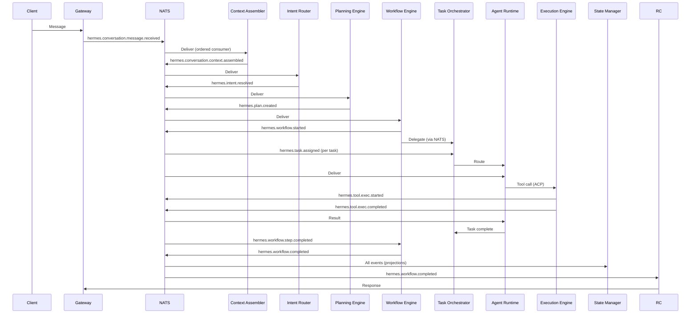
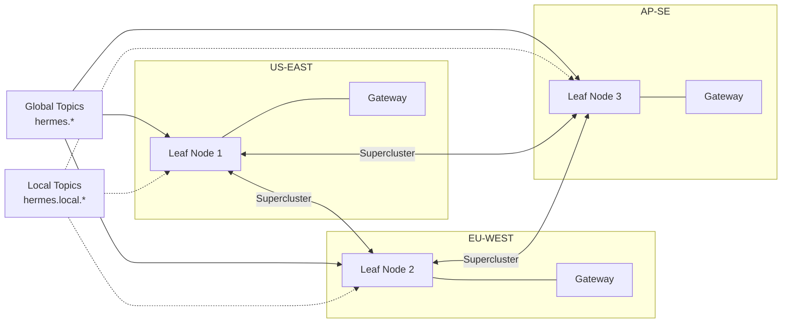

# RFC-0003
# Hermes Event Bus & Messaging Architecture

**Status:** Draft  
**Author:** Hermes Team  
**Owner:** Chief System Architect  
**Version:** 1.0  
**Priority:** Critical  
**Depends On:** RFC-0001 (Foundation Architecture), RFC-0002 (Core Architecture)

---

## 1. Purpose

This RFC defines the **Event Bus and Messaging Architecture** for Hermes Agent OS v2 — the central nervous system that enables all communication between modules, agents, and external systems.

The Event Bus is the **single source of truth for all state changes** in Hermes. Every module publishes domain events; every module subscribes via consumer-driven contracts. No direct RPC between modules for state mutations.

**Scope:** This RFC covers only the messaging foundation. It does not cover:
- Business logic of modules (RFC-0002)
- Gateway protocols (RFC-0004)
- Memory/Knowledge engines (RFC-0005, RFC-0006)
- Security policy (RFC-0007)

---

## 2. Design Principles

| Principle | Description |
|-----------|-------------|
| **Event-First** | All state changes are events; commands are derived from events |
| **Domain Ownership** | Each topic namespace owned by exactly one module |
| **Consumer-Driven Contracts** | Consumers define expectations; producers must satisfy |
| **Exactly-Once Semantics** | Deduplication via event_id + acknowledgment |
| **Ordered per Correlation** | Events for same conversation/workflow ordered |
| **Observable by Default** | Every event traced, metered, logged |
| **Multi-Tenant Isolation** | Tenant/workspace in every event; no cross-tenant leakage |
| **Schema Evolution** | Protobuf + Buf Registry; backward/forward compatibility enforced |
| **Resilient** | DLQ, retry, replay, circuit breaker built-in |
| **Multi-Region** | NATS supercluster with global topic replication |

---

## 3. Event Bus Architecture

### 3.1 Technology Choice: NATS JetStream

| Requirement | NATS JetStream Solution |
|-------------|-------------------------|
| **Embedded-friendly** | Single binary, no JVM, ~10MB |
| **Streaming** | Native streams, consumer groups, pull/push |
| **Exactly-once** | Deduplication window + ack policy |
| **Ordering** | Ordered consumer per subject |
| **Replication** | Reseek by sequence, timestamp, or new |
| **Multi-region** | Supercluster with leaf nodes |
| **Schema registry** | Protobuf via Buf (external) |
| **Observability** | Built-in metrics, Prometheus exporter |

**Decision:** NATS JetStream is the **mandatory** Event Bus for Phase 1–3. Kafka migration evaluated at >100K events/sec sustained (ADR-001).

### 3.2 Topology

```
┌─────────────────────────────────────────────────────────────────────────────┐
│                         NATS JETSTREAM CLUSTER                               │
│                                                                              │
│   ┌─────────────────────────────────────────────────────────────────────┐   │
│   │                        STREAM: HERMES                                │   │
│   │  Subjects: hermes.>                                                 │   │
│   │  Replicas: 3                                                        │   │
│   │  Retention: 7 days (configurable per tenant)                        │   │
│   │  Storage: File-based (NVMe recommended)                             │   │
│   │  Max message size: 1 MB (larger via object store)                   │   │
│   └─────────────────────────────────────────────────────────────────────┘   │
│                                                                              │
│   ┌─────────────┐  ┌─────────────┐  ┌─────────────┐  ┌─────────────┐      │
│   │  CONSUMER   │  │  CONSUMER   │  │  CONSUMER   │  │   CONSUMER  │      │
│   │  GROUP:     │  │  GROUP:     │  │  GROUP:     │  │   GROUP:    │      │
│   │  planning   │  │  workflow   │  │  task-orch  │  │  state-mgr  │      │
│   │  - pull     │  │  - pull     │  │  - pull     │  │  - pull     │      │
│   │  - ack      │  │  - ack      │  │  - ack      │  │  - ack      │      │
│   └─────────────┘  └─────────────┘  └─────────────┘  └─────────────┘      │
│                                                                              │
└─────────────────────────────────────────────────────────────────────────────┘
```

### 3.3 Stream Configuration

```yaml
# NATS JetStream Stream Config (hermes stream)
name: "HERMES"
description: "Hermes Agent OS Event Bus"
subjects:
  - "hermes.>"
retention: "limits"          # Retain until limits reached
max_msgs: -1                 # Unlimited messages
max_bytes: -1                # Unlimited bytes
max_age: 168h                # 7 days default
max_msg_size: 1048576        # 1 MB
storage: "file"              # File-based storage
replicas: 3                  # 3x replication
no_ack: false                # Require acknowledgment
duplicate_window: 120s       # Deduplication window
discard: "old"               # Discard oldest when full
allow_rollup_hdrs: true      # Allow rollup headers
```

---

## 4. Event Ownership Model

### 4.1 Domain Ownership Rule

**Each topic namespace is owned by exactly one module.** Only the owning module may **publish** events in its namespace. Other modules **subscribe** via consumer-driven contracts.

| Namespace | Owner Module | Consumers |
|-----------|--------------|-----------|
| `hermes.conversation.*` | Conversation Modules (Context/History/Summarizer/Intent/Response) | Planning, Workflow, State, Sync |
| `hermes.intent.*` | Intent Router | Planning, Conversation |
| `hermes.plan.*` | Planning Engine | Workflow, Task Orchestrator, Agent Runtime |
| `hermes.task.*` | Task Orchestrator | Workflow, Agent Runtime, Execution, State |
| `hermes.agent.*` | Agent Runtime | Task Orchestrator, Workflow, Planning, State |
| `hermes.workflow.*` | Workflow Engine | Task Orchestrator, Conversation, State, Approval |
| `hermes.tool.*` | Execution Engine | Agent Runtime, Task Orchestrator, State |
| `hermes.provider.*` | Provider Gateway | Planning, Agent Runtime, Execution, State |
| `hermes.memory.*` | Memory Coordinator | Conversation, Workflow, Agent Runtime, Knowledge |
| `hermes.knowledge.*` | Knowledge Coordinator | Planning, Conversation, Memory |
| `hermes.approval.*` | Workflow Engine | Gateway, Mission Control, State |
| `hermes.audit.*` | Security Service | All modules (read-only), Compliance |
| `hermes.sync.*` | Response Coordinator | Gateway, Clients |
| `hermes.config.*` | Config Manager | All modules |
| `hermes.system.*` | Platform/Infra | All modules |

### 4.2 Ownership Enforcement

- **CI Gate**: `buf breaking` check on producer schemas; consumer contracts validated
- **Runtime**: NATS permissions — only owner service account has `publish` on namespace
- **Breaking Changes**: Require consumer approval via contract test update

---

## 5. Topic Naming Conventions

### 5.1 Full Topic Format

```
hermes.{domain}.{entity}.{action}[.{qualifier}]
```

| Component | Format | Examples |
|-----------|--------|----------|
| **Prefix** | `hermes` | Always `hermes` |
| **Domain** | Module-owned namespace | `conversation`, `plan`, `task`, `agent` |
| **Entity** | Domain entity | `message`, `context`, `turn`, `summary` |
| **Action** | Past tense verb | `received`, `assembled`, `appended`, `stored` |
| **Qualifier** (optional) | Additional context | `requested`, `granted`, `denied`, `expired` |

### 5.2 Examples

| Topic | Owner | Description |
|-------|-------|-------------|
| `hermes.conversation.message.received` | Context Assembler | Inbound message from Gateway |
| `hermes.conversation.context.assembled` | Context Assembler | Context ready for intent |
| `hermes.conversation.turn.appended` | History Manager | Turn added to history |
| `hermes.conversation.summary.stored` | History Manager | Summary persisted |
| `hermes.conversation.summarized` | Summarizer | Summarization complete |
| `hermes.conversation.response.streaming` | Response Coordinator | Streaming chunk to client |
| `hermes.conversation.sync.required` | Response Coordinator | Client sync needed |
| `hermes.intent.resolved` | Intent Router | Intent classified |
| `hermes.intent.clarification.required` | Intent Router | Ambiguity detected |
| `hermes.plan.created` | Planning Engine | New plan emitted |
| `hermes.plan.optimized` | Planning Engine | Plan re-optimized |
| `hermes.plan.cached` | Planning Engine | Plan served from cache |
| `hermes.task.assigned` | Task Orchestrator | Task → agent mapping |
| `hermes.task.started` | Task Orchestrator | Agent began execution |
| `hermes.task.completed` | Task Orchestrator | Task finished successfully |
| `hermes.task.failed` | Task Orchestrator | Task failed |
| `hermes.task.retry` | Task Orchestrator | Task retry initiated |
| `hermes.workflow.started` | Workflow Engine | Saga initialized |
| `hermes.workflow.step.completed` | Workflow Engine | Step done |
| `hermes.workflow.compensating` | Workflow Engine | Compensation started |
| `hermes.workflow.hitl.required` | Workflow Engine | Human approval needed |
| `hermes.workflow.completed` | Workflow Engine | Saga complete |
| `hermes.workflow.checkpoint.created` | Workflow Engine | Checkpoint saved |

---

## 6. Event Versioning Strategy

### 6.1 Version in Topic

**Major version encoded in topic entity:**

```
v1.hermes.conversation.message.received
v2.hermes.conversation.message.received
```

- Only **major** version in topic (breaking changes)
- Minor/patch versions handled via Protobuf field evolution

### 6.2 Version in Event Envelope

```protobuf
message EventEnvelope {
  string event_id = 1;              // UUID v7 (time-ordered)
  string correlation_id = 2;        // Groups events (conversation_id)
  string causation_id = 3;          // Event that caused this event
  int64 timestamp_us = 4;           // Unix microseconds
  string source_module = 5;         // e.g., "context-assembler"
  string event_type = 6;            // e.g., "v1.conversation.context.assembled"
  bytes payload = 7;                // Protobuf payload (schema registry)
  map<string, string> metadata = 8; // trace_id, span_id, tenant_id, workspace_id, version
}
```

### 6.3 Compatibility Rules

| Change Type | Allowed? | Migration |
|-------------|----------|-----------|
| Add optional field | ✅ Yes | Auto-compatible |
| Add required field | ❌ No (major) | New topic version |
| Remove field | ✅ Yes (if optional) | Deprecate first |
| Change field type | ❌ No (major) | New topic version |
| Rename field | ❌ No (major) | New topic version |
| Add new event type | ✅ Yes | New topic, same version |

### 6.4 Schema Registry

- **Registry**: Buf Schema Registry (BSR)
- **Format**: Protobuf v3
- **Validation**: `buf breaking` on every PR
- **Packages**: `hermes.events.v1`, `hermes.events.v2`, etc.

---

## 7. Event Schemas

### 7.1 Core Event Envelope (v1)

```protobuf
// hermes/events/v1/envelope.proto
package hermes.events.v1;

message EventEnvelope {
  string event_id = 1;              // UUID v7 (time-ordered, globally unique)
  string correlation_id = 2;        // Conversation/workflow ID
  string causation_id = 3;          // Parent event ID
  int64 timestamp_us = 4;           // Unix microseconds (UTC)
  string source_module = 5;         // Module name (kebab-case)
  string event_type = 6;            // Full topic with version: "v1.hermes.plan.created"
  bytes payload = 7;                // Protobuf Any or direct message
  map<string, string> metadata = 8; // trace_id, span_id, tenant_id, workspace_id, version, priority
}

message EventMetadata {
  string trace_id = 1;              // W3C traceparent trace-id
  string span_id = 2;               // W3C traceparent parent-id
  string tenant_id = 3;             // Tenant identifier
  string workspace_id = 4;          // Workspace identifier
  string version = 5;               // Schema minor version: "1.2"
  string priority = 6;              // "low", "normal", "high", "critical"
  string idempotency_key = 7;       // For deduplication
}
```

### 7.2 Domain Event Payloads (Examples)

```protobuf
// hermes/events/v1/conversation.proto
package hermes.events.v1;

message ConversationMessageReceived {
  string conversation_id = 1;
  string message_id = 2;
  string user_id = 3;
  string content = 4;                    // Raw message content
  map<string, string> metadata = 5;      // Channel-specific metadata
  int64 received_at_us = 6;
}

message ConversationContextAssembled {
  string conversation_id = 1;
  Context context = 2;                    // See context.proto
  int32 token_estimate = 3;
  repeated string source_events = 4;     // Events used for assembly
}

// hermes/events/v1/plan.proto
package hermes.events.v1;

message PlanCreated {
  string plan_id = 1;
  string conversation_id = 2;
  string intent = 3;
  repeated Task tasks = 4;
  map<string, string> variables = 5;
  CompensationDAG compensation_dag = 6;
  string intent_fingerprint = 7;
  bool from_cache = 8;
  int64 created_at_us = 9;
}

message Task {
  string task_id = 1;
  string name = 2;
  string agent_role = 3;
  string action = 4;
  map<string, string> inputs = 5;
  repeated string depends_on = 6;
  CapabilityRequirements caps = 7;
  EstimatedResources estimate = 8;
  int32 priority = 9;
  bool parallelizable = 10;
  string idempotency_key = 11;
  string compensation_action = 12;
}

// hermes/events/v1/task.proto
package hermes.events.v1;

message TaskAssigned {
  string task_id = 1;
  string plan_id = 2;
  string agent_id = 3;                    // Specific instance: "backend-agent-3"
  string agent_type = 4;                  // Pool type: "backend-agent"
  string pool_id = 5;                     // Pool identifier
  int64 assigned_at_us = 6;
  int64 deadline_us = 7;                  // Task deadline
}

message TaskCompleted {
  string task_id = 1;
  string execution_id = 2;
  bytes output = 3;                       // Protobuf (tool-specific)
  repeated Artifact artifacts = 4;
  ResourceUsage usage = 5;
  int64 completed_at_us = 6;
}

// hermes/events/v1/workflow.proto
package hermes.events.v1;

message WorkflowStarted {
  string workflow_id = 1;
  string plan_id = 2;
  string conversation_id = 3;
  int64 started_at_us = 4;
  int64 global_timeout_us = 5;
}

message WorkflowStepCompleted {
  string workflow_id = 1;
  string step_id = 2;
  string task_id = 3;
  bool is_hitl_gate = 4;
  int64 completed_at_us = 5;
}

message WorkflowHitlRequired {
  string workflow_id = 1;
  string step_id = 2;
  string approval_id = 3;
  repeated string approvers = 4;
  int32 sla_hours = 5;
  string escalation_role = 6;
  ApprovalPayload payload = 7;
  int64 requested_at_us = 8;
  int64 expires_at_us = 9;
}

// hermes/events/v1/approval.proto
package hermes.events.v1;

message ApprovalRequested {
  string approval_id = 1;
  string workflow_id = 2;
  string step_id = 3;
  repeated string approvers = 4;
  int32 sla_hours = 5;
  string escalation_role = 6;
  ApprovalPayload payload = 7;
  int64 requested_at_us = 8;
  int64 expires_at_us = 9;
}

message ApprovalGranted {
  string approval_id = 1;
  string approver_id = 2;
  string decision = 3;                    // "approved", "denied", "delegated"
  string comment = 4;
  int64 decided_at_us = 5;
}

message ApprovalPayload {
  string title = 1;
  string description = 2;
  map<string, string> context = 3;        // Data needed for decision
  repeated string required_reviews = 4;   // Review types needed
}
```

---

## 8. Event Lifecycle

```
┌─────────────┐     ┌─────────────┐     ┌─────────────┐     ┌─────────────┐
│   PRODUCE   │────▶│  PERSIST    │────▶│  CONSUME    │────▶│  ACKNOWLEDGE│
│             │     │  (Stream)   │     │  (Consumer) │     │             │
└─────────────┘     └─────────────┘     └─────────────┘     └─────────────┘
       │                   │                   │                   │
       │                   │                   │                   │
       ▼                   ▼                   ▼                   ▼
  - Validate          - Replicate         - Deserialize       - Mark processed
  - schema            - (3x)              - Validate          - Update cursor
  - Enrich            - Index             - Process           - Emit metrics
  - metadata          - Deduplicate       - Emit downstream   - Handle errors
  - Assign            - (window)          - events            - (retry/DLQ)
  - event_id
```

### 8.1 Produce Phase

1. **Validate** payload against Protobuf schema (Buf registry)
2. **Enrich** with metadata: `trace_id`, `span_id`, `tenant_id`, `workspace_id`, `correlation_id`, `causation_id`
3. **Assign** `event_id` (UUID v7 — time-ordered, globally unique)
4. **Publish** to NATS subject with `MsgHeader` for metadata

### 8.2 Persist Phase (NATS JetStream)

1. **Replicate** to 3 nodes (RAFT consensus)
2. **Index** by: `correlation_id`, `event_type`, `timestamp`, `tenant_id`
3. **Deduplicate** via `event_id` within 120s window
4. **Retain** per stream config (default 7 days)

### 8.3 Consume Phase

1. **Pull** batch (configurable, default 100)
2. **Deserialize** envelope + payload
3. **Validate** `correlation_id` ordering (ordered consumer)
4. **Process** business logic
5. **Emit** downstream events (new `causation_id` = this `event_id`)

### 8.4 Acknowledge Phase

1. **Success**: `Ack()` — cursor advances
2. **Retryable error**: `Nak()` with delay — requeued
3. **Non-retryable**: `Term()` — sent to DLQ
4. **Metrics**: Latency, throughput, error rates recorded

---

## 9. Publisher/Subscriber Model

### 9.1 Publisher Responsibilities

| Responsibility | Implementation |
|----------------|----------------|
| **Schema compliance** | Validate against BSR before publish |
| **Metadata enrichment** | Auto-inject trace/tenant/correlation IDs |
| **Idempotency key** | Include in metadata for deduplication |
| **Ordering** | Use ordered consumer for correlation_id |
| **Error handling** | Retry with backoff; circuit breaker on NATS |

### 9.2 Subscriber Responsibilities

| Responsibility | Implementation |
|----------------|----------------|
| **Consumer group** | Join appropriate group (e.g., `planning`, `workflow`) |
| **Ack policy** | Explicit ack after successful processing |
| **Replay safety** | Handle duplicate delivery (idempotency keys) |
| **Backpressure** | `MaxAckPending=100`; monitor queue depth |
| **Dead letter** | Process DLQ events; alert on accumulation |

### 9.3 Consumer Group Configuration

```yaml
# Example consumer config per module
consumer_groups:
  planning-engine:
    stream: "HERMES"
    filter_subject: "hermes.intent.resolved"
    deliver_policy: "all"           # or "last", "new", "by_start_sequence"
    ack_policy: "explicit"
    ack_wait: 30s                   # Max processing time
    max_deliver: 3                  # Retry attempts
    max_ack_pending: 100            # Backpressure
    replay_policy: "instant"        # For new consumers
    durable_name: "planning-engine"
    headers_only: false
  
  workflow-engine:
    stream: "HERMES"
    filter_subject: "hermes.plan.created,hermes.task.completed,hermes.task.failed,hermes.approval.granted,hermes.approval.denied"
    # ... similar config
  
  state-manager:
    stream: "HERMES"
    filter_subject: "hermes.>"
    deliver_policy: "all"
    # Consumes ALL events for projections
```

---

## 10. Consumer Groups

### 10.1 Group Design

| Consumer Group | Modules | Purpose |
|----------------|---------|---------|
| `context-assembler` | Context Assembler | Consumes `gateway.request.normalized`, memory events |
| `intent-router` | Intent Router | Consumes `conversation.context.assembled` |
| `planning-engine` | Planning Engine | Consumes `intent.resolved`, agent/tool registry |
| `workflow-engine` | Workflow Engine | Consumes `plan.created`, `task.*`, `approval.*` |
| `task-orchestrator` | Task Orchestrator (per shard) | Consumes `workflow.started`, `workflow.step.completed`, agent health |
| `agent-runtime` | Agent Runtime | Consumes `task.assigned`, config updates |
| `execution-engine` | Execution Engine | Consumes `task.assigned` (for tool calls) |
| `state-manager` | State Manager | Consumes `hermes.>` (all events for projections) |
| `memory-coordinator` | Memory Coordinator | Consumes `workflow.completed`, `tool.exec.completed` |
| `knowledge-coordinator` | Knowledge Coordinator | Consumes `plan.created`, `memory.semantic.consolidated` |
| `response-coordinator` | Response Coordinator | Consumes `workflow.completed`, `memory.writes.completed` |
| `audit-logger` | Security Service | Consumes `hermes.audit.*` |

### 10.2 Sharded Consumers (Task Orchestrator)

```yaml
# Task Orchestrator: one consumer group per shard
task-orchestrator-shard-0:
  filter_subject: "hermes.workflow.started,hermes.workflow.step.completed,hermes.task.*"
  # Shard routing via correlation_id hash in processor

task-orchestrator-shard-1:
  filter_subject: "hermes.workflow.started,hermes.workflow.step.completed,hermes.task.*"
  # ... 64 shards total
```

### 10.3 Consumer Lifecycle

```
┌──────────┐     ┌──────────┐     ┌──────────┐     ┌──────────┐
│  START   │────▶│  CATCHUP │────▶│  STEADY  │────▶│  SHUTDOWN│
└──────────┘     └──────────┘     └──────────┘     └──────────┘
      │              │              │              │
      ▼              ▼              ▼              ▼
  - Connect     - Replay from    - Process      - Drain
  - Create      cursor/last      - Ack          - Ack pending
  - Subscribe   - Verify         - Metrics      - Close conn
  - Register    ordering         - Backpressure - Leave group
```

---

## 11. Dead Letter Queues (DLQ)

### 11.1 DLQ Strategy

| Failure Type | Handling |
|--------------|----------|
| **Max retries exceeded** (3) | Move to DLQ |
| **Non-retryable error** (validation, authZ) | Move to DLQ immediately |
| **Processing timeout** (ack_wait) | Nak → retry → DLQ |
| **Deserialization failure** | Move to DLQ immediately |

### 11.2 DLQ Topic Structure

```
hermes.dlq.{original_topic}
```

Examples:
- `hermes.dlq.v1.hermes.task.assigned`
- `hermes.dlq.v1.hermes.workflow.hitl.required`

### 11.3 DLQ Event Envelope

```protobuf
message DeadLetterEvent {
  EventEnvelope original_event = 1;
  string error_message = 2;
  string error_category = 3;        // "TRANSIENT", "VALIDATION", "PERMANENT", "TIMEOUT"
  int32 delivery_attempt = 4;
  int64 first_attempt_us = 5;
  int64 last_attempt_us = 6;
  string consumer_group = 7;
  string stack_trace = 8;
}
```

### 11.4 DLQ Processing

| Action | Trigger |
|--------|---------|
| **Alert** | DLQ depth > 100 events |
| **Auto-retry** | After fix deployment (via admin API) |
| **Manual replay** | Operator initiates via Mission Control |
| **Retention** | 30 days, then archive to S3 |

---

## 12. Retry Policies

### 12.1 Standard Retry Configuration

```yaml
retry_policy:
  max_attempts: 3
  backoff:
    strategy: "exponential"
    base_delay_ms: 1000
    max_delay_ms: 30000
    jitter: true
    multiplier: 2.0
  retry_on_categories:
    - "TRANSIENT"
    - "TIMEOUT"
    - "RESOURCE"
  dead_letter_on_categories:
    - "VALIDATION"
    - "PERMANENT"
    - "AUTHZ_DENIED"
```

### 12.2 Per-Consumer Overrides

| Consumer Group | Max Attempts | Ack Wait | Rationale |
|----------------|--------------|----------|-----------|
| `planning-engine` | 3 | 60s | LLM calls may be slow |
| `workflow-engine` | 5 | 30s | Critical path, more retries |
| `task-orchestrator` | 3 | 30s | Standard |
| `execution-engine` | 2 | 120s | WASM execution varies |
| `state-manager` | 10 | 10s | Must not lose events |

### 12.3 Retry with Idempotency

- Every event carries `idempotency_key` in metadata
- Consumers **must** track processed keys (Redis SET with TTL)
- Duplicate detection before processing

---

## 13. Event Replay

### 13.1 Replay Triggers

| Trigger | Method |
|---------|--------|
| **New consumer** | `deliver_policy: "all"` — replay from start |
| **Schema migration** | Admin API: `Replay(subject, start_sequence, end_sequence)` |
| **Bug fix** | Replay affected correlation_ids |
| **Projection rebuild** | State Manager: full replay |
| **Disaster recovery** | Cross-region replay from replica |

### 13.2 Replay API

```protobuf
service ReplayService {
  rpc ReplayFromSequence(ReplayRequest) returns (ReplayResponse);
  rpc ReplayByTimeRange(TimeRangeRequest) returns (ReplayResponse);
  rpc ReplayByCorrelationId(CorrelationReplayRequest) returns (ReplayResponse);
}

message ReplayRequest {
  string stream = 1;
  string consumer = 2;
  uint64 start_sequence = 3;
  uint64 end_sequence = 4;          // 0 = latest
  bool reset_cursor = 5;            // Reset consumer cursor after replay
}

message CorrelationReplayRequest {
  string stream = 1;
  string consumer = 2;
  repeated string correlation_ids = 3;
  bool reset_cursor = 4;
}
```

### 13.3 Replay Safety

- **Idempotent consumers**: Safe to replay any event
- **Ordered replay**: Per-correlation_id ordering preserved
- **Rate limiting**: Max 10K events/sec during replay
- **Metrics**: `hermes_replay_events_total`, `hermes_replay_duration_seconds`

---

## 14. Ordering Guarantees

### 14.1 Guarantee Levels

| Level | Scope | Implementation |
|-------|-------|----------------|
| **Per-Correlation** | Single conversation/workflow | NATS ordered consumer on `correlation_id` |
| **Per-Causation** | Direct cause-effect chain | Single-threaded consumer per correlation_id |
| **Global** | None (eventual) | Not guaranteed; use saga for coordination |

### 14.2 Ordered Consumer Configuration

```yaml
consumer:
  ordered_consumer: true
  deliver_policy: "all"
  ack_policy: "explicit"
  # NATS ensures messages with same correlation_id
  # delivered in order to same consumer instance
```

### 14.3 Ordering Caveats

- **Replay breaks ordering** if multiple consumers process same correlation_id
- **Sharding** splits ordering — Task Orchestrator shards by conversation_id
- **Compensation events** may arrive out of order — handled by Workflow Engine state machine

---

## 15. Idempotency

### 15.1 Idempotency Key

Every event **must** include `idempotency_key` in metadata:

```protobuf
message EventMetadata {
  // ...
  string idempotency_key = 7;       // Required for all mutating events
}
```

### 15.2 Key Generation

| Event Type | Key Format |
|------------|------------|
| `task.assigned` | `task:{task_id}:assign:{attempt}` |
| `tool.exec.started` | `tool:{execution_id}:exec` |
| `workflow.step.completed` | `workflow:{workflow_id}:step:{step_id}:complete` |
| `memory.episodic.write` | `memory:episodic:{conversation_id}:{turn_id}` |

### 15.3 Consumer Implementation

```go
func (c *Consumer) Process(ctx context.Context, msg *nats.Msg) error {
    envelope := parseEnvelope(msg)
    
    // 1. Check idempotency
    key := fmt.Sprintf("idem:%s", envelope.Metadata["idempotency_key"])
    processed, err := c.redis.SetNX(ctx, key, "1", 24*time.Hour).Result()
    if err != nil || !processed {
        // Already processed — ack and return
        msg.Ack()
        return nil
    }
    
    // 2. Process business logic
    if err := c.handle(envelope); err != nil {
        // On failure, DON'T delete idempotency key (allow retry)
        return err
    }
    
    // 3. Success — ack
    msg.Ack()
    return nil
}
```

---

## 16. Correlation & Causation IDs

### 16.1 Correlation ID

- **Purpose**: Group all events for a single conversation/workflow
- **Format**: UUID v7 (time-ordered) or conversation_id
- **Propagation**: Copied from triggering event to all downstream events
- **Usage**: Query, debugging, tracing, replay

### 16.2 Causation ID

- **Purpose**: Link cause → effect for traceability
- **Format**: `event_id` of the event that triggered this event
- **Chain**: `event_A.causation_id = event_B.event_id`
- **Usage**: Root cause analysis, distributed tracing

### 16.3 Propagation Rules

```
Event A (event_id: "evt-1") 
  → triggers → 
Event B (event_id: "evt-2", causation_id: "evt-1", correlation_id: "conv-123")
  → triggers → 
Event C (event_id: "evt-3", causation_id: "evt-2", correlation_id: "conv-123")
```

### 16.4 Trace Integration

```json
// EventEnvelope.metadata maps to W3C traceparent
{
  "trace_id": "abc123",           // correlation_id or dedicated trace
  "span_id": "def456",            // event_id
  "parent_span_id": "ghi789"      // causation_id
}
```

---

## 17. Event Persistence

### 17.1 NATS JetStream (Hot Storage)

| Parameter | Value |
|-----------|-------|
| **Retention** | 7 days (configurable per tenant) |
| **Replication** | 3x (RAFT) |
| **Storage** | File-based (NVMe) |
| **Max message** | 1 MB |
| **Deduplication** | 120s window |
| **Indexing** | By correlation_id, event_type, timestamp, tenant_id |

### 17.2 PostgreSQL Event Store (Cold/Archive)

- **Schema**: `event_store` table partitioned by `correlation_id` hash (64 partitions)
- **Columns**: `event_id`, `correlation_id`, `causation_id`, `timestamp_us`, `event_type`, `payload`, `metadata`, `partition_id`
- **Retention**: 7 years (configurable per tenant)
- **Cold tier**: S3 after 90 days (Parquet format)
- **PITR**: Point-in-time recovery via WAL

### 17.3 Dual-Write Pattern

```
Publisher → NATS JetStream (hot, real-time)
            ↓ (async, via State Manager consumer)
         PostgreSQL (durable, queryable)
```

- State Manager consumes `hermes.>` and writes to PostgreSQL
- Exactly-once via `event_id` deduplication in PostgreSQL
- Read models (projections) built from PostgreSQL

---

## 18. Multi-Region Replication

### 18.1 NATS Supercluster

```
┌─────────────────────────────────────────────────────────────────┐
│                      NATS SUPERCLUSTER                           │
│                                                                  │
│   ┌──────────────┐    ┌──────────────┐    ┌──────────────┐     │
│   │  REGION US-EAST  │  │  REGION EU-WEST  │  │ REGION AP-SE  │     │
│   │               │    │               │    │               │     │
│   │ Gateway       │    │ Gateway       │    │ Gateway       │     │
│   │ Leaf Node 1   │◀──▶│ Leaf Node 2   │◀──▶│ Leaf Node 3   │     │
│   │               │    │               │    │               │     │
│   └──────────────┘    └──────────────┘    └──────────────┘     │
│         │                   │                   │                │
│         └───────────────────┼───────────────────┘                │
│                             ▼                                    │
│                    ┌────────────────┐                             │
│                    │  GLOBAL TOPICS │                             │
│                    │ (Replicated)   │                             │
│                    └────────────────┘                             │
└─────────────────────────────────────────────────────────────────┘
```

### 18.2 Replication Rules

| Topic Type | Replication |
|------------|-------------|
| `hermes.*` (global) | Full replication across all regions |
| `hermes.local.*` | Local only (region-specific) |
| `hermes.dlq.*` | Replicated for cross-region debugging |

### 18.3 Gateway Routing

- Client connects to **nearest region** gateway
- Gateway publishes to local leaf node
- Leaf node replicates global topics to other regions
- Consumers in each region process local events

### 18.4 Data Residency

- Tenant config: `data_residency_region: "eu-west-1"`
- Events for tenant routed to resident region
- Cross-region queries proxied via Gateway

---

## 19. Monitoring & Observability

### 19.1 Key Metrics (Prometheus)

| Metric | Type | Labels | Description |
|--------|------|--------|-------------|
| `hermes_events_published_total` | Counter | `topic`, `source_module`, `status` | Events published |
| `hermes_events_consumed_total` | Counter | `topic`, `consumer_group`, `status` | Events consumed |
| `hermes_event_latency_seconds` | Histogram | `topic`, `phase` (publish/consume/process) | End-to-end latency |
| `hermes_consumer_lag` | Gauge | `consumer_group`, `topic` | Messages behind head |
| `hermes_dlq_depth` | Gauge | `topic` | Dead letter queue depth |
| `hermes_retry_total` | Counter | `topic`, `attempt` | Retry attempts |
| `hermes_stream_size_bytes` | Gauge | `stream` | JetStream storage size |
| `hermes_ack_wait_seconds` | Histogram | `consumer_group` | Time to ack |

### 19.2 Distributed Tracing

- **Trace context**: W3C `traceparent` in `EventEnvelope.metadata`
- **Span per event**: `hermes.event.publish`, `hermes.event.consume`, `hermes.event.process`
- **Sampling**: Head 10% + tail 100% errors

### 19.3 Structured Logging

```json
{
  "timestamp": "2026-07-24T10:30:45.123Z",
  "level": "INFO",
  "module": "planning-engine",
  "trace_id": "abc123",
  "span_id": "def456",
  "event_id": "evt-789",
  "event_type": "v1.hermes.plan.created",
  "correlation_id": "conv-123",
  "message": "Plan created",
  "fields": {
    "plan_id": "plan-001",
    "task_count": 5
  }
}
```

### 19.4 Alerts

| Alert | Condition | Severity |
|-------|-----------|----------|
| `HermesConsumerLagHigh` | `hermes_consumer_lag > 10000` for 5m | Warning |
| `HermesDLQDepthHigh` | `hermes_dlq_depth > 100` | Critical |
| `HermesPublishLatencyHigh` | `p99 > 500ms` for 5m | Warning |
| `HermesEventLoss` | Gap in sequence numbers | Critical |
| `HermesReplicationLag` | Cross-region lag > 30s | Warning |

---

## 20. Security for Events

### 20.1 Transport Security

- **mTLS**: All NATS connections use mutual TLS (SPIFFE certificates)
- **Certificate rotation**: Automated via SPIRE (24h TTL)

### 20.2 Authorization

| Operation | Permission |
|-----------|------------|
| **Publish** | Only owning module's service account |
| **Subscribe** | Consumer group service accounts |
| **Admin** | Platform team only |

### 20.3 Data Protection

| Protection | Implementation |
|------------|----------------|
| **PII in events** | Auto-detected (Presidio); encrypted at rest |
| **Encryption at rest** | NATS file storage encrypted (AES-256) |
| **Encryption in transit** | TLS 1.3 |
| **Field-level encryption** | Sensitive payload fields encrypted via Vault transit |

### 20.4 Audit

- All publish/consume operations logged to `hermes.audit.*`
- Immutable audit trail in PostgreSQL + S3

---

## 21. Performance Targets

| Metric | Target (P99) | Measurement |
|--------|--------------|-------------|
| **Publish latency** | < 5 ms | Client → NATS ack |
| **Consume latency** | < 10 ms | NATS → consumer ack |
| **End-to-end (produce → consume)** | < 50 ms | Full pipeline |
| **Throughput** | 100K events/sec | Sustained |
| **Replay rate** | 50K events/sec | Single consumer |
| **DLQ processing** | < 1 min | Alert to resolution |
| **Multi-region replication lag** | < 1 s | Cross-region |
| **Consumer lag** | < 1000 ms | Steady state |
| **Availability** | 99.99% | Annual |

---

## 22. Architecture Diagrams

### 22.1 Event Bus Topology (Mermaid)

```mermaid
graph TB
    subgraph "NATS JETSTREAM CLUSTER"
        JS[JetStream\nStream: HERMES\nReplicas: 3]
        
        subgraph "CONSUMER GROUPS"
            CG1[context-assembler]
            CG2[intent-router]
            CG3[planning-engine]
            CG4[workflow-engine]
            CG5[task-orchestrator-shard-0]
            CG6[task-orchestrator-shard-1]
            CG7[...]
            CG8[task-orchestrator-shard-63]
            CG9[agent-runtime]
            CG10[execution-engine]
            CG11[state-manager]
            CG12[memory-coordinator]
            CG13[knowledge-coordinator]
            CG14[response-coordinator]
            CG15[audit-logger]
        end
    end
    
    GW[Gateway] -->|hermes.conversation.message.received| JS
    CA[Context Assembler] -.->|Consumes| CG1
    IR[Intent Router] -.->|Consumes| CG2
    PE[Planning Engine] -.->|Consumes| CG3
    WE[Workflow Engine] -.->|Consumes| CG4
    TO[Task Orchestrator] -.->|Consumes| CG5 & CG6 & CG7 & CG8
    AR[Agent Runtime] -.->|Consumes| CG9
    EE[Execution Engine] -.->|Consumes| CG10
    SM[State Manager] -.->|Consumes ALL| CG11
    MC[Memory Coordinator] -.->|Consumes| CG12
    KC[Knowledge Coordinator] -.->|Consumes| CG13
    RC[Response Coordinator] -.->|Consumes| CG14
    SEC[Security Service] -.->|Consumes| CG15
    
    JS -->|Replicates| PG[PostgreSQL Event Store]
    JS -->|Replicates| S3[S3 Cold Storage]
    JS -->|Multi-region| NR[NATS Supercluster]
```



### 22.2 Event Flow Sequence (Mermaid)



### 22.3 DLQ Flow (Mermaid)

```mermaid
flowchart TD
    A[Event Processing Fails] --> B{Retryable?}
    B -->|Yes| C[Retry with Backoff]
    C --> D{Max Attempts?}
    D -->|No| C
    D -->|Yes| E[Move to DLQ]
    B -->|No| E
    E --> F[hermes.dlq.{topic}]
    F --> G[Alert: DLQ Depth > 100]
    G --> H[Operator Investigates]
    H --> I{Root Cause}
    I -->|Bug Fix| J[Deploy Fix]
    J --> K[Replay from DLQ]
    K --> L[Re-process]
    I -->|Data Issue| M[Correct Data]
    M --> K
    I -->|Permanent| N[Archive to S3]
    N --> O[30-day Retention]
```

### 22.4 Multi-Region Replication (Mermaid)



---

## 23. Acceptance Criteria

This RFC is complete when:

### 23.1 Core Event Bus

- [ ] NATS JetStream cluster deployed (3 nodes, HA)
- [ ] Stream `HERMES` configured with subjects `hermes.>`
- [ ] Replication factor 3, retention 7 days
- [ ] Deduplication window 120s
- [ ] Max message size 1 MB

### 23.2 Event Contracts

- [ ] Protobuf schemas for all domain events (v1)
- [ ] Buf Schema Registry configured
- [ ] `buf breaking` CI gate on every PR
- [ ] Versioning strategy documented (major in topic, minor in payload)

### 23.3 Ownership & Contracts

- [ ] Topic ownership table complete (§4.1)
- [ ] NATS permissions: publish only by owner
- [ ] Consumer-driven contracts for all cross-module subscriptions

### 23.4 Consumer Groups

- [ ] 15+ consumer groups defined (§10.1)
- [ ] Sharded consumers for Task Orchestrator (64 shards)
- [ ] `MaxAckPending=100`, `AckWait=30s` defaults
- [ ] Ordered consumers for correlation_id

### 23.5 Resilience

- [ ] DLQ topics for every domain topic
- [ ] Retry policy: max 3, exponential backoff, jitter
- [ ] Replay API implemented (by sequence, time, correlation_id)
- [ ] Idempotency keys required on all mutating events

### 23.6 Observability

- [ ] Prometheus metrics exported (10+ metrics)
- [ ] OpenTelemetry tracing with W3C context propagation
- [ ] Structured JSON logging with trace correlation
- [ ] Alerts for consumer lag, DLQ depth, replication lag

### 23.7 Security

- [ ] mTLS for all NATS connections (SPIFFE)
- [ ] PII detection + encryption at rest
- [ ] Audit logging to `hermes.audit.*`

### 23.8 Multi-Region

- [ ] NATS supercluster with 3 regions
- [ ] Global topic replication
- [ ] Data residency routing
- [ ] DR runbook with RTO < 5min, RPO < 1min

### 23.9 Performance

- [ ] Publish latency P99 < 5ms
- [ ] End-to-end latency P99 < 50ms
- [ ] Throughput 100K events/sec sustained
- [ ] Availability 99.99%

---

## 24. References

- RFC-0001: Hermes Agent OS v2 — Foundation Architecture
- RFC-0002: Hermes Core Architecture
- RFC-0004: Hermes Gateway & Communication Channels (planned)
- NATS JetStream Documentation: https://docs.nats.io/nats-concepts/jetstream
- Buf Schema Registry: https://buf.build
- W3C Trace Context: https://www.w3.org/TR/trace-context/
- SPIFFE/SPIRE: https://spiffe.io/

---

## 25. Glossary

| Term | Definition |
|------|------------|
| **Event Bus** | Central messaging backbone (NATS JetStream) |
| **Stream** | Logical partition of subjects with shared retention/replication |
| **Consumer Group** | Named group of consumers sharing message delivery |
| **Ordered Consumer** | NATS consumer that guarantees per-subject ordering |
| **DLQ** | Dead Letter Queue — failed events after max retries |
| **Idempotency Key** | Unique key per operation enabling safe retry |
| **Correlation ID** | Groups all events for a single conversation/workflow |
| **Causation ID** | Links cause → effect (parent event ID) |
| **Supercluster** | NATS multi-region cluster with leaf nodes |
| **Ack Policy** | How messages are acknowledged (explicit, all, none) |
| **MaxAckPending** | Backpressure limit — unacked messages per consumer |

---

**End of RFC-0003**

*This document is the canonical specification for all messaging inside Hermes Agent OS. No implementation shall begin until this RFC is reviewed and approved.*