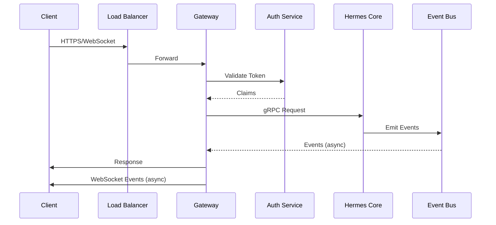
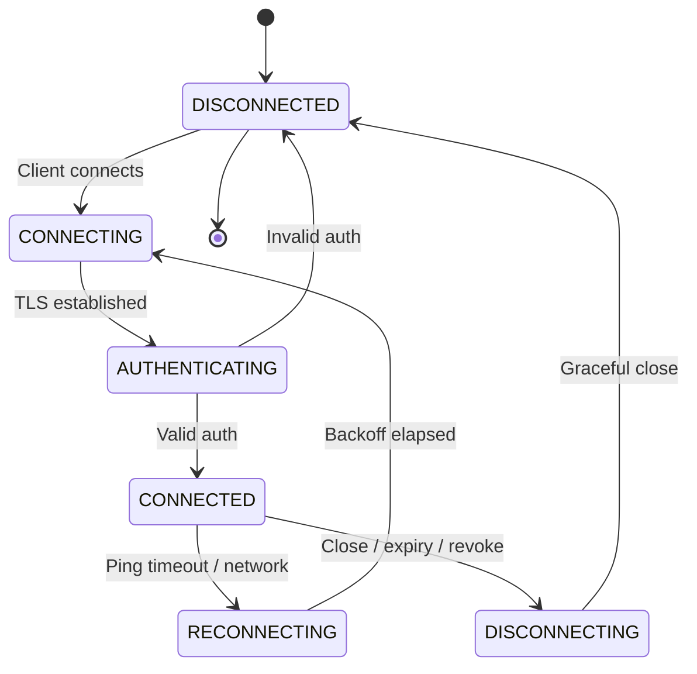
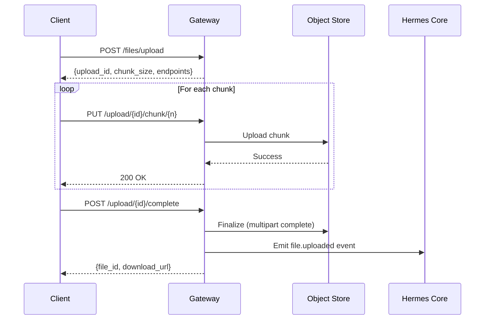
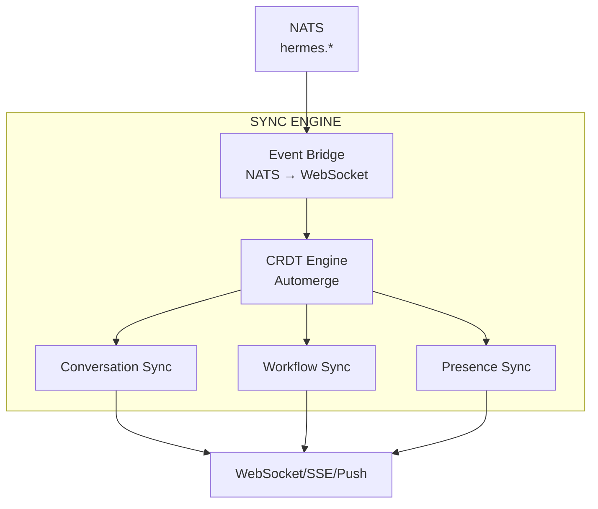
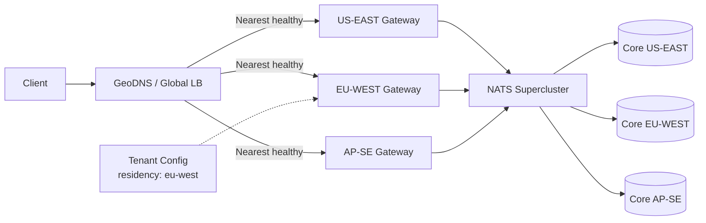

# RFC-0004
# Hermes Gateway & Communication Architecture

**Status:** Draft  
**Author:** Hermes Team  
**Owner:** Chief System Architect  
**Version:** 1.0  
**Priority:** Critical  
**Depends On:** RFC-0001 (Foundation), RFC-0002 v1.1 (Core Architecture), RFC-0003 v1.1 (Event Bus)

---

## 1. Purpose

This RFC defines the **Hermes Gateway & Communication Architecture** — the unified entry point for all client communication with Hermes Core.

The Gateway is the **single ingress/egress** for every client: Mission Control, Hermes Desktop, Web, Mobile, Telegram, Discord, WhatsApp, and future integrations. It handles authentication, authorization, session management, protocol translation, streaming, file transfer, and real-time event distribution.

**No client communicates directly with Hermes Core.** All traffic flows through the Gateway.

---

## 2. Scope

| In Scope | Out of Scope |
|----------|--------------|
| Gateway architecture & responsibilities | Hermes Core business logic (RFC-0002) |
| Client connection lifecycle | Event Bus internals (RFC-0003) |
| WebSocket, REST, gRPC protocols | Memory/Knowledge engines (RFC-0005/0006) |
| AuthN/AuthZ, sessions | Security policy (RFC-0007) |
| Multi-client sync, streaming, files | Plugin SDK (RFC-0008) |
| Rate limiting, backpressure, recovery | Automation (RFC-0009) |
| Multi-region routing | Client UI implementations |

---

## 3. Gateway Architecture

### 3.1 High-Level Topology

```
┌─────────────────────────────────────────────────────────────────────────────────────┐
│                              CLIENTS                                                 │
│  ┌──────────┐ ┌──────────┐ ┌──────────┐ ┌──────────┐ ┌──────────┐ ┌──────────┐     │
│  │ Mission  │ │  Hermes  │ │   Web    │ │  Mobile  │ │ Telegram │ │ Discord  │     │
│  │ Control  │ │ Desktop  │ │          │ │          │ │          │ │          │     │
│  └────┬─────┘ └────┬─────┘ └────┬─────┘ └────┬─────┘ └────┬─────┘ └────┬─────┘     │
│       │            │            │            │            │            │            │
│       │     ┌──────┴────────────┴────────────┴────────────┴────────────┴──────┐    │
│       │     │                        LOAD BALANCER (L4/L7)                     │    │
│       │     └────────────────────────────────┬──────────────────────────────────┘    │
│       │                                      │                                       │
└───────┼──────────────────────────────────────┼───────────────────────────────────────┘
        │                                      │
        ▼                                      ▼
┌─────────────────────────────────────────────────────────────────────────────────────┐
│                          HERMES GATEWAY CLUSTER                                      │
│                                                                                      │
│  ┌─────────────────────────────────────────────────────────────────────────────┐   │
│  │                         API GATEWAY (Stateless)                              │   │
│  │  ┌──────────┐ ┌──────────┐ ┌──────────┐ ┌──────────┐ ┌──────────────────┐  │   │
│  │  │  REST    │ │WebSocket │ │  gRPC    │ │  Auth    │ │   Protocol       │  │   │
│  │  │  Routes  │ │  Server  │ │  Proxy   │ │  Service │ │   Adapters       │  │   │
│  │  └──────────┘ └──────────┘ └──────────┘ └──────────┘ └──────────────────┘  │   │
│  └─────────────────────────────────────────────────────────────────────────────┘   │
│                                      │                                               │
│         ┌────────────────────────────┼────────────────────────────┐                │
│         ▼                            ▼                            ▼                │
│  ┌──────────────┐          ┌──────────────────┐        ┌──────────────────┐      │
│  │  SESSION     │          │   PROTOCOL       │        │   EVENT          │      │
│  │  MANAGER     │          │   ADAPTERS       │        │   BRIDGE         │      │
│  │              │          │                  │        │                  │      │
│  │ - Create     │          │ - Telegram Bot   │        │ - NATS Consumer  │      │
│  │ - Validate   │          │ - Discord Bot    │        │ - WebSocket Push │      │
│  │ - Refresh    │          │ - WhatsApp       │        │ - SSE Fallback   │      │
│  │ - Revoke     │          │ - Webhook        │        │ - Fan-out        │      │
│  │ - Cleanup    │          │ - MCP            │        │                  │      │
│  └──────────────┘          └──────────────────┘        └──────────────────┘      │
│                                                                                      │
└─────────────────────────────────────────────────────────────────────────────────────┘
        │                            │                            │
        ▼                            ▼                            ▼
┌─────────────────────────────────────────────────────────────────────────────────────┐
│                         HERMES CORE (via RFC-0002/0003)                              │
│  ┌──────────────┐ ┌──────────────┐ ┌──────────────┐ ┌──────────────┐               │
│  │ Conversation │ │   Task       │ │   Agent      │ │   Event Bus  │               │
│  │  Engine      │ │  Orchestrator│ │  Runtime     │ │  (NATS)      │               │
│  └──────────────┘ └──────────────┘ └──────────────┘ └──────────────┘               │
└─────────────────────────────────────────────────────────────────────────────────────┘
```

### 3.2 Gateway Responsibilities

| Responsibility | Description |
|----------------|-------------|
| **Protocol Translation** | Normalize all client protocols → internal gRPC/NATS |
| **Authentication** | Verify credentials, issue/validate tokens |
| **Authorization** | Enforce per-client, per-workspace permissions |
| **Session Management** | Create, validate, refresh, revoke sessions |
| **Connection Lifecycle** | WebSocket upgrade, keep-alive, graceful close |
| **Request Routing** | Route to appropriate Core module via gRPC |
| **Streaming Responses** | WebSocket/SSE for long-running operations |
| **File Transfer** | Chunked upload/download with resume |
| **Real-time Events** | Bridge NATS events → client WebSocket/SSE |
| **Rate Limiting** | Per-client, per-endpoint, per-workspace |
| **Backpressure** | Signal upstream when Core saturated |
| **Multi-region Routing** | Route to nearest healthy region |
| **Observability** | Trace, metrics, logs for all traffic |

---

## 4. Client Connection Lifecycle

### 4.1 Connection States

```
┌──────────────┐     ┌──────────────┐     ┌──────────────┐     ┌──────────────┐
│  DISCONNECTED│────▶│  CONNECTING  │────▶│  AUTHENTICATING│───▶│  CONNECTED   │
└──────────────┘     └──────────────┘     └──────────────┘     └──────────────┘
       ▲                                       │                    │
       │                                       │                    │
       │                    ┌──────────────────┘                    │
       │                    ▼                                       ▼
       │            ┌──────────────┐                       ┌──────────────┐
       │            │  RECONNECTING │                      │  DISCONNECTING│
       │            └──────┬───────┘                       └──────┬───────┘
       │                   │                                    │
       └───────────────────┴────────────────────────────────────┘
                              (graceful close / token expiry)
```

### 4.2 State Transitions

| From | To | Trigger |
|------|-----|---------|
| `DISCONNECTED` | `CONNECTING` | Client initiates WebSocket/HTTP |
| `CONNECTING` | `AUTHENTICATING` | TCP/TLS established |
| `AUTHENTICATING` | `CONNECTED` | Valid credentials, session created |
| `AUTHENTICATING` | `DISCONNECTED` | Invalid credentials, rate limited |
| `CONNECTED` | `RECONNECTING` | Network interruption, ping timeout |
| `RECONNECTING` | `CONNECTING` | Backoff elapsed, retry |
| `CONNECTED` | `DISCONNECTING` | Client close, token expiry, admin revoke |
| `DISCONNECTING` | `DISCONNECTED` | Graceful close complete |

### 4.3 Reconnection Policy

| Parameter | Value |
|-----------|-------|
| **Max retries** | 10 |
| **Initial backoff** | 1s |
| **Max backoff** | 60s |
| **Backoff multiplier** | 2x |
| **Jitter** | ±20% |
| **Session resume** | Within 5 min: resume session; >5 min: full re-auth |

---

## 5. WebSocket Architecture

### 5.1 WebSocket Protocol

```
Client                                    Gateway
   │                                        │
   │──── GET /ws?token=xxx ───────────────▶│
   │◀─── 101 Switching Protocols ─────────│
   │                                        │
   │──── {type: "ping"} ─────────────────▶│
   │◀─── {type: "pong"} ──────────────────│
   │                                        │
   │──── {type: "subscribe", topics: [...]}▶│
   │◀─── {type: "subscribed", topics: [...]}│
   │                                        │
   │──── {type: "request", ...} ──────────▶│
   │◀─── {type: "response", ...} ─────────│
   │◀─── {type: "event", ...} ────────────│  (async events)
   │                                        │
   │──── {type: "close"} ────────────────▶│
   │◀─── {type: "closed"} ────────────────│
```

### 5.2 Message Envelope

```json
{
  "id": "msg-uuid-v7",
  "type": "request|response|event|ping|pong|subscribe|unsubscribe|error",
  "timestamp": "2026-07-24T10:30:45.123Z",
  "correlation_id": "optional-request-id",
  "payload": { }
}
```

### 5.3 Message Types

| Type | Direction | Purpose |
|------|-----------|---------|
| `request` | Client → Gateway | RPC-style request |
| `response` | Gateway → Client | Response to request |
| `event` | Gateway → Client | Async notification |
| `stream_chunk` | Gateway → Client | Streaming response chunk |
| `stream_end` | Gateway → Client | End of stream |
| `subscribe` | Client → Gateway | Subscribe to topics |
| `unsubscribe` | Client → Gateway | Unsubscribe |
| `ping` | Bidirectional | Keep-alive |
| `pong` | Bidirectional | Keep-alive response |
| `error` | Gateway → Client | Error notification |

### 5.4 WebSocket Connection Parameters

| Parameter | Default | Description |
|-----------|---------|-------------|
| **Ping interval** | 30s | Client sends ping |
| **Pong timeout** | 10s | Close if no pong |
| **Max message size** | 16 MB | Per frame |
| **Write buffer** | 64 KB | Backpressure threshold |
| **Compression** | permessage-deflate | Optional |

---

## 6. REST API Architecture

### 6.1 API Design Principles

| Principle | Implementation |
|-----------|----------------|
| **Resource-oriented** | RESTful nouns, HTTP verbs |
| **Versioned** | `/api/v1/...` in URL |
| **Idempotent** | `POST` for create, `PUT` for replace, `PATCH` for partial |
| **Paginated** | `cursor` + `limit` for collections |
| **Filtered** | `?filter[field]=value` |
| **Sorted** | `?sort=field,-other` |
| **Projectable** | `?fields=id,name,status` |

### 6.2 Core Endpoints

| Method | Path | Description |
|--------|------|-------------|
| `POST` | `/api/v1/conversations` | Create conversation |
| `GET` | `/api/v1/conversations/{id}` | Get conversation |
| `GET` | `/api/v1/conversations` | List conversations |
| `POST` | `/api/v1/conversations/{id}/messages` | Send message |
| `GET` | `/api/v1/conversations/{id}/messages` | Get messages |
| `POST` | `/api/v1/files/upload` | Initiate chunked upload |
| `PUT` | `/api/v1/files/upload/{upload_id}/chunk/{n}` | Upload chunk |
| `POST` | `/api/v1/files/upload/{upload_id}/complete` | Complete upload |
| `GET` | `/api/v1/files/{file_id}/download` | Download file |
| `GET` | `/api/v1/workflows/{id}` | Get workflow status |
| `POST` | `/api/v1/approvals/{id}/decision` | Submit approval |
| `GET` | `/api/v1/agents` | List available agents |
| `GET` | `/api/v1/health` | Health check |

### 6.3 Request/Response Standards

```json
// Success Response
{
  "data": { },
  "meta": {
    "request_id": "req-uuid",
    "timestamp": "2026-07-24T10:30:45.123Z",
    "version": "1.0"
  }
}

// Error Response
{
  "error": {
    "code": "VALIDATION_ERROR",
    "message": "Invalid input",
    "details": [{ "field": "email", "issue": "invalid format" }],
    "request_id": "req-uuid"
  }
}

// Paginated Response
{
  "data": [ ],
  "pagination": {
    "cursor": "next-cursor",
    "limit": 50,
    "has_more": true
  }
}
```

### 6.4 HTTP Status Codes

| Code | Usage |
|------|-------|
| `200` | Success (GET, PUT, PATCH) |
| `201` | Created (POST) |
| `202` | Accepted (async) |
| `204` | No Content (DELETE) |
| `400` | Bad Request (validation) |
| `401` | Unauthorized (auth required) |
| `403` | Forbidden (authz denied) |
| `404` | Not Found |
| `409` | Conflict (idempotency) |
| `413` | Payload Too Large |
| `422` | Unprocessable Entity (semantic) |
| `429` | Too Many Requests |
| `500` | Internal Error |
| `503` | Service Unavailable (backpressure) |

---

## 7. gRPC Internal Communication

### 7.1 Gateway → Core gRPC

| Service | Purpose | Timeout |
|---------|---------|---------|
| `ConversationService` | Context assembly, history | 30s |
| `PlanningService` | Create plan, replan | 60s |
| `WorkflowService` | Start workflow, signal approval | 30s |
| `TaskOrchestrationService` | Schedule, assign tasks | 30s |
| `AgentRuntimeService` | Pool status, health | 10s |
| `ExecutionService` | Tool execution, streaming | 300s |
| `StateService` | State queries, replay | 30s |
| `ProviderService` | Model routing, cost | 60s |
| `ToolService` | Manifest, admission | 10s |
| `MemoryService` | Read/write memory | 30s |
| `KnowledgeService` | RAG queries | 30s |
| `SecurityService` | AuthZ, tokens, PII | 10s |
| `ConfigService` | Config, secrets, flags | 10s |

### 7.2 gRPC Connection Pool

| Parameter | Value |
|-----------|-------|
| **Pool size per service** | 50 connections |
| **Max idle** | 10 connections |
| **Connection timeout** | 10s |
| **Keepalive** | 30s |
| **Max concurrent streams** | 1000 |
| **Load balancing** | Round-robin (client-side) |

### 7.3 Metadata Propagation

```go
// All gRPC calls include:
metadata := metadata.Pairs(
    "x-trace-id", traceID,
    "x-span-id", spanID,
    "x-tenant-id", tenantID,
    "x-workspace-id", workspaceID,
    "x-correlation-id", correlationID,
    "x-causation-id", causationID,
    "x-client-id", clientID,
    "x-request-id", requestID,
)
```

---

## 8. Authentication Flow

### 8.1 Supported Methods

| Method | Clients | Description |
|--------|---------|-------------|
| **OIDC / OAuth 2.0** | Web, Mobile, Desktop | Standard OIDC flow |
| **API Key** | Server-to-server, Desktop | Long-lived, scoped |
| **JWT Bearer** | All | Short-lived access tokens |
| **mTLS** | Server-to-server, Gateway↔Core | Mutual TLS |
| **Telegram WebApp** | Telegram | Telegram-specific |
| **Discord OAuth** | Discord | Discord-specific |

### 8.2 Authentication Flow (OIDC)

```
User                    Client                    Gateway                 Identity Provider
 │                        │                         │                         │
 │──── Click Login ─────▶│                         │                         │
 │                        │──── Redirect to IDP ───▶│                         │
 │                        │                         │                         │
 │◀─── Auth Page ────────│                         │                         │
 │──── Credentials ─────▶│                         │                         │
 │                        │                         │──── Validate ────────▶│
 │                        │                         │◀─── Tokens ────────────│
 │                        │◀─── Set Cookies/Tokens ─│                         │
 │                        │                         │                         │
 │──── API Request ─────▶│                         │                         │
 │                        │──── Verify JWT ───────▶│ (cached JWKS)          │
 │                        │◀─── Claims ────────────│                         │
 │◀─── Response ─────────│                         │                         │
```

### 8.3 Token Structure

**Access Token (JWT):**
```json
{
  "sub": "user-123",
  "tenant_id": "tenant-456",
  "workspace_id": "ws-789",
  "roles": ["user", "admin"],
  "scopes": ["chat", "files", "workflows"],
  "client_id": "web-client",
  "session_id": "sess-abc",
  "iat": 1721760000,
  "exp": 1721763600,
  "jti": "token-uuid"
}
```

**Refresh Token:** Opaque, stored in Redis with 30-day TTL, rotated on use.

### 8.4 Token Validation

| Check | Implementation |
|-------|----------------|
| **Signature** | JWKS from IDP (cached 1h) |
| **Expiration** | `exp` < now |
| **Issuer** | Matches configured IDP |
| **Audience** | Includes `hermes-gateway` |
| **Revocation** | Check Redis blocklist |
| **Session validity** | Session exists, not revoked |

---

## 9. Authorization

### 9.1 Authorization Model

| Level | Scope | Enforcement |
|-------|-------|-------------|
| **Tenant** | Tenant isolation | Gateway middleware |
| **Workspace** | Workspace membership | Gateway + Core |
| **Resource** | Conversation, workflow, file | Core (Security Service) |
| **Action** | Read, write, execute, admin | Core (Security Service) |

### 9.2 Permission Matrix

| Role | Conversations | Workflows | Files | Agents | Admin |
|------|---------------|-----------|-------|--------|-------|
| **Viewer** | Read | Read | Read | - | - |
| **User** | CRUD | Create, Read | CRUD | Use | - |
| **Developer** | CRUD | CRUD | CRUD | Use, Configure | - |
| **Admin** | All | All | All | All | Tenant |
| **Owner** | All | All | All | All | All |

### 9.3 Authorization Flow

```
Gateway                          Security Service (RFC-0007)
  │                                     │
  │──── Authorize(req, resource, act) ──▶│
  │◀─── Decision(allow/deny, reason) ───│
  │                                     │
  │ (allow) → forward to Core           │
  │ (deny)  → 403 Forbidden             │
```

---

## 10. Session Management

### 10.1 Session Structure

```json
{
  "session_id": "sess-uuid-v7",
  "user_id": "user-123",
  "tenant_id": "tenant-456",
  "workspace_id": "ws-789",
  "client_id": "web-client",
  "client_type": "web|desktop|mobile|telegram|discord|whatsapp",
  "device_fingerprint": "fp-hash",
  "ip_address": "192.168.1.1",
  "user_agent": "Mozilla/5.0...",
  "created_at": "2026-07-24T10:30:45Z",
  "last_activity": "2026-07-24T10:35:12Z",
  "expires_at": "2026-07-25T10:30:45Z",
  "revoked": false,
  "revoked_at": null,
  "revoked_reason": null
}
```

### 10.2 Session Lifecycle

| Event | Action |
|-------|--------|
| **Create** | On successful auth; store in Redis (TTL 24h) |
| **Validate** | On each request; check Redis, update `last_activity` |
| **Refresh** | Sliding window: extend TTL on activity |
| **Revoke** | User logout, admin revoke, security event; delete from Redis |
| **Cleanup** | Background job: delete expired sessions |

### 10.3 Session Storage

| Store | Purpose |
|-------|---------|
| **Redis** | Active sessions (TTL = session TTL) |
| **PostgreSQL** | Audit log (immutable, 7 years) |
| **Blocklist** | Revoked tokens (Redis, TTL = token remaining TTL) |

---

## 11. Multi-Client Synchronization

### 11.1 Sync Architecture

```
┌─────────────────────────────────────────────────────────────────┐
│                        SYNC ENGINE                               │
│                                                                  │
│  ┌─────────────┐    ┌─────────────┐    ┌─────────────┐         │
│  │  CONVERSATION│    │  WORKFLOW   │    │  PRESENCE   │         │
│  │   SYNC       │    │   SYNC      │    │   SYNC      │         │
│  └──────┬──────┘    └──────┬──────┘    └──────┬──────┘         │
│         │                  │                  │                 │
│         └──────────────────┼──────────────────┘                 │
│                            ▼                                    │
│                   ┌─────────────────┐                           │
│                   │   CRDT ENGINE   │                           │
│                   │  (Automerge)    │                           │
│                   └────────┬────────┘                           │
│                            ▼                                    │
│                   ┌─────────────────┐                           │
│                   │  EVENT BRIDGE   │                           │
│                   │  (NATS → WS)    │                           │
│                   └─────────────────┘                           │
└─────────────────────────────────────────────────────────────────┘
```

### 11.2 Sync Protocols

| Client Type | Protocol | Fallback |
|-------------|----------|----------|
| **Web** | WebSocket | SSE |
| **Desktop** | WebSocket | Long-poll |
| **Mobile** | WebSocket | Push + SSE |
| **Mission Control** | WebSocket | - |
| **Telegram** | Bot API (push) | Webhook |
| **Discord** | Gateway (WS) | REST |
| **WhatsApp** | Webhook | - |

### 11.3 Sync Event Types

| Event | Payload | Targets |
|-------|---------|---------|
| `conversation.message.new` | Message | All user sessions |
| `conversation.message.update` | Message | All user sessions |
| `conversation.message.delete` | Message ID | All user sessions |
| `conversation.read` | Message ID + user | Other sessions |
| `workflow.status.changed` | Workflow | Owner sessions |
| `workflow.approval.required` | Approval | Approver sessions |
| `agent.status.changed` | Agent | Monitoring sessions |
| `presence.user.online` | User | Contact sessions |
| `presence.user.typing` | Conversation + user | Participants |

### 11.4 Conflict Resolution (CRDT)

- **Messages**: Automerge text CRDT (last-writer-wins per character)
- **Presence**: LWW-Register (last timestamp wins)
- **Read receipts**: G-Counter (monotonic)
- **Workflow state**: Not synced via CRDT (authoritative from Core)

---

## 12. Streaming Responses

### 12.1 Streaming Architecture

```
Client                          Gateway                          Core
 │                                │                                │
 │──── Request (stream=true) ────▶│                                │
 │                                │──── gRPC stream ─────────────▶│
 │                                │◀─── Chunk 1 ──────────────────│
 │◀─── Stream Chunk 1 ───────────│                                │
 │                                │◀─── Chunk 2 ──────────────────│
 │◀─── Stream Chunk 2 ───────────│                                │
 │                                │        ...                     │
 │                                │◀─── Final Chunk ──────────────│
 │◀─── Stream End ───────────────│                                │
 │                                │                                │
```

### 12.2 Streaming Protocols

| Protocol | Use Case | Format |
|----------|----------|--------|
| **WebSocket** | Real-time, bidirectional | `stream_chunk` / `stream_end` |
| **SSE** | Server→Client, firewall-friendly | `data: {...}\n\n` |
| **gRPC** | Gateway→Core | Native streaming |

### 12.3 Stream Chunk Format

```json
// WebSocket
{
  "id": "msg-uuid",
  "type": "stream_chunk",
  "correlation_id": "req-123",
  "payload": {
    "chunk_index": 0,
    "content": "partial response...",
    "is_final": false
  }
}

// SSE
data: {"chunk_index": 0, "content": "partial...", "is_final": false}

data: {"chunk_index": 1, "content": " more...", "is_final": true}
```

### 12.4 Streaming Controls

| Control | Implementation |
|---------|----------------|
| **Backpressure** | Gateway pauses Core stream if client buffer > 64 KB |
| **Timeout** | 5 min per chunk; 30 min total |
| **Cancellation** | Client sends `cancel`; Gateway cancels gRPC stream |
| **Reconnection** | Client reconnects with `resume_from` chunk index |

---

## 13. File Upload/Download Protocol

### 13.1 Chunked Upload (Resumable)

```
Client                          Gateway                          Object Store
 │                                │                                │
 │──── POST /files/upload ───────▶│                                │
 │◀─── {upload_id, chunk_size} ───│                                │
 │                                │                                │
 │──── PUT /upload/{id}/chunk/0 ──▶│                                │
 │                                │──── Upload chunk ────────────▶│
 │◀─── 200 OK ────────────────────│                                │
 │                                │                                │
 │──── PUT /upload/{id}/chunk/1 ──▶│                                │
 │                                │──── Upload chunk ────────────▶│
 │◀─── 200 OK ────────────────────│                                │
 │              ...               │              ...               │
 │                                │                                │
 │──── POST /upload/{id}/complete▶│                                │
 │◀─── {file_id, url, metadata} ──│                                │
```

### 13.2 Upload API

| Endpoint | Method | Description |
|----------|--------|-------------|
| `/api/v1/files/upload` | POST | Initiate upload |
| `/api/v1/files/upload/{upload_id}/chunk/{index}` | PUT | Upload chunk |
| `/api/v1/files/upload/{upload_id}/complete` | POST | Complete upload |
| `/api/v1/files/upload/{upload_id}/status` | GET | Check progress |

### 13.3 Upload Parameters

| Parameter | Default | Description |
|-----------|---------|-------------|
| **Chunk size** | 5 MB | Configurable 1-100 MB |
| **Max file size** | 10 GB | Per tenant quota |
| **Parallel chunks** | 4 | Concurrent uploads |
| **Resume TTL** | 7 days | Incomplete uploads |
| **Checksum** | SHA-256 | Per chunk + full file |

### 13.4 Download Protocol

```
Client                          Gateway                          Object Store
 │                                │                                │
 │──── GET /files/{id}/download ──▶│                                │
 │                                │──── Generate signed URL ──────▶│
 │◀─── 302 Redirect (signed URL) ─│                                │
 │──── GET (signed URL) ─────────▶│                                │
 │◀─── File stream ──────────────▶│                                │
```

### 13.5 Large File Streaming

- **Range requests**: Support `Range` header for partial download
- **Streaming**: Gateway streams directly from Object Store (no buffering)
- **Checksum**: `Content-MD5` header for verification

---

## 14. Chunked Upload Protocol (Detailed)

### 14.1 Initiate Upload

**Request:**
```http
POST /api/v1/files/upload
Content-Type: application/json

{
  "filename": "model.gguf",
  "content_type": "application/octet-stream",
  "size_bytes": 4294967296,
  "checksum_sha256": "abc123...",
  "metadata": {
    "purpose": "model",
    "tags": ["llm", "quantized"]
  }
}
```

**Response:**
```json
{
  "data": {
    "upload_id": "upload-uuid",
    "chunk_size": 5242880,
    "total_chunks": 819,
    "expires_at": "2026-07-31T10:30:45Z",
    "chunk_endpoints": [
      "/api/v1/files/upload/upload-uuid/chunk/0",
      "/api/v1/files/upload/upload-uuid/chunk/1"
    ]
  }
}
```

### 14.2 Upload Chunk

```http
PUT /api/v1/files/upload/{upload_id}/chunk/{index}
Content-Type: application/octet-stream
Content-Range: bytes 0-5242879/4294967296
Content-SHA256: chunk-hash

<binary chunk data>
```

**Response:** `200 OK` or `409 Conflict` (checksum mismatch)

### 14.3 Complete Upload

```http
POST /api/v1/files/upload/{upload_id}/complete
Content-Type: application/json

{
  "final_checksum_sha256": "full-file-hash"
}
```

**Response:**
```json
{
  "data": {
    "file_id": "file-uuid",
    "download_url": "https://files.hermes.io/file-uuid/download",
    "metadata": { ... }
  }
}
```

### 14.4 Resume Upload

```http
GET /api/v1/files/upload/{upload_id}/status
```

**Response:**
```json
{
  "data": {
    "upload_id": "upload-uuid",
    "received_chunks": [0, 1, 2, 5, 6],
    "missing_chunks": [3, 4, 7, ...],
    "next_chunk": 3
  }
}
```

---

## 15. Real-time Events

### 15.1 Event Bridge (NATS → Client)

```
NATS (hermes.*)          Gateway (Event Bridge)          Client (WebSocket)
     │                          │                              │
     │──── Event ──────────────▶│                              │
     │                          │──── Filter/Transform ──────▶│
     │                          │                              │
     │                          │◀─── ACK ────────────────────│
     │                          │                              │
```

### 15.2 Event Filtering

| Filter | Implementation |
|--------|----------------|
| **Tenant** | Only events for user's tenant |
| **Workspace** | Only events for user's workspace |
| **Subscription** | Only topics user subscribed to |
| **Permission** | Only events user authorized to see |

### 15.3 Event Transformation

| NATS Event | Client Event |
|------------|--------------|
| `v1.hermes.conversation.message.new` | `conversation.message.new` |
| `v1.hermes.workflow.status.changed` | `workflow.status.changed` |
| `v1.hermes.agent.status.changed` | `agent.status.changed` |

### 15.4 Delivery Guarantees

| Guarantee | Implementation |
|-----------|----------------|
| **At-least-once** | NATS ack after client ACK |
| **Ordering** | Per-conversation ordering via NATS ordered consumer |
| **Deduplication** | Client-side event ID tracking |

---

## 16. Rate Limiting

### 16.1 Rate Limit Tiers

| Tier | Requests/Minute | Burst | Scope |
|------|-----------------|-------|-------|
| **Anonymous** | 10 | 5 | Per IP |
| **Authenticated** | 120 | 30 | Per user |
| **Developer** | 600 | 100 | Per user |
| **Admin** | 3000 | 500 | Per user |
| **Service** | 10000 | 1000 | Per service account |

### 16.2 Rate Limit Algorithm

- **Algorithm**: Token bucket (Redis-backed)
- **Key**: `ratelimit:{scope}:{identifier}`
- **Refill**: Continuous (tokens/sec = rate/60)
- **Response headers**:
  - `X-RateLimit-Limit`
  - `X-RateLimit-Remaining`
  - `X-RateLimit-Reset`

### 16.3 Endpoint-Specific Limits

| Endpoint | Limit |
|----------|-------|
| `POST /conversations/{id}/messages` | 30/min |
| `POST /files/upload` | 10/min |
| `POST /workflows` | 20/min |
| `WebSocket connect` | 5/min |
| `Authentication` | 10/min |

### 16.4 Rate Limit Exceeded Response

```http
HTTP/1.1 429 Too Many Requests
Retry-After: 45
X-RateLimit-Limit: 120
X-RateLimit-Remaining: 0
X-RateLimit-Reset: 1721760045

{
  "error": {
    "code": "RATE_LIMITED",
    "message": "Rate limit exceeded. Retry after 45 seconds.",
    "retry_after": 45
  }
}
```

---

## 17. Backpressure

### 17.1 Backpressure Signals

| Source | Signal | Action |
|--------|--------|--------|
| **Core (Event Bus)** | `hermes.system.backpressure.{consumer}` | Gateway throttles ingress |
| **Gateway (WS buffer)** | Client write buffer > 64 KB | Pause reading from Core |
| **Gateway (Memory)** | Heap > 80% | Shed load (503) |
| **Object Store** | Upload queue > 1000 | Reject new uploads (429) |

### 17.2 Backpressure Propagation

```
Core (saturated)                     Gateway                          Client
     │                                  │                                 │
     │──── hermes.system.backpressure ──▶│                                 │
     │                                  │──── Throttle new connections ───▶│
     │                                  │──── Slow WebSocket reads ──────▶│
     │                                  │                                 │
     │                                  │◀─── Client backoff ─────────────│
     │                                  │                                 │
```

### 17.3 Client Backoff

- **WebSocket**: Gateway stops reading → TCP backpressure → Client buffers
- **REST**: Gateway returns `503 Service Unavailable` + `Retry-After`
- **WebSocket**: Client receives `backpressure` event → pauses sends

### 17.4 Backpressure Event (WebSocket)

```json
{
  "id": "msg-uuid",
  "type": "event",
  "timestamp": "2026-07-24T10:30:45.123Z",
  "payload": {
    "event": "backpressure",
    "level": "warning|critical",
    "retry_after_seconds": 30,
    "affected_endpoints": ["/api/v1/conversations/*/messages"]
  }
}
```

---

## 18. Connection Recovery

### 18.1 Recovery Scenarios

| Scenario | Detection | Recovery |
|----------|-----------|----------|
| **Network blip** | Ping timeout (10s) | Reconnect with session resume |
| **Gateway restart** | Connection close (1001) | Reconnect to new instance |
| **Token expiry** | 401 on request | Refresh token → resume |
| **Rate limited** | 429 response | Backoff → retry |
| **Core unavailable** | 503 from Core | Queue locally → replay on recovery |

### 18.2 Session Resume

```
Client                    Gateway
 │                          │
 │──── Reconnect ─────────▶│ (with session_id)
 │                          │──── Validate session ──────▶ Redis
 │                          │◀─── Session valid ──────────│
 │◀─── Resume OK ──────────│ (with missed events since last_ack)
 │                          │
```

### 18.3 Missed Event Recovery

| Client Type | Mechanism |
|-------------|-----------|
| **WebSocket** | Gateway sends missed events on resume (since `last_ack`) |
| **SSE** | Client reconnects with `Last-Event-ID` header |
| **Mobile** | Push notification for critical events; sync on app open |
| **Telegram/Discord** | Bot API resends on webhook retry |

### 18.4 Offline Queue (Mobile)

- **Local DB**: SQLite (messages, drafts, pending uploads)
- **Sync on reconnect**: Upload queue → process → clear
- **Conflict resolution**: CRDT merge (Automerge)

---

## 19. Offline Synchronization

### 19.1 Offline Capabilities

| Capability | Web | Desktop | Mobile | Telegram/Discord |
|------------|-----|---------|--------|------------------|
| **Read messages** | Cache | Full | Full | N/A |
| **Compose messages** | Draft | Draft | Draft | N/A |
| **Send messages** | Queue | Queue | Queue | N/A |
| **File upload** | Queue | Queue | Queue | N/A |
| **Workflow actions** | - | Queue | Queue | N/A |

### 19.2 Sync Protocol

```
Client                          Gateway
 │                                │
 │──── Sync Request ────────────▶│ (since last_sync_token)
 │                                │
 │◀─── Sync Response ────────────│
 │   {                             │
 │     "messages": [...],          │
 │     "workflows": [...],         │
 │     "files": [...],             │
 │     "sync_token": "new-token"   │
 │   }                             │
 │                                │
 │──── Pending Uploads ─────────▶│ (resume chunked)
 │                                │
```

### 19.3 Sync Token

- **Format**: Opaque string (base64 encoded: `version:timestamp:checksum`)
- **Storage**: Client localStorage / SQLite
- **Invalidation**: On server-side data mutation (new message, etc.)

### 19.4 Conflict Resolution

| Data Type | Strategy |
|-----------|----------|
| **Messages** | CRDT (Automerge) |
| **Drafts** | Last-write-wins (timestamp) |
| **Files** | Chunked upload resume (idempotent) |
| **Workflow actions** | Server-authoritative (reject local) |

---

## 20. Error Handling

### 20.1 Error Categories

| Category | HTTP | WebSocket | Retryable |
|----------|------|-----------|-----------|
| **Validation** | 400 | `error` | No |
| **Authentication** | 401 | `error` + close | No (re-auth) |
| **Authorization** | 403 | `error` | No |
| **Not Found** | 404 | `error` | No |
| **Conflict** | 409 | `error` | Yes (idempotent) |
| **Rate Limited** | 429 | `event:backpressure` | Yes |
| **Internal** | 500 | `error` | Yes |
| **Unavailable** | 503 | `event:backpressure` | Yes |
| **Gateway Timeout** | 504 | `error` | Yes |

### 20.2 Error Response Format

```json
// REST
{
  "error": {
    "code": "VALIDATION_ERROR",
    "message": "Invalid input",
    "details": [
      { "field": "message.content", "issue": "required" }
    ],
    "request_id": "req-uuid",
    "timestamp": "2026-07-24T10:30:45.123Z"
  }
}

// WebSocket
{
  "id": "msg-uuid",
  "type": "error",
  "correlation_id": "req-123",
  "payload": {
    "code": "VALIDATION_ERROR",
    "message": "Invalid input",
    "details": [...]
  }
}
```

### 20.3 Error Codes

| Code | Description |
|------|-------------|
| `VALIDATION_ERROR` | Request validation failed |
| `UNAUTHENTICATED` | Missing/invalid credentials |
| `UNAUTHORIZED` | Insufficient permissions |
| `NOT_FOUND` | Resource not found |
| `CONFLICT` | Resource conflict (idempotency) |
| `RATE_LIMITED` | Rate limit exceeded |
| `INTERNAL_ERROR` | Unexpected server error |
| `SERVICE_UNAVAILABLE` | Service temporarily unavailable |
| `GATEWAY_TIMEOUT` | Upstream timeout |
| `UPLOAD_INCOMPLETE` | Chunked upload not complete |
| `CHECKSUM_MISMATCH` | File integrity check failed |
| `SESSION_EXPIRED` | Session token expired |
| `SESSION_REVOKED` | Session revoked by admin |

---

## 21. Security Model

### 21.1 Defense in Depth

| Layer | Controls |
|-------|----------|
| **Network** | VPC, Security Groups, WAF |
| **Transport** | TLS 1.3, mTLS (Gateway↔Core) |
| **Application** | Input validation, Output encoding |
| **Authentication** | OIDC, JWT, API Keys, mTLS |
| **Authorization** | ABAC (Security Service) |
| **Data** | Encryption at rest (AES-256), in transit (TLS) |
| **Audit** | Immutable logs (7 years) |

### 21.2 Input Validation

| Vector | Protection |
|--------|------------|
| **REST Body** | JSON Schema validation |
| **Query Params** | Allowlist + type coercion |
| **Headers** | Allowlist + sanitization |
| **WebSocket Messages** | Schema validation per type |
| **File Upload** | MIME type, size, checksum, malware scan |
| **Path Params** | UUID format validation |

### 21.3 Output Encoding

| Context | Encoding |
|---------|----------|
| **JSON** | Native (no XSS) |
| **WebSocket** | Native |
| **SSE** | Native |
| **File Download** | `Content-Disposition: attachment` |

### 21.4 Security Headers

```http
Strict-Transport-Security: max-age=31536000; includeSubDomains
X-Content-Type-Options: nosniff
X-Frame-Options: DENY
Content-Security-Policy: default-src 'self'; frame-ancestors 'none'
Referrer-Policy: strict-origin-when-cross-origin
Permissions-Policy: geolocation=(), microphone=(), camera=()
Cross-Origin-Opener-Policy: same-origin
Cross-Origin-Resource-Policy: same-origin
```

### 21.5 Secrets Management

| Secret | Store | Rotation |
|--------|-------|----------|
| **JWT signing keys** | Vault | 90 days |
| **OIDC client secrets** | Vault | 90 days |
| **Database passwords** | Vault | 30 days |
| **Object Store keys** | Vault | 30 days |
| **API keys** | Vault + Redis | On revoke |

---

## 22. Performance Targets

| Metric | Target (P99) | Measurement |
|--------|--------------|-------------|
| **REST latency (simple)** | < 100 ms | Gateway only |
| **REST latency (Core call)** | < 500 ms | End-to-end |
| **WebSocket connect** | < 200 ms | Handshake complete |
| **First message (WS)** | < 50 ms | After connect |
| **Stream first chunk** | < 200 ms | After request |
| **File upload throughput** | > 100 MB/s | Per connection |
| **File download throughput** | > 500 MB/s | Per connection |
| **Event delivery (NATS→WS)** | < 50 ms | End-to-end |
| **Sync (full)** | < 5 s | 10K messages |
| **Sync (incremental)** | < 500 ms | 100 messages |
| **Concurrent connections** | 1M | Per Gateway cluster |
| **Requests/second** | 100K | Sustained |
| **Availability** | 99.99% | Annual |

---

## 23. Multi-Region Routing

### 23.1 Routing Strategy

| Strategy | Implementation |
|----------|----------------|
| **GeoDNS** | Route to nearest healthy region |
| **Health checks** | Per-region Gateway health endpoint |
| **Failover** | Automatic (30s detection + DNS TTL 60s) |
| **Sticky sessions** | WebSocket affinity via consistent hashing |

### 23.2 Region Architecture

```
                    ┌─────────────────┐
                    │   GeoDNS / LB   │
                    └────────┬────────┘
                             │
              ┌──────────────┼──────────────┐
              ▼              ▼              ▼
        ┌───────────┐  ┌───────────┐  ┌───────────┐
        │ US-EAST   │  │ EU-WEST   │  │ AP-SE     │
        │ Gateway   │  │ Gateway   │  │ Gateway   │
        │ Cluster   │  │ Cluster   │  │ Cluster   │
        └─────┬─────┘  └─────┬─────┘  └─────┬─────┘
              │              │              │
              └──────────────┼──────────────┘
                             ▼
                    ┌─────────────────┐
                    │  NATS Supercluster│
                    │  (Global Topics)  │
                    └─────────────────┘
```

### 23.3 Data Residency

- **Tenant config**: `data_residency_region: "eu-west-1"`
- **Gateway routing**: Requests for tenant → resident region
- **Cross-region**: Proxy via Gateway (adds ~50ms latency)
- **Events**: Replicated globally via NATS supercluster

---

## 24. Architecture Diagrams

### 24.1 Gateway Request Flow (Mermaid)



### 24.2 WebSocket Lifecycle (Mermaid)



### 24.3 File Upload Flow (Mermaid)



### 24.4 Sync Architecture (Mermaid)



### 24.5 Multi-Region Routing (Mermaid)



---

## 25. Acceptance Criteria

This RFC is complete when:

### 25.1 Gateway Core

- [ ] Gateway cluster deployed (3+ nodes, HA)
- [ ] REST API v1 implemented (all endpoints)
- [ ] WebSocket server implemented (with ping/pong, subscribe)
- [ ] gRPC client pools to all Core services
- [ ] Health endpoint (`/health`, `/ready`)

### 25.2 Authentication & Authorization

- [ ] OIDC/OAuth 2.0 integration
- [ ] JWT validation (JWKS caching, revocation check)
- [ ] API Key authentication
- [ ] Session management (create, validate, refresh, revoke)
- [ ] Authorization via Security Service (RFC-0007)
- [ ] Permission matrix enforced

### 25.3 Client Protocols

- [ ] WebSocket: connect, ping/pong, subscribe, request/response, streaming
- [ ] SSE fallback for WebSocket
- [ ] REST: CRUD, pagination, filtering, projection
- [ ] Protocol adapters: Telegram, Discord, WhatsApp, MCP

### 25.4 Streaming & Real-time

- [ ] WebSocket streaming responses
- [ ] SSE fallback
- [ ] Event bridge: NATS → WebSocket/SSE
- [ ] Multi-client sync (CRDT)
- [ ] Presence, typing indicators

### 25.5 File Transfer

- [ ] Chunked upload (initiate, chunk, complete, resume)
- [ ] Signed URL downloads
- [ ] Range requests, checksums
- [ ] Malware scan on upload

### 25.5 Resilience

- [ ] Rate limiting (token bucket, per-tier)
- [ ] Backpressure (NATS signal → Gateway throttle)
- [ ] Connection recovery (session resume, missed events)
- [ ] Offline sync (mobile, CRDT)
- [ ] Circuit breakers on Core services

### 25.6 Security

- [ ] TLS 1.3 everywhere
- [ ] mTLS Gateway↔Core
- [ ] Input validation (all vectors)
- [ ] Security headers
- [ ] Audit logging to `hermes.audit.*`
- [ ] Secrets in Vault

### 25.7 Observability

- [ ] OpenTelemetry tracing (W3C context)
- [ ] Prometheus metrics (latency, errors, rate limits)
- [ ] Structured JSON logging
- [ ] Alerts (latency, errors, rate limits, backpressure)

### 25.8 Multi-Region

- [ ] GeoDNS routing
- [ ] Per-region Gateway clusters
- [ ] NATS supercluster integration
- [ ] Data residency routing
- [ ] DR failover < 5 min

### 25.9 Performance

- [ ] P99 latency targets met
- [ ] 1M concurrent connections
- [ ] 100K req/sec sustained
- [ ] 99.99% availability

---

## 26. References

- RFC-0001: Hermes Agent OS v2 — Foundation Architecture
- RFC-0002: Hermes Core Architecture v1.1
- RFC-0003: Hermes Event Bus & Messaging Architecture v1.1
- RFC-0005: Memory Engine Architecture (planned)
- RFC-0006: Knowledge Engine & RAG Architecture (planned)
- RFC-0007: Security & Tenancy Model (planned)
- RFC-0008: Plugin/Tool SDK & WASM Sandbox (planned)
- RFC-0009: Automation Platform (planned)
- OpenID Connect Core 1.0
- WebSocket Protocol (RFC 6455)
- Server-Sent Events (WHATWG)
- gRPC HTTP/2 Protocol
- Automerge CRDT
- NATS JetStream Documentation

---

## 27. Glossary

| Term | Definition |
|------|------------|
| **Gateway** | Unified ingress/egress for all client communication |
| **Protocol Adapter** | Translates client protocol → internal gRPC/NATS |
| **Session** | Authenticated client context (24h TTL, sliding) |
| **CRDT** | Conflict-free Replicated Data Type (Automerge) |
| **Backpressure** | Signal to slow down when downstream saturated |
| **Chunked Upload** | Resumable large file upload in pieces |
| **Sync Token** | Opaque token for incremental synchronization |
| **GeoDNS** | DNS-based geographic routing |
| **NATS Supercluster** | Multi-region NATS with global topic replication |

---

**End of RFC-0004**

*This document is the canonical communication specification for Hermes Agent OS. No implementation shall begin until this RFC is reviewed and approved.*