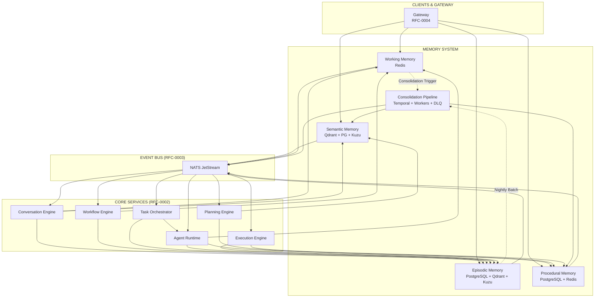
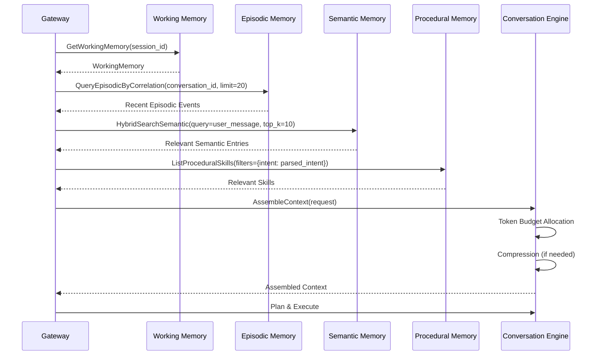
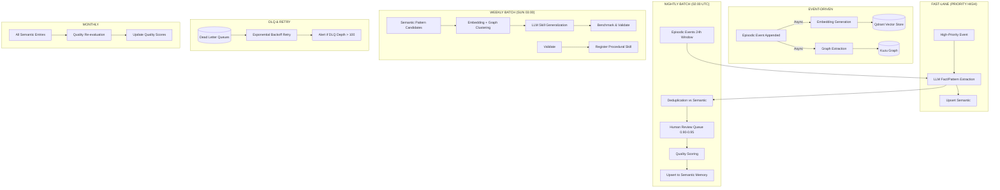
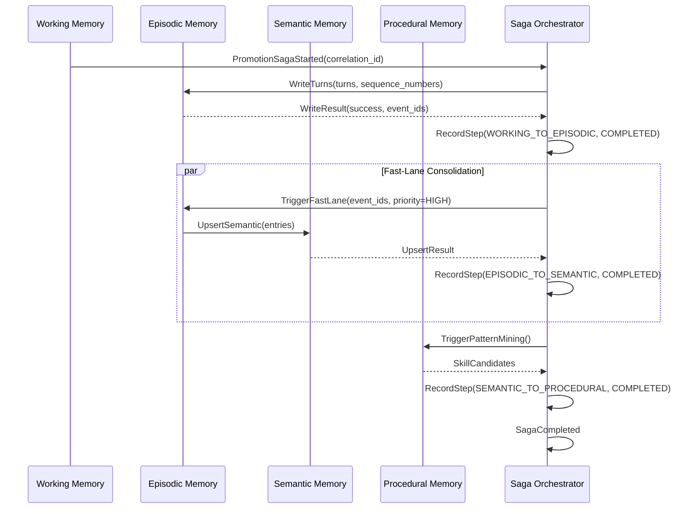

# RFC-0005
# Hermes Memory Architecture

**Status:** Draft  
**Author:** Hermes Team  
**Owner:** Chief System Architect  
**Version:** 1.1  
**Priority:** Critical  
**Depends On:** RFC-0001 (Foundation), RFC-0002 v1.1 (Core Architecture), RFC-0003 v1.1 (Event Bus), RFC-0004 v1.1 (Gateway)  
**Supersedes:** RFC-0005 v1.0

---

## 1. Purpose

This RFC defines the **Hermes Memory Architecture** — the unified memory system for Hermes Agent OS v2.

Hermes Memory is the **single memory system** used by every client (Mission Control, Hermes Desktop, Web, Mobile, Telegram, Discord, WhatsApp) and every agent (Planner, Coder, Reviewer, Security, Git, etc.). It is the substrate for all context, learning, and long-term knowledge.

**Core Principle:** *One memory system. All clients. All agents. All time.*

---

## 2. Scope

| In Scope | Out of Scope |
|----------|--------------|
| Memory hierarchy (4 tiers) | Agent reasoning logic (RFC-0002) |
| Memory lifecycle & consolidation | Event Bus internals (RFC-0003) |
| Retrieval APIs (gRPC + events) | Gateway protocol details (RFC-0004) |
| Vector + graph storage | Knowledge Engine RAG pipelines (RFC-0006) |
| Multi-tenant isolation | Security policy (RFC-0007) |
| Consolidation pipelines | Plugin SDK (RFC-0008) |
| Context assembly & compression | Automation (RFC-0009) |

---

## 3. Design Principles

| Principle | Description |
|-----------|-------------|
| **Single Source of Truth** | One memory system for all clients, agents, and time |
| **Tiered Architecture** | 4 distinct tiers with distinct characteristics |
| **Event-Sourced** | All mutations via RFC-0003 events |
| **Multi-Tenant Isolation** | Hard boundaries at every tier |
| **Consolidation-Native** | Background processes promote memory across tiers |
| **Retrieval-First Design** | Optimized for latency-constrained context assembly |
| **Privacy by Design** | PII detection, encryption, retention, deletion |
| **Observability-First** | Full tracing, metrics, audit at every operation |
| **Resilient by Default** | DLQ, retries, circuit breakers, graceful degradation |
| **Operationally Visible** | Consolidation progress, backpressure, health endpoints |

---

## 4. Memory Hierarchy

```
┌─────────────────────────────────────────────────────────────────────────────┐
│                        HERMES MEMORY SYSTEM                                  │
│                                                                              │
│  ┌──────────────────────────────────────────────────────────────────────┐   │
│  │                    WORKING MEMORY (STM)                               │   │
│  │  • Per-session, per-conversation                                      │   │
│  │  • Sub-millisecond latency                                            │   │
│  │  • TTL: session + 5 min                                               │   │
│  │  • Capacity: ~50K tokens                                              │   │
│  │  • Store: Redis (in-memory)                                           │   │
│  └──────────────────────────────────────────────────────────────────────┘   │
│                                    │                                        │
│                    Consolidation (on context switch / idle)                 │
│                                    ▼                                        │
│  ┌──────────────────────────────────────────────────────────────────────┐   │
│  │                    EPISODIC MEMORY                                     │   │
│  │  • Per-conversation, per-user, per-agent                              │   │
│  │  • Millisecond latency                                                │   │
│  │  • Retention: 90 days (configurable per tenant)                       │   │
│  │  • Capacity: ~10M events per tenant                                   │   │
│  │  • Store: PostgreSQL (partitioned) + Vector index                     │   │
│  └──────────────────────────────────────────────────────────────────────┘   │
│                                    │                                        │
│              Nightly Consolidation (embedding + graph extraction)           │
│                                    ▼                                        │
│  ┌──────────────────────────────────────────────────────────────────────┐   │
│  │                    SEMANTIC MEMORY                                     │   │
│  │  • Tenant-scoped, domain-organized                                    │   │
│  │  • Sub-100ms hybrid search (vector + keyword + graph)                 │   │
│  │  • Retention: years (configurable)                                    │   │
│  │  • Capacity: ~100M vectors per tenant                                 │   │
│  │  • Store: Qdrant (vector) + Kuzu (graph) + PostgreSQL (metadata)      │   │
│  └──────────────────────────────────────────────────────────────────────┘   │
│                                    │                                        │
│           Continuous Consolidation (pattern mining, skill extraction)       │
│                                    ▼                                        │
│  ┌──────────────────────────────────────────────────────────────────────┐   │
│  │                    PROCEDURAL MEMORY                                   │   │
│  │  • Tenant-scoped, versioned                                           │   │
│  │  • Sub-millisecond lookup (skill → implementation)                    │   │
│  │  • Retention: permanent (explicit deprecation only)                   │   │
│  │  • Capacity: ~100K skills per tenant                                  │   │
│  │  • Store: PostgreSQL (versioned) + Redis cache                        │   │
│  └──────────────────────────────────────────────────────────────────────┘   │
└─────────────────────────────────────────────────────────────────────────────┘
```

### 4.1 Tier Comparison

| Dimension | Working (STM) | Episodic | Semantic | Procedural |
|-----------|---------------|----------|----------|------------|
| **Latency** | < 1 ms | 1-5 ms | 10-100 ms | < 1 ms |
| **Scope** | Session | Conversation/User/Agent | Tenant/Domain | Tenant |
| **Retention** | Session + 5 min | 90 days | Years | Permanent |
| **Write Path** | Direct (Redis) | Event → PostgreSQL + Vector | Consolidation pipeline | Explicit registration |
| **Read Path** | Direct (Redis) | SQL + Vector + Graph | Hybrid (Vector + Keyword + Graph) | Direct (Redis/PostgreSQL) |
| **Consistency** | Strong | Eventual (async vector) | Eventual (consolidation lag) | Strong |
| **Capacity** | ~50K tokens | 10M events/tenant | 100M vectors/tenant | 100K skills/tenant |
| **Primary Use** | Active context | History, audit, replay | RAG, knowledge retrieval | Skill execution |

---

## 5. Working Memory (STM)

### 5.1 Purpose
Ultra-low-latency scratchpad for active conversation context. Holds the "now" — current turn, recent history, active workflow state, agent scratchpads.

### 5.2 Data Model

```protobuf
message WorkingMemory {
  string session_id = 1;
  string tenant_id = 2;
  string workspace_id = 3;
  string user_id = 4;
  
  repeated ConversationTurn recent_turns = 5;
  ConversationSummary summary = 6;
  
  string active_workflow_id = 7;
  WorkflowState workflow_state = 8;
  
  map<string, AgentScratchpad> agent_scratchpads = 9;
  
  TokenBudget token_budget = 10;
  
  int64 created_at_us = 11;
  int64 last_accessed_us = 12;
  int32 ttl_seconds = 13;
}

message ConversationTurn {
  string turn_id = 1;
  string role = 2;
  string content = 3;
  map<string, string> metadata = 4;
  int64 timestamp_us = 5;
}

message AgentScratchpad {
  string agent_id = 1;
  bytes data = 2;
  int64 updated_at_us = 3;
}
```

### 5.3 Operations

| Operation | Latency | Consistency |
|-----------|---------|-------------|
| `GetWorkingMemory(session_id)` | < 1 ms | Strong |
| `UpsertTurn(session_id, turn)` | < 1 ms | Strong |
| `UpdateScratchpad(session_id, agent_id, data)` | < 1 ms | Strong |
| `UpdateTokenBudget(session_id, budget)` | < 1 ms | Strong |
| `DeleteSession(session_id)` | < 1 ms | Strong |

### 5.4 TTL & Eviction
- **Idle TTL**: 5 minutes after last access
- **Max Session Duration**: 24 hours (hard limit)
- **Eviction Policy**: LRU within Redis; background job scans for expired sessions
- **On Eviction**: Atomic flush to Episodic Memory with sequence numbers (C-05)

---

## 6. Episodic Memory

### 6.1 Purpose
Immutable, append-only log of all significant events per conversation/user/agent. The "what happened" — raw events, turns, tool calls, decisions, approvals.

### 6.2 Data Model

```protobuf
message EpisodicEvent {
  string event_id = 1;
  string correlation_id = 2;
  string causation_id = 3;
  int64 timestamp_us = 4;
  
  string tenant_id = 5;
  string workspace_id = 6;
  string user_id = 7;
  
  string source_module = 8;
  string source_agent_id = 9;
  
  string event_type = 10;
  bytes payload = 11;
  
  repeated float vector_embedding = 12;
  string embedding_model = 12;
  
  repeated EntityRelation entity_relations = 13;
  
  PrivacyLevel privacy_level = 14;
  repeated string pii_tags = 15;
  
  ConsolidationStatus consolidation_status = 16;
  int64 consolidation_started_us = 17;
  int64 consolidation_completed_us = 18;
}
```

### 6.3 Storage
- **Primary**: PostgreSQL (partitioned by `correlation_id` hash, 64 partitions)
- **Vector Index**: Qdrant (HNSW, 1536-dim, cosine)
- **Graph**: Kuzu (property graph, entities + relations)
- **Partitions**: By `tenant_id` + `correlation_id` hash

### 6.4 Retention
| Tier | Retention | Configurable |
|------|-----------|--------------|
| Default | 90 days | Yes (per tenant) |
| Audit/Compliance | 7 years | Yes (per tenant) |
| PII-tagged | 30 days (then auto-purge) | Yes |

### 6.5 Operations

| Operation | Latency | Consistency |
|-----------|---------|-------------|
| `AppendEvent(event)` | 2-5 ms | Eventual (vector async) |
| `QueryByCorrelation(correlation_id, limit, offset)` | 5-10 ms | Strong (PostgreSQL) |
| `QueryByTimeRange(tenant, start, end, filters)` | 10-50 ms | Eventual |
| `SemanticSearch(correlation_id, query_vector, top_k)` | 10-50 ms | Eventual |
| `DeleteByCorrelation(correlation_id)` | Async | Eventual |

### 6.6 Atomic Flush on Eviction (C-05)
- **Sequence Numbers**: Each turn gets monotonically increasing sequence number per session
- **Single Writer**: Per-session lock in Redis ensures single writer
- **Atomic Flush**: On eviction, all unflushed turns flushed as single transaction to Episodic with sequence numbers
- **Exactly-Once**: PostgreSQL unique constraint on `(session_id, sequence_number)`

---

## 7. Semantic Memory

### 7.1 Purpose
Long-term, queryable knowledge base. The "what I know" — facts, concepts, documents, code patterns, best practices. Optimized for retrieval, not replay.

### 7.2 Data Model

```protobuf
message SemanticMemoryEntry {
  string entry_id = 1;
  string tenant_id = 2;
  string workspace_id = 3;
  
  string content = 4;
  string content_type = 5;
  map<string, string> metadata = 6;
  
  repeated float vector_embedding = 7;
  string embedding_model = 8;
  
  string graph_node_id = 9;
  repeated string related_concepts = 10;
  
  string version = 9;
  string previous_version_id = 10;
  string change_summary = 11;
  
  MemoryState state = 11;
  int64 created_at_us = 12;
  int64 updated_at_us = 13;
  int64 expires_at_us = 14;
  
  float quality_score = 15;
  int32 access_count = 16;
  int64 last_accessed_us = 17;
  
  string source_episodic_correlation_id = 18;
  ConsolidationPriority consolidation_priority = 19;
}
```

### 7.3 Storage
| Component | Technology | Purpose |
|-----------|------------|---------|
| **Vector Search** | Qdrant (HNSW, 1536-dim, cosine) | Semantic similarity |
| **Keyword Search** | PostgreSQL (tsvector, trigram) | Exact/partial match |
| **Graph** | Kuzu (property graph) | Concept relations, multi-hop |
| **Metadata/ACL** | PostgreSQL (partitioned by tenant) | Filtering, versioning, ACLs |

### 7.4 Hybrid Search Pipeline

```
Query (text) 
    │
    ├─▶ Keyword Search (PostgreSQL) ──▶ Candidates (top 100)
    │
    ├─▶ Vector Search (Qdrant) ──────▶ Candidates (top 100)
    │
    ├─▶ Graph Expansion (Kuzu) ──────▶ Related concepts (top 50)
    │
    ▼
Reciprocal Rank Fusion (RRF) + Re-ranking (cross-encoder)
    │
    ▼
Final Results (top K, diversified)
```

### 7.5 Operations

| Operation | Latency | Consistency |
|-----------|---------|-------------|
| `HybridSearch(query, filters, top_k)` | 50-150 ms | Eventual |
| `VectorSearch(vector, filters, top_k)` | 20-50 ms | Eventual |
| `KeywordSearch(query, filters, top_k)` | 10-30 ms | Strong |
| `GraphTraverse(node_id, depth, relationship_types)` | 10-50 ms | Strong |
| `UpsertEntry(entry)` | 50-200 ms (async vector) | Eventual |
| `GetEntry(entry_id)` | 5-10 ms | Strong |
| `DeprecateEntry(entry_id, replacement_id)` | 10-20 ms | Strong |

### 7.6 Consolidation Sources
1. **Episodic → Semantic**: Nightly batch extracts facts, patterns, decisions from episodic events
2. **Agent Outputs**: Successful agent outputs (code, docs, analyses) promoted
3. **Human Curation**: Explicit knowledge capture via "remember this" actions
4. **External Ingestion**: Documents, repos, wikis ingested via pipeline

### 7.6 Consolidation Details (Enhanced)

#### Episodic → Semantic (Nightly + Fast-Lane) (C-03)
1. **Fast-Lane (Priority HIGH)**: Synchronous path for tagged events (`consolidation.priority=high`)
   - Trigger: Events tagged `consolidation.priority=high` (approvals, decisions, security findings)
   - Path: Event → LLM extraction → Semantic upsert (< 5s end-to-end)
   - Tag: `consolidation.priority=high` in event metadata
   
2. **Nightly Batch (02:00 UTC)**:
   - **Window**: Last 24h of episodic events per tenant (excluding fast-lane processed)
   - **Extraction**: LLM extracts:
     - Facts (entities, relationships, attributes)
     - Patterns (recurring workflows, common errors)
     - Decisions (approvals, rejections, rationale)
     - Code patterns (APIs, patterns, anti-patterns)
   - **Deduplication**: Merge with existing semantic entries (embedding similarity > 0.95)
   - **Human Review Queue**: Similarity 0.90-0.95 → human review (H-03)
   - **Auto-Merge**: Similarity > 0.95 → automatic merge
   - **Quality Scoring**: Auto-eval (0-1) based on source credibility, recency, uniqueness
   - **Persistence**: Upsert to semantic memory with provenance links

#### Pattern Mining → Procedural (Weekly) (H-01)
1. **Input**: Semantic entries tagged `pattern`, `workflow`, `skill-candidate`
2. **Clustering**: Group similar patterns (embedding + graph)
3. **Generalization**: LLM creates parameterized skill from cluster
4. **Validation**: Execute skill on test cases; require > 80% pass
5. **Benchmarking** (H-01): Auto-run test suite on registration; benchmark latency/tokens/success; record in `quality_score`
6. **Registration**: If valid, register as Procedural Skill (v0.1.0)

### 7.7 Human Review Queue for Deduplication (H-03)
- **Trigger**: New semantic entry with embedding similarity 0.90-0.95 to existing entry
- **Queue**: Human review task in Mission Control
- **Auto-Merge**: Similarity > 0.95 → automatic merge
- **Auto-Reject**: Similarity < 0.90 → keep separate
- **Metrics**: Track review queue depth, resolution time, false positive rate

---

## 8. Procedural Memory

### 8.1 Purpose
Versioned, executable skills and workflows. The "how to" — reusable capabilities that agents can invoke.

### 8.2 Data Model

```protobuf
message ProceduralSkill {
  string skill_id = 1;
  string tenant_id = 2;
  
  string name = 3;
  string description = 4;
  string category = 5;
  repeated string tags = 6;
  
  SkillInputSchema input_schema = 4;
  SkillOutputSchema output_schema = 5;
  
  string implementation_version = 5;
  SkillImplementation implementation = 6;
  
  repeated string required_tools = 7;
  repeated string required_capabilities = 8;
  repeated string depends_on_skills = 9;
  
  float success_rate = 6;
  int32 invocation_count = 6;
  float avg_latency_ms = 7;
  float quality_score = 8;
  
  BenchmarkResults benchmark_results = 10;
  BenchmarkConfig benchmark_config = 11;
  
  SkillState state = 8;
  string deprecated_in_favor_of = 9;
  int64 created_at_us = 10;
  int64 updated_at_us = 11;
  
  InvocationContract invocation_contract = 12;
}

message InvocationContract {
  int32 timeout_ms = 1;
  int32 max_retries = 2;
  RetryPolicy retry_policy = 3;
  bool streaming_supported = 4;
  bool cancellation_supported = 5;
  PartialResultPolicy partial_result_policy = 6;
  CircuitBreakerConfig circuit_breaker = 7;
}

message BenchmarkResults {
  float latency_p50_ms = 1;
  float latency_p99_ms = 2;
  float avg_token_usage = 3;
  float success_rate = 4;
  int32 sample_size = 5;
  int64 last_run_us = 6;
}
```

### 8.3 Storage
- **Primary**: PostgreSQL (partitioned by tenant, versioned rows)
- **Cache**: Redis (skill_id → implementation, TTL 1 hour)
- **Index**: PostgreSQL full-text on name, description, tags

### 8.4 Operations

| Operation | Latency | Consistency |
|-----------|---------|-------------|
| `GetSkill(skill_id, version?)` | < 1 ms (cache) / 5 ms (DB) | Strong |
| `ListSkills(filters, pagination)` | 10-20 ms | Strong |
| `RegisterSkill(skill)` | 20-50 ms | Strong |
| `DeprecateSkill(skill_id, replacement_id)` | 10-20 ms | Strong |
| `InvokeSkill(skill_id, input)` | Variable (per contract) | Per contract |

### 8.4 Invocation Contract (C-02)
```protobuf
service ProceduralSkillService {
  rpc InvokeSkill(InvokeSkillRequest) returns (InvokeSkillResponse);
  rpc InvokeSkillStream(InvokeSkillRequest) returns (stream InvokeSkillResponse);
  rpc HealthCheck(HealthCheckRequest) returns (HealthCheckResponse);
}

message InvokeSkillRequest {
  string skill_id = 1;
  string version = 2;
  bytes input = 3;
  InvocationOptions options = 4;
}

message InvokeSkillResponse {
  string invocation_id = 1;
  bytes output = 2;
  InvocationStatus status = 3;
  string error_message = 4;
  ResourceUsage usage = 5;
}

message InvocationOptions {
  int32 timeout_ms = 1;
  int32 max_retries = 2;
  bool stream = 3;
  bool return_partial_on_timeout = 4;
  map<string, string> metadata = 5;
}
```

### 8.5 Versioning & Deprecation
- **SemVer**: MAJOR = breaking input/output, MINOR = new capability, PATCH = fix
- **Deprecation**: 2-version notice period; auto-redirect to replacement
- **Rollback**: Instant via version pinning; automated rollback on failure threshold (H-01)

---

## 9. Long-Term Memory

### 9.1 Definition
Union of Episodic + Semantic + Procedural tiers. The complete persistent memory footprint for a tenant.

### 9.2 Cross-Tier Queries
```protobuf
message UnifiedSearchRequest {
  string tenant_id = 1;
  string query = 2;
  SearchScope scope = 3;
  SearchFilters filters = 4;
  int32 top_k = 5;
  bool include_vectors = 6;
}

message UnifiedSearchResponse {
  repeated EpisodicEvent episodic_results = 1;
  repeated SemanticMemoryEntry semantic_results = 2;
  repeated ProceduralSkill procedural_results = 3;
  SearchMetadata metadata = 4;
}
```

### 9.3 Unified Search Pipeline
- Routes to appropriate tier(s) based on `scope`
- Merges results via RRF (Reciprocal Rank Fusion)
- Applies cross-tier deduplication
- Returns unified ranked results

---

## 10. Memory Lifecycle

```
┌─────────────┐     ┌─────────────┐     ┌─────────────┐     ┌─────────────┐
│   CREATE    │────▶│   ACTIVE    │────▶│ CONSOLIDATE │────▶│  PROMOTE    │
│             │     │             │     │             │     │             │
│ - Event     │     │ - Queryable │     │ - Batch     │     │ - Episodic  │
│ - Skill     │     │ - Mutable   │     │ - Embedding │     │   → Semantic│
│ - Working   │     │ - TTL       │     │ - Graph ext │     │ - Pattern   │
└─────────────┘     └─────────────┘     └─────────────┘     │   → Procedural│
                                                             └─────────────┘
                                    │                              │
                                    ▼                              ▼
                                                         ┌─────────────────┐
                                                         │   MAINTAIN      │
                                                         │                 │
                                                         │ - Version       │
                                                         │ - Quality       │
                                                         │ - Access stats  │
                                                         │ - TTL/Retention │
                                                         └────────┬────────┘
                                                                │
                                                         ┌──────┴──────┐
                                                         ▼             ▼
                                                  ┌─────────┐ ┌─────────┐
                                                  │ DEPRECATE │  PURGE   │
                                                  │           │           │
                                                  │ - Redirect│ - TTL     │
                                                  │ - 2 vers  │ - GDPR    │
                                                  │ - Warn    │ - Policy  │
                                                  └─────────┘ └─────────┘
```

### 10.1 Consolidation Pipeline (Enhanced)

| Stage | Trigger | Input | Output | Schedule |
|-------|---------|-------|--------|----------|
| **Embedding** | Event append | Episodic event | Vector in Qdrant | Async (< 1s) |
| **Graph Extraction** | Event append | Episodic event | Entities + relations in Kuzu | Async (< 5s) |
| **Episodic→Semantic (Fast-Lane)** | Priority HIGH event | Single event | Semantic entry | Sync (< 5s) |
| **Episodic→Semantic (Nightly)** | Nightly (02:00 UTC) | Episodic events (24h) | Semantic entries | Daily |
| **Pattern Mining** | Weekly (Sun 03:00) | Semantic entries | Procedural skill candidates | Weekly |
| **Skill Validation** | On candidate | Skill candidate | Validated skill | Async |
| **Quality Re-eval** | Monthly | All semantic entries | Updated quality scores | Monthly |

### 10.2 Consolidation DLQ & Retry Framework (C-01)

```yaml
consolidation_pipeline:
  stages:
    - name: embedding_generation
      dlq_topic: hermes.dlq.memory.embedding
      max_retries: 3
      backoff: exponential
      base_delay_ms: 1000
      
    - name: graph_extraction
      dlq_topic: hermes.dlq.memory.graph
      max_retries: 3
      backoff: exponential
      base_delay_ms: 1000
      
    - name: episodic_to_semantic_nightly
      dlq_topic: hermes.dlq.memory.consolidation.nightly
      max_retries: 3
      backoff: exponential
      base_delay_ms: 5000
      
    - name: pattern_mining_weekly
      dlq_topic: hermes.dlq.memory.consolidation.weekly
      max_retries: 2
      backoff: exponential
      base_delay_ms: 10000

  dlq_processing:
    retry_on_startup: true
    max_reprocess_attempts: 5
    alert_on_dlq_depth: 100
    manual_reprocess_api: true
```

- **Per-Stage DLQ**: Each consolidation stage publishes failed items to dedicated NATS DLQ topic
- **Idempotent Reprocessing**: Events carry `event_id`; reprocessing is idempotent via deduplication
- **Exponential Backoff**: Configurable per stage
- **Alerting**: Prometheus alert on DLQ depth > 100
- **Manual Reprocess**: Admin API to replay specific events or entire DLQ

### 10.3 Consolidation Progress API (H-07)
```protobuf
message ConsolidationStatus {
  string tenant_id = 1;
  string stage = 2;
  ConsolidationStageStatus status = 3;
  int64 started_at_us = 4;
  int64 completed_at_us = 5;
  int64 processed_count = 6;
  int64 failed_count = 7;
  int64 lag_events = 8;
  float progress_percent = 9;
  string current_batch_id = 10;
  int64 eta_us = 11;
}
```

---

## 11. Memory Retrieval

### 11.1 Context Assembly Pipeline (RFC-0004 §11.1)

```
User Request
    │
    ├─▶ Working Memory (session context) ──▶ Recent turns, workflow state, scratchpads
    │
    ├─▶ Episodic Memory ──▶ Recent conversation events (last 20 turns)
    │
    ├─▶ Semantic Memory ──▶ Hybrid search (vector + keyword + graph)
    │
    ├─▶ Procedural Memory ──▶ Relevant skills for intent
    │
    ▼
Token Budget Allocation (RFC-0004 §11.1)
    │
    ├─▶ Working Memory: 30% (always included)
    ├─▶ Recent Episodic: 20%
    ├─▶ Semantic (RAG): 30%
    ├─▶ Procedural Skills: 10%
    ├─▶ Active Workflow: 10%
    │
    ▼
Compressed Context (if > budget)
    │
    ▼
Final Context → Planning Engine
```

### 11.2 Retrieval APIs (gRPC)

```protobuf
service MemoryService {
  rpc GetWorkingMemory(GetWorkingMemoryRequest) returns (WorkingMemory);
  rpc UpsertTurn(UpsertTurnRequest) returns (UpsertTurnResponse);
  rpc UpdateScratchpad(UpdateScratchpadRequest) returns (UpdateScratchpadResponse);
  rpc UpdateTokenBudget(UpdateTokenBudgetRequest) returns (UpdateTokenBudgetResponse);
  
  rpc AppendEpisodicEvent(AppendEpisodicEventRequest) returns (AppendEpisodicEventResponse);
  rpc QueryEpisodicByCorrelation(QueryEpisodicRequest) returns (QueryEpisodicResponse);
  rpc QueryEpisodicByTimeRange(QueryEpisodicTimeRangeRequest) returns (QueryEpisodicResponse);
  rpc SemanticSearchEpisodic(SemanticSearchEpisodicRequest) returns (SemanticSearchEpisodicResponse);
  
  rpc HybridSearchSemantic(HybridSearchSemanticRequest) returns (HybridSearchSemanticResponse);
  rpc VectorSearchSemantic(VectorSearchSemanticRequest) returns (VectorSearchSemanticResponse);
  rpc KeywordSearchSemantic(KeywordSearchSemanticRequest) returns (KeywordSearchSemanticResponse);
  rpc GraphTraverseSemantic(GraphTraverseSemanticRequest) returns (GraphTraverseSemanticResponse);
  rpc UpsertSemanticEntry(UpsertSemanticEntryRequest) returns (UpsertSemanticEntryResponse);
  rpc GetSemanticEntry(GetSemanticEntryRequest) returns (SemanticMemoryEntry);
  rpc DeprecateSemanticEntry(DeprecateSemanticEntryRequest) returns (DeprecateSemanticEntryResponse);
  
  rpc GetProceduralSkill(GetProceduralSkillRequest) returns (ProceduralSkill);
  rpc ListProceduralSkills(ListProceduralSkillsRequest) returns (ListProceduralSkillsResponse);
  rpc RegisterProceduralSkill(RegisterProceduralSkillRequest) returns (RegisterProceduralSkillResponse);
  rpc DeprecateProceduralSkill(DeprecateProceduralSkillRequest) returns (DeprecateProceduralSkillResponse);
  rpc InvokeSkill(InvokeSkillRequest) returns (InvokeSkillResponse);
  rpc InvokeSkillStream(InvokeSkillRequest) returns (stream InvokeSkillResponse);
  
  rpc UnifiedSearch(UnifiedSearchRequest) returns (UnifiedSearchResponse);
  
  rpc AssembleContext(AssembleContextRequest) returns (AssembleContextResponse);
  
  rpc GetMemoryStats(GetMemoryStatsRequest) returns (MemoryStats);
  rpc TriggerConsolidation(TriggerConsolidationRequest) returns (TriggerConsolidationResponse);
  rpc GetConsolidationStatus(GetConsolidationStatusRequest) returns (ConsolidationStatus);
}
```

### 11.3 AssembleContext (Critical for RFC-0004)

```protobuf
message AssembleContextRequest {
  string conversation_id = 1;
  string user_message = 2;
  string intent = 3;
  TokenBudget budget = 4;
  AssemblyOptions options = 5;
}

message AssembleContextResponse {
  Context context = 1;
  TokenUsage usage = 2;
  AssemblyMetadata metadata = 3;
}

message Context {
  WorkingMemory working_memory = 1;
  repeated ConversationTurn recent_turns = 2;
  repeated EpisodicEvent relevant_episodic = 3;
  repeated SemanticMemoryEntry relevant_semantic = 4;
  repeated ProceduralSkill relevant_procedural = 5;
  WorkflowState active_workflow = 6;
}

message TokenBudget {
  int32 total_tokens = 1;
  int32 working_memory_tokens = 2;
  int32 recent_episodic_tokens = 3;
  int32 semantic_tokens = 4;
  int32 procedural_tokens = 5;
  int32 workflow_tokens = 6;
}

message AssemblyOptions {
  bool include_vectors = 1;
  bool skip_semantic = 2;
  bool skip_procedural = 3;
  CompressionLevel compression = 4;
}

message AssemblyMetadata {
  int32 total_tokens_used = 1;
  map<string, int32> tokens_per_source = 2;
  repeated string skipped_tiers = 3;
  int64 assembly_latency_ms = 4;
  bool degraded = 5;
}
```

### 11.4 Context Assembly Circuit Breakers (C-04)

```yaml
assemble_context_circuit_breakers:
  per_tier_timeouts:
    working_memory: 5ms
    episodic: 20ms
    semantic: 100ms
    procedural: 30ms
    workflow: 10ms
  
  total_timeout: 500ms
  
  degradation_policy:
    semantic_timeout:
      action: SKIP_TIER
      log_level: WARNING
      fallback: "Semantic tier skipped due to timeout"
    procedural_timeout:
      action: SKIP_TIER
      log_level: WARNING
      fallback: "Procedural tier skipped due to timeout"
    episodic_timeout:
      action: SKIP_TIER
      log_level: WARNING
      fallback: "Episodic tier skipped due to timeout"
    working_memory_timeout:
      action: FAIL_FAST
      log_level: ERROR
      
  circuit_breaker:
    failure_threshold: 5
    window_seconds: 30
    half_open_requests: 3
```

---

## 12. Context Compression

### 12.1 Triggers
| Trigger | Action |
|---------|--------|
| Context > 80% budget | Compress oldest 50% of recent turns |
| Context > 100% budget | Aggressive: summarize all but last 5 turns |
| Idle > 1 hour | Full summarization → Episodic |
| Session end | Full summarization → Episodic + Semantic |

### 12.2 Compression Strategies

| Strategy | Input | Output | Token Reduction |
|----------|-------|--------|-----------------|
| **Extractive** | Recent turns | Key sentences (TF-IDF) | 40-60% |
| **Abstractive (LLM)** | Turns + context | Structured summary | 70-85% |
| **Hierarchical** | Full history | Tree: session → hour → turn | 80-95% |
| **Schema-Driven** | Structured events | Schema-compressed JSON | 50-70% |

### 12.3 Compression Pipeline

```
Context exceeds budget
    │
    ├─▶ If budget > 90%: Abstractive LLM summary (500 token budget)
    │
    ├─▶ If budget > 80%: Extractive + Schema compression
    │
    └─▶ Else: Extractive only
    
Compressed output stored as:
- Working Memory: CompressedTurn (summary + key entities)
- Episodic: Full original + CompressedTurn reference
- Semantic: Extracted facts from summary
```

---

## 13. Memory Indexing

### 13.1 Index Types

| Index | Scope | Technology | Use Case |
|-------|-------|------------|----------|
| **Primary Key** | All tiers | PostgreSQL PK | Point lookups |
| **Correlation ID** | Episodic | PostgreSQL BRIN | Conversation replay |
| **Time-Series** | Episodic | PostgreSQL BRIN + Partition | Time-range queries |
| **Vector (HNSW)** | Semantic + Episodic | Qdrant | Semantic search |
| **Full-Text (tsvector)** | Semantic | PostgreSQL GIN | Keyword search |
| **Trigram (pg_trgm)** | Semantic | PostgreSQL GIN | Fuzzy/partial match |
| **Graph (Adjacency)** | Semantic | Kuzu | Multi-hop reasoning |
| **Inverted (Tags)** | All | PostgreSQL GIN | Tag filtering |
| **LRU/Timestamp** | Working | Redis Sorted Set | Eviction |

### 13.2 Partitioning Strategy

| Tier | Partition Key | Partitions | Rationale |
|------|---------------|------------|-----------|
| **Episodic** | `hash(correlation_id) % 64` | 64 | Even distribution, conversation locality |
| **Semantic** | `tenant_id` + `hash(entry_id) % 16` | 16 per tenant | Tenant isolation, parallel query |
| **Procedural** | `tenant_id` | 1 per tenant | Small, tenant-scoped |

---

## 14. Vector Storage

### 14.1 Configuration (Qdrant)

```yaml
collections:
  semantic_memory:
    vector_size: 1536
    distance: Cosine
    hnsw_config:
      m: 32
      ef_construct: 256
      full_scan_threshold: 10000
    quantization:
      scalar:
        type: int8
        always_ram: true
    sharding:
      shard_number: 4
      replication_factor: 2
  
  episodic_events:
    vector_size: 1536
    distance: Cosine
    hnsw_config:
      m: 16
      ef_construct: 128
    sharding:
      shard_number: 8
      replication_factor: 2
```

### 14.2 Embedding Models

| Model | Dimensions | Use Case | Cost |
|-------|------------|----------|------|
| `text-embedding-3-small` | 1536 | Default (semantic + episodic) | Low |
| `text-embedding-3-large` | 3072 | High-precision semantic | Medium |
| `jina-embeddings-v3` | 1024 | Code-specific | Low |
| `bge-m3` | 1024 | Multilingual + dense+sparse | Low |

### 14.3 Vector Operations

| Operation | Target | Latency (P99) |
|-----------|--------|---------------|
| `upsert(vectors)` | Semantic/Episodic | < 50 ms (batch 100) |
| `search(vector, top_k, filter)` | Semantic/Episodic | < 100 ms |
| `recommend(positive_ids, negative_ids)` | Semantic | < 100 ms |
| `delete(points)` | All | < 20 ms |

### 14.4 Vector Schema Migration Strategy (H-02 Addendum)
- **Dual-Write Period**: New model writes to both old and new collections
- **Shadow Validation**: Compare search results between old/new for 1 week
- **Cutover**: Switch reads to new collection; keep old for 30 days
- **Rollback**: Instant switch back if regression detected

---

## 15. Knowledge Graph Integration (Kuzu)

### 15.1 Schema

```cypher
// Node Types
(:Concept {id, name, type, description, embedding_id, tenant_id, created_at})
(:Entity {id, name, type, properties, tenant_id, created_at})
(:Skill {id, name, version, input_schema, output_schema, tenant_id})
(:Document {id, title, source, content_hash, tenant_id})
(:Agent {id, name, type, capabilities, tenant_id})

// Relationship Types
(:Concept)-[:RELATES_TO {weight, relation_type}]->(:Concept)
(:Entity)-[:MENTIONED_IN]->(:Document)
(:Skill)-[:REQUIRES]->(:Skill)
(:Skill)-[:USES_TOOL]->(:Tool)
(:Agent)-[:HAS_SKILL]->(:Skill)
(:Concept)-[:EXTRACTED_FROM]->(:EpisodicEvent)
(:SemanticEntry)-[:DERIVED_FROM]->(:EpisodicEvent)
```

### 15.2 Graph Operations

| Operation | Cypher Pattern | Latency |
|-----------|----------------|---------|
| **Neighborhood** | `MATCH (n)-[:RELATES_TO*1..2]-(m) WHERE n.id = $id RETURN m` | 10-30 ms |
| **Path Finding** | `MATCH p = shortestPath((a)-[*..5]-(b)) WHERE a.id=$a AND b.id=$b RETURN p` | 20-50 ms |
| **Concept Expansion** | `MATCH (c:Concept)-[:RELATES_TO*1..3]->(related) WHERE c.name IN $concepts RETURN DISTINCT related` | 20-40 ms |
| **Skill Dependency** | `MATCH (s:Skill)-[:REQUIRES*]->(dep) WHERE s.id = $skill_id RETURN dep` | 5-15 ms |

### 15.3 Graph Population (Idempotent) (H-06)
- **Idempotency Key**: `event_id` from EpisodicEvent used as idempotency key in Kuzu upserts
- **Upsert Pattern**: `MERGE (n:Concept {id: $id}) ON CREATE SET ... ON MATCH SET ...`
- **Event Replay Safety**: Replaying events produces identical graph state

---

## 16. Memory Consistency Model

| Tier | Write Consistency | Read Consistency | Conflict Resolution |
|------|-------------------|------------------|---------------------|
| **Working** | Strong (Redis) | Strong | N/A (single writer per session) |
| **Episodic** | Strong (PostgreSQL) | Strong (PostgreSQL) | N/A (append-only) |
| **Semantic** | Eventual (async vector) | Eventual (vector) / Strong (PG) | Last-write-wins + version vector |
| **Procedural** | Strong (PostgreSQL) | Strong (PostgreSQL + Redis cache) | Version pinning |

### 16.1 Cross-Tier Consistency Guarantees

| Guarantee | Scope | Mechanism |
|-----------|-------|-----------|
| **Read Your Writes** | Same session | Working → Episodic sync on context switch |
| **Eventual Semantic** | Tenant | Consolidation pipeline (< 24h); Fast-lane < 5s |
| **Procedural Version Pinning** | Invocation | Explicit version or latest stable |
| **Vector Freshness** | Tenant | Async replication lag < 5s (monitored) |

### 16.2 Cross-Tier Saga for Promotions (C-05)

```protobuf
message PromotionSaga {
  string saga_id = 1;
  string correlation_id = 2;
  repeated SagaStep steps = 3;
  SagaState state = 4;
  map<string, string> compensation_data = 4;
}

message SagaStep {
  string step_id = 1;
  string tier = 2;
  string action = 3;
  bytes payload = 4;
  string compensation_action = 5;
  bytes compensation_payload = 6;
  StepState state = 6;
}
```

**Saga Execution**:
1. **Working → Episodic**: Append turns with sequence numbers (atomic)
2. **Episodic → Semantic**: Fast-lane or nightly consolidation
3. **Semantic → Procedural**: Weekly pattern mining → skill registration
4. **Compensation**: On any failure, execute compensating actions in reverse order
5. **Exactly-Once**: Each step idempotent via `event_id`; saga state persisted in PostgreSQL

---

## 17. Memory APIs (gRPC)

*Full service definition in §11.2. Key contracts:*

```protobuf
rpc AssembleContext(AssembleContextRequest) returns (AssembleContextResponse);
rpc AppendEpisodicEvent(AppendEpisodicEventRequest) returns (AppendEpisodicEventResponse);
rpc QueryEpisodicByCorrelation(QueryEpisodicRequest) returns (QueryEpisodicResponse);
rpc HybridSearchSemantic(HybridSearchSemanticRequest) returns (HybridSearchSemanticResponse);
rpc UpsertSemanticEntry(UpsertSemanticEntryRequest) returns (UpsertSemanticEntryResponse);
rpc GetProceduralSkill(GetProceduralSkillRequest) returns (ProceduralSkill);
rpc RegisterProceduralSkill(RegisterProceduralSkillRequest) returns (RegisterProceduralSkillResponse);
rpc InvokeSkill(InvokeSkillRequest) returns (InvokeSkillResponse);
rpc InvokeSkillStream(InvokeSkillRequest) returns (stream InvokeSkillResponse);
rpc UnifiedSearch(UnifiedSearchRequest) returns (UnifiedSearchResponse);
rpc GetConsolidationStatus(GetConsolidationStatusRequest) returns (ConsolidationStatus);
rpc GetMemoryStats(GetMemoryStatsRequest) returns (MemoryStats);
rpc TriggerConsolidation(TriggerConsolidationRequest) returns (TriggerConsolidationResponse);
```

```protobuf
service ProceduralSkillService {
  rpc InvokeSkill(InvokeSkillRequest) returns (InvokeSkillResponse);
  rpc InvokeSkillStream(InvokeSkillRequest) returns (stream InvokeSkillResponse);
  rpc HealthCheck(HealthCheckRequest) returns (HealthCheckResponse);
}
```

### 17.1 Error Codes

| Code | HTTP | Description |
|------|------|-------------|
| `MEMORY_NOT_FOUND` | 404 | Entry/session not found |
| `MEMORY_QUOTA_EXCEEDED` | 429 | Tenant quota exceeded |
| `CONSOLIDATION_IN_PROGRESS` | 409 | Operation conflicts with consolidation |
| `VECTOR_DIMENSION_MISMATCH` | 400 | Embedding dimension mismatch |
| `SKILL_DEPRECATED` | 410 | Skill deprecated, use replacement |
| `CONSOLIDATION_FAILED` | 500 | Consolidation pipeline error |
| `INVOCATION_TIMEOUT` | 504 | Skill invocation exceeded timeout |
| `INVOCATION_CANCELLED` | 499 | Skill invocation cancelled by client |

---

## 18. Event Integration (RFC-0003)

### 18.1 Published Events

| Event | Topic | Payload |
|-------|-------|---------|
| `v1.hermes.memory.working.updated` | `hermes.memory.working.updated` | Session ID, updated fields |
| `v1.hermes.memory.episodic.appended` | `hermes.memory.episodic.appended` | EpisodicEvent |
| `v1.hermes.memory.semantic.upserted` | `hermes.memory.semantic.upserted` | SemanticMemoryEntry |
| `v1.hermes.memory.procedural.registered` | `hermes.memory.procedural.registered` | ProceduralSkill |
| `v1.hermes.memory.consolidation.started` | `hermes.memory.consolidation.started` | Tenant, stage |
| `v1.hermes.memory.consolidation.completed` | `hermes.memory.consolidation.completed` | Tenant, stage, stats |
| `v1.hermes.memory.consolidation.failed` | `hermes.memory.consolidation.failed` | Tenant, stage, error |
| `v1.hermes.memory.consolidation.dlq` | `hermes.memory.consolidation.dlq` | Failed event + error |

### 18.2 Consumed Events

| Event | Source | Handler |
|-------|--------|---------|
| `v1.hermes.conversation.turn.appended` | Conversation | Append to Working + Episodic |
| `v1.hermes.workflow.step.completed` | Workflow | Update Working + Episodic |
| `v1.hermes.agent.task.completed` | Agent Runtime | Append output to Episodic |
| `v1.hermes.tool.exec.completed` | Execution Engine | Append tool result to Episodic |
| `v1.hermes.approval.granted` | Workflow | Update Working + Episodic |
| `v1.hermes.config.updated` | Config Manager | Invalidate caches, update TTLs |
| `v1.hermes.memory.consolidation.priority` | Any | Fast-lane consolidation trigger |

### 18.3 Event Correlation

```
User Message
    │
    ├─▶ v1.hermes.conversation.message.received (Gateway)
    │
    ├─▶ v1.hermes.memory.working.updated (Working Memory)
    │
    ├─▶ v1.hermes.memory.episodic.appended (Episodic Memory)
    │
    ├─▶ v1.hermes.intent.resolved (Planning)
    │
    ├─▶ v1.hermes.plan.created (Planning)
    │
    ├─▶ v1.hermes.workflow.started (Workflow)
    │
    ├─▶ v1.hermes.task.assigned (Task Orchestrator)
    │
    ├─▶ v1.hermes.agent.task.completed (Agent Runtime)
    │
    ├─▶ v1.hermes.memory.episodic.appended (Episodic Memory)
    │
    ├─▶ v1.hermes.memory.consolidation.started (Consolidation Pipeline)
    │
    ├─▶ v1.hermes.memory.semantic.upserted (Semantic Memory)
    │
    └─▶ v1.hermes.memory.procedural.registered (Procedural Memory)
```

---

## 19. Security & Privacy

### 19.1 PII Detection & Handling

| Stage | Action |
|-------|--------|
| **Ingress** | Presidio scan on all text payloads; tag PII fields |
| **Storage** | Field-level encryption (Vault transit) for PII-tagged fields |
| **Vector** | PII excluded from embeddings (redacted before embedding) |
| **Graph** | PII entities stored separately with restricted access |
| **Retrieval** | PII filtered unless explicit permission |
| **Retention** | PII auto-purge after 30 days (configurable) |

### 19.2 Encryption

| Layer | Algorithm | Key Management |
|-------|-----------|----------------|
| **At Rest (PG)** | AES-256 (TDE) | Vault-managed keys, HashiCorp Vault (auto-rotate 90d) |
| **At Rest (Qdrant/Kuzu)** | AES-256 (volume encryption) | Cloud KMS |
| **In Transit** | TLS 1.3 | mTLS (SPIFFE) |
| **Field-Level (PII)** | AES-256-GCM | Vault Transit (per-field DEK) |

### 19.3 Access Control

| Resource | Model | Enforcement |
|----------|-------|-------------|
| **Episodic** | Tenant + Workspace + Conversation | PostgreSQL RLS + Gateway middleware |
| **Semantic** | Tenant + Workspace + Tags | Qdrant payload filter + PG RLS |
| **Procedural** | Tenant + Skill Tags | PostgreSQL RLS + Gateway check |
| **Working** | Session Owner | Session ID validation |

### 19.4 Audit Logging
- All memory mutations → `v1.hermes.audit.memory.*` (immutable, 7-year retention)
- Includes: actor, resource, action, before/after hash, decision

---

## 20. Multi-Tenant Isolation

### 20.1 Physical Isolation

| Layer | Mechanism |
|-------|-----------|
| **Network** | Separate VPC per tenant (optional, enterprise) |
| **Database** | Shared PG, separate schemas + RLS |
| **Vector (Qdrant)** | Separate collections per tenant |
| **Graph (Kuzu)** | Separate database files per tenant |
| **Redis** | Separate DB index per tenant |
| **Object Store** | Separate bucket prefixes per tenant |

### 20.2 Logical Isolation

| Mechanism | Implementation |
|-----------|----------------|
| **Row-Level Security** | PostgreSQL RLS policies on all tables |
| **Vector Filter** | Qdrant payload filter: `tenant_id = $tenant` |
| **Graph Isolation** | Separate Kuzu DB file per tenant |
| **Cache Keys** | Prefixed: `tenant:{id}:...` |
| **API Enforcement** | Gateway middleware validates tenant context |

### 20.3 Quotas (Per Tenant)

| Resource | Default | Configurable |
|----------|---------|--------------|
| **Episodic Events** | 10M/month | Yes |
| **Semantic Vectors** | 100M | Yes |
| **Procedural Skills** | 100K | Yes |
| **Working Memory Sessions** | 10K concurrent | Yes |
| **Storage** | 1 TB | Yes |
| **Vector Dimensions** | 1536 (fixed) | No |

---

## 21. Performance Targets

| Metric | Target (P99) | Measurement |
|--------|--------------|-------------|
| **Working Memory Get** | < 1 ms | Redis GET |
| **Working Memory Upsert** | < 1 ms | Redis SET |
| **Episodic Append** | < 5 ms | PG INSERT + async vector |
| **Episodic Query (correlation)** | < 10 ms | PG index scan |
| **Episodic Query (time-range)** | < 50 ms | PG partition scan |
| **Semantic Hybrid Search** | < 150 ms | Qdrant + PG + Kuzu |
| **Semantic Vector Search** | < 50 ms | Qdrant HNSW |
| **Semantic Keyword Search** | < 30 ms | PG tsvector GIN |
| **Graph Traversal (2-hop)** | < 30 ms | Kuzu |
| **Procedural Skill Lookup** | < 1 ms | Redis cache |
| **Context Assembly (full)** | < 500 ms | End-to-end |
| **Consolidation (nightly)** | < 4 hours | 10M events |
| **Availability** | 99.99% | Annual |
| **Durability** | 99.999999999% | 7-year retention |

---

## 22. Architecture Diagrams

### 22.1 Memory System Topology (Mermaid)



### 22.2 Context Assembly Flow (Mermaid)



### 22.3 Consolidation Pipeline (Mermaid)



### 22.4 Saga Promotion Flow (Mermaid) (C-05)



---

## 23. Acceptance Criteria

This RFC is complete when:

### 23.1 Architecture Completeness
- [ ] All 4 memory tiers defined with data models, APIs, storage
- [ ] Memory lifecycle (create → promote → maintain → deprecate) fully specified
- [ ] Consolidation pipelines (event-driven, nightly, weekly, monthly) defined
- [ ] Context assembly algorithm with token budget allocation specified
- [ ] Context compression strategies defined
- [ ] Cross-tier query (unified search) specified

### 23.2 Technical Specifications
- [ ] gRPC service definitions for all memory operations
- [ ] Protobuf schemas for all memory types
- [ ] Event integration with RFC-0003 (published/consumed topics)
- [ ] Vector storage config (Qdrant HNSW, quantization, sharding)
- [ ] Graph schema (Kuzu) and query patterns
- [ ] Indexing strategy per tier

### 23.3 Consistency & Reliability
- [ ] Consistency model per tier documented
- [ ] Cross-tier consistency guarantees defined
- [ ] Conflict resolution strategies specified
- [ ] Retention policies per tier per tenant

### 23.4 Security & Multi-Tenancy
- [ ] PII detection, tagging, encryption, exclusion from vectors
- [ ] Field-level encryption for PII via Vault Transit
- [ ] Multi-tenant physical + logical isolation
- [ ] Per-tenant quotas and enforcement
- [ ] Audit logging to `hermes.audit.memory.*`

### 23.5 Observability & Operations
- [ ] Prometheus metrics per operation per tier
- [ ] OpenTelemetry traces with span linking across tiers
- [ ] Consolidation pipeline monitoring (lag, throughput, errors)
- [ ] Capacity planning formulas
- [ ] DR/RTO/RPO targets

### 23.6 Cross-RFC Alignment
- [ ] Aligns with RFC-0002 v1.1 (MemoryCoordinator interface)
- [ ] Aligns with RFC-0003 v1.1 (Event topics, envelope, ordering)
- [ ] Aligns with RFC-0004 v1.1 (AssembleContext, backpressure, session resume)
- [ ] MemoryCoordinator gRPC matches Gateway expectations

### 23.7 Review Gates
- [ ] Chief System Architect sign-off
- [ ] Security Architect review (encryption, PII, isolation)
- [ ] Platform Engineer review (capacity, scaling, DR)
- [ ] Data Architect review (schema, partitioning, consistency)
- [ ] Agent Framework Lead review (Procedural Skill API, context assembly)

---

## 24. References

- RFC-0001: Hermes Agent OS v2 — Foundation Architecture
- RFC-0002: Hermes Core Architecture v1.1
- RFC-0003: Hermes Event Bus & Messaging Architecture v1.1
- RFC-0004: Hermes Gateway & Communication Architecture v1.1
- RFC-0006: Knowledge Engine & RAG Architecture (planned)
- RFC-0007: Security & Tenancy Model (planned)
- PostgreSQL Partitioning Documentation
- Qdrant HNSW Configuration Guide
- Kuzu Graph Database Documentation
- Automerge CRDT Specification
- W3C Trace Context Specification
- HashiCorp Vault Transit Engine

---

## 25. Glossary

| Term | Definition |
|------|------------|
| **Working Memory (STM)** | Ultra-low-latency per-session context |
| **Episodic Memory** | Immutable event log per conversation/user/agent |
| **Semantic Memory** | Queryable knowledge base (facts, patterns, docs) |
| **Procedural Memory** | Versioned, executable skills/workflows |
| **Consolidation** | Background promotion of memory across tiers |
| **Context Assembly** | Building LLM prompt from multi-tier memory |
| **Token Budget** | Max tokens allocated per context section |
| **Context Compression** | Summarization to fit token budget |
| **Hybrid Search** | Vector + keyword + graph combined search |
| **RRF** | Reciprocal Rank Fusion (result merging) |
| **HNSW** | Hierarchical Navigable Small World (vector index) |
| **CRDT** | Conflict-free Replicated Data Type (Automerge) |
| **RLS** | Row-Level Security (PostgreSQL) |
| **Span Linking** | Connecting child spans to parent trace |
| **Baggage** | Key-value pairs propagated across services |

---

**End of RFC-0005 v1.1**

*This document is the canonical Memory Architecture specification for Hermes Agent OS. No implementation shall begin until this RFC is reviewed and approved.*