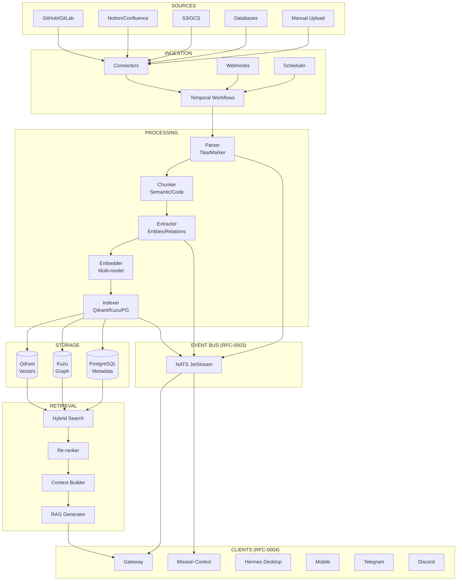
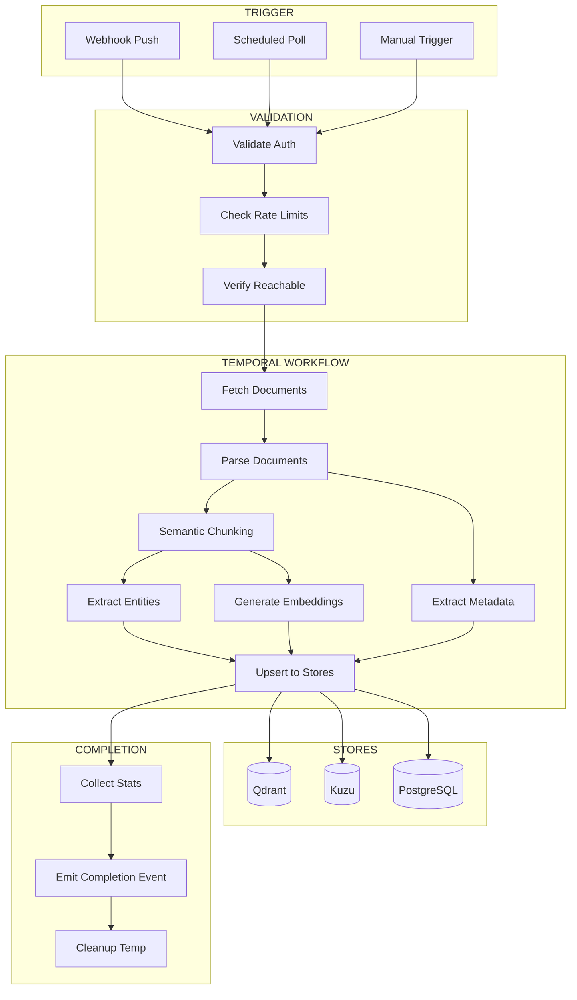
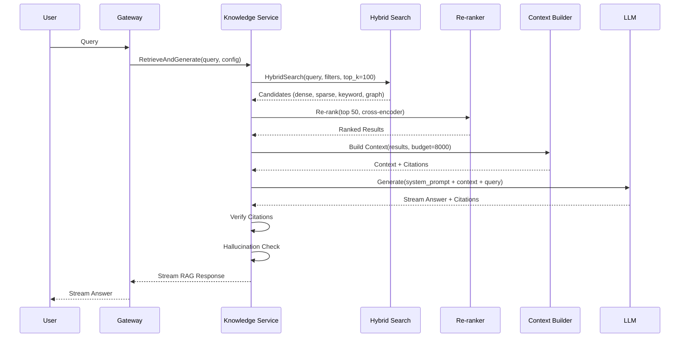

# RFC-0006
# Hermes Knowledge Architecture

**Status:** Draft  
**Author:** Hermes Team  
**Owner:** Chief System Architect  
**Version:** 1.0  
**Priority:** Critical  
**Depends On:** RFC-0001 (Foundation), RFC-0002 v1.1 (Core Architecture), RFC-0003 v1.1 (Event Bus), RFC-0004 v1.1 (Gateway), RFC-0005 v1.1 (Memory Architecture)

---

## 1. Purpose

This RFC defines the **Hermes Knowledge Architecture** — the unified enterprise knowledge system for Hermes Agent OS v2.

Hermes Knowledge is the **single knowledge system** used by every client (Mission Control, Hermes Desktop, Web, Mobile, Telegram, Discord, WhatsApp) and every agent (Planner, Coder, Reviewer, Security, Git, Research, etc.). It provides document ingestion, processing, retrieval, and RAG capabilities across all domains.

**Core Principle:** *One knowledge system. All sources. All clients. All agents. Always fresh.*

---

## 2. Scope

| In Scope | Out of Scope |
|----------|--------------|
| Knowledge ingestion pipeline | Agent reasoning logic (RFC-0002) |
| Document processing & chunking | Event Bus internals (RFC-0003) |
| Embedding & hybrid search | Gateway protocol details (RFC-0004) |
| RAG architecture & retrieval | Memory Architecture (RFC-0005) |
| Knowledge graph integration | Security policy (RFC-0007) |
| Index lifecycle management | Plugin SDK (RFC-0008) |
| Multi-tenant isolation | Automation (RFC-0009) |
| Source attribution & freshness | |

---

## 3. Design Principles

| Principle | Description |
|-----------|-------------|
| **Single Source of Truth** | One knowledge system for all clients, agents, and domains |
| **Ingestion-First** | Optimized for continuous, multi-source document ingestion |
| **Retrieval-Optimized** | Hybrid search (vector + keyword + graph) with sub-100ms latency |
| **Attribution-Native** | Every answer traces back to source documents |
| **Freshness-Guaranteed** | Incremental updates; no full re-index required |
| **Multi-Tenant Isolation** | Hard boundaries at every layer |
| **Event-Sourced** | All mutations via RFC-0003 events |
| **Observability-First** | Full tracing, metrics, audit at every operation |

---

## 4. Knowledge Architecture

```
┌─────────────────────────────────────────────────────────────────────────────┐
│                        HERMES KNOWLEDGE SYSTEM                                │
│                                                                              │
│  ┌──────────────────────────────────────────────────────────────────────┐   │
│  │                    INGESTION LAYER                                    │   │
│  │  ┌─────────────┐ ┌─────────────┐ ┌─────────────┐ ┌─────────────┐    │   │
│  │  │  Connectors │ │  Webhooks   │ │   Scheduled │ │   Manual    │    │   │
│  │  │  (Git, API, │ │  (Push)     │ │   (Cron)    │ │   (Upload)  │    │   │
│  │  │   FS, DB)   │ │             │ │             │ │             │    │   │
│  │  └──────┬──────┘ └──────┬──────┘ └──────┬──────┘ └──────┬──────┘    │   │
│  └─────────│───────────────│───────────────│───────────────│───────────┘   │
│            ▼               ▼               ▼               ▼               │
│  ┌──────────────────────────────────────────────────────────────────────┐   │
│  │                    PROCESSING PIPELINE                                │   │
│  │  ┌──────────┐ ┌──────────┐ ┌──────────┐ ┌──────────┐ ┌──────────┐  │   │
│  │  │  Parse   │ │  Chunk   │ │ Extract  │ │  Embed   │ │  Index   │  │   │
│  │  │  (Tika,  │ │  (Semantic│ │  (Meta,  │ │  (Multi- │ │  (Qdrant │  │   │
│  │  │   Marker)│ │   aware) │ │  Entities)│ │   model) │ │  + Kuzu) │  │   │
│  │  └──────────┘ └──────────┘ └──────────┘ └──────────┘ └──────────┘  │   │
│  └──────────────────────────────────────────────────────────────────────┘   │
│                                    │                                        │
│  ┌──────────────────────────────────────────────────────────────────────┐   │
│  │                    STORAGE LAYER                                      │   │
│  │  ┌─────────────────┐ ┌─────────────────┐ ┌─────────────────┐         │   │
│  │  │  VECTOR STORE   │ │  GRAPH STORE    │ │  METADATA STORE │         │   │
│  │  │  (Qdrant)       │ │  (Kuzu)         │ │  (PostgreSQL)   │         │   │
│  │  │  - Chunks       │ │  - Entities     │ │  - Documents    │         │   │
│  │  │  - Embeddings   │ │  - Relations    │ │  - Versions     │         │   │
│  │  │  - Sparse vecs  │ │  - Provenance   │ │  - ACLs         │         │   │
│  │  └─────────────────┘ └─────────────────┘ └─────────────────┘         │   │
│  └──────────────────────────────────────────────────────────────────────┘   │
│                                    │                                        │
│  ┌──────────────────────────────────────────────────────────────────────┐   │
│  │                    RETRIEVAL & RAG LAYER                              │   │
│  │  ┌──────────────┐ ┌──────────────┐ ┌──────────────┐ ┌────────────┐  │   │
│  │  │ Hybrid Search│ │  Re-Ranking  │ │  Context     │ │  Answer    │  │   │
│  │  │ (Vector+Key+ │ │ (Cross-enc,  │ │  Assembly    │ │  Generation│  │   │
│  │  │  Graph)      │ │  RRF, MMR)   │ │  (Citations) │ │  (Streaming)│  │   │
│  │  └──────────────┘ └──────────────┘ └──────────────┘ └────────────┘  │   │
│  └──────────────────────────────────────────────────────────────────────┘   │
└─────────────────────────────────────────────────────────────────────────────┘
```

### 4.1 Component Overview

| Layer | Components | Technology |
|-------|------------|------------|
| **Ingestion** | Connectors, Webhooks, Scheduler, Upload API | Temporal workflows, NATS |
| **Processing** | Parser, Chunker, Extractor, Embedder, Indexer | Apache Tika, Marker, spaCy, sentence-transformers |
| **Storage** | Vector Store, Graph Store, Metadata Store | Qdrant, Kuzu, PostgreSQL |
| **Retrieval** | Hybrid Search, Re-ranker, Context Builder, Generator | Custom + Cross-encoder, LLM |

---

## 5. Knowledge Ingestion Pipeline

### 5.1 Ingestion Sources

| Source Type | Examples | Trigger | Connector |
|-------------|----------|---------|-----------|
| **Version Control** | GitHub, GitLab, Bitbucket | Push webhook / Scheduled | Git connector |
| **API/ SaaS** | Notion, Confluence, Jira, Slack | Webhook / Polling | REST/GraphQL connector |
| **File Systems** | S3, GCS, Azure Blob, Local FS | Event notification / Scheduled | Object store connector |
| **Databases** | PostgreSQL, MySQL, MongoDB | CDC / Scheduled | DB connector |
| **Email/Chat** | Gmail, Outlook, Teams, Slack | Webhook / Polling | Message connector |
| **Manual Upload** | Drag-drop, CLI, API | User action | Upload API |

### 5.2 Ingestion Workflow

```
Source Event
    │
    ├─▶ Validate Source (auth, reachable, rate limits)
    │
    ├─▶ Create Ingestion Job (Temporal workflow)
    │       │
    │       ├─▶ Fetch Document(s)
    │       │
    │       ├─▶ Parse Document → Structured Content
    │       │
    │       ├─▶ Extract Metadata (author, date, tags, permissions)
    │       │
    │       ├─▶ Chunk Content (semantic-aware)
    │       │
    │       ├─▶ Extract Entities & Relations (per chunk)
    │       │
    │       ├─▶ Generate Embeddings (dense + sparse)
    │       │
    │       ├─▶ Upsert to Vector Store (Qdrant)
    │       │
    │       ├─▶ Upsert to Graph Store (Kuzu)
    │       │
    │       ├─▶ Upsert Metadata (PostgreSQL)
    │       │
    │       └─▶ Emit Completion Event
    │
    ▼
Ingestion Complete → v1.hermes.knowledge.ingestion.completed
```

### 5.3 Ingestion Job Model

```protobuf
message IngestionJob {
  string job_id = 1;                      // UUID v7
  string tenant_id = 2;
  string source_id = 3;                   // Connector identifier
  string source_type = 4;                 // git, api, filesystem, database, upload
  
  // Source config
  SourceConfig source_config = 5;
  
  // Processing config
  ProcessingConfig processing_config = 6;
  
  // Status
  IngestionStatus status = 7;             // PENDING, RUNNING, COMPLETED, FAILED, PARTIAL
  int64 started_at_us = 8;
  int64 completed_at_us = 9;
  int32 documents_processed = 10;
  int32 chunks_created = 11;
  int32 entities_extracted = 12;
  repeated IngestionError errors = 13;
}

message SourceConfig {
  // Git
  string git_repo_url = 1;
  string git_branch = 2;
  repeated string git_paths = 3;
  
  // API
  string api_endpoint = 10;
  map<string, string> api_headers = 11;
  string api_pagination = 12;
  
  // Filesystem
  string fs_root_path = 20;
  repeated string fs_patterns = 21;
  bool fs_recursive = 22;
  
  // Database
  string db_connection_string = 30;
  string db_query = 31;
  string db_incremental_column = 32;
  
  // Common
  map<string, string> custom_config = 100;
}
```

### 5.4 Incremental Ingestion

| Strategy | Implementation |
|----------|----------------|
| **Git** | Track commit SHA; only process changed files since last SHA |
| **API** | Use `updated_at` / cursor pagination; store last cursor |
| **Filesystem** | Track file mtime + content hash; skip unchanged |
| **Database** | Incremental column (timestamp/ID); CDC for real-time |
| **Manual** | Content hash deduplication; version tracking |

---

## 6. Document Processing

### 6.1 Supported Formats

| Category | Formats | Parser |
|----------|---------|--------|
| **Documents** | PDF, DOCX, PPTX, XLSX, ODT, RTF | Apache Tika / Marker |
| **Markup** | MD, HTML, XML, JSON, YAML, CSV | Native parsers |
| **Code** | PY, JS, TS, GO, RS, JAVA, CPP, SQL | Tree-sitter |
| **Data** | Parquet, Avro, ORC, Arrow | Native |
| **Images** | PNG, JPG, WEBP, TIFF | OCR (Tesseract) + VLM |
| **Audio/Video** | MP3, WAV, MP4, MOV | Whisper transcription |

### 6.2 Parsing Pipeline

```
Raw Document
    │
    ├─▶ Format Detection (MIME + extension + magic bytes)
    │
    ├─▶ Parser Selection
    │       │
    │       ├─▶ PDF → Marker (best for complex layouts)
    │       ├─▶ Office → Apache Tika
    │       ├─▶ Code → Tree-sitter (AST-based)
    │       ├─▶ Markup → Native parser
    │       └─▶ Image → OCR + VLM description
    │
    ├─▶ Structured Output
    │       │
    │       ├─▶ Text content (cleaned, normalized)
    │       ├─▶ Document structure (headings, sections, tables)
    │       ├─▶ Images (extracted, OCR'd)
    │       ├─▶ Metadata (author, created, modified, properties)
    │       └─▶ Permissions (if available from source)
    │
    ▼
ParsedDocument → Chunking
```

### 6.3 Parsed Document Model

```protobuf
message ParsedDocument {
  string document_id = 1;                 // UUID v7
  string source_id = 2;
  string tenant_id = 3;
  
  // Content
  string text_content = 4;                // Full extracted text
  repeated DocumentSection sections = 5;  // Hierarchical sections
  repeated ExtractedTable tables = 6;     // Structured tables
  repeated ExtractedImage images = 7;     // Images with OCR
  repeated CodeBlock code_blocks = 8;     // Code with language
  
  // Metadata
  DocumentMetadata metadata = 9;
  map<string, string> custom_properties = 10;
  
  // Permissions
  DocumentACL acl = 11;                   // Who can access
  
  // Processing info
  string parser_used = 12;
  int64 parsed_at_us = 13;
  int32 parsing_duration_ms = 14;
}

message DocumentSection {
  string section_id = 1;
  string heading = 2;
  int32 level = 3;                        // H1=1, H2=2, etc.
  string content = 4;
  int32 start_char = 5;
  int32 end_char = 6;
  repeated DocumentSection subsections = 7;
}
```

---

## 7. Chunking Strategies

### 7.1 Strategy Overview

| Strategy | Best For | Chunk Size | Overlap |
|----------|----------|------------|---------|
| **Semantic** | General docs, articles | 512-1024 tokens | 10-20% |
| **Heading-Based** | Structured docs, manuals | Per section | 0% |
| **Code-Aware** | Source code | Per function/class | 0% |
| **Table-Aware** | Data-heavy docs | Per table + context | 0% |
| **Sliding Window** | Fallback / unstructured | Configurable | 15-25% |
| **Fixed-Size** | Simple fallback | 256-512 tokens | 10% |

### 7.2 Semantic Chunking (Default)

```
Document
    │
    ├─▶ Split by headings (H1, H2, H3)
    │
    ├─▶ For each section:
    │       │
    │       ├─▶ If section < max_tokens: keep as single chunk
    │       │
    │       ├─▶ If section > max_tokens:
    │       │       │
    │       │       ├─▶ Split by paragraphs
    │       │       │
    │       │       ├─▶ Group paragraphs into chunks (target ~512 tokens)
    │       │       │
    │       │       └─▶ Add 10% overlap between chunks
    │       │
    │       └─▶ Preserve heading hierarchy in chunk metadata
    │
    ▼
Chunks with semantic boundaries
```

### 7.3 Code-Aware Chunking

```
Source File
    │
    ├─▶ Parse AST (Tree-sitter)
    │
    ├─▶ Extract Top-Level Constructs:
    │       │
    │       ├─▶ Functions → Individual chunks
    │       ├─▶ Classes → Class + methods as chunk group
    │       ├─▶ Interfaces/Types → Individual chunks
    │       ├─▶ Imports/Constants → Context chunk
    │       └─▶ Comments (docstrings) → Attached to parent
    │
    ├─▶ For Large Functions/Classes:
    │       ├─▶ Split by logical blocks (if > 512 tokens)
    │       └─▶ Preserve context (signature, docstring)
    │
    ▼
Code Chunks with semantic boundaries
```

### 7.4 Chunk Model

```protobuf
message KnowledgeChunk {
  string chunk_id = 1;                    // UUID v7
  string document_id = 2;
  string tenant_id = 3;
  
  // Content
  string text = 4;                        // Chunk text
  int32 token_count = 5;
  
  // Position
  int32 start_char = 6;                   // In original document
  int32 end_char = 7;
  int32 chunk_index = 8;                  // Sequence in document
  
  // Semantic context
  string heading_path = 9;                // "Chapter 1 > Section 2.1"
  string section_id = 10;                 // Parent section
  ChunkType type = 11;                    // TEXT, CODE, TABLE, IMAGE_CAPTION
  
  // Code-specific
  CodeContext code_context = 12;
  
  // Embeddings (set by embedder)
  repeated float dense_embedding = 13;    // 1536-dim
  repeated float sparse_embedding = 14;   // SPLADE / BM25
  string embedding_model = 15;
  
  // Entities (set by extractor)
  repeated ExtractedEntity entities = 16;
  
  // Metadata
  map<string, string> metadata = 17;
  int64 created_at_us = 18;
}

message CodeContext {
  string language = 1;
  string function_name = 2;
  string class_name = 3;
  string file_path = 4;
  int32 start_line = 5;
  int32 end_line = 6;
  repeated string imports = 7;
  string docstring = 8;
}
```

---

## 8. Metadata Extraction

### 8.1 Standard Metadata

| Field | Source | Required |
|-------|--------|----------|
| `document_id` | Generated | Yes |
| `source_id` | Connector | Yes |
| `tenant_id` | Context | Yes |
| `title` | Document / First heading | Yes |
| `author` | Document properties / Git | No |
| `created_at` | Document / Source | Yes |
| `modified_at` | Document / Source | Yes |
| `source_url` | Connector | Yes |
| `content_hash` | SHA-256 of text | Yes |
| `language` | Detection (fastText) | Yes |
| `tags` | Source + Extraction | No |
| `category` | Folder path / Labels | No |
| `permissions` | Source ACL | Yes |

### 8.2 Custom Metadata Extraction

```protobuf
message MetadataExtractionConfig {
  // Standard fields to extract
  repeated string standard_fields = 1;
  
  // Custom extractors (regex, ML, LLM)
  repeated CustomExtractor custom_extractors = 2;
  
  // LLM-based extraction prompt
  string llm_extraction_prompt = 3;
  
  // Schema for structured extraction
  string json_schema = 4;
}

message CustomExtractor {
  string name = 1;
  ExtractorType type = 2;               // REGEX, LLM, ML_MODEL
  string pattern = 3;                   // For REGEX
  string model_name = 4;                // For ML_MODEL
  string prompt_template = 5;           // For LLM
  string output_field = 6;              // Target metadata field
}
```

### 8.3 Extracted Metadata Model

```protobuf
message DocumentMetadata {
  string title = 1;
  string author = 2;
  int64 created_at_us = 3;
  int64 modified_at_us = 4;
  string source_url = 5;
  string content_hash = 6;              // SHA-256
  string language = 7;
  repeated string tags = 8;
  string category = 9;
  DocumentACL acl = 10;
  map<string, string> custom = 11;      // Custom extracted fields
}
```

---

## 9. Embedding Pipeline

### 9.1 Embedding Models

| Model | Dimensions | Type | Use Case | Cost |
|-------|------------|------|----------|------|
| `text-embedding-3-small` | 1536 | Dense | Default general | Low |
| `text-embedding-3-large` | 3072 | Dense | High precision | Medium |
| `jina-embeddings-v3` | 1024 | Dense | Code + multilingual | Low |
| `bge-m3` | 1024 | Dense + Sparse | Hybrid search | Low |
| `voyage-code-2` | 1536 | Dense | Code-specific | Medium |
| `SPLADE` | Vocab size | Sparse | Keyword-style | Low |

### 9.2 Embedding Pipeline

```
Chunks (batched)
    │
    ├─▶ Model Selection (per chunk type)
    │       │
    │       ├─▶ Code → voyage-code-2 / jina-v3
    │       ├─▶ General → text-embedding-3-small
    │       ├─▶ Multilingual → bge-m3
    │       └─▶ Hybrid needed → bge-m3 (dense + sparse)
    │
    ├─▶ Batch Embedding (async, parallel)
    │       │
    │       ├─▶ Dense embeddings (all chunks)
    │       ├─▶ Sparse embeddings (if hybrid)
    │       └─▶ Token counting for billing
    │
    ├─▶ Quality Check
    │       │
    │       ├─▶ Norm validation (||v|| ≈ 1)
    │       ├─▶ Dimension check
    │       └─▶ NaN/Inf detection
    │
    ▼
Embedded Chunks → Indexing
```

### 9.3 Embedding Configuration

```protobuf
message EmbeddingConfig {
  // Model selection per content type
  map<string, string> model_per_type = 1;  // "code" -> "voyage-code-2"
  string default_model = 2;                 // "text-embedding-3-small"
  
  // Batch settings
  int32 batch_size = 3;                     // 32-256
  int32 max_concurrent_batches = 4;         // 4
  
  // Sparse embeddings (for hybrid)
  bool generate_sparse = 5;                 // true
  string sparse_model = 6;                  // "bge-m3" or "splade"
  
  // Quality thresholds
  float min_norm = 7;                       // 0.95
  float max_norm = 8;                       // 1.05
  
  // Caching
  bool cache_embeddings = 9;                // true (Redis, TTL 7d)
}
```

---

## 10. Hybrid Search

### 10.1 Search Architecture

```
Query (text)
    │
    ├─▶ Query Analysis
    │       ├─▶ Intent classification
    │       ├─▶ Entity extraction
    │       ├─▶ Query expansion (synonyms, related terms)
    │       └─▶ Filter extraction (tags, dates, sources)
    │
    ├─▶ Parallel Retrieval
    │       │
    │       ├─▶ Dense Vector Search (Qdrant)
    │       │       └─▶ Top 100 by cosine similarity
    │       │
    │       ├─▶ Sparse Vector Search (Qdrant)
    │       │       └─▶ Top 100 by BM25/SPLADE
    │       │
    │       ├─▶ Keyword Search (PostgreSQL)
    │       │       └─▶ Top 100 by tsvector + trigram
    │       │
    │       └─▶ Graph Expansion (Kuzu)
    │               └─▶ Related entities → Top 50 chunks
    │
    ├─▶ Fusion (RRF)
    │       │
    │       ├─▶ Reciprocal Rank Fusion (k=60)
    │       ├─▶ Score normalization per retriever
    │       └─▶ Deduplication by chunk_id
    │
    ├─▶ Re-Ranking
    │       │
    │       ├─▶ Cross-encoder (top 50)
    │       ├─▶ MMR (Maximal Marginal Relevance) for diversity
    │       └─▶ Boost by: recency, authority, user feedback
    │
    ▼
Final Ranked Results (top K)
```

### 10.2 Search Configuration

```protobuf
message HybridSearchConfig {
  // Retriever weights (for weighted fusion alternative)
  float dense_weight = 1;                 // 0.4
  float sparse_weight = 2;                // 0.3
  float keyword_weight = 3;               // 0.2
  float graph_weight = 4;                 // 0.1
  
  // Retrieval counts
  int32 dense_top_k = 5;                  // 100
  int32 sparse_top_k = 6;                 // 100
  int32 keyword_top_k = 7;                // 100
  int32 graph_top_k = 8;                  // 50
  
  // Fusion
  FusionMethod fusion_method = 9;         // RRF (default), WEIGHTED
  int32 rrf_k = 10;                       // 60
  
  // Re-ranking
  bool enable_rerank = 11;                // true
  string rerank_model = 12;               // "cross-encoder/ms-marco-MiniLM-L-6-v2"
  int32 rerank_top_k = 13;                // 50
  bool enable_mmr = 14;                   // true
  float mmr_lambda = 15;                  // 0.5 (diversity vs relevance)
  
  // Boosting
  BoostConfig boost_config = 16;
}

message BoostConfig {
  float recency_boost = 1;                // Exponential decay, half-life 90 days
  float authority_boost = 2;              // Source credibility score
  float user_feedback_boost = 3;          // Thumbs up/down history
  float exact_match_boost = 4;            // Query terms in heading/title
}
```

### 10.3 Search Filters

| Filter | Implementation |
|--------|----------------|
| **Tenant** | Qdrant payload `tenant_id` + PG RLS |
| **Source** | Qdrant payload `source_id` |
| **Tags** | Qdrant payload `tags` (array contains) |
| **Date Range** | Qdrant payload `created_at` (range) |
| **Document ACL** | Qdrant payload `acl_hash` + runtime check |
| **Content Type** | Qdrant payload `chunk_type` |
| **Language** | Qdrant payload `language` |

---

## 11. Retrieval Pipeline

### 11.1 RAG Pipeline

```
User Query
    │
    ├─▶ Query Understanding
    │       ├─▶ Intent detection
    │       ├─▶ Entity extraction
    │       ├─▶ Decomposition (multi-hop?)
    │       └─▶ Clarification needed?
    │
    ├─▶ Hybrid Search (Section 10)
    │       │
    │       └─▶ Top K chunks with scores
    │
    ├─▶ Context Assembly
    │       │
    │       ├─▶ Token budget allocation
    │       ├─▶ Citation insertion [doc_id:chunk_id]
    │       ├─▶ Source attribution metadata
    │       ├─▶ Conflict detection (contradicting sources)
    │       └─▶ Redundancy removal
    │
    ├─▶ Answer Generation
    │       │
    │       ├─▶ System prompt + context + query
    │       ├─▶ Streaming response
    │       ├─▶ Citation enforcement
    │       └─▶ Confidence scoring
    │
    ├─▶ Post-Processing
    │       │
    │       ├─▶ Citation verification
    │       ├─▶ Hallucination check (self-consistency)
    │       └─▶ Source linking
    │
    ▼
RAG Response (streaming)
```

### 11.2 RAG Configuration

```protobuf
message RAGConfig {
  // Search
  HybridSearchConfig search_config = 1;
  
  // Context
  int32 max_context_tokens = 2;           // 8000
  int32 max_chunks = 3;                   // 20
  float min_relevance_score = 4;          // 0.3
  bool require_citations = 5;             // true
  
  // Generation
  string generation_model = 6;            // "gpt-4o", "claude-3.5-sonnet"
  float temperature = 7;                  // 0.1
  int32 max_output_tokens = 8;            // 4000
  bool stream = 9;                        // true
  
  // Quality
  bool enable_hallucination_check = 10;   // true
  bool enable_self_consistency = 11;      // true (3 samples)
  float confidence_threshold = 12;        // 0.7
  
  // Citations
  CitationStyle citation_style = 13;      // INLINE, FOOTNOTE, BRACKET
  bool include_source_links = 14;         // true
}
```

### 11.3 Retrieval Response

```protobuf
message RetrievalResponse {
  string query_id = 1;
  string query = 2;
  
  // Results
  repeated RetrievalResult results = 3;
  
  // RAG Answer (if requested)
  RAGAnswer answer = 4;
  
  // Metadata
  RetrievalMetadata metadata = 5;
}

message RetrievalResult {
  string chunk_id = 1;
  string document_id = 2;
  string text = 3;
  float score = 4;                        // Final fused score
  map<string, float> retriever_scores = 5; // Per-retriever breakdown
  DocumentMetadata document_metadata = 6;
  repeated Citation citations = 7;
}

message RAGAnswer {
  string answer_id = 1;
  string text = 2;                        // Full answer
  repeated Citation citations = 3;
  float confidence = 4;                   // 0-1
  bool is_complete = 5;                   // False if truncated
  GenerationMetadata gen_metadata = 6;
}

message Citation {
  string citation_id = 1;
  string chunk_id = 2;
  string document_id = 3;
  string document_title = 4;
  int32 start_char = 5;
  int32 end_char = 6;
  string url = 7;                         // Source URL if available
}
```

---

## 12. Knowledge Graph Integration

### 12.1 Graph Schema (Kuzu)

```cypher
// Node Types
(:Document {id, title, source_id, source_type, content_hash, tenant_id, created_at, modified_at})
(:Chunk {id, document_id, chunk_index, text, token_count, embedding_model, chunk_type, heading_path})
(:Entity {id, name, type, description, tenant_id, confidence, source_chunks})
(:Concept {id, name, definition, tenant_id, related_chunks})
(:Source {id, name, type, url, credibility_score, tenant_id})

// Relationship Types
(:Document)-[:HAS_CHUNK {chunk_index}]->(:Chunk)
(:Chunk)-[:MENTIONS {confidence, char_start, char_end}]->(:Entity)
(:Chunk)-[:RELATES_TO {weight}]->(:Concept)
(:Entity)-[:RELATED_TO {relation_type, weight}]->(:Entity)
(:Concept)-[:SUBCONCEPT_OF]->(:Concept)
(:Document)-[:FROM_SOURCE]->(:Source)
(:Entity)-[:EXTRACTED_FROM]->(:Chunk)
```

### 12.2 Entity Extraction

```
Chunks (batched)
    │
    ├─▶ NER Model (spaCy / GLiNER / LLM)
    │       │
    │       ├─▶ Standard types: PERSON, ORG, GPE, DATE, MONEY, PRODUCT
    │       ├─▶ Code types: FUNCTION, CLASS, VARIABLE, LIBRARY, FRAMEWORK
    │       ├─▶ Domain types: CONFIG, ERROR, API_ENDPOINT, DATABASE_TABLE
    │       └─▶ Custom types (per tenant)
    │
    ├─▶ Entity Linking
    │       │
    │       ├─▶ Fuzzy match to existing entities (name + type)
    │       ├─▶ Create new or merge
    │       └─▶ Confidence scoring
    │
    ├─▶ Relation Extraction
    │       │
    │       ├─▶ Dependency parsing (code)
    │       ├─▶ LLM-based relation extraction (text)
    │       └─▶ Pattern-based (tables, lists)
    │
    ▼
Entities + Relations → Graph Store
```

### 12.3 Graph Operations for Retrieval

| Operation | Cypher | Use Case |
|-----------|--------|----------|
| **Entity Neighborhood** | `MATCH (e:Entity)-[:RELATED_TO*1..2]-(related) WHERE e.id=$id RETURN related` | Expand query entities |
| **Concept Expansion** | `MATCH (c:Concept)-[:SUBCONCEPT_OF*0..3]->(sub) WHERE c.name IN $terms RETURN sub` | Query expansion |
| **Document-Entity Link** | `MATCH (d:Document)-[:HAS_CHUNK]->(:Chunk)-[:MENTIONS]->(e:Entity) WHERE d.id=$doc_id RETURN e` | Document profiling |
| **Cross-Document Entities** | `MATCH (e:Entity)<-[:MENTIONS]-(:Chunk)<-[:HAS_CHUNK]-(d:Document) WHERE e.name=$name RETURN d` | Find related docs |

---

## 13. Source Attribution

### 13.1 Attribution Model

Every knowledge chunk maintains full provenance:

```protobuf
message SourceAttribution {
  string chunk_id = 1;
  string document_id = 2;
  string source_id = 3;
  string source_type = 4;               // git, api, filesystem, etc.
  string source_url = 5;                // Original location
  int64 ingested_at_us = 6;
  int64 source_modified_at_us = 7;      // Source's last modified
  string content_hash = 8;              // SHA-256 for verification
  int32 version = 9;                    // Document version
  CredibilityScore credibility = 10;    // Source reliability
}
```

### 13.2 Citation in Responses

```
Answer: "The API rate limit is 100 requests per minute [1][2]."

Sources:
[1] API Documentation v2.3, Section 4.2 (github.com/org/repo/docs/api.md:145-152)
[2] Engineering Blog "Rate Limiting Updates" (2024-01-15)
```

### 13.3 Attribution Verification

| Check | Implementation |
|-------|----------------|
| **Source Exists** | Verify document_id in metadata store |
| **Content Unchanged** | Compare content_hash at retrieval time |
| **Access Authorized** | Check DocumentACL against user |
| **Version Current** | Warn if source_modified_at > ingested_at |

---

## 14. Knowledge Freshness

### 14.1 Freshness Strategies

| Strategy | Trigger | Latency | Scope |
|----------|---------|---------|-------|
| **Real-time (CDC)** | Database changes | < 1s | Structured data |
| **Webhook Push** | Source events | < 5s | Git, SaaS APIs |
| **Scheduled Polling** | Cron (configurable) | Minutes-hours | APIs, filesystems |
| **Manual Refresh** | User/API request | On-demand | Any |
| **Full Re-index** | Schema change / corruption | Hours | Complete rebuild |

### 14.2 Incremental Update Process

```
Source Change Detected
    │
    ├─▶ Identify Affected Documents (by path, query, CDC)
    │
    ├─▶ For Each Document:
    │       │
    │       ├─▶ Re-parse
    │       │
    │       ├─▶ Compute Content Hash
    │       │
    │       ├─▶ If Hash Changed:
    │       │       │
    │       │       ├─▶ Delete Old Chunks (vector + graph + metadata)
    │       │       │
    │       │       ├─▶ Re-chunk
    │       │       │
    │       │       ├─▶ Re-embed
    │       │       │
    │       │       ├─▶ Re-extract Entities
    │       │       │
    │       │       └─▶ Upsert New
    │       │
    │       └─▶ If Hash Unchanged: Skip
    │
    ├─▶ Update Source Timestamp
    │
    ▼
Freshness Event → v1.hermes.knowledge.document.updated
```

### 14.3 Freshness Metrics

| Metric | Target |
|--------|--------|
| **Git Push → Indexed** | < 30 seconds |
| **Webhook → Indexed** | < 10 seconds |
| **Scheduled Poll → Indexed** | < 5 minutes (configurable) |
| **Staleness Alert** | > 24h overdue |

---

## 15. Index Lifecycle

### 15.1 Index Operations

| Operation | Trigger | Duration | Impact |
|-----------|---------|----------|--------|
| **Incremental Upsert** | Document change | < 1s/doc | Zero downtime |
| **Bulk Re-index** | Model upgrade, schema change | Hours | Read-only during cutover |
| **Index Optimization** | Scheduled (weekly) | Minutes | Background |
| **Snapshot/Backup** | Daily | Minutes | Zero downtime |
| **Schema Migration** | Version upgrade | Hours | Blue-green |

### 15.2 Vector Index Management (Qdrant)

```yaml
# Collection lifecycle
collections:
  knowledge_chunks:
    # Sharding
    shard_number: 8
    replication_factor: 2
    
    # Optimization
    optimizers_config:
      deleted_threshold: 0.2
      vacuum_min_vector_number: 1000
      default_segment_number: 4
      max_segment_size: 20000
      memmap_threshold: 50000
    
    # Quantization (cost/performance)
    quantization:
      scalar:
        type: int8
        always_ram: true
      # binary:
      #   always_ram: false  # For massive scale
    
    # HNSW
    hnsw_config:
      m: 32
      ef_construct: 256
      full_scan_threshold: 10000
      on_disk: false  # Keep in RAM for latency
```

### 15.3 Graph Index Management (Kuzu)

- **Checkpoint**: Automatic every 1000 transactions
- **Backup**: Daily full + incremental WAL
- **Compaction**: Weekly (reclaim deleted space)
- **Statistics**: Auto-update for query planner

### 15.4 Embedding Model Migration

```
Model Upgrade (e.g., small → large)
    │
    ├─▶ Dual-Write Phase (7 days)
    │       ├─▶ Write to both old + new collections
    │       └─▶ Shadow search validation (compare results)
    │
    ├─▶ Canary Cutover (1 day)
    │       ├─▶ 10% traffic to new collection
    │       └─▶ Monitor latency, relevance, errors
    │
    ├─▶ Full Cutover
    │       ├─▶ Switch all reads to new
    │       └─▶ Keep old for 30 days rollback
    │
    └─▶ Cleanup
            └─▶ Delete old collection
```

---

## 16. Knowledge APIs (gRPC)

```protobuf
service KnowledgeService {
  // Ingestion
  rpc CreateIngestionJob(CreateIngestionJobRequest) returns (IngestionJob);
  rpc GetIngestionJob(GetIngestionJobRequest) returns (IngestionJob);
  rpc ListIngestionJobs(ListIngestionJobsRequest) returns (ListIngestionJobsResponse);
  rpc CancelIngestionJob(CancelIngestionJobRequest) returns (CancelIngestionJobResponse);
  rpc TriggerIncrementalSync(TriggerIncrementalSyncRequest) returns (TriggerIncrementalSyncResponse);
  
  // Documents
  rpc GetDocument(GetDocumentRequest) returns (Document);
  rpc ListDocuments(ListDocumentsRequest) returns (ListDocumentsResponse);
  rpc DeleteDocument(DeleteDocumentRequest) returns (DeleteDocumentResponse);
  rpc GetDocumentChunks(GetDocumentChunksRequest) returns (GetDocumentChunksResponse);
  
  // Search
  rpc HybridSearch(HybridSearchRequest) returns (HybridSearchResponse);
  rpc SemanticSearch(SemanticSearchRequest) returns (SemanticSearchResponse);
  rpc KeywordSearch(KeywordSearchRequest) returns (KeywordSearchResponse);
  rpc GraphSearch(GraphSearchRequest) returns (GraphSearchResponse);
  
  // RAG
  rpc RetrieveAndGenerate(RetrieveAndGenerateRequest) returns (RetrieveAndGenerateResponse);
  rpc RetrieveAndGenerateStream(RetrieveAndGenerateRequest) returns (stream RetrieveAndGenerateResponse);
  
  // Sources
  rpc CreateSource(CreateSourceRequest) returns (Source);
  rpc GetSource(GetSourceRequest) returns (Source);
  rpc ListSources(ListSourcesRequest) returns (ListSourcesResponse);
  rpc UpdateSource(UpdateSourceRequest) returns (Source);
  rpc DeleteSource(DeleteSourceRequest) returns (DeleteSourceResponse);
  rpc TestSourceConnection(TestSourceConnectionRequest) returns (TestSourceConnectionResponse);
  
  // Entities & Graph
  rpc GetEntity(GetEntityRequest) returns (Entity);
  rpc SearchEntities(SearchEntitiesRequest) returns (SearchEntitiesResponse);
  rpc GetEntityNeighborhood(GetEntityNeighborhoodRequest) returns (GetEntityNeighborhoodResponse);
  rpc GetRelatedDocuments(GetRelatedDocumentsRequest) returns (GetRelatedDocumentsResponse);
  
  // Admin
  rpc GetIndexStats(GetIndexStatsRequest) returns (IndexStats);
  rpc TriggerReindex(TriggerReindexRequest) returns (TriggerReindexResponse);
  rpc GetIndexHealth(GetIndexHealthRequest) returns (IndexHealth);
}
```

### 16.1 Key Request/Response Types

```protobuf
// RAG Request
message RetrieveAndGenerateRequest {
  string query = 1;
  string tenant_id = 2;
  string conversation_id = 3;             // For context
  RAGConfig config = 4;                   // Override defaults
  SearchFilters filters = 5;
  bool stream = 6;
}

// Hybrid Search Request
message HybridSearchRequest {
  string query = 1;
  string tenant_id = 2;
  HybridSearchConfig config = 3;
  SearchFilters filters = 4;
  int32 top_k = 5;
  bool include_metadata = 6;
  bool include_vectors = 7;
}

// Search Filters
message SearchFilters {
  repeated string source_ids = 1;
  repeated string tags = 2;
  repeated string chunk_types = 3;        // TEXT, CODE, TABLE, IMAGE_CAPTION
  DateRange date_range = 4;
  string language = 5;
  DocumentACL acl = 6;                    // User's permissions
  map<string, string> custom = 7;
}
```

---

## 17. Event Integration (RFC-0003)

### 17.1 Published Events

| Event | Topic | Payload |
|-------|-------|---------|
| `v1.hermes.knowledge.ingestion.started` | `hermes.knowledge.ingestion.started` | IngestionJob |
| `v1.hermes.knowledge.ingestion.completed` | `hermes.knowledge.ingestion.completed` | IngestionJob + stats |
| `v1.hermes.knowledge.ingestion.failed` | `hermes.knowledge.ingestion.failed` | IngestionJob + errors |
| `v1.hermes.knowledge.document.created` | `hermes.knowledge.document.created` | Document |
| `v1.hermes.knowledge.document.updated` | `hermes.knowledge.document.updated` | Document + changes |
| `v1.hermes.knowledge.document.deleted` | `hermes.knowledge.document.deleted` | Document ID |
| `v1.hermes.knowledge.entity.created` | `hermes.knowledge.entity.created` | Entity |
| `v1.hermes.knowledge.entity.updated` | `hermes.knowledge.entity.updated` | Entity |
| `v1.hermes.knowledge.index.reindex_started` | `hermes.knowledge.index.reindex_started` | ReindexJob |
| `v1.hermes.knowledge.index.reindex_completed` | `hermes.knowledge.index.reindex_completed` | ReindexJob + stats |

### 17.2 Consumed Events

| Event | Source | Handler |
|-------|--------|---------|
| `v1.hermes.config.updated` | Config Manager | Refresh embedding models, search config |
| `v1.hermes.memory.consolidation.completed` | Memory (RFC-0005) | Promote consolidated knowledge |
| `v1.hermes.security.permissions.changed` | Security (RFC-0007) | Invalidate ACL caches |
| `v1.hermes.tenant.updated` | Config | Update tenant quotas, isolation |

---

## 18. Security & Access Control

### 18.1 Document-Level ACL

```protobuf
message DocumentACL {
  // Owner
  string owner_id = 1;
  
  // Explicit permissions
  repeated ACLEntry entries = 2;
  
  // Inherited from source
  bool inherit_from_source = 3;
  string source_acl_ref = 4;
  
  // Public access
  bool public_read = 5;
}

message ACLEntry {
  PrincipalType principal_type = 1;       // USER, GROUP, ROLE
  string principal_id = 2;
  PermissionLevel permission = 3;         // NONE, READ, WRITE, ADMIN
  bool inherited = 4;
}
```

### 18.2 Enforcement Points

| Layer | Enforcement |
|-------|-------------|
| **API Gateway** | Validate tenant, authenticate user |
| **Knowledge Service** | Check DocumentACL on every read |
| **Vector Store (Qdrant)** | Payload filter `acl_hash` + runtime verification |
| **Graph Store (Kuzu)** | Query-time filtering by tenant_id |
| **Metadata Store (PG)** | Row-Level Security policies |

### 18.3 Data Protection

| Layer | Protection |
|-------|------------|
| **At Rest** | AES-256 (PG TDE, Qdrant volume encryption, Kuzu encryption) |
| **In Transit** | TLS 1.3, mTLS (SPIFFE) |
| **Field-Level** | PII fields encrypted via Vault Transit |
| **Embeddings** | PII redacted before embedding |

---

## 19. Multi-Tenant Isolation

### 19.1 Physical Isolation

| Layer | Mechanism |
|-------|-----------|
| **Network** | Separate VPC per tenant (enterprise) |
| **Vector (Qdrant)** | Separate collections per tenant |
| **Graph (Kuzu)** | Separate database files per tenant |
| **Metadata (PG)** | Shared DB, separate schemas + RLS |
| **Cache (Redis)** | Separate DB index per tenant |
| **Object Store** | Separate bucket prefixes per tenant |

### 19.2 Logical Isolation

| Mechanism | Implementation |
|-----------|----------------|
| **Row-Level Security** | PostgreSQL RLS on all tables |
| **Vector Filter** | Qdrant payload: `tenant_id = $tenant` (enforced) |
| **Graph Isolation** | Separate Kuzu DB file per tenant |
| **Cache Keys** | Prefixed: `tenant:{id}:...` |
| **API Enforcement** | Gateway middleware validates tenant context |

### 19.3 Quotas (Per Tenant)

| Resource | Default | Configurable |
|----------|---------|--------------|
| **Documents** | 1M | Yes |
| **Chunks** | 50M | Yes |
| **Vectors** | 50M | Yes |
| **Entities** | 5M | Yes |
| **Storage** | 5 TB | Yes |
| **Ingestion Rate** | 10K docs/hour | Yes |
| **Search QPS** | 1000 | Yes |

---

## 20. Performance Targets

| Metric | Target (P99) | Measurement |
|--------|--------------|-------------|
| **Ingestion (single doc)** | < 5s | End-to-end (parse → index) |
| **Bulk Ingestion** | > 1000 docs/min | Sustained |
| **Hybrid Search** | < 100ms | Top 20, filtered |
| **Semantic Search** | < 50ms | Qdrant HNSW |
| **Keyword Search** | < 30ms | PG tsvector |
| **Graph Expansion** | < 30ms | Kuzu 2-hop |
| **RAG Retrieval** | < 200ms | Search + re-rank |
| **RAG First Token** | < 500ms | Streaming |
| **RAG Complete** | < 5s | Full answer |
| **Incremental Sync** | < 30s | Git push → indexed |
| **Availability** | 99.99% | Annual |
| **Durability** | 99.999999999% | 7-year retention |

---

## 21. Architecture Diagrams

### 21.1 Knowledge System Topology (Mermaid)



### 21.2 Ingestion Pipeline (Mermaid)



### 21.3 RAG Pipeline (Mermaid)



---

## 22. Acceptance Criteria

This RFC is complete when:

### 22.1 Architecture Completeness
- [ ] Knowledge ingestion pipeline defined for all source types
- [ ] Document processing with format-specific parsers specified
- [ ] Chunking strategies (semantic, code-aware, table-aware) defined
- [ ] Metadata extraction (standard + custom) specified
- [ ] Embedding pipeline with multi-model support defined
- [ ] Hybrid search (vector + sparse + keyword + graph) with fusion specified
- [ ] RAG pipeline with retrieval, context assembly, generation specified
- [ ] Knowledge graph schema, entity extraction, graph operations defined
- [ ] Source attribution and citation model specified
- [ ] Freshness strategies (real-time, webhook, scheduled, manual) defined
- [ ] Index lifecycle (incremental, bulk, migration, backup) specified

### 22.2 Technical Specifications
- [ ] gRPC service definitions for all knowledge operations
- [ ] Protobuf schemas for documents, chunks, entities, sources
- [ ] Event integration with RFC-0003 (published/consumed topics)
- [ ] Vector store config (Qdrant HNSW, quantization, sharding)
- [ ] Graph store schema (Kuzu) and query patterns
- [ ] Embedding model selection per content type

### 22.3 Consistency & Reliability
- [ ] Incremental update guarantees (exactly-once)
- [ ] Content hash verification for freshness
- [ ] Ingestion job idempotency and retry
- [ ] Model migration strategy (dual-write, canary, rollback)

### 22.4 Security & Multi-Tenancy
- [ ] Document-level ACL model with inheritance
- [ ] Enforcement at Gateway, Service, Vector, Graph, Metadata layers
- [ ] PII redaction before embedding
- [ ] Multi-tenant physical + logical isolation
- [ ] Per-tenant quotas and enforcement

### 22.5 Observability & Operations
- [ ] Prometheus metrics per operation (ingest, search, RAG)
- [ ] OpenTelemetry traces with span linking
- [ ] Ingestion pipeline monitoring (lag, throughput, errors)
- [ ] Freshness metrics and alerting
- [ ] Capacity planning formulas
- [ ] DR/RTO/RPO targets

### 22.6 Cross-RFC Alignment
- [ ] Aligns with RFC-0002 v1.1 (KnowledgeEngine interface)
- [ ] Aligns with RFC-0003 v1.1 (Event topics, envelope, ordering)
- [ ] Aligns with RFC-0004 v1.1 (Gateway RAG integration)
- [ ] Aligns with RFC-0005 v1.1 (Semantic Memory consolidation source)

### 22.7 Review Gates
- [ ] Chief System Architect sign-off
- [ ] Security Architect review (ACL, PII, encryption)
- [ ] Platform Engineer review (capacity, scaling, DR)
- [ ] Data Architect review (schema, partitioning, consistency)
- [ ] Agent Framework Lead review (RAG API, citation enforcement)

---

## 23. References

- RFC-0001: Hermes Agent OS v2 — Foundation Architecture
- RFC-0002: Hermes Core Architecture v1.1
- RFC-0003: Hermes Event Bus & Messaging Architecture v1.1
- RFC-0004: Hermes Gateway & Communication Architecture v1.1
- RFC-0005: Hermes Memory Architecture v1.1
- RFC-0007: Security & Tenancy Model (planned)
- RFC-0008: Plugin/Tool SDK & WASM Sandbox (planned)
- Apache Tika Documentation
- Marker PDF Parser Documentation
- Tree-sitter Documentation
- Qdrant Documentation
- Kuzu Graph Database Documentation
- sentence-transformers Documentation
- SPLADE Documentation
- W3C Trace Context Specification

---

## 24. Glossary

| Term | Definition |
|------|------------|
| **Ingestion** | Process of bringing external documents into knowledge system |
| **Chunking** | Splitting documents into retrievable units |
| **Embedding** | Vector representation of text for semantic search |
| **Hybrid Search** | Combining dense, sparse, keyword, and graph retrieval |
| **RAG** | Retrieval-Augmented Generation |
| **Re-ranking** | Improving initial retrieval results with cross-encoder |
| **MMR** | Maximal Marginal Relevance (diversity-aware ranking) |
| **Entity Extraction** | Identifying named entities in text |
| **Relation Extraction** | Identifying relationships between entities |
| **Source Attribution** | Linking answers back to source documents |
| **Freshness** | How up-to-date knowledge is relative to source |
| **Incremental Sync** | Updating only changed documents |
| **CDC** | Change Data Capture (database) |
| **Dual-Write** | Writing to old and new systems during migration |
| **Canary** | Gradual traffic shift for safe deployment |

---

**End of RFC-0006**

*This document is the canonical Knowledge Architecture specification for Hermes Agent OS. No implementation shall begin until this RFC is reviewed and approved.*