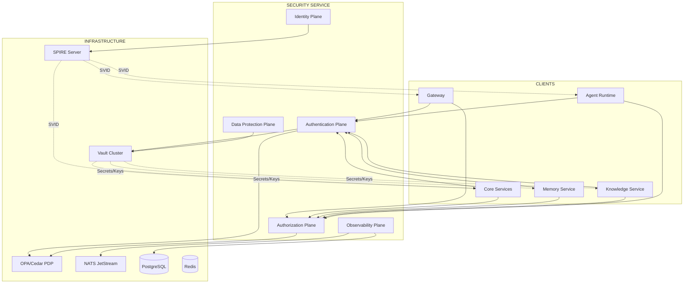
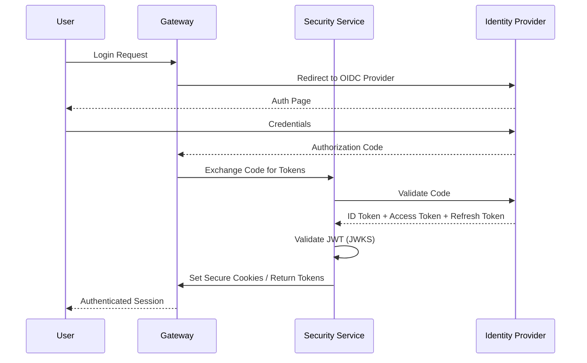
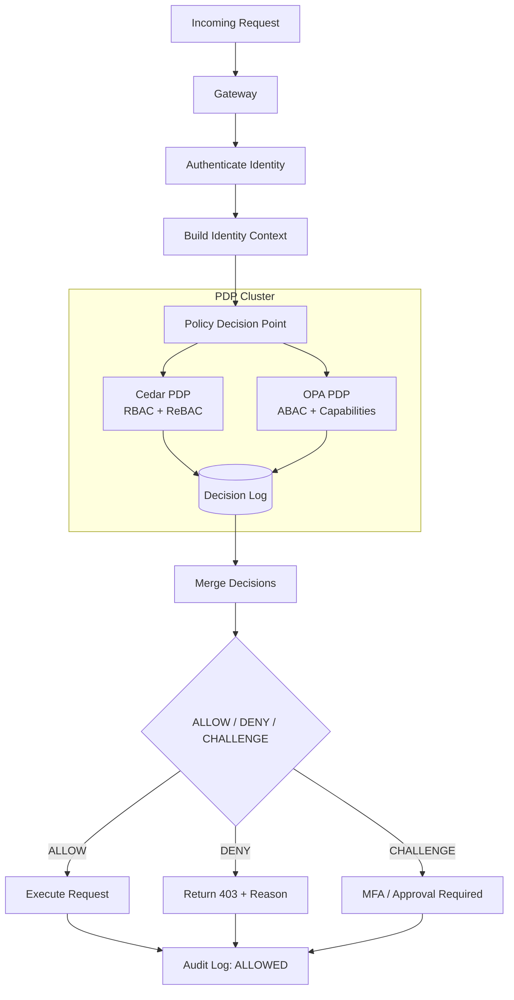
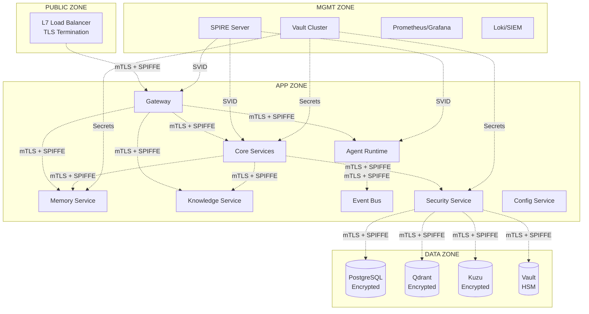

### 22.3 Subject-Level Authorization

```rego
# OPA policy for NATS subject permissions
package hermes.nats

allow_publish(account, subject) {
  # Tenant-scoped subjects
  startswith(subject, "hermes." + account.tenant_id + ".")
}

allow_subscribe(account, subject) {
  startswith(subject, "hermes." + account.tenant_id + ".")
}

# System streams require admin
allow_publish(account, subject) {
  startswith(subject, "hermes.system.")
  account.has_role("SystemAdmin")
}

allow_subscribe(account, subject) {
  startswith(subject, "hermes.system.")
  account.has_role("SystemAdmin")
}

# Audit streams: write-only for services, read for auditors
allow_publish(account, subject) {
  startswith(subject, "hermes.audit.")
  account.type == "SERVICE"
}

allow_subscribe(account, subject) {
  startswith(subject, "hermes.audit.")
  account.has_role("Auditor")
}
```

---

## 23. Memory & Knowledge Security

### 23.1 Memory Service Security (RFC-0005 Integration)

| Layer | Protection |
|-------|------------|
| **Working Memory** | Redis AUTH + TLS; session-scoped keys; TTL enforcement |
| **Episodic Memory** | PostgreSQL RLS on `tenant_id`; field-level encryption for PII |
| **Semantic Memory** | Qdrant payload filter `tenant_id`; Kuzu separate DB per tenant |
| **Procedural Memory** | PostgreSQL RLS; skill execution via capability tokens |

**Memory Access Control:**
```rego
# Memory access policy
package hermes.memory

allow_read(identity, memory_tier, resource) {
  identity.tenant_id == resource.tenant_id
  memory_tier_access(identity, memory_tier)
}

memory_tier_access(identity, "working") {
  identity.session_id == resource.session_id
}

memory_tier_access(identity, "episodic") {
  identity.tenant_id == resource.tenant_id
  identity.has_role("User")
}

memory_tier_access(identity, "semantic") {
  identity.tenant_id == resource.tenant_id
  identity.attributes.clearance >= resource.classification
}

memory_tier_access(identity, "procedural") {
  identity.tenant_id == resource.tenant_id
  capability_granted(identity, resource.required_capability)
}
```

### 23.2 Knowledge Service Security (RFC-0006 Integration)

| Layer | Protection |
|-------|------------|
| **Ingestion** | Presidio PII scan → encrypt/redact → Vault Transit |
| **Vector Store** | Qdrant payload filter `tenant_id`; collection per tenant |
| **Graph Store** | Kuzu separate DB file per tenant |
| **Search** | ACL filter on every query; credibility scoring |
| **RAG** | Citation verification; hallucination check; evidence grounding |

**Knowledge Access Control:**
```rego
# Knowledge access policy
package hermes.knowledge

allow_search(identity, query) {
  identity.tenant_id == query.tenant_id
  # Filter by source ACL
  filter_sources_by_acl(query.sources, identity)
}

allow_rag(identity, request) {
  allow_search(identity, request.query)
  # Verify citations point to accessible sources
  verify_citations(request.citations, identity)
}

# Credibility-based filtering
credibility_filter(results, identity) {
  threshold := get_credibility_threshold(identity)
  [r | r in results; r.credibility_score >= threshold]
}
```

---

## 24. Security gRPC APIs

```protobuf
service SecurityService {
  // Identity Management
  rpc CreateIdentity(CreateIdentityRequest) returns (Identity);
  rpc GetIdentity(GetIdentityRequest) returns (Identity);
  rpc UpdateIdentity(UpdateIdentityRequest) returns (Identity);
  rpc DeleteIdentity(DeleteIdentityRequest) returns (DeleteIdentityResponse);
  rpc ListIdentities(ListIdentitiesRequest) returns (ListIdentitiesResponse);
  
  // Authentication
  rpc IssueToken(IssueTokenRequest) returns (IssueTokenResponse);
  rpc ValidateToken(ValidateTokenRequest) returns (ValidateTokenResponse);
  rpc RevokeToken(RevokeTokenRequest) returns (RevokeTokenResponse);
  rpc RefreshToken(RefreshTokenRequest) returns (RefreshTokenResponse);
  rpc IssueCapabilityToken(IssueCapabilityTokenRequest) returns (CapabilityToken);
  rpc ValidateCapabilityToken(ValidateCapabilityTokenRequest) returns (ValidateCapabilityTokenResponse);
  
  // Service Identity (SPIFFE)
  rpc IssueSVID(IssueSVIDRequest) returns (IssueSVIDResponse);
  rpc RotateSVID(RotateSVIDRequest) returns (RotateSVIDResponse);
  rpc GetBundle(GetBundleRequest) returns (Bundle);
  
  // Authorization
  rpc Authorize(AuthorizeRequest) returns (AuthorizeResponse);
  rpc CheckPermission(CheckPermissionRequest) returns (CheckPermissionResponse);
  rpc GetPermissions(GetPermissionsRequest) returns (GetPermissionsResponse);
  
  // Policy Management
  rpc CreatePolicy(CreatePolicyRequest) returns (Policy);
  rpc UpdatePolicy(UpdatePolicyRequest) returns (Policy);
  rpc DeletePolicy(DeletePolicyRequest) returns (DeletePolicyResponse);
  rpc ListPolicies(ListPoliciesRequest) returns (ListPoliciesResponse);
  rpc TestPolicy(TestPolicyRequest) returns (TestPolicyResponse);
  
  // Secrets
  rpc CreateSecret(CreateSecretRequest) returns (Secret);
  rpc GetSecret(GetSecretRequest) returns (Secret);
  rpc UpdateSecret(UpdateSecretRequest) returns (Secret);
  rpc DeleteSecret(DeleteSecretRequest) returns (DeleteSecretResponse);
  rpc ListSecrets(ListSecretsRequest) returns (ListSecretsResponse);
  rpc RotateSecret(RotateSecretRequest) returns (RotateSecretResponse);
  
  // Encryption
  rpc EncryptField(EncryptFieldRequest) returns (EncryptFieldResponse);
  rpc DecryptField(DecryptFieldRequest) returns (DecryptFieldResponse);
  rpc RewrapKey(RewrapKeyRequest) returns (RewrapKeyResponse);
  
  // PII
  rpc ScanPII(ScanPIIRequest) returns (ScanPIIResponse);
  rpc RedactPII(RedactPIIRequest) returns (RedactPIIResponse);
  
  // Audit
  rpc QueryAudit(QueryAuditRequest) returns (QueryAuditResponse);
  rpc ExportAudit(ExportAuditRequest) returns (ExportAuditResponse);
  
  // Session
  rpc CreateSession(CreateSessionRequest) returns (Session);
  rpc GetSession(GetSessionRequest) returns (Session);
  rpc RevokeSession(RevokeSessionRequest) returns (RevokeSessionResponse);
  rpc ListSessions(ListSessionsRequest) returns (ListSessionsResponse);
  
  // Compliance
  rpc GenerateComplianceReport(GenerateComplianceReportRequest) returns (ComplianceReport);
  rpc GetComplianceStatus(GetComplianceStatusRequest) returns (ComplianceStatus);
  
  // Admin
  rpc GetSecurityStats(GetSecurityStatsRequest) returns (SecurityStats);
  rpc HealthCheck(HealthCheckRequest) returns (HealthCheckResponse);
}
```

### 24.1 Key Request/Response Types

```protobuf
// Authorization
message AuthorizeRequest {
  string identity_id = 1;
  string action = 2;
  string resource_type = 3;
  string resource_id = 4;
  map<string, string> context = 5;
}

message AuthorizeResponse {
  AuthorizationDecision decision = 1;  // ALLOW, DENY, CHALLENGE
  repeated Obligation obligations = 2;
  string denial_reason = 3;
  string policy_version = 4;
}

// Capability Token
message IssueCapabilityTokenRequest {
  string agent_id = 1;
  repeated Capability capabilities = 2;
  int32 ttl_seconds = 3;
  repeated string audience = 4;
}

message CapabilityToken {
  string token = 1;           // PASETO v4
  int64 expires_at_us = 2;
  repeated string audience = 3;
}

// Policy
message Policy {
  string policy_id = 1;
  string name = 2;
  string engine = 3;          // CEDAR, OPA
  string version = 4;
  string content = 5;         // Cedar/Rego source
  map<string, string> metadata = 6;
  int64 created_at_us = 7;
  int64 updated_at_us = 8;
}

// Secret
message Secret {
  string secret_id = 1;
  string name = 2;
  string type = 3;            // DB_CRED, API_KEY, TLS_CERT, etc.
  string vault_path = 4;
  int64 created_at_us = 5;
  int64 expires_at_us = 6;
  int64 rotation_interval_days = 7;
  map<string, string> metadata = 8;
}

// PII
message ScanPIIRequest {
  string text = 1;
  repeated string entity_types = 2;  // Optional filter
  float confidence_threshold = 3;    // Default: 0.8
}

message ScanPIIResponse {
  repeated PIIEntity entities = 1;
}

message PIIEntity {
  string type = 1;           // SSN, EMAIL, PHONE, PERSON, etc.
  int32 start = 2;
  int32 end = 3;
  float confidence = 4;
  string text = 5;           // Original text (if permitted)
}
```

---

## 25. Incident Response

### 25.1 Incident Classification

| Severity | Criteria | Response Time | Escalation |
|----------|----------|---------------|------------|
| **SEV-1 (Critical)** | Active breach, data exfiltration, root compromise | 15 min | CISO, Legal, Engineering Lead |
| **SEV-2 (High)** | Vulnerability exploitation, privilege escalation | 1 hour | Security Lead, Platform Lead |
| **SEV-3 (Medium)** | Suspicious activity, failed auth spikes, policy violations | 4 hours | Security Analyst |
| **SEV-4 (Low)** | Policy drift, config anomalies, audit findings | 24 hours | Security Analyst |

### 25.2 Incident Response Playbook

```
INCIDENT DETECTED
       │
       ▼
┌──────────────────┐
│  TRIAGE (5 min)  │
│ - Classify SEV   │
│ - Assign Owner   │
│ - Create Ticket  │
│ - Notify Team    │
└────────┬─────────┘
         │
         ▼
┌──────────────────┐
│  CONTAINMENT     │
│ - Revoke tokens  │
│ - Block IPs      │
│ - Rotate keys    │
│ - Isolate workloads     │
└────────┬─────────┘
         │
         ▼
┌──────────────────┐
│  INVESTIGATION   │
│ - Audit log query│
│ - Forensic snap  │
│ - Root cause     │
│ - Impact assess  │
└────────┬─────────┘
         │
         ▼
┌──────────────────┐
│  ERADICATION     │
│ - Patch vulns    │
│ - Remove malware │
│ - Rotate all creds     │
│ - Update policies      │
└────────┬─────────┘
         │
         ▼
┌──────────────────┐
│  RECOVERY        │
│ - Restore svcs   │
│ - Verify integrity    │
│ - Monitor closely      │
│ - Document           │
└────────┬─────────┘
         │
         ▼
┌──────────────────┐
│  POST-INCIDENT   │
│ - RCA doc        │
│ - Action items   │
│ - Policy updates │
│ - Team retro     │
└──────────────────┘
```

### 25.3 Automated Response

| Trigger | Automated Action |
|---------|------------------|
| **Impossible Travel** | Revoke session; require MFA; alert user |
| **Credential Leak (GitHub)** | Auto-rotate key; revoke old; notify owner |
| **Brute Force** | Block IP; increase rate limit; alert |
| **Anomalous Agent Behavior** | Suspend agent; revoke capabilities; alert |
| **Policy Violation (SEV-1)** | Auto-revoke; isolate workload; page on-call |

---

## 26. Compliance Readiness

### 26.1 Supported Frameworks

| Framework | Coverage | Evidence Generation |
|-----------|----------|---------------------|
| **SOC 2 Type II** | CC1-CC9 | Automated control evidence; audit logs; policy docs |
| **GDPR** | Art. 5-32 | DPIA templates; DSAR automation; breach notification |
| **HIPAA** | 164.308-312 | BAA-ready; PHI encryption; access logs |
| **FedRAMP High** | AC, AU, CM, IA, SC, SI | Continuous monitoring; POA&M automation |
| **ISO 27001** | A.5-A.18 | ISMS integration; risk treatment; internal audit |

### 26.2 Compliance Automation

| Capability | Implementation |
|------------|----------------|
| **Continuous Control Monitoring** | OPA policies as controls; real-time evaluation |
| **Evidence Collection** | Automated daily exports to compliance bucket |
| **Access Reviews** | Quarterly automated certification campaigns |
| **Vulnerability Management** | Integrated scanner; SLA-based remediation tracking |
| **Incident Reporting** | GDPR 72-hr breach notification workflow |
| **Data Subject Rights** | DSAR portal; automated data discovery + export |

### 26.3 Audit Readiness

- **Immutable Audit Trail**: 7-year retention with tamper evidence
- **Policy Versioning**: Git-backed; every change traceable
- **Key Ceremony Logs**: HSM operations logged and witnessed
- **Penetration Test Integration**: Annual + on-demand; findings → policy updates

---

## 27. Performance Targets

| Metric | Target (P99) | Measurement |
|--------|--------------|-------------|
| **Token Validation** | < 5 ms | JWT/JWKS cache hit |
| **Capability Token Validation** | < 10 ms | PASETO verify + OPA eval |
| **Authorization Decision** | < 15 ms | Cedar + OPA parallel |
| **mTLS Handshake** | < 50 ms | SPIFFE SVID cache |
| **Secret Read (Vault)** | < 20 ms | Local cache (5 min TTL) |
| **Field Encryption** | < 10 ms | Vault Transit |
| **Field Decryption** | < 10 ms | Vault Transit |
| **PII Scan** | < 100 ms | Presidio (per document) |
| **Audit Write** | < 5 ms | NATS async |
| **Policy Evaluation** | < 10 ms | Cache hit |
| **Session Create** | < 50 ms | Redis + token issue |
| **SVID Rotation** | < 100 ms | SPIRE workload API |

**Availability:** 99.99% (Security Service cluster)
**RTO:** < 5 minutes
**RPO:** 0 (audit log), < 1 hour (secrets/config)

---

## 28. Architecture Diagrams

### 28.1 Security Service Topology (Mermaid)



### 28.2 Authentication Flow (Mermaid)



### 28.3 Authorization Decision Flow (Mermaid)



### 28.3 Zero Trust Network (Mermaid)



---

## 29. Acceptance Criteria

This RFC is complete when:

### 29.1 Architecture Completeness
- [ ] All 5 security planes defined with components and technologies
- [ ] Identity model covers all entity types (user, agent, service, workload, client, anonymous)
- [ ] Authentication methods specified with protocols, token formats, lifetimes
- [ ] Hybrid authorization model (RBAC/ABAC/ReBAC) with Cedar + OPA
- [ ] SPIFFE/SPIRE mTLS architecture for all service-to-service communication
- [ ] Agent identity, spawning, and capability token delegation defined
- [ ] PASETO v4 capability token format with constraints and rate limiting

### 29.2 Technical Specifications
- [ ] gRPC service definitions for all security operations
- [ ] Protobuf schemas for identity, tokens, policies, secrets, audit events
- [ ] Vault integration: Transit, KV v2, PKI engines with key hierarchy
- [ ] Encryption standards matrix (at-rest, in-transit, field-level) with FIPS 140-2
- [ ] Crypto agility: algorithm rotation procedures for all components
- [ ] PII detection (Presidio) with redaction, encryption, tokenization, quarantine
- [ ] Data classification (L0-L4) with propagation rules and OPA enforcement
- [ ] Audit event model with hash chaining, Merkle trees, 7-year retention
- [ ] PDP architecture: Cedar + OPA with cache, hot reload, decision logging
- [ ] Zero Trust network segmentation with 4 zones and mTLS everywhere
- [ ] Multi-tenant isolation at 10 layers with cross-tenant policy
- [ ] Session model with risk-based controls and immediate revocation
- [ ] API security: TLS 1.3, rate limiting tiers, validation, headers, CORS
- [ ] NATS security: mTLS, accounts, subject-level OPA policies
- [ ] Memory/Knowledge security integration with RFC-0005/0006

### 29.3 Incident Response & Compliance
- [ ] SEV classification with response times and escalation
- [ ] Automated containment playbooks for top 5 threat scenarios
- [ ] Compliance frameworks: SOC2, GDPR, HIPAA, FedRAMP, ISO 27001
- [ ] Continuous control monitoring with OPA policies as controls
- [ ] Evidence automation; DSAR portal; breach notification workflow

### 29.4 Performance & Operations
- [ ] P99 latency targets for all security operations
- [ ] 99.99% availability; RTO < 5 min; RPO = 0 for audit
- [ ] Prometheus metrics per operation; OpenTelemetry traces
- [ ] Capacity planning formulas; DR procedures

### 29.5 Cross-RFC Alignment
- [ ] Aligns with RFC-0002 v1.1 (Security Service as Core module)
- [ ] Aligns with RFC-0003 v1.1 (Event Bus security, audit topics)
- [ ] Aligns with RFC-0004 v1.1 (Gateway authZ, session, capability tokens)
- [ ] Aligns with RFC-0005 v1.1 (Memory access control, PII, classification)
- [ ] Aligns with RFC-0006 v1.1 (Knowledge ACL, PII, credibility, RAG security)

### 29.6 Review Gates
- [ ] Chief System Architect sign-off
- [ ] Principal Enterprise Security Architect sign-off
- [ ] Platform Engineer review (capacity, scaling, DR)
- [ ] Compliance Officer review (SOC2, GDPR, HIPAA readiness)
- [ ] Agent Framework Lead review (capability tokens, agent identity)

---

## 30. References

- RFC-0001: Hermes Agent OS v2 — Foundation Architecture
- RFC-0002: Hermes Core Architecture v1.1
- RFC-0003: Hermes Event Bus & Messaging Architecture v1.1
- RFC-0004: Hermes Gateway & Communication Architecture v1.1
- RFC-0005: Hermes Memory Architecture v1.1
- RFC-0006: Hermes Knowledge Architecture v1.1
- SPIFFE/SPIRE Documentation
- HashiCorp Vault Documentation
- OPA (Open Policy Agent) Documentation
- Cedar Policy Language Specification
- PASETO (Platform-Agnostic Security Tokens) Specification
- Presidio PII Detection Documentation
- NIST SP 800-53 Rev. 5 (Security Controls)
- NIST SP 800-207 (Zero Trust Architecture)
- ISO/IEC 27001:2022
- SOC 2 Trust Services Criteria
- GDPR (EU 2016/679)
- HIPAA Security Rule (45 CFR §164.308-312)

---

## 31. Glossary

| Term | Definition |
|------|------------|
| **SPIFFE** | Secure Production Identity Framework For Everyone |
| **SPIRE** | SPIFFE Runtime Environment |
| **SVID** | SPIFFE Verifiable Identity Document (X.509 or JWT) |
| **mTLS** | Mutual Transport Layer Security |
| **PASETO** | Platform-Agnostic Security Tokens |
| **Cedar** | AWS policy language for authorization |
| **OPA** | Open Policy Agent |
| **RBAC** | Role-Based Access Control |
| **ABAC** | Attribute-Based Access Control |
| **ReBAC** | Relationship-Based Access Control |
| **PDP** | Policy Decision Point |
| **PAP** | Policy Administration Point |
| **DEK** | Data Encryption Key |
| **KEK** | Key Encryption Key |
| **HSM** | Hardware Security Module |
| **PII** | Personally Identifiable Information |
| **PHI** | Protected Health Information |
| **DSAR** | Data Subject Access Request |
| **DPIA** | Data Protection Impact Assessment |
| **RTO** | Recovery Time Objective |
| **RPO** | Recovery Point Objective |

---

**End of RFC-0007**

*This document is the canonical Security & Identity Architecture specification for Hermes Agent OS. No implementation shall begin until this RFC is reviewed and approved.*