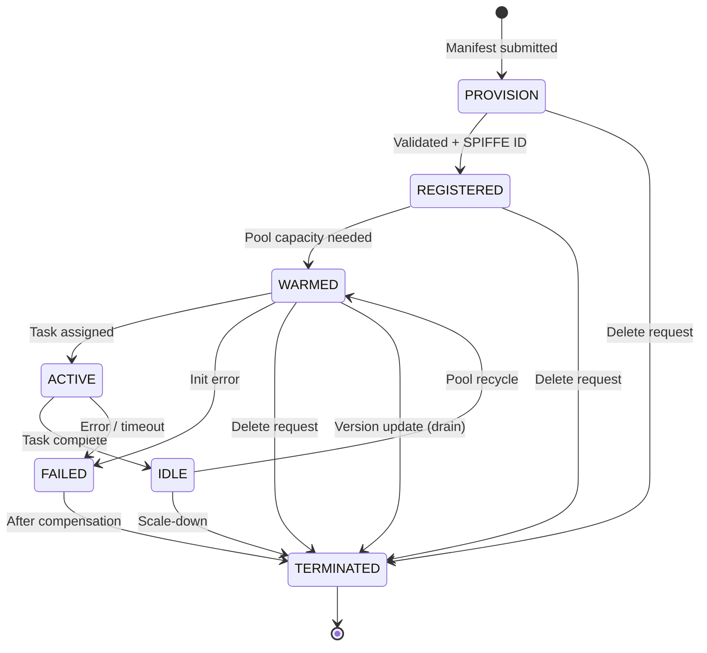
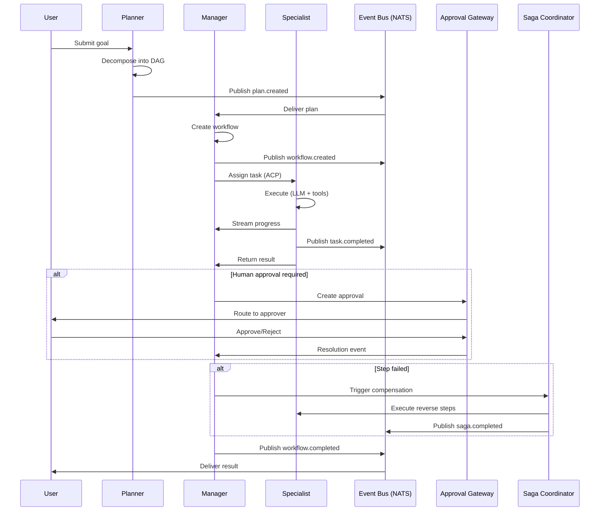
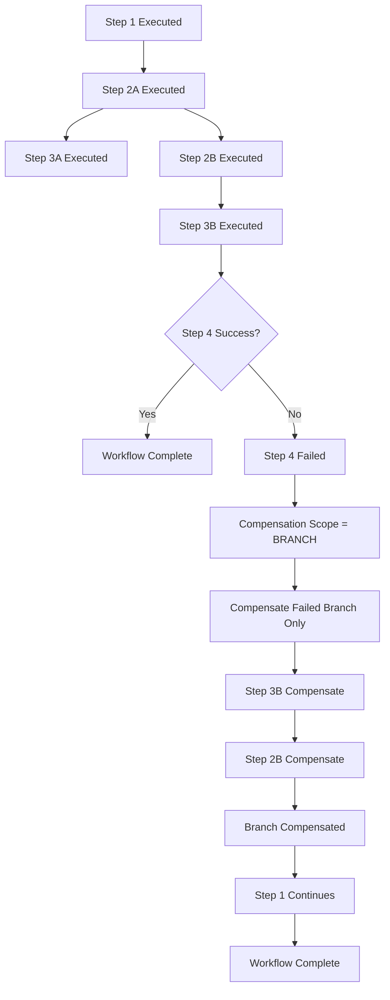
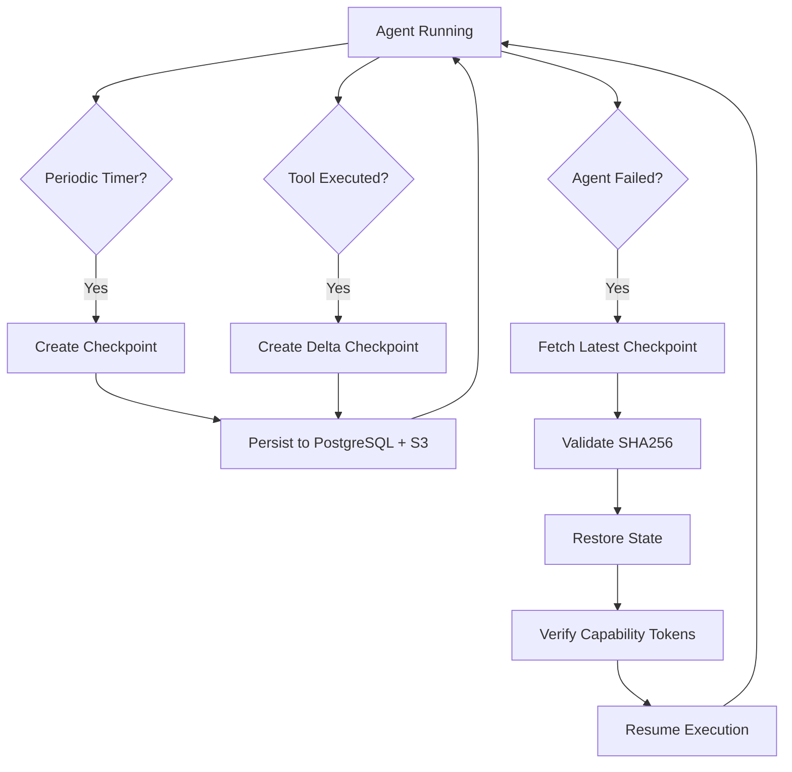

# RFC-0008
# Hermes Agent Runtime & Orchestration Architecture

**Status:** Approved
**Author:** Hermes Team
**Owner:** Chief System Architect
**Version:** 1.1
**Priority:** Critical
**Depends On:** RFC-0001 (Foundation), RFC-0002 v1.1 (Core Architecture), RFC-0003 v1.1 (Event Bus), RFC-0004 v1.1 (Gateway), RFC-0005 v1.1 (Memory Architecture), RFC-0006 v1.1 (Knowledge Architecture), RFC-0007 v1.1 (Security & Identity Architecture)

---

## 1. Purpose

This RFC defines the **Hermes Agent Runtime & Orchestration Architecture** — the execution engine responsible for spawning, coordinating, supervising, and terminating every agent in Hermes Agent OS v2.

The Agent Runtime is the **operational heart** of the platform. Every agent — whether a Planner, Manager, Specialist, or custom agent — executes within the Runtime's supervision. The Runtime provides: lifecycle management, capability enforcement, task scheduling, workflow orchestration, saga compensation, human-in-the-loop approvals, checkpoint/recovery, warm pools, and inter-agent communication via ACP.

**Core Principle:** *The Runtime is not a container orchestrator. The Runtime is an agent execution fabric — capability-aware, security-native, event-driven, and designed for autonomous multi-agent workflows.*

---

## 2. Scope

| In Scope | Out of Scope |
|----------|--------------|
| Agent Runtime architecture & components | Agent business logic (implemented by agents) |
| Agent lifecycle (spawn → execute → terminate) | Model provider APIs (RFC-0004) |
| Agent Registry & Discovery | Tool implementations (RFC-0008 §22) |
| Agent Manifests & Capability declarations | Plugin SDK (RFC-0009) |
| Agent Communication Protocol (ACP) | Automation rules (RFC-0009) |
| Planner → Manager → Specialist workflow | Observability stack (RFC-0010) |
| Task scheduling, execution, orchestration | |
| Saga & compensation patterns | |
| Human-in-the-loop approvals | |
| Agent state, checkpoint, recovery | |
| Warm pools & auto-scaling | |
| Failure handling, retries, dead letter | |
| Inter-agent messaging (ACP) | |
| Tool execution contracts (WASM) | |
| Provider interaction (LLM, API) | |
| Runtime gRPC APIs | |
| Event Bus integration (RFC-0003) | |
| Security integration (RFC-0007) | |
| Memory & Knowledge integration (RFC-0005/0006) | |
| Performance targets & diagrams | |

---

## 3. Design Principles

| Principle | Description |
|-----------|-------------|
| **Capability-First Execution** | Every agent action requires a valid capability token (RFC-0007) |
| **Security-Native** | SPIFFE mTLS everywhere; zero-trust between agents; no ambient authority |
| **Event-Driven** | All lifecycle, task, and state changes published to NATS (RFC-0003) |
| **Saga-Based Orchestration** | Multi-agent workflows as compensatable sagas with branch-aware compensation (RFC-0002 §5) |
| **Checkpointable by Default** | Every agent state persistable; recovery < 30s |
| **Warm Pool Efficiency** | Pre-warmed agents reduce cold-start to < 500ms |
| **Human-in-the-Loop** | Approval gates as first-class workflow constructs |
| **Multi-Tenant Isolation** | Hard boundaries at Runtime, Memory, Knowledge, Event Bus layers |
| **Provider Agnostic** | LLM/tool providers swappable via adapters |
| **Observability by Design** | OpenTelemetry traces, structured logs, metrics on every operation |
| **Resource Quota Enforcement** | Per-tenant admission control for CPU, memory, tokens, agent count |
| **Backpressure by Default** | Agent-to-agent capacity reporting prevents cascade failures |

---

## 4. Agent Runtime Architecture

```
+-------------------------------------------------------------------+
|                     AGENT RUNTIME CLUSTER                          |
|                                                                    |
|  +---------------------------------------------------------+      |
|  |                    CONTROL PLANE                         |      |
|  |  [Registry] [Scheduler] [Orchestrator] [Saga Coord]    |      |
|  |  [Warm Pool Mgr] [Checkpoint Mgr] [Approval GW] [CapEnf]|      |
|  |  [Resource Quota Mgr] [Health Monitor] [Checkpoint Store]|      |
|  |  [Region Coordinator]                                  |      |
|  +---------------------------------------------------------+      |
|                              |                                     |
|        +---------------------+---------------------+              |
|        v                     v                     v              |
|  +-----------+        +-----------+        +-----------+         |
|  | POOL A    |        | POOL B    |        | POOL N    |         |
|  | (Planner) |        | (Manager) |        |(Specialist)|        |
|  +-----------+        +-----------+        +-----------+         |
+-------------------------------------------------------------------+
        |                 |                 |
        v                 v                 v
   [NATS]           [PostgreSQL]        [Vault]
   (Events)         (State)            (Secrets)
```

### 4.1 Runtime Components

| Component | Responsibility | Scaling |
|-----------|----------------|---------|
| **Agent Registry** | Manifest storage, discovery, versioning | Active-passive |
| **Task Scheduler** | Queue management, priority, affinity, fairness | Horizontal (sharded) |
| **Workflow Orchestrator** | DAG execution, parallel branches, conditional logic | Horizontal (per workflow) |
| **Saga Coordinator** | Compensation triggers, timeout management, retry, branch-aware compensation | Active-passive |
| **Warm Pool Manager** | Pre-warm, recycle, scale-up/down, health checks | Per agent type |
| **Checkpoint Manager** | Periodic snapshots, on-demand, recovery orchestration | Horizontal |
| **Approval Gateway** | Human-in-the-loop routing, timeout, escalation | Horizontal |
| **Capability Enforcer** | Validates capability tokens on every agent action | Sidecar (per agent) |
| **Resource Quota Manager** | Per-tenant admission control for CPU, memory, tokens, agent count | Active-passive |
| **Health Monitor** | Agent health checks, 3-strike removal, replacement | Horizontal |
| **Checkpoint Store** | Persistent checkpoint storage (PostgreSQL metadata + S3 state) | Managed service |
| **Region Coordinator** | Cross-region checkpoint replication, failover, region affinity | Active-passive |

### 4.2 Agent Process Model

```
+-------------------------------------------------------------------+
|                        AGENT PROCESS                              |
|                                                                    |
|  +---------------------------------------------------------+      |
|  |                    CAPABILITY SIDECAR                        |      |
|  |  [mTLS] [CapToken Cache] [Rate Limit] [Net Egress]       |      |
|  |  [Audit Log] [Health Check] [Token Budget] [Backpressure]|      |
|  +---------------------------------------------------------+      |
|                              |                                   |
|  +---------------------------------------------------------+      |
|  |                    AGENT CORE                                |      |
|  |  [LLM Client] [Tool Executor] [State Store]               |      |
|  |  [ACP Client] [Memory SDK] [Knowledge SDK]                |      |
|  +---------------------------------------------------------+      |
+-------------------------------------------------------------------+
```

---

## 5. Agent Lifecycle

### 5.1 Lifecycle States

PROVISION -> REGISTERED -> WARMED -> ACTIVE -> IDLE -> TERMINATED
                            |              |
                            |              +-> FAILED (on error)
                            |                   |
                            +-------------------+-> TERMINATED (after compensation)
                            |
                            +-> TERMINATED (version update drain)

### 5.2 Lifecycle Transitions

| Transition | Trigger | Timeout | Compensation |
|------------|---------|---------|--------------|
| PROVISION to REGISTERED | Manifest submitted | 30s | N/A |
| REGISTERED to WARMED | Pool capacity needed | 60s | Release resources |
| WARMED to ACTIVE | Task assigned | 500ms warm / 5s cold | Re-queue task |
| ACTIVE to IDLE | Task complete | 10s | State checkpoint |
| ACTIVE to FAILED | Error / timeout | N/A | Saga compensation |
| IDLE to WARMED | Pool recycle | 30s | State reset |
| ANY to TERMINATED | Scale-down / delete | 30s | Graceful drain |
| WARMED to TERMINATED | Version update (drain) | Configurable (default 30 min) | In-flight completion |

---

## 6. Agent Registry

### 6.1 Registry Data Model

```protobuf
message AgentManifest {
  string agent_id = 1;
  string name = 2;
  string description = 3;
  string agent_type = 4;
  string version = 5;
  repeated CapabilityDeclaration capabilities = 6;
  ResourceRequirements resources = 7;
  string entrypoint = 8;
  map<string, string> env_vars = 9;
  repeated string volume_mounts = 10;
  repeated string allowed_egress = 11;
  int32 warm_pool_size = 12;
  int32 max_pool_size = 13;
  int32 idle_timeout_seconds = 14;
  int32 checkpoint_interval_seconds = 15;
  ProviderConfig provider = 16;
  map<string, string> labels = 17;
  int64 created_at_us = 18;
  int64 updated_at_us = 19;
}

message CapabilityDeclaration {
  string name = 1;
  string resource_pattern = 2;
  Action action = 3;
  int32 rate_limit = 4;
  bool required = 5;
}

message ResourceRequirements {
  string cpu = 1;
  string memory = 2;
  int32 max_tokens = 3;
  int32 max_concurrent_requests = 4;
}

message ProviderConfig {
  string provider_type = 1;
  string model = 2;
  map<string, string> parameters = 3;
  string api_key_secret = 4;
}
```

### 6.2 Registry Operations

| Operation | Description | Consistency |
|-----------|-------------|-------------|
| Register | Submit manifest; validate capabilities; assign SPIFFE ID | Strong (PG) |
| Update | New version; rolling update support | Strong |
| Deregister | Drain pool; revoke capabilities; cleanup | Eventual |
| Discover | Query by type, capability, label, version | Cached (5s TTL) |
| Resolve | Get manifest + capability tokens for spawn | Strong |

### 6.3 Versioning & Rollout

Version Strategy:
  - Semantic versioning (major.minor.patch)
  - Major = breaking capability/API change
  - Minor = new capabilities, backward compatible
  - Patch = bug fixes, no capability change

Rollout:
  - Canary: 5% -> 25% -> 100%
  - Health gates: error rate < 1%, latency p99 < target
  - Instant rollback on failure
  - Parallel versions supported (blue/green pools)

In-Flight Migration Policy (M-01):
  - Default: DRAIN (in-flight agents finish on old version, max drain time 30 min)
  - Configurable: MIGRATE (checkpoint + restart on new version)
  - Configurable: COEXIST (both versions run indefinitely)
  - Events: hermes.{tenant}.agent.version.deployed, hermes.{tenant}.agent.version.drained

---

## 7. Agent Discovery

### 7.1 Discovery Mechanisms

| Mechanism | Use Case | Latency |
|-----------|----------|---------|
| Registry Query | Direct lookup by ID/type | < 10ms (cached) |
| Capability Match | Find agents with capability X | < 50ms |
| Label Selector | Kubernetes-style label queries | < 20ms |
| Event Subscription | Real-time manifest changes | Push (NATS) |

### 7.2 Discovery API

```protobuf
service AgentRegistry {
  rpc RegisterAgent(RegisterAgentRequest) returns (AgentManifest);
  rpc UpdateAgent(UpdateAgentRequest) returns (AgentManifest);
  rpc DeregisterAgent(DeregisterAgentRequest) returns (DeregisterAgentResponse);
  rpc GetAgent(GetAgentRequest) returns (AgentManifest);
  rpc ListAgents(ListAgentsRequest) returns (ListAgentsResponse);
  rpc DiscoverAgents(DiscoverAgentsRequest) returns (DiscoverAgentsResponse);
  rpc WatchAgents(WatchAgentsRequest) returns (stream AgentManifestEvent);
}

message DiscoverAgentsRequest {
  string tenant_id = 1;
  string agent_type = 2;
  repeated string capabilities = 3;
  map<string, string> labels = 4;
  string version_constraint = 5;
}

message DiscoverAgentsResponse {
  repeated AgentManifest agents = 1;
}
```

### 7.3 Discovery Events (NATS)

Subject: hermes.{tenant}.agent.manifest.{created|updated|deleted}
Payload: AgentManifest

Subject: hermes.{tenant}.agent.pool.{scaled_up|scaled_down}
Payload: { agent_type, pool_size, timestamp }

Subject: hermes.{tenant}.agent.version.{deployed|drained}
Payload: { agent_type, version, pool_size }

---

## 8. Agent Manifests

### 8.1 Manifest Structure (YAML)

```yaml
apiVersion: hermes.io/v1
kind: AgentManifest
metadata:
  name: "code-specialist"
  agentType: "SPECIALIST"
  version: "2.1.0"
  labels:
    domain: "code"
    language: "python"
    tier: "execution"
spec:
  capabilities:
    - name: "code.exec"
      resourcePattern: "*"
      action: "EXECUTE"
      rateLimit: 100
      required: true
    - name: "git.read"
      resourcePattern: "repo:acme/*"
      action: "READ"
      rateLimit: 50
      required: true
    - name: "knowledge.search"
      resourcePattern: "*"
      action: "READ"
      rateLimit: 30
      required: false
  resources:
    cpu: "1000m"
    memory: "2Gi"
    maxTokens: 8192
    maxConcurrentRequests: 5
  execution:
    entrypoint: "wasm://hermes/agents/code-specialist:v2.1.0"
    envVars:
      PYTHONPATH: "/workspace"
    volumeMounts:
      - "/workspace:/workspace"
  network:
    allowedEgress:
      - "github.com"
      - "api.openai.com"
      - "pypi.org"
  lifecycle:
    warmPoolSize: 3
    maxPoolSize: 20
    idleTimeoutSeconds: 300
    checkpointIntervalSeconds: 60
  provider:
    providerType: "OPENAI"
    model: "gpt-4o"
    parameters:
      temperature: "0.1"
      maxTokens: "4096"
    apiKeySecret: "vault://hermes/secrets/openai-api-key"
```

### 8.2 Manifest Validation

| Check | Implementation |
|-------|----------------|
| Schema | JSON Schema validation (strict) |
| Capabilities | All declared capabilities granted by Security Service |
| Resources | Within tenant quota; node capacity |
| Provider | API key exists in Vault; model available |
| Entrypoint | WASM module signed & verified; or container image scanned |
| Network | allowedEgress subset of capability network_egress |

---

## 9. Agent Capabilities

### 9.1 Capability Model (RFC-0007 Integration)

Capabilities are **granted at spawn** via PASETO v4 tokens with delegation chains. The Runtime enforces:

```rego
package hermes.runtime

allow_action(agent, capability, resource, action) {
  token := get_capability_token(agent)
  cap := token.capabilities[_]
  cap.name == capability
  cap.resources matches resource
  cap.actions contains action
  rate_limit.check(cap.name, agent) < cap.rate_limit
  token.delegation_depth <= token.max_delegation_depth
  verify_delegation_chain(token.delegation_chain)
}

allow_egress(agent, destination) {
  token := get_capability_token(agent)
  token.constraints.network_egress[_] == destination
}

allow_llm_call(agent, tokens) {
  token := get_capability_token(agent)
  token.remaining_budget >= tokens
}
```

### 9.2 Built-in Capabilities

| Capability | Resource Pattern | Actions | Default Rate Limit | Agent Types |
|------------|------------------|---------|-------------------|-------------|
| code.exec | * | EXECUTE | 100/min | Specialist |
| code.analyze | * | READ | 50/min | Specialist |
| git.read | repo:{tenant}/* | READ | 50/min | All |
| git.write | repo:{tenant}/{repo} | WRITE | 10/min | Specialist |
| knowledge.search | * | READ | 30/min | All |
| knowledge.ingest | collection:{tenant}/* | WRITE | 10/min | Specialist |
| memory.read | tier:{working|episodic|semantic} | READ | 100/min | All |
| memory.write | tier:{working|episodic} | WRITE | 50/min | Manager, Specialist |
| workflow.execute | workflow:{tenant}/* | EXECUTE | 20/min | Manager |
| agent.spawn | agent:{tenant}:{type}:* | EXECUTE | 10/min | Planner, Manager |
| approval.request | approval:{tenant}/* | WRITE | 5/min | Manager |
| tool.invoke | tool:{tenant}/* | EXECUTE | 50/min | Specialist |

### 9.3 Capability Enforcement Points

| Point | Mechanism |
|-------|-----------|
| Task Assignment | Scheduler verifies agent has required capabilities |
| Tool Invocation | WASM host validates capability before exec |
| Memory Access | Memory SDK checks capability token |
| Knowledge Access | Knowledge SDK checks capability token |
| Agent Spawn | Parent capability subset verified |
| Network Egress | Sidecar proxy (Envoy) enforces allowlist |
| LLM Call | Token budget tracked in sidecar; enforced before provider call |

---

## 10. Agent Communication Protocol (ACP)

### 10.1 ACP Overview (RFC-0002 §13)

ACP is the **native protocol** for agent-to-agent communication. Built on NATS (RFC-0003) with mTLS and capability tokens.

### 10.2 ACP Message Format

```protobuf
message ACPMessage {
  string message_id = 1;
  string correlation_id = 2;
  string causation_id = 3;
  int64 timestamp_us = 4;
  string source_agent = 5;
  string target_agent = 6;
  string target_capability = 7;
  ACPMessageType type = 8;
  string action = 9;
  bytes payload = 10;
  string capability_token = 11;
  map<string, string> headers = 12;
  int32 ttl_hops = 13;
  int64 expires_at_us = 14;
  bool requires_ack = 15;
}

enum ACPMessageType {
  REQUEST = 0;
  RESPONSE = 1;
  EVENT = 2;
  STREAM = 3;
}
```

### 10.3 ACP Patterns

| Pattern | Use Case | Delivery |
|---------|----------|----------|
| Request-Response | Synchronous task delegation | At-least-once |
| Event | State changes, notifications | At-least-once |
| Stream | Long-running with progress updates | Ordered, exactly-once |
| Broadcast | Fan-out to multiple agents | Best-effort |

### 10.4 ACP Subject Naming

Request:  hermes.{tenant}.acp.{target_agent_type}.{action}
Response: hermes.{tenant}.acp.{target_agent_type}.{action}.response.{correlation_id}
Event:    hermes.{tenant}.acp.{target_agent_type}.{action}.event
Stream:   hermes.{tenant}.acp.{target_agent_type}.{action}.stream.{correlation_id}

Examples:
  hermes.acme.acp.code-specialist.execute
  hermes.acme.acp.code-specialist.execute.response.abc-123
  hermes.acme.acp.planner.plan.event
  hermes.acme.acp.manager.approve.stream.xyz-789

### 10.5 Backpressure & Capacity Reporting (H-02)

Specialist (via ACP Event)                    Manager
     |                                            |
     +---- CapacityReport --------------------->|  (every 30s)
     {active_agents: 8, max_agents: 10,
      queue_depth: 15, avg_latency_ms: 245,
      available_capacity: 0.2}

Manager Throttling Logic: When available_capacity < 0.25 for any agent type,
Manager defers new task dispatch for that type and publishes
hermes.{tenant}.agent.backpressure.{agent_type} event.
Throttling lifts when available_capacity > 0.5.
---

## 11. Planner -> Manager -> Specialist Workflow

### 11.1 Three-Tier Agent Hierarchy

```
+-------------------------------------------------------------------+
|                    PLANNER -> MANAGER -> SPECIALIST               |
|                                                                    |
|  +-----------+      +-----------+      +----------------------+  |
|  |  PLANNER  |----->|  MANAGER  |----->|    SPECIALISTS       |  |
|  |           |      |           |      |                      |  |
|  | * Decompose|      | * Schedule|      | * Code Specialist   |  |
|  |   goals    |      | * Coordina|      | * Research Specialist|  |
|  | * Create   |      | * Monitor |      | * Git Specialist    |  |
|  |   plan DAG |      | * Handle  |      | * Analysis Specialist|  |
|  | * Estimate |      |   failures|      | * Security Specialist|  |
|  |   resources|      | * Approve |      | * Custom Specialists|  |
|  |            |      |   HITL    |      |                      |  |
|  +-----------+      +-----------+      +----------------------+  |
|        |                    |                       |            |
|        | ACP: plan.create  | ACP: task.execute     | ACP: tool  |
|        | ACP: plan.update  | ACP: task.status      | ACP: mem   |
|        |                   | ACP: approval.request | ACP: knowl |
|        v                    v                       v           |
|  +-----------------------------------------------------------------+  |
|  |                  SHARED INFRASTRUCTURE                          |  |
|  |  * Memory (Working/Episodic/Semantic) * Knowledge (RAG/Graph)   |  |
|  |  * Event Bus (NATS)                    * Security (Capabilities) |  |
|  |  * Checkpoint Store                    * Saga Coordinator       |  |
|  +-----------------------------------------------------------------+  |
+-------------------------------------------------------------------+
```

### 11.2 Planner Agent

```protobuf
message PlannerInput {
  string goal = 1;
  map<string, string> context = 2;
  repeated string available_specialists = 3;
  string tenant_id = 4;
}

message Plan {
  string plan_id = 1;
  string goal = 2;
  repeated PlanStep steps = 3;
  map<string, string> estimates = 4;
  repeated string required_capabilities = 5;
  string created_by = 6;
  int64 created_at_us = 7;
}

message PlanStep {
  string step_id = 1;
  string name = 2;
  string description = 3;
  string specialist_type = 4;
  repeated string dependencies = 5;
  CapabilityRequirements capabilities = 6;
  map<string, string> parameters = 7;
  RetryPolicy retry = 8;
  TimeoutPolicy timeout = 9;
  bool human_approval = 10;
}

message CapabilityRequirements {
  repeated string required = 1;
  repeated string optional = 2;
}
```

**Planner Responsibilities:**
- Goal decomposition into executable DAG
- Specialist selection based on capabilities
- Resource estimation (tokens, time, cost)
- Parallel branch identification
- HITL gate insertion

### 11.3 Manager Agent

```protobuf
message ManagerInput {
  string plan_id = 1;
  string workflow_id = 2;
}

message TaskAssignment {
  string task_id = 1;
  string step_id = 2;
  string specialist_type = 3;
  bytes input = 4;
  repeated string capabilities = 5;
  int32 priority = 6;
  int64 deadline_us = 7;
}
```

**Manager Responsibilities:**
- Task scheduling & dispatch to specialists
- Progress monitoring & heartbeat
- Failure detection & retry orchestration
- Human-in-the-loop approval routing
- Saga compensation triggering (branch-aware)
- Checkpoint coordination

### 11.4 Specialist Agent

```protobuf
message SpecialistInput {
  string task_id = 1;
  bytes payload = 2;
  map<string, string> context = 3;
}

message SpecialistOutput {
  string task_id = 1;
  TaskStatus status = 2;
  bytes output = 3;
  int32 tokens_used = 4;
  repeated ToolInvocation tools = 5;
  repeated string checkpoints = 6;
}

enum TaskStatus {
  SUCCESS = 0;
  FAILED = 1;
  PARTIAL = 2;
  PENDING_APPROVAL = 3;
}
```

### 11.5 Re-planning Protocol (H-04)

```
Manager                          Planner
    |                                |
    +---- PlanRevisionRequest ------>|  (trigger: step failure after retries,
    |  {failed_step, error,          |   actual_tokens > 150% estimate,
    |   actual_vs_estimate,          |   actual_time > 200% estimate,
    |   remaining_steps}             |   external_state_change)
    |                                |
    |                                +-> Re-evaluate remaining steps
    |                                +-> Select alternative specialists
    |                                +-> Adjust resource estimates
    |                                |
    |<--- PlanRevisionResponse ------+  (updated Plan with revised steps)
    |  {updated_plan,                |
    |   revised_estimates}           |
    |                                |
```

**Trigger Conditions for Re-planning:**
1. Step failure after all retries exhausted + compensation completed
2. Actual token usage exceeds 150% of estimate
3. Actual execution time exceeds 200% of estimate
4. External state change detected (knowledge base updated, git repo changed)

---

## 12. Task Scheduling

### 12.1 Scheduler Architecture

```
+-------------------------------------------------------------------+
|                      TASK SCHEDULER                               |
|                                                                    |
|  +-------------+   +-------------+   +-------------+              |
|  |  Priority   |   |  Affinity   |   |  Fairness   |              |
|  |  Queue      |   |  Engine     |   |  Controller |              |
|  |  (4 levels) |   |  (tenant,   |   |  (per-tenant|              |
|  |             |   |   agent type)|  |   quotas)   |              |
|  +------+------+   +------+------+   +------+------+              |
|         |                  |                  |                   |
|         +------------------+------------------+                   |
|                            v                                      |
|                   +--------------------+                          |
|                   |  Dispatcher        |                          |
|                   |  (assigns to       |                          |
|                   |   warm pool)       |                          |
|                   +--------------------+                          |
+-------------------------------------------------------------------+
```

### 12.2 Priority Levels

| Priority | Value | Use Case | SLA |
|----------|-------|----------|-----|
| CRITICAL | 3 | Security incidents, data loss prevention | < 1s queue |
| HIGH | 2 | User-facing interactive tasks | < 10s queue |
| NORMAL | 1 | Standard background work | < 60s queue |
| LOW | 0 | Batch, maintenance | Best effort |

### 12.3 Scheduling Policies

| Policy | Description |
|--------|-------------|
| Capability-Aware | Only assign to agents with required capabilities |
| Tenant Affinity | Prefer same-tenant agents (data locality) |
| Agent Type Affinity | Prefer specialized agents for domain tasks |
| Load Balancing | Least-loaded within capability match |
| Fair Share | Per-tenant quota enforcement |

### 12.4 Queue Implementation (NATS JetStream)

```yaml
# Task Queue Stream Config
stream: hermes.{tenant}.tasks
subjects:
  - hermes.{tenant}.tasks.>           # Priority prefixed: critical., high., normal., low.
retention: limits
max_messages: 1000000
max_bytes: 10GB
max_age: 7d
storage: file
replicas: 3
```

### 12.5 Per-Agent-Type Queue Isolation (H-07)

Each agent type gets its own consumer group within the tenant stream:
- `hermes.{tenant}.tasks.consumer.code-specialist`
- `hermes.{tenant}.tasks.consumer.research-specialist`
- Independent max-pending, ack-wait, and flow control per group
- Prevents one agent type's queue from blocking others

---

## 13. Task Execution

### 13.1 Execution Flow

```
TASK SUBMITTED -> VALIDATE -> ASSIGN AGENT -> EXECUTE -> COMPLETE / RETRY
                                     (warm pool -> active; or cold start)
```

### 13.2 Execution Context

```protobuf
message ExecutionContext {
  string task_id = 1;
  string workflow_id = 2;
  string step_id = 3;
  string agent_id = 4;
  string tenant_id = 5;
  string capability_token = 6;
  string spiffe_id = 7;
  bytes input = 8;
  map<string, string> parameters = 9;
  bytes working_memory = 10;
  repeated string episodic_refs = 11;
  repeated string knowledge_refs = 12;
  int32 max_tokens = 13;
  int32 max_tool_calls = 14;
  int64 deadline_us = 15;
  int32 token_budget = 16;
  int32 tokens_remaining = 17;
  string trace_id = 18;
  string span_id = 19;
}
```

### 13.3 Tool Invocation Loop

```
LLM CALL -> PARSE RESPONSE -> TOOL CALLS? -> YES: EXECUTE TOOLS -> CHECKPOINT -> REPEAT
                                        NO:  RETURN RESULT
```

---

## 14. Workflow Orchestration

### 14.1 Workflow Model

```protobuf
message Workflow {
  string workflow_id = 1;
  string plan_id = 2;
  string tenant_id = 3;
  WorkflowStatus status = 4;
  repeated WorkflowStep steps = 5;
  map<string, repeated string> edges = 6;
  map<string, StepStatus> step_status = 7;
  bytes global_state = 8;
  int64 created_at_us = 9;
  int64 started_at_us = 10;
  int64 completed_at_us = 11;
  string created_by = 12;
  int64 ttl_seconds = 13;
}

message WorkflowStep {
  string step_id = 1;
  string name = 2;
  string specialist_type = 3;
  repeated string dependencies = 4;
  CapabilityRequirements capabilities = 5;
  map<string, string> parameters = 6;
  RetryPolicy retry_policy = 7;
  CompensationAction compensation = 8;
}

message WorkflowEdge {
  string from_node = 1;
  string to_node = 2;
  EdgeCondition condition = 3;
  string custom_expression = 4;
}

enum EdgeCondition {
  ALWAYS = 0;
  ON_SUCCESS = 1;
  ON_FAILURE = 2;
  CUSTOM = 3;
}

enum WorkflowStatus {
  RUNNING = 0;
  PAUSED = 1;
  COMPLETED = 2;
  FAILED = 3;
  COMPENSATING = 4;
}
```

### 14.2 DAG Execution

Parallel branches execute independently with separate agent assignments.
Conditional edges evaluated at runtime via CEL expressions.

### 14.3 Orchestration Guarantees

| Guarantee | Implementation |
|-----------|----------------|
| Exactly-once step execution | Idempotency keys + step status in PG |
| Parallel branch isolation | Separate agent assignments; shared state via Memory |
| Conditional branching | Evaluated at runtime; skipped steps marked |
| Pause/Resume | Persistent workflow state; agent drain on pause |
| Timeout enforcement | Per-step deadline; auto-trigger compensation |

---

## 15. Saga & Compensation

### 15.1 Saga Pattern

```
FORWARD (Success)                    COMPENSATION (Failure)
Step 1 -> Step 2 -> Step 3 -> Step 4
   |         |         |         |
   |         |         |         +-> FAIL!
   |         |         |              |
   |         |         +--------------> Step 3 Compensate
   |         |                        |
   |         +------------------------> Step 2 Compensate
   |                                  |
   +----------------------------------> Step 1 Compensate
```

### 15.2 Compensation Actions (H-03)

```protobuf
message CompensationAction {
  CompensationType type = 1;
  CompensationScope scope = 2;
  string reverse_step_id = 3;
  bytes reverse_input = 4;
  int32 timeout_seconds = 5;
  RetryPolicy retry_policy = 6;
}

enum CompensationType {
  REVERSE = 0;
  MANUAL = 1;
  NOOP = 2;
}

enum CompensationScope {
  FULL = 0;
  BRANCH = 1;
  NONE = 2;
}
```

**Branch-Aware Compensation:**
- `FULL`: Compensate all prior steps in reverse order (linear workflows)
- `BRANCH`: Compensate only steps in the failed branch's causal chain (parallel DAGs)
- `NONE`: No compensation needed (idempotent steps)

### 15.3 Saga Coordinator Responsibilities

| Responsibility | Implementation |
|----------------|----------------|
| Forward execution | Execute steps in DAG order; track status |
| Failure detection | Step timeout, error, cancellation |
| Compensation trigger | On failure: execute reverse steps per scope |
| Timeout management | Per-step + global saga timeout |
| State persistence | Every step transition to PostgreSQL |
| Alerting | Compensation started, completed, failed |

---

## 16. Human-in-the-Loop Approvals

### 16.1 Approval Flow

```
TASK REQUIRES APPROVAL -> CREATE REQUEST -> ROUTE TO APPROVER -> APPROVE/REJECT -> RESUME/FAIL
```

### 16.2 Approval Model

```protobuf
message ApprovalRequest {
  string approval_id = 1;
  string workflow_id = 2;
  string step_id = 3;
  string task_id = 4;
  string tenant_id = 5;
  string title = 6;
  string description = 7;
  bytes context = 8;
  repeated string required_approvers = 9;
  ApprovalPolicy policy = 10;
  int64 expires_at_us = 11;
  ApprovalStatus status = 12;
  repeated ApprovalResponse responses = 13;
  int64 created_at_us = 14;
  int64 resolved_at_us = 15;
}

enum ApprovalPolicy {
  UNANIMOUS = 0;
  MAJORITY = 1;
  FIRST = 2;
}

message ApprovalResponse {
  string approver_id = 1;
  ApprovalDecision decision = 2;
  string comment = 3;
  int64 responded_at_us = 4;
}

enum ApprovalDecision {
  APPROVE = 0;
  REJECT = 1;
}
```

### 16.3 Approval Gateway

| Feature | Implementation |
|---------|----------------|
| Channels | Slack, Telegram, Email, Web UI, Teams |
| Timeout | Configurable per request; default 24h |
| Escalation | Auto-escalate to secondary approver (H-04) |
| Audit | All decisions logged to audit stream |
| Delegation | Approver can delegate to another user |

### 16.4 Approval Events (M-02)

Subject: hermes.{tenant}.agent.approval.{created|resolved|expired|escalated}

---

## 17. Agent State Management

### 17.1 State Tiers

| Tier | Storage | Scope | TTL | Use Case |
|------|---------|-------|-----|----------|
| Working | Redis | Session | Task duration | LLM context, tool results, scratchpad |
| Episodic | PostgreSQL | Task/Workflow | 30 days | Task history, decisions, checkpoints |
| Semantic | Qdrant + Kuzu | Cross-task | Indefinite | Learned patterns, best practices |
| Procedural | PostgreSQL + Redis | Agent type | Indefinite | Skills, prompts, configurations |

### 17.2 State Access (via SDKs)

Agent Core SDK provides:
- working_set/working_get (Redis)
- episodic_record/episodic_query (PG)
- semantic_upsert/semantic_search (Qdrant/Kuzu)

### 17.3 State Consistency

| Operation | Consistency |
|-----------|-------------|
| Working memory write | Eventual (Redis) |
| Working memory read | Strong (local cache) |
| Episodic write | Strong (PG) |
| Episodic read | Strong (PG) |
| Semantic upsert | Eventual (Qdrant/Kuzu async) |
| Semantic search | Eventual (index refresh) |

---

## 18. Checkpoint & Recovery

### 18.1 Checkpoint Types

| Type | Trigger | Scope | RTO |
|------|---------|-------|-----|
| Periodic | Every 60s (configurable) | Full agent state | < 30s |
| On-Tool | After each tool execution | Delta state | < 10s |
| On-LLM | After each LLM call | Token count + context | < 10s |
| On-Complete | Task/step completion | Final state | < 5s |
| On-Error | Before retry/compensation | Pre-error state | < 30s |

### 18.2 Checkpoint Format

```protobuf
message Checkpoint {
  string checkpoint_id = 1;
  string agent_id = 2;
  string task_id = 3;
  int32 sequence = 4;
  AgentState state = 5;
  bytes serialized_state = 6;
  string sha256 = 7;
  int64 created_at_us = 8;
  CheckpointType type = 9;
  string trigger = 10;
}

enum CheckpointType {
  PERIODIC = 0;
  ON_TOOL = 1;
  ON_LLM = 2;
  ON_COMPLETE = 3;
  ON_ERROR = 4;
}
```

### 18.3 Checkpoint Storage Specification (C-02)

| Aspect | Specification |
|--------|---------------|
| Metadata Store | PostgreSQL table `agent_checkpoints` (checkpoint_id PK, agent_id, task_id, sequence, type, trigger, sha256, created_at_us, state_size_bytes, storage_location) |
| State Payload Store | S3-compatible object storage at `hermes/checkpoints/{tenant}/{agent_type}/{agent_id}/{checkpoint_id}.zst` |
| Replication | Cross-region replication (CRR) enabled; async replication to secondary region |
| Retention | Last 10 checkpoints per agent OR 7 days, whichever is greater |
| Max Size | 100MB per checkpoint; chunk into 50MB parts if larger |
| Garbage Collection | Nightly cron: delete checkpoints older than retention policy; remove orphaned objects |
| Recovery RPO | < 60s (periodic checkpoint interval) |
| Recovery RTO | < 30s p99 (fetch metadata from PG, stream from S3, decompress, validate) |

### 18.4 Recovery Procedure

```
AGENT FAILURE -> LATEST CHECKPOINT -> VALIDATE (SHA256) -> RESTORE STATE -> RESUME
```

### 18.5 Recovery Guarantees

| Guarantee | Target |
|-----------|--------|
| RTO | < 30 seconds (p99) |
| RPO | < 60 seconds (periodic checkpoint interval) |
| Consistency | Checkpoint validated before restore |
| Idempotency | Recovery uses idempotency keys for tool re-execution |
---

## 19. Warm Pools & Scaling

### 19.1 Warm Pool Architecture

```
+-------------------------------------------------------------------+
|                    WARM POOL MANAGER                              |
|                                                                    |
|  Per Agent Type Pool:                                            |
|  +-----------------------------------------------------------+   |
|  |  CODE-SPECIALIST POOL                                      |   |
|  |                                                           |   |
|  |  [Warm #1] [Warm #2] [Warm #3] [Cold #4] ...              |   |
|  |  (Ready)   (Ready)   (Ready)   (Stopped)                  |   |
|  |                                                           |   |
|  |  Min: 3  Max: 20  Target Utilization: 70%                |   |
|  +-----------------------------------------------------------+   |
+-------------------------------------------------------------------+
```

### 19.2 Pool States

| State | Description | Transition |
|-------|-------------|------------|
| **WARM** | Fully initialized; SDKs loaded; model warm; capability tokens valid | Ready for immediate assignment |
| **IDLE** | Returned from task; state reset; capability tokens refreshed | -> WARM (after reset) |
| **COLD** | Stopped; minimal resources; can start in < 5s | -> WARM (on scale-up) |
| **DRAINING** | Finishing current task; not accepting new | -> IDLE -> COLD |

### 19.3 Scaling Policies

| Policy | Trigger | Action |
|--------|---------|--------|
| **Scale-Up** | Queue depth > 2 x warm_pool_size | Start cold agents; target: 70% utilization |
| **Scale-Down** | Utilization < 30% for 10 min | Drain idle agents; maintain min_warm |
| **Burst** | Priority CRITICAL tasks waiting | Emergency scale (bypass cooldown) |
| **Scheduled** | Cron (e.g., business hours) | Pre-warm pools |

### 19.4 Warm Pool Metrics

| Metric | Target |
|--------|--------|
| Cold Start Latency | < 5s (container) / < 2s (WASM) |
| Warm Assign Latency | < 500ms |
| Pool Utilization | 60-80% |
| Scale-Up Time | < 30s to add 5 agents |
| Token Refresh | Every 15 min (proactive) |

### 19.5 Multi-Region Warm Pools (H-05)

- Per-region warm pools with region-local affinity
- Async checkpoint replication to alternate region (S3 CRR)
- Task re-assignment on region loss via NATS supercluster routing
- Data residency: agent state stays in origin region unless failover

---

## 20. Failure Handling & Retries

### 20.1 Failure Classification

| Category | Examples | Handling |
|----------|----------|----------|
| **Transient** | Network timeout, rate limit, temporary unavailability | Retry with backoff |
| **Permanent** | Invalid input, auth failure, quota exceeded | Fail fast; compensation |
| **Agent Crash** | OOM, segfault, panic | Restart from checkpoint |
| **Provider Error** | LLM API error, model unavailable | Fallback provider; retry |
| **Tool Error** | Execution error, timeout | Retry (if idempotent) / fail |

### 20.2 Retry Policy

```protobuf
message RetryPolicy {
  int32 max_attempts = 1;
  int64 base_delay_ms = 2;
  int64 max_delay_ms = 3;
  float backoff_multiplier = 4;
  float jitter = 5;
  repeated string retryable_errors = 6;
  repeated string non_retryable_errors = 7;
}
```

### 20.3 Retry Behavior

| Attempt | Delay (base=1s, mult=2x, jitter=10%) |
|---------|--------------------------------------|
| 1 | 1s +/- 10% |
| 2 | 2s +/- 10% |
| 3 | 4s +/- 10% |
| 4 | 8s +/- 10% |
| 5 | 16s +/- 10% (capped at max_delay) |

### 20.4 Dead Letter Handling

```
MAX RETRIES EXHAUSTED -> NATS DEAD LETTER QUEUE -> ALERT ON-CALL + MANUAL REVIEW
```

**Dead Letter Payload:** Full task context, error history, checkpoints, suggested actions.


### 20.5 DLQ Replay RPC (M-05)

```protobuf
message ReplayTaskRequest {
  string original_task_id = 1;
  string idempotency_key = 2;           // Preserved from original
  string replay_reason = 3;
}

message ReplayTaskResponse {
  string new_task_id = 1;
  string idempotency_key = 2;
}
```

The `ReplayTask` RPC preserves the original `idempotency_key` and includes a `replay_reason` for audit. The response confirms the new `task_id` with the same idempotency guarantees.

---

---

## 21. Inter-Agent Messaging

### 21.1 Messaging Patterns (ACP)

| Pattern | Subject Template | Use Case |
|---------|------------------|----------|
| Direct Request | hermes.{tenant}.acp.{target}.{action} | Task delegation |
| Response | hermes.{tenant}.acp.{target}.{action}.response.{corr_id} | Sync result |
| Event | hermes.{tenant}.acp.{target}.{action}.event | Notifications |
| Stream | hermes.{tenant}.acp.{target}.{action}.stream.{corr_id} | Progress |
| Broadcast | hermes.{tenant}.acp.*.{action} | Fan-out |

### 21.2 Message Reliability

| Guarantee | Implementation |
|-----------|----------------|
| At-least-once | NATS JetStream with ack; redelivery on timeout |
| Ordering | Per-correlation_id ordering via NATS consumer |
| Deduplication | Message ID tracking (24h window) (H-01) |
| Timeout | 30s default; configurable per action |

### 21.3 Streaming Responses

```
SPECIALIST                    MANAGER
  |                             |
  +-> Stream Start ------------>|
  |                             |
  +-> Chunk 1 (10%) ----------->|
  |                             |
  +-> Chunk 2 (45%) ----------->|
  |                             |
  +-> Chunk 3 (90%) ----------->|
  |                             |
  +-> Final Result ------------>|
  |                             |
```

---

## 22. Tool Execution Contracts

### 22.1 WASM Tool Interface

```rust
// Tool interface (WASM component model)
interface Tool {
  fn execute(input: Bytes) -> Result<Bytes, ToolError>;
  fn metadata() -> ToolMetadata;
  fn validate(input: Bytes) -> Result<(), ValidationError>;
}

struct ToolMetadata {
  name: String,
  version: String,
  description: String,
  input_schema: JSONSchema,
  output_schema: JSONSchema,
  capabilities_required: Vec<String>,
  idempotent: bool,
  timeout_ms: u32,
}
```

### 22.2 Built-in Tools

| Tool | Capability | Idempotent | Timeout |
|------|------------|------------|---------|
| code.execute | code.exec | No | 120s |
| code.analyze | code.analyze | Yes | 60s |
| git.read | git.read | Yes | 30s |
| git.write | git.write | No | 60s |
| git.diff | git.read | Yes | 30s |
| knowledge.search | knowledge.search | Yes | 30s |
| knowledge.ingest | knowledge.ingest | No | 120s |
| memory.read | memory.read | Yes | 10s |
| memory.write | memory.write | No | 10s |
| http.request | network.egress | Configurable | 30s |
| shell.exec | code.exec | No | 60s |

### 22.3 Tool Execution Flow

```
AGENT -> ToolCall -> [SIDECAR: Capability Check -> Execute] -> [TOOL WASM] -> ToolResult -> AGENT
```

**Timeout Enforcement (M-06):**
- Wasmtime fuel-based instruction limit
- Sidecar watchdog timer (hard timeout at tool timeout + 5s)
- On timeout: kill WASM instance, return ToolError(TIMEOUT), trigger checkpoint recovery

---

## 23. Provider Interaction

### 23.1 Provider Abstraction

```protobuf
message ProviderRequest {
  string provider_id = 1;
  string model = 2;
  repeated Message messages = 3;
  ProviderParameters params = 4;
  map<string, string> metadata = 5;
}

message ProviderResponse {
  string response_id = 1;
  repeated Choice choices = 2;
  Usage usage = 3;
  int64 latency_ms = 4;
}

message Choice {
  int32 index = 1;
  Message message = 2;
  FinishReason finish_reason = 3;
}

message Usage {
  int32 prompt_tokens = 1;
  int32 completion_tokens = 2;
  int32 total_tokens = 3;
}
```

### 23.2 Provider Adapters (RFC-0004 Integration)

| Provider | Adapter | Capabilities |
|----------|---------|--------------|
| OpenAI | provider-openai | Chat, Completion, Embeddings, Tools |
| Anthropic | provider-anthropic | Chat, Tools |
| Google | provider-vertex | Chat, Embeddings |
| Local | provider-ollama | Chat, Embeddings |
| Custom | provider-custom | Extensible |

### 23.3 Provider Resilience

| Mechanism | Implementation |
|-----------|----------------|
| Fallback | Primary -> Secondary provider on error |
| Circuit Breaker | 5 errors in 10s -> open for 30s |
| Timeout | Per-request; configurable per provider |
| Token Budget | Per-task; enforced by Runtime |
| Streaming | SSE for real-time tokens |

---

## 24. Runtime gRPC APIs

```protobuf
service AgentRuntime {
  // Agent Lifecycle
  rpc SpawnAgent(SpawnAgentRequest) returns (SpawnAgentResponse);
  rpc TerminateAgent(TerminateAgentRequest) returns (TerminateAgentResponse);
  rpc GetAgentStatus(GetAgentStatusRequest) returns (AgentStatus);
  rpc ListAgents(ListAgentsRequest) returns (ListAgentsResponse);

  // Task Execution
  rpc SubmitTask(SubmitTaskRequest) returns (SubmitTaskResponse);
  rpc GetTaskStatus(GetTaskStatusRequest) returns (TaskStatus);
  rpc CancelTask(CancelTaskRequest) returns (CancelTaskResponse);
  rpc StreamTaskEvents(StreamTaskEventsRequest) returns (stream TaskEvent);

  // Workflow Orchestration
  rpc CreateWorkflow(CreateWorkflowRequest) returns (Workflow);
  rpc GetWorkflow(GetWorkflowRequest) returns (Workflow);
  rpc PauseWorkflow(PauseWorkflowRequest) returns (PauseWorkflowResponse);
  rpc ResumeWorkflow(ResumeWorkflowRequest) returns (ResumeWorkflowResponse);
  rpc CancelWorkflow(CancelWorkflowRequest) returns (CancelWorkflowResponse);

  // Approvals
  rpc CreateApproval(CreateApprovalRequest) returns (ApprovalRequest);
  rpc GetApproval(GetApprovalRequest) returns (ApprovalRequest);
  rpc RespondApproval(RespondApprovalRequest) returns (RespondApprovalResponse);

  // State & Checkpoints
  rpc GetAgentState(GetAgentStateRequest) returns (AgentState);
  rpc CreateCheckpoint(CreateCheckpointRequest) returns (Checkpoint);
  rpc RestoreFromCheckpoint(RestoreFromCheckpointRequest) returns (RestoreResponse);
  rpc ListCheckpoints(ListCheckpointsRequest) returns (ListCheckpointsResponse);

  // Warm Pools
  rpc ScalePool(ScalePoolRequest) returns (ScalePoolResponse);
  rpc GetPoolStatus(GetPoolStatusRequest) returns (PoolStatus);

  // Registry (delegated to AgentRegistry service)
  rpc RegisterAgent(RegisterAgentRequest) returns (AgentManifest);
  rpc DiscoverAgents(DiscoverAgentsRequest) returns (DiscoverAgentsResponse);

  // Admin
  rpc GetRuntimeStats(GetRuntimeStatsRequest) returns (RuntimeStats);
  rpc HealthCheck(HealthCheckRequest) returns (HealthCheckResponse);
}

// Key Types
message SpawnAgentRequest {
  string manifest_id = 1;
  string tenant_id = 2;
  string parent_agent = 3;
  repeated string capabilities = 4;
  int32 ttl_seconds = 5;
  map<string, string> env_override = 6;
}

message SubmitTaskRequest {
  string workflow_id = 1;
  string step_id = 2;
  bytes input = 3;
  int32 priority = 4;
  int64 deadline_us = 5;
  string idempotency_key = 6;
}

message TaskStatus {
  string task_id = 1;
  TaskState state = 2;
  string assigned_agent = 3;
  bytes output = 4;
  int32 tokens_used = 5;
  repeated ToolInvocation tools = 6;
  int64 started_at_us = 7;
  int64 completed_at_us = 8;
  string error = 9;
}

enum TaskState {
  QUEUED = 0;
  ASSIGNED = 1;
  RUNNING = 2;
  COMPLETED = 3;
  FAILED = 4;
  CANCELLED = 5;
}
```

---

## 25. Event Integration (RFC-0003)

### 25.1 Published Events

| Event | Subject | Payload |
|-------|---------|---------|
| Agent Spawned | hermes.{tenant}.agent.runtime.spawned | {agent_id, manifest_id, capabilities, timestamp} |
| Agent Terminated | hermes.{tenant}.agent.runtime.terminated | {agent_id, reason, timestamp} |
| Agent Failed | hermes.{tenant}.agent.runtime.failed | {agent_id, error, timestamp} |
| Task Queued | hermes.{tenant}.agent.task.queued | {task_id, workflow_id, step_id, priority} |
| Task Assigned | hermes.{tenant}.agent.task.assigned | {task_id, agent_id, timestamp} |
| Task Completed | hermes.{tenant}.agent.task.completed | {task_id, agent_id, tokens_used, duration} |
| Task Failed | hermes.{tenant}.agent.task.failed | {task_id, agent_id, error, retry_count} |
| Workflow Created | hermes.{tenant}.agent.workflow.created | {workflow_id, plan_id, steps} |
| Workflow Completed | hermes.{tenant}.agent.workflow.completed | {workflow_id, duration, tokens_used} |
| Workflow Failed | hermes.{tenant}.agent.workflow.failed | {workflow_id, failed_step, error} |
| Workflow Compensating | hermes.{tenant}.agent.workflow.compensating | {workflow_id, compensating_steps} |
| Approval Created | hermes.{tenant}.agent.approval.created | {approval_id, workflow_id, step_id} |
| Approval Resolved | hermes.{tenant}.agent.approval.resolved | {approval_id, decision, approver} |
| Approval Expired | hermes.{tenant}.agent.approval.expired | {approval_id, workflow_id} |
| Approval Escalated | hermes.{tenant}.agent.approval.escalated | {approval_id, escalated_to} |
| Pool Scaled | hermes.{tenant}.agent.pool.scaled | {agent_type, old_size, new_size, reason} |
| Checkpoint Created | hermes.{tenant}.agent.checkpoint.created | {agent_id, checkpoint_id, type} |
| Checkpoint Restored | hermes.{tenant}.agent.checkpoint.restored | {agent_id, checkpoint_id, recovery_time} |
| Backpressure Detected | hermes.{tenant}.agent.backpressure.{agent_type} | {agent_type, available_capacity, queue_depth} |
| Version Deployed | hermes.{tenant}.agent.version.deployed | {agent_type, version, pool_size} |
| Version Drained | hermes.{tenant}.agent.version.drained | {agent_type, old_version, new_version} |

### 25.2 Subscribed Events

| Event | Subject | Handler | Action |
|-------|---------|---------|--------|
| Plan Created | hermes.{tenant}.planner.plan.created | Workflow Orchestrator | Create workflow from plan |
| Memory Consolidated | hermes.{tenant}.memory.consolidated | Agent Core | Update semantic memory cache |
| Knowledge Ingested | hermes.{tenant}.knowledge.ingested | Agent Core | Invalidate knowledge cache |
| Capability Revoked | hermes.{tenant}.security.capability.revoked | Capability Enforcer | Terminate affected agents |
| Tenant Deleted | hermes.{tenant}.security.tenant.deleted | Warm Pool Manager | Drain all tenant pools |
| Provider Error | hermes.{tenant}.gateway.provider.error | Provider Adapter | Trigger fallback provider |
| Approval Timeout | hermes.{tenant}.agent.approval.timeout | Approval Gateway | Auto-reject + notify |

---

## 26. Security Integration (RFC-0007)

### 26.1 Agent Identity

Every agent receives a SPIFFE SVID at spawn. The Runtime:
- Requests SVID from per-tenant SPIRE workload registrar (RFC-0007 section 10)
- Injects SVID into agent sidecar
- Enforces mTLS on all agent-to-agent (ACP) and agent-to-service communication
- Rotates SVID every 24h (configurable per tenant)

### 26.2 Capability Token Lifecycle

```
PLANNER spawns MANAGER (delegation_depth=1) -> MANAGER spawns SPECIALIST (delegation_depth=2) -> max_delegation_depth=3 enforced
```

Each spawn: parent capability token subset-verified, new PASETO v4 token issued with delegation_chain, max_delegation_depth=3 (RFC-0007 section 11).

### 26.3 Audit Logging

| Action | Audit Event | Fields |
|--------|-------------|--------|
| Agent Spawn | agent.spawn | {agent_id, spawned_by, capabilities, timestamp} |
| Agent Terminate | agent.terminate | {agent_id, reason, timestamp} |
| Capability Used | capability.used | {agent_id, capability, resource, action, allowed} |
| Capability Denied | capability.denied | {agent_id, capability, resource, reason} |
| Tool Invocation | tool.invoke | {agent_id, tool, input_hash, result_status} |
| Network Egress | network.egress | {agent_id, destination, allowed} |
| Approval Decision | approval.decision | {approval_id, approver, decision, timestamp} |

All audit events published to `hermes.{tenant}.security.audit.agent` (NATS) and persisted to Merkle transparency log (RFC-0007 section 12).

---

## 27. Memory and Knowledge Integration

### 27.1 Memory Integration (RFC-0005)

| Operation | SDK Method | Storage | Consistency |
|-----------|-----------|---------|-------------|
| Working Set | working_set(key, value) | Redis | Eventual |
| Working Get | working_get(key) | Redis (local cache) | Strong |
| Episodic Record | episodic_record(event) | PostgreSQL | Strong |
| Episodic Query | episodic_query(query) | PostgreSQL | Strong |
| Semantic Upsert | semantic_upsert(pattern) | Qdrant + Kuzu | Eventual |
| Semantic Search | semantic_search(query) | Qdrant + Kuzu | Eventual |

### 27.2 Knowledge Integration (RFC-0006)

| Operation | SDK Method | Capability | Latency Target |
|-----------|-----------|------------|----------------|
| Search | knowledge.search(query) | knowledge.search | < 500ms |
| Retrieve | knowledge.retrieve(doc_id) | knowledge.search | < 100ms |
| Ingest | knowledge.ingest(source) | knowledge.ingest | < 5s |
| Graph Query | knowledge.graph_query(query) | knowledge.search | < 200ms |

### 27.3 Context Assembly

Before each LLM call, the Runtime assembles context:
1. Working memory (current task state, tool results)
2. Episodic memory (relevant past events for this workflow)
3. Semantic memory (learned patterns for this agent type)
4. Knowledge (RAG results from knowledge.search)
5. System prompt + provider parameters

Total context size must not exceed provider max_tokens limit. Truncation priority: semantic < episodic < knowledge < system < working.

---

## 28. Performance Targets

| Metric | Target | Measurement |
|--------|--------|-------------|
| Agent Spawn (warm) | < 500ms | Submit to heartbeat |
| Agent Spawn (cold) | < 5s | Submit to heartbeat |
| Task Assignment | < 100ms | Queue to assigned |
| Task Execution Start | < 200ms | Assigned to first LLM call |
| ACP Message Latency | < 50ms p99 | Send to receive |
| Checkpoint Create | < 500ms | Trigger to persisted |
| Recovery (RTO) | < 30s p99 | Failure to resumed |
| Warm Pool Utilization | 60-80% | Active / total pool |
| Per-tenant Max Agents | 500 concurrent | Configurable |
| Per-runtime Max Agents | 10,000 concurrent | Horizontal scale |
| Workflow DAG Concurrency | 100 parallel steps | Per workflow |
| Saga Compensation Time | < 5s per step | Trigger to complete |
| Provider Call Latency | < 2s p99 | Request to first token |
| Tool Execution (WASM) | < 100ms cold start | Load to first call |
| Knowledge Search | < 500ms p99 | Query to results |
| Memory Read (working) | < 10ms p99 | Get to return |

---

## 29. Mermaid Diagrams

### 29.1 Agent Lifecycle State Machine



### 29.2 Workflow Orchestration Flow



### 29.3 Saga Compensation Flow (Branch-Aware)



### 29.4 Checkpoint and Recovery Flow



---

## 30. Acceptance Criteria

### AC-001: Agent Lifecycle Management
**Given** a registered agent manifest
**When** the Runtime receives a spawn request
**Then** the agent transitions through PROVISION -> REGISTERED -> WARMED -> ACTIVE within 500ms (warm) or 5s (cold)
**And** the agent receives a valid SPIFFE SVID and PASETO capability token

### AC-002: Agent Registry and Discovery
**Given** a tenant with registered agent manifests
**When** a discover request is issued with capability filters
**Then** only agents possessing ALL requested capabilities are returned
**And** discovery response latency is under 50ms

### AC-003: Manifest Validation
**Given** an agent manifest with declared capabilities
**When** the manifest is submitted for registration
**Then** all capabilities are validated against the Security Service
**And** resources are checked against tenant quota
**And** the entrypoint is verified (WASM signature or container scan)

### AC-004: Capability Enforcement
**Given** an agent with capability token granting code.exec on repo:acme/*
**When** the agent attempts code.exec on repo:acme/backend
**Then** the action is allowed
**When** the agent attempts code.exec on repo:other/*
**Then** the action is denied and an audit event is published

### AC-005: ACP Request-Response
**Given** Agent A and Agent B on the same tenant
**When** Agent A sends an ACP request to Agent B
**Then** Agent B receives the message within 50ms p99
**And** Agent A receives the response within 30s
**And** the capability token is validated by Agent B before processing

### AC-006: Planner to Manager to Specialist
**Given** a user goal submitted to the Planner
**When** the Planner decomposes the goal
**Then** a Plan with DAG steps is created
**And** each step specifies the required specialist type and capabilities
**And** the Manager creates a Workflow from the Plan
**And** tasks are dispatched to appropriate Specialists via ACP

### AC-007: Task Scheduling Priority
**Given** tasks at CRITICAL, HIGH, NORMAL, and LOW priority
**When** the scheduler selects the next task
**Then** CRITICAL tasks are dequeued within 1s
**And** higher priority tasks are always dispatched before lower priority within the same tenant

### AC-008: Workflow DAG Execution
**Given** a workflow with parallel branches and conditional edges
**When** the orchestrator executes the workflow
**Then** independent steps execute in parallel
**And** conditional edges are evaluated at runtime (CEL expressions)
**And** each step executes exactly once (idempotency keys)

### AC-009: Saga Compensation (Branch-Aware)
**Given** a workflow with 4 sequential steps, each with REVERSE compensation
**When** step 4 fails
**Then** the Saga Coordinator triggers compensation for step 3, then 2, then 1
**And** each compensation completes within its timeout
**And** a saga.failed event is published if any compensation fails
**Given** a workflow with parallel branches, one branch fails
**When** the Saga Coordinator compensates
**Then** only the failed branch's steps are compensated (CompensationScope = BRANCH)
**And** the other branch continues execution

### AC-010: Human-in-the-Loop Approval
**Given** a task with human_approval=true
**When** the Manager creates an approval request
**Then** the request is routed to the configured channel (Slack/Telegram/Email/Web)
**And** the workflow pauses until the approval is resolved
**And** if the timeout expires, the approval auto-rejects and the task fails

### AC-011: Checkpoint and Recovery
**Given** an agent executing a task with periodic checkpoints (60s interval)
**When** the agent crashes
**Then** the latest checkpoint is fetched within 5s
**And** the checkpoint SHA256 is validated
**And** state is restored and execution resumes within 30s total (RTO)
**And** no duplicate tool executions occur (idempotency keys)

### AC-012: Warm Pool Auto-Scaling
**Given** a warm pool with min=3, max=20 for code-specialist
**When** task queue depth exceeds 2 x warm_pool_size (6)
**Then** the scale-up policy starts cold agents
**And** warm pool size increases toward 70% target utilization
**And** scale-up completes within 30s for 5 additional agents

### AC-013: Failure and Retry
**Given** a task that fails with a transient error (network timeout)
**When** the retry policy (max_attempts=3, base_delay=1s, backoff=2x) is applied
**Then** the task is retried up to 3 times
**And** delays are 1s, 2s, 4s (plus 10% jitter)
**And** after max_attempts, the task moves to dead letter queue and an alert fires

### AC-014: Tool Execution (WASM)
**Given** an agent with code.exec capability
**When** the agent invokes the code.execute tool
**Then** the capability is checked before execution
**And** the tool executes in a WASM sandbox (Wasmtime + WASI 0.2)
**And** the result is returned within the tool timeout
**And** network egress is blocked unless explicitly allowed

### AC-015: Provider Fallback
**Given** a primary provider (OpenAI) and secondary (Anthropic)
**When** the primary provider returns 5 errors in 10s
**Then** the circuit breaker opens for 30s
**And** the secondary provider is used for subsequent requests
**And** the token budget is enforced across both providers

### AC-016: Event Publication
**Given** an agent spawn event
**When** the Runtime spawns a new agent
**Then** the event hermes.{tenant}.agent.runtime.spawned is published to NATS
**And** the payload includes agent_id, manifest_id, capabilities, and timestamp
**And** the event is delivered to all subscribers within 50ms

### AC-017: Multi-Tenant Isolation
**Given** two tenants (Tenant A, Tenant B)
**When** Tenant A schedules a task
**Then** the task is only dispatched to Tenant A agents
**And** Tenant A agents cannot access Tenant B memory or knowledge
**And** Tenant A ACP messages cannot reach Tenant B agents
**And** per-tenant quota limits are enforced

### AC-018: Audit Logging
**Given** an agent performing a capability.action
**When** the action is executed
**Then** an audit event is published to hermes.{tenant}.security.audit.agent
**And** the event includes agent_id, capability, resource, action, allowed/denied, timestamp
**And** the event is persisted to the Merkle transparency log

### AC-019: Memory Integration
**Given** an agent executing a task
**When** the agent calls working_set
**Then** the value is written to Redis within 10ms
**And** when the agent calls episodic_record, the event is persisted to PostgreSQL
**And** when the agent calls semantic_search, results are retrieved from Qdrant + Kuzu

### AC-020: Knowledge Integration
**Given** an agent with knowledge.search capability
**When** the agent calls knowledge.search(query)
**Then** the Knowledge Service returns relevant results within 500ms
**And** results include citations and confidence scores
**And** the agent can only access collections within its capability scope

### AC-021: Streaming Progress
**Given** a specialist executing a long-running task
**When** the specialist streams progress updates
**Then** the manager receives chunks (10%, 45%, 90%, final) via ACP Stream
**And** chunks arrive in order (per correlation_id)
**And** the final result is delivered exactly once

### AC-022: Agent Delegation
**Given** a Planner with agent.spawn capability
**When** the Planner spawns a Manager
**Then** the Manager receives a PASETO v4 token with delegation_chain including the Planner
**And** delegation_depth=1
**When** the Manager spawns a Specialist
**Then** the Specialist receives a token with delegation_depth=2
**And** spawn is denied if delegation_depth would exceed max_delegation_depth=3

### AC-023: SVID Rotation
**Given** an agent with a SPIFFE SVID
**When** the SVID approaches expiry (within 1h)
**Then** the sidecar proactively requests a new SVID
**And** the new SVID is applied without dropping active connections
**And** the old SVID is revoked

### AC-024: Pool Health Check
**Given** a warm pool with WARM agents
**When** an agent fails health checks (3 consecutive failures)
**Then** the agent is removed from the pool
**And** a replacement agent is started if below min_warm
**And** an agent.failed event is published

### AC-025: Workflow Pause and Resume
**Given** a running workflow
**When** the PauseWorkflow RPC is called
**Then** all in-flight agents complete their current action
**And** no new tasks are dispatched
**And** the workflow state is persisted
**When** the ResumeWorkflow RPC is called
**Then** the workflow resumes from the paused state
**And** no steps are re-executed (idempotency)

### AC-026: Approval Escalation
**Given** an approval with a 24h timeout and a secondary approver configured
**When** the primary approver does not respond within the timeout
**Then** the approval auto-escalates to the secondary approver
**And** if the secondary approver also does not respond within their timeout, the approval auto-rejects

### AC-027: Dead Letter Queue
**Given** a task that has exhausted all retry attempts
**When** the task enters the dead letter queue
**Then** the full task context is preserved (input, execution history, checkpoints)
**And** an alert is sent to on-call
**And** the task can be manually replayed after issue resolution

### AC-028: Context Assembly
**Given** an agent about to make an LLM call
**When** the Runtime assembles the context
**Then** working memory is included first
**And** the system prompt is included
**And** knowledge results are included
**And** total context does not exceed provider max_tokens
**And** if exceeding, truncation follows priority order (semantic < episodic < knowledge < system < working)

### AC-029: Provider Circuit Breaker
**Given** a provider with a circuit breaker (5 errors in 10s -> open 30s)
**When** 5 errors occur within 10 seconds
**Then** the circuit breaker opens and no requests are sent to that provider for 30s
**And** fallback provider is used if configured
**And** after 30s, the circuit enters half-open and allows one test request

### AC-030: Cross-RFC Alignment
**Given** the complete Hermes Agent OS v2 architecture
**When** the Agent Runtime is deployed
**Then** it integrates with:
- RFC-0002: Core Architecture (ACP, WASM sandbox, Task Orchestrator, warm pools)
- RFC-0003: Event Bus (NATS topics for agent events, JetStream for task queues)
- RFC-0004: Gateway (protocol adapters for agent communication)
- RFC-0005: Memory (4-tier hierarchy, SDK integration)
- RFC-0006: Knowledge (RAG search, ingestion pipeline integration)
- RFC-0007: Security (SPIFFE identity, PASETO capability tokens, audit logging)

### AC-031: Resource Quota Enforcement (C-01)
**Given** a tenant with per-tenant quotas (CPU, memory, tokens, agent count)
**When** a SpawnAgent request exceeds any quota
**Then** the Resource Quota Manager denies the request
**And** a quota_exceeded event is published
**And** the tenant's current usage is included in the denial response

### AC-032: Checkpoint Storage (C-02)
**Given** a checkpoint is created
**When** the Checkpoint Manager persists it
**Then** metadata is stored in PostgreSQL agent_checkpoints table
**And** state payload is compressed (zstd) and stored in S3 at hermes/checkpoints/{tenant}/{agent_type}/{agent_id}/{checkpoint_id}.zst
**And** cross-region replication is enabled
**And** retention policy: last 10 checkpoints per agent OR 7 days, whichever is greater

### AC-033: ACP Deduplication Window (H-01)
**Given** ACP messages with message_id
**When** a message is received
**Then** the message_id is checked against a durable PostgreSQL deduplication table with 24h TTL
**And** duplicate messages are silently discarded
**And** the 24h window covers long-running workflows

### AC-034: Agent-to-Agent Backpressure (H-02)
**Given** Specialists publishing CapacityReport events every 30s
**When** available_capacity < 0.25 for any agent type
**Then** Manager defers new task dispatch for that type
**And** hermes.{tenant}.agent.backpressure.{agent_type} event is published
**And** throttling lifts when available_capacity > 0.5

### AC-035: Parallel Saga Compensation (H-03)
**Given** a workflow with parallel branches, one branch fails
**When** the Saga Coordinator compensates
**Then** only the failed branch's causal chain is compensated (CompensationScope = BRANCH)
**And** the other branch continues execution unaffected

### AC-036: Re-planning Protocol (H-04)
**Given** a step failure after all retries exhausted + compensation completed
**When** the Manager sends PlanRevisionRequest to Planner
**Then** the Planner returns updated Plan with revised remaining steps
**And** revised estimates are provided
**And** the workflow continues with the updated plan

### AC-037: Multi-Region Runtime (H-05)
**Given** a Runtime deployed across 2+ regions
**When** an agent is spawned
**Then** it is assigned to a region based on tenant affinity and capacity
**And** checkpoints are async-replicated to alternate region (S3 CRR)
**And** on region loss, NATS supercluster routes tasks to healthy region
**And** agent state recovery uses replicated checkpoints

### AC-038: Agent Health Check Protocol (H-06)
**Given** a warm pool with WARM agents
**When** an agent misses 3 consecutive health checks (10s interval)
**Then** the agent is removed from the pool
**And** a replacement agent is started if below min_warm
**And** hermes.{tenant}.agent.health.failed event is published

### AC-039: Per-Agent-Type Queue Isolation (H-07)
**Given** a tenant task queue stream
**When** tasks are consumed
**Then** each agent type has its own consumer group (code-specialist, research-specialist, etc.)
**And** each consumer group has independent max-pending and ack-wait
**And** one agent type's backlog cannot block another's dispatch

### AC-040: In-Flight Migration Policy (M-01)
**Given** a new agent version is deployed
**When** the rollout policy is DRAIN (default)
**Then** in-flight agents complete on old version (max 30 min drain time)
**And** hermes.{tenant}.agent.version.drained event is published
**When** policy is MIGRATE
**Then** agents checkpoint and restart on new version
**When** policy is COEXIST
**Then** both versions run indefinitely

---

## 31. Glossary

| Term | Definition |
|------|------------|
| Agent Runtime | The execution fabric that manages agent lifecycle, scheduling, and orchestration |
| Agent Manifest | A declarative specification of an agent type including capabilities, resources, and lifecycle |
| Warm Pool | A set of pre-initialized agents ready for immediate task assignment |
| Cold Start | The latency incurred when spawning an agent from a stopped state |
| ACP | Agent Communication Protocol - native protocol for agent-to-agent messaging over NATS |
| Capability Token | A PASETO v4 token granting an agent specific permissions with delegation chain |
| DAG | Directed Acyclic Graph - the structure of workflow steps with dependencies |
| Saga | A sequence of operations with compensating actions for rollback on failure |
| Compensation | The reverse action executed when a saga step fails |
| CompensationScope | FULL (all prior steps), BRANCH (failed branch only), NONE (idempotent) |
| HITL | Human-in-the-Loop - approval gates requiring human decision before proceeding |
| Checkpoint | A persisted snapshot of agent state for recovery after failure |
| RTO | Recovery Time Objective - maximum time to restore after failure |
| RPO | Recovery Point Objective - maximum data loss tolerance (time-based) |
| SVID | SPIFFE Verifiable Identity Document - the cryptographic identity for mTLS |
| PASETO | Platform-Agnostic Security Tokens - used for capability tokens (v4) |
| WASM | WebAssembly - sandboxed execution environment for tools |
| Wasmtime | The WASM runtime engine used for tool execution |
| WASI 0.2 | WebAssembly System Interface - the standard for WASM system access |
| SPIFFE | Secure Production Identity Framework for Everyone - identity framework for workloads |
| NATS JetStream | The persistent streaming layer of NATS used for event delivery and task queues |
| Envoy | The sidecar proxy used for network egress enforcement |
| CEL | Common Expression Language - used for conditional workflow edge evaluation |
| Idempotency Key | A unique identifier ensuring an operation is executed exactly once |
| Dead Letter Queue | A queue for messages/tasks that have exhausted retry attempts |
| Circuit Breaker | A pattern that temporarily stops calls to a failing service to allow recovery |
| Backpressure | The mechanism of signaling upstream to slow down when overloaded |
| Zstd | Zstandard compression - used for checkpoint serialization |
| UUID v7 | Time-ordered UUID for sortable unique identifiers |

---

## 32. References

| Reference | Description |
|-----------|-------------|
| RFC-0001 | Hermes Foundation Architecture |
| RFC-0002 v1.1 | Hermes Core Architecture (Agent Runtime, ACP, WASM sandbox, Task Orchestrator) |
| RFC-0003 v1.1 | Hermes Event Bus and Messaging Architecture (NATS JetStream, topic naming) |
| RFC-0004 v1.1 | Hermes Gateway and Communication Architecture (protocol adapters) |
| RFC-0005 v1.1 | Hermes Memory Architecture (4-tier hierarchy, consolidation pipeline) |
| RFC-0006 v1.1 | Hermes Knowledge Architecture (RAG, ingestion, hybrid search) |
| RFC-0007 v1.1 | Hermes Security and Identity Architecture (SPIFFE, PASETO, audit) |
| RFC-0009 | Plugin SDK and WASM Sandbox (planned) |
| RFC-0010 | Observability and Telemetry (planned) |
| SPIFFE | https://spiffe.io/ |
| PASETO v4 | https://paseto.io/ |
| NATS JetStream | https://docs.nats.io/nats-concepts/jetstream |
| Wasmtime | https://wasmtime.dev/ |
| WASI 0.2 | https://github.com/WebAssembly/WASI |
| OpenTelemetry | https://opentelemetry.io/ |
| Envoy Proxy | https://www.envoyproxy.io/ |
| CEL | https://github.com/google/cel-spec |
| zstd | https://facebook.github.io/zstd/ |
| UUID v7 | https://www.ietf.org/archive/id/draft-peabody-dispatch-new-uuid-format-04.html |

---

## End of RFC-0008 v1.1
