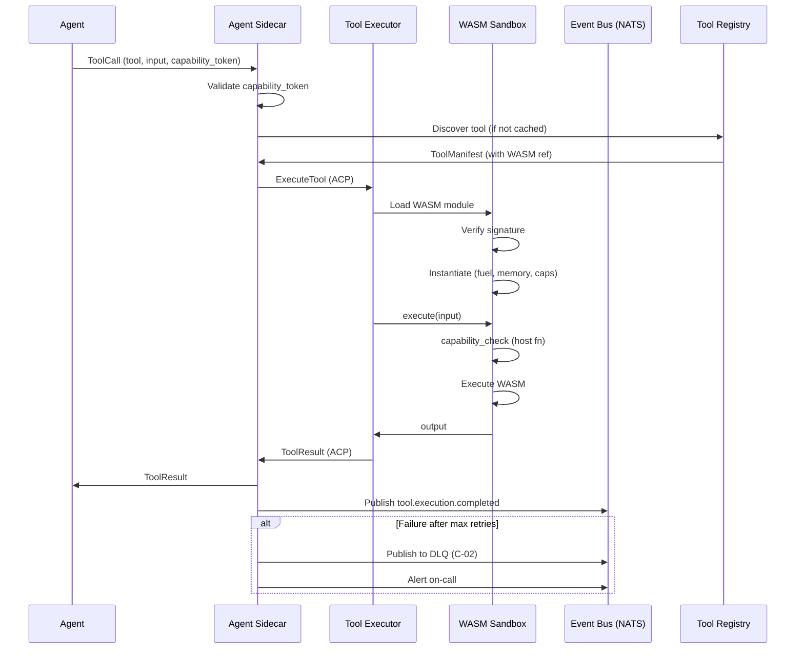
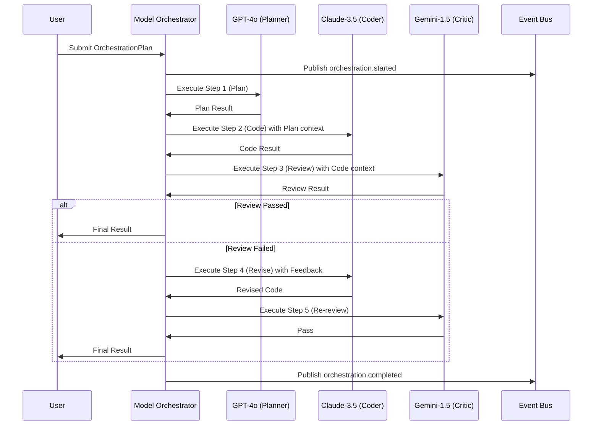
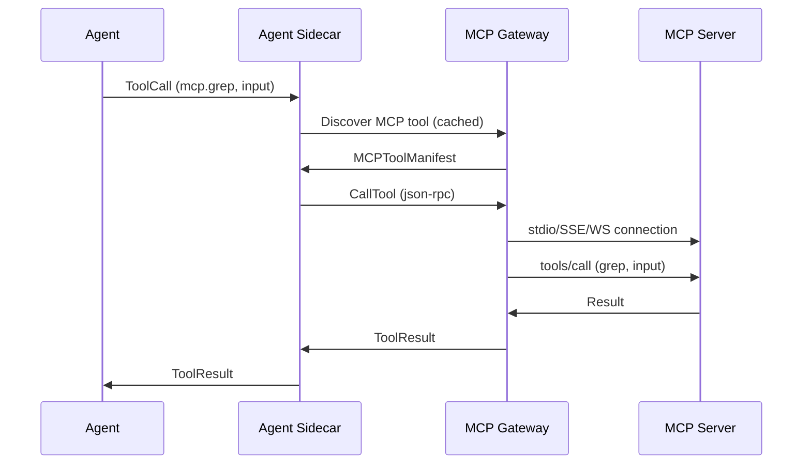

# RFC-0009
# Hermes Tool, Plugin & Provider Architecture

**Status:** Approved
**Author:** Hermes Team
**Owner:** Chief System Architect
**Version:** 1.1
**Priority:** Critical
**Depends On:** RFC-0001 (Foundation), RFC-0002 v1.1 (Core Architecture), RFC-0003 v1.1 (Event Bus), RFC-0004 v1.1 (Gateway), RFC-0005 v1.1 (Memory Architecture), RFC-0006 v1.1 (Knowledge Architecture), RFC-0007 v1.1 (Security & Identity Architecture), RFC-0008 v1.1 (Agent Runtime & Orchestration Architecture)

---

## 1. Purpose

This RFC defines the **Hermes Tool, Plugin & Provider Architecture** — the extensibility framework that enables Hermes Agent OS to discover, load, secure, execute, and manage tools, plugins, MCP servers, and AI providers.

Tools, Plugins, and Providers are **first-class extensibility components** of Hermes Agent OS:
- **Tools** — Executable units (code, git, http, knowledge, memory) invoked by agents via WASM sandbox
- **Plugins** — Extensible agent behaviors (custom specialists, workflows, hooks) loaded as WASM components
- **Providers** — AI model and service adapters (LLM, embeddings, TTS, STT, vision) with routing and fallback
- **MCP Servers** — Model Context Protocol servers exposing tools/resources to agents

The architecture provides: **registry & discovery**, **capability-based access**, **WASM sandbox execution**, **provider routing & fallback**, **multi-model orchestration**, **resource quotas**, **security & permissions**, **versioning**, and **event-driven lifecycle**.

---

## 2. Scope

| In Scope | Out of Scope |
|----------|-------------|
| Tool architecture & execution | Agent business logic |
| Plugin architecture & loading | Core runtime implementation |
| Provider architecture & routing | NATS/Event Bus implementation |
| Tool/Plugin/Provider registries | Database/storage implementation |
| Capability discovery | Authentication system (RFC-0007) |
| WASM sandbox execution | UI/UX design |
| MCP server integration | Observability stack (RFC-0010) |
| Provider routing & fallback | Automation rules (RFC-0011) |
| Multi-model orchestration | |
| Streaming execution | |
| Resource quotas | |
| Security & permissions | |
| Versioning & compatibility | |
| Event integration (RFC-0003) | |
| Runtime integration (RFC-0008) | |
| Memory/Knowledge integration | |
| Security integration (RFC-0007) | |
| gRPC APIs | |
| Performance targets & diagrams | |

---

## 3. Design Principles

| Principle | Description |
|-----------|-------------|
| **Capability-First** | Every tool/plugin/provider declares capabilities; access granted via PASETO tokens (RFC-0007) |
| **WASM-First Execution** | Tools & plugins execute in Wasmtime + WASI 0.2 sandbox; no native code execution |
| **Registry-Centric** | All extensibility components registered, discovered, and versioned via central registries |
| **MCP-Native** | Model Context Protocol is the standard for external tool/server integration |
| **Provider-Agnostic Routing** | LLM/embedding providers swappable; routing with fallback, circuit breaker, quotas |
| **Multi-Model Orchestration** | Agents can chain multiple models (e.g., planner→specialist→critic) with context passing |
| **Resource Quotas** | Per-tenant, per-agent, per-tool limits on CPU, memory, tokens, calls |
| **Security by Default** | SPIFFE mTLS for all component communication; capability tokens required for every action |
| **Event-Driven Lifecycle** | All state changes published to NATS (RFC-0003) |
| **Backward Compatibility** | Semantic versioning with compatibility matrix; graceful degradation |
| **Health-Aware Operations** | Standard health checks for all components; automatic failure detection |
| **Resilient by Default** | Dead letter queues, circuit breakers, fallback chains, graceful degradation |

---

## 4. High-Level Architecture

```
+----------------------------------------------------------------------------------+
|                     HERMES EXTENSIBILITY PLANE                                   |
|                                                                                  |
|  +-------------------+  +-------------------+  +-------------------+              |
|  |   TOOL REGISTRY   |  |  PLUGIN REGISTRY  |  | PROVIDER REGISTRY |              |
|  |                   |  |                   |  |                   |              |
|  | * Manifests       |  | * Manifests       |  | * Manifests       |              |
|  | * Discovery       |  | * Discovery       |  | * Discovery       |              |
|  | * Capabilities    |  | * Capabilities    |  | * Capabilities    |              |
|  | * Versions        |  | * Versions        |  | * Versions        |              |
|  +--------+----------+  +--------+----------+  +--------+----------+              |
|           |                      |                      |                        |
|           v                      v                      v                        |
|  +-------------------+  +-------------------+  +-------------------+              |
|  |   TOOL EXECUTOR   |  |  PLUGIN LOADER    |  |  PROVIDER ROUTER  |              |
|  |                   |  |                   |  |                   |              |
|  | * WASM Sandbox    |  | * WASM Component  |  | * Routing Engine  |              |
|  | * Capability Check|  | * Capability Check|  | * Circuit Breaker |              |
|  | * Resource Quota  |  | * Resource Quota  |  | * Fallback Chain  |              |
|  | * Streaming       |  | * Hooks           |  | * Token Budget    |              |
|  +--------+----------+  +--------+----------+  +--------+----------+              |
|           |                      |                      |                        |
|           +----------+-----------+----------+-----------+                        |
|                      |           |           |                              |
|                      v           v           v                              |
|           +----------------------------------------------------------------+ |
|           |                    CAPABILITY ENFORCEMENT LAYER                | |
|           |  (PASETO tokens, SPIFFE mTLS, Rate limits, Audit logging)      | |
|           +----------------------------------------------------------------+ |
|                                                                              |
+----------------------------------------------------------------------------------+
                              |
                              v
+----------------------------------------------------------------------------------+
|                         RUNTIME INTEGRATION (RFC-0008)                          |
|                                                                                  |
|  Agent Runtime ──▶ Tool Execution (Agent Communication Protocol) (ACP) ──▶ Tool Executor (WASM)                |
|       │                    │                              │                      |
|       │                    │                              ▼                      |
|       │              Streaming/                        Result                    |
|       │              Sync/Async                                                |
|       ▼                                                                      |
|  Capability Check ◀── PASETO Token ◀── Agent Sidecar                          |
|                                                                                  |
+----------------------------------------------------------------------------------+
                              |
                              v
+----------------------------------------------------------------------------------+
|                      EVENT BUS (RFC-0003) / SECURITY (RFC-0007)                  |
|                                                                                  |
|  NATS JetStream: tool.lifecycle, plugin.lifecycle, provider.lifecycle,          |
|  execution.events, capability.granted/revoked, quota.exceeded, audit.log        |
|                                                                                  |
+----------------------------------------------------------------------------------+
```

---

## 5. Tool Architecture

### 5.1 Tool Definition

A **Tool** is an executable unit that performs a specific function (code execution, git operations, HTTP requests, knowledge search, memory operations). Tools are:

- **Declarative**: Defined via manifest (Section 8)
- **Capability-Gated**: Require specific capability token to execute (RFC-0007)
- **WASM-Sandboxed**: Execute in Wasmtime + WASI 0.2; no native code
- **Streaming-Capable**: Support both synchronous and streaming execution
- **Idempotent-Aware**: Declare idempotency for safe retries
- **Resource-Constrained**: Subject to CPU, memory, token, time quotas

### 5.2 Tool Categories

| Category | Examples | Capability Prefix | Typical Timeout |
|----------|----------|-------------------|-----------------|
| **Code** | execute, analyze, test, lint | `code.*` | 120s |
| **Git** | read, write, diff, log, blame | `git.*` | 60s |
| **HTTP** | request, websocket | `network.egress` | 30s |
| **Knowledge** | search, retrieve, ingest, graph | `knowledge.*` | 30s |
| **Memory** | working_set/get, episodic_record/query, semantic_upsert/search | `memory.*` | 10s |
| **File** | read, write, list, glob | `file.*` | 30s |
| **Shell** | exec (restricted) | `shell.*` | 60s |
| **Custom** | Domain-specific tools | `custom.*` | Configurable |

### 5.3 Tool Execution Interface (WASM Component Model)

```wit
// Tool interface (WASM component model)
interface Tool {
  // Execute tool with input, return output
  execute: func(input: bytes) -> result<bytes, tool-error>;
  
  // Get tool metadata
  metadata: func() -> tool-metadata;
  
  // Validate input without executing
  validate: func(input: bytes) -> result<(), validation-error>;
  
  // Stream execution (optional)
  execute-stream: func(input: bytes) -> stream<bytes, tool-error>;
}

record tool-metadata {
  name: string,
  version: string,
  description: string,
  input-schema: json-schema,
  output-schema: json-schema,
  capabilities-required: list<string>,
  idempotent: bool,
  timeout-ms: u32,
  streaming: bool,
  resource-limits: resource-limits,
}

record resource-limits {
  max-cpu-ms: u32,
  max-memory-mb: u32,
  max-output-mb: u32,
}

variant tool-error {
  timeout,
  resource-exceeded,
  capability-denied,
  validation-failed,
  execution-failed(string),
  not-found,
  internal(string),
}

variant validation-error {
  schema-mismatch(string),
  missing-field(string),
  type-mismatch(string),
}
```

### 5.4 Built-in Tools

| Tool | Capability | Idempotent | Streaming | Timeout | Description |
|------|------------|------------|-----------|---------|-------------|
| `code.execute` | `code.exec` | No | Yes | 120s | Execute code in sandbox |
| `code.analyze` | `code.analyze` | Yes | No | 60s | Static analysis |
| `code.test` | `code.exec` | Yes | Yes | 180s | Run tests |
| `git.read` | `git.read` | Yes | No | 30s | Read file/history |
| `git.write` | `git.write` | No | No | 60s | Write/commit |
| `git.diff` | `git.read` | Yes | No | 30s | Show diff |
| `http.request` | `network.egress` | Configurable | Yes | 30s | HTTP requests |
| `http.websocket` | `network.egress` | No | Yes | 300s | WebSocket |
| `knowledge.search` | `knowledge.search` | Yes | Yes | 30s | Hybrid search |
| `knowledge.retrieve` | `knowledge.search` | Yes | No | 10s | Get document |
| `knowledge.ingest` | `knowledge.ingest` | No | No | 120s | Ingest source |
| `knowledge.graph` | `knowledge.search` | Yes | Yes | 30s | Graph query |
| `memory.working.set` | `memory.write` | No | No | 10s | Set working mem |
| `memory.working.get` | `memory.read` | Yes | No | 10s | Get working mem |
| `memory.episodic.record` | `memory.write` | No | No | 10s | Record episode |
| `memory.episodic.query` | `memory.read` | Yes | Yes | 30s | Query episodes |
| `memory.semantic.upsert` | `memory.write` | No | No | 10s | Upsert pattern |
| `memory.semantic.search` | `memory.read` | Yes | Yes | 30s | Search patterns |
| `file.read` | `file.read` | Yes | Yes | 10s | Read file |
| `file.write` | `file.write` | No | No | 10s | Write file |
| `file.list` | `file.read` | Yes | Yes | 10s | List directory |
| `shell.exec` | `shell.exec` | No | Yes | 60s | Shell command |

---

## 6. Plugin Architecture

### 6.1 Plugin Definition

A **Plugin** is an extensible behavior that can be loaded into the Agent Runtime to provide:
- **Custom Specialists** — Domain-specific agent implementations
- **Workflow Hooks** — Pre/post execution, compensation, approval logic
- **Custom Tools** — Tools bundled with plugin (loaded via Tool Registry)
- **Event Handlers** — React to NATS events (lifecycle, audit, quota)
- **Policy Extensions** — Custom Cedar/OPA policies for authorization

Plugins are **WASM Components** (not full agents) that expose specific interfaces.

### 6.2 Plugin Types

| Type | Interface | Use Case |
|------|-----------|----------|
| **Specialist** | `SpecialistPlugin` | Custom agent behavior (e.g., `kubernetes-specialist`, `terraform-specialist`) |
| **WorkflowHook** | `WorkflowHookPlugin` | Pre-step, post-step, compensation, approval logic |
| **ToolBundle** | `ToolBundlePlugin` | Bundle of related tools (e.g., `aws-tools`, `k8s-tools`) |
| **EventHandler** | `EventHandlerPlugin` | React to `agent.spawn`, `task.completed`, `quota.exceeded` |
| **Policy** | `PolicyPlugin` | Custom Cedar/OPA policies |

### 6.3 Plugin Interface (WASM Component Model)

```wit
// Base plugin interface
interface Plugin {
  // Initialize plugin with configuration
  init: func(config: json) -> result<(), plugin-error>;
  
  // Get plugin metadata
  metadata: func() -> plugin-metadata;
  
  // Health check
  health: func() -> result<plugin-health, plugin-error>;
  
  // Shutdown gracefully
  shutdown: func() -> result<(), plugin-error>;
}

// Specialist plugin
interface SpecialistPlugin {
  // Execute specialist task
  execute: func(input: specialist-input) -> result<specialist-output, plugin-error>;
  
  // Stream execution
  execute-stream: func(input: specialist-input) -> stream<specialist-chunk, plugin-error>;
  
  // Get required capabilities
  capabilities: func() -> list<string>;
}

// Workflow hook plugin
interface WorkflowHookPlugin {
  // Pre-step hook
  pre-step: func(context: hook-context) -> result<hook-result, plugin-error>;
  
  // Post-step hook
  post-step: func(context: hook-context, result: step-result) -> result<hook-result, plugin-error>;
  
  // Compensation hook
  compensate: func(context: hook-context, failed-step: step-id) -> result<compensation-result, plugin-error>;
  
  // Approval hook
  on-approval: func(context: hook-context, approval: approval-request) -> result<approval-decision, plugin-error>;
}

// Tool bundle plugin
interface ToolBundlePlugin {
  // List tools provided by this bundle
  tools: func() -> list<tool-metadata>;
  
  // Create tool instance
  create-tool: func(name: string) -> result<Tool, plugin-error>;
}
```

### 6.4 Plugin Lifecycle

```
PLUGIN DISCOVERED
       │
       ▼
PLUGIN REGISTERED (manifest validated, capabilities checked)
       │
       ▼
PLUGIN LOADED (WASM module instantiated, init() called)
       │
       ▼
PLUGIN ACTIVE (available for agent assignment, tool creation, hooks)
       │
       ├──▶ PLUGIN UPDATED (new version, rolling reload)
       │
       ├──▶ PLUGIN DISABLED (capabilities revoked, no new assignments)
       │
       └──▶ PLUGIN UNLOADED (shutdown() called, resources released)
              │
              ▼
         PLUGIN TERMINATED
```

### 6.5 Plugin Security

- **WASM Isolation**: Plugins execute in same WASM sandbox as tools
- **Capability Tokens**: Plugin receives subset of agent's capabilities
- **Resource Quotas**: CPU, memory, execution time limits per plugin
- **Audit Logging**: All plugin actions logged to Merkle transparency log (RFC-0007)
- **Supply Chain**: Plugins signed and verified (sigstore/cosign) before load

### 6.6 Plugin Hook Timeout & Cancellation (H-06)

| Hook Type | Default Timeout | Cancellation Behavior |
|-----------|-----------------|----------------------|
| `pre-step` | 30s | Abort step; return error to workflow |
| `post-step` | 30s | Log error; continue workflow |
| `compensate` | 300s | Retry up to 3x; escalate on failure |
| `on-approval` | 24h | Auto-reject on timeout |

- Hooks receive `CancellationToken` via `hook-context`
- On cancellation: return partial results if possible, mark `hook-result` as `cancelled`
- Workflow orchestrator decides: retry, skip, or fail workflow

---

## 7. Provider Architecture

### 7.1 Provider Definition

A **Provider** is an adapter for external AI models and services:
- **LLM Providers**: OpenAI, Anthropic, Google Vertex, Ollama, vLLM, custom
- **Embedding Providers**: OpenAI, Cohere, Voyage, local (sentence-transformers)
- **TTS Providers**: ElevenLabs, OpenAI, Azure, local (Piper)
- **STT Providers**: OpenAI Whisper, AssemblyAI, Deepgram, local (faster-whisper)
- **Vision Providers**: GPT-4V, Claude 3, Gemini, local (LLaVA)
- **Custom Providers**: Any service implementing Provider interface

### 7.2 Provider Capabilities

| Capability | Description | Example Providers |
|------------|-------------|-------------------|
| `llm.chat` | Chat completion with tools | OpenAI, Anthropic, Vertex |
| `llm.completion` | Text completion | OpenAI, Ollama |
| `llm.streaming` | Streaming token output | All LLM providers |
| `embedding.dense` | Dense vector embeddings | OpenAI, Cohere, local |
| `embedding.sparse` | Sparse (SPLADE) embeddings | Voyage, custom |
| `tts.synthesize` | Text-to-speech | ElevenLabs, OpenAI |
| `stt.transcribe` | Speech-to-text | Whisper, AssemblyAI |
| `vision.analyze` | Image analysis | GPT-4V, Claude 3, LLaVA |
| `rerank` | Cross-encoder reranking | Cohere, Voyage, local |
| `moderation` | Content moderation | OpenAI, Perspective API |

### 7.3 Provider Interface (C-05) (C-05)

```protobuf
service Provider {
  // Chat completion (non-streaming)
  rpc Chat(ChatRequest) returns (ChatResponse);
  
  // Chat completion (streaming)
  rpc ChatStream(ChatRequest) returns (stream ChatChunk);
  
  // Embeddings
  rpc Embed(EmbedRequest) returns (EmbedResponse);
  
  // Text-to-speech
  rpc Synthesize(TTSRequest) returns (TTSResponse);
  
  // Speech-to-text
  rpc Transcribe(STTRequest) returns (STTResponse);
  
  // Vision analysis
  rpc AnalyzeVision(VisionRequest) returns (VisionResponse);
  
  // Rerank
  rpc Rerank(RerankRequest) returns (RerankResponse);
  
  // Moderation
  rpc Moderate(ModerationRequest) returns (ModerationResponse);
  
  // Health check
  rpc Health(HealthRequest) returns (HealthResponse);
  
  // Get provider metadata
  rpc Metadata(MetadataRequest) returns (ProviderMetadata);
}

message ChatRequest {
  string provider_id = 1;
  string model = 2;
  repeated Message messages = 3;
  ChatParameters params = 4;
  map<string, string> metadata = 5;  // tracing, tenant, capability_token
}

message ChatResponse {
  string response_id = 1;
  repeated Choice choices = 2;
  Usage usage = 3;
  int64 latency_ms = 4;
}

message ChatChunk {
  string chunk_id = 1;
  int32 index = 2;
  Choice delta = 3;
  bool done = 4;
  Usage usage = 5;
}

message ProviderMetadata {
  string provider_id = 1;
  string name = 2;
  string version = 3;
  repeated Capability capabilities = 4;
  repeated ModelInfo models = 5;
  map<string, string> config_schema = 6;
  map<string, string> limits = 7;  // rpm, tpm, max_tokens, etc.
}
```

### 7.4 Provider Routing & Fallback

```
AGENT REQUEST
      │
      ▼
+---------------------------+
|   PROVIDER ROUTER         |
|  (RFC-0008 Section 23.3)  |
+---------------------------+
      │
      ▼
+---------------------------+
|  ROUTING RULES            |
|  • Capability match       |
|  • Model preference       |
|  • Tenant policy          |
|  • Cost optimization      |
|  • Latency targets        |
+---------------------------+
      │
      ▼
+---------------------------+
|  FALLBACK CHAIN           |
|  Primary: openai-gpt4o    |
|  Fallback 1: anthropic-3.5|
|  Fallback 2: ollama-llama3|
+---------------------------+
      │
      ▼
+---------------------------+
|  CIRCUIT BREAKER          |
|  5 errors/10s → open 30s  |
|  Half-open after 30s      |
+---------------------------+
      │
      ▼
+---------------------------+
|  TOKEN BUDGET             |
|  Per-task / per-tenant    |
|  Enforced before call     |
+---------------------------+
```

### 7.5 Multi-Model Orchestration

Agents can chain multiple models in a single workflow:

```
PLANNER (GPT-4o)          SPECIALIST (Claude-3.5)          CRITIC (Gemini-1.5)
     │                          │                              │
     ├──── Plan ───────────────▶│                              │
     │                          │                              │
     │                    ┌──────┴──────┐                      │
     │                    ▼             ▼                      │
     │             Code Gen        Code Review                 │
     │                    │             │                      │
     │                    └──────┬──────┘                      │
     │                          ▼                              │
     │                    ┌─────────────┐                      │
     │                    │  CRITIC     │                      │
     │                    │  (Gemini)   │                      │
     │                    └──────┬──────┘                      │
     │                          │                              │
     ◀─────── Final Result ─────┘                              │
```

**Orchestration Rules:**
- Context passed between models via structured handoff
- Each model call tracked in token budget
- Fallback applies per-model, not per-chain
- Streaming supported at each step

### 7.6 Provider Resilience (from RFC-0008 Section 23.3)

| Mechanism | Implementation |
|-----------|----------------|
| **Fallback Chain** | Ordered list per capability; auto-advance on error |
| **Circuit Breaker** | 5 errors in 10s → open 30s; half-open test request |
| **Timeout** | Per-request; configurable per provider/model |
| **Token Budget** | Per-task + per-tenant; enforced by Router |
| **Streaming** | SSE for real-time tokens; backpressure handling |
| **Retry** | Exponential backoff (1s, 2s, 4s) + jitter |
| **Hedging** | Duplicate request to 2nd provider if p99 latency exceeded |

---

## 8. Tool Registry

### 8.1 Registry Responsibilities

| Responsibility | Description |
|----------------|-------------|
| **Manifest Storage** | Store tool manifests (PostgreSQL + S3 for WASM modules) |
| **Discovery** | Query by name, capability, category, version |
| **Capability Index** | Inverted index: capability → tool list |
| **Version Management** | Semantic versioning; compatibility matrix |
| **WASM Module Storage** | S3 for module binaries; PostgreSQL for metadata |
| **Signature Verification** | Verify WASM module signatures (sigstore) |
| **Capability Validation** | Check capabilities against Security Service (RFC-0007) |
| **Lifecycle Events** | Publish `tool.lifecycle` events to NATS |
| **Health Monitoring** | Active health checks for registered tools (C-01) |
| **Multi-Tenant Isolation** | tenant_id namespace; row-level security; cross-tenant queries forbidden (C-04) |

### 8.2 Tool Registry API

```protobuf
service ToolRegistry {
  // Register new tool
  rpc RegisterTool(RegisterToolRequest) returns (ToolManifest);
  
  // Update tool (new version)
  rpc UpdateTool(UpdateToolRequest) returns (ToolManifest);
  
  // Deregister tool
  rpc DeregisterTool(DeregisterToolRequest) returns (DeregisterToolResponse);
  
  // Get tool by ID
  rpc GetTool(GetToolRequest) returns (ToolManifest);
  
  // List tools with filters
  rpc ListTools(ListToolsRequest) returns (ListToolsResponse);
  
  // Discover tools by capability
  rpc DiscoverTools(DiscoverToolsRequest) returns (DiscoverToolsResponse);
  
  // Watch for changes
  rpc WatchTools(WatchToolsRequest) returns (stream ToolManifestEvent);
  
  // Download WASM module
  rpc DownloadModule(DownloadModuleRequest) returns (stream ModuleChunk);
  
  // Verify module signature
  rpc VerifyModule(VerifyModuleRequest) returns (VerifyModuleResponse);
  
  // Health check (C-01)
  rpc HealthCheck(HealthCheckRequest) returns (HealthCheckResponse);
}

message ToolManifest {
  string tool_id = 1;                    // tool:{name}:{version}
  string name = 2;                       // e.g., "code.execute"
  string category = 3;                   // code, git, http, knowledge, memory, file, shell, custom
  string version = 4;                    // Semantic version
  string description = 5;
  ToolMetadata metadata = 6;             // From WASM module
  repeated string capabilities = 7;      // Required capabilities
  string wasm_module_ref = 8;            // S3 reference
  string signature = 9;                  // Module signature
  map<string, string> labels = 10;
  int64 created_at_us = 11;
  int64 updated_at_us = 12;
  ToolStatus status = 13;                // ACTIVE, DEPRECATED, DISABLED
}

message DiscoverToolsRequest {
  string tenant_id = 1;
  repeated string capabilities = 2;      // Must have ALL
  string category = 3;                   // Optional filter
  string version_constraint = 4;         // e.g., ">=1.0.0 <2.0.0"
  bool include_deprecated = 5;
}

message ToolManifestEvent {
  string event_type = 1;  // CREATED, UPDATED, DEPRECATED, DISABLED, DELETED
  ToolManifest tool = 2;
  int64 timestamp_us = 3;
}
```

### 8.3 NATS Subjects

```
tool.lifecycle.{created|updated|deprecated|disabled|deleted}
Subject: hermes.{tenant}.tool.manifest.{event}
Payload: ToolManifest
```

---

## 9. Plugin Registry

### 9.1 Registry Responsibilities

| Responsibility | Description |
|----------------|-------------|
| **Manifest Storage** | Plugin manifests (PostgreSQL) + WASM components (S3) |
| **Discovery** | Query by type, capability, category, version |
| **Type Index** | By plugin type (Specialist, Hook, ToolBundle, EventHandler, Policy) |
| **Version Management** | Semantic versioning; compatibility with Agent Runtime versions |
| **WASM Component Storage** | S3 for component binaries; PostgreSQL for metadata |
| **Signature Verification** | Verify plugin signatures (sigstore) |
| **Capability Validation** | Check against Security Service |
| **Dependency Resolution** | Resolve plugin dependencies (other plugins, tools) |
| **Lifecycle Events** | Publish `plugin.lifecycle` events |
| **Health Monitoring** | Active health checks (C-01) |
| **Multi-Tenant Isolation** | tenant_id namespace; row-level security; cross-tenant queries forbidden (C-04) |

### 9.2 Plugin Registry API

```protobuf
service PluginRegistry {
  rpc RegisterPlugin(RegisterPluginRequest) returns (PluginManifest);
  rpc UpdatePlugin(UpdatePluginRequest) returns (PluginManifest);
  rpc DeregisterPlugin(DeregisterPluginRequest) returns (DeregisterPluginResponse);
  rpc GetPlugin(GetPluginRequest) returns (PluginManifest);
  rpc ListPlugins(ListPluginsRequest) returns (ListPluginsResponse);
  rpc DiscoverPlugins(DiscoverPluginsRequest) returns (DiscoverPluginsResponse);
  rpc WatchPlugins(WatchPluginsRequest) returns (stream PluginManifestEvent);
  rpc DownloadComponent(DownloadComponentRequest) returns (stream ComponentChunk);
  rpc VerifyComponent(VerifyComponentRequest) returns (VerifyComponentResponse);
  rpc ResolveDependencies(ResolveDependenciesRequest) returns (ResolveDependenciesResponse);
  rpc HealthCheck(HealthCheckRequest) returns (HealthCheckResponse);
}

message PluginManifest {
  string plugin_id = 1;                  // plugin:{name}:{version}
  string name = 2;
  PluginType type = 3;                   // SPECIALIST, WORKFLOW_HOOK, TOOL_BUNDLE, EVENT_HANDLER, POLICY
  string version = 4;
  string description = 5;
  PluginMetadata metadata = 6;           // From WASM component
  repeated string capabilities = 7;      // Required capabilities
  repeated string provides_capabilities = 8;  // Capabilities this plugin provides
  repeated string dependencies = 9;      // Required plugins/tools
  string wasm_component_ref = 10;        // S3 reference
  string signature = 11;                 // Component signature
  map<string, string> labels = 12;
  repeated string compatible_runtime_versions = 13;  // e.g., ">=1.0.0 <2.0.0"
  int64 created_at_us = 14;
  int64 updated_at_us = 15;
  PluginStatus status = 16;              // ACTIVE, DEPRECATED, DISABLED
}

enum PluginType {
  SPECIALIST = 0;
  WORKFLOW_HOOK = 1;
  TOOL_BUNDLE = 2;
  EVENT_HANDLER = 3;
  POLICY = 4;
}

message DiscoverPluginsRequest {
  string tenant_id = 1;
  PluginType type = 2;
  repeated string capabilities = 3;
  repeated string provides_capabilities = 4;
  string version_constraint = 5;
}

message PluginManifestEvent {
  string event_type = 1;  // CREATED, UPDATED, DEPRECATED, DISABLED, DELETED
  PluginManifest plugin = 2;
  int64 timestamp_us = 3;
}
```

### 9.3 Plugin Dependency Resolution (C-06)

**Algorithm:**
1. **Topological Sort** — Build dependency graph; detect cycles
2. **SemVer Constraint Solving** — For each dependency, find latest version satisfying all constraints
3. **Conflict Detection** — No two plugins provide same capability at different versions
4. **Load Order** — Dependencies loaded before dependents
5. **Circular Dependency Detection** — Fail fast with `CIRCULAR` conflict type

**Conflict Types:**
- `VERSION_MISMATCH` — No version satisfies all constraints
- `CIRCULAR` — Dependency cycle detected
- `CAPABILITY_CONFLICT` — Two plugins provide same capability at different versions

### 9.4 NATS Subjects

```
plugin.lifecycle.{created|updated|deprecated|disabled|deleted}
Subject: hermes.{tenant}.plugin.manifest.{event}
Payload: PluginManifest
```

---

## 10. Provider Registry

### 10.1 Registry Responsibilities

| Responsibility | Description |
|----------------|-------------|
| **Manifest Storage** | Provider manifests (PostgreSQL) |
| **Discovery** | Query by capability, model, provider_id |
| **Capability Index** | capability → provider list |
| **Model Catalog** | Track available models per provider |
| **Health Monitoring** | Periodic health checks; publish status |
| **Routing Configuration** | Fallback chains, circuit breaker config, routing rules |
| **Quota Management** | Per-provider RPM/TPM limits, token budgets |
| **Credential Management** | Vault references for API keys |
| **Lifecycle Events** | Publish `provider.lifecycle` events |
| **Multi-Tenant Isolation** | tenant_id namespace; row-level security; cross-tenant queries forbidden (C-04) |

### 10.2 Provider Registry API

```protobuf
service ProviderRegistry {
  rpc RegisterProvider(RegisterProviderRequest) returns (ProviderManifest);
  rpc UpdateProvider(UpdateProviderRequest) returns (ProviderManifest);
  rpc DeregisterProvider(DeregisterProviderRequest) returns (DeregisterProviderResponse);
  rpc GetProvider(GetProviderRequest) returns (ProviderManifest);
  rpc ListProviders(ListProvidersRequest) returns (ListProvidersResponse);
  rpc DiscoverProviders(DiscoverProvidersRequest) returns (DiscoverProvidersResponse);
  rpc WatchProviders(WatchProvidersRequest) returns (stream ProviderManifestEvent);
  rpc UpdateRouting(UpdateRoutingRequest) returns (UpdateRoutingResponse);
  rpc GetRouting(GetRoutingRequest) returns (RoutingConfig);
  rpc HealthCheck(HealthCheckRequest) returns (HealthCheckResponse);
}

message ProviderManifest {
  string provider_id = 1;                // e.g., "openai", "anthropic", "vertex", "ollama", "custom"
  string name = 2;
  string version = 3;
  string description = 4;
  repeated ProviderCapability capabilities = 5;
  repeated ModelInfo models = 6;
  // Example provider_ids: "openai", "anthropic", "vertex", "ollama", "custom"
  // Example provider_ids: "openai", "anthropic", "vertex", "ollama", "custom"
  map<string, string> config_schema = 7;  // JSON Schema for config
  string vault_secret_path = 8;           // Vault path for API keys
  map<string, string> limits = 9;         // rpm, tpm, max_tokens, etc.
  ProviderStatus status = 10;            // ACTIVE, DEGRADED, DOWN, MAINTENANCE
  map<string, string> labels = 11;
  int64 created_at_us = 12;
  int64 updated_at_us = 13;
}

message ProviderCapability {
  string capability = 1;                 // llm.chat, embedding.dense, etc.
  repeated string models = 2;            // Models supporting this capability
  map<string, string> parameters = 3;    // Capability-specific params
}

message ModelInfo {
  string model_id = 1;
  string name = 2;
  repeated string capabilities = 3;
  int32 max_tokens = 4;
  int32 max_context = 5;
  map<string, string> pricing = 6;       // input/output per 1k tokens
  map<string, string> limits = 7;
}

message DiscoverProvidersRequest {
  repeated string capabilities = 1;
  string model = 2;
  string provider_id = 3;
  ProviderStatus status_filter = 4;      // Only ACTIVE by default
}

message RoutingConfig {
  map<string, FallbackChain> capability_routes = 1;  // capability → fallback chain
  map<string, CircuitBreakerConfig> circuit_breakers = 2;
  map<string, RoutingRule> routing_rules = 3;        // tenant/model → provider
  map<string, TokenBudget> token_budgets = 4;        // per-tenant budgets
}

message FallbackChain {
  repeated string provider_ids = 1;      // Ordered: primary, fallback1, fallback2...
}

message CircuitBreakerConfig {
  int32 error_threshold = 1;             // Default: 5
  int32 window_seconds = 2;              // Default: 10
  int32 open_duration_seconds = 3;       // Default: 30
  int32 half_open_requests = 4;          // Default: 1
}

message RoutingRule {
  string condition = 1;                  // CEL expression
  string target_provider = 2;
  int32 priority = 3;
}

message TokenBudget {
  string tenant_id = 1;
  int64 tokens_per_hour = 2;
  int64 tokens_per_day = 3;
  int64 tokens_per_month = 4;
}

message ProviderManifestEvent {
  string event_type = 1;  // CREATED, UPDATED, DEGRADED, DOWN, MAINTENANCE, DELETED
  ProviderManifest provider = 2;
  int64 timestamp_us = 3;
}
```

### 10.3 NATS Subjects

```
provider.lifecycle.{created|updated|degraded|down|maintenance|deleted}
Subject: hermes.{tenant}.provider.manifest.{event}
Payload: ProviderManifest

provider.health.{healthy|degraded|down}
Subject: hermes.{tenant}.provider.health.{event}
Payload: {provider_id, status, latency_ms, timestamp}
```

---

## 11. Capability Discovery

### 11.1 Unified Capability Index

All three registries contribute to a **Unified Capability Index** (UCI) maintained by the Capability Discovery Service:

```
+-------------------------+
|  CAPABILITY DISCOVERY   |
|                         |
|  Tool Registry    ─────▶│
|  Plugin Registry  ─────▶│  -->  Unified Capability Index
|  Provider Registry─────▶│
|                         |
|  Query: capability      |
|  → {tools, plugins,    │
|     providers}          │
+-------------------------+
```

### 11.2 Capability Discovery API

```protobuf
service CapabilityDiscovery {
  // Discover all components providing a capability
  rpc DiscoverByCapability(DiscoverByCapabilityRequest) returns (DiscoverByCapabilityResponse);
  
  // Get capability compatibility matrix
  rpc GetCompatibilityMatrix(GetCompatibilityMatrixRequest) returns (CompatibilityMatrix);
  
  // Search components by natural language
  rpc SearchComponents(SearchComponentsRequest) returns (SearchComponentsResponse);
  
  // Get capability dependencies
  rpc GetCapabilityDependencies(GetCapabilityDependenciesRequest) returns (CapabilityDependencies);
}

message DiscoverByCapabilityRequest {
  string tenant_id = 1;
  string capability = 2;                 // e.g., "code.exec", "llm.chat"
  ComponentType component_type = 3;      // TOOL, PLUGIN, PROVIDER, ALL
  string version_constraint = 4;
  bool include_deprecated = 5;
}

enum ComponentType {
  TOOL = 0;
  PLUGIN = 1;
  PROVIDER = 2;
  ALL = 3;
}

message DiscoverByCapabilityResponse {
  repeated ToolManifest tools = 1;
  repeated PluginManifest plugins = 2;
  repeated ProviderManifest providers = 3;
}

message CompatibilityMatrix {
  map<string, ComponentVersionRange> capability_versions = 1;  // capability → min/max versions
  map<string, repeated string> conflicts = 2;                  // capability → conflicting capabilities
  map<string, repeated string> requires = 3;                   // capability → required capabilities
}

message CapabilityDependencies {
  string capability = 1;
  repeated string direct_requires = 2;
  repeated string transitive_requires = 3;
}
```

### 11.3 Agent Runtime Integration (RFC-0008)

When an agent needs a capability:
1. Agent requests capability via sidecar
2. Sidecar queries CapabilityDiscovery
3. Returns available tools/plugins/providers
4. Agent selects component (or Runtime auto-selects)
5. Capability token granted for selected component
6. Execution proceeds with token validation

### 11.4 Capability Discovery Search (H-01)

| Aspect | Specification |
|--------|---------------|
| **Query Syntax** | `field:value` (exact), `field:*value*` (wildcard), `text` (fuzzy) |
| **Fields** | `name`, `capability`, `category`, `type`, `version`, `tenant` |
| **Ranking** | 1) Exact capability match, 2) Prefix match, 3) Fuzzy text, 4) Capability overlap |
| **Pagination** | `limit` (max 100), `offset`, `cursor` for deep pagination |
| **Caching** | 5s TTL per tenant+query; invalidated on registry changes |

---

## 12. MCP Integration

### 12.1 MCP Server Integration

**Model Context Protocol (MCP)** servers are external services that expose tools and resources to agents. Hermes treats MCP servers as **first-class tool providers**.

```
+------------------+     MCP Protocol      +------------------+
|   AGENT RUNTIME  |◀─────────────────────▶|   MCP SERVER     |
|                  |   (JSON-RPC 2.0)      |                  |
|  • Capability    |                       |  • Tools         |
|    Token         |                       |  • Resources     |
|  • ACP Client    |                       |  • Prompts       |
+------------------+                       +------------------+
       │
       ▼
+------------------+
|  MCP GATEWAY     |
|  (Sidecar)       |
|                  |
|  • Connection    |
|    Pool          |
|  • Capability    |
|    Mapping       |
|  • Auth          |
|    Injection     |
+------------------+
```

### 12.2 MCP Server Registration

```protobuf
message MCPServerManifest {
  string server_id = 1;                    // mcp:{name}:{version}
  string name = 2;
  string version = 3;
  string description = 4;
  string transport = 5;                    // stdio, sse, websocket, http
  string endpoint = 6;                     // Command or URL
  MCPServerCapabilities capabilities = 7;   // Tools, resources, prompts provided
  map<string, string> env = 8;             // Environment variables
  map<string, string> auth = 9;            // Auth configuration
  map<string, string> labels = 10;
  int64 created_at_us = 11;
  int64 updated_at_us = 12;
  MCPServerStatus status = 13;             // ACTIVE, CONNECTING, DISCONNECTED, ERROR
}

message MCPServerCapabilities {
  repeated MCPTool tools = 1;
  repeated MCPResource resources = 2;
  repeated MCPPrompt prompts = 3;
}

message MCPTool {
  string name = 1;
  string description = 2;
  string input_schema = 3;                 // JSON Schema
  string output_schema = 4;                // JSON Schema
  repeated string hermes_capabilities = 5; // Mapped Hermes capabilities
  bool idempotent = 6;
}
```

### 12.3 MCP Gateway (C-03)

The **MCP Gateway** (sidecar component) manages:

| Feature | Specification |
|---------|---------------|
| **Connection Pooling** | Per-server pool: min 2, max 10 connections; 30s idle timeout |
| **Reconnection** | Exponential backoff: 1s, 2s, 4s, 8s, max 30s; max 5 retries |
| **Capability Mapping** | Schema: `mcp_tool_name` → `hermes_capability`; validated at registration |
| **Auth Injection** | PASETO capability token injected into JSON-RPC `meta.auth` field |
| **Protocol Translation** | JSON-RPC 2.0 `tools/call` ↔ ACP `tool.execute`; streaming `tools/call` → ACP `stream` |
| **Streaming** | MCP `streaming: true` → ACP Stream chunks; chunk size max 1MB; auto-batch small yields |
| **Rate Limiting** | Per-server (default 100 req/s), per-tool (configurable); token bucket |
| **Health Monitoring** | Ping/pong every 30s; 3 failed pings = DISCONNECTED; auto-reconnect |
| **Capability Mapping Schema** | YAML: `mcp_tool_name` → `hermes_capability`; validated at registration |
| **Auth Injection** | PASETO v4 token in `meta.auth.capability_token`; validated by MCP server |
| **Streaming Chunk Size** | Max 1MB; auto-batch small yields (<1KB) within 10ms |
| **Reconnection Logic** | Backoff: 1s, 2s, 4s, 8s, 16s, max 30s; jitter ±10%; max 5 retries then ERROR |
| **Protocol Version Negotiation** | MCP `initialize` handshake; Hermes supports 2024-11-05, 2025-03-26; fallback to 2024-11-05 |

### 12.5 MCP Server Versioning/Compatibility (H-08)

| Aspect | Specification |
|--------|---------------|
| **Protocol Negotiation** | MCP `initialize` handshake; Hermes supports 2024-11-05, 2025-03-26; fallback to 2024-11-05 |
| **Capability Deprecation** | `deprecated: true` in manifest; 90-day notice; clients warned at call time |
| **Capability Mapping** | Versioned mapping: `mcp_tool@v1` → `hermes_capability@v1` |
| **Transport Compatibility** | stdio, SSE, WebSocket, HTTP; negotiated at `initialize` |

### 12.4 MCP Tool Execution Flow

```
AGENT                           MCP GATEWAY                    MCP SERVER
  │                                │                              │
  ├──── ToolCall ────────────────▶│                              │
  │  (tool: mcp.grep, input)       │                              │
  │                                ├──── Capability Check ─────▶│
  │                                │  (map mcp.grep → cap)       │
  │                                │                              │
  │                                ├──── JSON-RPC Call ────────▶│
  │                                │  (tools/call)               │
  │                                │                              │
  │                                │◀──── JSON-RPC Result ───────│
  │                                │                              │
  │◀──── ToolResult ──────────────┤                              │
  │  (output, tokens, status)      │                              │
```

---

## 13. WASM Sandbox

### 13.1 Sandbox Architecture

```
+-----------------------------------------------------------+
|                    WASM SANDBOX (Wasmtime)                |
|                                                           |
|  +-------------------+  +-------------------+             |
|  |   TOOL INSTANCE   |  |   PLUGIN INSTANCE |             |
|  |                   |  |                   |             |
|  | • Linear Memory   |  | • Linear Memory   |             |
|  | • Fuel 65
|  | • Fuel Counter    |  | • Fuel Counter    |             |
|  | • Capability      |  | • Capability      |             |
|  |   Token Cache     |  |   Token Cache     |             |
|  | • Resource Quota  |  | • Resource Quota  |             |
|  +-------------------+  +-------------------+             |
|                                                           |
|  HOST FUNCTIONS (imported by WASM):                       |
|  • capability_check(cap, resource, action) → bool        |
|  • capability_consume(cap, amount) → bool                |
|  • memory_read(key) → bytes                               |
|  • memory_write(key, value) → ()                         |
|  • knowledge_search(query) → results                     |
|  • audit_log(event) → ()                                 |
|  • metrics_record(name, value) → ()                      |
|  • random_bytes(n) → bytes                               |
|  • time_now() → timestamp                                |
|                                                           |
|  SANDBOX LIMITS (per instance):                           |
|  • Max Linear Memory: 256 MB (configurable)              |
|  • Max Fuel: 10^9 instructions (configurable)            |
|  • Max Execution Time: 300s (configurable)               |
|  • Max Output Size: 100 MB (configurable)                |
|  • Max Open Files: 64                                    |
|  • Network: DISABLED (except via host functions)         |
+-----------------------------------------------------------+
```

### 13.2 WASM Security Model

| Layer | Mechanism |
|-------|-----------|
| **Module Verification** | WASM module signature verified (sigstore/cosign) before load |
| **Capability Enforcement** | All host function calls check capability token |
| **Fuel Metering** | Instruction counting prevents infinite loops |
| **Memory Isolation** | Linear memory per-instance; no shared memory |
| **Network Isolation** | No direct network access; only via host functions |
| **Filesystem Isolation** | Virtual filesystem; no host FS access |
| **Time Limits** | Fuel + wall-clock timeout; hard kill on exceed |
| **Resource Quotas** | Per-instance CPU, memory, output limits |

### 13.3 Host Functions (WASI + Custom)

```wit
// Capability checking
host-function capability_check(
  capability: string,
  resource: string,
  action: string
) -> bool

// Capability consumption (rate limiting)
host-function capability_consume(
  capability: string,
  amount: u32
) -> bool

// Memory access (via Memory SDK)
host-function memory_working_get(key: string) -> result<bytes, error>
host-function memory_working_set(key: string, value: bytes) -> result<(), error>
host-function memory_episodic_record(event: bytes) -> result<string, error>
host-function memory_episodic_query(query: bytes) -> result<list<bytes>, error>
host-function memory_semantic_upsert(pattern: bytes) -> result<(), error>
host-function memory_semantic_search(query: bytes) -> result<list<bytes>, error>

// Knowledge access (via Knowledge SDK)
host-function knowledge_search(query: bytes) -> result<list<bytes>, error>
host-function knowledge_retrieve(doc_id: string) -> result<bytes, error>

// Audit logging
host-function audit_log(event: bytes) -> result<(), error>

// Metrics
host-function metrics_record(name: string, value: f64, labels: map<string, string>) -> result<(), error>

// Utilities
host-function random_bytes(n: u32) -> bytes
host-function time_now() -> u64
host-function uuid_v7() -> string
```

---

## 14. Tool Execution Lifecycle

### 14.1 Execution States

```
TOOL SUBMITTED
      │
      ▼
┌─────────────────┐
│  VALIDATE       │  (capability, schema, resource quota)
└────────┬────────┘
         │
         ▼
┌─────────────────┐
│  SANDBOX PREP   │  (WASM instance, fuel, memory, capability cache)
└────────┬────────┘
         │
         ▼
┌─────────────────┐
│  EXECUTE        │  (sync or stream)
│  • Run WASM     │
│  • Monitor fuel │
│  • Track time   │
└────────┬────────┘
         │
    ┌────┴────┐
    ▼         ▼
SUCCESS    FAILED
    │         │
    ▼         ▼
┌─────────┐ ┌─────────────────┐
│ RETURN  │ │ RETRY /         │
│ RESULT  │ │ DEAD LETTER     │
└─────────┘ └─────────────────┘
```

### 14.6 Dead Letter Queue (C-02)

| Aspect | Specification |
|--------|---------------|
| **Trigger** | Max retries exhausted (default 3) or non-retryable error |
| **Storage** | NATS JetStream stream `hermes.{tenant}.tool.dlq` with 7-day retention |
| **Payload** | Full execution context: input, error history, retries, checkpoints, capability token |
| **Alerting** | `hermes.{tenant}.tool.dlq.new` event; alert on-call if DLQ depth > 100 |
| **Replay** | `ReplayTool` RPC with original `idempotency_key`; requires manual approval |
| **Retention** | 7 days; manual purge or auto-archive to S3 |

### 14.5 Tool Timeout Enforcement (AC-023)

| Mechanism | Implementation |
|-----------|----------------|
| **WASM Fuel Limit** | `max_fuel` instructions; exceeds → `ExecutionError::ResourceExhausted` |
| **Wall-Clock Timeout** | `max_time_ms` wall-clock; exceeds → kill instance, return `TIMEOUT` |
| **Memory Limit** | `max_memory_mb`; exceeds → kill instance, return `RESOURCE_EXCEEDED` |
| **Output Limit** | `max_output_mb`; exceeds → truncate + `OUTPUT_TOO_LARGE` |
| **Sidecar Watchdog** | Agent sidecar monitors; force-kill on timeout + 5s grace |

### 14.7 Resource Exhaustion Handling (H-03)

| Condition | Detection | Response |
|-----------|-----------|----------|
| **OOM** | `max_memory_mb` exceeded | Kill instance; return `RESOURCE_EXCEEDED`; trigger checkpoint recovery |
| **Fuel Exhaustion** | `max_fuel` instructions exceeded | Kill instance; return `RESOURCE_EXCEEDED`; trigger checkpoint recovery |
| **Wall-Clock Timeout** | `max_time_ms` exceeded | Force-kill instance; return `TIMEOUT`; partial output discarded |
| **Disk Full** | S3/PostgreSQL write fails | Reject new executions; queue existing; alert on-call |
| **Network Partition** | Host function timeout | Circuit breaker; fallback to cached results; alert on-call |
| **SIGKILL/OOM Killer** | Process exit code 137 | Trigger dead letter queue; checkpoint recovery; alert on-call |

### 14.2 Synchronous Execution

```protobuf
message ExecuteToolRequest {
  string tool_id = 1;
  bytes input = 2;
  string idempotency_key = 3;
  ExecutionLimits limits = 4;
  string capability_token = 5;    // PASETO v4
}

message ExecuteToolResponse {
  string execution_id = 1;
  bytes output = 2;
  ExecutionMetrics metrics = 3;
  ToolStatus status = 4;          // SUCCESS, FAILED, TIMEOUT, RESOURCE_EXCEEDED
  string error = 5;
}

message ExecutionLimits {
  int32 max_fuel = 1;             // Instructions
  int32 max_memory_mb = 2;
  int32 max_time_ms = 3;
  int32 max_output_mb = 4;
}

message ExecutionMetrics {
  int64 fuel_consumed = 1;
  int64 memory_peak_mb = 2;
  int64 execution_time_ms = 3;
  int64 output_size_bytes = 4;
}
```

### 14.3 Streaming Execution

```
AGENT                    TOOL EXECUTOR (WASM)                    RESULT STREAM
  │                           │                                   │
  ├──── ExecuteStream ─────▶│                                   │
  │                          │                                   │
  │                          ├──── Yield Chunk 1 ──────────────▶│
  │                          │                                   │
  │                          ├──── Yield Chunk 2 ──────────────▶│
  │                          │                                   │
  │                          ├──── Yield Chunk N ──────────────▶│
  │                          │                                   │
  │                          ├──── Final Result ───────────────▶│
  │                          │                                   │
  │◀──── Stream Complete ────┤                                   │
```

```protobuf
message StreamToolRequest {
  string tool_id = 1;
  bytes input = 2;
  string idempotency_key = 3;
  ExecutionLimits limits = 4;
  string capability_token = 5;
}

message StreamToolResponse {
  string execution_id = 1;
  StreamChunk chunk = 2;
  bool done = 3;
  ToolStatus status = 4;
  string error = 5;
  ExecutionMetrics metrics = 6;
}

message StreamChunk {
  string chunk_id = 1;
  bytes data = 2;
  int32 sequence = 3;
  bool is_final = 4;
}
```

### 14.4 Tool Result Caching

- **Idempotent Tools**: Results cached by `idempotency_key` + input hash
- **Cache TTL**: Configurable (default 1 hour)
- **Cache Storage**: Redis (L1) + PostgreSQL (L2)
- **Invalidation**: On tool version change, capability revocation, or explicit invalidation

---

## 15. Provider Routing

### 15.1 Routing Engine

The **Provider Router** (RFC-0008 Section 23.3) handles:

```protobuf
service ProviderRouter {
  // Route request to optimal provider
  rpc Route(RouteRequest) returns (RouteResponse);
  
  // Get fallback chain for capability
  rpc GetFallbackChain(GetFallbackChainRequest) returns (FallbackChain);
  
  // Update routing rules
  rpc UpdateRules(UpdateRulesRequest) returns (UpdateRulesResponse);
}

message RouteRequest {
  string capability = 1;              // e.g., "llm.chat"
  string model_preference = 2;        // Optional: specific model
  string tenant_id = 3;
  map<string, string> context = 4;    // Routing hints
  int32 priority = 5;                 // COST, LATENCY, QUALITY
}

message RouteResponse {
  string provider_id = 1;
  string model = 2;
  FallbackChain fallback = 3;
  CircuitBreakerState breaker = 4;
  TokenBudgetRemaining budget = 5;
  int64 estimated_latency_ms = 6;
  float estimated_cost = 7;
}
```

### 15.2 Routing Rules (CEL Expressions)

```yaml
# Routing rules per tenant
routing_rules:
  - condition: "request.capability == 'llm.chat' && request.model_preference == 'gpt-4o'"
    target: "openai-gpt4o"
    priority: 100
  
  - condition: "request.capability == 'llm.chat' && request.priority == 'COST'"
    target: "ollama-llama3"
    priority: 50
  
  - condition: "request.tenant_id in ['premium-*'] && request.capability == 'llm.chat'"
    target: "anthropic-claude-3.5"
    priority: 80
  
  - condition: "true"  # Default fallback
    target: "openai-gpt4o"
    priority: 1
```

### 15.3 Circuit Breaker State

```protobuf
message CircuitBreakerState {
  string provider_id = 1;
  CircuitState state = 2;           // CLOSED, OPEN, HALF_OPEN
  int32 error_count = 3;
  int64 last_error_us = 4;
  int64 opened_at_us = 5;
  int32 half_open_successes = 6;
  int32 half_open_failures = 7;
}

enum CircuitState {
  CLOSED = 0;    // Normal operation
  OPEN = 1;      // Failing fast
  HALF_OPEN = 2; // Testing recovery
}
```

### 15.4 Token Budget Enforcement

```protobuf
message TokenBudgetRemaining {
  string tenant_id = 1;
  int64 remaining_hour = 1;
  int64 remaining_day = 2;
  int64 remaining_month = 3;
  bool budget_exceeded = 4;
  int64 reset_at_us = 5;
}
```

**Budget checked before every provider call.** If exceeded, request rejected with `QUOTA_EXCEEDED` error.

### 15.5 CEL Sandbox (H-05, H-09)

| Limit | Value |
|-------|-------|
| Max Instructions | 10,000 |
| Max Wall Time | 10ms |
| Max Memory | 1MB |
| Allowed Functions | `in`, `startsWith`, `endsWith`, `contains`, `matches`, `size`, `has`, `filter`, `map`, `all`, `exists` |
| Forbidden | File I/O, network, time, random, reflection |

---

## 16. Multi-Model Orchestration

### 16.1 Orchestration Patterns

| Pattern | Description | Use Case |
|---------|-------------|----------|
| **Sequential Chain** | Model A → Model B → Model C | Planning → Execution → Review |
| **Parallel Fan-out** | Single input → Multiple models → Aggregate | Ensemble, multiple perspectives |
| **Conditional Routing** | If condition → Model A else Model B | Cost optimization, capability match |
| **Iterative Refinement** | Model generates → Critic reviews → Model revises | Code generation with review |
| **Mixture of Experts** | Route to specialist model per sub-task | Domain-specific expertise |

### 16.2 Orchestration API

```protobuf
service ModelOrchestrator {
  // Execute orchestration plan
  rpc Execute(OrchestrationPlan) returns (OrchestrationResult);
  
  // Stream orchestration progress
  rpc ExecuteStream(OrchestrationPlan) returns (stream OrchestrationProgress);
  
  // Validate plan
  rpc Validate(OrchestrationPlan) returns (ValidationResult);
}

message OrchestrationPlan {
  string plan_id = 1;
  string tenant_id = 2;
  repeated OrchestrationStep steps = 3;
  map<string, string> global_context = 4;
  TokenBudget budget = 5;
  int32 max_parallel = 6;
}

message OrchestrationStep {
  string step_id = 1;
  string name = 2.
  ModelCall model_call = 3;
  repeated string depends_on = 4;      // Step IDs
  Condition condition = 5;             // Optional: CEL expression
  OutputMapping output_mapping = 6;    // How to pass output to next step
}

message ModelCall {
  string capability = 1;               // e.g., "llm.chat"
  string model = 2;                    // Specific model or "auto"
  MessageTemplate prompt_template = 3;
  ChatParameters params = 4;
  map<string, string> context_keys = 5;  // Keys from global_context to inject
}

message OrchestrationResult {
  string plan_id = 1.
  map<string, StepResult> step_results = 2.
  OrchestrationStatus status = 3.       // COMPLETED, FAILED, PARTIAL
  TokenUsage total_usage = 4.
  int64 total_latency_ms = 5.
}

message OrchestrationProgress {
  string plan_id = 1.
  string step_id = 2.
  StepProgress progress = 3.
}

message StepProgress {
  string step_id = 1.
  StepState state = 2.                 // PENDING, RUNNING, STREAMING, COMPLETED, FAILED
  string current_model = 3.
  int32 tokens_used = 4.
  bytes partial_output = 5.
}
```

### 16.3 Context Passing

```
Step 1 (Planner: GPT-4o)          Step 2 (Coder: Claude)          Step 3 (Critic: Gemini)
     │                                  │                                  │
     ├──── plan ──────────────────────▶│                                  │
     │                                  │                                  │
     │                                  ├──── code ────────────────────▶│
     │                                  │                                  │
     │                                  │                                  ├──── review ───▶│
     │                                  │                                  │
     │                                  │◀──── feedback ──────────────────┤
     │                                  │                                  │
     │                                  ├──── revised ──────────────────▶│
     │                                  │                                  │
     ◀──── final ──────────────────────┤                                  │
```

**Context Serialization:** Each step declares `output_mapping` specifying which fields from its output become `context_keys` for dependent steps.

### 16.4 Orchestration Checkpointing (H-07)

| Aspect | Specification |
|--------|---------------|
| **Per-Step State** | Serialized step output + context + token usage |
| **Periodic Global Snapshot** | Every 5 min or 5 steps; full orchestration state |
| **Resume** | Resume from last checkpoint; skip completed steps |
| **Idempotent Re-execution** | Steps use `idempotency_key = plan_id + step_id` |
| **Checkpoint Storage** | PostgreSQL (metadata) + S3 (serialized state) |

### 16.5 Orchestration State Management (H-07)

| Aspect | Specification |
|--------|---------------|
| **Per-Step State** | Serialized step output + context + token usage |
| **Periodic Global Snapshot** | Every 5 min or 5 steps; full orchestration state |
| **Resume** | Resume from last checkpoint; skip completed steps |
| **Idempotent Re-execution** | Steps use `idempotency_key = plan_id + step_id` |
| **Checkpoint Storage** | PostgreSQL (metadata) + S3 (serialized state) |

---

## 17. Streaming Tool Execution

### 17.1 Streaming Architecture

```
┌─────────────┐     ┌─────────────────┐     ┌─────────────┐
│   AGENT     │────▶│  TOOL EXECUTOR  │────▶│  ACP STREAM │
│             │     │  (WASM Sandbox) │     │  (NATS)     │
└─────────────┘     └─────────────────┘     └─────────────┘
                           │
                    ┌──────┴──────┐
                    ▼             ▼
              Yield Chunk     Checkpoint
              (output)        (state)
```

### 17.2 Streaming Protocol (ACP)

```protobuf
// Tool streaming via ACP
ACP Message Type: STREAM
Subject: hermes.{tenant}.acp.{tool_type}.execute.stream.{correlation_id}

Stream Chunks:
  1. STREAM_START {execution_id, tool_id, estimated_chunks}
  2. DATA {sequence, payload, is_final=false}
  3. DATA {sequence, payload, is_final=false}
  ...
  N. DATA {sequence, payload, is_final=true}
  N+1. STREAM_COMPLETE {execution_id, metrics, status}
```

### 17.3 Backpressure Handling

- **ACP Flow Control**: NATS JetStream consumer `max_pending` limits
- **Producer Throttling**: Tool executor pauses if consumer buffer full
- **Chunk Size Limits**: Max 1MB per chunk; auto-batch small yields
- **Timeout**: 30s per chunk; 300s total stream timeout

---

## 18. Resource Quotas

### 18.1 Quota Hierarchy

```
TENANT QUOTA (RFC-0008)
    │
    ├── Max Agents: 500
    ├── Max CPU: 100 cores
    ├── Max Memory: 500 GB
    ├── Max Tokens/Hour: 10M
    └── Max Tool Calls/Hour: 100K
          │
          ▼
AGENT QUOTA (per agent)
    │
    ├── Max CPU: 2 cores
    ├── Max Memory: 4 GB
    ├── Max Tokens/Task: 100K
    ├── Max Tool Calls/Task: 50
    └── Max Execution Time: 300s
          │
          ▼
TOOL QUOTA (per tool invocation)
    │
    ├── Max Fuel: 10^9 instructions
    ├── Max Memory: 256 MB
    ├── Max Time: 120s
    ├── Max Output: 100 MB
    └── Max Network: 10 MB (via host functions)
          │
          ▼
PROVIDER QUOTA (per provider call)
    │
    ├── Max Tokens: 100K (per request)
    ├── Max Latency: 30s
    ├── Max Retries: 3
    └── Circuit Breaker: 5 errors/10s
```

### 18.2 Quota Enforcement Points

| Level | Enforcer | Action on Exceed |
|-------|----------|------------------|
| **Tenant** | Resource Quota Manager (RFC-0008) | Reject spawn/task |
| **Agent** | Agent Sidecar | Return QUOTA_EXCEEDED |
| **Tool** | WASM Sandbox (fuel/memory) | Kill instance, return error |
| **Provider** | Provider Router | Reject, fallback, or queue |

### 18.3 Quota API

```protobuf
service QuotaManager {
  rpc GetQuota(GetQuotaRequest) returns (TenantQuota);
  rpc UpdateQuota(UpdateQuotaRequest) returns (TenantQuota);
  rpc CheckQuota(CheckQuotaRequest) returns (QuotaCheckResult);
  rpc GetUsage(GetUsageRequest) returns (UsageReport);
}

message TenantQuota {
  string tenant_id = 1;
  ResourceQuota agents = 2;
  ResourceQuota cpu = 3;
  ResourceQuota memory = 4;
  TokenQuota tokens = 5;
  ToolQuota tool_calls = 6;
}

message ResourceQuota {
  int64 limit = 1;
  int64 used = 2;
  string unit = 3;  // "count", "cores", "bytes"
}

message TokenQuota {
  int64 limit_per_hour = 1;
  int64 limit_per_day = 2;
  int64 limit_per_month = 3;
  int64 used_per_hour = 4;
  int64 used_per_day = 5;
  int64 used_per_month = 6;
}
```

---

## 19. Security & Permissions

### 19.1 Capability-Based Access (RFC-0007 Integration)

Every tool/plugin/provider action requires a **PASETO v4 capability token**:

```rego
# Tool execution authorization
package hermes.tool

allow_execute(agent, tool, input) {
  # Agent has capability token
  token := get_capability_token(agent)
  
  # Tool declares required capabilities
  required := tool_metadata[tool].capabilities
  
  # All required capabilities granted
  all(required, cap, 
    cap in token.capabilities
    token.capabilities[cap].resources matches tool.resource_pattern
    token.capabilities[cap].actions contains "EXECUTE"
  )
  
  # Rate limit not exceeded
  rate_limit.check(tool, agent) < token.capabilities[tool].rate_limit
  
  # Token budget available
  token.remaining_budget >= estimated_tokens(input)
}

# Capability revocation propagation (H-10)
revoke_propagation(capability_id) {
  # Max 5s propagation SLA (H-10)
  # NATS pub/sub for instant revocation push to all sidecars
  # Sidecars invalidate local cache within 100ms of revocation event
}
```

### 19.2 Network Egress Control (RFC-0007 Section 14)

- **Envoy Sidecar**: All network egress via Envoy proxy
- **Capability-Gated**: `network.egress` capability required
- **Allowlist**: Per-tool allowlist (e.g., `github.com`, `api.openai.com`)
- **Audit**: All egress logged to Merkle transparency log

### 19.3 Supply Chain Security

| Layer | Mechanism |
|-------|-----------|
| **Module Signing** | WASM modules/plugins signed with sigstore/cosign |
| **Verification** | Signature verified at load time (sigstore verify) |
| **Provenance** | SLSA Level 3 build provenance for official components |
| **SBOM** | Software Bill of Materials for each component |
| **Vulnerability Scanning** | Trivy/Grype scan on registry upload |
| **Pinning** | SHA-256 pinning for all dependencies |

### 19.4 Audit Logging (RFC-0007 Section 12)

All tool/plugin/provider actions logged to `hermes.{tenant}.security.audit.tool`:

| Event | Fields |
|-------|--------|
| `tool.execute` | agent_id, tool_id, input_hash, capability_token_id, allowed, duration_ms, fuel_used, status |
| `tool.stream` | agent_id, tool_id, chunk_count, total_bytes, status |
| `plugin.load` | agent_id, plugin_id, capabilities_granted, status |
| `plugin.execute` | agent_id, plugin_id, input_hash, status |
| `provider.call` | agent_id, provider_id, model, tokens_in, tokens_out, latency_ms, status |
| `mcp.call` | agent_id, server_id, tool_name, status |

---

## 20. Versioning & Compatibility

### 20.1 Semantic Versioning

All components follow **Semantic Versioning 2.0.0**:

```
MAJOR.MINOR.PATCH[-PRERELEASE][+BUILD]

MAJOR: Breaking capability/API change
MINOR: New capabilities, backward compatible
PATCH: Bug fixes, no capability change
```

### 20.2 Compatibility Matrix

```protobuf
message CompatibilityMatrix {
  // Tool compatibility
  map<string, VersionRange> tool_runtime = 1;        // tool version → min/max runtime version
  map<string, VersionRange> tool_plugins = 2;        // tool version → compatible plugin versions
  
  // Plugin compatibility
  map<string, VersionRange> plugin_runtime = 3;      // plugin version → min/max runtime version
  map<string, VersionRange> plugin_tools = 4;        // plugin version → required tool versions
  map<string, VersionRange> plugin_plugins = 5;      // plugin version → compatible plugin versions
  
  // Provider compatibility
  map<string, VersionRange> provider_runtime = 6;    // provider adapter → min/max runtime
  map<string, VersionRange> provider_models = 7;     // provider version → supported models
}

message VersionRange {
  string min_version = 1;     // Inclusive
  string max_version = 2;     // Exclusive
  bool deprecated = 3;
}
```

### 20.3 Version Resolution

**Agent Runtime** resolves versions at spawn time:
1. Agent manifest declares required tool/plugin/provider versions (with constraints)
2. Registry resolves latest compatible versions
3. Compatibility matrix validated
4. If conflict → spawn rejected with `VERSION_CONFLICT` error
5. Selected versions locked for agent lifetime

### 20.4 Rolling Updates

- **Tools/Plugins**: Blue/green deployment; old version serves in-flight, new version for new tasks
- **Providers**: Fallback chain updated atomically; in-flight requests complete on old adapter
- **MCP Servers**: Connection drained; new connections use new version

### 20.5 Upgrade/Downgrade Procedures (H-04)

| Policy | Trigger | Behavior |
|--------|---------|----------|
| **Canary** | 5% → 25% → 100% | Health gates: error rate < 1%, p99 latency < target; instant rollback on failure |
| **In-Flight Migration** | DRAIN (default, max 30 min), MIGRATE (checkpoint+restart, max 2 min), COEXIST (indefinite) | `hermes.{tenant}.component.version.deployed` and `hermes.{tenant}.component.version.drained` events published |
| **Rollback** | Instant | Previous version immediately available; no data loss |

---

## 21. Event Integration (RFC-0003)

### 21.1 Published Events

| Event | Subject | Payload |
|-------|---------|---------|
| Tool Registered | `hermes.{tenant}.tool.manifest.created` | ToolManifest |
| Tool Updated | `hermes.{tenant}.tool.manifest.updated` | ToolManifest |
| Tool Deprecated | `hermes.{tenant}.tool.manifest.deprecated` | ToolManifest |
| Tool Disabled | `hermes.{tenant}.tool.manifest.disabled` | ToolManifest |
| Plugin Registered | `hermes.{tenant}.plugin.manifest.created` | PluginManifest |
| Plugin Updated | `hermes.{tenant}.plugin.manifest.updated` | PluginManifest |
| Plugin Deprecated | `hermes.{tenant}.plugin.manifest.deprecated` | PluginManifest |
| Plugin Disabled | `hermes.{tenant}.plugin.manifest.disabled` | PluginManifest |
| Provider Registered | `hermes.{tenant}.provider.manifest.created` | ProviderManifest |
| Provider Updated | `hermes.{tenant}.provider.manifest.updated` | ProviderManifest |
| Provider Degraded | `hermes.{tenant}.provider.manifest.degraded` | ProviderManifest |
| Provider Down | `hermes.{tenant}.provider.manifest.down` | ProviderManifest |
| MCP Server Connected | `hermes.{tenant}.mcp.server.connected` | MCPServerManifest |
| MCP Server Disconnected | `hermes.{tenant}.mcp.server.disconnected` | MCPServerManifest |
| Tool Executed | `hermes.{tenant}.tool.execution.completed` | {execution_id, tool_id, agent_id, status, metrics} |
| Tool Failed | `hermes.{tenant}.tool.execution.failed` | {execution_id, tool_id, agent_id, error} |
| Plugin Loaded | `hermes.{tenant}.plugin.loaded` | {agent_id, plugin_id, capabilities} |
| Provider Called | `hermes.{tenant}.provider.call.completed` | {provider_id, model, tokens, latency, status} |
| Quota Exceeded | `hermes.{tenant}.quota.exceeded` | {tenant_id, quota_type, limit, used} |
| Capability Granted | `hermes.{tenant}.capability.granted` | {agent_id, capability, token_id} |
| Tool DLQ | `hermes.{tenant}.tool.dlq.new` | {execution_id, tool_id, agent_id, error, retries, checkpoint} (C-02)
| Capability Revoked | `hermes.{tenant}.capability.revoked` | {agent_id, capability, reason} |

### 21.2 Subscribed Events

| Event | Subject | Handler | Action |
|-------|---------|---------|--------|
| Agent Spawned | `hermes.{tenant}.agent.runtime.spawned` | Tool/Plugin/Provider Registries | Pre-load components for agent type |
| Agent Terminated | `hermes.{tenant}.agent.runtime.terminated` | Tool Executor | Clean up agent's tool instances |
| Capability Revoked | `hermes.{tenant}.security.capability.revoked` | Tool Executor, Provider Router | Invalidate affected capability tokens |
| Tenant Deleted | `hermes.{tenant}.security.tenant.deleted` | All Registries | Purge tenant data |
| Workflow Completed | `hermes.{tenant}.agent.workflow.completed` | Quota Manager | Release workflow quotas |

---

## 22. Runtime Integration (RFC-0008)

### 22.1 Agent Runtime ↔ Tool/Plugin/Provider Architecture

```
RFC-0008 (Agent Runtime)                    RFC-0009 (Extensibility)
┌─────────────────────────┐                 ┌─────────────────────────┐
│  Agent Sidecar          │◀───────────────▶│  Capability Enforcement │
│  • SPIFFE SVID          │                 │  • PASETO validation    │
│  • Capability Token     │                 │  • Rate limiting        │
│  • ACP Client           │                 │  • Audit logging        │
└───────────┬─────────────┘                 └───────────┬─────────────┘
            │                                           │
            ▼                                           ▼
┌─────────────────────────┐                 ┌─────────────────────────┐
│  Task Executor          │────────────────▶│  Tool Executor          │
│  • SubmitTask           │  ACP/ToolCall   │  • WASM Sandbox         │
│  • StreamTaskEvents     │◀────────────────│  • Capability Check     │
│  • Checkpoint           │   ToolResult    │  • Resource Quota       │
└─────────────────────────┘                 └─────────────────────────┘
            │                                           │
            ▼                                           ▼
┌─────────────────────────┐                 ┌─────────────────────────┐
│  Provider Router        │────────────────▶│  Provider Adapters      │
│  • Route/Select         │  ProviderCall   │  • LLM/Embedding/TTS    │
│  • Fallback/Circuit     │◀────────────────│  • Streaming            │
│  • Token Budget         │   Response      │  • Circuit Breaker      │
└─────────────────────────┘                 └─────────────────────────┘
```

### 22.2 Key Integration Points

| RFC-0008 Component | RFC-0009 Component | Integration |
|--------------------|--------------------|-------------|
| `SpawnAgent` | Tool/Plugin/Provider Registries | Pre-load manifests for agent type |
| `SubmitTask` | Tool Executor | ACP `tool.execute` → WASM |
| `StreamTaskEvents` | Tool Executor | Stream chunks via ACP |
| `CreateWorkflow` | Model Orchestrator | Multi-model orchestration plans |
| `SubmitTask` (provider) | Provider Router | Route → Adapter → Response |
| `HealthCheck` | All Registries | Aggregate health status (C-01) |
| `ScalePool` | Plugin Registry | Load plugin for new specialist type |

---

## 23. Memory & Knowledge Integration (RFC-0005/0006)

### 23.1 Tool Access to Memory (via Host Functions)

```wit
// Memory SDK via WASM host functions
host-function memory_working_get(key: string) -> result<bytes, error>
host-function memory_working_set(key: string, value: bytes) -> result<(), error>
host-function memory_episodic_record(event: bytes) -> result<string, error>
host-function memory_episodic_query(query: bytes) -> result<list<bytes>, error>
host-function memory_semantic_upsert(pattern: bytes) -> result<(), error>
host-function memory_semantic_search(query: bytes) -> result<list<bytes>, error>
```

### 23.2 Tool Access to Knowledge (via Host Functions)

```wit
// Knowledge SDK via WASM host functions
host-function knowledge_search(query: bytes) -> result<list<bytes>, error>
host-function knowledge_retrieve(doc_id: string) -> result<bytes, error>
host-function knowledge_ingest(source: bytes) -> result<string, error>
host-function knowledge_graph_query(query: bytes) -> result<list<bytes>, error>
```

### 23.3 Capability-Gated Access

All host functions validate `memory.read`, `memory.write`, `knowledge.search`, `knowledge.ingest` capabilities before execution.

---

## 24. Security Integration (RFC-0007)

### 24.1 Identity & Capability Tokens

- **Agent SPIFFE SVID**: Injected at spawn; used for mTLS
- **PASETO v4 Capability Token**: Granted at spawn; contains capabilities, delegation chain, budget
- **Tool/Plugin/Provider Capability Subset**: Each component receives only required capabilities

### 24.2 Capability Token Lifecycle

```
SPAWN AGENT
     │
     ▼
SECURITY SERVICE
  • Validates agent manifest capabilities
  • Issues SPIFFE SVID (per-tenant SPIRE)
  • Issues PASETO capability token
    - capabilities: from manifest
    - delegation_chain: [spawner, ...]
    - max_delegation_depth: 3
    - token_budget: from tenant quota
    - expires_at: 24h (configurable)
     │
     ▼
AGENT SIDECAR
  • Stores SVID + capability token
  • Injects into all ACP/Tool/Provider calls
  • Rotates SVID before expiry
  • Refreshes capability token on delegation
```

### 24.3 Capability Revocation Propagation (H-10)

| Aspect | Specification |
|--------|---------------|
| **Propagation SLA** | Max 5s from revocation event to sidecar invalidation |
| **Mechanism** | NATS pub/sub for instant revocation push to all sidecars |
| **Cache Invalidation** | Sidecars invalidate local cache within 100ms of revocation event |
| **Audit** | All revocations logged to Merkle transparency log (RFC-0007) |

### 24.3 Audit Integration

All extensibility actions logged to Merkle transparency log (RFC-0007 Section 12):
- Tool execution, plugin load, provider call, MCP call
- Capability grant/deny/revoke
- Quota exceed, version conflict, signature verification failure

---

## 25. gRPC APIs

### 25.1 Tool Registry

```protobuf
service ToolRegistry {
  rpc RegisterTool(RegisterToolRequest) returns (ToolManifest);
  rpc UpdateTool(UpdateToolRequest) returns (ToolManifest);
  rpc DeregisterTool(DeregisterToolRequest) returns (DeregisterToolResponse);
  rpc GetTool(GetToolRequest) returns (ToolManifest);
  rpc ListTools(ListToolsRequest) returns (ListToolsResponse);
  rpc DiscoverTools(DiscoverToolsRequest) returns (DiscoverToolsResponse);
  rpc WatchTools(WatchToolsRequest) returns (stream ToolManifestEvent);
  rpc DownloadModule(DownloadModuleRequest) returns (stream ModuleChunk);
  rpc VerifyModule(VerifyModuleRequest) returns (VerifyModuleResponse);
}
```

### 25.2 Plugin Registry

```protobuf
service PluginRegistry {
  rpc RegisterPlugin(RegisterPluginRequest) returns (PluginManifest);
  rpc UpdatePlugin(UpdatePluginRequest) returns (PluginManifest);
  rpc DeregisterPlugin(DeregisterPluginRequest) returns (DeregisterPluginResponse);
  rpc GetPlugin(GetPluginRequest) returns (PluginManifest);
  rpc ListPlugins(ListPluginsRequest) returns (ListPluginsResponse);
  rpc DiscoverPlugins(DiscoverPluginsRequest) returns (DiscoverPluginsResponse);
  rpc WatchPlugins(WatchPluginsRequest) returns (stream PluginManifestEvent);
  rpc DownloadComponent(DownloadComponentRequest) returns (stream ComponentChunk);
  rpc VerifyComponent(VerifyComponentRequest) returns (VerifyComponentResponse);
  rpc ResolveDependencies(ResolveDependenciesRequest) returns (ResolveDependenciesResponse);
  rpc HealthCheck(HealthCheckRequest) returns (HealthCheckResponse);
}
```

### 25.3 Provider Registry

```protobuf
service ProviderRegistry {
  rpc RegisterProvider(RegisterProviderRequest) returns (ProviderManifest);
  rpc UpdateProvider(UpdateProviderRequest) returns (ProviderManifest);
  rpc DeregisterProvider(DeregisterProviderRequest) returns (DeregisterProviderResponse);
  rpc GetProvider(GetProviderRequest) returns (ProviderManifest);
  rpc ListProviders(ListProvidersRequest) returns (ListProvidersResponse);
  rpc DiscoverProviders(DiscoverProvidersRequest) returns (DiscoverProvidersResponse);
  rpc WatchProviders(WatchProvidersRequest) returns (stream ProviderManifestEvent);
  rpc UpdateRouting(UpdateRoutingRequest) returns (UpdateRoutingResponse);
  rpc GetRouting(GetRoutingRequest) returns (RoutingConfig);
  rpc HealthCheck(HealthCheckRequest) returns (HealthCheckResponse);
}
```

### 25.4 Capability Discovery

```protobuf
service CapabilityDiscovery {
  rpc DiscoverByCapability(DiscoverByCapabilityRequest) returns (DiscoverByCapabilityResponse);
  rpc GetCompatibilityMatrix(GetCompatibilityMatrixRequest) returns (CompatibilityMatrix);
  rpc SearchComponents(SearchComponentsRequest) returns (SearchComponentsResponse);
  rpc GetCapabilityDependencies(GetCapabilityDependenciesRequest) returns (CapabilityDependencies);
}
```

### 25.5 MCP Gateway (C-03)

```protobuf
service MCPGateway {
  rpc RegisterServer(RegisterMCPServerRequest) returns (MCPServerManifest);
  rpc DeregisterServer(DeregisterMCPServerRequest) returns (DeregisterMCPServerResponse);
  rpc ListServers(ListMCPServersRequest) returns (ListMCPServersResponse);
  rpc GetServer(GetMCPServerRequest) returns (MCPServerManifest);
  rpc CallTool(MCPCallToolRequest) returns (MCPCallToolResponse);
  rpc CallToolStream(MCPCallToolRequest) returns (stream MCPCallToolChunk);
  rpc ListResources(ListMCPResourcesRequest) returns (ListMCPResourcesResponse);
  rpc ReadResource(ReadMCPResourceRequest) returns (ReadMCPResourceResponse);
  rpc ListPrompts(ListMCPPromptsRequest) returns (ListMCPPromptsResponse);
  rpc GetPrompt(GetMCPPromptRequest) returns (GetMCPPromptResponse);
}
```

### 25.6 Tool Executor

```protobuf
service ToolExecutor {
  rpc ExecuteTool(ExecuteToolRequest) returns (ExecuteToolResponse);
  rpc ExecuteToolStream(ExecuteToolRequest) returns (stream ExecuteToolChunk);
  rpc ValidateTool(ValidateToolRequest) returns (ValidateToolResponse);
  rpc GetToolMetadata(GetToolMetadataRequest) returns (ToolMetadata);
}
```

### 25.7 Provider Router (C-05)

```protobuf
service ProviderRouter {
  rpc Route(RouteRequest) returns (RouteResponse);
  rpc GetFallbackChain(GetFallbackChainRequest) returns (FallbackChain);
  rpc UpdateRules(UpdateRulesRequest) returns (UpdateRulesResponse);
  rpc GetCircuitBreakerState(GetCircuitBreakerStateRequest) returns (CircuitBreakerState);
}
```

### 25.8 Model Orchestrator

```protobuf
service ModelOrchestrator {
  rpc Execute(OrchestrationPlan) returns (OrchestrationResult);
  rpc ExecuteStream(OrchestrationPlan) returns (stream OrchestrationProgress);
  rpc Validate(OrchestrationPlan) returns (ValidationResult);
}
```

### 25.9 Quota Manager (C-01)

```protobuf
service QuotaManager {
  rpc GetQuota(GetQuotaRequest) returns (TenantQuota);
  rpc UpdateQuota(UpdateQuotaRequest) returns (TenantQuota);
  rpc CheckQuota(CheckQuotaRequest) returns (QuotaCheckResult);
  rpc GetUsage(GetUsageRequest) returns (UsageReport);
}
```

---

## 26. Performance Targets

| Metric | Target | Measurement |
|--------|--------|-------------|
| Tool Registration | < 500ms | Submit to ACTIVE |
| Tool Discovery | < 50ms p99 | Capability query to results |
| Tool Execution (cold) | < 2s | Submit to first byte |
| Tool Execution (warm) | < 500ms | Submit to first byte |
| Tool Streaming First Chunk | < 200ms | Submit to first chunk |
| Provider Routing | < 50ms p99 | Route request to provider selected |
| Provider Call Latency | < 2s p99 | Request to first token |
| Provider Fallover | < 5s | Circuit open to fallback active |
| Plugin Load | < 1s | Register to ACTIVE |
| Plugin Discovery | < 50ms p99 | Query to results |
| MCP Server Connect | < 5s | Register to CONNECTED |
| MCP Tool Call | < 100ms | Gateway to first byte |
| Model Orchestration Start | < 500ms | Plan submit to first model call |
| Capability Discovery | < 20ms p99 | Query to component list |
| Quota Check | < 10ms p99 | Check to result |
| WASM Module Load | < 500ms | Download + verify + instantiate |
| Module Signature Verify | < 100ms | Verify to result |

### Scalability Targets

| Dimension | Target |
|-----------|--------|
| Tools per Tenant | 1,000 |
| Plugins per Tenant | 500 |
| Providers per Tenant | 50 |
| MCP Servers per Tenant | 100 |
| Concurrent Tool Executions | 10,000 per runtime |
| Concurrent Provider Calls | 5,000 per runtime |
| Tool Registry Size | 100,000 tools |
| Plugin Registry Size | 10,000 plugins |
| Provider Registry Size | 1,000 providers |
| Tool Executions/Day | 100M |
| Provider Calls/Day | 50M |

---

## 27. Architecture Diagrams

### 27.1 Tool Execution Flow



### 27.2 Provider Routing & Fallback

```mermaid
flowchart TD
    A[Agent Request] --> B{Provider Router}
    B --> C[Routing Rules (CEL)]
    C --> D[Select Primary Provider]
    D --> E[Circuit Breaker Check]
    E -->|CLOSED| F[Call Provider]
    E -->|OPEN| G[Fallback Chain]
    G --> H[Select Fallback]
    H --> F
    F --> I{Success?}
    I -->|Yes| J[Return Response]
    I -->|No| K[Increment Error Count]
    K --> L{Threshold?}
    L -->|Yes| M[Open Circuit Breaker]
    M --> G
    L -->|No| N[Retry with Backoff]
    N --> F
    J --> O[Update Token Budget]
    O --> P[Return to Agent]
    K -->|Max retries exhausted| Q[Publish to DLQ (C-02)]
    Q --> R[Alert on-call]
```

### 27.3 Multi-Model Orchestration



### 27.4 MCP Server Integration



---

## 28. Acceptance Criteria

### AC-001: Tool Registration
**Given** a valid tool manifest with signed WASM module  
**When** the Tool Registry receives RegisterTool request  
**Then** the tool is registered within 500ms  
**And** the tool appears in DiscoverTools within 100ms  
**And** the WASM module signature is verified  
**And** capabilities are validated against Security Service

### AC-002: Tool Discovery
**Given** a tenant with registered tools  
**When** a discover request is issued with capability "code.exec"  
**Then** only tools with code.exec capability are returned  
**And** response latency is under 50ms p99  
**And** deprecated tools are excluded by default

### AC-003: Tool Execution (Sync)
**Given** an agent with code.exec capability  
**When** the agent invokes code.execute tool  
**Then** the tool executes in WASM sandbox within 500ms (warm) / 2s (cold)  
**And** the capability is checked before execution  
**And** fuel/memory limits are enforced  
**And** the result is returned via ACP

### AC-004: Tool Execution (Stream)
**Given** an agent with code.execute capability  
**When** the agent invokes code.execute with streaming  
**Then** the first chunk arrives within 200ms  
**And** chunks arrive in order (per sequence)  
**And** final chunk includes execution metrics  
**And** backpressure is handled if consumer is slow

### AC-005: Tool Capability Enforcement
**Given** an agent with capability token granting code.exec on repo:acme/*  
**When** the agent attempts code.execute on repo:acme/backend  
**Then** the action is allowed  
**When** the agent attempts code.execute on repo:other/*  
**Then** the action is denied and audit event published

### AC-006: Plugin Registration
**Given** a valid plugin manifest with signed WASM component  
**When** the Plugin Registry receives RegisterPlugin request  
**Then** the plugin is registered within 1s  
**And** the plugin appears in DiscoverPlugins  
**And** the component signature is verified  
**And** dependencies are resolved

### AC-007: Plugin Loading
**Given** a registered plugin with type SPECIALIST  
**When** an agent requires that specialist type  
**Then** the plugin is loaded (WASM instantiated, init() called) within 1s  
**And** the plugin's execute() is callable via ACP  
**And** plugin receives subset of agent's capabilities

### AC-008: Provider Registration
**Given** a valid provider manifest with API key in Vault  
**When** the Provider Registry receives RegisterProvider request  
**Then** the provider is registered within 500ms  
**And** health check passes  
**And** fallback chain is configured

### AC-009: Provider Routing
**Given** a request for llm.chat capability  
**When** the Provider Router routes the request  
**Then** the primary provider is selected per routing rules  
**And** fallback chain is returned  
**And** circuit breaker state is included

### AC-010: Provider Fallback
**Given** a primary provider returning 5 errors in 10s  
**When** the circuit breaker opens  
**Then** subsequent requests route to fallback provider  
**And** fallback provider is used for 30s  
**And** half-open test request sent after 30s

### AC-011: Multi-Model Orchestration
**Given** an orchestration plan with sequential steps (Plan → Code → Review)  
**When** the Model Orchestrator executes the plan  
**Then** each step uses the specified model  
**And** context is passed between steps per output_mapping  
**And** total token usage tracked against budget  
**And** final result returned when all steps complete

### AC-012: MCP Server Integration
**Given** an MCP server registered with stdio transport  
**When** an agent invokes an MCP tool  
**Then** the MCP Gateway connects to the server  
**And** the tool is called via JSON-RPC 2.0  
**And** the result is returned via ACP  
**And** capability mapping is enforced

### AC-013: Capability Discovery
**Given** tools, plugins, and providers registered  
**When** a capability discovery query is issued for "llm.chat"  
**Then** all providers with llm.chat capability are returned  
**And** compatible plugins/tools are included  
**And** response latency is under 20ms p99

### AC-014: WASM Sandbox Security
**Given** a tool executing in WASM sandbox  
**When** the tool attempts network access  
**Then** the access is blocked (no host function for raw sockets)  
**When** the tool attempts file system access  
**Then** the access is blocked (no host function for FS)  
**When** the tool exceeds fuel limit  
**Then** the instance is killed and error returned

### AC-015: Resource Quotas
**Given** a tenant with token budget of 100K/hour  
**When** the tenant's agents exceed the budget  
**Then** subsequent provider calls are rejected with QUOTA_EXCEEDED  
**And** quota_exceeded event is published  
**And** existing executions complete

### AC-016: Version Compatibility
**Given** a tool at v2.0.0 and runtime at v1.5.0  
**When** the compatibility matrix is checked  
**Then** the tool is marked compatible if v2.0.0 min_runtime <= v1.5.0 < max_runtime  
**And** version conflict prevents agent spawn if incompatible

### AC-017: Event Publication
**Given** a tool execution completes  
**When** the Tool Executor finishes  
**Then** hermes.{tenant}.tool.execution.completed is published to NATS  
**And** payload includes execution_id, tool_id, agent_id, status, metrics  
**And** event delivered to subscribers within 50ms

### AC-018: Audit Logging
**Given** a tool execution with capability token  
**When** the tool executes  
**Then** an audit event is published to hermes.{tenant}.security.audit.tool  
**And** event includes agent_id, tool_id, input_hash, allowed, status, fuel_used  
**And** event persisted to Merkle transparency log

### AC-019: Plugin Workflow Hooks
**Given** a workflow with a plugin hook registered for pre-step  
**When** the workflow reaches that step  
**Then** the plugin's pre-step() is called with hook context  
**And** the hook can modify input, abort, or continue  
**And** hook result affects workflow execution

### AC-020: Provider Token Budget
**Given** a tenant with 1M tokens/day budget  
**When** provider calls are made  
**Then** tokens are deducted from budget per call  
**When** budget is exhausted, subsequent calls rejected  
**And** token_budget_exceeded event published

### AC-021: Streaming Tool Progress
**Given** a long-running tool with streaming enabled  
**When** the tool yields chunks  
**Then** chunks are delivered via ACP Stream in order  
**And** backpressure is applied if consumer buffer full  
**And** final chunk includes complete metrics

### AC-022: Tool Result Caching
**Given** an idempotent tool executed with idempotency_key  
**When** the same tool is called with same input and key  
**Then** cached result is returned (no re-execution)  
**And** cache hit is logged  
**And** cache expires after TTL (default 1 hour)

### AC-023: Tool Timeout Enforcement
**Given** a tool with 120s timeout  
**When** the tool execution exceeds 120s  
**Then** the WASM instance is killed  
**And** TIMEOUT error returned  
**And** partial output discarded

### AC-024: Provider Circuit Breaker
**Given** a provider with circuit breaker (5 errors/10s → open 30s)  
**When** 5 errors occur within 10 seconds  
**Then** circuit breaker opens  
**And** fallback provider is used  
**And** half-open test after 30s

### AC-025: Agent Tool Capability Delegation
**Given** a Planner with agent.spawn capability  
**When** the Planner spawns a Specialist  
**Then** the Specialist receives a capability token with delegation_chain  
**And** the Specialist can only use capabilities granted by the Planner  
**And** max_delegation_depth=3 enforced

### AC-026: Cross-RFC Alignment
**Given** the complete Hermes Agent OS v2 architecture  
**When** the Extensibility Architecture is deployed  
**Then** it integrates with:
- RFC-0002: Core Architecture (WASM sandbox, ACP, Task Orchestrator)
- RFC-0003: Event Bus (NATS topics, JetStream, consumer groups)
- RFC-0004: Gateway (provider adapters, protocol translation)
- RFC-0005: Memory (host functions for working/episodic/semantic)
- RFC-0006: Knowledge (host functions for search/retrieve/ingest)
- RFC-0007: Security (SPIFFE, PASETO, Envoy egress, audit, Merkle log)
- RFC-0008: Agent Runtime (tool execution, provider routing, warm pools)


### AC-027: Dead Letter Queue (C-02)
**Given** a tool execution that fails after maximum retry attempts
**When** the Tool Executor exhausts all retry attempts
**Then** the execution context is published to the NATS Dead Letter Queue
**And** the `hermes.{tenant}.tool.dlq.new` event is published
**And** an alert is sent to on-call if DLQ depth exceeds 100
**And** the execution can be replayed via `ReplayTool` RPC with original `idempotency_key`

### AC-028: Health Check Protocol (C-01)
**Given** a registered tool, plugin, or provider
**When** the registry performs a health check
**Then** the component responds to `HealthCheck` RPC within 5s
**And** the registry tracks consecutive failures
**After** 3 consecutive failures, the component is marked `UNHEALTHY`
**And** the component is removed from discovery results
**And** `hermes.{tenant}.{component}.health.failed` event is published
**And** a replacement is started if pool size < min_warm

### AC-029: MCP Gateway Specification (C-03)
**Given** an MCP server registered with stdio transport
**When** an agent invokes an MCP tool
**Then** the MCP Gateway establishes a connection pool (min 2, max 10)
**And** maps MCP tool names to Hermes capabilities via YAML schema
**And** injects PASETO v4 token into JSON-RPC `meta.auth.capability_token`
**And** translates JSON-RPC 2.0 `tools/call` to ACP `tool.execute`
**And** supports streaming with max 1MB chunks, auto-batching <1KB yields
**And** enforces per-server (100 req/s) and per-tool rate limits
**And** performs ping/pong health checks every 30s
**And** auto-reconnects with exponential backoff (1s, 2s, 4s, 8s, max 30s)

### AC-030: Plugin Dependency Resolution (C-06)
**Given** a plugin with declared dependencies
**When** the plugin is loaded
**Then** the Plugin Registry resolves dependencies via topological sort
**And** selects latest versions satisfying all semver constraints
**And** detects and rejects `VERSION_MISMATCH`, `CIRCULAR`, `CAPABILITY_CONFLICT`
**And** loads dependencies in topological order before the plugin

### AC-031: Multi-Tenant Registry Isolation (C-04)
**Given** multiple tenants sharing a registry
**When** a tenant queries for tools/plugins/providers
**Then** results are filtered by `tenant_id` namespace
**And** row-level security prevents cross-tenant data access
**And** cross-tenant queries return 403 FORBIDDEN
**And** admin API can query across tenants with explicit permission

### AC-032: Provider Adapter Contract (C-05)
**Given** a custom provider adapter
**When** the adapter is registered
**Then** the adapter implements the full `Provider` gRPC service
**And** supports all error codes: `UNAVAILABLE`, `RESOURCE_EXHAUSTED`, `INVALID_ARGUMENT`, `DEADLINE_EXCEEDED`, `UNAUTHENTICATED`, `PERMISSION_DENIED`, `INTERNAL`, `MODEL_NOT_FOUND`, `RATE_LIMITED`
**And** supports bidirectional streaming for chat
**And** exposes JSON Schema for model-specific parameters

### AC-033: Capability Discovery Search (H-01)
**Given** tools, plugins, and providers registered
**When** a capability discovery query is issued for "llm.chat"
**Then** all providers with `llm.chat` capability are returned
**And** compatible plugins/tools are included
**And** results ranked: exact capability match > prefix > fuzzy > overlap
**And** response latency under 20ms p99
**And** 5s TTL caching per tenant+query

### AC-034: CEL Sandbox (H-05, H-09)
**Given** a routing rule with CEL expression
**When** the Provider Router evaluates the rule
**Then** evaluation is limited to 10,000 instructions
**And** wall-clock time limited to 10ms
**And** memory limited to 1MB
**And** only allowlisted functions permitted (`in`, `startsWith`, `endsWith`, `contains`, `matches`, `size`, `has`, `filter`, `map`, `all`, `exists`)
**And** file I/O, network, time, random, reflection are forbidden
**And** violations return `INVALID_ARGUMENT` with details

### AC-035: Plugin Hook Timeout & Cancellation (H-06)
**Given** a workflow with plugin hooks
**When** a `pre-step` hook exceeds 30s timeout
**Then** the step is aborted and error returned to workflow
**When** a `compensate` hook is cancelled
**Then** hook retries up to 3x with exponential backoff
**And** escalation event published on final failure
**When** `CancellationToken` is triggered
**Then** hook returns partial results if possible
**And** `hook-result` marked as `cancelled`

### AC-036: Orchestration Checkpointing (H-07)
**Given** a multi-model orchestration plan
**When** the Model Orchestrator executes the plan
**Then** per-step state is serialized (output + context + token usage)
**And** global snapshot taken every 5 min or 5 steps
**And** on failure, resume from last checkpoint skipping completed steps
**And** steps use `idempotency_key = plan_id + step_id` for safe re-execution
**And** checkpoints stored in PostgreSQL (metadata) + S3 (serialized state)

### AC-037: MCP Server Versioning (H-08)
**Given** an MCP server registered with stdio transport
**When** the server is initialized
**Then** MCP `initialize` handshake negotiates protocol version
**And** Hermes supports 2024-11-05, 2025-03-26; fallback to 2024-11-05
**And** capability deprecation follows 90-day notice with `deprecated: true`
**And** capability mapping is versioned: `mcp_tool@v1` → `hermes_capability@v1`
**And** transport compatibility negotiated at `initialize` (stdio, SSE, WebSocket, HTTP)

### AC-038: Multi-Tenant Registry Isolation (C-04)
**Given** multiple tenants sharing a registry
**When** a tenant queries for tools/plugins/providers
**Then** results are filtered by `tenant_id` namespace
**And** row-level security prevents cross-tenant data access
**And** cross-tenant queries return 403 FORBIDDEN
**And** admin API can query across tenants with explicit permission

### AC-039: Provider Adapter Contract (C-05)
**Given** a custom provider adapter
**When** the adapter is registered
**Then** the adapter implements the full `Provider` gRPC service
**And** supports all error codes: `UNAVAILABLE`, `RESOURCE_EXHAUSTED`, `INVALID_ARGUMENT`, `DEADLINE_EXCEEDED`, `UNAUTHENTICATED`, `PERMISSION_DENIED`, `INTERNAL`, `MODEL_NOT_FOUND`, `RATE_LIMITED`
**And** supports bidirectional streaming for chat
**And** exposes JSON Schema for model-specific parameters

### AC-040: Capability Revocation Propagation (H-10)
**Given** a capability revocation event
**When** the Security Service revokes a capability
**Then** the revocation is pushed via NATS pub/sub to all sidecars within 5s
**And** sidecars invalidate local capability cache within 100ms
**And** any in-flight operations with revoked capability are gracefully terminated
**And** the revocation is logged to the Merkle transparency log

### AC-041: In-Flight Migration Policy (H-04)
**Given** a new component version is deployed
**When** the rollout policy is DRAIN (default)
**Then** in-flight agents complete on old version (max 30 min drain time)
**And** new tasks are assigned to new version agents
**And** `hermes.{tenant}.component.version.drained` event published when old version pool empty
**When** policy is MIGRATE
**Then** agents checkpoint and restart on new version
**And** max migration time per agent: 2 min
**When** policy is COEXIST
**Then** both versions run indefinitely
**And** traffic split by version label

---

## 29. Glossary

| Term | Definition |
|| Warm Pool | A set of pre-initialized agents ready for immediate task assignment |
| Saga | A sequence of operations with compensating actions for rollback on failure |
| ACP | Agent Communication Protocol — native protocol for agent-to-agent messaging over NATS |
------|------------|
| Tool | Executable unit (code, git, http, knowledge, memory) invoked via WASM |
| Plugin | Extensible behavior (Specialist, Hook, ToolBundle, EventHandler, Policy) loaded as WASM component |
| Provider | AI service adapter (LLM, embeddings, TTS, STT, vision, rerank) |
| MCP Server | Model Context Protocol server exposing tools/resources/prompts |
| WASM Sandbox | Wasmtime + WASI 0.2 execution environment for tools/plugins |
| Capability Token | PASETO v4 token granting specific permissions with delegation chain |
| Tool Registry | Central registry for tool manifests, discovery, versioning |
| Plugin Registry | Central registry for plugin manifests, discovery, versioning |
| Provider Registry | Central registry for provider manifests, routing, health |
| Capability Discovery | Unified index mapping capabilities to tools/plugins/providers |
| MCP Gateway | Sidecar managing MCP server connections and protocol translation |
| Provider Router | Component selecting optimal provider with fallback/circuit breaker |
| Model Orchestrator | Component executing multi-model orchestration plans |
| Fuel | Wasmtime instruction counter for metering WASM execution |
| Idempotency Key | Unique key ensuring tool execution exactly once |
| Circuit Breaker | Pattern stopping calls to failing provider to allow recovery |
| Fallback Chain | Ordered list of providers for a capability |
| Token Budget | Per-tenant/per-task limit on LLM tokens |

---

## 30. References

| Reference | Description |
|-----------|-------------|
| RFC-0001 | Hermes Foundation Architecture |
| RFC-0002 v1.1 | Hermes Core Architecture (Agent Runtime, ACP, WASM sandbox, Task Orchestrator) |
| RFC-0003 v1.1 | Hermes Event Bus and Messaging Architecture (NATS JetStream, topic naming) |
| RFC-0004 v1.1 | Hermes Gateway and Communication Architecture (provider adapters) |
| RFC-0005 v1.1 | Hermes Memory Architecture (4-tier hierarchy, consolidation pipeline) |
| RFC-0006 v1.1 | Hermes Knowledge Architecture (RAG, ingestion, hybrid search) |
| RFC-0007 v1.1 | Hermes Security and Identity Architecture (SPIFFE, PASETO, audit) |
| RFC-0008 v1.1 | Hermes Agent Runtime & Orchestration Architecture |
| RFC-0010 | Observability and Telemetry (planned) |
| RFC-0011 | Automation Platform (planned) |
| SPIFFE | https://spiffe.io/ |
| PASETO v4 | https://paseto.io/ |
| NATS JetStream | https://docs.nats.io/nats-concepts/jetstream |
| Wasmtime | https://wasmtime.dev/ |
| WASI 0.2 | https://github.com/WebAssembly/WASI |
| Model Context Protocol | https://modelcontextprotocol.io/ |
| sigstore | https://www.sigstore.dev/ |
| OpenTelemetry | https://opentelemetry.io/ |
| Envoy Proxy | https://www.envoyproxy.io/ |
| CEL | https://github.com/google/cel-spec |

---

## End of RFC-0009 v1.1
