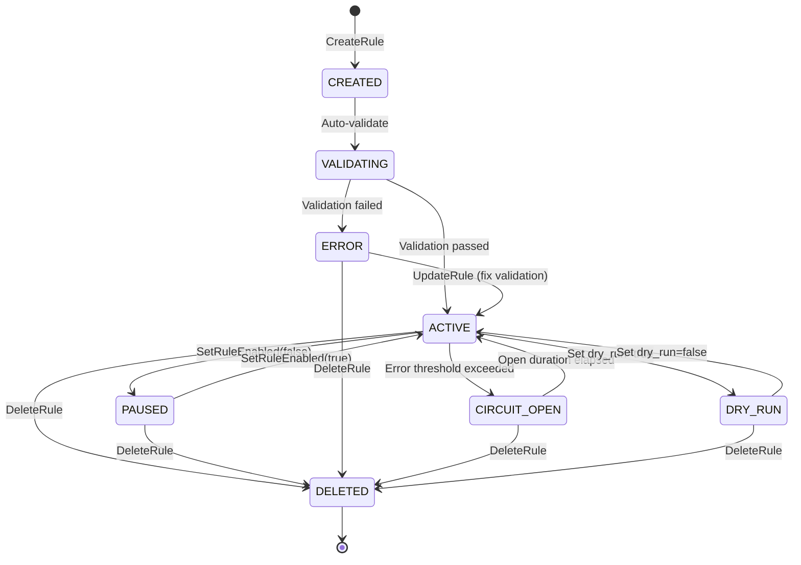
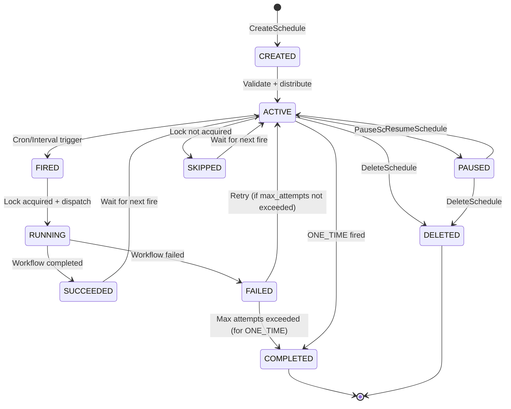
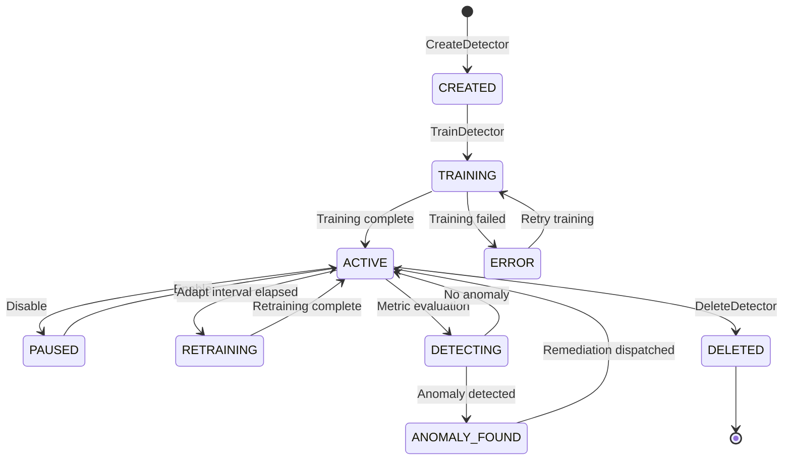
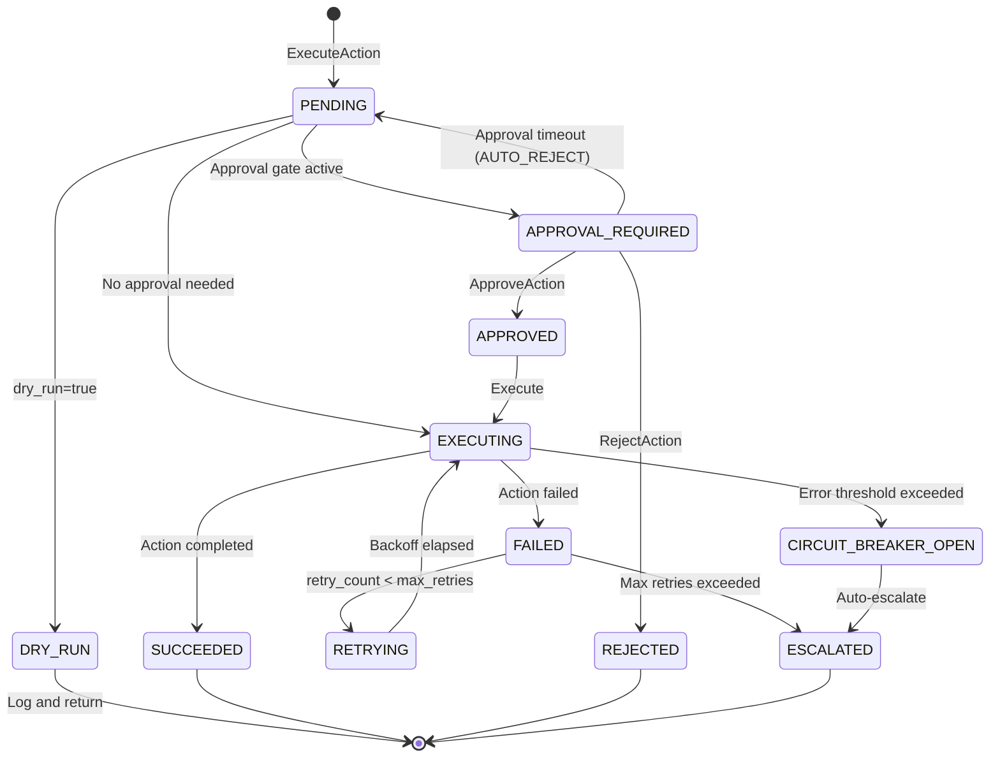

# RFC-0011
# Hermes Automation Platform Architecture

**Status:** Approved
**Author:** Hermes Team
**Owner:** Chief System Architect
**Version:** 1.1
**Priority:** Critical
**Depends On:** RFC-0001 (Foundation), RFC-0002 v1.1 (Core Architecture), RFC-0003 v1.1 (Event Bus), RFC-0004 v1.1 (Gateway), RFC-0005 v1.1 (Memory Architecture), RFC-0006 v1.1 (Knowledge Architecture), RFC-0007 v1.1 (Security & Identity Architecture), RFC-0008 v1.1 (Agent Runtime & Orchestration Architecture), RFC-0009 v1.1 (Tool, Plugin & Provider Architecture), RFC-0010 v1.0 (Observability & Telemetry Architecture)

---

## 1. Executive Summary

This RFC defines the **Hermes Automation Platform Architecture** — the declarative rule engine, trigger system, scheduled workflow orchestrator, and automated remediation framework for the Hermes Agent OS. It enables event-driven automation, condition-based actions, time-based scheduling, and ML-assisted anomaly detection across all Hermes components.

The architecture provides **four pillars of automation**:
- **Trigger-Action Rules** — Declarative event-condition-action (ECA) rules evaluated against the NATS Event Bus (RFC-0003)
- **Scheduled Workflows** — Cron-based and interval-based agent workflow scheduling with timezone awareness
- **Anomaly Detection** — ML-based metric/stream anomaly detection integrated with the Observability Plane (RFC-0010)
- **Automated Remediation** — Policy-driven remediation workflows triggered by alerts, SLO breaches, or anomaly detection

The Automation Platform is the **intelligence layer** that sits above the Control Plane (RFC-0002 Core, RFC-0008 Runtime) and the Observability Plane (RFC-0010), consuming events from all layers and dispatching actions via the Agent Runtime.

---

## 2. Problem Statement

Hermes Agent OS operates as a distributed system with hundreds of concurrent agents, workflows, tools, and providers. Without an automation platform:

1. **Reactive operations** — Operators must manually respond to alerts, SLO breaches, and capacity events
2. **No event-driven workflows** — Agents cannot be triggered automatically by system events (e.g., DLQ depth, quota exceeded, agent failure)
3. **No scheduled tasks** — Recurring workflows (daily reports, periodic ingestion, maintenance) require external schedulers
4. **No anomaly detection** — Metric anomalies must be detected manually; no ML-based threshold adaptation
5. **No remediation automation** — Common failure scenarios (OOM, circuit breaker, DLQ backlog) require human intervention
6. **No policy enforcement** — Operational policies (cost limits, resource caps, SLA targets) cannot be automatically enforced

---

## 3. Goals

| Goal | Description |
|------|-------------|
| **Declarative Automation** | YAML/JSON rule definitions; no imperative code for common automation patterns |
| **Event-Driven** | All triggers based on NATS JetStream events (RFC-0003); no polling required |
| **Scheduled Execution** | Cron and interval scheduling with timezone awareness; distributed lock for single execution |
| **ML-Assisted Detection** | Anomaly detection models trained on historical telemetry; automatic threshold adaptation |
| **Automated Remediation** | Pre-built remediation actions for common failures; custom remediation via agent workflows |
| **Policy Enforcement** | Operational policies (cost, resource, SLA) enforced automatically with escalation |
| **Audit Trail** | All automation decisions and actions logged to Merkle transparency log (RFC-0007) |
| **Safe by Default** | Rate limiting, circuit breakers, dry-run mode, approval gates for destructive actions |
| **Tenant Isolation** | Complete rule and workflow isolation per tenant; no cross-tenant trigger evaluation |

---

## 4. Non-Goals

| Non-Goal | Rationale |
|----------|-----------|
| **Business Process Management** | BPMN/BPEL engines are out of scope; Hermes workflows (RFC-0008) suffice |
| **Visual Rule Builder UI** | Declarative YAML/JSON is the primary interface; UI is a product feature |
| **Complex Event Processing** | CEP engines (Flink, Siddhi) are not embedded; simple ECA rules suffice |
| **Custom ML Models** | Use pre-trained anomaly detection models; custom training deferred to future RFC |
| **Marketplace** | Agent marketplace (discovery, ratings, monetization) is a product feature, not architectural |
| **External Webhook Delivery** | Webhook delivery is a Gateway concern (RFC-0004); Automation dispatches to Gateway |

---

## 5. Architecture Overview

```
+==============================================================================+
|                        HERMES AUTOMATION PLANE                               |
|                                                                              |
|  +------------------+  +------------------+  +------------------+            |
|  |   RULE ENGINE    |  |   SCHEDULER      |  |   ANOMALY        |            |
|  |   (ECA Rules)    |  |   (Cron/Interval)|  |   DETECTION      |            |
|  |                  |  |                  |  |   (ML Models)    |            |
|  | - Event Trigger   |  | - Cron Expressions|  | - Baseline Model |           |
|  | - Condition Eval  |  | - Interval Timer |  | - Threshold Adapt|            |
|  | - Action Dispatch |  | - Timezone Aware  |  | - Alert Trigger  |            |
|  | - Rate Limiting   |  | - Distributed Lock|  | - Feedback Loop  |            |
|  +--------+---------+  +--------+---------+  +--------+---------+            |
|           |                   |                   |                        |
|           +---------+---------+---------+---------+                        |
|                     |                   |                                  |
|                     v                   v                                  |
|  +=========================================================================+ |
|  |                    REMEDIATION ENGINE                                   | |
|  |  - Pre-built Actions (restart, scale, drain, replay)                   | |
|  |  - Custom Workflows (via Agent Runtime RFC-0008)                       | |
|  |  - Approval Gates (for destructive actions)                           | |
|  |  - Circuit Breakers (prevent remediation storms)                      | |
|  +=========================================================================+ |
|                                                                              |
+==============================================================================+
                              |               ^
                              v               |
+==============================================================================+
|                         EVENT BUS (RFC-0003)                                  |
|  NATS JetStream: automation.rule.triggered, automation.action.executed,      |
|  automation.schedule.fired, automation.anomaly.detected,                     |
|  automation.remediation.started/completed/failed                              |
+==============================================================================+
        |                    |                    |               |
        v                    v                    v               v
+-------------+    +-------------+    +-------------+    +-------------+
| RFC-0002    |    | RFC-0008    |    | RFC-0010    |    | RFC-0004    |
| Core        |    | Agent       |    | Observability|    | Gateway     |
| (State Mgr) |    | Runtime     |    | (Metrics)    |    | (Webhooks)  |
+-------------+    +-------------+    +-------------+    +-------------+
```

### 5.1 Automation Data Flow

```
EVENT SOURCE (NATS) -> RULE ENGINE -> CONDITION EVAL -> ACTION DISPATCH
                                                         |
                    +------------------------------------+----------------+
                    v                  v                 v                 v
              AGENT RUNTIME      PROVIDER CALL     GATEWAY WEBHOOK    REMEDIATION
              (RFC-0008)         (RFC-0009)        (RFC-0004)          ENGINE
                                                         |
                                                         v
                                              +-------------------+
                                              | POLICY ENFORCEMENT|
                                              | - Rate Limit      |
                                              | - Circuit Breaker |
                                              | - Approval Gate   |
                                              | - Dry-Run Mode    |
                                              +-------------------+
                                                         |
                                                         v
                                              +-------------------+
                                              | AUDIT LOG (RFC-0007)|
                                              | Merkle Transparency |
                                              +-------------------+
```

---

## 6. Components

### 6.1 Rule Engine

**Deployment:** StatefulSet with leader election; horizontally scalable workers

**Responsibilities:**
- Subscribe to NATS JetStream events (RFC-0003) matching rule trigger patterns
- Evaluate condition expressions (CEL) against event payload and system state
- Dispatch actions to Agent Runtime (RFC-0008), Gateway (RFC-0004), or Remediation Engine
- Enforce rate limits per rule, per tenant, per action type
- Maintain circuit breaker state per action target
- Log all trigger evaluations, condition results, and action dispatches to audit log (RFC-0007)

**Rule Evaluation Pipeline:**
1. **Event Ingest:** NATS consumer receives event; validates against trigger subject pattern
2. **Trigger Match:** Event subject matched against registered rule triggers
3. **Condition Evaluation:** CEL expression evaluated against event payload + context
4. **Rate Limit Check:** Per-rule rate limit enforced; reject if exceeded
5. **Circuit Breaker Check:** Target action circuit breaker state checked
6. **Action Dispatch:** Action dispatched to target (Agent Runtime / Gateway / Remediation)
7. **Audit Log:** Full decision chain logged with trace_id for correlation

### 6.2 Scheduler

**Deployment:** StatefulSet with distributed lock (NATS KV or etcd)

**Responsibilities:**
- Parse and evaluate cron expressions and interval timers
- Distribute schedule entries across scheduler instances
- Acquire distributed lock for each schedule fire (exactly-once execution)
- Dispatch scheduled workflows to Agent Runtime (RFC-0008)
- Handle timezone conversion and daylight saving time adjustments
- Use IANA tzdata database (updated quarterly during maintenance windows)
- Support pause/resume/cancel for individual schedules
- Track schedule execution history and missed fires

**Schedule Types:**

| Type | Format | Example | Description |
|------|--------|---------|-------------|
| **Cron** | 5-field cron | `0 9 * * 1-5` | Weekdays at 9 AM UTC |
| **Interval** | Duration + unit | `every 30m` | Every 30 minutes |
| **One-Time** | ISO 8601 timestamp | `2026-08-01T10:00:00Z` | Single fire at specific time |
| **Event-Relative** | Event + delay | `agent.completed + 5m` | 5 min after agent completes |

### 6.3 Anomaly Detection Engine

**Deployment:** Deployment with GPU support (optional); horizontally scalable

**Responsibilities:**
- Consume metrics from Observability Plane (RFC-0010) via PromQL queries
- Evaluate anomaly detection models (baseline, threshold, seasonal, ML)
- Detect anomalies in real-time streams (NATS JetStream subjects)
- Publish anomaly events to NATS for Rule Engine consumption
- Adapt thresholds based on historical feedback (closed-loop)
- Maintain model registry and versioning

**Detection Models:**

| Model | Algorithm | Use Case | Training Data |
|-------|-----------|----------|----------------|
| **Static Threshold** | Min/max bounds | Known limits (e.g., DLQ depth > 100) | None |
| **Statistical Baseline** | Mean + N*stddev | Normal operation metrics | 30 days historical |
| **Seasonal Decomposition** | STL decomposition | Daily/weekly patterns | 90 days historical |
| **Isolation Forest** | Ensemble trees | Multivariate anomalies | 30 days historical |
| **Prophet Forecast** | Time series forecast | Predictive scaling | 90 days historical |

**Model Retraining Triggers (L-02):**

Automatic model retraining is triggered when:
- Precision drops below 70% over a 24-hour rolling window
- Recall drops below 50% over a 24-hour rolling window
- Manual trigger via `TrainDetector` API
- Quarterly scheduled retraining (configurable)

Retraining uses the same training window as initial training. If retraining fails, the detector falls back to the previous model version. If no previous version exists, it falls back to static threshold mode.

### 6.4 Remediation Engine

**Deployment:** StatefulSet with leader election; action workers

**Responsibilities:**
- Execute pre-built remediation actions (restart, scale, drain, replay)
- Dispatch custom remediation workflows to Agent Runtime (RFC-0008)
- Enforce approval gates for destructive actions (data deletion, agent termination)
- Maintain circuit breakers per remediation target (prevent remediation storms)
- Track remediation history and success rates
- Escalate to human on-call if automated remediation fails after max retries

**Pre-Built Remediation Actions:**

| Action | Target | Description | Approval Required |
|--------|--------|-------------|-------------------|
| `restart_agent` | Agent Runtime | Restart a failed agent | No |
| `scale_pool` | Agent Runtime | Scale agent pool up/down | No |
| `drain_agent` | Agent Runtime | Gracefully drain agent | No |
| `replay_dlq` | Event Bus | Replay messages from DLQ | Yes |
| `clear_cache` | Memory Service | Invalidate memory cache | Yes |
| `rotate_credentials` | Security Service | Rotate SPIFFE/PASETO credentials | Yes |
| `scale_backend` | Infrastructure | Scale backend service (Thanos/Loki/Tempo) | Yes |
| `notify_oncall` | Gateway | Send notification to on-call via Telegram/Discord/Email | No |
| `circuit_breaker_reset` | Any | Reset circuit breaker to closed state | Yes |
| `enable_dry_run` | Rule Engine | Switch rule to dry-run mode | No |
| `pause_schedule` | Scheduler | Pause a scheduled workflow | No |
| `escalate` | Human | Escalate to human operator with context | No |
**Missed Fire Recovery:**

When the Scheduler is unavailable (crash, partition, upgrade) and schedule fires are missed, the following recovery behavior applies:

| CatchUpMode | Behavior | Max Catch-Up |
|-------------|----------|-------------|
| `EXECUTE_LATEST` (default) | Execute only the most recent missed fire on recovery | 1 |
| `EXECUTE_ALL` | Execute all missed fires up to `max_catch_up` | Configurable (default: 1, max: 10) |
| `SKIP` | Skip all missed fires; wait for next scheduled fire | 0 |

**Catch-Up Window:** Missed fires older than 1 hour are always skipped, regardless of `CatchUpMode`. This prevents stale schedule executions during extended outages.

**Recovery Procedure:**
1. Scheduler restarts and loads all schedules from database
2. For each schedule, compare `next_fire_at` with current time
3. If `next_fire_at` < current time: fire is missed
4. Apply `CatchUpMode` to determine recovery action
5. Update `next_fire_at` to next future fire time
6. Log `schedule.skipped` or `schedule.fired` event with reason


**Model Training Data Isolation (H-04):**

All anomaly detection model training **MUST** enforce per-tenant data isolation:

| Requirement | Implementation |
|-------------|----------------|
| **PromQL queries** | MUST include `tenant_id` label filter: `{tenant_id="..."}` |
| **Model artifacts** | Stored in per-tenant S3 prefix: `s3://hermes-models/{tenant_id}/{detector_id}/` |
| **Model registry** | Enforces tenant isolation on read/write; cross-tenant model access returns 403 |
| **Training data** | Limited to 1 GB per tenant per detector (per Section 14.2 quotas) |
| **Feedback data** | Stored in per-tenant PostgreSQL schema; isolated by row-level security |
| **Model export** | Model artifacts encrypted with per-tenant DEK (RFC-0007 KMS) |


---

## 7. Interfaces

### 7.1 Rule Definition Interface (YAML)

```yaml
# Example: DLQ depth alert with auto-replay
apiVersion: automation.hermes.io/v1
kind: Rule
metadata:
  name: dlq-auto-replay
  tenant_id: tenant-abc123
  labels:
    severity: critical
    category: operations
spec:
  trigger:
    type: event
    event:
      subject: "hermes.*.tool.dlq.new"
      payload_match:
        retries: { gte: 3 }
  condition: |
    event.retries >= 3 && 
    system.dlq_depth > 100 &&
    last_replay_age > 300
  action:
    type: remediation
    remediation:
      action: replay_dlq
      params:
        max_messages: 50
        idempotency_keys: ["event.execution_id"]
    approval:
      required: true
      approvers: ["oncall-team"]
      timeout: 300s
      auto_approve_if_dry_run: true
  rate_limit:
    max_fires_per_hour: 5
    max_concurrent: 1
  circuit_breaker:
    error_threshold: 3
    error_window: 300s
    open_duration: 600s
  dry_run: false
  enabled: true
```

### 7.2 Schedule Definition Interface (YAML)

```yaml
# Example: Daily morning briefing
apiVersion: automation.hermes.io/v1
kind: Schedule
metadata:
  name: daily-morning-briefing
  tenant_id: tenant-abc123
spec:
  type: cron
  cron: "0 8 * * 1-5"  # Weekdays at 8 AM UTC
  timezone: "UTC"
  workflow:
    agent_type: "planner"
    task: "Generate morning briefing from overnight events"
    capabilities: ["memory.read", "knowledge.search", "provider.call"]
    timeout: 300s
  retry:
    max_attempts: 2
    backoff: exponential
    initial_interval: 30s
  on_failure:
    action: notify_oncall
    message: "Morning briefing schedule failed"
  distributed_lock: true  # Ensure single execution across replicas
  enabled: true
```

### 7.3 Anomaly Detection Definition Interface (YAML)

```yaml
# Example: Agent spawn latency anomaly
apiVersion: automation.hermes.io/v1
kind: AnomalyDetector
metadata:
  name: agent-spawn-latency-anomaly
  tenant_id: tenant-abc123
spec:
  metric:
    query: 'histogram_quantile(0.99, rate(hermes_agent_runtime_spawn_duration_ms_bucket[5m]))'
    step: 30s
  model:
    type: statistical_baseline
    training_window: 30d
    sensitivity: 2.0  # 2 standard deviations
    min_data_points: 1000
  anomaly_condition: "value > baseline_upper_bound"
  action:
    type: remediation
    remediation:
      action: scale_pool
      params:
        direction: up
        factor: 1.5
    approval:
      required: false
  feedback:
    auto_adapt: true
    adapt_interval: 1h
  enabled: true
```

### 7.4 Remediation Policy Interface (YAML)

```yaml
# Example: Remediation policy with escalation
apiVersion: automation.hermes.io/v1
kind: RemediationPolicy
metadata:
  name: standard-remediation-policy
  tenant_id: tenant-abc123
spec:
  defaults:
    max_retries: 3
    backoff: exponential
    initial_interval: 10s
    max_interval: 300s
    circuit_breaker:
      error_threshold: 3
      error_window: 300s
      open_duration: 600s
  escalation:
    on_max_retries_exceeded:
      action: escalate
      notify: ["oncall-team"]
      context:
        include_trace: true
        include_logs: true
        include_metrics: true
    on_circuit_breaker_open:
      action: escalate
      notify: ["oncall-team", "platform-admin"]
  approval:
    timeout: 300s
    on_timeout: auto_reject
    on_reject: log_and_continue
  dry_run_default: false
```

---

## 8. APIs / gRPC / Protobuf Definitions

### 8.1 Rule Management API

```protobuf
// automation.proto
syntax = "proto3";

package hermes.automation.v1;

import "google/protobuf/timestamp.proto";
import "google/protobuf/duration.proto";
import "google/protobuf/struct.proto";

service RuleService {
  // Create a new automation rule
  rpc CreateRule(CreateRuleRequest) returns (Rule);
  
  // Get rule by ID
  rpc GetRule(GetRuleRequest) returns (Rule);
  
  // List rules with filters
  rpc ListRules(ListRulesRequest) returns (ListRulesResponse);
  
  // Update an existing rule
  rpc UpdateRule(UpdateRuleRequest) returns (Rule);
  
  // Delete a rule
  rpc DeleteRule(DeleteRuleRequest) returns (DeleteRuleResponse);
  
  // Enable/disable a rule
  rpc SetRuleEnabled(SetRuleEnabledRequest) returns (Rule);
  
  // Test a rule against a sample event (dry-run)
  rpc TestRule(TestRuleRequest) returns (TestRuleResponse);
  
  // Get rule execution history
  rpc GetRuleHistory(GetRuleHistoryRequest) returns (RuleHistoryResponse);
}

message Rule {
  string rule_id = 1;
  string tenant_id = 2;
  string name = 3;
  string description = 4;
  RuleSpec spec = 5;
  RuleStatus status = 6;
  map<string, string> labels = 7;
  int64 created_at_us = 8;
  int64 updated_at_us = 9;
  string created_by = 10;
  int32 version = 11;               // Incremented on each UpdateRule
}

message RuleSpec {
  Trigger trigger = 1;
  string condition = 2;          // CEL expression
  Action action = 3;
  RateLimit rate_limit = 4;
  CircuitBreaker circuit_breaker = 5;
  bool dry_run = 6;
  bool enabled = 7;
  int32 priority = 8;            // Higher priority evaluated first
}

message Trigger {
  TriggerType type = 1;
  EventTrigger event = 2;        // For event-based triggers
  ScheduleTrigger schedule = 3;  // For schedule-based triggers
  AnomalyTrigger anomaly = 4;   // For anomaly-based triggers
  CompositeTrigger composite = 5; // For composite (AND/OR) triggers
}

message CompositeTrigger {
  repeated Trigger triggers = 1;     // Component triggers
  CompositeLogic logic = 2;          // AND or OR logic
  google.protobuf.Duration window = 3; // Temporal correlation window
  bool cancel_on_partial = 4;        // Cancel partial matches if window expires
}

enum CompositeLogic {
  COMPOSITE_LOGIC_UNSPECIFIED = 0;
  AND = 1;  // All triggers must fire within window
  OR = 2;   // Any trigger can fire
}

enum TriggerType {
  TRIGGER_TYPE_UNSPECIFIED = 0;
  EVENT = 1;
  SCHEDULE = 2;
  ANOMALY = 3;
  COMPOSITE = 4;  // Multiple triggers (AND/OR logic)
}

message EventTrigger {
  string subject = 1;            // NATS subject pattern (wildcards supported)
  google.protobuf.Struct payload_match = 2;  // Key-value match conditions
  repeated string required_headers = 3;
}

message ScheduleTrigger {
  string schedule_id = 1;        // Reference to Schedule resource
}

message AnomalyTrigger {
  string detector_id = 1;        // Reference to AnomalyDetector resource
  string anomaly_type = 2;       // Type of anomaly to trigger on
}

message Action {
  ActionType type = 1;
  AgentAction agent = 2;
  RemediationAction remediation = 3;
  WebhookAction webhook = 4;
  NotificationAction notification = 5;
  ApprovalGate approval = 6;
  ChainAction chain = 7;             // For chained actions
  string dedup_key = 8;              // Deduplication key (optional)
}

enum ActionType {
  ACTION_TYPE_UNSPECIFIED = 0;
  AGENT = 1;                     // Spawn agent to execute workflow
  REMEDIATION = 2;               // Execute pre-built remediation
  WEBHOOK = 3;                   // Send webhook via Gateway (RFC-0004)
  NOTIFICATION = 4;              // Send notification (Telegram/Discord/Email)
  CHAIN = 5;                     // Chain multiple actions
}

message ChainAction {
  repeated Action actions = 1;       // Ordered actions to execute
  int32 max_depth = 2;              // Maximum chain depth (default: 3, max: 5)
  ChainFailureMode failure_mode = 3; // What to do if an action in chain fails
}

enum ChainFailureMode {
  CHAIN_FAILURE_MODE_UNSPECIFIED = 0;
  ABORT = 1;    // Stop chain on first failure
  CONTINUE = 2; // Continue chain regardless of failures
}

message AgentAction {
  string agent_type = 1;
  string task_description = 2;
  repeated string capabilities = 3;
  google.protobuf.Duration timeout = 4;
  map<string, string> params = 5;
}

message RemediationAction {
  string action_name = 1;        // restart_agent, scale_pool, replay_dlq, etc.
  map<string, string> params = 2;
  int32 max_retries = 3;
  google.protobuf.Duration backoff = 4;
  string idempotency_key = 5;   // Idempotency key (24h TTL)
}

message WebhookAction {
  string url = 1;
  string method = 2;             // POST, PUT
  map<string, string> headers = 3;
  google.protobuf.Struct body = 4;
}

message NotificationAction {
  NotificationChannel channel = 1;
  string message = 2;
  google.protobuf.Struct context = 3;
  repeated string recipients = 4;
}

enum NotificationChannel {
  NOTIFICATION_CHANNEL_UNSPECIFIED = 0;
  TELEGRAM = 1;
  DISCORD = 2;
  EMAIL = 3;
  SLACK = 4;
  SMS = 5;
}

message ApprovalGate {
  bool required = 1;
  repeated string approvers = 2;
  google.protobuf.Duration timeout = 3;
  ApprovalTimeoutBehavior on_timeout = 4;
  bool auto_approve_if_dry_run = 5;
}

enum ApprovalTimeoutBehavior {
  APPROVAL_TIMEOUT_UNSPECIFIED = 0;
  AUTO_REJECT = 1;
  AUTO_APPROVE = 2;
  ESCALATE = 3;
}

message RateLimit {
  int32 max_fires_per_hour = 1;
  int32 max_fires_per_day = 2;
  int32 max_concurrent = 3;
  google.protobuf.Duration cooldown = 4;  // Min time between fires
  google.protobuf.Duration dedup_ttl = 5; // Dedup key TTL (default: 300s)
}

message CircuitBreaker {
  int32 error_threshold = 1;
  google.protobuf.Duration error_window = 2;
  google.protobuf.Duration open_duration = 3;
  int32 half_open_requests = 4;
}

enum RuleStatus {
  RULE_STATUS_UNSPECIFIED = 0;
  ACTIVE = 1;
  PAUSED = 2;
  DISABLED = 3;
  ERROR = 4;
  CIRCUIT_BREAKER_OPEN = 5;
}

message CreateRuleRequest {
  string tenant_id = 1;
  string name = 2;
  string description = 3;
  RuleSpec spec = 4;
  map<string, string> labels = 5;
}

message GetRuleRequest {
  string rule_id = 1;
  string tenant_id = 2;
}

message ListRulesRequest {
  string tenant_id = 1;
  RuleStatus status_filter = 2;
  map<string, string> label_filter = 3;
  int32 limit = 4;
  string cursor = 5;
}

message ListRulesResponse {
  repeated Rule rules = 1;
  string next_cursor = 2;
}

message UpdateRuleRequest {
  string rule_id = 1;
  string tenant_id = 2;
  RuleSpec spec = 3;
}

message DeleteRuleRequest {
  string rule_id = 1;
  string tenant_id = 2;
}

message DeleteRuleResponse {
  bool deleted = 1;
}

message SetRuleEnabledRequest {
  string rule_id = 1;
  string tenant_id = 2;
  bool enabled = 3;
}

message TestRuleRequest {
  string rule_id = 1;
  string tenant_id = 2;
  google.protobuf.Struct sample_event = 3;
  string sample_subject = 4;
}

message TestRuleResponse {
  bool trigger_matched = 1;
  bool condition_passed = 2;
  string condition_error = 3;
  Action planned_action = 4;
  bool rate_limited = 5;
  bool circuit_breaker_open = 6;
}

message GetRuleHistoryRequest {
  string rule_id = 1;
  string tenant_id = 2;
  google.protobuf.Timestamp start = 3;
  google.protobuf.Timestamp end = 4;
  int32 limit = 5;
  int32 version_filter = 6;         // Filter by rule version (optional)
}

message RuleHistoryResponse {
  repeated RuleExecution executions = 1;
}

message RuleExecution {
  string execution_id = 1;
  string rule_id = 2;
  google.protobuf.Timestamp triggered_at = 3;
  string trigger_event_subject = 4;
  bool condition_passed = 5;
  string action_dispatched = 6;
  RuleExecutionStatus status = 7;
  string error = 8;
  google.protobuf.Duration duration = 9;
  string trace_id = 10;
}

enum RuleExecutionStatus {
  RULE_EXECUTION_STATUS_UNSPECIFIED = 0;
  TRIGGERED = 1;
  CONDITION_PASSED = 2;
  CONDITION_FAILED = 3;
  ACTION_DISPATCHED = 4;
  ACTION_SUCCEEDED = 5;
  ACTION_FAILED = 6;
  RATE_LIMITED = 7;
  CIRCUIT_BREAKER_OPEN = 8;
  APPROVAL_PENDING = 9;
  APPROVED = 10;
  REJECTED = 11;
  DRY_RUN = 12;
}
```

### 8.2 Schedule Management API

```protobuf
service ScheduleService {
  rpc CreateSchedule(CreateScheduleRequest) returns (Schedule);
  rpc GetSchedule(GetScheduleRequest) returns (Schedule);
  rpc ListSchedules(ListSchedulesRequest) returns (ListSchedulesResponse);
  rpc UpdateSchedule(UpdateScheduleRequest) returns (Schedule);
  rpc DeleteSchedule(DeleteScheduleRequest) returns (DeleteScheduleResponse);
  rpc PauseSchedule(PauseScheduleRequest) returns (Schedule);
  rpc ResumeSchedule(ResumeScheduleRequest) returns (Schedule);
  rpc TriggerNow(TriggerNowRequest) returns (ScheduleExecution);
  rpc GetNextFire(GetNextFireRequest) returns (GetNextFireResponse);
  rpc GetScheduleHistory(GetScheduleHistoryRequest) returns (ScheduleHistoryResponse);
}

message Schedule {
  string schedule_id = 1;
  string tenant_id = 2;
  string name = 3;
  ScheduleSpec spec = 4;
  ScheduleStatus status = 5;
  google.protobuf.Timestamp next_fire_at = 6;
  google.protobuf.Timestamp last_fire_at = 7;
  int32 consecutive_failures = 8;
  int64 total_fires = 9;
  int64 total_successes = 10;
  int64 total_failures = 11;
}

message ScheduleSpec {
  ScheduleType type = 1;
  string cron = 2;               // For CRON type
  google.protobuf.Duration interval = 3;  // For INTERVAL type
  google.protobuf.Timestamp one_time = 4; // For ONE_TIME type
  string timezone = 5;
  AgentAction workflow = 6;
  RetryPolicy retry = 7;
  FailureAction on_failure = 8;
  bool distributed_lock = 9;
  bool enabled = 10;
  EventRelativeSchedule event_relative = 11; // For EVENT_RELATIVE type
  CatchUpMode catch_up_mode = 12;             // Missed fire recovery
  int32 max_catch_up = 13;                    // Max missed fires to recover (default: 1)
}

message EventRelativeSchedule {
  string event_subject = 1;              // NATS subject to trigger on
  google.protobuf.Duration delay = 2;    // Delay after event
  bool cancel_if_new_event = 3;          // Cancel pending if new event arrives
}

enum CatchUpMode {
  CATCH_UP_MODE_UNSPECIFIED = 0;
  EXECUTE_LATEST = 1;  // Execute only the most recent missed fire
  EXECUTE_ALL = 2;    // Execute all missed fires up to max_catch_up
  SKIP = 3;           // Skip all missed fires
}

enum ScheduleType {
  SCHEDULE_TYPE_UNSPECIFIED = 0;
  CRON = 1;
  INTERVAL = 2;
  ONE_TIME = 3;
  EVENT_RELATIVE = 4;
}

message RetryPolicy {
  int32 max_attempts = 1;
  BackoffStrategy backoff = 2;
  google.protobuf.Duration initial_interval = 3;
  google.protobuf.Duration max_interval = 4;
}

enum BackoffStrategy {
  BACKOFF_STRATEGY_UNSPECIFIED = 0;
  FIXED = 1;
  EXPONENTIAL = 2;
  LINEAR = 3;
}

message FailureAction {
  ActionType type = 1;
  NotificationAction notification = 2;
  RemediationAction remediation = 3;
}

enum ScheduleStatus {
  SCHEDULE_STATUS_UNSPECIFIED = 0;
  ACTIVE = 1;
  PAUSED = 2;
  COMPLETED = 3;  // For ONE_TIME
  FAILED = 4;
  DISABLED = 5;
}

message ScheduleExecution {
  string execution_id = 1;
  string schedule_id = 2;
  google.protobuf.Timestamp fired_at = 3;
  ScheduleExecutionStatus status = 4;
  string agent_id = 5;
  string error = 6;
  google.protobuf.Duration duration = 7;
  string trace_id = 8;
}

enum ScheduleExecutionStatus {
  SCHEDULE_EXECUTION_STATUS_UNSPECIFIED = 0;
  FIRED = 1;
  RUNNING = 2;
  SUCCEEDED = 3;
  FAILED = 4;
  SKIPPED = 5;  // Distributed lock not acquired
  RETRYING = 6;
}
```

### 8.3 Anomaly Detection API

```protobuf
service AnomalyDetectionService {
  rpc CreateDetector(CreateDetectorRequest) returns (AnomalyDetector);
  rpc GetDetector(GetDetectorRequest) returns (AnomalyDetector);
  rpc ListDetectors(ListDetectorsRequest) returns (ListDetectorsResponse);
  rpc UpdateDetector(UpdateDetectorRequest) returns (AnomalyDetector);
  rpc DeleteDetector(DeleteDetectorRequest) returns (DeleteDetectorResponse);
  rpc TrainDetector(TrainDetectorRequest) returns (TrainDetectorResponse);
  rpc GetAnomalies(GetAnomaliesRequest) returns (GetAnomaliesResponse);
  rpc Feedback(AnomalyFeedbackRequest) returns (AnomalyFeedbackResponse);
}

message AnomalyDetector {
  string detector_id = 1;
  string tenant_id = 2;
  string name = 3;
  AnomalyDetectorSpec spec = 4;
  AnomalyDetectorStatus status = 5;
  ModelInfo model = 6;
  AnomalyStats stats = 7;
}

message AnomalyDetectorSpec {
  MetricSource metric = 1;
  ModelConfig model = 2;
  string anomaly_condition = 3;
  Action action = 4;
  FeedbackConfig feedback = 5;
  bool enabled = 6;
}

message MetricSource {
  string query = 1;             // PromQL (RFC-0010)
  google.protobuf.Duration step = 2;
  repeated string additional_queries = 3;
}

message ModelConfig {
  AnomalyModelType type = 1;
  google.protobuf.Duration training_window = 2;
  double sensitivity = 3;       // Number of standard deviations
  int32 min_data_points = 4;
  map<string, string> params = 5;
}

enum AnomalyModelType {
  ANOMALY_MODEL_UNSPECIFIED = 0;
  STATIC_THRESHOLD = 1;
  STATISTICAL_BASELINE = 2;
  SEASONAL_DECOMPOSITION = 3;
  ISOLATION_FOREST = 4;
  PROPHET_FORECAST = 5;
}

message FeedbackConfig {
  bool auto_adapt = 1;
  google.protobuf.Duration adapt_interval = 2;
  double learning_rate = 3;
}

message ModelInfo {
  string model_id = 1;
  string version = 2;
  google.protobuf.Timestamp trained_at = 3;
  google.protobuf.Timestamp last_adapted = 4;
  double training_score = 5;    // Model accuracy metric
  int32 data_points_used = 6;
}

message AnomalyStats {
  int64 total_evaluations = 1;
  int64 total_anomalies = 2;
  int64 true_positives = 3;
  int64 false_positives = 4;
  double precision = 5;
  double recall = 6;
}

enum AnomalyDetectorStatus {
  ANOMALY_DETECTOR_STATUS_UNSPECIFIED = 0;
  TRAINING = 1;
  ACTIVE = 2;
  PAUSED = 3;
  ERROR = 4;
  RETRAINING = 5;
}

message CreateDetectorRequest {
  string tenant_id = 1;
  string name = 2;
  AnomalyDetectorSpec spec = 3;
}

message TrainDetectorRequest {
  string detector_id = 1;
  string tenant_id = 2;
  google.protobuf.Duration training_window = 3;
}

message TrainDetectorResponse {
  string model_id = 1;
  double training_score = 2;
  int32 data_points_used = 3;
}

message GetAnomaliesRequest {
  string detector_id = 1;
  string tenant_id = 2;
  google.protobuf.Timestamp start = 3;
  google.protobuf.Timestamp end = 4;
  bool confirmed_only = 5;
  int32 limit = 6;
}

message GetAnomaliesResponse {
  repeated Anomaly anomalies = 1;
}

message Anomaly {
  string anomaly_id = 1;
  string detector_id = 2;
  google.protobuf.Timestamp detected_at = 3;
  double observed_value = 4;
  double expected_value = 5;
  double confidence = 6;
  AnomalySeverity severity = 7;
  bool confirmed = 8;
  string remediation_action_taken = 9;
  string trace_id = 10;
}

enum AnomalySeverity {
  ANOMALY_SEVERITY_UNSPECIFIED = 0;
  LOW = 1;
  MEDIUM = 2;
  HIGH = 3;
  CRITICAL = 4;
}

message AnomalyFeedbackRequest {
  string anomaly_id = 1;
  string tenant_id = 2;
  bool is_anomaly = 3;          // True positive feedback
  string note = 4;
}

message AnomalyFeedbackResponse {
  bool accepted = 1;
  string message = 2;
}
```

### 8.4 Remediation API

```protobuf
service RemediationService {
  rpc ExecuteAction(ExecuteActionRequest) returns (RemediationExecution);
  rpc GetExecution(GetExecutionRequest) returns (RemediationExecution);
  rpc ListExecutions(ListExecutionsRequest) returns (ListExecutionsResponse);
  rpc ApproveAction(ApproveActionRequest) returns (RemediationExecution);
  rpc RejectAction(RejectActionRequest) returns (RemediationExecution);
  rpc GetPolicy(GetPolicyRequest) returns (RemediationPolicy);
  rpc UpdatePolicy(UpdatePolicyRequest) returns (RemediationPolicy);
  rpc ResetCircuitBreaker(ResetCircuitBreakerRequest) returns (ResetCircuitBreakerResponse);
}

message ExecuteActionRequest {
  string tenant_id = 1;
  string action_name = 2;
  map<string, string> params = 3;
  bool dry_run = 4;
  string triggered_by = 5;      // Rule ID, schedule ID, or manual
  string trace_id = 6;
  string idempotency_key = 7;   // Idempotency key (24h TTL)
}

message RemediationExecution {
  string execution_id = 1;
  string tenant_id = 2;
  string action_name = 3;
  map<string, string> params = 4;
  RemediationStatus status = 5;
  google.protobuf.Timestamp started_at = 6;
  google.protobuf.Timestamp completed_at = 7;
  string error = 8;
  RemediationResult result = 9;
  bool dry_run = 10;
  string triggered_by = 11;
  string trace_id = 12;
  int32 retry_count = 13;
}

message RemediationResult {
  bool success = 1;
  string message = 2;
  google.protobuf.Struct details = 3;
  map<string, string> affected_resources = 4;
}

enum RemediationStatus {
  REMEDIATION_STATUS_UNSPECIFIED = 0;
  PENDING = 1;
  APPROVAL_REQUIRED = 2;
  APPROVED = 3;
  REJECTED = 4;
  EXECUTING = 5;
  SUCCEEDED = 6;
  FAILED = 7;
  RETRYING = 8;
  CIRCUIT_BREAKER_OPEN = 9;
  DRY_RUN = 10;
  ESCALATED = 11;
}

message ApproveActionRequest {
  string execution_id = 1;
  string tenant_id = 2;
  string approved_by = 3;
  string note = 4;
}

message RejectActionRequest {
  string execution_id = 1;
  string tenant_id = 2;
  string rejected_by = 3;
  string reason = 4;
}

message RemediationPolicy {
  string tenant_id = 1;
  RemediationDefaults defaults = 2;
  EscalationConfig escalation = 3;
  ApprovalConfig approval = 4;
  bool dry_run_default = 5;
}

message RemediationDefaults {
  int32 max_retries = 1;
  BackoffStrategy backoff = 2;
  google.protobuf.Duration initial_interval = 3;
  google.protobuf.Duration max_interval = 4;
  CircuitBreaker circuit_breaker = 5;
}

message EscalationConfig {
  EscalationAction on_max_retries_exceeded = 1;
  EscalationAction on_circuit_breaker_open = 2;
}

message EscalationAction {
  string action = 1;            // escalate, notify_oncall, etc.
  repeated string notify = 2;
  EscalationContext context = 3;
}

message EscalationContext {
  bool include_trace = 1;
  bool include_logs = 2;
  bool include_metrics = 3;
}

message ApprovalConfig {
  google.protobuf.Duration timeout = 1;
  ApprovalTimeoutBehavior on_timeout = 2;
  ApprovalRejectBehavior on_reject = 3;
}

enum ApprovalRejectBehavior {
  APPROVAL_REJECT_UNSPECIFIED = 0;
  LOG_AND_CONTINUE = 1;
  LOG_AND_PAUSE_RULE = 2;
  LOG_AND_DISABLE_RULE = 3;
}
```

---

### 8.5 Automation Kill Switch API (Executive)

```protobuf
service KillSwitchService {
  // Activate kill switch - pauses ALL automation across ALL tenants
  rpc ActivateKillSwitch(ActivateKillSwitchRequest) returns (KillSwitchState);
  
  // Deactivate kill switch - resumes automation
  rpc DeactivateKillSwitch(DeactivateKillSwitchRequest) returns (KillSwitchState);
  
  // Get current kill switch state
  rpc GetKillSwitchState(GetKillSwitchStateRequest) returns (KillSwitchState);
}

message ActivateKillSwitchRequest {
  string activated_by = 1;      // Executive/admin identity
  string reason = 2;            // Reason for activation
  bool force = 3;               // Force activation (ignore pending approvals)
}

message DeactivateKillSwitchRequest {
  string deactivated_by = 1;
  string reason = 2;
  bool executive_approval = 3;  // Requires executive approval to re-enable
}

message KillSwitchState {
  bool active = 1;
  string activated_by = 2;
  string reason = 3;
  google.protobuf.Timestamp activated_at = 4;
  google.protobuf.Timestamp deactivated_at = 5;
  int32 affected_rules = 6;
  int32 affected_schedules = 7;
  int32 affected_detectors = 8;
  int32 affected_remediations = 9;
}

message GetKillSwitchStateRequest {
  string tenant_id = 1;         // Optional: filter to tenant
}
```

**Kill Switch Behavior:**
- **Activate:** Instantly pauses all rules, schedules, anomaly detectors, and blocks all remediation executions across all tenants
- **Deactivate:** Requires executive approval (`executive_approval = true`); resumes all automation
- **Audit:** All kill switch activations/deactivations logged to Merkle transparency log (RFC-0007)
- **Notification:** On activation, sends CRITICAL notification to all on-call teams via Gateway (RFC-0004)
- **Scope:** Platform-wide (all tenants); cannot be scoped to individual tenants

## 9. Data Models

### 9.1 Automation Metric Naming

All automation metrics **MUST** follow OpenTelemetry Semantic Conventions (RFC-0010).

| Metric | Type | Description |
|--------|------|-------------|
| `hermes.automation.rule.triggered.total` | Counter | Rule trigger count |
| `hermes.automation.rule.condition.passed.total` | Counter | Conditions that passed |
| `hermes.automation.rule.condition.failed.total` | Counter | Conditions that failed |
| `hermes.automation.action.dispatched.total` | Counter | Actions dispatched |
| `hermes.automation.action.succeeded.total` | Counter | Actions succeeded |
| `hermes.automation.action.failed.total` | Counter | Actions failed |
| `hermes.automation.action.duration.ms` | Histogram | Action execution latency |
| `hermes.automation.action.rate_limited.total` | Counter | Rate-limited triggers |
| `hermes.automation.circuit_breaker.open.total` | Counter | Circuit breaker opens |
| `hermes.automation.schedule.fired.total` | Counter | Schedule fires |
| `hermes.automation.schedule.succeeded.total` | Counter | Schedule successes |
| `hermes.automation.schedule.failed.total` | Counter | Schedule failures |
| `hermes.automation.schedule.skipped.total` | Counter | Skipped (lock not acquired) |
| `hermes.automation.anomaly.detected.total` | Counter | Anomalies detected |
| `hermes.automation.anomaly.confirmed.total` | Counter | Confirmed anomalies |
| `hermes.automation.anomaly.false_positive.total` | Counter | False positives |
| `hermes.automation.remediation.executed.total` | Counter | Remediations executed |
| `hermes.automation.remediation.succeeded.total` | Counter | Remediations succeeded |
| `hermes.automation.remediation.failed.total` | Counter | Remediations failed |
| `hermes.automation.remediation.escalated.total` | Counter | Escalations to human |
| `hermes.automation.approval.pending.count` | Gauge | Pending approvals |
| `hermes.automation.approval.timeout.total` | Counter | Approval timeouts |

### 9.2 Rule Evaluation Context

When evaluating a CEL condition expression, the following context variables **MUST** be available:

```yaml
# Rule evaluation context variables
event:
  subject: string          # NATS subject
  payload: struct          # Event payload
  headers: map<string,string>
  timestamp: timestamp
  tenant_id: string

system:
  dlq_depth: int           # Current DLQ depth (RFC-0003)
  active_agents: int        # Active agent count (RFC-0008)
  pool_size: int            # Agent pool size
  token_usage_hour: int     # Token usage this hour (RFC-0009)
  token_usage_day: int      # Token usage today
  error_rate: float         # Current error rate
  p99_latency: float        # Current p99 latency

rule:
  rule_id: string
  name: string
  fire_count_hour: int      # Fires in last hour
  fire_count_day: int       # Fires in last day
  last_fire_time: timestamp

metadata:
  trace_id: string
  tenant_id: string
  region: string
```

---


### 9.3 CEL Sandbox (C-02)

All CEL expressions in rule conditions **MUST** be evaluated in a sandboxed environment with the following limits, consistent with RFC-0009 v1.1 Section 15.5:

| Limit | Value | Description |
|-------|-------|-------------|
| Max Instructions | 10,000 | Maximum CEL VM instructions |
| Max Wall Time | 50ms | Maximum evaluation time |
| Max Memory | 1MB | Maximum memory allocation |
| Allowed Functions | `in`, `startsWith`, `endsWith`, `contains`, `matches`, `size`, `has`, `filter`, `map`, `all`, `exists` | Allowlisted functions only |
| Forbidden | File I/O, network, time, random, reflection | No side effects |

**Violation Behavior:**
- Instruction limit exceeded → Return `CONDITION_EVALUATION_ERROR`; increment error counter
- Wall time exceeded → Kill evaluation; return `CONDITION_EVALUATION_TIMEOUT`; increment error counter
- Memory exceeded → Kill evaluation; return `CONDITION_EVALUATION_ERROR`; increment error counter
- Forbidden function called → Return `CONDITION_EVALUATION_ERROR`; reject rule on validation

**Rule Validation:** All rules **MUST** be validated against the CEL sandbox at creation and update time. Rules with expressions that violate sandbox limits are rejected with `RULE_VALIDATION_ERROR`.

## 10. Event Model

### 10.1 Automation Events (NATS JetStream)

All automation state changes **MUST** be published to NATS JetStream per RFC-0003.

**Subject Pattern:** `hermes.{tenant}.automation.{component}.{event}`

| Event | Subject | Payload |
|-------|---------|---------|
| Rule Triggered | `hermes.{tenant}.automation.rule.triggered` | `{rule_id, trigger_event, trace_id}` |
| Rule Condition Passed | `hermes.{tenant}.automation.rule.condition.passed` | `{rule_id, condition_result, trace_id}` |
| Rule Condition Failed | `hermes.{tenant}.automation.rule.condition.failed` | `{rule_id, condition_error, trace_id}` |
| Action Dispatched | `hermes.{tenant}.automation.action.dispatched` | `{action_id, rule_id, action_type, target, trace_id}` |
| Action Succeeded | `hermes.{tenant}.automation.action.succeeded` | `{action_id, rule_id, result, duration_ms, trace_id}` |
| Action Failed | `hermes.{tenant}.automation.action.failed` | `{action_id, rule_id, error, trace_id}` |
| Action Rate Limited | `hermes.{tenant}.automation.action.rate_limited` | `{rule_id, limit, current, trace_id}` |
| Circuit Breaker Opened | `hermes.{tenant}.automation.circuit_breaker.opened` | `{rule_id, target, error_count, trace_id}` |
| Schedule Fired | `hermes.{tenant}.automation.schedule.fired` | `{schedule_id, fire_time, trace_id}` |
| Schedule Succeeded | `hermes.{tenant}.automation.schedule.succeeded` | `{schedule_id, execution_id, duration_ms, trace_id}` |
| Schedule Failed | `hermes.{tenant}.automation.schedule.failed` | `{schedule_id, error, retry_count, trace_id}` |
| Schedule Skipped | `hermes.{tenant}.automation.schedule.skipped` | `{schedule_id, reason, trace_id}` |
| Anomaly Detected | `hermes.{tenant}.automation.anomaly.detected` | `{detector_id, observed, expected, confidence, severity, trace_id}` |
| Anomaly Confirmed | `hermes.{tenant}.automation.anomaly.confirmed` | `{anomaly_id, confirmed_by, trace_id}` |
| Anomaly False Positive | `hermes.{tenant}.automation.anomaly.false_positive` | `{anomaly_id, feedback_by, trace_id}` |
| Remediation Started | `hermes.{tenant}.automation.remediation.started` | `{execution_id, action, params, trace_id}` |
| Remediation Completed | `hermes.{tenant}.automation.remediation.completed` | `{execution_id, result, duration_ms, trace_id}` |
| Remediation Failed | `hermes.{tenant}.automation.remediation.failed` | `{execution_id, error, retry_count, trace_id}` |
| Remediation Escalated | `hermes.{tenant}.automation.remediation.escalated` | `{execution_id, reason, escalated_to, trace_id}` |
| Approval Requested | `hermes.{tenant}.automation.approval.requested` | `{execution_id, action, approvers, timeout, trace_id}` |
| Approval Granted | `hermes.{tenant}.automation.approval.granted` | `{execution_id, approved_by, trace_id}` |
| Approval Rejected | `hermes.{tenant}.automation.approval.rejected` | `{execution_id, rejected_by, reason, trace_id}` |
| Approval Timed Out | `hermes.{tenant}.automation.approval.timeout` | `{execution_id, timeout_behavior, trace_id}` |

---

## 11. Lifecycle

### 11.1 Rule Lifecycle



### 11.2 Schedule Lifecycle



### 11.3 Anomaly Detector Lifecycle



### 11.4 Remediation Execution Lifecycle



---

## 12. Security Model

### 12.1 Encryption

| Layer | Protocol | Algorithm | Key Management |
|-------|----------|-----------|----------------|
| In Transit (all) | mTLS 1.3 | TLS_AES_256_GCM_SHA384 | SPIFFE/SPIRE (RFC-0007) |
| At Rest (Rules) | PostgreSQL | AES-256-GCM | KMS (per-tenant DEK) |
| At Rest (Schedules) | PostgreSQL | AES-256-GCM | KMS (per-tenant DEK) |
| At Rest (Models) | S3 + PostgreSQL | AES-256-GCM | KMS (per-tenant DEK) |
| At Rest (Executions) | PostgreSQL | AES-256-GCM | KMS (per-tenant DEK) |

### 12.2 Authentication and Authorization

- **Component Communication:** SPIFFE identity via mTLS (RFC-0007)
- **API Access:** PASETO v4 capability tokens (RFC-0007)
- **Admin APIs:** PASETO v4 with `automation.admin` capability + MFA

### 12.3 Destructive Action Protection

All destructive remediation actions **MUST** require approval:

| Action Category | Approval Required | Examples |
|----------------|-------------------|----------|
| **Safe** (read-only, non-destructive) | No | `notify_oncall`, `enable_dry_run`, `pause_schedule` |
| **Moderate** (changes state, non-destructive) | No | `restart_agent`, `scale_pool`, `drain_agent` |
| **Destructive** (data loss potential) | Yes | `replay_dlq`, `clear_cache`, `rotate_credentials` |
| **Critical** (infrastructure impact) | Yes | `scale_backend`, `circuit_breaker_reset` |

### 12.4 Audit Integrity

- All automation decisions (trigger, condition, action, remediation) **MUST** be logged to the Merkle transparency log (RFC-0007)
- All approval decisions **MUST** be audited with approver identity
- All escalation events **MUST** include full context (trace, logs, metrics)
- Tamper-evident via Merkle proofs (RFC-0010 Section 29)

---

## 13. Authentication and Authorization

### 13.1 Automation Capabilities

| Capability | Resources | Actions |
|------------|-----------|---------|
| `automation.rule.read` | Rules | GetRule, ListRules, GetRuleHistory |
| `automation.rule.write` | Rules | CreateRule, UpdateRule, DeleteRule, SetRuleEnabled, TestRule |
| `automation.schedule.read` | Schedules | GetSchedule, ListSchedules, GetScheduleHistory |
| `automation.schedule.write` | Schedules | CreateSchedule, UpdateSchedule, DeleteSchedule, Pause, Resume, TriggerNow |
| `automation.anomaly.read` | Detectors | GetDetector, ListDetectors, GetAnomalies |
| `automation.anomaly.write` | Detectors | CreateDetector, UpdateDetector, DeleteDetector, TrainDetector, Feedback |
| `automation.remediation.execute` | Remediations | ExecuteAction, GetExecution, ListExecutions |
| `automation.remediation.approve` | Remediations | ApproveAction, RejectAction |
| `automation.policy.read` | Policies | GetPolicy |
| `automation.policy.write` | Policies | UpdatePolicy, ResetCircuitBreaker |
| `automation.admin` | All | Full administrative access |

### 13.2 Authorization Policy (Cedar)

```cedar
permit(
  principal,
  action == Action::"automation.rule.write",
  resource
) when {
  resource.tenant_id == principal.tenant_id &&
  principal.has_capability("automation.rule.write")
};

permit(
  principal,
  action == Action::"automation.remediation.approve",
  resource
) when {
  resource.tenant_id == principal.tenant_id &&
  principal.has_capability("automation.remediation.approve") &&
  principal.mfa_verified == true
};

permit(
  principal,
  action == Action::"automation.admin",
  resource
) when {
  principal.has_capability("automation.admin") &&
  principal.mfa_verified == true
};
```

---

## 14. Multi-Tenant Architecture

### 14.1 Data Isolation

| Layer | Mechanism |
|-------|-----------|
| Rules | PostgreSQL row-level security on `tenant_id` |
| Schedules | PostgreSQL row-level security on `tenant_id` |
| Detectors | PostgreSQL row-level security on `tenant_id` |
| Executions | PostgreSQL row-level security on `tenant_id` |
| Models | S3 prefix per tenant; PostgreSQL row-level security |
| NATS Events | `hermes.{tenant}.automation.*` subject namespace |

### 14.2 Resource Quotas

| Resource | Default Quota | Enforcement |
|----------|---------------|-------------|
| Active Rules | 500 per tenant | API rejection on create |
| Active Schedules | 100 per tenant | API rejection on create |
| Anomaly Detectors | 50 per tenant | API rejection on create |
| Rule Fires/Hour | 1,000 per tenant | Rate limiter |
| Schedule Fires/Hour | 200 per tenant | Rate limiter |
| Remediation Executions/Hour | 100 per tenant | Rate limiter |
| Concurrent Actions | 10 per tenant | Concurrency limiter |
| Model Training Data | 1 GB per tenant | Training data limit |

### 14.3 Cross-Tenant Isolation

**MUST NOT** be permitted. Rules, schedules, detectors, and executions are strictly tenant-scoped.


### 14.3a Automation Cost Guardrails (Executive)

Per-tenant automation cost caps and alerting:

| Cost Metric | Default Cap | Alert Threshold | Enforcement |
|-------------|-------------|-----------------|-------------|
| Rule fires per hour | 1,000 | 800 (80%) | Hard limit (reject) |
| Remediation executions per day | 500 | 400 (80%) | Hard limit (reject) |
| Anomaly evaluations per hour | 10,000 | 8,000 (80%) | Hard limit (reject) |
| Model training frequency | Daily | N/A | Hard limit (reject) |
| Total automation token usage per day | Configurable per tenant | 80% of budget | Alert + auto-pause rules |
| Automation infrastructure cost per month | 10% of tenant platform cost | 8% | Alert + notify tenant admin |

**Cost Alert Behavior:**
- When automation cost reaches 80% of tenant budget: `hermes.{tenant}.automation.cost.alert` event published
- When automation cost reaches 100% of tenant budget: All non-critical rules auto-paused; `cost_exceeded` event published
- Token usage tracked per rule, per schedule, per detector, per remediation
- Monthly cost report generated for Automation Governance Council review


---

## 15. Failure Handling

### 15.1 Rule Engine Failure Modes

| Failure | Detection | Response |
|---------|-----------|----------|
| Rule evaluation timeout | CEL evaluation exceeds 100ms | Skip rule; alert; increment error counter |
| Action dispatch failure | gRPC error from target | Retry (up to 3); circuit breaker on threshold |
| NATS connection lost | Health check failure | Reconnect with backoff (1s, 2s, 4s, 8s, max 30s); alert |
| Database connection lost | Connection pool exhausted | Queue events in memory (max 10K); alert |
| Rule validation error | Schema validation failure | Reject rule; keep previous version; alert |

### 15.2 Scheduler Failure Modes

| Failure | Detection | Response |
|---------|-----------|----------|
| Distributed lock failure | Lock acquisition timeout | Skip fire; log `schedule.skipped`; next fire |
| Agent dispatch failure | gRPC error from Runtime | Retry per RetryPolicy; on_failure action |
| Clock skew | NTP drift > 1s | Alert; adjust schedule times |
| Scheduler crash | Health check | Rebalance schedules to other instances; missed fire recovery |

### 15.3 Anomaly Detection Failure Modes

| Failure | Detection | Response |
|---------|-----------|----------|
| Metric query failure | PromQL error | Skip evaluation; alert; increment error counter |
| Model load failure | Model not found | Fall back to static threshold; alert |
| Training data insufficient | < min_data_points | Detector remains in TRAINING; alert |
| Feedback inconsistency | Conflicting feedback | Weight by recency; log; alert if precision < 50% |

### 15.4 Remediation Failure Modes

| Failure | Detection | Response |
|---------|-----------|----------|
| Action execution timeout | Timeout exceeded | Retry (up to max_retries); circuit breaker |
| Approval timeout | Approval window expired | Auto-reject or escalate per policy |
| Circuit breaker open | Error threshold exceeded | Block remediation; escalate to human |
| Target service unavailable | gRPC connection error | Retry with backoff; escalate after max retries |

---

## 16. Retry Policies

### 16.1 Rule Action Retry

| Component | Max Retries | Backoff | Max Elapsed |
|----------|-------------|---------|-------------|
| Action dispatch | 3 | Exponential (10s, 20s, 40s) | 120s |
| Remediation execution | 3 (configurable) | Exponential (10s, 30s, 90s) | 300s |
| Schedule workflow | 2 (configurable) | Exponential (30s, 60s) | 180s |
| Anomaly model training | 2 | Fixed (60s) | 180s |

### 16.2 Circuit Breaker

| Parameter | Default | Description |
|-----------|---------|-------------|
| `error_threshold` | 3 | Consecutive errors before opening |
| `error_window` | 300s | Time window for error counting |
| `open_duration` | 600s | Time before half-open test |
| `half_open_requests` | 1 | Test requests in half-open state |

---

## 17. Timeout Policies

| Operation | Timeout | Rationale |
|-----------|---------|-----------|
| Rule condition evaluation (CEL) | 100ms | Fast evaluation required |
| Rule trigger matching | 50ms | Event ingestion latency |
| Action dispatch (gRPC) | 10s | Target service response |
| Action execution | 300s | Maximum action duration |
| Schedule fire (lock acquire) | 5s | Distributed lock timeout |
| Schedule workflow execution | Configurable (default 300s) | Agent workflow |
| Anomaly metric query | 30s | PromQL evaluation (RFC-0010) |
| Model training | 1800s | 30 min max |
| Remediation action | 300s | Action execution |
| Approval wait | Configurable (default 300s) | Human approval |
| Rule history query | 10s | Database query |

---

## 18. Resource Management

### 18.1 Component Resource Limits

| Component | CPU Limit | Memory Limit | Disk |
|-----------|----------|-------------|------|
| Rule Engine Worker | 1000m | 1 GiB | 1 GiB (event buffer) |
| Scheduler | 500m | 512 MiB | 100 MiB |
| Anomaly Detector Worker | 1000m | 2 GiB | 5 GiB (model cache) |
| Remediation Worker | 500m | 512 MiB | 100 MiB |
| API Service | 1000m | 1 GiB | 100 MiB |

### 18.2 Scaling

| Component | Scaling Trigger | Max Replicas |
|-----------|-----------------|--------------|
| Rule Engine Workers | Event queue depth > 1000 | 20 |
| Scheduler | Active schedules > 500 | 5 (with distributed lock) |
| Anomaly Detectors | Evaluation latency > 5s | 10 |
| Remediation Workers | Pending executions > 50 | 10 |
| API Service | QPS > 100 | 5 |

---

## 19. Performance Requirements

### 19.1 SLIs / SLOs

| SLI | SLO | Measurement Window |
|-----|-----|-------------------|
| Rule trigger latency (event to condition) | p99 < 100ms | 5m |
| Rule action dispatch latency | p99 < 1s | 5m |
| Schedule fire accuracy (actual vs planned) | p99 < 5s | 5m |
| Anomaly detection latency | p99 < 10s | 5m |
| Remediation execution latency | p99 < 30s | 5m |
| API query latency | p99 < 1s | 5m |
| Rule Engine availability | 99.9% | 30d |
| Scheduler availability | 99.9% | 30d |
| Anomaly Detector availability | 99.5% | 30d |
| Remediation Engine availability | 99.9% | 30d |

### 19.2 Throughput Targets

| Pipeline | Target | Burst |
|----------|--------|-------|
| Event triggers | 10K events/s per tenant | 50K/s |
| Rule evaluations | 5K evaluations/s per tenant | 25K/s |
| Schedule fires | 100 fires/s per tenant | 500/s |
| Anomaly evaluations | 100 evaluations/s per tenant | 500/s |
| Remediation executions | 10 executions/s per tenant | 50/s |

---

## 20. Scalability

### 20.1 Horizontal Scaling

- **Rule Engine:** NATS consumer group with shared subscription; events distributed across workers
- **Scheduler:** Distributed lock ensures exactly-once; schedules partitioned across instances
- **Anomaly Detectors:** Each detector assigned to a worker; horizontal partitioning by detector_id
- **Remediation Workers:** Queue-based work distribution; concurrent execution per tenant


### 20.1a NATS Consumer Configuration (M-03)

The Rule Engine **MUST** use the following NATS JetStream consumer configuration:

| Parameter | Value | Rationale |
|-----------|-------|-----------|
| Consumer type | `pull` | Controlled backpressure; workers request batches |
| Filter subject | `hermes.{tenant}.>` | All tenant events; wildcard matching |
| Ack policy | `explicit` | Ack after processing complete |
| Max deliver | 3 | Retry on failure; then DLQ |
| Max ack pending | 1000 per worker | Prevent memory exhaustion |
| Ack wait | 30s | Timeout for processing |
| Deliver policy | `all` (new consumer) / `last` (reconnect) | No events missed on first start |
| Replay policy | `instant` | Fast catch-up |

**Consumer Group:** All Rule Engine workers for a tenant share a single consumer group name: `hermes-{tenant}-rule-engine`. This ensures each event is delivered to exactly one worker.

### 20.2 Cardinality Management

- Rule labels limited to 10 per rule
- Anomaly detector metrics limited to 5 queries per detector
- Execution history retention: 90 days hot, 1 year cold

---

## 21. Versioning

### 21.1 API Versioning

| API | Versioning | Compatibility |
|-----|------------|---------------|
| RuleService | Protobuf package version (`v1`) | Backward compatible within major |
| ScheduleService | Protobuf package version (`v1`) | Backward compatible within major |
| AnomalyDetectionService | Protobuf package version (`v1`) | Backward compatible within major |
| RemediationService | Protobuf package version (`v1`) | Backward compatible within major |

### 21.2 Rule/Schema Versioning

- YAML schema versioned via `apiVersion` field (`automation.hermes.io/v1`)
- Rule updates preserve execution history
- Model versions tracked with training timestamps

---

## 22. Migration Strategy

### 22.0a Phased Rollout Strategy (Executive)

Automation Platform capabilities **MUST** be enabled in four phases:

| Phase | Duration | Capabilities Enabled | Default Mode | Exit Criteria |
|-------|----------|----------------------|--------------|---------------|
| **Phase 1: Rules + Schedules** | Weeks 1-4 | Rule Engine (event triggers), Scheduler (cron/interval) | dry_run=true for all new rules | 10+ rules in production; 0 incidents |
| **Phase 2: Remediation** | Weeks 5-8 | Remediation Engine with pre-built actions, approval gates | Approval required for all destructive actions | 5+ remediations executed; 0 unauthorized actions |
| **Phase 3: Anomaly Detection (Static)** | Weeks 9-12 | Static threshold and statistical baseline models | dry_run=true for auto-remediation | 3+ detectors active; precision > 80% |
| **Phase 4: ML Models** | Weeks 13-16 | Isolation Forest, Prophet, feedback loop | Requires 30 days historical data | ML precision > 70%; recall > 50% |

**Phase Progression Gate:** Each phase requires Automation Governance Council approval before progressing to the next phase. No phase may be skipped.

**Default Dry-Run:** All new rules **MUST** start in dry-run mode for the first 7 days of production operation, regardless of phase.

**ML Model Prerequisite:** ML-based anomaly detection models (Phase 4) require minimum 30 days of historical telemetry data before initial training.

### 22.1 From No Automation

1. Deploy Rule Engine with NATS consumers
2. Create initial rules for critical alerts (DLQ depth, agent failure, SLO breach)
3. Deploy Scheduler with cron schedules for daily tasks
4. Deploy Anomaly Detection with static threshold models
5. Deploy Remediation Engine with pre-built actions
6. Enable ML-based models after 30 days of historical data
7. Enable approval gates for destructive actions
8. Enable feedback loop for anomaly detectors

### 22.2 Major Version Upgrades

| Step | Action |
|------|--------|
| 1 | Deploy new version to canary (5% of rules) |
| 2 | Validate rule evaluation parity |
| 3 | Expand to 25% |
| 4 | Validate for 24h |
| 5 | Expand to 100% |
| 6 | Update schema version |
| 7 | Deprecate old version after 30 days |

---

## 23. Upgrade and Downgrade Procedures

### 23.1 Component Upgrade

```
DRAIN POLICY (default):
  1. Stop accepting new events (drain NATS consumers)
  2. Complete in-flight evaluations (30s timeout)
  3. Shutdown gracefully
  4. New version starts
  5. Verify health
  6. Resume event consumption

ROLLING POLICY (for stateless workers):
  1. Rolling restart one worker at a time
  2. Verify health between each
  3. No downtime

PAUSE POLICY (for scheduler):
  1. Pause all schedules
  2. Upgrade
  3. Resume schedules
  4. Missed fires recovered
```

### 23.2 Model Upgrade

- New model trained alongside existing
- Shadow evaluation (both models run; compare results)
- Promote new model when precision >= old
- Rollback if precision drops > 10%

---

## 24. Compatibility Matrix

| Component | Automation v1.0 | Automation v1.1 | Automation v2.0 |
|-----------|------------------|----------------|----------------|
| Agent Runtime v1.1 (RFC-0008) | Yes | Yes | No |
| Event Bus v1.1 (RFC-0003) | Yes | Yes | No |
| Observability v1.0 (RFC-0010) | Yes | Yes | No |
| Security v1.1 (RFC-0007) | Yes | Yes | No |
| Gateway v1.1 (RFC-0004) | Yes | Yes | No |

**Rule:** Automation minor versions backward compatible for 2 major RFC versions.

---

## 25. Operational Model

### 25.1 Rule Management Operations

| Operation | Procedure | Automation Support |
|-----------|-----------|-------------------|
| Create rule | Validate schema, deploy to Rule Engine | API + YAML |
| Test rule | Dry-run against sample event | API (TestRule) |
| Enable/disable rule | Toggle without deletion | API (SetRuleEnabled) |
| Update rule | Atomic update; preserve history | API (UpdateRule) |
| Debug rule failure | View execution history with trace_id | API (GetRuleHistory) |
| Rate limit adjustment | Update RateLimit field | API (UpdateRule) |
| Circuit breaker reset | Reset to closed state | API (ResetCircuitBreaker) |

### 25.2 Schedule Management Operations

| Operation | Procedure | Automation Support |
|-----------|-----------|-------------------|
| Create schedule | Validate cron, distribute to Scheduler | API + YAML |
| Pause/resume | Pause without deletion | API (Pause/ResumeSchedule) |
| Trigger now | Fire immediately (bypass schedule) | API (TriggerNow) |
| View next fire | Calculate next fire time | API (GetNextFire) |
| View history | Past fires with status | API (GetScheduleHistory) |

### 25.3 Anomaly Detection Operations

| Operation | Procedure | Automation Support |
|-----------|-----------|-------------------|
| Create detector | Define metric + model | API + YAML |
| Train model | Train on historical data | API (TrainDetector) |
| View anomalies | List detected anomalies | API (GetAnomalies) |
| Provide feedback | Confirm/reject anomaly | API (Feedback) |
| Retrain | Retrain with new data | API (TrainDetector) |
| View stats | Precision, recall, counts | API (GetDetector) |

### 25.4 Remediation Operations

| Operation | Procedure | Automation Support |
|-----------|-----------|-------------------|
| Execute action | Dispatch remediation | API (ExecuteAction) |
| Approve/reject | Approval gate | API (Approve/RejectAction) |
| View history | Past executions with status | API (ListExecutions) |
| Update policy | Change defaults, escalation | API (UpdatePolicy) |
| Reset circuit breaker | Force close | API (ResetCircuitBreaker) |

---

### 25.5 Automation Governance Council (Executive)

The **Automation Governance Council** is responsible for oversight of all production automation:

| Role | Representation | Responsibilities |
|------|---------------|-----------------|
| Chair | Platform Engineering Lead | Convene monthly meetings; approve new remediation actions |
| Member | SRE/Ops Lead | Review remediation success rates; approve production rules |
| Member | Security Lead | Review audit trail; approve destructive action policies |
| Member | Tenant Representative | Review tenant-specific automation; provide feedback |

**Charter:**
- Review and approve all production remediation rules before deployment
- Audit automation decisions monthly via Merkle transparency log (RFC-0007)
- Review anomaly detector precision/recall monthly; retrain if below thresholds
- Approve new pre-built remediation actions
- Review and update Remediation Policy quarterly
- Review kill switch activations and post-incident reports
- Approve phased rollout progression (Phase 1 → Phase 4)

**Meeting Cadence:** Monthly (1st Monday of each month)
**Escalation:** Emergency meetings called within 4 hours of CRITICAL automation incidents

## 26. Monitoring Requirements

### 26.1 Self-Monitoring

The Automation Platform **MUST** monitor itself via the Observability Plane (RFC-0010):

| Metric | Purpose |
|--------|---------|
| `hermes.automation.rule_engine.uptime` | Rule Engine health |
| `hermes.automation.rule_engine.event_queue.depth` | Backpressure detection |
| `hermes.automation.rule_engine.evaluation.latency` | Evaluation performance |
| `hermes.automation.scheduler.uptime` | Scheduler health |
| `hermes.automation.scheduler.lock.contention` | Distributed lock contention |
| `hermes.automation.anomaly.uptime` | Anomaly Detector health |
| `hermes.automation.remediation.uptime` | Remediation Engine health |
| `hermes.automation.remediation.queue.depth` | Pending remediations |

### 26.2 Self-Monitoring Alerts

| Alert | Condition | Severity |
|-------|-----------|----------|
| `RuleEngineDown` | No heartbeat for 2m | CRITICAL |
| `EventQueueBacklog` | Queue depth > 5000 for 5m | CRITICAL |
| `EvaluationLatencyHigh` | p99 > 500ms for 5m | WARNING |
| `SchedulerDown` | No heartbeat for 2m | CRITICAL |
| `ScheduleMissed` | Schedule missed > 3 consecutive fires | WARNING |
| `AnomalyDetectorDown` | No heartbeat for 5m | WARNING |
| `RemediationQueueBacklog` | Queue depth > 50 for 5m | CRITICAL |
| `RemediationFailureRate` | Failure rate > 20% for 15m | WARNING |
| `CircuitBreakerStuck` | Circuit breaker open > 1h | WARNING |
| `ApprovalBacklog` | Pending approvals > 10 for 1h | WARNING |

---

## 27. Logging Requirements

### 27.1 Log Levels

| Level | Use Case | Examples |
|-------|----------|----------|
| **DEBUG** | Detailed evaluation traces | CEL expression evaluation steps |
| **INFO** | Normal operations | Rule triggered, schedule fired, action dispatched |
| **WARN** | Recoverable anomalies | Rate limit hit, circuit breaker half-open |
| **ERROR** | Failed operations | Action dispatch failed, model training failed |
| **FATAL** | Process termination | Rule Engine crash, database connection lost |

### 27.2 Structured Logging

All automation logs **MUST** include:
- `timestamp`, `level`, `logger`, `message`
- `tenant_id`, `component_type` (`rule-engine`, `scheduler`, `anomaly-detector`, `remediation-engine`)
- `trace_id` for correlation (RFC-0010)
- `rule_id` or `schedule_id` or `detector_id` or `execution_id` as applicable

---

## 28. Tracing Requirements

### 28.1 Trace Context Propagation

All automation operations **MUST** propagate W3C TraceContext (RFC-0010):
- Event ingestion creates span
- Rule evaluation creates child span
- Action dispatch creates child span with link to original event
- Remediation execution creates child span

### 28.2 Span Attributes

All automation spans **MUST** include:
- `hermes.automation.rule_id` (for rule evaluations)
- `hermes.automation.schedule_id` (for schedule fires)
- `hermes.automation.detector_id` (for anomaly evaluations)
- `hermes.automation.execution_id` (for remediation executions)
- `hermes.automation.action_type` (for action dispatches)

---

## 29. Audit Requirements

### 29.1 Mandatory Audit Events

| Category | Events |
|----------|--------|
| **Rule Lifecycle** | Create, Update, Delete, Enable, Disable |
| **Rule Execution** | Triggered, Condition Passed, Condition Failed, Action Dispatched |
| **Schedule Lifecycle** | Create, Update, Delete, Pause, Resume |
| **Schedule Execution** | Fired, Succeeded, Failed, Skipped |
| **Anomaly Detection** | Detector Created, Trained, Anomaly Detected, Confirmed, False Positive |
| **Remediation** | Started, Completed, Failed, Escalated |
| **Approval** | Requested, Approved, Rejected, Timed Out |
| **Policy Changes** | Remediation Policy Updated, Circuit Breaker Reset |
| **Configuration** | All configuration changes |

### 29.2 Audit Log Integrity

- All audit events appended to Merkle transparency log (RFC-0007)
- Hourly signed Merkle roots (RFC-0010)
- 7-year retention for compliance
- Inclusion/consistency proofs available via API

---

## 30. Compliance Requirements

### 30.1 Data Residency

- Automation data (rules, schedules, models, executions) **MUST** remain in configured region
- Cross-region replication **MUST** be opt-in

### 30.2 Right to Erasure (GDPR)

| Data Type | Erasure Mechanism |
|-----------|-------------------|
| Rules | Delete rule; purge execution history |
| Schedules | Delete schedule; purge execution history |
| Anomaly Data | Delete detector; purge anomaly history |
| Remediation History | Retain for 7 years (compliance); crypto-shredding for PII |

### 30.3 Compliance Mapping

| Regulation | Requirement | Implementation |
|------------|-------------|----------------|
| **GDPR Art. 22** | Automated decision-making | Approval gates for destructive actions; human escalation |
| **SOC2 CC8.1** | Change management | All rule/schedule changes audited |
| **ISO 27001 A.12.5** | Operational change management | Versioned rules with rollback |
| **ISO 27001 A.16.1** | Incident management | Automated remediation with escalation |

---

## 31. Testing Strategy

### 31.1 Unit Tests

| Target | Coverage |
|--------|----------|
| CEL condition evaluation | 95% |
| Cron expression parsing | 100% |
| Rate limiter | 95% |
| Circuit breaker | 95% |
| Rule validation | 90% |
| Schedule distribution | 85% |

### 31.2 Integration Tests

| Scenario | Validation |
|----------|------------|
| Event to action end-to-end | Rule triggered, condition evaluated, action dispatched |
| Schedule fire to workflow | Schedule fires, agent spawned, workflow completes |
| Anomaly detection to remediation | Metric query, anomaly detected, remediation executed |
| Approval flow | Action dispatched, approval requested, approved, executed |
| Circuit breaker | Errors exceed threshold, circuit opens, blocks, auto-recovers |
| Dry-run mode | Rule evaluates but action not executed |
| Multi-tenant isolation | Rule from tenant A not triggered by tenant B events |

### 31.2a Cross-RFC Contract Testing (H-05)

All integration boundaries between the Automation Platform and dependent RFCs **MUST** have Pact contract tests:

| Integration Boundary | Contract Test Scope | RFC Reference |
|----------------------|--------------------|----|
| Automation ↔ NATS Event Bus | Event subject format, payload schema, ack behavior | RFC-0003 |
| Automation ↔ Security Service | PASETO token validation, capability check, audit log write | RFC-0007 |
| Automation ↔ Agent Runtime | Action dispatch (SpawnAgent), workflow status | RFC-0008 |
| Automation ↔ Observability (PromQL) | Metric query format, result schema | RFC-0010 |
| Automation ↔ Gateway | Webhook dispatch, notification delivery | RFC-0004 |
| Automation ↔ Provider Router | Token usage query, provider health | RFC-0009 |

**Contract Test CI Gate:** All contract tests **MUST** pass before merge to main branch. Contract test failures block deployment.

**Contract Versioning:** Contracts versioned with the protobuf API version (`v1`). Breaking changes require contract version bump and consumer-driven contract testing.

### 31.3 Chaos Engineering

| Experiment | Frequency | Success Criteria |
|------------|-----------|------------------|
| Rule Engine kill | Weekly | Events queued; no rule missed; <30s recovery |
| Scheduler crash | Monthly | Distributed lock prevents duplicate; missed fires recovered |
| Model corruption | Quarterly | Fallback to static threshold; alert fired |
| NATS partition | Monthly | Events buffered; rules resume on reconnect |

---

## 32. Conformance Requirements

### 32.1 Component Conformance

A Hermes Automation Platform component is **conformant** iff:

1. **Rule Engine:** Subscribes to NATS events; evaluates CEL conditions; dispatches actions
2. **Scheduler:** Supports cron, interval, one-time schedules; distributed lock for exactly-once
3. **Anomaly Detector:** Evaluates PromQL metrics; supports 5 model types; feedback loop
4. **Remediation Engine:** Executes pre-built actions; approval gates; circuit breakers
5. **Security:** mTLS for all connections; PASETO v4 for API access; audit all decisions
6. **Multi-Tenant:** Complete tenant isolation; per-tenant quotas
7. **Observability:** Emits metrics, logs, traces per RFC-0010
8. **API:** Implements all protobuf services with backward compatibility

### 32.2 Rule Conformance

A rule is **conformant** iff:
1. Has valid YAML schema (`automation.hermes.io/v1`)
2. Trigger type matches a supported type (EVENT, SCHEDULE, ANOMALY)
3. CEL condition is syntactically valid and evaluates within 100ms
4. Action type is supported (AGENT, REMEDIATION, WEBHOOK, NOTIFICATION)
5. Rate limit and circuit breaker are configured
6. Approval gate configured for destructive actions

---

## 33. Acceptance Criteria

### 33.1 Rule Engine

| AC-ID | Criterion |
|-------|-----------|
| **AC-001** | Rule triggers within 100ms of event publication to NATS |
| **AC-002** | CEL condition evaluates within 50ms |
| **AC-003** | Action dispatched within 1s of condition passing |
| **AC-004** | Rate limit enforced (max_fires_per_hour) |
| **AC-005** | Circuit breaker opens after error_threshold consecutive failures |
| **AC-006** | Circuit breaker auto-closes after open_duration |
| **AC-007** | Dry-run mode evaluates trigger and condition but does not dispatch action |
| **AC-008** | Rule history queryable by time range with trace_id |
| **AC-009** | Rule validation rejects invalid CEL expressions |
| **AC-010** | Rule update is atomic; execution history preserved |

### 33.2 Scheduler

| AC-ID | Criterion |
|-------|-----------|
| **AC-011** | Cron schedule fires within 5s of planned time |
| **AC-012** | Interval schedule fires within 1s of planned time |
| **AC-013** | Distributed lock prevents duplicate fire across replicas |
| **AC-014** | Skipped fire logged with reason |
| **AC-015** | Retry policy executes on workflow failure |
| **AC-016** | On-failure action dispatched after max retries |
| **AC-017** | Schedule pause/resume takes effect immediately |
| **AC-018** | TriggerNow fires immediately bypassing schedule |

### 33.3 Anomaly Detection

| AC-ID | Criterion |
|-------|-----------|
| **AC-019** | Static threshold detects value outside bounds |
| **AC-020** | Statistical baseline trains on 30 days of data |
| **AC-021** | Anomaly detected within 10s of metric evaluation |
| **AC-022** | Anomaly event published to NATS with trace_id |
| **AC-023** | Feedback adjusts model sensitivity |
| **AC-024** | Precision and recall metrics available |
| **AC-025** | Model fallback to static threshold on training failure |

### 33.4 Remediation Engine

| AC-ID | Criterion |
|-------|-----------|
| **AC-026** | Pre-built actions execute within 30s |
| **AC-027** | Approval gate blocks destructive actions until approved |
| **AC-028** | Approval timeout triggers configured behavior (auto-reject/escalate) |
| **AC-029** | Circuit breaker blocks remediation after error threshold |
| **AC-030** | Escalation to human on-call on max retries exceeded |
| **AC-031** | Remediation history queryable with full context |
| **AC-032** | Dry-run mode logs intended action without execution |

### 33.5 Security and Multi-Tenant

| AC-ID | Criterion |
|-------|-----------|
| **AC-033** | All telemetry encrypted in transit (mTLS) |
| **AC-034** | All audit events in Merkle transparency log |
| **AC-035** | Tenant A rules not triggered by Tenant B events |
| **AC-036** | Per-tenant resource quotas enforced |
| **AC-037** | Destructive actions require approval with MFA |
| **AC-038** | All decisions traceable via trace_id |

### 33.6 Observability

| AC-ID | Criterion |
|-------|-----------|
| **AC-039** | Automation metrics appear in Thanos within 10s |
| **AC-040** | Automation logs appear in Loki within 15s |
| **AC-041** | Automation traces appear in Tempo within 20s |
| **AC-042** | Self-monitoring alerts fire within 1m of threshold breach |
| **AC-043** | Rule execution traceable end-to-end (event to action) |

### 33.7 Upgrade and Migration

| AC-ID | Criterion |
|-------|-----------|
| **AC-044** | Component upgrade zero-downtime (drain policy) |
| **AC-045** | Rule schema upgrade backward compatible |
| **AC-046** | Model upgrade with shadow evaluation and rollback |

---

### 33.8 v1.1 Architecture Review Findings

| AC-ID | Criterion |
|-------|-----------|
| **AC-047** | CompositeTrigger message supports AND/OR logic with temporal window |
| **AC-048** | CEL condition evaluation limited to 10,000 instructions, 50ms wall time, 1MB memory |
| **AC-049** | CEL sandbox rejects forbidden functions (file I/O, network, time, random, reflection) |
| **AC-050** | Action with dedup_key is not dispatched more than once within dedup_ttl |
| **AC-051** | ChainAction max_depth enforced (default: 3, max: 5); exceeds returns CHAIN_DEPTH_EXCEEDED |
| **AC-052** | Missed fire recovered per CatchUpMode within 1 hour |
| **AC-053** | Model training data isolated per tenant; no cross-tenant data leakage |
| **AC-054** | Cross-RFC contract tests pass for all integration boundaries |
| **AC-055** | Rule version incremented on UpdateRule; history filterable by version |
| **AC-056** | EVENT_RELATIVE schedule fires after event + delay |
| **AC-057** | NATS consumer uses pull type, explicit ack, max deliver 3 |
| **AC-058** | RemediationAction with idempotency_key returns original result on duplicate (24h TTL) |
| **AC-059** | IANA tzdata used for timezone conversion; updated quarterly |

### 33.9 v1.1 Executive Review Findings

| AC-ID | Criterion |
|-------|-----------|
| **AC-060** | Kill switch activates and pauses ALL automation across ALL tenants within 5s |
| **AC-061** | Kill switch deactivation requires executive_approval=true |
| **AC-062** | Kill switch activation logged to Merkle transparency log |
| **AC-063** | Automation Governance Council charter documented with monthly cadence |
| **AC-064** | Per-tenant cost caps enforced; alert at 80%; auto-pause at 100% |
| **AC-065** | Phased rollout gates require Governance Council approval to progress |
| **AC-066** | All new rules start in dry-run mode for first 7 days |
| **AC-067** | ML models require 30 days historical data before training |
| **AC-068** | Automation Playbooks published (5 playbooks: auto-restart, daily briefing, DLQ replay, SLO scaling, cost spike) |
| **AC-069** | Model retraining triggered when precision < 70% or recall < 50% over 24h |

## 34. Risks

| Risk | Likelihood | Impact | Mitigation |
|------|------------|--------|------------|
| **Rule Storm** (cascading triggers) | Medium | High | Rate limits, circuit breakers, priority ordering |
| **Remediation Loop** (action triggers rule triggers action) | Medium | High | Circuit breakers, action deduplication, max depth |
| **False Positive Anomalies** | High | Medium | Feedback loop, sensitivity tuning, dry-run mode |
| **Schedule Drift** (clock skew) | Low | Medium | NTP, timezone awareness, missed fire detection |
| **Model Degradation** | Medium | Medium | Retraining schedule, precision monitoring, fallback |
| **Approval Bottleneck** | Medium | Medium | Timeout behavior, escalation, auto-approve for dry-run |
| **NATS Event Loss** | Low | High | JetStream persistence, at-least-once delivery |
| **Cross-Tenant Leakage** | Low | Critical | Row-level security, subject namespace enforcement |
| **Resource Exhaustion** | Medium | High | Quotas, rate limits, queue depth monitoring |

---

## 35. Future Extensions

| Extension | Description | Target |
|------------|-------------|--------|
| **Visual Rule Builder** | Drag-and-drop UI for rule creation | Product Feature |
| **Complex Event Processing** | Pattern detection across event streams | RFC-0011 v2 |
| **Custom ML Models** | User-defined anomaly detection models | RFC-0011 v2 |
| **Agent Marketplace** | Cross-tenant agent/workflow discovery and sharing | Product Feature |
| **Policy-as-Code** | OPA/Cedar integration for policy evaluation | RFC-0011 v1.1 |
| **Multi-Region Automation** | Cross-region rule evaluation and remediation | RFC-0012 |
| **Predictive Auto-Scaling** | ML-based resource prediction and proactive scaling | RFC-0011 v1.1 |
| **Workflow Composition** | Visual workflow builder for complex automation chains | Product Feature |
| **Automation Playbooks** | Pre-built playbooks: auto-restart, daily briefing, DLQ replay, SLO auto-scaling, cost spike detection | Published with v1.1 |
| **ChatOps Integration** | Telegram/Discord bot for approval and remediation with inline action buttons | RFC-0011 v1.1 |

---

## End of RFC-0011 v1.1
