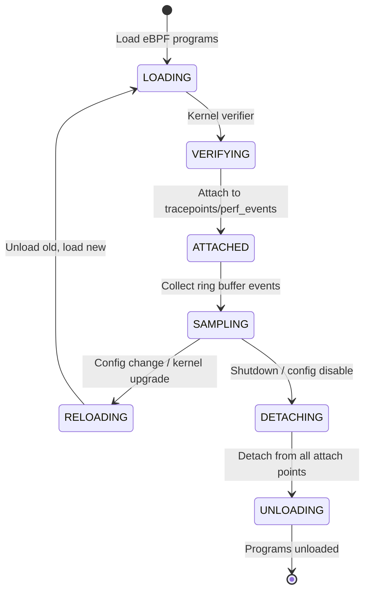
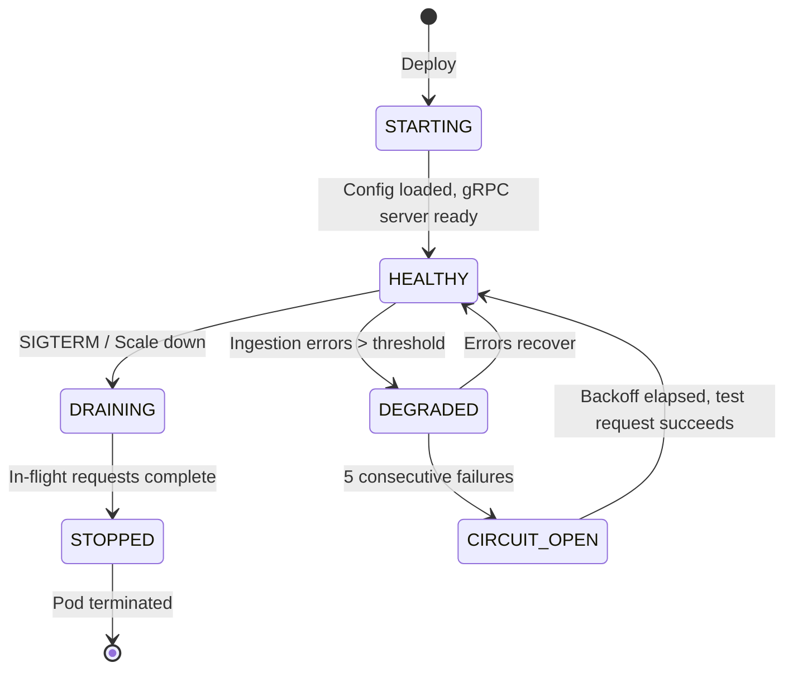

# RFC-0012
# Hermes Continuous Profiling Architecture

**Status:** Approved
**Author:** Hermes Team
**Owner:** Chief System Architect
**Version:** 1.0
**Priority:** High
**Depends On:** RFC-0001 (Foundation), RFC-0002 v1.1 (Core Architecture), RFC-0003 v1.1 (Event Bus), RFC-0004 v1.1 (Gateway), RFC-0007 v1.1 (Security & Identity), RFC-0008 v1.1 (Agent Runtime), RFC-0010 v1.0 (Observability & Telemetry), RFC-0011 v1.1 (Automation Platform)

---

## 1. Executive Summary

This RFC defines the **Hermes Continuous Profiling Architecture** — an always-on, production-grade profiling subsystem that continuously collects CPU, memory, lock contention, and custom application profiles from all Hermes components and correlates them with distributed traces (RFC-0010) and automation rules (RFC-0011).

The architecture is built on **eBPF (extended Berkeley Packet Filter)** for zero-instrumentation, low-overhead kernel-level profiling, combined with **user-space SDK profiling** for application-specific insights. All profile data flows through the Observability Plane (RFC-0010) and is queryable via the Profiling API.

The profiling subsystem provides **four pillars**:
- **Continuous CPU Profiling** — On-CPU and off-CPU time, flame graphs, differential profiles
- **Memory Profiling** — Allocation rates, heap snapshots, leak detection, GC pressure
- **Lock Contention Profiling** — Mutex/channel contention, critical section analysis
- **Custom Application Profiling** — User-defined labels, business transaction correlation

---

## 2. Problem Statement

Hermes Agent OS operates as a distributed system with hundreds of concurrent agents, workflows, and providers. Without continuous profiling:

1. **Performance regressions** go undetected until they manifest as SLO breaches (RFC-0010)
2. **Root cause analysis** requires manual reproduction and ad-hoc profiling
3. **Resource waste** (CPU, memory) cannot be attributed to specific code paths or tenants
4. **Capacity planning** relies on coarse-grained metrics rather than code-level insight
5. **Automation rules** (RFC-0011) lack profiling signals for predictive scaling and anomaly detection
6. **Security incidents** (e.g., crypto miners, memory corruption) lack continuous visibility

Traditional sampling profilers require code changes, have high overhead, and only capture snapshots. Continuous profiling with eBPF provides always-on visibility with <1% overhead.

---

## 3. Goals

| Goal | Description |
|------|-------------|
| **Zero-Instrumentation** | Kernel-level profiling via eBPF; no code changes required for CPU/memory/lock profiling |
| **Continuous Collection** | Profiles collected 24/7 with configurable sampling rates (default: 100 Hz CPU, 1/1024 alloc) |
| **Trace Correlation** | Every profile sample linked to trace_id/span_id (RFC-0010 W3C TraceContext) |
| **Tenant Isolation** | Complete profile data separation per tenant; no cross-tenant leakage |
| **Low Overhead** | <1% CPU overhead, <50 MB memory per agent; safe for production |
| **Unified Storage** | Profiles stored in object storage with metadata in PostgreSQL; queryable via API |
| **Automation Integration** | Profiling signals available to RFC-0011 anomaly detectors and remediation rules |
| **Security Hardened** | eBPF programs verified, signed, and loaded with least privilege |

---

## 4. Non-Goals

| Non-Goal | Rationale |
|----------|-----------|
| **Custom Kernel Modules** | eBPF provides sufficient capability; kernel modules not portable |
| **GPU Profiling** | NVIDIA/AMD GPU profiling requires vendor-specific tooling; deferred |
| **Distributed Profiling Correlation** | Single-node profiling is scope; cross-node correlation via traces |
| **Historical Replay** | Profile replay is a debugging tool feature, not infrastructure |
| **Profile Visualization UI** | Grafana/Parca UI sufficient; no custom UI |

---

## 5. Architecture Overview

```
+==============================================================================+
|                     HERMES CONTINUOUS PROFILING PLANE                        |
|                                                                              |
|  +------------------+  +------------------+  +------------------+            |
|  |  eBPF PROFILER   |  |  USER-SPACE SDK  |  |  PROFILE         |            |
|  |  (Kernel)        |  |  (Per-Language)  |  |  INGESTION       |            |
|  |                  |  |                  |  |  SERVICE         |            |
|  | - CPU (100Hz)    |  | - Go pprof       |  |                  |            |
|  | - Memory         |  | - Java async     |  | - Profile Receiver|           |
|  | - Lock/Block     |  | - Python py-spy  |  | - Symbolication  |            |
|  | - Custom USDT    |  | - Node.js        |  | - Tenant Routing |            |
|  | - BTF/CO-RE      |  | - Rust pprof     |  | - Rate Limiting  |            |
|  +--------+---------+  +--------+---------+  +--------+---------+            |
|           |                   |                   |                        |
|           +---------+---------+---------+---------+                        |
|                     |                   |                                  |
|                     v                   v                                  |
|  +=========================================================================+ |
|  |                    PROFILE STORAGE (Object Store)                       | |
|  |  - Parquet columnar format (time, stack, labels, values)               | |
|  |  - Partitioned by tenant_id, date, component_type                      | |
|  |  - Symbols stored separately (ELF/DWARF)                               | |
|  +=========================================================================+ |
|                                                                              |
+==============================================================================+
                              |                    ^
                              v                    |
+==============================================================================+
|                         OBSERVABILITY PLANE (RFC-0010)                        |
|                                                                              |
|  +-------------+  +-------------+  +-------------+  +-------------+         |
|  |   METRICS   |  |    LOGS     |  |   TRACES    |  |   PROFILES  |         |
|  |  (Thanos)   |  |   (Loki)    |  |   (Tempo)   |  | (Parca/      |         |
|  |             |  |             |  |             |  |  Custom)    |         |
|  +-------------+  +-------------+  +-------------+  +-------------+         |
|                                                                              |
+==============================================================================+
                              |
              +---------------+---------------+
              v                               v
    +---------------------+         +---------------------+
    |  AUTOMATION (RFC-0011)           |  GRAFANA/          |
    |  - Anomaly Detection             |  PARCA UI          |
    |  - Remediation (perf regress)    |  - Flame Graphs    |
    |  - Predictive Scaling            |  - Diff Profiles   |
    +---------------------+         +---------------------+
```

### 5.1 Data Flow

```
KERNEL (eBPF)                    USER SPACE (SDK)                  INGESTION
    |                                |                                 |
    |  perf_event_open()             |  runtime.ReadMemStats()        |
    |  bpf_prog_load()               |  pprof.StartCPUProfile()       |
    |  ring_buffer_poll()            |  custom labels                 |
    |                                |                                 |
    +--------------+-----------------+----------------+----------------+
                   |                 |                |
                   v                 v                v
         +------------------------------------------------------------------+
         |                    PROFILE AGENT (per-node DaemonSet)            |
         |  - Receives eBPF ring buffer events                              |
         |  - Receives SDK profile uploads (pprof protobuf)                 |
         |  - Correlates with trace context (W3C TraceContext from RFC-0010)|
         |  - Symbolicates using local symbol cache                         |
         |  - Batches and compresses (zstd)                                 |
         |  - Forwards to Profile Ingestion Service (gRPC)                  |
         +------------------------------------------------------------------+
                                   |
                                   v
                    +---------------------------------------+
                    |        PROFILE INGESTION SERVICE      |
                    |  - Multi-tenant gRPC/HTTP receiver    |
                    |  - Validates tenant_id, schema        |
                    |  - Writes to object storage (Parquet) |
                    |  - Updates metadata in PostgreSQL     |
                    |  - Publishes profile events to NATS   |
                    +---------------------------------------+
                                   |
                    +--------------+--------------+
                    v                             v
           +------------------+          +------------------+
           | OBJECT STORAGE   |          | POSTGRESQL       |
           | (S3/GCS)         |          | (Metadata)       |
           | Parquet files    |          | - Profile index  |
           | Partitioned by:  |          | - Symbols        |
           |   tenant/date/   |          | - Labels         |
           |   component      |          | - Retention      |
           +------------------+          +------------------+

---

## 6. Components

### 6.1 eBPF Profiler (Kernel Space)

**Deployment:** DaemonSet with privileged access; one per node

**Responsibilities:**
- Load and manage eBPF programs for CPU, memory, lock, and custom profiling
- Attach to `perf_event_open` for CPU profiling (100 Hz default)
- Attach to `alloc`/`free` tracepoints for memory profiling (1/1024 sampling)
- Attach to `lock`/`unlock` tracepoints for contention profiling
- Support USDT (User Statically Defined Tracing) probes for custom application events
- Use BTF (BPF Type Format) and CO-RE (Compile Once, Run Everywhere) for kernel portability
- Output events via ring buffer to user-space Profile Agent

**eBPF Programs:**

| Program | Attach Type | Sampling | Output |
|---------|-------------|----------|--------|
| `cpu_profiler` | `perf_event` (CPU cycles) | 100 Hz | Stack trace + PID/TID + CPU |
| `memory_profiler` | `tracepoint` (kmem:kmalloc, kmem:kfree) | 1/1024 | Alloc size + stack + PID |
| `lock_profiler` | `tracepoint` (lock:lock_acquire, lock:lock_release) | 100% | Lock addr + wait time + stack |
| `block_profiler` | `tracepoint` (block:block_rq_issue, block:block_rq_complete) | 100% | I/O latency + stack |
| `usdt_profiler` | `uprobe`/`uretprobe` (USDT) | Configurable | Custom labels + stack |

**BTF/CO-RE Requirements:**
- Kernel 5.10+ with BTF enabled (`CONFIG_DEBUG_INFO_BTF=y`)
- `clang` + `llvm` toolchain for eBPF compilation
- `bpftool` for BTF introspection
- CO-RE relocations for struct field offsets

### 6.2 User-Space SDK Profilers (Per Language)

**Deployment:** Linked into each Hermes component binary; optionally sidecar for interpreted languages

**Responsibilities:**
- Provide language-native profiling APIs (pprof-compatible)
- Emit profile data in pprof protobuf format
- Correlate with W3C TraceContext (trace_id, span_id)
- Apply custom labels from application context
- Batch and compress profile uploads

**Language Support:**

| Language | Profiler | Integration |
|----------|----------|-------------|
| **Go** | `runtime/pprof` + `net/http/pprof` | Native; auto-registers with Profile Agent |
| **Java** | `async-profiler` (JFR) | JVM agent; JFR to pprof conversion |
| **Python** | `py-spy` / `pyinstrument` | Sidecar process; sampling mode |
| **Node.js** | `--prof` + `v8-profiler-next` | Native V8 profiler; pprof export |
| **Rust** | `pprof-rs` + `backtrace` | Native; DWARF symbolication |
| **C/C++** | `gperftools` / `perf` | Native; pprof export |

### 6.3 Profile Agent (Per-Node DaemonSet)

**Deployment:** DaemonSet; one per node; non-privileged (after eBPF load)

**Responsibilities:**
- Receive eBPF ring buffer events from kernel
- Receive pprof uploads from SDKs (HTTP/gRPC)
- Correlate profiles with active trace context (from RFC-0010)
- Symbolicate kernel and user stacks using local symbol cache
- Batch, compress (zstd), and forward to Profile Ingestion Service
- Manage eBPF program lifecycle (load, update, unload)
- Expose `/healthz` and `/readyz` endpoints
- Publish agent status events to NATS (RFC-0003)

**Configuration:**
```yaml
# profile-agent-config.yaml
ebpf:
  cpu_sampling_hz: 100
  memory_sampling_rate: 1024
  lock_profiling: true
  block_profiling: false
  usdt_probes:
    - name: "hermes_agent_spawn"
      binary: "/usr/bin/hermes-agent-runtime"
      provider: "hermes"
  symbol_cache:
    max_size_mb: 500
    ttl_hours: 24
    sources:
      - "/usr/lib/debug"
      - "/var/lib/hermes/symbols"
ingestion:
  endpoint: "https://profile-ingestion:8443/v1/profiles"
  batch_size: 100
  batch_timeout: "10s"
  compression: "zstd"
  tls:
    ca_file: "/etc/profile-agent/certs/ca.crt"
    cert_file: "/etc/profile-agent/certs/client.crt"
    key_file: "/etc/profile-agent/certs/client.key"
```

### 6.4 Profile Ingestion Service

**Deployment:** Deployment with HPA; stateless; multi-tenant

**Responsibilities:**
- Receive profiles via gRPC/HTTP from Profile Agents
- Validate tenant_id, schema, and authentication (PASETO v4)
- Write profile data to object storage in Parquet format
- Update metadata index in PostgreSQL
- Publish profile events to NATS JetStream (RFC-0003)
- Enforce per-tenant rate limits and quotas
- Handle symbol uploads (ELF/DWARF) for symbolication

**Scaling:** Horizontal based on ingestion rate (target: 10k profiles/sec per replica)

### 6.5 Profile Storage

**Object Storage (S3/GCS):**
- Format: Apache Parquet (columnar, compressed)
- Partitioning: `tenant_id/date/component_type/profile_type/`
- Schema: `timestamp, tenant_id, component_type, component_instance, profile_type, stack_trace_hash, labels, values, trace_id, span_id`
- Retention: Hot (7 days, SSD), Warm (90 days, standard), Cold (1 year, archive)

**PostgreSQL Metadata:**
- Profile index (time ranges, label cardinality)
- Symbol table (ELF/DWARF mappings)
- Label catalog (for autocomplete)
- Retention policies per tenant

### 6.6 Profile Query Service

**Deployment:** Deployment with read replicas; stateless

**Responsibilities:**
- Query profile data from object storage (Parquet)
- Support flame graph, icicle graph, and differential queries
- Filter by time range, labels, trace_id, tenant_id
- Aggregate across instances (sum, avg, max, min)
- Export to Grafana/Parca UI
- Enforce tenant isolation

---

## 7. Interfaces

### 7.1 Profile Agent to Ingestion Service (gRPC)

```protobuf
// profile.proto
service ProfileIngestion {
  rpc UploadProfiles(UploadProfilesRequest) returns (UploadProfilesResponse);
  rpc UploadSymbols(UploadSymbolsRequest) returns (UploadSymbolsResponse);
  rpc HealthCheck(HealthCheckRequest) returns (HealthCheckResponse);
}

message UploadProfilesRequest {
  string tenant_id = 1;
  repeated ProfileBatch batches = 2;
  google.protobuf.Timestamp uploaded_at = 3;
}

message ProfileBatch {
  string component_type = 1;
  string component_instance = 2;
  ProfileType profile_type = 3;
  repeated ProfileSample samples = 4;
  map<string, string> common_labels = 5;
}

enum ProfileType {
  PROFILE_TYPE_UNSPECIFIED = 0;
  CPU = 1;
  MEMORY_ALLOC = 2;
  MEMORY_INUSE = 3;
  LOCK_CONTENTION = 4;
  BLOCK_IO = 5;
  CUSTOM = 6;
}

message ProfileSample {
  google.protobuf.Timestamp timestamp = 1;
  repeated uint64 stack_trace = 2;  // Frame addresses
  map<string, string> labels = 3;
  int64 value = 4;                  // Count, bytes, nanoseconds
  string trace_id = 5;              // W3C TraceContext
  string span_id = 6;
}

message UploadProfilesResponse {
  int32 accepted = 1;
  int32 rejected = 2;
  repeated string errors = 3;
}
```

### 7.2 SDK to Profile Agent (HTTP/pprof)

```
POST /v1/profiles/upload
Content-Type: application/x-protobuf
Authorization: Bearer <PASETO>
X-Hermes-Tenant: <tenant_id>

Body: pprof Profile protobuf (github.com/google/pprof/profile)
```

### 7.3 Profile Query API

```protobuf
service ProfileQuery {
  rpc GetFlameGraph(FlameGraphRequest) returns (FlameGraphResponse);
  rpc GetIcicleGraph(IcicleGraphRequest) returns (IcicleGraphResponse);
  rpc GetDifferentialProfile(DiffProfileRequest) returns (DiffProfileResponse);
  rpc GetProfileSummary(ProfileSummaryRequest) returns (ProfileSummaryResponse);
  rpc ListLabelValues(LabelValuesRequest) returns (LabelValuesResponse);
  rpc GetSymbols(GetSymbolsRequest) returns (GetSymbolsResponse);
}

message FlameGraphRequest {
  string tenant_id = 1;
  ProfileType profile_type = 2;
  google.protobuf.Timestamp start = 3;
  google.protobuf.Timestamp end = 4;
  map<string, string> labels = 5;
  int32 max_nodes = 6;
  string trace_id = 7;  // Optional trace correlation
}

message FlameGraphNode {
  string function = 1;
  string file = 2;
  int32 line = 3;
  int64 value = 4;           // Self value
  int64 cumulative = 5;      // Cumulative value
  repeated FlameGraphNode children = 6;
}
```

---

## 8. APIs / gRPC / Protobuf Definitions

### 8.1 Profile Management API

```protobuf
// profile_mgmt.proto
service ProfileManagement {
  rpc CreateRetentionPolicy(CreateRetentionPolicyRequest) returns (RetentionPolicy);
  rpc GetRetentionPolicy(GetRetentionPolicyRequest) returns (RetentionPolicy);
  rpc UpdateRetentionPolicy(UpdateRetentionPolicyRequest) returns (RetentionPolicy);
  rpc DeleteRetentionPolicy(DeleteRetentionPolicyRequest) returns (DeleteRetentionPolicyResponse);
  rpc GetProfileIndex(GetProfileIndexRequest) returns (ProfileIndexResponse);
  rpc TriggerSymbolication(TriggerSymbolicationRequest) returns (TriggerSymbolicationResponse);
}

message RetentionPolicy {
  string tenant_id = 1;
  ProfileType profile_type = 2;
  google.protobuf.Duration hot_retention = 3;    // SSD
  google.protobuf.Duration warm_retention = 4;   // Standard
  google.protobuf.Duration cold_retention = 5;   // Archive
  bool enabled = 6;
}

message ProfileIndexEntry {
  string profile_id = 1;
  string tenant_id = 2;
  string component_type = 3;
  string component_instance = 4;
  ProfileType profile_type = 5;
  google.protobuf.Timestamp start_time = 6;
  google.protobuf.Timestamp end_time = 7;
  map<string, string> labels = 8;
  int64 sample_count = 9;
  int64 size_bytes = 10;
  bool symbolicated = 11;
}
```

### 8.2 Automation Integration API (RFC-0011)

```protobuf
// profiling_automation.proto
service ProfilingAutomation {
  rpc GetProfileSignals(GetProfileSignalsRequest) returns (ProfileSignalsResponse);
  rpc SubscribeProfileAnomalies(SubscribeProfileAnomaliesRequest) returns (stream ProfileAnomalyEvent);
}

message GetProfileSignalsRequest {
  string tenant_id = 1;
  string component_type = 2;
  string component_instance = 3;
  ProfileType profile_type = 4;
  google.protobuf.Duration window = 5;
}

message ProfileSignalsResponse {
  // CPU signals
  double cpu_usage_percent = 1;
  double cpu_usage_trend = 2;           // Percent change over window
  // Memory signals
  int64 heap_inuse_bytes = 3;
  int64 heap_alloc_rate_bytes_per_sec = 4;
  int64 gc_pause_p99_ns = 5;
  // Lock signals
  int64 lock_contention_count = 6;
  int64 lock_wait_time_p99_ns = 7;
  // Custom signals
  map<string, double> custom_signals = 8;
}

message ProfileAnomalyEvent {
  string anomaly_id = 1;
  string tenant_id = 2;
  string component_type = 3;
  string component_instance = 4;
  ProfileType profile_type = 5;
  AnomalyType anomaly_type = 6;
  double severity = 7;
  map<string, string> context = 8;
  google.protobuf.Timestamp detected_at = 9;
  string trace_id = 10;
}

enum AnomalyType {
  ANOMALY_TYPE_UNSPECIFIED = 0;
  CPU_REGRESSION = 1;          // CPU usage increase > threshold
  MEMORY_LEAK = 2;             // Monotonic heap growth
  GC_PRESSURE = 3;             // GC pause time spike
  LOCK_CONTENTION_SPIKE = 4;   // Lock wait time increase
  CUSTOM_THRESHOLD = 5;        // User-defined profile signal threshold
}
```

---

## 9. Data Models

### 9.1 Profile Metric Naming

All profiling metrics **MUST** follow OpenTelemetry conventions with Hermes extensions:

| Metric | Type | Description |
|--------|------|-------------|
| `hermes.profiling.cpu.samples.total` | Counter | CPU profile samples collected |
| `hermes.profiling.memory.alloc.bytes` | Counter | Bytes allocated (profiled) |
| `hermes.profiling.memory.inuse.bytes` | Gauge | Heap in-use bytes |
| `hermes.profiling.lock.contentions.total` | Counter | Lock contention events |
| `hermes.profiling.lock.wait.duration.ns` | Histogram | Lock wait duration |
| `hermes.profiling.block.io.duration.ns` | Histogram | Block I/O duration |
| `hermes.profiling.symbolication.duration.ms` | Histogram | Symbolication latency |
| `hermes.profiling.ingestion.profiles.total` | Counter | Profiles ingested |
| `hermes.profiling.ingestion.errors.total` | Counter | Ingestion errors |
| `hermes.profiling.query.latency.ms` | Histogram | Profile query latency |

### 9.2 Required Labels

All profiling metrics **MUST** include:

| Label | Description |
|-------|-------------|
| `tenant_id` | Tenant identifier |
| `component_type` | agent-runtime, event-bus, gateway, etc. |
| `component_instance` | Unique instance ID |
| `deployment_env` | production, staging, development |
| `region` | Geographic region |
| `profile_type` | cpu, memory_alloc, memory_inuse, lock, block, custom |

### 9.3 Profile Parquet Schema

```parquet
# Profile sample row
{
  "timestamp": "TIMESTAMP(NANOSECOND)",
  "tenant_id": "UTF8",
  "component_type": "UTF8",
  "component_instance": "UTF8",
  "profile_type": "INT32",      // Enum: 1=CPU, 2=MEM_ALLOC, 3=MEM_INUSE, 4=LOCK, 5=BLOCK, 6=CUSTOM
  "stack_trace_hash": "INT64",  // Hash of stack frames for deduplication
  "labels": "MAP<UTF8, UTF8>",  // Custom labels
  "value": "INT64",             // Sample value (count, bytes, ns)
  "trace_id": "UTF8",           // W3C trace-id (optional)
  "span_id": "UTF8",            // W3C span-id (optional)
  "symbolicated": "BOOL"        // Whether symbols resolved
}
```

---

## 10. Event Model

### 10.1 Profiling Events (NATS JetStream)

**Subject Pattern:** `hermes.{tenant}.profiling.{component}.{event}`

| Event | Subject | Payload |
|-------|---------|---------|
| Agent Started | `hermes.{tenant}.profiling.agent.started` | `{agent_id, node, version, config_hash}` |
| Agent Stopped | `hermes.{tenant}.profiling.agent.stopped` | `{agent_id, reason, uptime_seconds}` |
| Profile Uploaded | `hermes.{tenant}.profiling.profile.uploaded` | `{profile_id, component, type, samples, size_bytes}` |
| Symbolication Complete | `hermes.{tenant}.profiling.symbols.resolved` | `{profile_id, frames_resolved, duration_ms}` |
| Ingestion Error | `hermes.{tenant}.profiling.ingestion.error` | `{error_code, error_message, component}` |
| Anomaly Detected | `hermes.{tenant}.profiling.anomaly.detected` | `{anomaly_id, type, severity, component, trace_id}` |
| Retention Applied | `hermes.{tenant}.profiling.retention.applied` | `{policy, profiles_deleted, bytes_freed}` |

---

## 11. Lifecycle

### 11.1 eBPF Profiler Lifecycle



### 11.2 Profile Agent Lifecycle

```
AGENT START
      |
      v
+------------------+
| LOAD CONFIG      |  -> Parse YAML; validate eBPF settings
+--------+---------+
         |
         v
+------------------+
| INIT SYMBOL CACHE|  -> Pre-populate from /usr/lib/debug, symbol server
+--------+---------+
         |
         v
+------------------+
| LOAD eBPF PROGS  |  -> Compile/load CO-RE eBPF programs; attach
+--------+---------+
         |
         v
+------------------+
| START RECEIVERS  |  -> HTTP/gRPC for SDK uploads; ring buffer for eBPF
+--------+---------+
         |
         v
+------------------+
| CONNECT INGESTION|  -> gRPC connection to Profile Ingestion Service
+--------+---------+
         |
         v
+------------------+
| HEALTH CHECKS    |  -> /healthz (liveness), /readyz (readiness)
+--------+---------+
         |
         v
   AGENT RUNNING
         |
         +--> RING BUFFER POLL (eBPF events)
         |       |
         |       v
         |  +------------------+
         |  | PROCESS EVENT    |  -> Build stack, correlate trace context,
         |  |                  |     add labels, batch
         |  +--------+---------+
         |          |
         |          v
         |  +------------------+
         |  | SDK UPLOAD       |  -> Receive pprof protobuf, correlate,
         |  |                  |     symbolicate, batch
         |  +--------+---------+
         |          |
         |          v
         |  +------------------+
         |  | FORWARD BATCH    |  -> Compress (zstd), send to Ingestion Service
         |  |                  |     retry with backoff
         |  +--------+---------+
         |
         +--> CONFIG RELOAD (SIGHUP)
         |       |
         |       v
         |  +------------------+
         |  | RELOAD eBPF      |  -> Hot-reload eBPF programs if config changed
         |  |                  |     Update sampling rates, probes
         |  +--------+---------+
         |
         +--> SIGTERM / SHUTDOWN
         |       |
         |       v
         |  +------------------+
         |  | FLUSH BUFFERS    |  -> Send pending batches (30s timeout)
         |  |                  |     Detach eBPF programs
         |  +--------+---------+
         |
         v
   AGENT STOPPED
```

---


### 11.3 Profile Ingestion Service Lifecycle




## 12. Security Model

### 12.1 eBPF Security

| Control | Implementation |
|---------|----------------|
| **Program Verification** | Kernel BPF verifier rejects unsafe programs; all programs must pass |
| **Least Privilege** | Profile Agent runs non-root after eBPF load; `CAP_BPF`, `CAP_PERFMON`, `CAP_SYS_ADMIN` only during load |
| **Signed Programs** | eBPF programs signed with cosign; verified at load time |
| **BTF/CO-RE** | No kernel headers needed; portable across kernel versions |
| **Ring Buffer Isolation** | Per-CPU ring buffers; no shared memory with untrusted processes |

### 12.2 Data Encryption

| Layer | Protocol | Algorithm | Key Management |
|-------|----------|-----------|----------------|
| In Transit (Agent to Ingestion) | mTLS 1.3 | TLS_AES_256_GCM_SHA384 | SPIFFE/SPIRE (RFC-0007) |
| In Transit (Ingestion to Storage) | HTTPS | TLS_AES_256_GCM_SHA384 | SPIFFE/SPIRE |
| At Rest (Object Storage) | SSE-S3 / SSE-KMS | AES-256-GCM | KMS (per-tenant DEK) |
| At Rest (PostgreSQL) | TDE | AES-256 | KMS (per-tenant DEK) |

### 12.3 Tenant Isolation

- Profile Agent enforces `tenant_id` from SPIFFE identity
- Ingestion Service validates `tenant_id` matches token
- Object storage paths include `tenant_id` prefix
- PostgreSQL row-level security on `tenant_id`
- Query API enforces tenant scoping

---

## 13. Authentication and Authorization

### 13.1 Profiling Capabilities

| Capability | Resources | Actions |
|------------|-----------|---------|
| `profiling.profile.read` | Profiles | Query, FlameGraph, Diff |
| `profiling.profile.write` | Profiles | Upload (SDK/Agent) |
| `profiling.symbols.write` | Symbols | Upload ELF/DWARF |
| `profiling.config.read` | Config | GetRetentionPolicy, GetIndex |
| `profiling.config.write` | Config | Create/Update/Delete RetentionPolicy |
| `profiling.agent.manage` | Agents | Reload, Restart, UpdateConfig |
| `profiling.automation.signals` | Signals | GetProfileSignals, SubscribeAnomalies |
| `profiling.admin` | All | Full administrative access |

### 13.2 Authorization Policy (Cedar)

```cedar
permit(
  principal,
  action == Action::"profiling.profile.read",
  resource
) when {
  resource.tenant_id == principal.tenant_id &&
  principal.has_capability("profiling.profile.read")
};

permit(
  principal,
  action == Action::"profiling.config.write",
  resource
) when {
  resource.tenant_id == principal.tenant_id &&
  principal.has_capability("profiling.config.write") &&
  principal.mfa_verified == true
};
```

---

## 14. Multi-Tenant Architecture

### 14.1 Data Isolation

| Layer | Mechanism |
|-------|-----------|
| Agent | SPIFFE identity includes tenant_id; all profiles tagged |
| Ingestion | Validates tenant_id from token matches payload |
| Storage | Object path: `s3://hermes-profiles/{tenant_id}/...` |
| Metadata | PostgreSQL RLS on `tenant_id` |
| Query | API enforces tenant_id from token |

### 14.2 Resource Quotas

| Resource | Default Quota | Enforcement |
|----------|---------------|-------------|
| Profile Samples/Day | 100M per tenant | Ingestion rejection |
| Profile Storage (Hot) | 50 GB per tenant | Compactor enforcement |
| Profile Storage (Warm) | 500 GB per tenant | Lifecycle policy |
| Symbol Storage | 10 GB per tenant | API rejection |
| Query QPS | 100 per tenant | Rate limiter |
| eBPF CPU Overhead | <1% per node | Agent self-monitoring |

---

## 15. Failure Handling

### 15.1 Profile Agent Failure Modes

| Failure | Detection | Response |
|---------|-----------|----------|
| eBPF load failure | Verifier rejects / attach fails | Alert; fallback to SDK-only profiling; retry with backoff |
| Ring buffer overflow | `ring_buffer_full` counter | Increase buffer size; reduce sampling rate; alert |
| Symbol cache miss | Symbolication latency > 1s | Async symbol fetch; cache warming |
| Ingestion unavailable | gRPC connection error | Buffer locally (max 500 MB); retry with exponential backoff |
| SDK upload timeout | HTTP 5xx / timeout | Queue in-memory queue locally; retry; alert if queue > 100 MB |

### 15.2 Ingestion Service Failure Modes

| Failure | Detection | Response |
|---------|-----------|----------|
| Object storage write failure | S3 error | Retry (3x); dead letter queue; alert |
| PostgreSQL write failure | DB error | Retry (3x); circuit breaker; alert |
| Schema validation failure | Invalid profile | Reject; log; increment error counter |
| Tenant quota exceeded | Quota check | Reject with 429; publish quota event |

### 15.3 Data Loss Prevention

| Scenario | Protection |
|----------|------------|
| Agent crash | Local file buffer (max 500 MB); flush on restart |
| Ingestion crash | Stateless; requests retried by agents |
| Object storage loss | Cross-region replication (3x); versioning |
| PostgreSQL loss | Primary/standby; PITR; 7-day WAL retention |

---

## 16. Retry Policies

### 16.1 Agent to Ingestion

```yaml
retries:
  max_attempts: 5
  initial_interval: 2s
  max_interval: 60s
  multiplier: 2.0
  jitter: 0.1
```

### 16.2 SDK to Agent

```yaml
retries:
  max_attempts: 3
  initial_interval: 1s
  max_interval: 10s
  multiplier: 2.0
```

### 16.3 Query API

- Idempotent queries: 3 retries, exponential backoff (500ms, 1s, 2s)
- Non-idempotent: No retry

---

## 17. Timeout Policies

| Operation | Timeout | Rationale |
|-----------|---------|-----------|
| eBPF program load | 30s | Kernel verifier |
| Ring buffer poll | 100ms | Low latency event processing |
| SDK upload | 10s | pprotobuf size |
| Symbolication | 5s per batch | DWARF parsing |
| Ingestion write | 5s | S3 + DB |
| Query (flame graph) | 30s | Parquet scan |
| Query (differential) | 60s | Dual scan |
| Agent shutdown flush | 30s | SIGTERM grace period |

---

## 18. Resource Management

### 18.1 Profile Agent Resources

| Resource | Limit | Request |
|----------|-------|---------|
| CPU | 2000m | 500m |
| Memory | 2 GiB | 512 MiB |
| Ephemeral Storage | 2 GiB | 512 MiB |
| File Descriptors | 10000 | 10000 |
| Huge Pages | 128 MiB | 128 MiB (for ring buffers) |

### 18.2 Ingestion Service Resources

| Resource | Per Replica |
|----------|-------------|
| CPU | 2000m |
| Memory | 4 GiB |
| Ephemeral Storage | 1 GiB |
| Replicas (HPA) | 3-50 (based on ingestion QPS) |

### 18.3 Adaptive Sampling

When agent memory exceeds 80% limit:
1. Reduce CPU sampling rate (100 Hz → 50 Hz → 10 Hz)
2. Increase memory sampling interval (1/1024 → 1/4096)
3. Disable lock profiling
4. Disable block profiling
5. Alert on-call

---

## 19. Performance Requirements

### 19.1 SLIs / SLOs

| SLI | SLO | Window |
|-----|-----|--------|
| Profile Ingestion Latency | p99 < 5s | 5m |
| Profile Query Latency (flame graph) | p99 < 10s | 5m |
| Profile Query Latency (diff) | p99 < 30s | 5m |
| Symbolication Latency | p99 < 2s | 5m |
| Agent CPU Overhead | < 1% | 5m |
| Agent Memory | < 500 MiB base | 5m |
| Ingestion Availability | 99.9% | 30d |
| Query Availability | 99.5% | 30d |

### 19.2 Throughput Targets

| Pipeline | Target | Burst |
|----------|--------|-------|
| Profile Ingestion | 50k profiles/sec | 200k/sec |
| Symbol Upload | 100 symbols/sec | 500/sec |
| Query QPS | 100 QPS | 500 QPS |

---

## 20. Scalability

### 20.1 Horizontal Scaling

| Component | Scaling Trigger | Max Replicas |
|-----------|-----------------|--------------|
| Profile Agent | Per node (DaemonSet) | 1 per node |
| Ingestion Service | CPU > 70%, queue depth > 1000 | 50 |
| Query Service | QPS > 50 per replica | 20 |

### 20.2 Cardinality Management

- Stack trace hashing for deduplication (top 1000 stacks cached)
- Label cardinality limit: 1000 unique values per label per tenant
- Auto-drop highest cardinality labels when limit approached

### 20.3 Multi-Region

- Per-region ingestion and storage
- Cross-region query via federation
- Profile data residency per tenant configuration

---

## 21. Versioning

### 21.1 API Versioning

| API | Versioning | Compatibility |
|-----|------------|---------------|
| ProfileIngestion | Protobuf package `v1` | Backward compatible within major |
| ProfileQuery | Protobuf package `v1` | Backward compatible within major |
| ProfileManagement | Protobuf package `v1` | Backward compatible within major |
| ProfileAutomation | Protobuf package `v1` | Backward compatible within major |

### 21.2 eBPF Program Versioning

- Programs versioned by git commit hash
- CO-RE ensures kernel compatibility
- Rolling upgrade: new programs loaded before old detached

### 21.3 Schema Evolution

- Parquet schema evolution: additive only (new optional columns)
- Metadata schema: PostgreSQL migrations (up/down)
- Query API: maintains 2-version compatibility window

---

## 22. Migration Strategy

### 22.1 From No Profiling

1. Deploy Profile Agents (DaemonSet) with eBPF disabled (SDK-only)
2. Enable SDK profiling in all components (pprof endpoint)
3. Enable eBPF CPU profiling (100 Hz)
4. Enable memory profiling (1/1024)
5. Enable lock profiling
6. Configure symbol server for automatic symbolication
7. Deploy Profile Query Service and Grafana dashboards
8. Create Automation playbooks for profiling signals (RFC-0011)

### 22.2 Major Version Upgrades

| Step | Action |
|------|--------|
| 1 | Deploy new agent version to canary (5% nodes) |
| 2 | Validate eBPF load, ingestion, queries |
| 3 | Expand to 25% |
| 4 | Validate for 24h |
| 5 | Expand to 100% |
| 6 | Update SDKs if protobuf changed |
| 7 | Deprecate old schema after 30 days |

---

## 23. Upgrade and Downgrade Procedures

### 23.1 Agent Upgrade

```
ROLLING UPGRADE:
  1. Schedule node drain (if DaemonSet)
  2. New agent pod starts
  3. Load new eBPF programs
  4. Verify attachment
  5. Old agent drains ring buffer (10s)
  6. Old agent terminates
  7. Verify health
```

### 23.2 Ingestion/Query Upgrade

- Blue/Green deployment
- Traffic shift via service mesh
- Validate query compatibility
- Rollback on error rate > 1%

### 23.3 eBPF Program Upgrade

- Compile new program with CO-RE
- Load new program (kernel verifies)
- Attach new, detach old (atomic)
- No process restart required

---

## 24. Compatibility Matrix

| Component | Profiling v1.0 | Profiling v1.1 | Profiling v2.0 |
|-----------|----------------|----------------|----------------|
| Agent Runtime v1.1 (RFC-0008) | Yes | Yes | No |
| Event Bus v1.1 (RFC-0003) | Yes | Yes | No |
| Observability v1.0 (RFC-0010) | Yes | Yes | No |
| Automation v1.1 (RFC-0011) | Yes | Yes | No |
| Security v1.1 (RFC-0007) | Yes | Yes | No |

**Rule:** Profiling minor versions backward compatible for 2 major RFC versions.

---

## 25. Operational Model

### 25.1 Profiling Operations

| Operation | Procedure | Automation |
|-----------|-----------|------------|
| Enable profiling | Update agent config; reload | API (SetProfilingEnabled) |
| Adjust sampling rate | Update config; reload eBPF | API (UpdateSamplingConfig) |
| Add USDT probe | Add to config; reload | API (AddUSDTProbe) |
| Upload symbols | CI/CD uploads ELF/DWARF | API (UploadSymbols) |
| View flame graph | Query API / Grafana | Self-service |
| Compare profiles | Diff API (before/after) | CI/CD integration |
| Debug memory leak | Memory in-use flame graph | Self-service |

### 25.2 Symbol Management

- **Automatic:** CI/CD pipeline uploads stripped binaries + debug info to symbol server
- **Manual:** `profiling-cli symbols upload --binary=/path --debug-info=/path`
- **Cache:** Agent caches symbols locally (500 MB, 24h TTL)
- **Fallback:** Agent fetches from symbol server on cache miss

---

## 26. Monitoring Requirements

### 26.1 Self-Monitoring

| Metric | Purpose |
|--------|---------|
| `hermes.profiling.agent.uptime` | Agent health |
| `hermes.profiling.agent.ring_buffer.usage` | Backpressure |
| `hermes.profiling.agent.samples.dropped` | Data loss |
| `hermes.profiling.ingestion.latency` | Backend latency |
| `hermes.profiling.ingestion.errors` | Error rate |
| `hermes.profiling.query.latency` | Query performance |
| `hermes.profiling.symbolication.rate` | Symbol resolution rate |
| `hermes.profiling.storage.hot.bytes` | Hot storage usage |

### 26.2 Self-Monitoring Alerts

| Alert | Condition | Severity |
|-------|-----------|----------|
| `ProfileAgentDown` | No heartbeat 2m | CRITICAL |
| `RingBufferOverflow` | Dropped samples > 1% | WARNING |
| `IngestionErrorRate` | > 1% for 5m | CRITICAL |
| `QueryLatencyHigh` | p99 > SLO for 5m | WARNING |
| `SymbolicationFailure` | Failure rate > 10% | WARNING |
| `StorageQuotaExceeded` | > 90% quota | WARNING |
| `eBPFProgramLoadFailed` | Any load failure | CRITICAL |

---

## 27. Logging Requirements

### 27.1 Log Levels

| Level | Use Case |
|-------|----------|
| **DEBUG** | eBPF event details, symbolication steps |
| **INFO** | Agent start/stop, config reload, batch upload |
| **WARN** | Ring buffer near full, retry attempt, quota near limit |
| **ERROR** | eBPF load fail, ingestion fail, symbolication fail |
| **FATAL** | Agent crash, unrecoverable state |

### 27.2 Structured Logging

All logs **MUST** include:
- `timestamp`, `level`, `logger`, `message`
- `tenant_id`, `component_type` (`profile-agent`, `ingestion`, `query`)
- `trace_id` when correlating with trace

---

## 28. Tracing Requirements

### 28.1 Trace Context Propagation

- Profile Agent propagates W3C TraceContext from active spans (RFC-0010)
- Each profile sample includes `trace_id` and `span_id` when available
- SDK profilers inject trace context into profile metadata

### 28.2 Profiling Spans

All profiling operations create spans:
- `profiling.agent.process_event` (eBPF event processing)
- `profiling.agent.upload_batch` (ingestion upload)
- `profiling.ingestion.write` (storage write)
- `profiling.query.execute` (profile query)
- `profiling.symbolicate` (symbol resolution)

---

## 29. Audit Requirements

### 29.1 Mandatory Audit Events

| Category | Events |
|----------|--------|
| **Configuration** | Sampling rate change, USDT probe add/remove, retention policy change |
| **Data Access** | Profile query, symbol download, index scan |
| **Symbol Management** | Symbol upload, symbol delete |
| **Agent Lifecycle** | Agent start/stop, eBPF load/unload |
| **Automation** | Anomaly detection, remediation trigger from profile signal |

### 29.2 Audit Integrity

- All audit events appended to Merkle transparency log (RFC-0007)
- Hourly signed Merkle roots
- 7-year retention

---

## 30. Compliance Considerations

### 30.1 Data Residency

- Profile data stored in tenant-configured region
- Cross-region replication opt-in only

### 30.2 Right to Erasure (GDPR)

| Data Type | Erasure Mechanism |
|-----------|-------------------|
| Profile Samples | Parquet row-group deletion by tenant_id |
| Symbols | Object delete; metadata purge |
| Metadata | PostgreSQL DELETE with RLS |

### 30.3 Encryption Keys

- Per-tenant DEK in KMS
- Rotation: 90 days automated
- Hierarchy: Root KEK (HSM) → Tenant KEK → DEK

---

## 31. Testing Strategy

### 31.1 Unit Tests

| Target | Coverage |
|--------|----------|
| eBPF program logic (user-space simulation) | 85% |
| Symbolication pipeline | 90% |
| Parquet schema validation | 95% |
| Query API | 90% |
| Retention compactor | 85% |

### 31.2 Integration Tests

| Scenario | Validation |
|----------|------------|
| eBPF load → event → ingestion → query | End-to-end profile flow |
| SDK upload → agent → ingestion → storage | SDK path |
| Trace correlation | trace_id appears in profile samples |
| Multi-tenant isolation | Tenant A cannot query Tenant B profiles |
| Symbolication | Symbols resolve to function/file/line |
| Retention | Data deleted per policy |

### 31.3 Chaos Engineering

| Experiment | Frequency | Success Criteria |
|------------|-----------|------------------|
| Agent kill | Weekly | No data loss; <30s recovery |
| Ingestion partition | Monthly | Queue buffers; alert fires |
| Object storage loss | Quarterly | Replica promotes; no data loss |
| eBPF verifier reject | Quarterly | Fallback to SDK profiling |
| Symbol server down | Monthly | Cache serves; async refill |

### 31.4 Performance Tests

- Sustained 100k profiles/sec ingestion
- Flame graph query p99 < 10s
- Differential query p99 < 30s
- Agent overhead < 1% CPU at 100 Hz

---

## 32. Conformance Requirements

### 32.1 Component Conformance

A Hermes Profiling component is **conformant** iff:

1. **Agent:** Loads eBPF programs; collects CPU/memory/lock events; forwards to ingestion
2. **SDK:** Emits pprof protobuf; correlates trace context; uploads to agent
3. **Ingestion:** Receives profiles; writes Parquet; updates metadata; publishes NATS events
4. **Query:** Serves flame graph, icicle, diff queries; enforces tenant isolation
5. **Security:** mTLS for all connections; PASETO v4 for API; audit all config/data access
6. **Multi-Tenant:** Complete isolation at agent, ingestion, storage, query layers
7. **Observability:** Emits metrics, logs, traces per RFC-0010
8. **Automation:** Exposes profile signals API for RFC-0011 anomaly detection

### 32.2 eBPF Program Conformance

An eBPF program is **conformant** iff:
1. Passes kernel verifier on all supported kernels (5.10+)
2. Uses CO-RE for struct access
3. Outputs events via ring buffer
4. Respects sampling rate configuration
5. Includes PID/TID, timestamp, stack trace in output

### 32.3 Profile Data Conformance

Profile data is **conformant** iff:
1. Parquet schema matches Section 9.3
2. All required labels present
3. Trace correlation IDs valid W3C format
4. Timestamps in UTC nanoseconds
5. Stack trace hashes consistent

---

## 33. Acceptance Criteria

### 33.1 eBPF Profiling

| AC-ID | Criterion |
|-------|-----------|
| **AC-001** | eBPF CPU profiler collects samples at configured rate (100 Hz ±5%) |
| **AC-002** | eBPF memory profiler samples allocations at configured rate (1/1024 ±10%) |
| **AC-003** | eBPF lock profiler captures all contention events with wait time |
| **AC-004** | eBPF programs pass kernel verifier on kernels 5.10, 5.15, 6.1, 6.6 |
| **AC-005** | CO-RE relocations work across kernel versions without recompile |
| **AC-006** | Ring buffer overflow < 0.1% under sustained load |
| **AC-007** | Agent CPU overhead < 1% at 100 Hz CPU + memory + lock profiling |

### 33.2 SDK Profiling

| AC-ID | Criterion |
|-------|-----------|
| **AC-008** | Go SDK emits valid pprof protobuf with trace_id/span_id |
| **AC-009** | Java async-profiler converts JFR to pprof with trace context |
| **AC-010** | Python py-spy uploads profile with tenant_id/spy profile with custom labels |
| **AC-011** | SDK upload retry succeeds after transient agent failure |

### 33.3 Ingestion & Storage

| AC-ID | Criterion |
|-------|-----------|
| **AC-012** | Profile appears in query API within 10s of collection |
| **AC-013** | Parquet files written with correct schema (Section 9.3) |
| **AC-014** | Tenant isolation enforced at ingestion (403 on mismatch) |
| **AC-015** | Symbol upload stores ELF/DWARF; resolves function names |
| **AC-015** | Retention policy deletes data within 24h of expiry |

### 33.4 Query API

| AC-ID | Criterion |
|-------|-----------|
| **AC-017** | Flame graph query returns correct hierarchical aggregation |
| **AC-018** | Icicle graph query returns inverted flame graph |
| **AC-019** | Differential profile shows delta between two time ranges |
| **AC-020** | Query filters by trace_id return only correlated samples |
| **AC-021** | Label autocomplete returns top 100 values in < 500ms |
| **AC-022** | Cross-tenant query returns 403 |

### 33.5 Symbolication

| AC-ID | Criterion |
|-------|-----------|
| **AC-023** | Kernel symbols resolve from /usr/lib/debug |
| **AC-024** | User symbols resolve from uploaded ELF/DWARF |
| **AC-025** | Symbol cache hit rate > 95% after warmup |
| **AC-026** | Unresolved frames marked as `<unknown>` in flame graph |

### 33.6 Automation Integration

| AC-ID | Criterion |
|-------|-----------|
| **AC-027** | Profile signals API returns CPU, memory, lock, GC metrics |
| **AC-028** | Anomaly event published to NATS with trace_id |
| **AC-029** | Automation rule can trigger on `cpu_usage_trend > 20%` |
| **AC-030** | Remediation action can scale pool based on profile signal |

### 33.7 Security & Multi-Tenant

| AC-ID | Criterion |
|-------|-----------|
| **AC-031** | All inter-component communication uses mTLS |
| **AC-032** | API requires valid PASETO v4 token with profiling capability |
| **AC-033** | Tenant A cannot access Tenant B profile data |
| **AC-034** | Profile data encrypted at rest with per-tenant DEK |
| **AC-035** | Audit events written to Merkle log for all config/data access |
| **AC-036** | eBPF programs signed and verified at load time |

### 33.8 Failure Handling

| AC-ID | Criterion |
|-------|-----------|
| **AC-037** | Agent buffers profiles during ingestion outage (max 500 MB) |
| **AC-038** | Agent recovers ring buffer position after restart |
| **AC-039** | Ingestion service rejects invalid profiles with 400 |
| **AC-040** | Circuit breaker opens after 5 consecutive ingestion failures |
| **AC-041** | Query service degrades gracefully under load (queue + timeout) |

### 33.9 Performance

| AC-ID | Criterion |
|-------|-----------|
| **AC-042** | Flame graph query p99 < 10s for 1M samples |
| **AC-043** | Differential query p99 < 30s |
| **AC-044** | Agent memory < 500 MiB base + 50 MiB per active profile type |
| **AC-045** | Ingestion throughput 50k profiles/sec sustained |

### 33.10 Upgrade

| AC-ID | Criterion |
|-------|-----------|
| **AC-046** | Agent rolling upgrade zero-downtime |
| **AC-047** | eBPF program hot-reload without process restart |
| **AC-048** | Schema migration backward compatible |

### 33.11 eBPF Profiler

| AC-ID | Criterion |
|-------|-----------|
| **AC-049** | eBPF programs load and attach on kernel 5.10+ with BTF 

---

## 34. Risks

| Risk | Likelihood | Impact | Mitigation |
|------|------------|--------|------------|
| **Kernel Verifier Rejects eBPF** | Medium | High | CI tests on kernel matrix; fallback to SDK-only |
| **Ring Buffer Overflow** | Medium | Medium | Adaptive sampling; configurable buffer size; alerting |
| **Symbolication Failures** | High | Medium | Cache warming; async fallback; `<unknown>` gracefully |
| **Profile Data Cardinality Explosion** | Medium | High | Stack hash deduplication; label cardinality limits |
| **Storage Cost Overrun** | Medium | High | Tiered retention; per-tenant quotas; compression |
| **eBPF Program Kernel Incompatibility** | Low | High | CO-RE; kernel matrix testing; graceful degradation |
| **Trace Context Loss** | Low | Medium | W3C propagation mandatory; SDK enforcement |
| **Symbol Server Unavailable** | Medium | Low | Local cache (24h); async refill; stale symbols OK |

---

## 35. Future Extensions

| Extension | Description | Target |
|-----------|-------------|--------|
| **GPU Profiling** | NVIDIA CUDA/AMD ROCm kernel profiling via eBPF | RFC-0013 |
| **Distributed Profile Correlation** | Cross-node critical path analysis via trace linking | RFC-0014 |
| **Profile-Guided Optimization** | Auto-generate PGO profiles for Go/Rust builds | RFC-0015 |
| **Security Profiling** | Syscall anomaly detection, capability monitoring | RFC-0016 |
| **Profile Replay** | Re-execute workload with captured profiles for debugging | Product Feature |
| **ML-Based Profile Anomaly** | Unsupervised learning on profile embeddings | RFC-0011 Phase 4 |
| **Custom eBPF Marketplace** | Shareable eBPF profiling programs across tenants | Product Feature |

---

## End of RFC-0012
