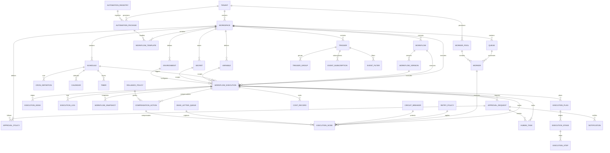

# Hermes Automation Subsystem — Production Architecture Specification

**Version:** 1.0  
**Status:** PRODUCTION_READY  
**Classification:** Authoritative Implementation Document  
**Owner:** Principal Systems Architect  
**Platform:** Hermes AI Operating System  
**Date:** 2025

---

## 1. Executive Architecture

### 1.1 Responsibilities

The Automation Subsystem is the **orchestration engine** of Hermes. It owns:

| Domain | Responsibility |
|--------|---------------|
| **Workflow Orchestration** | DAG-based workflow execution, parallel/sequential/conditional execution, sub-workflows, dynamic workflows |
| **Scheduling** | Cron, interval, calendar, one-shot, delayed, event-driven, manual triggers |
| **Trigger Engine** | Webhook, API, MCP, file, queue, database, agent, chat, memory, plugin, skill, model, timer, manual triggers |
| **Rule Engine** | Boolean rules, decision tables, expression language, AI-assisted rules, policy enforcement |
| **Queue Management** | FIFO, priority, delayed, distributed, DLQ, retry, scheduled queues with worker allocation |
| **Execution Runtime** | Node execution, retries, cancellation, timeout, suspension, resume, compensation, rollback, checkpoint recovery |
| **Human-in-the-loop** | Approval workflows, human tasks, escalation, delegation |
| **State Management** | Workflow state, execution state, variable store, secret resolution, snapshots |
| **Event-Driven Automation** | Event bus, event store, CQRS, event sourcing for all automation activities |

### 1.2 Scope Boundaries

| In Scope (Owns) | Out of Scope (Delegates) |
|-----------------|-------------------------|
| Workflow definition & execution | Agent runtime & reasoning (Agents subsystem) |
| Scheduling & trigger management | Model serving & inference (Models subsystem) |
| Queue orchestration & worker pools | Skill marketplace & execution (Skills subsystem) |
| Rule engine & policy evaluation | Plugin marketplace & sandbox (Plugins subsystem) |
| Human approval workflows | Memory & knowledge retrieval (Memory & Knowledge subsystem) |
| State persistence & snapshots | MCP server management (MCP subsystem) |
| Event bus & event store for automation | Chat session management (Chat subsystem) |
| Compensation & rollback logic | Global DR/multi-region (Hermes Core) |
| Cost tracking per execution | Enterprise auth/SSO (Hermes Core) |
| SLA monitoring & alerting | Platform observability (Hermes Core) |

### 1.3 Design Principles

1. **Event-Driven First** — All state changes emit domain events; CQRS separates read/write
2. **Durable Execution** — Every workflow step is checkpointed; resumable after any failure
3. **Human-Centric** — First-class support for approvals, manual tasks, escalation
4. **Multi-Tenant Isolation** — Row-level security, per-tenant queues, resource quotas
5. **Vendor Agnostic** — Pluggable queue backends (Kafka, Redis, RabbitMQ, SQS)
6. **Observability Native** — Every execution emits structured traces, metrics, logs
7. **Security by Default** — Sandbox execution, secret injection, audit trails, workflow signing
8. **Cost Transparency** — Per-execution cost tracking, budget enforcement, forecasting

### 1.4 High-Level Architecture

```
┌─────────────────────────────────────────────────────────────────────────────────┐
│                            API LAYER                                             │
│  ┌──────────┐ ┌──────────┐ ┌──────────┐ ┌──────────┐ ┌──────────┐ ┌──────────┐  │
│  │  REST    │ │  gRPC    │ │ WebSocket│ │  MCP     │ │ GraphQL  │ │  Admin   │  │
│  └────┬─────┘ └────┬─────┘ └────┬─────┘ └────┬─────┘ └────┬─────┘ └────┬─────┘  │
└───────┼─────────────┼─────────────┼─────────────┼─────────────┼─────────────┼──────┘
        │             │             │             │             │             │
┌───────▼─────────────────────────────────────────────────────────────────────────┐
│                        APPLICATION LAYER                                        │
│  ┌────────────┐ ┌────────────┐ ┌────────────┐ ┌────────────┐ ┌────────────┐   │
│  │Automation  │ │ Workflow   │ │ Scheduler  │ │  Trigger   │ │ RuleEngine │   │
│  │  Service   │ │  Service   │ │  Service   │ │  Service   │ │  Service   │   │
│  └─────┬──────┘ └─────┬──────┘ └─────┬──────┘ └─────┬──────┘ └─────┬──────┘   │
│        │              │              │              │              │            │
│  ┌─────▼──────┐ ┌─────▼──────┐ ┌─────▼──────┐ ┌─────▼──────┐ ┌─────▼──────┐   │
│  │ Execution  │ │  Approval  │ │Notification│ │   Queue    │ │  Worker    │   │
│  │  Service   │ │  Service   │ │  Service   │ │  Service   │ │ Pool Svc   │   │
│  └─────┬──────┘ └─────┬──────┘ └─────┬──────┘ └─────┬──────┘ └─────┬──────┘   │
└────────┼──────────────┼──────────────┼──────────────┼──────────────┼────────────┘
         │              │              │              │              │
┌────────▼────────────────────────────────────────────────────────────────────────┐
│                         DOMAIN LAYER                                             │
│  ┌────────────┐ ┌────────────┐ ┌────────────┐ ┌────────────┐ ┌────────────┐   │
│  │ Workflow   │ │ Execution  │ │  Trigger   │ │   Rule     │ │  State     │   │
│  │  Domain    │ │  Domain    │ │  Domain    │ │  Domain    │ │  Domain    │   │
│  └─────┬──────┘ └─────┬──────┘ └─────┬──────┘ └─────┬──────┘ └─────┬──────┘   │
└────────┼──────────────┼──────────────┼──────────────┼──────────────┼────────────┘
         │              │              │              │              │
┌────────▼────────────────────────────────────────────────────────────────────────┐
│                       EXECUTION LAYER                                           │
│  ┌────────────┐ ┌────────────┐ ┌────────────┐ ┌────────────┐ ┌────────────┐   │
│  │Workflow    │ │   State    │ │ Checkpoint │ │ Compensation│ │  Retry     │   │
│  │  Engine    │ │  Machine   │ │  Manager   │ │  Engine    │ │  Engine    │   │
│  └────────────┘ └────────────┘ └────────────┘ └────────────┘ └────────────┘   │
└────────────────────────────────────────────────────────────────────────────────┘
         │              │              │              │              │
┌────────▼────────────────────────────────────────────────────────────────────────┐
│                       INFRASTRUCTURE LAYER                                       │
│  ┌────────────┐ ┌────────────┐ ┌────────────┐ ┌────────────┐ ┌────────────┐   │
│  │   Queue    │ │   Event    │ │  Storage   │ │  Secrets   │ │   Cache    │   │
│  │  Broker    │ │   Store    │ │  (Postgres)│ │  (Vault)   │ │  (Redis)   │   │
│  │ (Kafka/    │ │  (Kafka/   │ │            │ │            │ │            │   │
│  │  Redis/    │ │  EventStore)│ │            │ │            │ │            │   │
│  │  RabbitMQ) │ │            │ │            │ │            │ │            │   │
│  └────────────┘ └────────────┘ └────────────┘ └────────────┘ └────────────┘   │
└────────────────────────────────────────────────────────────────────────────────┘
```

---

## 2. Architecture Layers

### 2.1 Layer Definitions

| Layer | Responsibility | Key Components |
|-------|---------------|----------------|
| **API Layer** | External interfaces, protocol translation, auth | REST, gRPC, WebSocket, MCP, GraphQL, Admin |
| **Application Layer** | Orchestration services, business logic coordination | 19 core services |
| **Domain Layer** | Pure domain logic, entities, value objects, policies | Workflow, Execution, Trigger, Rule, State domains |
| **Execution Layer** | Core runtime engines | Workflow Engine, State Machine, Checkpoint, Compensation, Retry |
| **Infrastructure Layer** | External system adapters | Queue Broker, Event Store, Storage, Secrets, Cache |

### 2.2 Cross-Layer Concerns

| Concern | Implementation |
|---------|---------------|
| **Authentication** | mTLS + JWT at API layer; forwarded via headers |
| **Authorization** | ABAC policies evaluated at Application layer |
| **Observability** | OpenTelemetry instrumentation at all layers |
| **Error Handling** | Structured errors with retry/circuit breaker metadata |
| **Transactions** | Event-sourced aggregates; outbox pattern for cross-service |

---

## 3. Core Services

### 3.1 Service Catalogue

| Service | Responsibility | Workers | APIs | Events |
|---------|---------------|---------|------|--------|
| **AutomationService** | Top-level orchestration, package management, registry | `PackageIndexer`, `RegistrySync` | Automation API | `automation.package.published`, `automation.registry.synced` |
| **WorkflowService** | Workflow CRUD, versioning, templates, validation | `TemplateValidator`, `VersionPublisher` | Workflow API | `workflow.created`, `workflow.updated`, `workflow.versioned`, `workflow.deleted` |
| **SchedulerService** | Cron, interval, calendar, delayed, one-shot schedules | `CronEvaluator`, `CalendarResolver`, `DelayedJobReaper` | Schedule API | `schedule.triggered`, `schedule.created`, `schedule.updated`, `schedule.deleted` |
| **TriggerService** | All trigger types, webhook registration, event subscriptions | `WebhookRegistrar`, `EventSubscriber`, `TriggerEvaluator` | Trigger API | `trigger.fired`, `trigger.registered`, `trigger.failed`, `webhook.received` |
| **RuleEngineService** | Rule evaluation, decision tables, expression language, policy enforcement | `RuleCompiler`, `DecisionTableOptimizer`, `PolicyCache` | Rule API | `rule.evaluated`, `rule.matched`, `policy.violated`, `rule.compiled` |
| **ExecutionService** | Workflow execution lifecycle, node execution, parallel coordination | `ExecutionCoordinator`, `NodeExecutor`, `ParallelExecutor` | Execution API | `execution.started`, `execution.completed`, `execution.failed`, `execution.cancelled`, `execution.suspended`, `execution.resumed` |
| **QueueService** | Queue management, partitioning, health, DLQ | `QueueBalancer`, `HealthMonitor`, `DLQProcessor` | Queue API | `queue.created`, `queue.health.changed`, `dlq.message.added` |
| **WorkerPoolService** | Worker registration, allocation, scaling, health | `WorkerRegistrar`, `AllocationEngine`, `AutoScaler` | Worker API | `worker.registered`, `worker.health.changed`, `pool.scaled` |
| **ApprovalService** | Approval requests, policies, escalation, delegation | `EscalationEngine`, `DelegationManager`, `ExpiryMonitor` | Approval API | `approval.requested`, `approval.granted`, `approval.denied`, `approval.escalated`, `approval.expired` |
| **NotificationService** | Multi-channel notifications, templates, preferences | `TemplateRenderer`, `ChannelDispatcher`, `PreferenceResolver` | Notification API | `notification.sent`, `notification.failed`, `notification.delivered` |
| **EventService** | Event bus, event store, subscriptions, replay | `EventPublisher`, `EventStoreManager`, `SubscriptionManager` | Event API | `event.published`, `event.stored`, `subscription.created` |
| **RetryService** | Retry policies, exponential backoff, circuit breakers | `RetryExecutor`, `CircuitBreakerMonitor`, `BackoffCalculator` | Retry API | `retry.attempted`, `retry.exhausted`, `circuit.opened`, `circuit.closed` |
| **RollbackService** | Compensation actions, saga rollback, state restoration | `CompensationExecutor`, `StateRestorer`, `SagaCoordinator` | Rollback API | `rollback.started`, `rollback.completed`, `rollback.failed`, `compensation.executed` |
| **StateMachineService** | Workflow state machines, execution state, transitions | `StateValidator`, `TransitionExecutor`, `Snapshotter` | State API | `state.changed`, `state.snapshotted`, `transition.executed` |
| **VariableService** | Variable store, scoping, interpolation, encryption | `ScopeResolver`, `InterpolationEngine`, `EncryptionManager` | Variable API | `variable.set`, `variable.resolved`, `variable.encrypted` |
| **SecretResolverService** | Secret injection, rotation, lease management, audit | `SecretInjector`, `RotationManager`, `LeaseManager`, `AuditLogger` | Secret API | `secret.resolved`, `secret.rotated`, `secret.lease.expired`, `secret.accessed` |
| **AuditService** | Immutable audit logs, tamper detection, compliance export | `LogAppender`, `IntegrityVerifier`, `ComplianceExporter` | Audit API | `audit.logged`, `audit.exported`, `integrity.verified` |
| **AnalyticsService** | Execution analytics, cost tracking, performance, trends | `CostAggregator`, `PerformanceAnalyzer`, `TrendDetector` | Analytics API | `analytics.aggregated`, `cost.forecast.updated`, `performance.alert` |
| **MonitoringService** | Real-time dashboards, SLO tracking, alerting | `MetricsCollector`, `SLOEvaluator`, `AlertManager` | Monitor API | `slo.breached`, `alert.fired`, `health.changed` |
| **OperationsService** | Install, update, rollback, import, export, validate, sign, verify | `InstallWorker`, `UpdateWorker`, `ImportWorker`, `ExportWorker` | Operations API | `operation.started`, `operation.completed`, `operation.failed` |

### 3.2 Service Dependencies

```
AutomationService
  → WorkflowService (definitions)
  → SchedulerService (schedules)
  → TriggerService (triggers)
  → RuleEngineService (policies)
  → QueueService (work queues)
  → WorkerPoolService (workers)
  → AnalyticsService (metrics)

WorkflowService
  → VariableService (variables)
  → SecretResolverService (secrets)
  → EventService (events)
  → AuditService (audit)

ExecutionService
  → StateMachineService (state)
  → RetryService (retries)
  → RollbackService (compensation)
  → CheckpointManager (checkpoints)
  → WorkerPoolService (node execution)
  → ApprovalService (human tasks)
  → NotificationService (notifications)

SchedulerService
  → QueueService (scheduled jobs)
  → TriggerService (timer triggers)
  → EventService (events)

TriggerService
  → EventService (event triggers)
  → QueueService (queue triggers)
  → MCP Integration (MCP triggers)
  → Agent Integration (agent triggers)
  → Chat Integration (chat triggers)
  → Memory Integration (memory triggers)

RuleEngineService
  → VariableService (variable interpolation)
  → SecretResolverService (secret access)
  → EventService (rule events)

QueueService
  → WorkerPoolService (worker allocation)
  → EventService (queue events)

WorkerPoolService
  → ExecutionService (node execution)
  → QueueService (work polling)

ApprovalService
  → NotificationService (approval notifications)
  → EscalationEngine (escalation)

EventService
  → Kafka/EventStore (persistence)
  → All services (event publishing)
```

---

## 4. Domain Model

### 4.1 Core Identifiers (Branded Types)

```typescript
type TenantId = string & { readonly __brand: unique symbol };
type WorkspaceId = string & { readonly __brand: unique symbol };
type UserId = string & { readonly __brand: unique symbol };
type AgentId = string & { readonly __brand: unique symbol };
type SessionId = string & { readonly __brand: unique symbol };

// Workflow
type WorkflowId = string & { readonly __brand: unique symbol };
type WorkflowVersionId = string & { readonly __brand: unique symbol };
type WorkflowTemplateId = string & { readonly __brand: unique symbol };
type WorkflowExecutionId = string & { readonly __brand: unique symbol };
type WorkflowRunId = string & { readonly __brand: unique symbol };
type WorkflowSnapshotId = string & { readonly __brand: unique symbol };

// Execution
type ExecutionPlanId = string & { readonly __brand: unique symbol };
type ExecutionStageId = string & { readonly __brand: unique symbol };
type ExecutionStepId = string & { readonly __brand: unique symbol };
type ExecutionNodeId = string & { readonly __brand: unique symbol };
type ExecutionEdgeId = string & { readonly __brand: unique symbol };
type ExecutionLogId = string & { readonly __brand: unique symbol };

// Trigger
type TriggerId = string & { readonly __brand: unique symbol };
type TriggerGroupId = string & { readonly __brand: unique symbol };
type EventSubscriptionId = string & { readonly __brand: unique symbol };
type EventFilterId = string & { readonly __brand: unique symbol };

// Schedule
type ScheduleId = string & { readonly __brand: unique symbol };
type CalendarId = string & { readonly __brand: unique symbol };
type CronDefinitionId = string & { readonly __brand: unique symbol };
type TimerId = string & { readonly __brand: unique symbol };

// Approval
type ApprovalRequestId = string & { readonly __brand: unique symbol };
type ApprovalPolicyId = string & { readonly __brand: unique symbol };
type HumanTaskId = string & { readonly __brand: unique symbol };

// Queue
type QueueId = string & { readonly __brand: unique symbol };
type WorkerPoolId = string & { readonly __brand: unique symbol };
type WorkerId = string & { readonly __brand: unique symbol };

// Policy
type RetryPolicyId = string & { readonly __brand: unique symbol };
type RollbackPolicyId = string & { readonly __brand: unique symbol };
type CircuitBreakerId = string & { readonly __brand: unique symbol };
type DeadLetterQueueId = string & { readonly __brand: unique symbol };

// Compensation
type CompensationActionId = string & { readonly __brand: unique symbol };

// Variable
type VariableId = string & { readonly __brand: unique symbol };
type SecretId = string & { readonly __brand: unique symbol };
type EnvironmentId = string & { readonly __brand: unique symbol };

// Package
type AutomationPackageId = string & { readonly __brand: unique symbol };
type AutomationRegistryId = string & { readonly __brand: unique symbol };

// Observability
type AlertId = string & { readonly __brand: unique symbol };
type NotificationId = string & { readonly __brand: unique symbol };
type MetricsId = string & { readonly __brand: unique symbol };
type CostRecordId = string & { readonly __brand: unique symbol };
type AuditRecordId = string & { readonly __brand: unique symbol };
```

### 4.2 Core Entities (ER Diagram)



### 4.3 Complete TypeScript Interfaces

```typescript
// ============================================================
// WORKFLOW DOMAIN
// ============================================================

interface Workflow {
  id: WorkflowId;
  tenantId: TenantId;
  workspaceId: WorkspaceId;
  name: string;
  description: string;
  category: string;
  tags: string[];
  status: WorkflowStatus;
  currentVersion: WorkflowVersionId;
  versions: WorkflowVersionId[];
  templates: WorkflowTemplateId[];
  triggers: TriggerId[];
  schedules: ScheduleId[];
  approvalPolicies: ApprovalPolicyId[];
  variables: VariableId[];
  secrets: SecretId[];
  environments: EnvironmentId[];
  retryPolicy: RetryPolicyId;
  rollbackPolicy: RollbackPolicyId;
  circuitBreaker: CircuitBreakerId;
  deadLetterQueue: DeadLetterQueueId;
  timeout: number;
  maxRetries: number;
  concurrencyLimit: number;
  priority: ExecutionPriority;
  metadata: WorkflowMetadata;
  createdAt: Date;
  updatedAt: Date;
  createdBy: UserId;
  deletedAt?: Date;
}

type WorkflowStatus = 'draft' | 'active' | 'paused' | 'deprecated' | 'archived' | 'quarantined';

type ExecutionPriority = 'low' | 'normal' | 'high' | 'critical' | 'realtime';

interface WorkflowMetadata {
  owner: UserId;
  team?: string;
  project?: string;
  costCenter?: string;
  complianceTags: string[];
  documentationUrl?: string;
  repositoryUrl?: string;
  custom: Record<string, any>;
}

interface WorkflowVersion {
  id: WorkflowVersionId;
  workflowId: WorkflowId;
  version: string;
  definition: WorkflowDefinition;
  changelog: string;
  status: VersionStatus;
  breakingChanges: boolean;
  migrationScript?: string;
  schemaHash: string;
  publishedAt: Date;
  publishedBy: UserId;
  deprecatedAt?: Date;
  deprecatedBy?: UserId;
}

type VersionStatus = 'draft' | 'published' | 'deprecated' | 'archived';

interface WorkflowDefinition {
  nodes: WorkflowNode[];
  edges: WorkflowEdge[];
  variables: WorkflowVariable[];
  config: WorkflowConfig;
  triggers: TriggerReference[];
  schedules: ScheduleReference[];
}

interface WorkflowNode {
  id: string;
  type: NodeType;
  name: string;
  description: string;
  position: { x: number; y: number };
  config: NodeConfig;
  inputs: NodeInput[];
  outputs: NodeOutput[];
  conditions: NodeCondition[];
  retries: RetryConfig;
  timeout: number;
  compensation?: CompensationConfig;
  dependsOn: string[];
  loopConfig?: LoopConfig;
  subWorkflowId?: WorkflowId;
  humanTaskConfig?: HumanTaskConfig;
  aiConfig?: AIConfig;
}

type NodeType = 
  | 'start' | 'end' 
  | 'task' | 'script' | 'http' | 'grpc' | 'mcp' | 'agent' | 'skill' | 'plugin' | 'model' | 'custom'
  | 'condition' | 'switch' | 'parallel' | 'sequential' | 'foreach' | 'while' | 'do-while'
  | 'subworkflow' | 'human' | 'approval' | 'wait' | 'delay' | 'timer'
  | 'fanout' | 'fanin' | 'merge' | 'split' | 'join'
  | 'rollback' | 'compensate' | 'checkpoint' | 'snapshot'
  | 'variable' | 'secret' | 'transform' | 'filter' | 'map' | 'reduce'
  | 'ai-generate' | 'ai-classify' | 'ai-extract' | 'ai-summarize' | 'ai-decide';

interface NodeConfig {
  // Task nodes
  handler?: string;
  runtime?: 'node' | 'python' | 'deno' | 'wasm' | 'native' | 'container';
  image?: string;
  command?: string[];
  args?: string[];
  env?: Record<string, string>;
  resources?: ResourceRequirements;
  
  // HTTP/gRPC/MCP
  method?: string;
  url?: string;
  headers?: Record<string, string>;
  payload?: any;
  timeout?: number;
  retryPolicy?: RetryConfig;
  circuitBreaker?: CircuitBreakerConfig;
  
  // Agent/Skill/Plugin/Model
  agentId?: AgentId;
  skillId?: string;
  pluginId?: string;
  modelId?: string;
  inputMapping?: Record<string, string>;
  outputMapping?: Record<string, string>;
  
  // Condition/Switch
  expression?: string;
  cases?: SwitchCase[];
  defaultCase?: string;
  
  // Loops
  collection?: string;
  iterator?: string;
  maxIterations?: number;
  
  // Human/Approval
  assignees?: string[];
  role?: string;
  escalationPolicy?: EscalationPolicyConfig;
  formSchema?: JSONSchema;
  instructions?: string;
  
  // Compensation
  compensationHandler?: string;
  compensationInput?: Record<string, any>;
  
  // Checkpoint/Snapshot
  checkpointFields?: string[];
  
  custom: Record<string, any>;
}

interface SwitchCase {
  condition: string;
  nextNodeId: string;
}

interface LoopConfig {
  type: 'for-each' | 'while' | 'do-while' | 'count';
  collection?: string;
  condition?: string;
  count?: number;
  parallel: boolean;
  maxParallelism: number;
  iteratorVariable: string;
  indexVariable?: string;
}

interface NodeInput {
  name: string;
  type: string;
  required: boolean;
  default?: any;
  description: string;
  schema: JSONSchema;
  mapping?: InputMapping;
}

interface InputMapping {
  source: 'workflow-variable' | 'execution-context' | 'previous-output' | 'trigger-payload' | 'secret' | 'constant' | 'expression';
  path: string;
  transform?: string;
}

interface NodeOutput {
  name: string;
  type: string;
  description: string;
  schema: JSONSchema;
  mapping?: OutputMapping;
}

interface OutputMapping {
  target: 'workflow-variable' | 'execution-context' | 'next-input' | 'output' | 'log';
  path: string;
}

interface NodeCondition {
  field: string;
  operator: FilterOperator;
  value: any;
  logic: 'and' | 'or' | 'not';
}

type FilterOperator = 
  | 'eq' | 'ne' | 'gt' | 'gte' | 'lt' | 'lte'
  | 'in' | 'nin' | 'contains' | 'not_contains'
  | 'starts_with' | 'ends_with' | 'regex'
  | 'exists' | 'not_exists'
  | 'is_true' | 'is_false' | 'is_null' | 'is_not_null';

interface RetryConfig {
  maxAttempts: number;
  initialDelay: number;
  maxDelay: number;
  multiplier: number;
  jitter: boolean;
  retryableErrors: string[];
  nonRetryableErrors: string[];
  onExhausted: 'fail' | 'compensate' | 'continue' | 'escalate' | 'dead-letter';
}

interface CircuitBreakerConfig {
  enabled: boolean;
  threshold: number;
  timeout: number;
  resetTimeout: number;
  halfOpenRequests: number;
  fallback?: FallbackConfig;
}

interface FallbackConfig {
  type: 'static' | 'handler' | 'workflow' | 'skip';
  value?: any;
  handler?: string;
  workflowId?: WorkflowId;
}

interface CompensationConfig {
  type: 'automatic' | 'manual' | 'handler' | 'workflow';
  handler?: string;
  workflowId?: WorkflowId;
  inputMapping?: Record<string, string>;
  timeout: number;
  retryPolicy: RetryConfig;
}

interface HumanTaskConfig {
  title: string;
  description: string;
  assignees: string[];
  role?: string;
  formSchema: JSONSchema;
  instructions?: string;
  dueDate?: Date;
  duration?: number;
  priority: 'low' | 'normal' | 'high' | 'urgent';
  escalationPolicy?: EscalationPolicyConfig;
  delegationPolicy?: DelegationPolicyConfig;
  reminders?: ReminderConfig[];
  requiredApprovals: number;
  approvalType: 'any' | 'all' | 'majority' | 'consensus';
}

interface EscalationPolicyConfig {
  enabled: boolean;
  levels: EscalationLevelConfig[];
  autoEscalate: boolean;
}

interface EscalationLevelConfig {
  level: number;
  delay: number;
  assignees: string[];
  channels: NotificationChannel[];
  requireResponse: boolean;
}

interface DelegationPolicyConfig {
  enabled: boolean;
  allowedRoles: string[];
  requireApproval: boolean;
}

interface ReminderConfig {
  interval: number;
  channels: NotificationChannel[];
  template?: string;
}

interface AIConfig {
  provider: string;
  model: string;
  prompt: string;
  systemPrompt?: string;
  temperature: number;
  maxTokens: bigint;
  inputVariables: string[];
  outputSchema: JSONSchema;
  fewShotExamples?: FewShotExample[];
  retryOnFailure: boolean;
  fallback?: FallbackConfig;
}

interface FewShotExample {
  input: Record<string, any>;
  output: Record<string, any>;
}

interface ResourceRequirements {
  cpu?: string;
  memory?: string;
  gpu?: number;
  disk?: string;
  timeout?: number;
}

interface WorkflowEdge {
  id: string;
  sourceNodeId: string;
  sourceOutput: string;
  targetNodeId: string;
  targetInput: string;
  condition?: EdgeCondition;
  type: 'data' | 'control' | 'compensation';
  priority: number;
}

interface EdgeCondition {
  expression: string;
  type: 'guard' | 'filter' | 'transform';
}

interface WorkflowVariable {
  name: string;
  type: 'string' | 'number' | 'boolean' | 'array' | 'object' | 'secret' | 'file' | 'json';
  required: boolean;
  default?: any;
  description: string;
  schema: JSONSchema;
  scope: 'global' | 'local' | 'input' | 'output' | 'shared';
  encrypted: boolean;
  sensitive: boolean;
  validation?: ValidationRule[];
}

interface ValidationRule {
  type: 'pattern' | 'range' | 'enum' | 'length' | 'custom';
  config: Record<string, any>;
  message: string;
}

interface WorkflowConfig {
  executionMode: 'sequential' | 'parallel' | 'hybrid';
  maxConcurrency: number;
  defaultTimeout: number;
  retryPolicy: RetryConfig;
  errorHandling: ErrorHandlingStrategy;
  checkpointing: CheckpointConfig;
  logging: LoggingConfig;
  notifications: NotificationConfig;
  security: ExecutionSecurityConfig;
  cost: CostConfig;
}

type ErrorHandlingStrategy = 'fail-fast' | 'continue' | 'compensate' | 'retry' | 'pause' | 'dead-letter';

interface CheckpointConfig {
  enabled: boolean;
  interval: number;
  onNodeComplete: boolean;
  onError: boolean;
  onHumanTask: boolean;
  storage: 'database' | 'object-store' | 'hybrid';
  compression: boolean;
  encryption: boolean;
}

interface LoggingConfig {
  level: 'debug' | 'info' | 'warn' | 'error';
  destination: 'database' | 'console' | 'file' | 'syslog' | 'elastic' | 'loki' | 'custom';
  format: 'json' | 'text' | 'structured';
  includePayloads: boolean;
  sampling: number;
  maskSensitive: boolean;
}

interface NotificationConfig {
  onStart: boolean;
  onComplete: boolean;
  onError: boolean;
  onTimeout: boolean;
  onSuspend: boolean;
  onResume: boolean;
  onHumanTask: boolean;
  onApproval: boolean;
  channels: NotificationChannel[];
  template: string;
}

interface ExecutionSecurityConfig {
  sandbox: boolean;
  allowedDomains: string[];
  blockedDomains: string[];
  networkPolicy: 'none' | 'egress' | 'ingress' | 'full';
  fileSystemAccess: 'none' | 'read' | 'write' | 'full';
  environmentVariables: string[];
  capabilityWhitelist: string[];
}

interface CostConfig {
  trackCosts: boolean;
  budgetLimit?: number;
  costPerExecutionLimit?: number;
  currency: string;
  billingModel: 'per-execution' | 'per-node' | 'per-second' | 'custom';
}

interface TriggerReference {
  triggerId: TriggerId;
  enabled: boolean;
  filter?: EventFilter;
}

interface ScheduleReference {
  scheduleId: ScheduleId;
  enabled: boolean;
  payload?: Record<string, any>;
}

// ============================================================
// WORKFLOW TEMPLATE
// ============================================================

interface WorkflowTemplate {
  id: WorkflowTemplateId;
  tenantId: TenantId;
  workspaceId: WorkspaceId;
  name: string;
  description: string;
  category: string;
  tags: string[];
  version: string;
  definition: WorkflowDefinition;
  parameters: TemplateParameter[];
  metadata: TemplateMetadata;
  status: TemplateStatus;
  createdAt: Date;
  updatedAt: Date;
  createdBy: UserId;
  publishedAt?: Date;
  downloads: number;
  rating: number;
}

interface TemplateParameter {
  name: string;
  type: 'string' | 'number' | 'boolean' | 'array' | 'object' | 'choice';
  required: boolean;
  default?: any;
  description: string;
  schema: JSONSchema;
  options?: TemplateOption[];
  dependsOn?: string[];
}

interface TemplateOption {
  value: any;
  label: string;
  description: string;
}

interface TemplateMetadata {
  author: string;
  license: string;
  repository?: string;
  documentation?: string;
  icon?: string;
  version: string;
  minHermesVersion: string;
  dependencies: TemplateDependency[];
  verified: boolean;
  verifiedAt?: Date;
  verifiedBy?: UserId;
}

interface TemplateDependency {
  type: 'workflow' | 'skill' | 'plugin' | 'model' | 'package';
  id: string;
  version: string;
  required: boolean;
}

type TemplateStatus = 'draft' | 'published' | 'deprecated' | 'archived' | 'quarantined';

// ============================================================
// EXECUTION DOMAIN
// ============================================================

interface WorkflowExecution {
  id: WorkflowExecutionId;
  tenantId: TenantId;
  workspaceId: WorkspaceId;
  workflowId: WorkflowId;
  workflowVersionId: WorkflowVersionId;
  triggerId?: TriggerId;
  scheduleId?: ScheduleId;
  status: ExecutionStatus;
  input: Record<string, any>;
  output?: Record<string, any>;
  error?: ExecutionError;
  startTime: Date;
  endTime?: Date;
  duration?: number;
  currentNode?: string;
  completedNodes: string[];
  failedNodes: string[];
  skippedNodes: string[];
  suspendedAt?: Date;
  suspendedBy?: UserId;
  resumeCount: number;
  retryCount: number;
  variables: Record<string, any>;
  secrets: SecretReference[];
  traceId: string;
  spanId: string;
  parentExecutionId?: WorkflowExecutionId;
  rootExecutionId: WorkflowExecutionId;
  plan: ExecutionPlanId;
  snapshots: WorkflowSnapshotId[];
  cost: CostRecordId;
  metrics: ExecutionMetrics;
  tags: string[];
  metadata: ExecutionMetadata;
  createdAt: Date;
  updatedAt: Date;
}

type ExecutionStatus = 
  | 'pending' | 'queued' | 'running' | 'paused' | 'suspended' 
  | 'waiting' | 'retrying' | 'compensating' | 'rolling-back'
  | 'completed' | 'failed' | 'cancelled' | 'timed-out' | 'dead-lettered';

interface ExecutionError {
  nodeId: string;
  code: string;
  message: string;
  stack?: string;
  cause?: string;
  recoverable: boolean;
  retryCount: number;
  timestamp: Date;
  context: Record<string, any>;
}

interface ExecutionPlan {
  id: ExecutionPlanId;
  executionId: WorkflowExecutionId;
  stages: ExecutionStage[];
  totalNodes: number;
  estimatedDuration: number;
  criticalPath: string[];
  parallelGroups: ParallelGroup[];
  resourceRequirements: ResourceRequirements;
  createdAt: Date;
  updatedAt: Date;
}

interface ExecutionStage {
  id: ExecutionStageId;
  planId: ExecutionPlanId;
  name: string;
  nodes: ExecutionNodeId[];
  dependsOn: ExecutionStageId[];
  parallel: boolean;
  status: StageStatus;
  startedAt?: Date;
  completedAt?: Date;
  duration?: number;
}

type StageStatus = 'pending' | 'running' | 'completed' | 'failed' | 'skipped';

interface ParallelGroup {
  id: string;
  nodes: ExecutionNodeId[];
  maxParallelism: number;
  strategy: 'all' | 'batch' | 'dynamic';
}

interface ExecutionNode {
  id: ExecutionNodeId;
  executionId: WorkflowExecutionId;
  planId: ExecutionPlanId;
  stageId: ExecutionStageId;
  workflowNodeId: string;
  name: string;
  type: NodeType;
  status: NodeStatus;
  input: Record<string, any>;
  output?: Record<string, any>;
  error?: ExecutionError;
  startTime: Date;
  endTime?: Date;
  duration?: number;
  attempts: number;
  maxAttempts: number;
  workerId?: WorkerId;
  queueId?: QueueId;
  checkpointId?: string;
  compensationActionId?: CompensationActionId;
  retryPolicy: RetryConfig;
  circuitBreaker: CircuitBreakerConfig;
  timeout: number;
  traceId: string;
  spanId: string;
  logs: ExecutionLogId[];
  metrics: NodeMetrics;
  createdAt: Date;
  updatedAt: Date;
}

type NodeStatus = 
  | 'pending' | 'queued' | 'running' | 'paused' | 'waiting' 
  | 'retrying' | 'compensating' | 'completed' | 'failed' 
  | 'skipped' | 'cancelled' | 'timed-out' | 'dead-lettered';

interface ExecutionEdge {
  id: ExecutionEdgeId;
  executionId: WorkflowExecutionId;
  sourceNodeId: ExecutionNodeId;
  targetNodeId: ExecutionNodeId;
  sourceOutput: string;
  targetInput: string;
  status: EdgeStatus;
  data?: any;
  evaluatedAt?: Date;
}

type EdgeStatus = 'pending' | 'evaluated' | 'passed' | 'failed' | 'skipped';

interface ExecutionLog {
  id: ExecutionLogId;
  executionId: WorkflowExecutionId;
  nodeId?: ExecutionNodeId;
  timestamp: Date;
  level: 'debug' | 'info' | 'warn' | 'error' | 'critical';
  message: string;
  context: Record<string, any>;
  traceId: string;
  spanId: string;
}

interface WorkflowSnapshot {
  id: WorkflowSnapshotId;
  executionId: WorkflowExecutionId;
  version: number;
  state: ExecutionState;
  variables: Record<string, any>;
  completedNodes: string[];
  nodeOutputs: Record<string, any>;
  nodeStatuses: Record<string, NodeStatus>;
  createdAt: Date;
  createdBy: string;
  trigger: SnapshotTrigger;
}

type SnapshotTrigger = 'checkpoint' | 'error' | 'human-task' | 'approval' | 'manual' | 'scheduled' | 'pre-compensation';

interface ExecutionState {
  workflowExecutionId: WorkflowExecutionId;
  status: ExecutionStatus;
  currentNodes: string[];
  pendingNodes: string[];
  completedNodes: string[];
  failedNodes: string[];
  variables: Record<string, any>;
  secrets: SecretReference[];
  checkpoints: Checkpoint[];
  compensations: CompensationState[];
  traceId: string;
}

interface Checkpoint {
  id: string;
  nodeId: string;
  timestamp: Date;
  variables: Record<string, any>;
  nodeOutputs: Record<string, any>;
  hash: string;
}

interface CompensationState {
  nodeId: string;
  actionId: CompensationActionId;
  status: 'pending' | 'running' | 'completed' | 'failed';
  startedAt?: Date;
  completedAt?: Date;
  error?: string;
}

interface ExecutionMetrics {
  totalNodes: number;
  completedNodes: number;
  failedNodes: number;
  retriedNodes: number;
  compensatedNodes: number;
  totalDuration: number;
  nodeDurations: Record<string, number>;
  queueWaitTime: number;
  executionTime: number;
  tokensUsed: bigint;
  cost: number;
}

interface NodeMetrics {
  queueWaitMs: number;
  executionMs: number;
  retryCount: number;
  compensationMs: number;
  memoryMb: number;
  cpuMs: number;
  tokensIn: bigint;
  tokensOut: bigint;
  cost: number;
}

// ============================================================
// TRIGGER DOMAIN
// ============================================================

interface Trigger {
  id: TriggerId;
  tenantId: TenantId;
  workspaceId: WorkspaceId;
  name: string;
  description: string;
  type: TriggerType;
  groupId?: TriggerGroupId;
  config: TriggerConfig;
  filter: EventFilter;
  targetWorkflows: WorkflowTarget[];
  status: TriggerStatus;
  enabled: boolean;
  lastFiredAt?: Date;
  fireCount: number;
  errorCount: number;
  createdAt: Date;
  updatedAt: Date;
  createdBy: UserId;
  deletedAt?: Date;
}

type TriggerType = 
  | 'webhook' | 'api' | 'mcp' | 'file' | 'queue' | 'database' 
  | 'agent' | 'chat' | 'memory' | 'plugin' | 'skill' | 'model' 
  | 'timer' | 'manual' | 'schedule' | 'event' | 'workflow' | 'custom';

type TriggerStatus = 'active' | 'paused' | 'error' | 'disabled' | 'draining';

interface TriggerConfig {
  // Webhook
  path?: string;
  method?: string;
  headers?: Record<string, string>;
  secret?: string;
  verifySignature?: boolean;
  
  // API
  endpoint?: string;
  auth?: AuthConfig;
  
  // MCP
  serverId?: string;
  capability?: 'tool' | 'resource' | 'prompt';
  name?: string;
  
  // File
  path?: string;
  pattern?: string;
  watchMode?: 'create' | 'modify' | 'delete' | 'all';
  recursive?: boolean;
  
  // Queue
  queueId?: QueueId;
  messageFilter?: MessageFilter;
  
  // Database
  table?: string;
  operation?: 'insert' | 'update' | 'delete' | 'all';
  condition?: string;
  
  // Agent
  agentId?: AgentId;
  eventTypes?: string[];
  
  // Chat
  sessionId?: SessionId;
  messageTypes?: string[];
  
  // Memory
  memoryType?: MemoryType;
  memoryQuery?: string;
  
  // Plugin/Skill/Model
  pluginId?: string;
  skillId?: string;
  modelId?: string;
  eventTypes?: string[];
  
  // Timer
  interval?: number;
  cron?: string;
  timezone?: string;
  startDate?: Date;
  endDate?: Date;
  maxRuns?: number;
  
  // Custom
  handler?: string;
  config?: Record<string, any>;
}

interface TriggerGroup {
  id: TriggerGroupId;
  tenantId: TenantId;
  workspaceId: WorkspaceId;
  name: string;
  description: string;
  triggers: TriggerId[];
  logic: 'and' | 'or' | 'sequence' | 'race';
  enabled: boolean;
  createdAt: Date;
  updatedAt: Date;
}

interface EventFilter {
  id: EventFilterId;
  tenantId: TenantId;
  workspaceId: WorkspaceId;
  name: string;
  description: string;
  eventTypes: string[];
  sources: string[];
  conditions: LogicalExpression;
  enabled: boolean;
  createdAt: Date;
  updatedAt: Date;
}

interface LogicalExpression {
  type: 'and' | 'or' | 'not' | 'equals' | 'contains' | 'gt' | 'gte' | 'lt' | 'lte' | 'in' | 'nin' | 'regex' | 'exists' | 'custom';
  field?: string;
  value?: any;
  left?: LogicalExpression;
  right?: LogicalExpression;
  operand?: LogicalExpression;
  customHandler?: string;
}

interface WorkflowTarget {
  workflowId: WorkflowId;
  version?: string;
  inputMapping: Record<string, string>;
  priority: ExecutionPriority;
  enabled: boolean;
}

interface EventSubscription {
  id: EventSubscriptionId;
  triggerId: TriggerId;
  eventType: string;
  source: string;
  filter: EventFilter;
  active: boolean;
  createdAt: Date;
  lastEventAt?: Date;
  eventCount: number;
}

// ============================================================
// SCHEDULE DOMAIN
// ============================================================

interface Schedule {
  id: ScheduleId;
  tenantId: TenantId;
  workspaceId: WorkspaceId;
  name: string;
  description: string;
  type: ScheduleType;
  config: ScheduleConfig;
  targetWorkflows: WorkflowTarget[];
  timezone: string;
  enabled: boolean;
  status: ScheduleStatus;
  nextRunAt?: Date;
  lastRunAt?: Date;
  runCount: number;
  errorCount: number;
  createdAt: Date;
  updatedAt: Date;
  createdBy: UserId;
  deletedAt?: Date;
}

type ScheduleType = 'cron' | 'interval' | 'calendar' | 'one-shot' | 'delayed' | 'recurring' | 'event';

type ScheduleStatus = 'active' | 'paused' | 'completed' | 'failed' | 'disabled' | 'draining';

interface ScheduleConfig {
  // Cron
  cronExpression?: string;
  cronTimezone?: string;
  
  // Interval
  intervalMs?: number;
  startDelay?: number;
  maxRuns?: number;
  
  // Calendar
  calendarId?: CalendarId;
  businessHoursOnly?: boolean;
  excludeHolidays?: boolean;
  
  // One-shot
  runAt?: Date;
  
  // Delayed
  delayMs?: number;
  baseTime?: 'schedule-created' | 'workflow-completed' | 'custom';
  baseTimeWorkflowId?: WorkflowExecutionId;
  
  // Recurring
  recurrenceRule?: RecurrenceRule;
  occurrences?: number;
  until?: Date.
  
  // Event
  eventType?: string;
  eventFilter?: EventFilter.
  
  // Common
  payload?: Record<string, any>.
  jitter?: JitterConfig.
  retryPolicy?: RetryConfig.
  timeout?: number.
}

interface RecurrenceRule {
  frequency: 'yearly' | 'monthly' | 'weekly' | 'daily' | 'hourly' | 'minutely'.
  interval: number.
  byMonth?: number[].
  byMonthDay?: number[].
  byWeekDay?: WeekDay[].
  byHour?: number[].
  byMinute?: number[].
  bySecond?: number[].
  bySetPos?: number[].
  wkst?: WeekDay.
}

type WeekDay = 'MO' | 'TU' | 'WE' | 'TH' | 'FR' | 'SA' | 'SU'.

interface JitterConfig {
  enabled: boolean.
  type: 'fixed' | 'random' | 'exponential'.
  maxJitterMs: number.
}

interface Calendar {
  id: CalendarId.
  tenantId: TenantId.
  workspaceId: WorkspaceId.
  name: string.
  description: string.
  timezone: string.
  businessHours: BusinessHours.
  holidays: Holiday[].
  workingDays: WeekDay[].
  exceptions: CalendarException[].
  createdAt: Date.
  updatedAt: Date.
}

interface BusinessHours {
  start: string. // HH:mm
  end: string.   // HH:mm
  breaks: Break[].
}

interface Break {
  name: string.
  start: string.
  end: string.
}

interface Holiday {
  name: string.
  date: Date.
  recurring: boolean.
  recurrenceRule?: RecurrenceRule.
}

interface CalendarException {
  date: Date.
  type: 'closed' | 'modified-hours'.
  hours?: BusinessHours.
  reason: string.
}

interface CronDefinition {
  id: CronDefinitionId.
  expression: string.
  timezone: string.
  description: string.
  nextOccurrences: Date[].
  lastOccurrence?: Date.
  isValid: boolean.
  validationError?: string.
}

// ============================================================
// APPROVAL DOMAIN
// ============================================================

interface ApprovalRequest {
  id: ApprovalRequestId.
  tenantId: TenantId.
  workspaceId: WorkspaceId.
  executionId: WorkflowExecutionId.
  nodeId: ExecutionNodeId.
  policyId: ApprovalPolicyId.
  title: string.
  description: string.
  status: ApprovalStatus.
  priority: 'low' | 'normal' | 'high' | 'urgent'.
  assignees: ApprovalAssignee[].
  requiredApprovals: number.
  currentApprovals: number.
  approvalType: 'any' | 'all' | 'majority' | 'consensus'.
  formData: Record<string, any>.
  formSchema: JSONSchema.
  dueDate?: Date.
  escalatedAt?: Date.
  escalationLevel: number.
  escalationPolicy: EscalationPolicyConfig.
  delegationPolicy: DelegationPolicyConfig.
  reminders: ReminderConfig[].
  decidedAt?: Date.
  decidedBy?: UserId.
  decision?: 'approved' | 'rejected' | 'abstained'.
  comments: ApprovalComment[].
  metadata: Record<string, any>.
  createdAt: Date.
  updatedAt: Date.
}

type ApprovalStatus = 'pending' | 'in-review' | 'approved' | 'rejected' | 'escalated' | 'expired' | 'cancelled' | 'delegated'.

interface ApprovalAssignee {
  userId: UserId.
  role?: string.
  status: 'pending' | 'approved' | 'rejected' | 'abstained' | 'delegated'.
  decidedAt?: Date.
  comment?: string.
  delegatedTo?: UserId.
}

interface ApprovalPolicy {
  id: ApprovalPolicyId.
  tenantId: TenantId.
  workspaceId: WorkspaceId.
  name: string.
  description: string.
  conditions: LogicalExpression.
  requiredApprovals: number.
  approvalType: 'any' | 'all' | 'majority' | 'consensus'.
  assignees: ApprovalAssigneeConfig[].
  role?: string.
  formSchema: JSONSchema.
  dueDateOffset?: number.
  escalationPolicy: EscalationPolicyConfig.
  delegationPolicy: DelegationPolicyConfig.
  reminders: ReminderConfig[].
  priority: 'low' | 'normal' | 'high' | 'urgent'.
  enabled: boolean.
  createdAt: Date.
  updatedAt: Date.
  createdBy: UserId.
}

interface ApprovalAssigneeConfig {
  type: 'user' | 'role' | 'group' | 'dynamic'.
  value: string.
  dynamicHandler?: string.
}

interface ApprovalComment {
  id: string.
  userId: UserId.
  comment: string.
  timestamp: Date.
  type: 'comment' | 'decision' | 'delegation' | 'escalation'.
}

interface HumanTask {
  id: HumanTaskId.
  tenantId: TenantId.
  workspaceId: WorkspaceId.
  executionId: WorkflowExecutionId.
  nodeId: ExecutionNodeId.
  approvalRequestId?: ApprovalRequestId.
  title: string.
  description: string.
  instructions: string.
  status: HumanTaskStatus.
  priority: 'low' | 'normal' | 'high' | 'urgent'.
  assignees: HumanTaskAssignee[].
  formSchema: JSONSchema.
  formData: Record<string, any>.
  dueDate?: Date.
  startedAt?: Date.
  completedAt?: Date.
  completedBy?: UserId.
  output?: Record<string, any>.
  attachments: HumanTaskAttachment[].
  comments: HumanTaskComment[].
  reminders: ReminderConfig[].
  escalationPolicy: EscalationPolicyConfig.
  delegationPolicy: DelegationPolicyConfig.
  metadata: Record<string, any>.
  createdAt: Date.
  updatedAt: Date.
}

type HumanTaskStatus = 'pending' | 'assigned' | 'in-progress' | 'completed' | 'rejected' | 'expired' | 'cancelled' | 'escalated' | 'delegated'.

interface HumanTaskAssignee {
  userId: UserId.
  role?: string.
  status: 'pending' | 'accepted' | 'declined' | 'completed'.
  assignedAt: Date.
  acceptedAt?: Date.
  completedAt?: Date.
}

interface HumanTaskAttachment {
  id: string.
  name: string.
  type: string.
  size: number.
  url: string.
  uploadedBy: UserId.
  uploadedAt: Date.
}

interface HumanTaskComment {
  id: string.
  userId: UserId.
  comment: string.
  timestamp: Date.
  type: 'comment' | 'update' | 'handoff'.
}

// ============================================================
// QUEUE & WORKER DOMAIN
// ============================================================

interface Queue {
  id: QueueId.
  tenantId: TenantId.
  workspaceId: WorkspaceId.
  name: string.
  description: string.
  type: QueueType.
  config: QueueConfig.
  status: QueueStatus.
  partitions: number.
  replicationFactor: number.
  deadLetterQueueId?: DeadLetterQueueId.
  retryQueueId?: QueueId.
  scheduledQueueId?: QueueId.
  priorityLevels: number.
  defaultPriority: number.
  maxMessageSize: number.
  retentionMs: number.
  cleanupIntervalMs: number.
  metrics: QueueMetrics.
  createdAt: Date.
  updatedAt: Date.
}

type QueueType = 'fifo' | 'priority' | 'delayed' | 'scheduled' | 'distributed' | 'custom'.

type QueueStatus = 'active' | 'paused' | 'draining' | 'maintenance' | 'error'.

interface QueueConfig {
  // FIFO
  ordering?: 'strict' | 'best-effort'.
  
  // Priority
  priorityLevels?: number.
  priorityKey?: string.
  
  // Delayed
  delayKey?: string.
  maxDelayMs?: number.
  
  // Distributed
  partitioningKey?: string.
  consistentHashing?: boolean.
  virtualNodes?: number.
  
  // Common
  maxRetries?: number.
  retryDelayMs?: number.
  deadLetterAfterRetries?: boolean.
  visibilityTimeoutMs?: number.
  maxReceiveCount?: number.
  messageDeduplication?: boolean.
  contentBasedDeduplication?: boolean.
}

interface QueueMetrics {
  messageCount: number.
  visibleMessages: number.
  delayedMessages: number.
  inFlightMessages: number.
  deadLetterMessages: number.
  throughputPerSec: number.
  avgLatencyMs: number.
  p99LatencyMs: number.
  errorRate: number.
  oldestMessageAgeMs: number.
}

interface WorkerPool {
  id: WorkerPoolId.
  tenantId: TenantId.
  workspaceId: WorkspaceId.
  name: string.
  description: string.
  type: WorkerPoolType.
  queues: QueueId[].
  config: WorkerPoolConfig.
  status: WorkerPoolStatus.
  minWorkers: number.
  maxWorkers: number.
  desiredWorkers: number.
  currentWorkers: number.
  healthyWorkers: number.
  scalingPolicy: ScalingPolicy.
  resources: PoolResourceLimits.
  metadata: Record<string, any>.
  createdAt: Date.
  updatedAt: Date.
}

type WorkerPoolType = 'static' | 'dynamic' | 'serverless' | 'kubernetes' | 'custom'.

type WorkerPoolStatus = 'active' | 'scaling' | 'draining' | 'paused' | 'error'.

interface WorkerPoolConfig {
  workerType: 'process' | 'container' | 'kubernetes-pod' | 'serverless' | 'custom'.
  image?: string.
  command?: string[].
  env?: Record<string, string>.
  resources: ResourceRequirements.
  startupTimeout: number.
  shutdownTimeout: number.
  healthCheck: HealthCheckConfig.
  runtime: WorkerRuntimeConfig.
}

interface WorkerRuntimeConfig {
  language: 'node' | 'python' | 'deno' | 'wasm' | 'native' | 'custom'.
  version: string.
  modules: string[].
  sandbox: boolean.
  allowedCapabilities: string[].
  networkPolicy: 'none' | 'egress' | 'full'.
  filesystemAccess: 'none' | 'read' | 'write'.
}

interface ScalingPolicy {
  enabled: boolean.
  metrics: ScalingMetric[].
  scaleUp: ScaleRule.
  scaleDown: ScaleRule.
  cooldownMs: number.
  maxScaleUpRate: number.
  maxScaleDownRate: number.
}

interface ScalingMetric {
  name: string.
  query: string.
  target: number.
  type: 'utilization' | 'value' | 'rate'.
}

interface ScaleRule {
  stabilizationWindowMs: number.
  policies: ScalePolicy[].
  selectPolicy: 'max' | 'min' | 'disabled'.
}

interface ScalePolicy {
  type: 'percent' | 'absolute' | 'workers'.
  value: number.
  periodMs: number.
}

interface PoolResourceLimits {
  maxCpu: number.
  maxMemoryMb: number.
  maxGpu: number.
  maxDiskGb: number.
  maxNetworkMbps: number.
  maxConcurrentExecutions: number.
}

interface Worker {
  id: WorkerId.
  poolId: WorkerPoolId.
  tenantId: TenantId.
  workspaceId: WorkspaceId.
  name: string.
  status: WorkerStatus.
  queues: QueueId[].
  currentExecution?: ExecutionNodeId.
  capabilities: WorkerCapability[].
  resources: WorkerResources.
  health: WorkerHealth.
  startedAt: Date.
  lastHeartbeatAt: Date.
  completedExecutions: number.
  failedExecutions: number.
  avgExecutionMs: number.
  metadata: Record<string, any>.
}

type WorkerStatus = 'starting' | 'healthy' | 'busy' | 'unhealthy' | 'draining' | 'stopping' | 'stopped'.

interface WorkerCapability {
  type: 'task' | 'http' | 'grpc' | 'mcp' | 'agent' | 'skill' | 'plugin' | 'model' | 'script' | 'custom'.
  name: string.
  version: string.
  config: Record<string, any>.
}

interface WorkerResources {
  cpuCores: number.
  memoryMb: number.
  gpuCount: number.
  diskGb: number.
  networkMbps: number.
}

interface WorkerHealth {
  status: 'healthy' | 'degraded' | 'unhealthy'.
  cpuUsage: number.
  memoryUsage: number.
  diskUsage: number.
  networkUsage: number.
  lastCheckAt: Date.
  issues: HealthIssue[].
}

interface HealthIssue {
  severity: 'warning' | 'critical'.
  code: string.
  message: string.
  detectedAt: Date.
}

// ============================================================
// POLICY DOMAIN
// ============================================================

interface RetryPolicy {
  id: RetryPolicyId.
  tenantId: TenantId.
  workspaceId: WorkspaceId.
  name: string.
  description: string.
  config: RetryConfig.
  appliesTo: PolicyScope.
  createdAt: Date.
  updatedAt: Date.
}

interface RollbackPolicy {
  id: RollbackPolicyId.
  tenantId: TenantId.
  workspaceId: WorkspaceId.
  name: string.
  description: string.
  strategy: 'compensate' | 'replay' | 'restore-snapshot' | 'manual' | 'custom'.
  compensationOrder: 'reverse' | 'parallel' | 'dependency'.
  timeout: number.
  maxCompensationRetries: number.
  onCompensationFailure: 'continue' | 'halt' | 'escalate' | 'alert'.
  notificationChannels: NotificationChannel[].
  appliesTo: PolicyScope.
  createdAt: Date.
  updatedAt: Date.
}

interface CircuitBreaker {
  id: CircuitBreakerId.
  tenantId: TenantId.
  workspaceId: WorkspaceId.
  name: string.
  description: string.
  config: CircuitBreakerConfig.
  state: CircuitBreakerState.
  metrics: CircuitBreakerMetrics.
  appliesTo: PolicyScope.
  createdAt: Date.
  updatedAt: Date.
}

type CircuitBreakerState = 'closed' | 'open' | 'half-open' | 'disabled'.

interface CircuitBreakerMetrics {
  totalRequests: number.
  successfulRequests: number.
  failedRequests: number.
  rejectedRequests: number.
  consecutiveFailures: number.
  consecutiveSuccesses: number.
  lastStateChange: Date.
  lastFailure?: Date.
  lastSuccess?: Date.
}

interface DeadLetterQueue {
  id: DeadLetterQueueId.
  tenantId: TenantId.
  workspaceId: WorkspaceId.
  name: string.
  description: string.
  sourceQueueId: QueueId.
  config: DLQConfig.
  status: DLQStatus.
  messageCount: number.
  maxRetentionMs: number.
  reprocessPolicy: ReprocessPolicy.
  alerting: DLQAlerting.
  createdAt: Date.
  updatedAt: Date.
}

type DLQStatus = 'active' | 'paused' | 'draining' | 'archived'.

interface DLQConfig {
  maxSize: number.
  retentionMs: number.
  compression: boolean.
  encryption: boolean.
  partitioning: boolean.
}

interface ReprocessPolicy {
  enabled: boolean.
  maxAttempts: number.
  delayMs: number.
  filter?: MessageFilter.
  onFailure: 'keep' | 'discard' | 'archive'.
}

interface DLQAlerting {
  enabled: boolean.
  threshold: number.
  windowMs: number.
  channels: NotificationChannel[].
}

interface PolicyScope {
  workflows?: WorkflowId[].
  templates?: WorkflowTemplateId[].
  tags?: string[].
  all: boolean.
}

interface CompensationAction {
  id: CompensationActionId.
  executionId: WorkflowExecutionId.
  nodeId: ExecutionNodeId.
  type: 'handler' | 'workflow' | 'manual' | 'api' | 'script' | 'custom'.
  config: CompensationConfig.
  status: CompensationStatus.
  input: Record<string, any>.
  output?: Record<string, any>.
  error?: string.
  startedAt?: Date.
  completedAt?: Date.
  retryCount: number.
  traceId: string.
}

type CompensationStatus = 'pending' | 'running' | 'completed' | 'failed' | 'skipped'.

// ============================================================
// VARIABLE & SECRET DOMAIN
// ============================================================

interface Variable {
  id: VariableId.
  tenantId: TenantId.
  workspaceId: WorkspaceId.
  name: string.
  type: 'string' | 'number' | 'boolean' | 'array' | 'object' | 'secret' | 'file' | 'json'.
  value: any.
  encrypted: boolean.
  scope: 'global' | 'workspace' | 'workflow' | 'execution' | 'node'.
  workflowId?: WorkflowId.
  executionId?: WorkflowExecutionId.
  description: string.
  tags: string[].
  readonly: boolean.
  validation?: ValidationRule[].
  createdAt: Date.
  updatedAt: Date.
  createdBy: UserId.
}

interface Secret {
  id: SecretId.
  tenantId: TenantId.
  workspaceId: WorkspaceId.
  name: string.
  type: 'api-key' | 'oauth-token' | 'certificate' | 'password' | 'ssh-key' | 'database-url' | 'custom'.
  description: string.
  required: boolean.
  rotation: RotationPolicy.
  vaultIntegration: VaultIntegrationConfig.
  masking: 'full' | 'partial' | 'hash' | 'none'.
  scope: 'global' | 'workspace' | 'workflow' | 'execution'.
  workflowId?: WorkflowId.
  executionId?: WorkflowExecutionId.
  tags: string[].
  metadata: Record<string, any>.
  createdAt: Date.
  updatedAt: Date.
  createdBy: UserId.
  deletedAt?: Date.
}

interface RotationPolicy {
  enabled: boolean.
  intervalMs: number.
  rotateOnAccess: boolean.
  notifyBeforeExpiryMs: number.
  channels: NotificationChannel[].
  autoRotate: boolean.
  maxVersionsTo: RotationStrategy.
}

type RotationStrategy = 'generate' | 'fetch' | 'external' | 'manual'.

interface VaultIntegrationConfig {
  enabled: boolean.
  provider: 'hashicorp-vault' | 'aws-secrets-manager' | 'azure-key-vault' | 'gcp-secret-manager' | 'custom'.
  path: string.
  auth: VaultAuthConfig.
  version?: number.
  cacheTtlMs: number.
}

interface VaultAuthConfig {
  type: 'token' | 'approle' | 'kubernetes' | 'aws-iam' | 'azure-ad' | 'gcp-iam'.
  config: Record<string, any>.
}

interface SecretReference {
  secretId: SecretId.
  key: string.
  version?: number.
  resolvedAt?: Date.
  expiresAt?: Date.
}

interface Environment {
  id: EnvironmentId.
  tenantId: TenantId.
  workspaceId: WorkspaceId.
  name: string.
  description: string.
  variables: Record<string, VariableId>.
  secrets: Record<string, SecretId>.
  config: EnvironmentConfig.
  status: EnvironmentStatus.
  createdAt: Date.
  updatedAt: Date.
  createdBy: UserId.
}

type EnvironmentStatus = 'active' | 'inactive' | 'deprecated'.

interface EnvironmentConfig {
  inherits?: EnvironmentId.
  overrides: Record<string, any>.
  validation: ValidationRule[].
  deploymentTargets: DeploymentTarget[].
}

interface DeploymentTarget {
  name: string.
  type: 'kubernetes' | 'cloud-run' | 'lambda' | 'ecs' | 'vm' | 'bare-metal' | 'custom'.
  config: Record<string, any>.
  variables: Record<string, string>.
  secrets: Record<string, string>.
}

// ============================================================
// PACKAGE & REGISTRY DOMAIN
// ============================================================

interface AutomationPackage {
  id: AutomationPackageId.
  tenantId: TenantId.
  name: string.
  version: string.
  description: string.
  author: string.
  license: string.
  repository?: string.
  homepage?: string.
  icon?: string.
  tags: string[].
  category: string.
  workflows: WorkflowTemplateId[].
  dependencies: PackageDependency[].
  metadata: PackageMetadata.
  status: PackageStatus.
  installSize: number.
  runtimeSize: number.
  checksums: Record<string, string>.
  signatures: PackageSignature[].
  sbom: SBOM.
  scanResults: ScanResult[].