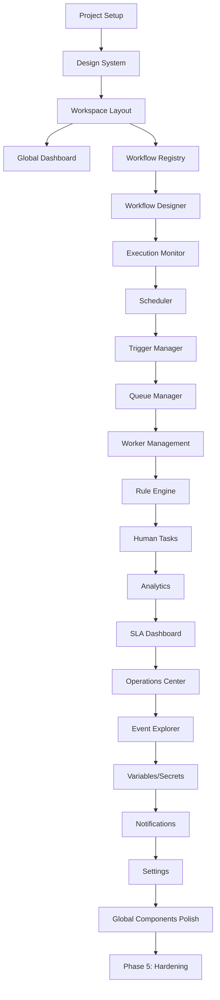

# Hermes Automation Workspace — Enterprise UI/UX Architecture Specification (Part 4)

## 26. Component Hierarchy (continued)

```mermaid
graph TD
    %% Human Tasks Components (continued)
    HumanTasks --> TaskList[TaskList]
    HumanTasks --> TaskDetail[TaskDetail]
    TaskDetail --> TaskDetailsTab[TaskDetailsTab]
    TaskDetail --> TaskFormTab[TaskFormTab]
    TaskDetail --> TaskCommentsTab[TaskCommentsTab]
    TaskDetail --> TaskAttachmentsTab[TaskAttachmentsTab]
    TaskDetail --> TaskHistoryTab[TaskHistoryTab]
    TaskDetail --> TaskAuditTab[TaskAuditTab]
    
    %% Events Components
    Events --> EventStream[EventStream]
    Events --> EventDetail[EventDetail]
    Events --> EventCorrelation[EventCorrelation]
    EventDetail --> EventPayloadTab[EventPayloadTab]
    EventDetail --> EventMetadataTab[EventMetadataTab]
    EventDetail --> EventTraceTab[EventTraceTab]
    EventDetail --> EventCorrelationsTab[EventCorrelationsTab]
    EventDetail --> EventReplayTab[EventReplayTab]
    
    %% Variables Components
    Variables --> VariableBrowser[VariableBrowser]
    Variables --> VariableDetail[VariableDetail]
    Variables --> SecretBrowser[SecretBrowser]
    Variables --> SecretDetail[SecretDetail]
    Variables --> EnvironmentManager[EnvironmentManager]
    
    %% Notifications Components
    Notifications --> NotificationRules[NotificationRules]
    Notifications --> NotificationChannels[NotificationChannels]
    Notifications --> NotificationTemplates[NotificationTemplates]
    Notifications --> NotificationHistory[NotificationHistory]
    Notifications --> NotificationEscalation[NotificationEscalation]
    NotificationTemplates --> TemplateEditor[TemplateEditor]
    
    %% Analytics Components
    Analytics --> AnalyticsNav[AnalyticsNav]
    Analytics --> AnalyticsReport[AnalyticsReport]
    Analytics --> CustomReportBuilder[CustomReportBuilder]
    AnalyticsReport --> ChartContainer[ChartContainer]
    AnalyticsReport --> DataTable[DataTable]
    AnalyticsReport --> Annotations[Annotations]
    
    %% SLA Components
    SLA --> SLODashboard[SLODashboard]
    SLA --> SLOCard[SLOCard]
    SLA --> ErrorBudgetPanel[ErrorBudgetPanel]
    SLA --> SLADetail[SLADetail]
    SLADetail --> SLOTrendTab[SLOTrendTab]
    SLADetail --> SLOBudgetTab[SLOBudgetTab]
    SLADetail --> SLOBorachesTab[SLOBorachesTab]
    SLADetail --> SLOBurnRateTab[SLOBurnRateTab]
    SLADetail --> SLOAvailabilityTab[SLOAvailabilityTab]
    
    %% Operations Components
    Operations --> OperationsNav[OperationsNav]
    Operations --> OperationPanel[OperationPanel]
    Operations --> OperationModal[OperationModal]
    
    %% Settings Components
    Settings --> SettingsTabs[SettingsTabs]
    Settings --> WorkspaceSettings[WorkspaceSettings]
    Settings --> DefaultsSettings[DefaultsSettings]
    Settings --> SecuritySettings[SecuritySettings]
    Settings --> RetentionSettings[RetentionSettings]
    Settings --> IntegrationsSettings[IntegrationsSettings]
    
    %% Global Components
    TopBar --> Logo[Logo]
    TopBar --> WorkspaceSwitcher[WorkspaceSwitcher]
    TopBar --> GlobalSearch[GlobalSearch]
    TopBar --> NotificationBell[NotificationBell]
    TopBar --> UserMenu[UserMenu]
    TopBar --> Breadcrumbs[Breadcrumbs]
    
    Sidebar --> NavPrimary[NavPrimary]
    Sidebar --> NavSecondary[NavSecondary]
    NavPrimary --> NavItem[NavItem]
    NavSecondary --> QuickActions[QuickActions]
    NavSecondary --> RecentItems[RecentItems]
    NavSecondary --> Favorites[Favorites]
    NavSecondary --> KeyboardShortcuts[KeyboardShortcuts]
    
    %% Shared UI Components
    shared[Shared Components] --> Button[Button]
    shared --> Input[Input]
    shared --> Select[Select]
    shared --> Textarea[Textarea]
    shared --> Checkbox[Checkbox]
    shared --> Radio[Radio]
    shared --> Switch[Switch]
    shared --> Slider[Slider]
    shared --> DatePicker[DatePicker]
    shared --> TimePicker[TimePicker]
    shared --> ColorPicker[ColorPicker]
    shared --> FileUpload[FileUpload]
    shared --> Table[Table]
    shared --> DataGrid[DataGrid]
    shared --> Tree[Tree]
    shared --> Tabs[Tabs]
    shared --> Accordion[Accordion]
    shared --> Modal[Modal]
    shared --> Drawer[Drawer]
    shared --> Tooltip[Tooltip]
    shared --> Popover[Popover]
    shared --> Dropdown[Dropdown]
    shared --> ContextMenu[ContextMenu]
    shared --> Breadcrumb[Breadcrumb]
    shared --> Pagination[Pagination]
    shared --> Progress[Progress]
    shared --> Spinner[Spinner]
    shared --> Skeleton[Skeleton]
    shared --> Badge[Badge]
    shared --> Avatar[Avatar]
    shared --> Icon[Icon]
    shared --> Card[Card]
    shared --> Divider[Divider]
    shared --> Alert[Alert]
    shared --> Toast[Toast]
    shared --> EmptyState[EmptyState]
    shared --> LoadMore[LoadMore]
    shared --> InfiniteScroll[InfiniteScroll]
    shared --> VirtualList[VirtualList]
    shared --> SplitView[SplitView]
    shared --> ResizablePanel[ResizablePanel]
    shared --> CodeEditor[CodeEditor]
    shared --> JsonEditor[JsonEditor]
    shared --> MarkdownEditor[MarkdownEditor]
    shared --> FormBuilder[FormBuilder]
    shared --> ValidationSummary[ValidationSummary]
```



---

## 27. Folder Structure

```
hermes-automation-workspace/
├── .github/
│   ├── workflows/
│   │   ├── ci.yml
│   │   ├── cd.yml
│   │   ├── security.yml
│   │   ├── dependency-update.yml
│   │   └── release.yml
│   ├── ISSUE_TEMPLATE/
│   └── PULL_REQUEST_TEMPLATE.md
│
├── .vscode/
│   ├── settings.json
│   ├── launch.json
│   └── extensions.json
│
├── .husky/
│   ├── pre-commit
│   └── commit-msg
│
├── public/
│   ├── favicon.ico
│   ├── manifest.json
│   └── robots.txt
│
├── src/
│   ├── app/
│   │   ├── layout.tsx
│   │   ├── page.tsx
│   │   ├── providers.tsx
│   │   ├── globals.css
│   │   ├── routes.tsx
│   │   ├── middleware.ts
│   │   └── (auth)/
│   │       ├── login/
│   │       │   └── page.tsx
│   │       ├── callback/
│   │       │   └── page.tsx
│   │       └── logout/
│   │           └── page.tsx
│   │
│   ├── components/
│   │   ├── shared/
│   │   │   ├── Button/
│   │   │   ├── Input/
│   │   │   ├── Select/
│   │   │   ├── Textarea/
│   │   │   ├── Checkbox/
│   │   │   ├── Radio/
│   │   │   ├── Switch/
│   │   │   ├── Slider/
│   │   │   ├── DatePicker/
│   │   │   ├── TimePicker/
│   │   │   ├── ColorPicker/
│   │   │   ├── FileUpload/
│   │   │   ├── Table/
│   │   │   ├── DataGrid/
│   │   │   ├── Tree/
│   │   │   ├── Tabs/
│   │   │   ├── Accordion/
│   │   │   ├── Modal/
│   │   │   ├── Drawer/
│   │   │   ├── Tooltip/
│   │   │   ├── Popover/
│   │   │   ├── Dropdown/
│   │   │   ├── ContextMenu/
│   │   │   ├── Breadcrumb/
│   │   │   ├── Pagination/
│   │   │   ├── Progress/
│   │   │   ├── Spinner/
│   │   │   ├── Skeleton/
│   │   │   ├── Badge/
│   │   │   ├── Avatar/
│   │   │   ├── Icon/
│   │   │   ├── Card/
│   │   │   ├── Divider/
│   │   │   ├── Alert/
│   │   │   ├── Toast/
│   │   │   ├── EmptyState/
│   │   │   ├── LoadMore/
│   │   │   ├── InfiniteScroll/
│   │   │   ├── VirtualList/
│   │   │   ├── SplitView/
│   │   │   ├── ResizablePanel/
│   │   │   ├── CodeEditor/
│   │   │   ├── JsonEditor/
│   │   │   ├── MarkdownEditor/
│   │   │   ├── FormBuilder/
│   │   │   └── ValidationSummary/
│   │   │
│   │   ├── layout/
│   │   │   ├── WorkspaceLayout/
│   │   │   ├── TopBar/
│   │   │   ├── Sidebar/
│   │   │   ├── ContextPanel/
│   │   │   ├── ActivityDrawer/
│   │   │   ├── CommandPalette/
│   │   │   ├── ToastContainer/
│   │   │   ├── ModalStack/
│   │   │   └── DrawerStack/
│   │   │
│   │   ├── navigation/
│   │   │   ├── NavPrimary/
│   │   │   ├── NavSecondary/
│   │   │   ├── NavItem/
│   │   │   ├── QuickActions/
│   │   │   ├── RecentItems/
│   │   │   ├── Favorites/
│   │   │   ├── KeyboardShortcuts/
│   │   │   └── Breadcrumbs/
│   │   │
│   │   ├── dashboard/
│   │   │   ├── GlobalDashboard/
│   │   │   ├── MetricCard/
│   │   │   ├── HealthPanel/
│   │   │   ├── ExecutionHeatmap/
│   │   │   ├── ActivityTimeline/
│   │   │   ├── SLAStatus/
│   │   │   ├── RecentDeployments/
│   │   │   └── QuickActions/
│   │   │
│   │   ├── registry/
│   │   │   ├── RegistryPage/
│   │   │   ├── RegistryToolbar/
│   │   │   ├── RegistryTable/
│   │   │   ├── RegistryGrid/
│   │   │   ├── RegistryRow/
│   │   │   ├── RegistryActions/
│   │   │   ├── RegistryFilters/
│   │   │   └── WorkflowCard/
│   │   │
│   │   ├── designer/
│   │   │   ├── DesignerPage/
│   │   │   ├── DesignerToolbar/
│   │   │   ├── DesignerPalette/
│   │   │   ├── DesignerCanvas/
│   │   │   ├── DesignerInspector/
│   │   │   ├── DesignerValidation/
│   │   │   ├── NodeRenderer/
│   │   │   ├── EdgeRenderer/
│   │   │   ├── MiniMap/
│   │   │   ├── GridOverlay/
│   │   │   ├── ConfigTab/
│   │   │   ├── InputsTab/
│   │   │   ├── OutputsTab/
│   │   │   ├── ConditionsTab/
│   │   │   ├── RetriesTab/
│   │   │   ├── CompensationTab/
│   │   │   ├── AdvancedTab/
│   │   │   └── DocsTab/
│   │   │
│   │   ├── execution/
│   │   │   ├── ExecutionPage/
│   │   │   ├── ExecutionToolbar/
│   │   │   ├── ExecutionTimeline/
│   │   │   ├── ExecutionGraph/
│   │   │   ├── ExecutionInspector/
│   │   │   ├── ExecutionLogs/
│   │   │   ├── ExecNodeRenderer/
│   │   │   ├── ExecEdgeRenderer/
│   │   │   ├── ExecNodeTab/
│   │   │   ├── ExecVariablesTab/
│   │   │   ├── ExecStateTab/
│   │   │   ├── ExecTraceTab/
│   │   │   ├── ExecCostTab/
│   │   │   └── ExecResourcesTab/
│   │   │
│   │   ├── workflow/
│   │   │   ├── WorkflowDetailPage/
│   │   │   ├── OverviewTab/
│   │   │   ├── ConfigurationTab/
│   │   │   ├── VersionsTab/
│   │   │   ├── DependenciesTab/
│   │   │   ├── VariablesTab/
│   │   │   ├── SecretsTab/
│   │   │   ├── PermissionsTab/
│   │   │   ├── HistoryTab/
│   │   │   ├── AnalyticsTab/
│   │   │   ├── AuditTab/
│   │   │   ├── DeploymentsTab/
│   │   │   └── DocumentationTab/
│   │   │
│   │   ├── scheduler/
│   │   │   ├── SchedulerPage/
│   │   │   ├── SchedulerToolbar/
│   │   │   ├── ScheduleList/
│   │   │   ├── ScheduleCalendar/
│   │   │   ├── CronEditor/
│   │   │   ├── BusinessCalendar/
│   │   │   └── ScheduleSimulation/
│   │   │
│   │   ├── triggers/
│   │   │   ├── TriggersPage/
│   │   │   ├── TriggerTabs/
│   │   │   ├── TriggerList/
│   │   │   ├── TriggerConfig/
│   │   │   ├── WebhookConfig/
│   │   │   ├── TriggerTest/
│   │   │   └── TriggerGroupConfig/
│   │   │
│   │   ├── queues/
│   │   │   ├── QueuesPage/
│   │   │   ├── QueueList/
│   │   │   ├── QueueDetail/
│   │   │   ├── QueueOverview/
│   │   │   ├── QueuePartitions/
│   │   │   ├── QueueConsumers/
│   │   │   ├── QueueMessages/
│   │   │   ├── QueueDLQ/
│   │   │   ├── QueueScaling/
│   │   │   ├── QueueHealth/
│   │   │   └── MessageBrowser/
│   │   │
│   │   ├── workers/
│   │   │   ├── WorkersPage/
│   │   │   ├── WorkerPoolList/
│   │   │   ├── WorkerPoolDetail/
│   │   │   ├── WorkersGrid/
│   │   │   ├── WorkerScaling/
│   │   │   ├── WorkerConfig/
│   │   │   ├── WorkerAssignments/
│   │   │   └── WorkerLogs/
│   │   │
│   │   ├── rules/
│   │   │   ├── RulesPage/
│   │   │   ├── RulesList/
│   │   │   ├── RuleEditor/
│   │   │   ├── DecisionTableEditor/
│   │   │   ├── ExpressionEditor/
│   │   │   ├── PolicyEditor/
│   │   │   └── RuleSimulator/
│   │   │
│   │   ├── human-tasks/
│   │   │   ├── HumanTasksPage/
│   │   │   ├── TaskList/
│   │   │   ├── TaskDetail/
│   │   │   ├── TaskDetailsTab/
│   │   │   ├── TaskFormTab/
│   │   │   ├── TaskCommentsTab/
│   │   │   ├── TaskAttachmentsTab/
│   │   │   ├── TaskHistoryTab/
│   │   │   └── TaskAuditTab/
│   │   │
│   │   ├── events/
│   │   │   ├── EventsPage/
│   │   │   ├── EventStream/
│   │   │   ├── EventDetail/
│   │   │   ├── EventCorrelation/
│   │   │   ├── EventPayloadTab/
│   │   │   ├── EventMetadataTab/
│   │   │   ├── EventTraceTab/
│   │   │   ├── EventCorrelationsTab/
│   │   │   └── EventReplayTab/
│   │   │
│   │   ├── variables/
│   │   │   ├── VariablesPage/
│   │   │   ├── VariableBrowser/
│   │   │   ├── VariableDetail/
│   │   │   ├── SecretBrowser/
│   │   │   ├── SecretDetail/
│   │   │   └── EnvironmentManager/
│   │   │
│   │   ├── notifications/
│   │   │   ├── NotificationsPage/
│   │   │   ├── NotificationRules/
│   │   │   ├── NotificationChannels/
│   │   │   ├── NotificationTemplates/
│   │   │   ├── NotificationHistory/
│   │   │   ├── NotificationEscalation/
│   │   │   └── TemplateEditor/
│   │   │
│   │   ├── analytics/
│   │   │   ├── AnalyticsPage/
│   │   │   ├── AnalyticsNav/
│   │   │   ├── AnalyticsReport/
│   │   │   ├── CustomReportBuilder/
│   │   │   ├── ChartContainer/
│   │   │   ├── DataTable/
│   │   │   └── Annotations/
│   │   │
│   │   ├── sla/
│   │   │   ├── SLAPage/
│   │   │   ├── SLODashboard/
│   │   │   ├── SLOCard/
│   │   │   ├── ErrorBudgetPanel/
│   │   │   ├── SLADetail/
│   │   │   ├── SLOTrendTab/
│   │   │   ├── SLOBudgetTab/
│   │   │   ├── SLOBorachesTab/
│   │   │   ├── SLOBurnRateTab/
│   │   │   └── SLOAvailabilityTab/
│   │   │
│   │   ├── operations/
│   │   │   ├── OperationsPage/
│   │   │   ├── OperationsNav/
│   │   │   ├── OperationPanel/
│   │   │   └── OperationModal/
│   │   │
│   │   ├── settings/
│   │   │   ├── SettingsPage/
│   │   │   ├── SettingsTabs/
│   │   │   ├── WorkspaceSettings/
│   │   │   ├── DefaultsSettings/
│   │   │   ├── SecuritySettings/
│   │   │   ├── RetentionSettings/
│   │   │   └── IntegrationsSettings/
│   │   │
│   │   └── global/
│   │       ├── TopBar/
│   │       ├── Sidebar/
│   │       ├── ContextPanel/
│   │       ├── ActivityDrawer/
│   │       ├── CommandPalette/
│   │       ├── ToastContainer/
│   │       ├── ModalStack/
│   │       ├── DrawerStack/
│   │       ├── NotificationToast/
│   │       ├── ConfirmDialog/
│   │       ├── SideDrawer/
│   │       ├── SplitView/
│   │       ├── ResizablePanel/
│   │       ├── QuickSearch/
│   │       ├── LiveDataProvider/
│   │       └── ErrorBoundary/
│   │
│   ├── hooks/
│   │   ├── queries/
│   │   │   ├── useWorkflows.ts
│   │   │   ├── useWorkflow.ts
│   │   │   ├── useExecutions.ts
│   │   │   ├── useExecution.ts
│   │   │   ├── useSchedules.ts
│   │   │   ├── useTriggers.ts
│   │   │   ├── useQueues.ts
│   │   │   ├── useWorkers.ts
│   │   │   ├── useApprovals.ts
│   │   │   ├── useHumanTasks.ts
│   │   │   ├── useMetrics.ts
│   │   │   └── useSLOs.ts
│   │   │
│   │   ├── mutations/
│   │   │   ├── useCreateWorkflow.ts
│   │   │   ├── useUpdateWorkflow.ts
│   │   │   ├── useStartExecution.ts
│   │   │   ├── useCancelExecution.ts
│   │   │   ├── useRetryNode.ts
│   │   │   ├── useCreateSchedule.ts
│   │   │   ├── useRegisterTrigger.ts
│   │   │   ├── useDecideApproval.ts
│   │   │   └── useCompleteHumanTask.ts
│   │   │
│   │   ├── ui/
│   │   │   ├── useSidebar.ts
│   │   │   ├── useCommandPalette.ts
│   │   │   ├── useActivityDrawer.ts
│   │   │   ├── useContextPanel.ts
│   │   │   ├── useToasts.ts
│   │   │   ├── useModals.ts
│   │   │   ├── useDrawers.ts
│   │   │   ├── useSplitViews.ts
│   │   │   └── useKeyboardShortcuts.ts
│   │   │
│   │   ├── realtime/
│   │   │   ├── useExecutionUpdates.ts
│   │   │   ├── useWorkflowChanges.ts
│   │   │   ├── useQueueMetrics.ts
│   │   │   ├── useWorkerHealth.ts
│   │   │   ├── useApprovalChanges.ts
│   │   │   ├── useTaskChanges.ts
│   │   │   ├── useAlerts.ts
│   │   │   └── useMetricsStream.ts
│   │   │
│   │   ├── forms/
│   │   │   ├── useAutosave.ts
│   │   │   ├── useInlineEdit.ts
│   │   │   ├── useUndoRedo.ts
│   │   │   ├── useFormValidation.ts
│   │   │   └── useDirtyTracking.ts
│   │   │
│   │   ├── drag-drop/
│   │   │   ├── useCanvasDragDrop.ts
│   │   │   ├── useTableReorder.ts
│   │   │   └── useTreeDragDrop.ts
│   │   │
│   │   ├── offline/
│   │   │   ├── useOfflineManager.ts
│   │   │   └── useOfflineQueue.ts
│   │   │
│   │   └── utils/
│   │       ├── useDebounce.ts
│   │       ├── useThrottle.ts
│   │       ├── useLocalStorage.ts
│   │       ├── useMediaQuery.ts
│   │       ├── useIntersectionObserver.ts
│   │       └── useResizeObserver.ts
│   │
│   ├── stores/
│   │   ├── uiStore.ts
│   │   ├── optimisticStore.ts
│   │   ├── realtimeStore.ts
│   │   ├── offlineStore.ts
│   │   └── authStore.ts
│   │
│   ├── services/
│   │   ├── api/
│   │   │   ├── client.ts
│   │   │   ├── endpoints.ts
│   │   │   ├── interceptors.ts
│   │   │   └── types.ts
│   │   │
│   │   ├── websocket/
│   │   │   ├── connection.ts
│   │   │   ├── channels.ts
│   │   │   ├── handlers.ts
│   │   │   └── reconnection.ts
│   │   │
│   │   ├── auth/
│   │   │   ├── tokens.ts
│   │   │   ├── refresh.ts
│   │   │   └── permissions.ts
│   │   │
│   │   ├── storage/
│   │   │   ├── indexedDB.ts
│   │   │   ├── localStorage.ts
│   │   │   └── sessionStorage.ts
│   │   │
│   │   ├── export/
│   │   │   ├── pdf.ts
│   │   │   ├── csv.ts
│   │   │   ├── json.ts
│   │   │   └── png.ts
│   │   │
│   │   └── notifications/
│   │       ├── channels.ts
│   │       ├── templates.ts
│   │       └── sounds.ts
│   │
│   ├── types/
│   │   ├── workspace.ts
│   │   ├── workflow.ts
│   │   ├── execution.ts
│   │   ├── schedule.ts
│   │   ├── trigger.ts
│   │   ├── queue.ts
│   │   ├── worker.ts
│   │   ├── rule.ts
│   │   ├── approval.ts
│   │   ├── humanTask.ts
│   │   ├── event.ts
│   │   ├── variable.ts
│   │   ├── secret.ts
│   │   ├── notification.ts
│   │   ├── analytics.ts
│   │   ├── sla.ts
│   │   ├── operation.ts
│   │   ├── settings.ts
│   │   ├── ui.ts
│   │   ├── api.ts
│   │   └── globals.ts
│   │
│   ├── utils/
│   │   ├── formatting.ts
│   │   ├── validation.ts
│   │   ├── date.ts
│   │   ├── string.ts
│   │   ├── object.ts
│   │   ├── array.ts
│   │   ├── color.ts
│   │   ├── crypto.ts
│   │   ├── debounce.ts
│   │   ├── throttle.ts
│   │   ├── uuid.ts
│   │   └── errors.ts
│   │
│   ├── constants/
│   │   ├── design-tokens.ts
│   │   ├── keyboard-shortcuts.ts
│   │   ├── node-types.ts
│   │   ├── status-codes.ts
│   │   ├── event-types.ts
│   │   ├── queue-types.ts
│   │   ├── worker-types.ts
│   │   ├── trigger-types.ts
│   │   ├── node-categories.ts
│   │   └── api-paths.ts
│   │
│   ├── styles/
│   │   ├── globals.css
│   │   ├── variables.css
│   │   ├── reset.css
│   │   ├── typography.css
│   │   ├── spacing.css
│   │   ├── shadows.css
│   │   ├── borders.css
│   │   ├── animations.css
│   │   ├── components.css
│   │   ├── layout.css
│   │   ├── themes.css
│   │   └── print.css
│   │
│   └── tests/
│       ├── unit/
│       ├── integration/
│       ├── e2e/
│       ├── fixtures/
│       ├── mocks/
│       └── utils/
│
├── package.json
├── tsconfig.json
├── next.config.js
├── turbo.json
├── nx.json
├── .eslintrc.js
├── .prettierrc
├── .stylelintrc
├── jest.config.ts
├── playwright.config.ts
├── tailwind.config.ts
├── postcss.config.js
├── README.md
├── CONTRIBUTING.md
├── LICENSE
├── CHANGELOG.md
├── .nvmrc
├── .dockerignore
├── Dockerfile
├── docker-compose.yml
├── docker-compose.prod.yml
└── .env.example
```

---

## 28. Implementation Roadmap

### Phase 1: Foundation (Weeks 1-6)

**Goal**: Core workspace infrastructure, navigation, and basic CRUD for workflows

| Sprint | Deliverables | Dependencies |
|--------|-------------|--------------|
| 1-2 | Project setup, design system, workspace layout, routing, auth, theming | None |
| 3-4 | Global Dashboard (static), Sidebar, TopBar, Command Palette, Notification System | Layout complete |
| 5-6 | Workflow Registry (table/grid), Workflow Detail (overview, config), Basic API integration | Registry API ready |

**Critical Path**: Project Setup → Design System → Layout → Registry → Designer

### Phase 2: Workflow Authoring & Execution (Weeks 7-14)

**Goal**: Visual workflow designer, execution monitoring, basic scheduling

| Sprint | Deliverables | Dependencies |
|--------|-------------|--------------|
| 7-8 | Workflow Designer (canvas, palette, inspector), Node rendering, Connections | Registry complete, Designer API |
| 9-10 | Node configuration, Validation, Simulation, Dry-run, Save/Publish | Designer core complete |
| 11-12 | Execution Monitor (timeline, graph, inspector), Logs, Replay controls | Execution API, Designer complete |
| 13-14 | Scheduler (calendar, cron editor, business calendars), Basic triggers | Scheduler API |

**Critical Path**: Designer → Execution Monitor → Scheduler

### Phase 3: Advanced Orchestration (Weeks 15-22)

**Goal**: Advanced triggers, queues, workers, rules, human tasks

| Sprint | Deliverables | Dependencies |
|--------|-------------|--------------|
| 15-16 | Trigger Manager (all 14 types), Webhook registration, Testing | Trigger API |
| 17-18 | Queue Manager (partitions, consumers, DLQ), Worker Management | Queue/Worker API |
| 19-20 | Rule Engine (boolean, decision tables, expressions, policies), Simulation | Rule Engine API |
| 21-22 | Human Tasks (inbox, forms, approvals, delegation, escalation) | Approval/Human Task API |

**Critical Path**: Triggers → Queues/Workers → Rules → Human Tasks

### Phase 4: Enterprise Features (Weeks 23-30)

**Goal**: Analytics, SLA, Operations, Settings, Events, Variables/Secrets

| Sprint | Deliverables | Dependencies |
|--------|-------------|--------------|
| 23-24 | Analytics (reports, custom builder, forecasting), Export/Schedule | Analytics API |
| 25-26 | SLA Dashboard (SLOs, error budgets, burn rate), Alerting | SLA API |
| 27-28 | Operations Center (maintenance, deployments, replay, diagnostics, emergency) | Operations API |
| 29 | Event Explorer (stream, detail, correlation, replay), Variables/Secrets/Envs | Event/Variable API |
| 30 | Notifications, Settings, Global Components polish, Accessibility audit | All APIs |

**Critical Path**: Analytics → SLA → Operations → Events/Variables → Polish

### Phase 5: Production Hardening (Weeks 31-36)

**Goal**: Performance, testing, documentation, deployment, accessibility

| Sprint | Deliverables |
|--------|-------------|
| 31-32 | Performance optimization (bundle size, rendering, caching), Load testing |
| 33-34 | Unit/Integration/E2E tests, Contract tests, Chaos testing, Accessibility audit |
| 35 | Documentation (user guide, API reference, component storybook), Deployment configs |
| 36 | Production deployment, Monitoring setup, Runbooks, On-call rotation, Launch |

---

## Dependencies Summary



---

## Team Structure Recommendation

| Role | Count | Focus Areas |
|------|-------|-------------|
| **Tech Lead** | 1 | Architecture, cross-team coordination |
| **Frontend Engineers** | 6-8 | Feature implementation (2 per major area) |
| **UI/UX Designer** | 1-2 | Design system, user flows, accessibility |
| **Backend Liaison** | 1 | API contracts, integration testing |
| **QA Engineer** | 1-2 | Test automation, contract testing, accessibility |
| **DevOps** | 1 | CI/CD, deployment, monitoring |
| **Product Manager** | 1 | Prioritization, user feedback, roadmap |

---

## Risk Mitigation

| Risk | Probability | Impact | Mitigation |
|------|-------------|--------|------------|
| Designer canvas performance | High | High | Virtualized rendering, Web Workers, WebGL |
| Real-time sync complexity | High | High | Dedicated realtime engineer, thorough testing |
| API contract changes | Medium | High | Contract testing, versioned APIs, breaking change process |
| Accessibility compliance | Medium | High | Early audit, automated testing, dedicated designer |
| Bundle size | Medium | Medium | Code splitting, lazy loading, tree shaking |
| Cross-browser compatibility | Low | Medium | Browser testing matrix, polyfills |
| Offline mode complexity | Medium | Medium | Phased implementation, IndexedDB abstraction |

---

## Definition of Done (Per Feature)

- [ ] Component implemented with TypeScript strict mode
- [ ] Unit tests (>80% coverage)
- [ ] Integration tests (API contracts)
- [ ] E2E tests (critical paths)
- [ ] Accessibility audit (WCAG 2.1 AA)
- [ ] Performance budget met (<100ms interaction)
- [ ] Design system compliance
- [ ] Documentation (Storybook, JSDoc)
- [ ] Code review approved
- [ ] Deployed to staging
- [ ] Smoke tests pass
- [ ] Product sign-off

---

## File Outputs Summary

This specification has been split into 4 Markdown files for manageability:

| File | Content |
|------|---------|
| `hermes-automation-workspace-spec.md` | Sections 1-7: Overview, IA, Dashboard, Registry, Designer, Workflow Detail, Execution Monitor |
| `hermes-automation-workspace-spec-part2.md` | Sections 8-15: Scheduler, Triggers, Queues, Workers, Rules, Human Tasks, Events, Variables/Secrets |
| `hermes-automation-workspace-spec-part3.md` | Sections 16-25: Notifications, Analytics, SLA, Operations, Settings, Global Components, Design System, Interaction Design, State Management, API Integration |
| `hermes-automation-workspace-spec-part4.md` | Sections 26-28: Component Hierarchy, Folder Structure, Implementation Roadmap |

All files are located in:
```
C:\Users\poove\hermes-automation-workspace-spec.md
C:\Users\poove\hermes-automation-workspace-spec-part2.md
C:\Users\poove\hermes-automation-workspace-spec-part3.md
C:\Users\poove\hermes-automation-workspace-spec-part4.md
```