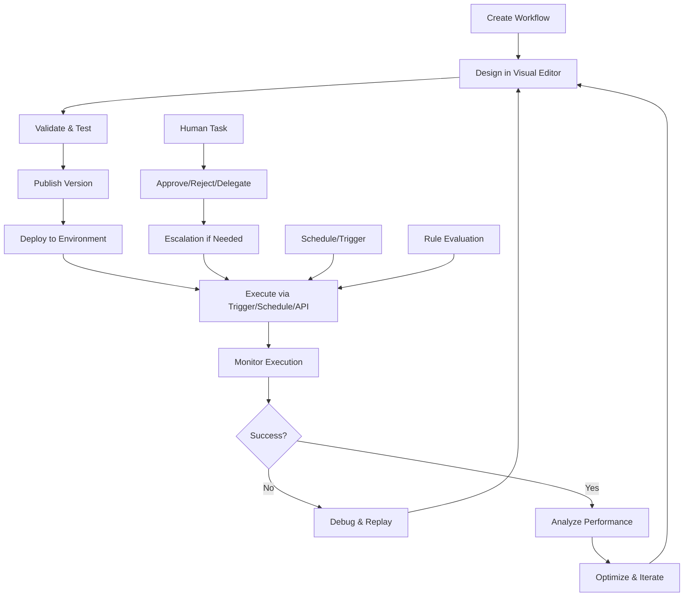
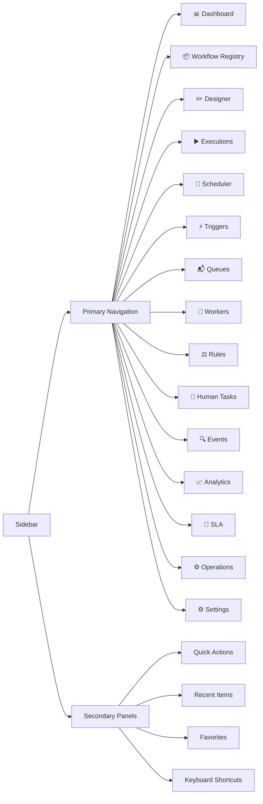

# Hermes Automation Workspace — Enterprise UI/UX Architecture Specification

**Version:** 1.0  
**Status:** Architecture Design  
**Workspace:** Automation  
**Project:** Hermes  
**Date:** 2025

---

## 1. Workspace Overview

### 1.1 Purpose

The Automation Workspace is the **enterprise command center** for all workflow orchestration, scheduling, monitoring, and debugging within Hermes. It provides a unified interface for operators, developers, and platform engineers to manage the complete lifecycle of automation workflows.

### 1.2 Responsibilities

| Area | Scope |
|------|-------|
| **Workflow Authoring** | Visual designer, versioning, templates, validation |
| **Execution Monitoring** | Live dashboard, replay, debugging, state inspection |
| **Operations** | Scheduling, triggers, queues, workers, rules |
| **Human Workflows** | Approvals, tasks, escalation, delegation |
| **Analytics** | Performance, reliability, cost, SLA dashboards |
| **Platform Operations** | Deployments, rollbacks, maintenance, emergency controls |

### 1.3 Users & Personas

| Persona | Goals | Key Screens |
|---------|-------|-------------|
| **Platform Engineer** | Deploy, operate, scale, troubleshoot | Global Dashboard, Operations Center, Queue Manager, Worker Management |
| **Workflow Developer** | Author, test, debug, version workflows | Workflow Designer, Workflow Detail, Execution Monitor |
| **Automation Operator** | Monitor, approve, respond to incidents | Execution Monitor, Human Tasks, Global Dashboard, Alerts |
| **Business Analyst** | Define rules, schedules, triggers | Rule Engine, Scheduler, Trigger Manager, Variables |
| **Security Engineer** | Audit, compliance, permissions | Audit Log, Settings, Permissions, SLA Dashboard |

### 1.4 Primary Workflows



### 1.5 Design Principles

| Principle | Application |
|-----------|-------------|
| **Operational Clarity** | Real-time state visible at all levels; color semantics for status |
| **Keyboard-First** | Every action accessible via command palette + shortcuts |
| **Information Density** | Dense tables, compact cards, progressive disclosure |
| **Context Preservation** | Split views, drawers, tabs maintain context during deep dives |
| **Real-Time by Default** | WebSocket updates for all live data; no manual refresh |
| **Enterprise Scale** | Virtualized lists, server-side filtering, optimistic updates |
| **Accessibility** | WCAG 2.1 AA, keyboard navigation, screen reader support |
| **Consistency** | Shared design tokens, component library, interaction patterns |

---

## 2. Information Architecture

### 2.1 Navigation Hierarchy

```mermaid
graph TD
    Root[Automation Workspace] --> Dash[Global Dashboard]
    Root --> Registry[Workflow Registry]
    Root --> Designer[Workflow Designer]
    Root --> Exec[Execution Monitor]
    Root --> Sched[Scheduler]
    Root --> Triggers[Trigger Manager]
    Root --> Queues[Queue Manager]
    Root --> Workers[Worker Management]
    Root --> Rules[Rule Engine]
    Root --> Human[Human Tasks]
    Root --> Events[Event Explorer]
    Root --> Vars[Variables & Secrets]
    Root --> Notif[Notifications]
    Root --> Analytics[Analytics]
    Root --> SLA[SLA Dashboard]
    Root --> Ops[Operations Center]
    Root --> Settings[Settings]
    
    Registry --> WFDetail[Workflow Detail]
    WFDetail --> Versions[Versions]
    WFDetail --> Config[Configuration]
    WFDetail --> Deps[Dependencies]
    WFDetail --> Vars[Variables]
    WFDetail --> Secrets[Secrets]
    WFDetail --> Perms[Permissions]
    WFDetail --> History[Execution History]
    WFDetail --> Analytics[Analytics]
    WFDetail --> Audit[Audit Log]
    WFDetail --> Deploys[Deployments]
    WFDetail --> Docs[Documentation]
    
    Exec --> ExecDetail[Execution Detail]
    ExecDetail --> Timeline[Timeline]
    ExecDetail --> Graph[Execution Graph]
    ExecDetail --> Logs[Logs]
    ExecDetail --> Metrics[Metrics]
    ExecDetail --> State[State Inspector]
    ExecDetail --> Replay[Replay Controls]
    
    Sched --> Calendar[Calendar View]
    Sched --> CronEditor[Cron Editor]
    Sched --> BizCal[Business Calendars]
    Sched --> TZ[Timezone Management]
    Sched --> Exceptions[Exceptions]
    Sched --> Maint[Maintenance Windows]
    Sched --> Holidays[Holiday Calendars]
    Sched --> Sim[Simulation]
    
    Triggers --> Webhooks[Webhooks]
    Triggers --> Events[Event Triggers]
    Triggers --> Timers[Timers]
    Triggers --> Manual[Manual Triggers]
    Triggers --> API[API Triggers]
    Triggers --> Files[File Triggers]
    Triggers --> Messages[Message Triggers]
    Triggers --> DB[Database Triggers]
    Triggers --> MCP[MCP Triggers]
    Triggers --> Agent[Agent Triggers]
    Triggers --> Plugin[Plugin Triggers]
    Triggers --> Skill[Skill Triggers]
    Triggers --> Model[Model Triggers]
    Triggers --> Memory[Memory Triggers]
    
    Queues --> QueueList[Queue List]
    Queues --> Partitions[Partitions]
    Queues --> Consumers[Consumers]
    Queues --> DLQ[Dead Letter Queues]
    Queues --> Priority[Priority Queues]
    Queues --> Backpressure[Backpressure]
    Queues --> Scaling[Scaling]
    
    Workers --> Registry[Worker Registry]
    Workers --> Health[Health]
    Workers --> Capabilities[Capabilities]
    Workers --> Runtime[Runtime]
    Workers --> Resources[Resources]
    Workers --> Scaling[Scaling]
    Workers --> Pools[Pools]
    Workers --> Assignments[Assignments]
    Workers --> Logs[Logs]
    
    Rules --> Policies[Policies]
    Rules --> DecisionTables[Decision Tables]
    Rules --> Expressions[Expression Editor]
    Rules --> Simulation[Simulation]
    Rules --> Testing[Testing]
    Rules --> History[Execution History]
    
    Human --> Inbox[Inbox]
    Human --> Assignments[Assignments]
    Human --> Delegation[Delegation]
    Human --> Escalation[Escalation]
    Human --> Approvals[Approvals]
    Human --> Comments[Comments]
    Human --> Attachments[Attachments]
    Human --> History[History]
    Human --> Audit[Audit Trail]
    
    Events --> Stream[Live Stream]
    Events --> Filter[Filtering]
    Events --> Replay[Replay]
    Events --> Correlation[Correlation]
    Events --> Relationships[Relationships]
    Events --> Payload[Payload Inspection]
    Events --> Tracing[Tracing]
    
    Analytics --> WFAnalytics[Workflow Analytics]
    Analytics --> ExecAnalytics[Execution Analytics]
    Analytics --> Perf[Performance]
    Analytics --> Reliability[Reliability]
    Analytics --> Cost[Cost Analysis]
    Analytics --> Trends[Trend Analysis]
    Analytics --> Forecast[Forecasting]
    
    SLA --> SLOs[SLOs]
    SLA --> SLIs[SLIs]
    SLA --> Breaches[Breaches]
    SLA --> Risk[Risk Indicators]
    SLA --> BurnRate[Burn Rate]
    SLA --> Availability[Availability]
    SLA --> ResponseTime[Response Time]
    
    Ops --> Maintenance[Maintenance]
    Ops --> Deployments[Deployments]
    Ops --> Rollback[Rollback]
    Ops --> Replay[Replay]
    Ops --> Repair[Repair]
    Ops --> Diagnostics[Diagnostics]
    Ops --> HealthChecks[Health Checks]
    Ops --> Emergency[Emergency Controls]
    
    Settings --> Workspace[Workspace Settings]
    Settings --> Defaults[Defaults]
    Settings --> Security[Security]
    Settings --> Notifications[Notifications]
    Settings --> Audit[Audit]
    Settings --> Retention[Retention]
    Settings --> Integrations[Integrations]
```



### 2.2 Top Navigation

| Element | Description |
|---------|-------------|
| **Logo + Workspace Switcher** | Hermes logo, dropdown for Chat/Agent/Memory/Models/Skills/Plugins/MCP/Automation |
| **Global Search** | ⌘K command palette: search workflows, executions, workers, queues, docs |
| **Notifications Bell** | Real-time alerts, approval requests, system health |
| **User Avatar** | Profile, preferences, org switcher, sign out |
| **Context Breadcrumbs** | Current path: Automation > Workflow Registry > "Order Processing" > v2.3.1 |

### 2.3 Sidebar Navigation



### 2.4 Global Command Palette (⌘K)

| Category | Commands |
|----------|----------|
| **Workflows** | Create, Open, Clone, Import, Export, Archive, Publish, Rollback |
| **Executions** | Start, Pause, Resume, Cancel, Retry, Replay, Debug, View Logs |
| **Schedules** | Create Cron, Create Calendar, View Calendar, Simulate |
| **Triggers** | Register Webhook, Create Timer, Test Trigger |
| **Human Tasks** | My Inbox, Pending Approvals, Delegated Tasks |
| **Workers** | Register Worker, Scale Pool, View Health |
| **Queues** | Create Queue, View DLQ, Reprocess Messages |
| **Rules** | Create Rule, Create Decision Table, Simulate |
| **Settings** | Workspace Config, Secrets, Variables, Integrations |
| **Navigation** | Go to Dashboard, Registry, Designer, Monitor |
| **Debug** | Capture Trace, Replay Event, Inspect State |

---

## 3. Global Overview Dashboard

### 3.1 Layout (CSS Grid)

```css
.dashboard-grid {
  display: grid;
  grid-template-columns: repeat(12, 1fr);
  grid-template-rows: auto auto auto auto;
  gap: var(--space-4);
  padding: var(--space-4);
}

/* Row 1: Critical Metrics (4 cards) */
.metric-critical { grid-column: span 3; }

/* Row 2: Platform Health + Running Workflows (6 + 6) */
.panel-health { grid-column: span 6; }
.panel-running { grid-column: span 6; }

/* Row 3: Queues + Workers + Schedules + Triggers (3 each) */
.panel-queues { grid-column: span 3; }
.panel-workers { grid-column: span 3; }
.panel-schedules { grid-column: span 3; }
.panel-triggers { grid-column: span 3; }

/* Row 4: Heatmap + Timeline + Approvals + Alerts (4 each) */
.panel-heatmap { grid-column: span 4; }
.panel-timeline { grid-column: span 4; }
.panel-approvals { grid-column: span 2; }
.panel-alerts { grid-column: span 2; }
```

### 3.2 Dashboard Components

| Widget | Type | Data Source | Refresh |
|--------|------|-------------|---------|
| **Platform Health** | Status Card + Mini Graph | `GET /monitor/health` | 10s WS |
| **Running Workflows** | Count + Trend | `GET /analytics/executions?status=running` | 10s WS |
| **Failed Workflows (1h)** | Count + Trend | `GET /analytics/executions?status=failed&window=1h` | 10s WS |
| **Queued Executions** | Count + Avg Wait | `GET /queues/metrics` | 10s WS |
| **Workers Healthy/Total** | Ratio + Utilization | `GET /workers/metrics` | 10s WS |
| **Schedules Active/Total** | Count + Next Run | `GET /schedules?status=active` | 30s WS |
| **Triggers Fired (1h)** | Count + Success Rate | `GET /triggers/metrics` | 30s WS |
| **Human Approvals Pending** | Count + Oldest | `GET /approvals?status=pending` | 10s WS |
| **System Alerts Firing** | Count by Severity | `GET /monitor/alerts?status=firing` | 10s WS |
| **Resource Usage** | CPU/Memory/Network Sparkline | `GET /monitor/metrics?type=resources` | 30s WS |
| **Execution Heatmap** | 24h × Workflow Type Grid | `GET /analytics/heatmap` | 60s WS |
| **Activity Timeline** | Streaming Event Log | `WS /events/stream` | Real-time |
| **SLA Status** | SLO Cards (Green/Yellow/Red) | `GET /monitor/slos` | 60s WS |
| **Recent Deployments** | List (5) | `GET /operations/deployments?limit=5` | 30s WS |
| **Automation Scorecards** | Workflow Health Scores | `GET /analytics/scorecards` | 300s WS |
| **Quick Actions** | Button Group | Local Actions | N/A |

### 3.3 Quick Actions Panel

```typescript
interface QuickAction {
  id: string;
  label: string;
  icon: string;
  action: 'navigate' | 'modal' | 'command';
  target: string;
  shortcut?: string;
  roles: string[];
}

const QUICK_ACTIONS: QuickAction[] = [
  { id: 'new-workflow', label: 'New Workflow', icon: 'plus', action: 'navigate', target: '/designer/new', shortcut: '⌘N', roles: ['developer', 'admin'] },
  { id: 'start-execution', label: 'Start Execution', icon: 'play', action: 'modal', target: 'start-execution-modal', shortcut: '⌘⇧E', roles: ['operator', 'developer', 'admin'] },
  { id: 'create-schedule', label: 'Create Schedule', icon: 'calendar', action: 'navigate', target: '/scheduler/new', shortcut: '⌘⇧S', roles: ['operator', 'admin'] },
  { id: 'register-webhook', label: 'Register Webhook', icon: 'webhook', action: 'modal', target: 'register-webhook-modal', roles: ['developer', 'admin'] },
  { id: 'my-approvals', label: 'My Approvals', icon: 'check-circle', action: 'navigate', target: '/human/inbox', shortcut: '⌘⇧A', roles: ['all'] },
  { id: 'view-dlq', label: 'View Dead Letter Queue', icon: 'alert-triangle', action: 'navigate', target: '/queues/dlq', roles: ['operator', 'admin'] },
  { id: 'emergency-stop', label: 'Emergency Stop All', icon: 'stop-circle', action: 'command', target: 'emergency-stop', roles: ['admin'] },
];
```

---

## 4. Workflow Registry

### 4.1 Views

| View | Description |
|------|-------------|
| **Grid View** | Card-based, visual thumbnails, quick status |
| **Table View** | Dense, sortable, filterable, multi-select |
| **Folder View** | Hierarchical folders (by team, project, domain) |
| **Tag View** | Group by tags/labels with counts |

### 4.2 Table Specification

| Column | Type | Sortable | Filterable | Width | Actions |
|--------|------|----------|------------|-------|---------|
| **Name** | Link | ✓ | ✓ (text) | 250px | Click → Detail |
| **Version** | Badge | ✓ | ✓ (semver) | 100px | Click → Versions |
| **Status** | StatusBadge | ✓ | ✓ (enum) | 100px | - |
| **Category** | Tag | ✓ | ✓ (multi) | 120px | - |
| **Owner** | Avatar + Name | ✓ | ✓ (user) | 150px | Hover → Menu |
| **Last Modified** | RelativeTime | ✓ | ✓ (date) | 120px | - |
| **Executions (24h)** | Number + Trend | ✓ | - | 120px | Hover → Chart |
| **Success Rate (24h)** | Percentage | ✓ | - | 100px | - |
| **Avg Duration** | Duration | ✓ | - | 100px | - |
| **Deployed Envs** | EnvBadges | - | ✓ (env) | 150px | - |
| **Health** | HealthScore | ✓ | ✓ (range) | 80px | - |
| **Actions** | Dropdown | - | - | 100px | Menu |

### 4.3 Toolbar

| Control | Type | Description |
|---------|------|-------------|
| **View Switcher** | Segmented | Grid / Table / Folder / Tag |
| **Search** | Input + Filters | Full-text + advanced filters |
| **Filters Panel** | Drawer | Status, Category, Owner, Env, Health, Date Range |
| **Group By** | Select | None / Category / Owner / Status / Env / Health |
| **Sort** | Select | Name / Version / Modified / Executions / Success Rate / Health |
| **Bulk Actions** | Button (enabled on multi-select) | Archive, Publish, Deploy, Export, Delete, Change Owner |
| **Import/Export** | Buttons | File upload / JSON/YAML download |
| **New Workflow** | Primary Button | → Designer |

### 4.4 Row Actions (Dropdown Menu)

| Action | Icon | Confirmation | Navigation |
|--------|------|--------------|------------|
| Open Detail | `eye` | - | `/registry/{id}` |
| Open Designer | `edit` | - | `/designer/{id}` |
| View Versions | `git-branch` | - | `/registry/{id}/versions` |
| Clone | `copy` | ✓ | → Designer (copy) |
| Publish Version | `publish` | ✓ | Modal |
| Deploy | `rocket` | ✓ | Modal |
| Rollback Version | `rotate-ccw` | ✓✓ | Modal |
| Archive | `archive` | ✓ | - |
| Delete | `trash-2` | ✓✓ | - |
| Export | `download` | - | Download |
| Share | `share-2` | - | Modal |

### 4.5 Card View (Grid)

```typescript
interface WorkflowCardProps {
  workflow: WorkflowSummary;
  onClick: () => void;
  onAction: (action: string) => void;
}

// Card Layout:
// ┌─────────────────────────────────┐
// │ [Status Badge]          [⋮]     │
// │                                 │
// │ Workflow Name                   │
// │ v2.3.1                          │
// │                                 │
// │ 📂 Category  👤 Owner           │
// │                                 │
// │ ████████░░ 85% Success (24h)    │
// │ ▓▓▓▓░░░░░░ Health: 68           │
// │                                 │
// │ [Deployed: prod, staging]       │
// └─────────────────────────────────┘
```

---

## 5. Workflow Designer

### 5.1 Layout (Three-Panel Split)

```css
.designer-layout {
  display: grid;
  grid-template-columns: 280px 1fr 320px;
  grid-template-rows: 56px 1fr 40px;
  height: 100vh;
  gap: 0;
}

/* Top Bar */
.toolbar { grid-column: 1 / -1; grid-row: 1; }

/* Left: Node Palette */
.palette { grid-column: 1; grid-row: 2; overflow: auto; }

/* Center: Canvas */
.canvas-container { grid-column: 2; grid-row: 2; position: relative; }

/* Right: Properties Inspector */
.inspector { grid-column: 3; grid-row: 2; overflow: auto; }

/* Bottom: Status Bar */
.status-bar { grid-column: 1 / -1; grid-row: 3; }
```

### 5.2 Toolbar

| Section | Controls |
|---------|----------|
| **File** | New, Open, Save (⌘S), Save As, Import, Export, Version History |
| **Edit** | Undo (⌘Z), Redo (⌘⇧Z), Cut, Copy, Paste, Delete, Select All, Find |
| **View** | Zoom (⌘+/-), Fit to Screen (⌘0), Mini-map, Grid Snap, Collapse Groups |
| **Validation** | Validate (⌘⇧V), Errors Panel, Auto-validate Toggle |
| **Simulation** | Dry Run, Simulate with Mock Data, Test Inputs |
| **Deploy** | Deploy to Env, Rollback, Publish Version |
| **Share** | Share Link, Embed, Export Image/PDF |
| **Settings** | Canvas Settings, Node Defaults, Keyboard Shortcuts |

### 5.3 Node Palette (Left Panel)

```typescript
interface PaletteCategory {
  id: string;
  label: string;
  icon: string;
  nodes: PaletteNode[];
  searchable: boolean;
}

const PALETTE_CATEGORIES: PaletteCategory[] = [
  {
    id: 'flow',
    label: 'Flow Control',
    icon: 'git-branch',
    nodes: [
      { type: 'start', label: 'Start', icon: 'play-circle', description: 'Workflow entry point' },
      { type: 'end', label: 'End', icon: 'stop-circle', description: 'Workflow exit point' },
      { type: 'condition', label: 'Condition', icon: 'git-branch', description: 'If/else branching' },
      { type: 'switch', label: 'Switch', icon: 'square', description: 'Multi-case routing' },
      { type: 'parallel', label: 'Parallel', icon: 'layout-grid', description: 'Concurrent execution' },
      { type: 'sequential', label: 'Sequential', icon: 'list', description: 'Ordered execution' },
      { type: 'foreach', label: 'For Each', icon: 'repeat', description: 'Iterate collection' },
      { type: 'while', label: 'While', icon: 'refresh-cw', description: 'Conditional loop' },
      { type: 'subworkflow', label: 'Sub-workflow', icon: 'box', description: 'Nested workflow' },
      { type: 'wait', label: 'Wait', icon: 'clock', description: 'Pause for signal' },
      { type: 'delay', label: 'Delay', icon: 'timer', description: 'Time-based pause' },
      { type: 'timer', label: 'Timer', icon: 'alarm-clock', description: 'Scheduled trigger' },
    ]
  },
  {
    id: 'execution',
    label: 'Execution',
    icon: 'cpu',
    nodes: [
      { type: 'task', label: 'Task', icon: 'activity', description: 'Custom code execution' },
      { type: 'script', label: 'Script', icon: 'terminal', description: 'Inline script (JS/Python)' },
      { type: 'http', label: 'HTTP Request', icon: 'globe', description: 'REST API call' },
      { type: 'grpc', label: 'gRPC Call', icon: 'server', description: 'gRPC method invocation' },
      { type: 'mcp', label: 'MCP Tool', icon: 'plug', description: 'MCP server tool' },
      { type: 'agent', label: 'Agent', icon: 'bot', description: 'AI agent invocation' },
      { type: 'skill', label: 'Skill', icon: 'zap', description: 'Execute skill' },
      { type: 'plugin', label: 'Plugin', icon: 'puzzle', description: 'Plugin action' },
      { type: 'model', label: 'Model', icon: 'brain', description: 'ML model inference' },
    ]
  },
  {
    id: 'human',
    label: 'Human in the Loop',
    icon: 'users',
    nodes: [
      { type: 'human', label: 'Human Task', icon: 'user', description: 'Manual task assignment' },
      { type: 'approval', label: 'Approval', icon: 'check-circle', description: 'Policy-based approval' },
    ]
  },
  {
    id: 'data',
    label: 'Data & State',
    icon: 'database',
    nodes: [
      { type: 'variable', label: 'Set Variable', icon: 'key', description: 'Set workflow variable' },
      { type: 'secret', label: 'Get Secret', icon: 'lock', description: 'Resolve secret reference' },
      { type: 'transform', label: 'Transform', icon: 'arrow-right-left', description: 'Data transformation' },
      { type: 'filter', label: 'Filter', icon: 'filter', description: 'Data filtering' },
      { type: 'map', label: 'Map', icon: 'map', description: 'Collection mapping' },
      { type: 'reduce', label: 'Reduce', icon: 'minimize-2', description: 'Collection reduction' },
      { type: 'checkpoint', label: 'Checkpoint', icon: 'save', description: 'Persist state' },
      { type: 'snapshot', label: 'Snapshot', icon: 'camera', description: 'Full state capture' },
    ]
  },
  {
    id: 'ai',
    label: 'AI/ML',
    icon: 'sparkles',
    nodes: [
      { type: 'ai-generate', label: 'Generate', icon: 'type', description: 'LLM text generation' },
      { type: 'ai-classify', label: 'Classify', icon: 'tag', description: 'LLM classification' },
      { type: 'ai-extract', label: 'Extract', icon: 'scissors', description: 'LLM extraction' },
      { type: 'ai-summarize', label: 'Summarize', icon: 'file-text', description: 'LLM summarization' },
      { type: 'ai-decide', label: 'Decide', icon: 'scale', description: 'LLM decision making' },
    ]
  },
  {
    id: 'reliability',
    label: 'Reliability',
    icon: 'shield',
    nodes: [
      { type: 'rollback', label: 'Rollback', icon: 'rotate-ccw', description: 'Trigger compensation' },
      { type: 'compensate', label: 'Compensate', icon: 'refresh-ccw', description: 'Execute compensation' },
      { type: 'fanout', label: 'Fan Out', icon: 'share-2', description: 'Broadcast to multiple' },
      { type: 'fanin', label: 'Fan In', icon: 'git-merge', description: 'Aggregate results' },
      { type: 'merge', label: 'Merge', icon: 'join', description: 'Join parallel branches' },
      { type: 'split', label: 'Split', icon: 'git-branch', description: 'Partition data' },
      { type: 'join', label: 'Join', icon: 'link', description: 'Synchronize branches' },
    ]
  },
];
```

### 5.4 Canvas

| Feature | Implementation |
|---------|----------------|
| **Infinite Canvas** | Pan (space+drag / middle mouse), Zoom (wheel + ⌘ / pinch) |
| **Grid** | 20px grid, snap-to-grid toggle, smart guides |
| **Mini-map** | Bottom-right, draggable viewport, node overview |
| **Selection** | Click (single), ⌘+Click (multi), Drag-select (marquee) |
| **Connection** | Drag from output port → input port, validation on connect |
| **Auto-layout** | Dagre/D3 force-directed, directional (TB/LR), group-aware |
| **Collapsible Groups** | Double-click group header, nested groups supported |
| **Comments** | Sticky notes attached to nodes/groups |
| **Annotations** | Free-form text labels on connections |
| **Keyboard Navigation** | Arrow keys (move), Enter (edit), Delete (remove), Esc (deselect) |

### 5.5 Node Rendering

```typescript
interface NodeRenderProps {
  node: WorkflowNode;
  selected: boolean;
  editing: boolean;
  ports: { inputs: Port[]; outputs: Port[] };
  validationErrors: ValidationError[];
}

// Visual States:
// - Default: Subtle border, type icon, label
// - Hover: Elevated shadow, port highlights
// - Selected: Primary border, resize handles, action toolbar
// - Editing: Inline form, field focus
// - Error: Red border, error icon, tooltip
// - Running: Pulse animation, spinner
// - Success: Green check, duration badge
// - Failed: Red X, error tooltip
// - Compensating: Orange pulse, compensation badge
```

### 5.5 Connection Styles

| Type | Style | Arrow | Label |
|------|-------|-------|-------|
| **Data** | Solid, primary color | Filled triangle | Port name (optional) |
| **Control** | Dashed, secondary color | Open triangle | Condition (if any) |
| **Compensation** | Dotted, warning color | Diamond | Compensation action |
| **Error** | Solid, error color | Cross | Error handling |

### 5.6 Properties Inspector (Right Panel)

```typescript
interface InspectorTabs {
  config: 'Configuration';
  inputs: 'Inputs';
  outputs: 'Outputs';
  conditions: 'Conditions';
  retries: 'Retries & Circuit Breaker';
  compensation: 'Compensation';
  advanced: 'Advanced';
  docs: 'Documentation';
}

interface InspectorConfigProps {
  node: WorkflowNode;
  onChange: (path: string, value: any) => void;
  validation: ValidationResult;
  availableVariables: Variable[];
  availableSecrets: Secret[];
}
```

#### Config Tab (per node type)

| Node Type | Key Fields |
|-----------|------------|
| **Task/Script** | Handler, Runtime, Image, Command, Args, Env, Resources, Timeout |
| **HTTP** | Method, URL, Headers, Body, Timeout, Auth, Retry Policy, Circuit Breaker |
| **gRPC** | Service, Method, Payload, Metadata, Timeout, Retry |
| **MCP** | Server, Capability, Tool/Resource/Prompt, Arguments |
| **Agent** | Agent ID, Input Mapping, Output Mapping, Context |
| **Skill** | Skill ID, Version, Input Mapping, Config |
| **Plugin** | Plugin ID, Action, Input Mapping, Config |
| **Model** | Model ID, Provider, Prompt, Temperature, Max Tokens, Output Schema |
| **Condition** | Expression, True Branch, False Branch |
| **Switch** | Expression, Cases (value → node), Default |
| **Parallel/Sequential** | Max Concurrency, Error Handling |
| **ForEach** | Collection, Iterator, Index Var, Max Parallelism |
| **While** | Condition, Max Iterations, Parallel |
| **Sub-workflow** | Workflow ID, Version, Input/Output Mapping |
| **Human/Approval** | Title, Description, Assignees, Role, Form Schema, Due Date, Escalation |
| **Wait/Delay/Timer** | Duration, Cron, Timezone, Signal Name |
| **Variable/Secret** | Name, Value/Reference, Scope, Encryption |
| **Transform/Filter/Map/Reduce** | Expression/Function, Input/Output Mapping |
| **Checkpoint/Snapshot** | Fields to Capture, Storage, Compression |
| **Rollback/Compensate** | Handler, Input Mapping, Timeout, Retry |
| **FanOut/FanIn/Merge/Split/Join** | Partition Key, Aggregation Strategy |
| **AI Nodes** | Provider, Model, Prompt, System Prompt, Temperature, Max Tokens, Few-Shot, Output Schema |

### 5.7 Validation Panel (Bottom Drawer)

| Severity | Icon | Action |
|----------|------|--------|
| **Error** | ✗ Red | Block deploy/save; click → focus node |
| **Warning** | ⚠ Yellow | Allow deploy; click → focus node |
| **Info** | ℹ Blue | Best practice; click → focus node |
| **Hint** | 💡 Gray | Optimization; click → focus node |

### 5.8 Keyboard Shortcuts (Designer)

| Shortcut | Action |
|----------|--------|
| `⌘N` | New node (opens palette search) |
| `⌘S` | Save |
| `⌘Z` / `⌘⇧Z` | Undo / Redo |
| `⌘C` / `⌘V` | Copy / Paste nodes |
| `⌘D` | Duplicate selected |
| `Delete` / `Backspace` | Delete selected |
| `⌘A` | Select all |
| `⌘⇧A` | Select connected |
| `⌘G` | Group selected |
| `⌘⇧G` | Ungroup |
| `⌘↑/↓/←/→` | Move selected (snap to grid) |
| `⌘+/-` / `⌘0` | Zoom in/out / Fit |
| `Space + Drag` | Pan canvas |
| `⌘⇧V` | Validate |
| `⌘⇧R` | Run simulation |
| `⌘⇧P` | Publish version |
| `⌘⇧D` | Deploy |
| `F2` | Rename node |
| `Enter` | Edit node config |
| `Esc` | Cancel edit / Deselect |
| `⌘/` | Toggle comments |
| `⌘⇧F` | Find in canvas |
| `⌘⇧M` | Toggle mini-map |
| `⌘⇧L` | Toggle layout (auto/manual) |

---

## 6. Workflow Detail

### 6.1 Tab Structure

```typescript
interface WorkflowDetailTabs {
  overview: 'Overview';
  configuration: 'Configuration';
  versions: 'Versions';
  dependencies: 'Dependencies';
  variables: 'Variables';
  secrets: 'Secrets';
  permissions: 'Permissions';
  history: 'Execution History';
  analytics: 'Analytics';
  audit: 'Audit Log';
  deployments: 'Deployments';
  documentation: 'Documentation';
}
```

### 6.2 Overview Tab

```typescript
interface OverviewTabProps {
  workflow: Workflow;
  metrics: WorkflowMetrics;
  currentDeployment: DeploymentStatus[];
}

// Layout:
// ┌─────────────────────────────────────────────────────────────┐
// │ [Status] [Version] [Category] [Owner] [Modified] [⋮]       │
// ├─────────────────────────────────────────────────────────────┤
// │ Description                                                 │
// ├─────────────────────────────────────────────────────────────┤
// │ Key Metrics      │ Deployment State │ Quick Actions        │
// │ ████ 99.2%       │ prod: v2.3.1 ✓   │ [Edit] [Execute]     │
// │ ⏱ 1.2s avg       │ staging: v2.3.0  │ [Clone] [Export]     │
// │ 📊 1,234/24h     │ dev: v2.4.0-rc   │ [Deploy] [Archive]   │
// │ 💰 $0.002 avg    │                  │ [Versions] [Audit]   │
// └──────────────────┴──────────────────┴──────────────────────┘
// │ Tags: [payment] [order] [critical] [v2]                      │
// └─────────────────────────────────────────────────────────────┘
```

### 6.3 Versions Tab

| Column | Type | Description |
|--------|------|-------------|
| **Version** | SemVer Badge | Click → View Definition |
| **Status** | Badge | draft/published/deprecated/archived |
| **Published** | DateTime | Relative + Absolute |
| **Published By** | Avatar | User |
| **Changelog** | Text | Truncated, expandable |
| **Breaking** | Boolean Badge | ⚠ if true |
| **Executions** | Count | Total since publish |
| **Success Rate** | Percentage | Since publish |
| **Actions** | Dropdown | View, Promote, Deprecate, Rollback, Diff |

### 6.4 Configuration Tab

```typescript
interface ConfigurationSections {
  general: 'General';        // Name, Description, Category, Tags, Timeout, Priority
  execution: 'Execution';    // Mode, Concurrency, Retry Policy, Error Handling, Checkpointing
  logging: 'Logging';        // Level, Destination, Format, Sampling, Masking
  notifications: 'Notifications'; // On Start/Complete/Error/Timeout/Human/Approval
  security: 'Security';      // Sandbox, Network, FS, Env Vars, Capabilities
  cost: 'Cost';              // Budget, Limits, Billing Model
  triggers: 'Triggers';      // Attached triggers with enable/disable
  schedules: 'Schedules';    // Attached schedules with enable/disable
}
```

### 6.5 Variables Tab

| Column | Type | Editable |
|--------|------|----------|
| **Name** | Text | ✓ (if not readonly) |
| **Type** | Badge | - |
| **Value** | Input/JSON Editor | ✓ (if not readonly) |
| **Scope** | Badge | - |
| **Encrypted** | Toggle | ✓ |
| **Sensitive** | Toggle | ✓ |
| **Validation** | Chip (expandable) | - |
| **Description** | Tooltip | - |
| **Usage** | Chip (workflow/node count) | - |
| **Actions** | Dropdown | Edit, Delete, View Usage |

### 6.6 Secrets Tab

| Column | Type | Notes |
|--------|------|-------|
| **Name** | Text | - |
| **Type** | Badge | api-key, oauth, cert, password, etc. |
| **Scope** | Badge | - |
| **Rotation** | Chip | Auto/Manual, Interval |
| **Vault** | Badge | Provider + Path |
| **Masking** | Badge | Full/Partial/Hash/None |
| **Last Rotated** | DateTime | - |
| **Expires** | DateTime | Warning if < 30d |
| **Usage** | Chip | Workflow/Node count |
| **Actions** | Dropdown | Rotate, View Usage, Update Rotation |

### 6.7 Permissions Tab

```typescript
interface PermissionMatrix {
  roles: Role[];
  resources: PermissionResource[];
  cells: PermissionCell[][];
}

// Resources: Workflow, Execution, Variables, Secrets, Deployments, Versions, Templates
// Actions: Read, Write, Execute, Deploy, Admin, Delete
// Inheritance: Global → Tenant → Workspace → Workflow → Execution
```

### 6.8 Execution History Tab

| Column | Type | Filterable |
|--------|------|------------|
| **Execution ID** | Link | ✓ |
| **Status** | StatusBadge | ✓ |
| **Trigger** | Badge | ✓ |
| **Started** | DateTime | ✓ (range) |
| **Duration** | Duration | ✓ |
| **Cost** | Currency | ✓ |
| **Nodes** | Count (completed/total) | - |
| **Error** | Truncated Text | ✓ (text) |
| **Actions** | Dropdown | View, Replay, Debug, Cancel, Logs |

### 6.9 Analytics Tab

| Section | Visualization |
|---------|---------------|
| **Execution Volume** | Line chart (24h/7d/30d) |
| **Success Rate** | Gauge + Trend |
| **Avg Duration** | Line + Percentiles (p50/p95/p99) |
| **Node Performance** | Bar chart (by node type) |
| **Failure Analysis** | Sunburst (error categories) |
| **Retry Patterns** | Heatmap (node × attempt) |
| **Cost Trend** | Stacked area (by provider/model) |
| **Resource Utilization** | Sparkline grid |

### 6.10 Audit Log Tab

| Column | Type |
|--------|------|
| **Timestamp** | DateTime |
| **User** | Avatar + Name |
| **Action** | Badge |
| **Resource** | Link |
| **Before** | JSON (expandable) |
| **After** | JSON (expandable) |
| **Outcome** | Badge |
| **Trace ID** | Copyable |

### 6.11 Deployments Tab

| Column | Type |
|--------|------|
| **Environment** | Badge |
| **Version** | SemVer |
| **Status** | StatusBadge |
| **Deployed** | DateTime |
| **Deployed By** | Avatar |
| **Strategy** | Badge (blue-green/canary/rolling) |
| **Health** | HealthScore |
| **Rollback** | Button (if not latest) |

### 6.12 Documentation Tab

```markdown
# Workflow Documentation

## Overview
Auto-generated from workflow description + node descriptions

## Nodes
| Node | Type | Description | Config Summary |
|------|------|-------------|----------------|

## Variables
| Name | Type | Scope | Required | Default | Description |
|------|------|-------|----------|---------|-------------|

## Secrets
| Name | Type | Scope | Rotation | Description |
|------|------|-------|----------|-------------|

## Triggers
| Trigger | Type | Config | Target Workflows |
|---------|------|--------|------------------|

## Schedules
| Schedule | Type | Cron/Config | Next Run |
|----------|------|-------------|----------|

## Dependencies
| Dependency | Type | Version | Required |
|------------|------|---------|----------|

## Version History
| Version | Date | Author | Changes |
|---------|------|--------|---------|
```

---

## 7. Execution Monitor

### 7.1 Layout (Four-Panel Split)

```css
.execution-layout {
  display: grid;
  grid-template-columns: 300px 1fr 350px;
  grid-template-rows: 56px 1fr 200px;
  height: 100vh;
}

/* Top: Toolbar */
.execution-toolbar { grid-column: 1 / -1; grid-row: 1; }

/* Left: Timeline + Controls */
.execution-timeline { grid-column: 1; grid-row: 2; }

/* Center: Execution Graph */
.execution-graph { grid-column: 2; grid-row: 2; }

/* Right: Inspector */
.execution-inspector { grid-column: 3; grid-row: 2; }

/* Bottom: Logs + Metrics */
.execution-logs { grid-column: 1 / -1; grid-row: 3; }
```

### 7.2 Toolbar

| Section | Controls |
|---------|----------|
| **Execution Info** | ID, Workflow, Version, Status Badge, Duration, Cost |
| **Controls** | Pause (⌘⇧P), Resume (⌘⇧R), Cancel (⌘⇧X), Retry (⌘⇧T), Rollback (⌘⇧B) |
| **Debug** | Step Into (F11), Step Over (F10), Step Out (⇧F11), Breakpoints |
| **View** | Timeline/Graph/Split, Zoom, Auto-layout, Show/Hide Completed |
| **Export** | Download Logs, Download Trace, Export State, Share Link |
| **Replay** | Replay from Start, Replay from Checkpoint, Replay from Node |

### 7.3 Timeline (Left Panel)

```typescript
interface TimelineNode {
  id: string;
  name: string;
  type: NodeType;
  status: NodeStatus;
  startTime: Date;
  endTime?: Date;
  duration?: number;
  attempts: number;
  children?: TimelineNode[];  // for sub-workflows, parallel groups
}

// Visual:
// ┌─────────────────────────────────────┐
// │ ▶️ start          00:00:00          │
// │   ├── 📋 validate-input  ✓ 0.2s    │
// │   ├── 🔀 route-order     ✓ 0.1s    │
// │   │   ├── 💳 charge-card  ✓ 1.2s   │
// │   │   └── 📦 reserve-stock ✓ 0.8s  │
// │   ├── ⏳ wait-confirm    ⏳ 2m 34s  │
// │   ├── 👤 approve-order   ⏸ pending │
// │   └── 📧 notify-customer ⏳ waiting │
// └─────────────────────────────────────┘
```

### 7.4 Execution Graph (Center)

```typescript
interface GraphViewOptions {
  layout: 'hierarchical' | 'radial' | 'force' | 'manual';
  showCompleted: boolean;
  showFailed: boolean;
  showSkipped: boolean;
  showCompensated: boolean;
  groupByStage: boolean;
  highlightCriticalPath: boolean;
  animateTransitions: boolean;
}

// Node Visual States:
// ┌─────────────────┐
// │ 📋 validate     │
// │ ✓ 0.23s         │
// │ ████████ 100%   │
// └─────────────────┘
//      │
//      ▼ (data flow)
// ┌─────────────────┐
// │ 💳 charge       │
// │ ⏳ 1.2s         │
// │ ████░░░░ 65%    │
// └─────────────────┘
```

### 7.5 Inspector (Right Panel) - Tabbed

| Tab | Content |
|-----|---------|
| **Node Details** | Config, Input, Output, Error, Metrics, Attempts, Checkpoints |
| **Variables** | Current workflow variables, Scope, Changes |
| **State** | Full execution state JSON, Search, Diff vs Snapshot |
| **Trace** | OpenTelemetry trace, Spans, Waterfall |
| **Cost** | Breakdown by node/provider/model, Tokens, Forecast |
| **Resources** | CPU/Memory/Network per node, Worker assignment |

### 7.6 Logs Panel (Bottom)

```typescript
interface LogEntry {
  timestamp: Date;
  level: 'debug' | 'info' | 'warn' | 'error' | 'critical';
  nodeId?: string;
  message: string;
  context: Record<string, any>;
  traceId: string;
  spanId: string;
}

// Features:
// - Virtualized list (10k+ entries)
// - Level filter (multi-select)
// - Node filter (multi-select)
// - Text search (regex support)
// - Trace correlation (click traceId → filter)
// - Auto-scroll toggle
// - Copy line / Copy all / Export
// - Live tail (WebSocket)
// - Highlight errors/warnings
```

### 7.7 Replay Controls (Modal)

```typescript
interface ReplayOptions {
  from: 'start' | 'checkpoint' | 'node' | 'timestamp';
  checkpointId?: string;
  nodeId?: string;
  timestamp?: Date;
  modifyInput?: Record<string, any>;
  skipHumanTasks?: boolean;
  skipApprovals?: boolean;
  dryRun?: boolean;
  newTraceId?: boolean;
}
```