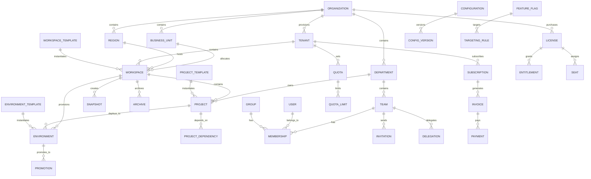

# Hermes Organization & Administration Subsystem — Enterprise Architecture Specification (Part 2)

## 3. Domain Model — Core Entities (continued)

### 3.1 Branded Identifiers

```typescript
type OrganizationId = string & { readonly __brand: unique symbol };
type TenantId = string & { readonly __brand: unique symbol };
type WorkspaceId = string & { readonly __brand: unique symbol };
type ProjectId = string & { readonly __brand: unique symbol };
type EnvironmentId = string & { readonly __brand: unique symbol };
type BusinessUnitId = string & { readonly __brand: unique symbol };
type DepartmentId = string & { readonly __brand: unique symbol };
type RegionId = string & { readonly __brand: unique symbol };
type UserId = string & { readonly __brand: unique symbol };
type TeamId = string & { readonly __brand: unique symbol };
type GroupId = string & { readonly __brand: unique symbol };
type MembershipId = string & { readonly __brand: unique symbol };
type InvitationId = string & { readonly __brand: unique symbol };
type WorkspaceTemplateId = string & { readonly __brand: unique symbol };
type ProjectTemplateId = string & { readonly __brand: unique symbol };
type EnvironmentTemplateId = string & { readonly __brand: unique symbol };
type ConfigurationId = string & { readonly __brand: unique symbol };
type FeatureFlagId = string & { readonly __brand: unique symbol };
type ConfigVersionId = string & { readonly __brand: unique symbol };
type QuotaId = string & { readonly __brand: unique symbol };
type QuotaLimitId = string & { readonly __brand: unique symbol };
type UsageRecordId = string & { readonly __brand: unique symbol };
type SubscriptionId = string & { readonly __brand: unique symbol };
type InvoiceId = string & { readonly __brand: unique symbol };
type PaymentId = string & { readonly __brand: unique symbol };
type BudgetId = string & { readonly __brand: unique symbol };
type CostCenterId = string & { readonly __brand: unique symbol };
type LicenseId = string & { readonly __brand: unique symbol };
type PlanId = string & { readonly __brand: unique symbol };
type EntitlementId = string & { readonly __brand: unique symbol };
type SeatId = string & { readonly __brand: unique symbol };
type AllocationId = string & { readonly __brand: unique symbol };
type TagId = string & { readonly __brand: unique symbol };
type LabelId = string & { readonly __brand: unique symbol };
type CategoryId = string & { readonly __brand: unique symbol };
type ArchiveId = string & { readonly __brand: unique symbol };
type SnapshotId = string & { readonly __brand: unique symbol };
type RetentionPolicyId = string & { readonly __brand: unique symbol };
type PreferenceProfileId = string & { readonly __brand: unique symbol };
type SearchIndexId = string & { readonly __brand: unique symbol };
type ExportJobId = string & { readonly __brand: unique symbol };
```

### 3.2 ER Diagram



### 3.3 Organization & Hierarchy Entities

```typescript
interface Organization {
  id: OrganizationId;
  name: string;
  displayName: string;
  domain: string;
  status: 'active' | 'suspended' | 'pending_verification' | 'archived' | 'deleted';
  type: 'enterprise' | 'partner' | 'trial' | 'sandbox';
  parentOrganizationId?: OrganizationId;
  settings: OrganizationSettings;
  limits: OrganizationLimits;
  billingAccountId?: BillingAccountId;
  defaultTenantId?: TenantId;
  createdAt: Date;
  updatedAt: Date;
  createdBy: UserId;
}

interface OrganizationSettings {
  defaultRegionId: RegionId;
  allowedRegions: RegionId[];
  dataResidency: { mode: 'strict' | 'flexible' | 'none'; requiredRegions: RegionId[]; prohibitedRegions: RegionId[] };
  requireMFA: boolean;
  sessionTimeout: string; // ISO 8601 duration
  ipAllowlist: string[];
  customDomains: string[];
  branding: { logoUrl?: string; primaryColor?: string; secondaryColor?: string };
  notifications: { emailEnabled: boolean; webhookUrl?: string; events: string[] };
}

interface OrganizationLimits {
  maxTenants: number;
  maxWorkspaces: number;
  maxUsers: number;
  maxStorageGB: number;
  maxGPUHours: number;
  maxExecutionsPerMonth: number;
}

interface BusinessUnit {
  id: BusinessUnitId;
  organizationId: OrganizationId;
  parentUnitId?: BusinessUnitId;
  name: string;
  displayName: string;
  code: string;
  costCenterId?: CostCenterId;
  managerId?: UserId;
  budgetId?: BudgetId;
  settings: {
    inheritFromParent: boolean;
    allowedRegions: RegionId[];
    quotaInheritance: 'inherit' | 'override' | 'additive';
    costAllocationMethod: 'proportional' | 'fixed' | 'actual';
  };
  createdAt: Date;
  updatedAt: Date;
}

interface Department {
  id: DepartmentId;
  organizationId: OrganizationId;
  businessUnitId?: BusinessUnitId;
  parentDepartmentId?: DepartmentId;
  name: string;
  displayName: string;
  code: string;
  costCenterId?: CostCenterId;
  managerId?: UserId;
  budgetId?: BudgetId;
  settings: {
    inheritFromParent: boolean;
    defaultWorkspaceTemplateId?: WorkspaceTemplateId;
    defaultProjectTemplateId?: ProjectTemplateId;
    autoProvisionWorkspaces: boolean;
  };
  createdAt: Date;
  updatedAt: Date;
}

interface Region {
  id: RegionId;
  organizationId: OrganizationId;
  name: string;
  code: string;
  cloudProvider: 'aws' | 'azure' | 'gcp' | 'on-prem' | 'multi';
  cloudRegion: string; // e.g. 'us-east-1'
  status: 'active' | 'maintenance' | 'decommissioned';
  dataResidency: boolean;
  latencyTier: 'low' | 'medium' | 'high';
  capacity: { cpuCores: number; memoryGB: number; gpuCount: number; storageTB: number; networkGbps: number };
  createdAt: Date;
  updatedAt: Date;
}
```

### 3.4 Tenant Entity

```typescript
interface Tenant {
  id: TenantId;
  organizationId: OrganizationId;
  name: string;
  displayName: string;
  status: 'provisioning' | 'active' | 'suspended' | 'archiving' | 'archived' | 'deleted' | 'failed';
  type: 'production' | 'staging' | 'development' | 'sandbox' | 'trial';
  regionId: RegionId;
  settings: TenantSettings;
  limits: TenantLimits;
  billing: TenantBillingConfig;
  createdAt: Date;
  updatedAt: Date;
  provisionedAt?: Date;
  archivedAt?: Date;
}

interface TenantSettings {
  defaultWorkspaceId?: WorkspaceId;
  allowedWorkspaceTemplates: WorkspaceTemplateId[];
  allowedProjectTemplates: ProjectTemplateId[];
  featureFlags: Record<string, boolean>;
  integrations: {
    gitProviders: string[];
    ciProviders: string[];
    artifactRegistries: string[];
    monitoringProviders: string[];
  };
  security: {
    mfaRequired: boolean;
    ssoRequired: boolean;
    sessionTimeout: string;
    ipAllowlist: string[];
  };
  dataRetention: {
    defaultRetentionDays: number;
    archiveAfterDays: number;
    purgeAfterDays: number;
    complianceHold: boolean;
  };
}

interface TenantLimits {
  maxWorkspaces: number;
  maxProjects: number;
  maxEnvironments: number;
  maxUsers: number;
  maxTeams: number;
  maxStorageGB: number;
  maxGPUHours: number;
  maxExecutionsPerMonth: number;
  maxTokensPerMonth: number;
  maxModels: number;
  maxAgents: number;
  maxWorkflows: number;
  maxPlugins: number;
  maxMCPServers: number;
}

interface TenantBillingConfig {
  billingAccountId: BillingAccountId;
  paymentMethodId?: PaymentMethodId;
  invoiceEmail?: string;
  purchaseOrderNumber?: string;
  taxId?: string;
  billingAddress: { line1: string; line2?: string; city: string; state: string; postalCode: string; country: string };
  currency: string;
}
```

### 3.5 Workspace Entity

```typescript
interface Workspace {
  id: WorkspaceId;
  tenantId: TenantId;
  organizationId: OrganizationId;
  name: string;
  displayName: string;
  description?: string;
  status: 'provisioning' | 'active' | 'updating' | 'archiving' | 'archived' | 'deleting' | 'deleted' | 'failed';
  type: 'standard' | 'template' | 'system' | 'sandbox';
  templateId?: WorkspaceTemplateId;
  regionId: RegionId;
  businessUnitId?: BusinessUnitId;
  departmentId?: DepartmentId;
  ownerId: UserId;
  settings: WorkspaceSettings;
  resources: WorkspaceResources;
  metadata: WorkspaceMetadata;
  createdAt: Date;
  updatedAt: Date;
  provisionedAt?: Date;
  archivedAt?: Date;
}

interface WorkspaceSettings {
  defaultEnvironmentId?: EnvironmentId;
  allowedEnvironmentTemplates: EnvironmentTemplateId[];
  featureFlags: Record<string, boolean>;
  notifications: {
    channels: string[];
    events: string[];
    webhookUrl?: string;
  };
  automation: {
    autoArchive: { enabled: boolean; idleDays: number; notifyBeforeDays: number };
    autoSnapshot: { enabled: boolean; schedule: string; retentionDays: number };
    cleanupPolicies: Array<{ resourceType: string; condition: string; action: 'archive' | 'delete' | 'notify' }>;
  };
}

interface WorkspaceResources {
  storageUsedGB: number; storageLimitGB: number;
  memoryUsedGB: number; memoryLimitGB: number;
  cpuUsedCores: number; cpuLimitCores: number;
  gpuUsedCount: number; gpuLimitCount: number;
  executionsThisMonth: number; executionsLimit: number;
  tokensUsedThisMonth: number; tokensLimit: number;
  modelsCount: number; modelsLimit: number;
  agentsCount: number; agentsLimit: number;
  workflowsCount: number; workflowsLimit: number;
  pluginsCount: number; pluginsLimit: number;
  mcpServersCount: number; mcpServersLimit: number;
}

interface WorkspaceMetadata {
  tags: Tag[];
  labels: Label[];
  categories: Category[];
  customProperties: Record<string, string>;
  annotations: Record<string, string>;
}
```

### 3.6 Project Entity

```typescript
interface Project {
  id: ProjectId;
  workspaceId: WorkspaceId;
  tenantId: TenantId;
  organizationId: OrganizationId;
  name: string;
  displayName: string;
  description?: string;
  status: 'active' | 'archived' | 'deleting' | 'deleted' | 'on_hold';
  type: 'application' | 'library' | 'infrastructure' | 'ml' | 'data' | 'integration';
  templateId?: ProjectTemplateId;
  parentProjectId?: ProjectId;
  ownerId: UserId;
  teamId?: TeamId;
  settings: ProjectSettings;
  metadata: ProjectMetadata;
  createdAt: Date;
  updatedAt: Date;
  archivedAt?: Date;
}

interface ProjectSettings {
  defaultEnvironmentId?: EnvironmentId;
  allowedEnvironmentTemplates: EnvironmentTemplateId[];
  featureFlags: Record<string, boolean>;
  integrations: {
    gitRepository?: { url: string; branch: string };
    ciPipeline?: { provider: string; pipelineId: string };
  };
  deployment: {
    strategy: 'blue_green' | 'rolling' | 'canary' | 'recreate';
    environments: string[];
    approvals: { requiredApprovals: number; approvers: UserId[] };
    rollback: { enabled: boolean; retentionSteps: number };
  };
}

interface ProjectMetadata {
  tags: Tag[];
  labels: Label[];
  categories: Category[];
  customProperties: Record<string, string>;
  links: Array<{ type: string; url: string; label: string }>;
}

interface ProjectDependency {
  id: string;
  projectId: ProjectId;
  dependsOnProjectId: ProjectId;
  type: 'build' | 'runtime' | 'data' | 'infrastructure' | 'optional';
  versionConstraint?: string;
  createdAt: Date;
}
```

### 3.7 Environment Entity

```typescript
interface Environment {
  id: EnvironmentId;
  workspaceId: WorkspaceId;
  projectId?: ProjectId;
  tenantId: TenantId;
  organizationId: OrganizationId;
  name: string;
  displayName: string;
  type: 'development' | 'testing' | 'staging' | 'production' | 'sandbox' | 'preview' | 'dr' | 'custom';
  status: 'provisioning' | 'active' | 'updating' | 'degraded' | 'destroying' | 'destroyed' | 'failed';
  templateId?: EnvironmentTemplateId;
  regionId: RegionId;
  tier: 'free' | 'standard' | 'premium' | 'enterprise';
  isolationLevel: 'shared' | 'dedicated' | 'isolated' | 'air_gapped';
  settings: EnvironmentSettings;
  resources: EnvironmentResources;
  promotion: PromotionConfig;
  metadata: Record<string, any>;
  createdAt: Date;
  updatedAt: Date;
  lastDeployedAt?: Date;
  destroyedAt?: Date;
}

interface EnvironmentSettings {
  autoScaling: { enabled: boolean; minInstances: number; maxInstances: number; cooldown: string };
  networking: { vpcId?: string; subnets: string[]; securityGroups: string[]; dnsZone?: string };
  security: { encryptionAtRest: boolean; encryptionInTransit: boolean; vulnerabilityScanning: boolean };
  monitoring: { metricsEnabled: boolean; logsEnabled: boolean; traces: boolean; alerting: boolean; dashboards: string[] };
  backup: { enabled: boolean; schedule: string; retention: string; encryption: boolean; crossRegionReplication: boolean };
}

interface EnvironmentResources {
  cpuAllocated: number;
  memoryAllocatedGB: number;
  storageAllocatedGB: number;
  gpuAllocated: number;
  instancesRunning: number;
  podsRunning: number;
}

interface PromotionConfig {
  enabled: boolean;
  sourceEnvironmentId?: EnvironmentId;
  targetEnvironmentId?: EnvironmentId;
  autoPromote: boolean;
  criteria: Array<{ type: string; condition: string }>;
  approvalRequired: boolean;
  rollbackOnFailure: boolean;
}

interface Promotion {
  id: string;
  sourceEnvironmentId: EnvironmentId;
  targetEnvironmentId: EnvironmentId;
  projectId?: ProjectId;
  status: 'pending' | 'running' | 'completed' | 'failed' | 'rolled_back' | 'cancelled';
  trigger: 'manual' | 'auto' | 'scheduled' | 'webhook';
  triggeredBy: UserId;
  startedAt: Date;
  completedAt?: Date;
  steps: Array<{ name: string; action: string; status: string; startedAt?: Date; completedAt?: Date; error?: string }>;
}
```

### 3.8 Team & Membership Entities

```typescript
interface Team {
  id: TeamId;
  organizationId: OrganizationId;
  tenantId?: TenantId;
  workspaceId?: WorkspaceId;
  projectId?: ProjectId;
  name: string;
  displayName: string;
  description?: string;
  type: 'functional' | 'project' | 'cross_functional' | 'community' | 'admin';
  status: 'active' | 'archived' | 'disbanded';
  visibility: 'public' | 'private' | 'hidden';
  parentTeamId?: TeamId;
  managerId?: UserId;
  budgetId?: BudgetId;
  settings: {
    autoApproveJoinRequests: boolean;
    requireManagerApproval: boolean;
    allowExternalMembers: boolean;
    defaultRole: 'member' | 'lead' | 'admin' | 'viewer';
    syncWithExternalGroup?: { provider: string; groupId: string; groupName: string };
  };
  metadata: Record<string, any>;
  createdAt: Date;
  updatedAt: Date;
  createdBy: UserId;
}

interface Group {
  id: GroupId;
  organizationId: OrganizationId;
  tenantId?: TenantId;
  workspaceId?: WorkspaceId;
  name: string;
  displayName: string;
  description?: string;
  type: 'security' | 'distribution' | 'dynamic' | 'nested';
  dynamicQuery?: string;
  parentGroupId?: GroupId;
  createdAt: Date;
  updatedAt: Date;
}

interface Membership {
  id: MembershipId;
  organizationId: OrganizationId;
  tenantId?: TenantId;
  workspaceId?: WorkspaceId;
  projectId?: ProjectId;
  teamId?: TeamId;
  groupId?: GroupId;
  userId: UserId;
  role: 'owner' | 'admin' | 'manager' | 'lead' | 'member' | 'contributor' | 'viewer' | 'guest' | 'auditor';
  status: 'active' | 'pending' | 'suspended' | 'revoked' | 'expired';
  joinedAt: Date;
  invitedBy?: UserId;
  approvedBy?: UserId;
  expiresAt?: Date;
  metadata: Record<string, any>;
}

interface Invitation {
  id: InvitationId;
  organizationId: OrganizationId;
  tenantId?: TenantId;
  workspaceId?: WorkspaceId;
  projectId?: ProjectId;
  teamId?: TeamId;
  groupId?: GroupId;
  email: string;
  role: string;
  invitedBy: UserId;
  status: 'pending' | 'accepted' | 'declined' | 'expired' | 'revoked' | 'cancelled';
  token: string;
  expiresAt: Date;
  acceptedAt?: Date;
  acceptedBy?: UserId;
  createdAt: Date;
  updatedAt: Date;
}

interface Delegation {
  id: string;
  organizationId: OrganizationId;
  tenantId?: TenantId;
  workspaceId?: WorkspaceId;
  projectId?: ProjectId;
  delegatorId: UserId;
  delegateeId: UserId;
  permissions: Array<{ resource: string; actions: string[] }>;
  scope: { type: string; resourceId?: string };
  reason: string;
  status: 'active' | 'revoked' | 'expired';
  expiresAt?: Date;
  createdAt: Date;
}
```

### 3.9 Configuration & Feature Flag Entities

```typescript
interface Configuration {
  id: ConfigurationId;
  scopeType: 'global' | 'organization' | 'tenant' | 'workspace' | 'project' | 'environment';
  scopeId: string;
  key: string;
  value: any;
  type: 'string' | 'number' | 'boolean' | 'object' | 'json' | 'yaml' | 'duration' | 'cron' | 'url';
  version: number;
  status: 'active' | 'deprecated' | 'archived';
  source: 'default' | 'user' | 'system' | 'inherited' | 'policy';
  validation: { valid: boolean; errors: string[]; warnings: string[] };
  metadata: Record<string, any>;
  createdAt: Date;
  updatedAt: Date;
  createdBy: UserId;
}

interface ConfigVersion {
  id: ConfigVersionId;
  configurationId: ConfigurationId;
  version: number;
  value: any;
  changedBy: UserId;
  changeReason?: string;
  previousValue?: any;
  createdAt: Date;
}

interface Override {
  id: string;
  configurationId: ConfigurationId;
  scopeType: string;
  scopeId: string;
  value: any;
  priority: number;
  reason: string;
  createdAt: Date;
  createdBy: UserId;
  expiresAt?: Date;
}

interface FeatureFlag {
  id: FeatureFlagId;
  scopeType: string;
  scopeId: string;
  key: string;
  name: string;
  description?: string;
  type: 'boolean' | 'string' | 'number' | 'json' | 'variant';
  defaultValue: any;
  status: 'active' | 'inactive' | 'archived' | 'killed';
  targeting: TargetingRule[];
  rollout?: RolloutConfig;
  experiment?: ExperimentConfig;
  killSwitch?: KillSwitchConfig;
  createdAt: Date;
  updatedAt: Date;
  createdBy: UserId;
}

interface TargetingRule {
  id: string;
  name: string;
  conditions: Array<{ attribute: string; operator: string; values: any[]; negate: boolean }>;
  value: any;
  rollout?: RolloutConfig;
  priority: number;
  enabled: boolean;
}

interface RolloutConfig {
  percentage: number;
  attributes: string[];
  hashAttribute: string;
  rampUp: { enabled: boolean; start: number; end: number; duration: string; steps: number };
  stuckThreshold: string;
}

interface ExperimentConfig {
  id: string;
  name: string;
  hypothesis: string;
  variants: Array<{ id: string; name: string; value: any; weight: number }>;
  trafficAllocation: number;
  startDate: Date;
  status: 'draft' | 'running' | 'paused' | 'completed' | 'cancelled';
  metrics: Array<{ name: string; direction: 'increase' | 'decrease'; threshold: number }>;
  significanceLevel: number;
  minimumSampleSize: number;
}

interface KillSwitchConfig {
  enabled: boolean;
  reason?: string;
  activatedBy?: UserId;
  activatedAt?: Date;
  autoResolve: boolean;
}
```

### 3.10 Licensing & Billing Entities

```typescript
interface License {
  id: LicenseId;
  organizationId: OrganizationId;
  planId: PlanId;
  name: string;
  status: 'active' | 'trial' | 'expired' | 'cancelled' | 'suspended' | 'pending_renewal' | 'non_compliant';
  type: 'perpetual' | 'subscription' | 'trial' | 'community';
  seats: { total: number; used: number; reserved: number; available: number; autoExpand: boolean };
  entitlements: Entitlement[];
  startDate: Date;
  endDate?: Date;
  renewal: { autoRenew: boolean; renewalDate: Date; noticePeriodDays: number };
  billingAccountId: BillingAccountId;
  createdAt: Date;
  updatedAt: Date;
}

interface Entitlement {
  id: EntitlementId;
  licenseId: LicenseId;
  feature: string;
  resource: string;
  limit: { type: 'unlimited' | 'fixed' | 'per_seat' | 'per_workspace' | 'custom'; value?: number; unit?: string };
  granted: boolean;
}

interface Plan {
  id: PlanId;
  name: string;
  displayName: string;
  description: string;
  tier: 'free' | 'starter' | 'professional' | 'enterprise' | 'custom';
  pricing: {
    model: 'flat' | 'per_seat' | 'usage_based' | 'hybrid';
    currency: string;
    basePrice: number;
    seatPrice?: number;
    usageRates?: Array<{ resource: string; unit: string; pricePerUnit: number }>;
  };
  limits: {
    maxWorkspaces: number; maxProjects: number; maxUsers: number;
    maxStorageGB: number; maxGPUHours: number; maxExecutionsPerMonth: number;
    maxTokensPerMonth: number; maxModels: number; maxAgents: number;
    maxWorkflows: number; maxPlugins: number; maxMCPServers: number;
  };
  features: Array<{ id: string; name: string; description: string; category: string; included: boolean }>;
  status: 'active' | 'deprecated' | 'hidden';
  createdAt: Date;
  updatedAt: Date;
}

interface Subscription {
  id: SubscriptionId;
  organizationId: OrganizationId;
  tenantId?: TenantId;
  licenseId: LicenseId;
  planId: PlanId;
  status: 'trialing' | 'active' | 'past_due' | 'canceled' | 'unpaid' | 'paused';
  billingCycle: 'monthly' | 'quarterly' | 'annually' | 'custom';
  amount: number;
  currency: string;
  currentPeriodStart: Date;
  currentPeriodEnd: Date;
  cancelAtPeriodEnd: boolean;
  trialEnd?: Date;
  metadata: Record<string, any>;
  createdAt: Date;
  updatedAt: Date;
}

interface Invoice {
  id: InvoiceId;
  subscriptionId: SubscriptionId;
  organizationId: OrganizationId;
  number: string;
  status: 'draft' | 'open' | 'paid' | 'void' | 'uncollectible';
  amount: number;
  currency: string;
  lineItems: Array<{ description: string; quantity: number; unitPrice: number; total: number }>;
  dueDate: Date;
  paidAt?: Date;
  invoicePdf: string;
  metadata: Record<string, any>;
  createdAt: Date;
}

interface Payment {
  id: PaymentId;
  organizationId: OrganizationId;
  invoiceId: InvoiceId;
  amount: number;
  currency: string;
  status: 'succeeded' | 'failed' | 'pending' | 'refunded';
  paymentMethodId: PaymentMethodId;
  processorReference: string;
  receiptUrl: string;
  createdAt: Date;
}

interface Budget {
  id: BudgetId;
  organizationId: OrganizationId;
  tenantId?: TenantId;
  businessUnitId?: BusinessUnitId;
  departmentId?: DepartmentId;
  name: string;
  amount: number;
  currency: string;
  period: 'monthly' | 'quarterly' | 'annually';
  startDate: Date;
  endDate: Date;
  alerts: Array<{ threshold: number; channel: string; email?: string }>;
  currentSpend: number;
  forecast: number;
  createdAt: Date;
  updatedAt: Date;
}

interface CostCenter {
  id: CostCenterId;
  organizationId: OrganizationId;
  name: string;
  code: string;
  description?: string;
  type: 'department' | 'project' | 'business_unit' | 'custom';
  managerId?: UserId;
  createdAt: Date;
  updatedAt: Date;
}
```

### 3.11 Quota & Usage Entities

```typescript
interface Quota {
  id: QuotaId;
  scope: { type: 'global' | 'organization' | 'tenant' | 'workspace' | 'project' | 'environment' | 'team' | 'user' };
  scopeId: string;
  resource: string;
  limits: QuotaLimit[];
  policy: { enforcement: 'strict' | 'soft' | 'monitor'; action: 'reject' | 'throttle' | 'queue' | 'notify' };
  status: 'active' | 'inactive' | 'exceeded' | 'warning';
  createdAt: Date;
  updatedAt: Date;
  createdBy: UserId;
}

interface QuotaLimit {
  id: QuotaLimitId;
  quotaId: QuotaId;
  period: 'second' | 'minute' | 'hour' | 'day' | 'week' | 'month' | 'quarter' | 'year' | 'lifetime';
  limit: number;
  softLimit?: number;
  hardLimit: number;
  unit: string;
  resetAt: Date;
}

interface UsageRecord {
  id: UsageRecordId;
  organizationId: OrganizationId;
  tenantId?: TenantId;
  workspaceId?: WorkspaceId;
  projectId?: ProjectId;
  resource: string;
  quantity: number;
  unit: string;
  cost?: number;
  tags: Tag[];
  recordedAt: Date;
}

interface UsageAggregation {
  id: string;
  organizationId: OrganizationId;
  tenantId?: TenantId;
  workspaceId?: WorkspaceId;
  period: string;
  resource: string;
  quantity: number;
  cost: number;
  startDate: Date;
  endDate: Date;
}

interface Allocation {
  id: AllocationId;
  organizationId: OrganizationId;
  usagePeriod: string;
  resource: string;
  quantity: number;
  cost: number;
  allocatedTo: {
    type: string;
    id: string;
    name: string;
  }[];
  createdAt: Date;
}
```

### 3.12 Template, Snapshot & Archive Entities

```typescript
interface WorkspaceTemplate {
  id: WorkspaceTemplateId;
  tenantId: TenantId;
  organizationId: OrganizationId;
  name: string;
  displayName: string;
  description?: string;
  version: string;
  status: 'draft' | 'published' | 'deprecated' | 'archived';
  category: string;
  template: {
    settings: any;
    defaultProjects: any[];
    defaultEnvironments: any[];
    defaultTeams: any[];
    defaultQuotas: any[];
    defaultConfigs: any[];
    defaultFeatureFlags: any[];
  };
  validation: { schema: any; requiredParameters: string[] };
  metadata: { tags: any[]; categories: any[]; iconUrl?: string; documentationUrl?: string };
  createdAt: Date;
  updatedAt: Date;
  createdBy: UserId;
}

interface EnvironmentTemplate {
  id: EnvironmentTemplateId;
  tenantId: TenantId;
  workspaceId?: WorkspaceId;
  organizationId: OrganizationId;
  name: string;
  displayName: string;
  version: string;
  status: 'draft' | 'published' | 'deprecated' | 'archived';
  type: string;
  tier: string;
  template: {
    settings: any;
    resources: { cpu: any; memory: any; storage: any; gpu: any };
    promotion: any;
    defaultConfigs: any[];
  };
  createdAt: Date;
  updatedAt: Date;
  createdBy: UserId;
}

interface ProjectTemplate {
  id: ProjectTemplateId;
  tenantId: TenantId;
  workspaceId?: WorkspaceId;
  organizationId: OrganizationId;
  name: string;
  displayName: string;
  version: string;
  status: 'draft' | 'published' | 'deprecated' | 'archived';
  category: string;
  template: {
    settings: any;
    defaultEnvironments: any[];
    repositoryTemplate?: {
      structure: { directories: any[]; files: any[] };
      defaultBranches: any[];
      branchProtection: any[];
    };
    ciPipelineTemplate?: any;
    defaultConfigs: any[];
  };
  createdAt: Date;
  updatedAt: Date;
  createdBy: UserId;
}

interface WorkspaceSnapshot {
  id: SnapshotId;
  workspaceId: WorkspaceId;
  tenantId: TenantId;
  name: string;
  type: 'manual' | 'scheduled' | 'pre_deployment' | 'pre_archive' | 'compliance';
  status: 'creating' | 'ready' | 'failed' | 'expired' | 'restoring';
  sizeBytes: number;
  checksum: string;
  resources: {
    databases: any[]; storage: any[]; configurations: any[];
    secrets: any[]; certificates: any[];
  };
  createdAt: Date;
  expiresAt?: Date;
}

interface WorkspaceArchive {
  id: ArchiveId;
  workspaceId: WorkspaceId;
  tenantId: TenantId;
  snapshotId: SnapshotId;
  reason: 'inactive' | 'compliance' | 'user_request' | 'project_completed' | 'cost_optimization' | 'migration' | 'decommission';
  status: 'pending' | 'archiving' | 'completed' | 'failed' | 'restoring';
  retentionPolicyId: RetentionPolicyId;
  storageLocation: string;
  sizeBytes: number;
  createdAt: Date;
  completedAt?: Date;
  restoredAt?: Date;
  restoredBy?: UserId;
}

interface RetentionPolicy {
  id: RetentionPolicyId;
  organizationId: OrganizationId;
  tenantId?: TenantId;
  name: string;
  resourceType: string;
  duration: string;
  actions: { when: string; action: string };
  complianceHold: boolean;
  createdAt: Date;
  updatedAt: Date;
}
```

### 3.13 Search, Tag & Metadata Entities

```typescript
interface Tag {
  id: TagId;
  organizationId: OrganizationId;
  tenantId?: TenantId;
  key: string;
  value: string;
  propagated: boolean;
  createdAt: Date;
  createdBy: UserId;
}

interface Label {
  id: LabelId;
  organizationId: OrganizationId;
  name: string;
  color: string;
  description?: string;
  createdAt: Date;
}

interface Category {
  id: CategoryId;
  organizationId: OrganizationId;
  tenantId?: TenantId;
  name: string;
  displayName: string;
  description?: string;
  parentId?: CategoryId;
  createdAt: Date;
}

interface PreferenceProfile {
  id: PreferenceProfileId;
  scopeType: string;
  scopeId: string;
  userId: UserId;
  preferences: Record<string, any>;
  createdAt: Date;
  updatedAt: Date;
}

interface LifecycleEvent {
  id: string;
  resourceType: string;
  resourceId: string;
  event: string;
  data: Record<string, any>;
  triggeredBy: UserId;
  createdAt: Date;
}

interface ExportJob {
  id: ExportJobId;
  organizationId: OrganizationId;
  scopeType: string;
  scopeIds: string[];
  format: 'json' | 'csv' | 'yaml' | 'zip';
  fields: string[];
  filters: Record<string, any>;
  status: 'queued' | 'running' | 'completed' | 'failed';
  resultUrl?: string;
  createdAt: Date;
  completedAt?: Date;
  userId: UserId;
}
```

---

## 4. Organization Domain — Detailed Design

### 4.1 Organization Service API

```typescript
interface IOrganizationService {
  // CRUD
  createOrganization(input: CreateOrganizationInput): Promise<Organization>;
  getOrganization(id: OrganizationId): Promise<Organization | null>;
  updateOrganization(id: OrganizationId, input: UpdateOrganizationInput): Promise<Organization>;
  deleteOrganization(id: OrganizationId): Promise<void>;
  suspendOrganization(id: OrganizationId, reason: string): Promise<Organization>;
  reactivateOrganization(id: OrganizationId): Promise<Organization>;
  
  // Hierarchy
  getOrganizationHierarchy(id: OrganizationId): Promise<OrganizationTree>;
  findAncestors(id: OrganizationId): Promise<Organization[]>;
  findDescendants(id: OrganizationId): Promise<Organization[]>;
  findSubOrganizations(id: OrganizationId, filter: OrgFilter): Promise<Organization[]>;
  
  // Search
  searchOrganizations(query: SearchQuery): Promise<PaginatedResult<Organization>>;
  findByDomain(domain: string): Promise<Organization | null>;
  
  // Settings
  getOrganizationSettings(id: OrganizationId): Promise<OrganizationSettings>;
  updateOrganizationPermissions(id: OrganizationId, settings: OrganizationSettings): Promise<OrganizationSettings>;
  
  // Events
  notifyHierarchyChange(orgId: OrganizationId, change: HierarchyChange): void;
  reconcileSubOrgs(id: OrganizationId): Promise<void>;
}
```

### 4.2 Key Flows

```
1. Create Organization
   Input → Validate domain uniqueness → Create org → Assign default region → 
   Create default tenant → Setup billing account → Fire org.created

2. Organization Hierarchy Update
   Change request → Validate inheritance rules → Update hierarchy → 
   Propagate settings to subs → Recalculate quotas → Update search index

3. Organization Suspension
   Suspend org → Suspend all tenants → Cancel active subscriptions →
   Notify all admins → Archive data → Fire org.suspended
```

### 4.3 Business Unit & Department Management

```typescript
interface IBusinessUnitService {
  createUnit(orgId: OrganizationId, input: CreateUnitInput): Promise<BusinessUnit>;
  getTree(orgId: OrganizationId): Promise<BusinessUnitTree>;
  assignCostCenter(unitId: BusinessUnitId, costCenterId: CostCenterId): Promise<void>;
  assignManager(unitId: BusinessUnitId, userId: UserId): Promise<void>;
  reconcileHierarchy(orgId: OrganizationId): Promise<void>;
}

interface IDepartmentService {
  createDepartment(orgId: OrganizationId, input: CreateDeptInput): Promise<Department>;
  getDepartmentTree(orgId: OrganizationId, unitId?: BusinessUnitId): Promise<DepartmentTree>;
  assignWorkspaceTemplate(deptId: DepartmentId, templateId: WorkspaceTemplateId): Promise<void>;
  reconcileHierarchy(orgId: OrganizationId): Promise<void>;
}
```

---

## 5. Tenant & Workspace Management

### 5.1 Tenant Service

```typescript
interface ITenantService {
  // Lifecycle
  createTenant(orgId: OrganizationId, input: CreateTenantInput): Promise<Tenant>;
  provisionTenant(tenantId: TenantId): Promise<ProvisioningJob>;
  suspendTenant(tenantId: TenantId, reason: string): Promise<Tenant>;
  archiveTenant(tenantId: TenantId): Promise<void>;
  deleteTenant(tenantId: TenantId): Promise<void>;
  reactivateTenant(tenantId: TenantId): Promise<Tenant>;
  
  // Configuration
  getTenantConfig(tenantId: TenantId): Promise<TenantConfig>;
  updateTenantConfig(tenantId: TenantId, input: UpdateTenantConfigInput): Promise<TenantConfig>;
  
  // Quotas
  getTenantQuotas(tenantId: TenantId): Promise<Quota[]>;
  updateTenantQuota(tenantId: TenantId, resource: string, limit: number): Promise<Quota>;
  
  // Cross-Tenant
  createCrossTenantRelation(input: CreateRelationInput): Promise<CrossTenantRelation>;
  approveRelation(relationId: string): Promise<CrossTenantRelation>;
  revokeRelation(relationId: string): Promise<void>;
  
  // Search
  searchTenants(orgId: OrganizationId, query: SearchQuery): Promise<PaginatedResult<Tenant>>;
  getTenantTree(orgId: OrganizationId): Promise<TenantTree>;
}
```

### 5.2 Workspace Service

```typescript
interface IWorkspaceService {
  // Lifecycle
  createWorkspace(tenantId: TenantId, input: CreateWorkspaceInput): Promise<Workspace>;
  provisionWorkspace(workspaceId: WorkspaceId): Promise<ProvisioningJob>;
  updateWorkspace(workspaceId: WorkspaceId, input: UpdateWorkspaceInput): Promise<Workspace>;
  archiveWorkspace(workspaceId: WorkspaceId, reason: ArchiveReason): Promise<WorkspaceArchive>;
  cloneWorkspace(workspaceId: WorkspaceId, input: CloneInput): Promise<Workspace>;
  deleteWorkspace(workspaceId: WorkspaceId): Promise<void>;
  
  // Snapshots
  createSnapshot(workspaceId: WorkspaceId, input: CreateSnapshotInput): Promise<Snapshot>;
  getSnapshot(snapshotId: SnapshotId): Promise<Snapshot>;
  listSnapshots(workspaceId: WorkspaceId): Promise<Snapshot[]>;
  restoreSnapshot(workspaceId: WorkspaceId, snapshotId: SnapshotId): Promise<void>;
  
  // Templates
  createTemplate(tenantId: TenantId, input: CreateWsTemplateInput): Promise<WorkspaceTemplate>;
  getTemplate(templateId: WorkspaceTemplateId): Promise<WorkspaceTemplateRow>;
  listTemplates(tenantId: TenantId): Promise<WorkspaceTemplate[]>;
  applyTemplate(workspaceId: WorkspaceId, templateId: WorkspaceTemplateId): Promise<void>;
  
  // Settings
  getSettings(workspaceId: WorkspaceId): Promise<WorkspaceSettings>;
  updateSettings(workspaceId: WorkspaceId, input: UpdateSettingsInput): Promise<WorkspaceSettings>;
  
  // Resources
  getResourceUsage(workspaceId: WorkspaceId): Promise<WorkspaceResourcesRow>;
  checkQuota(workspaceId: WorkspaceId, resource: string): Promise<QuotaStatus>;
  
  // Search
  searchWorkspaces(tenantId: TenantId, query: SearchQuery): Promise<PaginatedResult