# Hermes Security Subsystem — Enterprise Architecture Specification (Part 1)

**Version:** 1.0  
**Status:** Architecture Design  
**Subsystem:** Security  
**Project:** Hermes  
**Date:** 2025

---

## 1. Executive Overview

### 1.1 Purpose

The Security Subsystem is the **enterprise trust, identity, authorization, governance, compliance, and secrets management platform** for the entire Hermes ecosystem. It provides every security capability consumed by every Hermes subsystem, workspace, service, and API.

### 1.2 Responsibilities

The subsystem owns the complete security lifecycle:

| Domain | Responsibility |
|--------|----------------|
| **Authentication** | Username/password, OAuth2, OIDC, SAML, LDAP, AD, WebAuthn, passkeys, magic links, API keys, service accounts, machine auth |
| **Authorization** | RBAC, ABAC, PBAC, policy evaluation, permission inheritance, hierarchical roles, workspace/org permissions |
| **Policy Engine** | Policy lifecycle, evaluation, rule engine, context-aware auth, decision caching, simulation, testing, versioning |
| **Secrets Management** | Secret lifecycle, rotation, vault integration, dynamic secrets, versioning, encryption, lease management |
| **Certificate Management** | PKI, CAs, SPIFFE identities, mTLS, issuance, renewal, revocation, trust bundles |
| **Key Management** | KMS integration, rotation, envelope encryption, signing, verification, HSM support |
| **Identity Federation** | OIDC, OAuth, SAML, LDAP, SCIM, external IdPs, identity synchronization |
| **Session Management** | Access/refresh tokens, revocation, device management, concurrent sessions, risk scoring |
| **Audit & Compliance** | Immutable audit logs, compliance events, evidence, reporting, retention, integrity verification |
| **Threat Detection** | Threat modeling, security analytics, anomaly detection, risk scoring, alert generation, response automation |
| **API Security** | Gateway integration, rate limiting, API keys, scopes, claims, signing, validation |
| **Multi-tenancy** | Tenant/workspace isolation, cross-tenant policies, resource ownership, inheritance |

### 1.3 Architecture Principles

| Principle | Application |
|-----------|-------------|
| **Zero Trust** | Never trust, always verify; continuous verification for every request |
| **Defense in Depth** | Multiple security layers: network, application, data, identity |
| **Least Privilege** | Minimal permissions by default; explicit grants required |
| **Complete Mediation** | Every access checked; no cached bypass |
| **Open Standards** | OIDC, OAuth2, SAML, SCIM, SPIFFE, JWT, WebAuthn |
| **Vendor Neutral** | Pluggable KMS, HSM, IdP, vault, policy engines |
| **Multi-Tenant Isolation** | Cryptographic isolation; row-level security; data sovereignty |
| **Audit-First** | Every security decision logged with integrity chain |
| **Automation by Default** | Rotation, renewal, revocation, detection automated |
| **Privacy by Design** | Data minimization; PII masking; right to erasure |

### 1.4 Subsystem Boundaries

| In Scope (Owns) | Out of Scope (Delegates) |
|-----------------|-------------------------|
| Identity providers & federation | User profile management (Hermes Core) |
| Authentication protocols | User onboarding flows (Chat/Automation) |
| Authorization decisions | Business logic authorization (domain services) |
| Policy definition & evaluation | Policy authoring UI (Workspaces) |
| Secrets & certificates storage | Secret consumption (subsystems via SDK) |
| Key management & encryption | Data encryption at rest (storage layer) |
| Audit logging & compliance | Business audit events (Observability) |
| Threat detection & response | Incident response execution (Automation) |
| API gateway security | API gateway routing (Observability/API) |
| Session & token management | Session UI (Workspaces) |

### 1.5 Goals

- **Unified Identity Plane** — Single identity for humans, services, machines across Hermes
- **Sub-10ms AuthZ** — P99 authorization decision latency < 10ms
- **Zero-Downtime Rotation** — Secrets/certs/keys rotated without service interruption
- **Compliance Ready** — SOC2, ISO27001, GDPR, HIPAA, FedRAMP evidence generation
- **Automated Threat Response** — < 1min from detection to containment
- **Scalable to 1M+ Identities** — Horizontal scaling for enterprise customers

### 1.6 Non-Goals

- User-facing identity portal (consumes via API)
- SIEM replacement (exports to SIEM)
- Network firewall management (infrastructure layer)
- Vulnerability scanning (CI/CD pipeline)
- Code security scanning (development tools)

### 1.7 Dependencies

| Dependency | Purpose |
|------------|---------|
| **Hermes Core** | Tenant/workspace management, configuration, feature flags |
| **PostgreSQL** | Metadata, identities, policies, audit logs |
| **Redis** | Session store, token cache, rate limiting, decision cache |
| **Kafka/Pulsar** | Security event streaming, audit log streaming |
| **Object Storage (S3/GCS)** | Audit archives, compliance reports, backups |
| **KMS/HSM** | Key management (AWS KMS, HashiCorp Vault, Azure Key Vault, GCP KMS, Thales, AWS CloudHSM) |
| **External IdPs** | OIDC (Google, Microsoft, Okta, Auth0), SAML (ADFS, Okta), LDAP/AD |
| **Observability** | Metrics, logs, traces, alerts for security events |
| **Automation** | Remediation workflows, approval flows for security actions |

---

## 2. Enterprise Architecture

### 2.1 Layered Architecture

```
┌─────────────────────────────────────────────────────────────────────────────────────┐
│                              API LAYER                                               │
│  ┌──────────────┐ ┌──────────────┐ ┌──────────────┐ ┌──────────────┐ ┌──────────┐  │
│  │   AuthN API  │ │   AuthZ API  │ │  Secrets API │ │  Certs API   │ │  Admin   │  │
│  │  (OIDC/OAuth)│ │  (PDP/PEP)   │ │  (Vault)     │ │  (PKI/SPIFFE)│ │  (REST)  │  │
│  └──────┬───────┘ └──────┬───────┘ └──────┬───────┘ └──────┬───────┘ └────┬─────┘  │
└─────────┼────────────────┼────────────────┼────────────────┼──────────────┼────────┘
          │                │                │                │              │
┌─────────▼─────────────────────────────────────────────────────────────────────────┐
│                           DECISION LAYER                                         │
│  ┌─────────────────┐ ┌─────────────────┐ ┌─────────────────┐ ┌────────────────┐  │
│  │  Policy Engine  │ │  AuthZ Engine   │ │  Token Service  │ │  Session Mgmt  │  │
│  │    (OPA/Cedar)  │ │   (RBAC/ABAC)   │ │   (JWT/JWKS)    │ │  (Redis/DB)    │  │
│  └────────┬────────┘ └────────┬────────┘ └────────┬────────┘ └───────┬────────┘  │
└──────────┼────────────────────┼────────────────────┼──────────────────┼───────────┘
           │                    │                    │                  │
┌──────────▼────────────────────────────────────────────────────────────────────────┐
│                          MANAGEMENT LAYER                                        │
│  ┌─────────────┐ ┌─────────────┐ ┌─────────────┐ ┌─────────────┐ ┌───────────┐  │
│  │  Identity   │ │  Secrets    │ │Certificate  │ │    Key      │ │   Audit   │  │
│  │  Service    │ │  Service    │ │  Service    │ │  Service    │ │  Service  │  │
│  └──────┬──────┘ └──────┬──────┘ └──────┬──────┘ └──────┬──────┘ └─────┬──────┘  │
└─────────┼────────────────┼────────────────┼────────────────┼────────────┼─────────┘
          │                │                │                │            │
┌─────────▼─────────────────────────────────────────────────────────────────────────┐
│                         STORAGE LAYER                                            │
│  ┌────────────┐ ┌────────────┐ ┌────────────┐ ┌────────────┐ ┌────────────┐    │
│  │ PostgreSQL │ │   Redis    │ │  Vault/    │ │    KMS/    │ │  Object    │    │
│  │ (Metadata) │ │ (Cache/    │ │  HSM       │ │  HSM       │ │  Storage   │    │
│  │            │ │  Sessions) │ │            │ │            │ │ (Archives) │    │
│  └────────────┘ └────────────┘ └────────────┘ └────────────┘ └────────────┘    │
└──────────────────────────────────────────────────────────────────────────────────┘
          │                │                │                │            │
┌─────────▼─────────────────────────────────────────────────────────────────────────┐
│                       EXTERNAL INTEGRATION LAYER                                 │
│  ┌────────────┐ ┌────────────┐ ┌────────────┐ ┌────────────┐ ┌────────────┐    │
│  │  OIDC/     │ │   SAML     │ │   LDAP/    │ │   SCIM     │ │   SIEM/    │    │
│  │  OAuth2    │ │  Providers │ │    AD      │ │  Provision │ │  Log Drain │    │
│  └────────────┘ └────────────┘ └────────────┘ └────────────┘ └────────────┘    │
└──────────────────────────────────────────────────────────────────────────────────┘
```

### 2.2 Core Services

| Service | Responsibility | Workers | APIs | Events |
|---------|---------------|---------|------|--------|
| **IdentityService** | User/machine identity lifecycle, federation, provisioning | `Provisioner`, `Syncer`, `Deprovisioner` | Identity Admin API | `identity.created`, `identity.updated`, `identity.deleted`, `identity.linked` |
| **AuthenticationService** | All auth protocols, MFA, sessions, risk scoring | `SessionManager`, `RiskScorer`, `MFAManager` | AuthN API (OIDC/OAuth/SAML/LDAP/WebAuthn) | `auth.success`, `auth.failed`, `mfa.challenged`, `session.created`, `session.revoked` |
| **AuthorizationService** | RBAC/ABAC/PBAC evaluation, permission resolution | `PermissionResolver`, `RoleManager`, `PolicyCompiler` | AuthZ API (PDP/PEP) | `authz.allowed`, `authz.denied`, `permission.granted`, `permission.revoked` |
| **PolicyEngine** | Policy lifecycle, compilation, evaluation, simulation | `PolicyCompiler`, `PolicySimulator`, `PolicyTester` | Policy Admin API | `policy.created`, `policy.updated`, `policy.compiled`, `policy.evaluated` |
| **SecretsService** | Secret lifecycle, rotation, dynamic secrets, leases | `RotationWorker`, `LeaseManager`, `DynamicSecretGenerator` | Secrets API (Vault-compatible) | `secret.created`, `secret.updated`, `secret.rotated`, `secret.expired`, `secret.accessed` |
| **CertificateService** | PKI, CA management, SPIFFE, mTLS, trust bundles | `CAManager`, `RenewalWorker`, `RevocationWorker`, `TrustBundleBuilder` | Certs API | `cert.issued`, `cert.renewed`, `cert.revoked`, `cert.expired`, `trust.bundle.updated` |
| **KeyService** | KMS integration, key rotation, envelope encryption, signing | `RotationWorker`, `KeyDerivation`, `SigningWorker` | Keys API | `key.created`, `key.rotated`, `key.archived`, `key.used`, `signing.performed` |
| **TokenService** | JWT issuance, validation, JWKS, token exchange, introspection | `TokenIssuer`, `TokenValidator`, `JWKSManager` | Token API | `token.issued`, `token.validated`, `token.revoked`, `token.exchanged` |
| **SessionService** | Session lifecycle, device tracking, concurrent limits, risk | `SessionCleaner`, `DeviceTracker`, `RiskEvaluator` | Session API | `session.created`, `session.updated`, `session.revoked`, `device.registered`, `device.trusted` |
| **AuditService** | Immutable audit logs, integrity chains, compliance exports | `AuditLogger`, `IntegrityVerifier`, `ComplianceExporter` | Audit API | `audit.logged`, `audit.exported`, `integrity.verified`, `compliance.generated` |
| **ThreatDetectionService** | Anomaly detection, risk scoring, alerting, correlation | `AnomalyDetector`, `RiskScorer`, `CorrelationEngine`, `AlertGenerator` | Threat API | `threat.detected`, `risk.updated`, `alert.generated`, `incident.created` |
| **ComplianceService** | Framework mapping, evidence collection, report generation | `EvidenceCollector`, `ReportGenerator`, `FrameworkMapper` | Compliance API | `compliance.evaluated`, `report.generated`, `evidence.collected` |
| **ApprovalService** | Security approvals, access reviews, delegation, escalation | `ApprovalCoordinator`, `ReviewScheduler`, `EscalationEngine` | Approval API | `approval.requested`, `approval.granted`, `approval.denied`, `review.scheduled`, `delegation.created` |
| **MachineIdentityService** | Service accounts, workload identity, SPIFFE, mTLS | `WorkloadProvisioner`, `SPIFFEManager`, `mTLSConfigurator` | Machine Identity API | `workload.identity.created`, `spiffe.id.issued`, `mtls.configured` |
| **FederationService** | External IdP management, identity linking, JIT provisioning | `IdPManager`, `IdentityLinker`, `JITProvisioner` | Federation API | `idp.configured`, `identity.linked`, `jit.provisioned`, `sync.completed` |
| **RateLimitService** | API rate limiting, quota enforcement, abuse detection | `QuotaEnforcer`, `AbuseDetector`, `LimitAdjuster` | Rate Limit API | `rate.limit.exceeded`, `quota.adjusted`, `abuse.detected` |

### 2.3 Bounded Contexts

| Context | Owner | Key Entities |
|---------|-------|--------------|
| **Identity** | IdentityService | User, Identity, Group, ServiceAccount, MachineIdentity, Link |
| **Authentication** | AuthenticationService | Session, MFADevice, LoginAttempt, AuthenticationMethod, RiskScore |
| **Authorization** | AuthorizationService | Role, Permission, Policy, Binding, Delegation, Review |
| **Policy** | PolicyEngine | Policy, Rule, Evaluation, Simulation, Version, Test |
| **Secrets** | SecretsService | Secret, Vault, Lease, RotationPolicy, DynamicSecret, Version |
| **Certificates** | CertificateService | Certificate, CA, TrustBundle, SPIFFEId, RevocationList, mTLSConfig |
| **Keys** | KeyService | KMSKey, EncryptionKey, SigningKey, KeyVersion, RotationSchedule, HSM |
| **Tokens** | TokenService | AccessToken, RefreshToken, IDToken, JWKS, TokenExchange, Introspection |
| **Sessions** | SessionService | Session, Device, ConcurrentLimit, RiskAssessment, RevocationList |
| **Audit** | AuditService | AuditEvent, IntegrityChain, ComplianceReport, Evidence, Retention |
| **Threats** | ThreatDetectionService | Threat, Anomaly, RiskScore, Alert, Correlation, Incident, Response |
| **Compliance** | ComplianceService | Framework, Control, Evidence, Assessment, Report, Mapping |
| **Approvals** | ApprovalService | ApprovalRequest, AccessReview, Delegation, Escalation, Recertification |
| **Federation** | FederationService | IdentityProvider, SAMLConfig, OIDCConfig, LDAPConfig, SCIMConfig, SyncJob |

### 2.4 Internal Communication

```
┌──────────────────────────────────────────────────────────────────────────────┐
│                        SECURITY EVENT BUS (Kafka/Pulsar)                      │
│  ┌────────────┐ ┌────────────┐ ┌────────────┐ ┌────────────┐ ┌────────────┐ │
│  │   Auth     │ │   AuthZ    │ │   Secret   │ │  Cert/Key  │ │  Threat    │ │
│  │  Events    │ │  Events    │ │  Events    │ │  Events    │ │  Events    │ │
│  └────────────┘ └────────────┘ └────────────┘ └────────────┘ └────────────┘ │
└──────────────────────────────────────────────────────────────────────────────┘
          │                │                │                │                │
┌─────────▼────────────────────────────────────────────────────────────────────┐
│                         GRPC SERVICE MESH (mTLS)                              │
│  ┌────────────┐ ┌────────────┐ ┌────────────┐ ┌────────────┐ ┌────────────┐ │
│  │ Identity   │ │   AuthN    │ │   AuthZ    │ │  Policy    │ │  Secrets   │ │
│  │  Service   │ │  Service   │ │  Service   │ │  Engine    │ │  Service   │ │
│  └────────────┘ └────────────┘ └────────────┘ └────────────┘ └────────────┘ │
└──────────────────────────────────────────────────────────────────────────────┘
```

### 2.5 External Integrations

| Integration | Protocol | Purpose |
|-------------|----------|---------|
| **OIDC Providers** | OIDC/OAuth2 | Google, Microsoft, Okta, Auth0, Keycloak, custom |
| **SAML Providers** | SAML 2.0 | ADFS, Okta, Azure AD, PingFederate, custom |
| **LDAP/AD** | LDAP/StartTLS/LDAPS | Active Directory, OpenLDAP, FreeIPA |
| **SCIM** | SCIM 2.0 | User/group provisioning from IdPs |
| **KMS/HSM** | Vendor APIs | AWS KMS, GCP KMS, Azure Key Vault, HashiCorp Vault, Thales, AWS CloudHSM, Azure Dedicated HSM |
| **Vault** | Vault API | HashiCorp Vault, AWS Secrets Manager, Azure Key Vault (secrets) |
| **SIEM** | Syslog/HTTP/HTTPS | Splunk, Elastic, Sentinel, Datadog, Sumo Logic, CrowdStrike |
| **CT Logs** | CT API | Certificate Transparency monitoring |
| **OCSP/CRL** | HTTP | Certificate revocation checking |

---

## 3. Domain Model

### 3.1 Core Identifiers (Branded Types)

```typescript
// Core
type TenantId = string & { readonly __brand: unique symbol };
type WorkspaceId = string & { readonly __brand: unique symbol };
type UserId = string & { readonly __brand: unique symbol };

// Identity
type IdentityId = string & { readonly __brand: unique symbol };
type GroupId = string & { readonly __brand: unique symbol };
type ServiceAccountId = string & { readonly __brand: unique symbol };
type MachineIdentityId = string & { readonly __brand: unique symbol };
type IdentityLinkId = string & { readonly __brand: unique symbol };

// Authentication
type SessionId = string & { readonly __brand: unique symbol };
type MFADeviceId = string & { readonly __brand: unique symbol };
type LoginAttemptId = string & { readonly __brand: unique symbol };
type RecoveryCodeId = string & { readonly __brand: unique symbol };
type PasskeyId = string & { readonly __brand: unique symbol };

// Authorization
type RoleId = string & { readonly __brand: unique symbol };
type PermissionId = string & { readonly __brand: unique symbol };
type PolicyId = string & { readonly __brand: unique symbol };
type PolicyBindingId = string & { readonly __brand: unique symbol };
type DelegationId = string & { readonly __brand: unique symbol };
type AccessReviewId = string & { readonly __brand: unique symbol };

// Policy
type RuleId = string & { readonly __brand: unique symbol };
type EvaluationId = string & { readonly __brand: unique symbol };
type SimulationId = string & { readonly __brand: unique symbol };

// Secrets
type SecretId = string & { readonly __brand: unique symbol };
type VaultId = string & { readonly __brand: unique symbol };
type LeaseId = string & { readonly __brand: unique symbol };
type RotationPolicyId = string & { readonly __brand: unique symbol };
type DynamicSecretId = string & { readonly __brand: unique symbol };

// Certificates
type CertificateId = string & { readonly __brand: unique symbol };
type CAId = string & { readonly __brand: unique symbol };
type TrustBundleId = string & { readonly __brand: unique symbol };
type SPIFFEId = string & { readonly __brand: unique symbol };
type RevocationListId = string & { readonly __brand: unique symbol };

// Keys
type KMSKeyId = string & { readonly __brand: unique symbol };
type EncryptionKeyId = string & { readonly __brand: unique symbol };
type SigningKeyId = string & { readonly __brand: unique symbol };
type KeyVersionId = string & { readonly __brand: unique symbol };

// Tokens
type AccessTokenId = string & { readonly __brand: unique symbol };
type RefreshTokenId = string & { readonly __brand: unique symbol };
type IDTokenId = string & { readonly __brand: unique symbol };

// Audit
type AuditEventId = string & { readonly __brand: unique symbol };
type IntegrityChainId = string & { readonly __brand: unique symbol };

// Threats
type ThreatId = string & { readonly __brand: unique symbol };
type AnomalyId = string & { readonly __brand: unique symbol };
type RiskScoreId = string & { readonly __brand: unique symbol };
type SecurityAlertId = string & { readonly __brand: unique symbol };
type SecurityIncidentId = string & { readonly __brand: unique symbol };

// Compliance
type FrameworkId = string & { readonly __brand: unique symbol };
type ControlId = string & { readonly __brand: unique symbol };
type EvidenceId = string & { readonly __brand: unique symbol };
type AssessmentId = string & { readonly __brand: unique symbol };
type ComplianceReportId = string & { readonly __brand: unique symbol };

// Approvals
type ApprovalRequestId = string & { readonly __brand: unique symbol };
type RecertificationId = string & { readonly __brand: unique symbol };

// Federation
type IdentityProviderId = string & { readonly __brand: unique symbol };
type SAMLConfigId = string & { readonly __brand: unique symbol };
type OIDCConfigId = string & { readonly __brand: unique symbol };
type LDAPConfigId = string & { readonly __brand: unique symbol };
type SCIMConfigId = string & { readonly __brand: unique symbol };
type SyncJobId = string & { readonly __brand: unique symbol };

// Rate Limiting
type RateLimitRuleId = string & { readonly __brand: unique symbol };
type QuotaId = string & { readonly __brand: unique symbol };
```

### 3.2 Core Entities

```mermaid
erDiagram
    TENANT ||--o{ WORKSPACE : contains
    TENANT ||--o{ IDENTITY_PROVIDER : configures
    TENANT ||--o{ VAULT : provisions
    TENANT ||--o{ CA : manages
    TENANT ||--o{ KMS_KEY : provisions
    TENANT ||--o{ ROLE : defines
    TENANT ||--o{ POLICY : defines
    TENANT ||--o{ FRAMEWORK : adopts
    
    WORKSPACE ||--o{ USER : contains
    WORKSPACE ||--o{ GROUP : contains
    WORKSPACE ||--o{ SERVICE_ACCOUNT : contains
    WORKSPACE ||--o{ MACHINE_IDENTITY : contains
    WORKSPACE ||--o{ SECRET : stores
    WORKSPACE ||--o{ CERTIFICATE : issues
    WORKSPACE ||--o{ POLICY_BINDING : binds
    WORKSPACE ||--o{ ACCESS_REVIEW : schedules
    WORKSPACE ||--o{ APPROVAL_REQUEST : manages
    
    USER ||--o{ IDENTITY : has
    USER ||--o{ MFA_DEVICE : registers
    USER ||--o{ SESSION : creates
    USER ||--o{ LOGIN_ATTEMPT : makes
    USER ||--o{ RECOVERY_CODE : generates
    USER ||--o{ PASSKEY : registers
    USER ||--o{ API_KEY : creates
    USER ||--o{ DELEGATION : grants
    USER ||--o{ ACCESS_REVIEW : participates
    
    IDENTITY ||--o{ IDENTITY_LINK : links
    IDENTITY ||--o{ GROUP_MEMBERSHIP : belongs
    
    GROUP ||--o{ GROUP_MEMBERSHIP : has
    GROUP ||--o{ ROLE_BINDING : binds
    
    ROLE ||--o{ PERMISSION : grants
    ROLE ||--o{ ROLE_BINDING : binds
    ROLE ||--o{ ROLE_INHERITANCE : inherits
    
    PERMISSION ||--o{ POLICY : referenced
    PERMISSION ||--o{ ROLE : granted
    
    POLICY ||--o{ RULE : contains
    POLICY ||--o{ POLICY_VERSION : versions
    POLICY ||--o{ POLICY_BINDING : binds
    POLICY ||--o{ EVALUATION : evaluates
    POLICY ||--o{ SIMULATION : simulates
    
    SECRET ||--o{ SECRET_VERSION : versions
    SECRET ||--o{ LEASE : leases
    SECRET ||--o{ ROTATION_POLICY : rotates
    SECRET ||--o{ SECRET_ACCESS : audits
    
    VAULT ||--o{ SECRET : stores
    VAULT ||--o{ ROTATION_POLICY : manages
    
    CERTIFICATE ||--o{ CERT_VERSION : versions
    CERTIFICATE ||--o{ REVOCATION : revokes
    CA ||--o{ CERTIFICATE : issues
    CA ||--o{ TRUST_BUNDLE : builds
    CA ||--o{ REVOCATION_LIST : publishes
    SPIFFE_ID ||--o{ CERTIFICATE : binds
    
    KMS_KEY ||--o{ ENCRYPTION_KEY : derives
    KMS_KEY ||--o{ SIGNING_KEY : derives
    KMS_KEY ||--o{ KEY_VERSION : versions
    ENCRYPTION_KEY ||--o{ KEY_VERSION : versions
    SIGNING_KEY ||--o{ KEY_VERSION : versions
    
    SESSION ||--o{ DEVICE : tracks
    SESSION ||--o{ ACCESS_TOKEN : issues
    SESSION ||--o{ REFRESH_TOKEN : issues
    ACCESS_TOKEN ||--o{ TOKEN_CLAIMS : contains
    REFRESH_TOKEN ||--o{ TOKEN_CLAIMS : contains
    
    AUDIT_EVENT ||--o{ INTEGRITY_CHAIN : chains
    
    THREAT ||--o{ ANOMALY : detects
    THREAT ||--o{ SECURITY_ALERT : generates
    SECURITY_INCIDENT ||--o{ THREAT : correlates
    SECURITY_INCIDENT ||--o{ RESPONSE_ACTION : executes
    
    FRAMEWORK ||--o{ CONTROL : defines
    CONTROL ||--o{ EVIDENCE : requires
    CONTROL ||--o{ ASSESSMENT : evaluates
    ASSESSMENT ||--o{ EVIDENCE : collects
    COMPLIANCE_REPORT ||--o{ ASSESSMENT : includes
    
    APPROVAL_REQUEST ||--o{ APPROVAL_STEP : steps
    APPROVAL_REQUEST ||--o{ DELEGATION : delegates
    ACCESS_REVIEW ||--o{ REVIEW_ITEM : items
    RECERTIFICATION ||--o{ APPROVAL_REQUEST : triggers
    
    IDENTITY_PROVIDER ||--o{ SAML_CONFIG : configures
    IDENTITY_PROVIDER ||--o{ OIDC_CONFIG : configures
    IDENTITY_PROVIDER ||--o{ LDAP_CONFIG : configures
    IDENTITY_PROVIDER ||--o{ SCIM_CONFIG : configures
    IDENTITY_PROVIDER ||--o{ SYNC_JOB : runs
    
    RATE_LIMIT_RULE ||--o{ QUOTA : enforces
```



### 3.3 Key Entity Definitions

#### 3.3.1 Identity Domain

```typescript
interface User {
  id: UserId;
  tenantId: TenantId;
  workspaceId: WorkspaceId;
  email: string;
  displayName: string;
  username?: string;
  status: UserStatus;
  emailVerified: boolean;
  phoneVerified: boolean;
  createdAt: Date;
  updatedAt: Date;
  lastLoginAt?: Date;
  metadata: Record<string, any>;
}

type UserStatus = 'active' | 'inactive' | 'suspended' | 'pending_verification' | 'locked';

interface Identity {
  id: IdentityId;
  userId: UserId;
  tenantId: TenantId;
  workspaceId: WorkspaceId;
  provider: IdentityProviderType;
  providerId: string;
  providerData: Record<string, any>;
  primary: boolean;
  verified: boolean;
  createdAt: Date;
  updatedAt: Date;
}

type IdentityProviderType = 
  | 'local' 
  | 'oidc' 
  | 'saml' 
  | 'ldap' 
  | 'github' 
  | 'gitlab' 
  | 'google' 
  | 'microsoft' 
  | 'okta' 
  | 'auth0' 
  | 'custom';

interface Group {
  id: GroupId;
  tenantId: TenantId;
  workspaceId: WorkspaceId;
  name: string;
  description?: string;
  type: 'security' | 'distribution' | 'dynamic';
  dynamicQuery?: string;
  parentGroupId?: GroupId;
  createdAt: Date;
  updatedAt: Date;
  createdBy: UserId;
}

interface GroupMembership {
  id: string;
  groupId: GroupId;
  memberType: 'user' | 'group' | 'service_account' | 'machine_identity';
  memberId: string;
  addedAt: Date;
  addedBy: UserId;
  expiresAt?: Date;
}

interface ServiceAccount {
  id: ServiceAccountId;
  tenantId: TenantId;
  workspaceId: WorkspaceId;
  name: string;
  description?: string;
  owner: UserId;
  status: 'active' | 'inactive' | 'revoked';
  permissions: PermissionId[];
  allowedIPs?: string[];
  expiresAt?: Date;
  createdAt: Date;
  updatedAt: Date;
  lastUsedAt?: Date;
}

interface MachineIdentity {
  id: MachineIdentityId;
  tenantId: TenantId;
  workspaceId: WorkspaceId;
  name: string;
  description?: string;
  type: 'workload' | 'device' | 'agent' | 'plugin' | 'mcp_server' | 'custom';
  workloadSelector?: WorkloadSelector;
  spiffeId?: SPIFFEId;
  status: 'active' | 'inactive' | 'revoked';
  certificates: CertificateId[];
  createdAt: Date;
  updatedAt: Date;
  lastAttestationAt?: Date;
}

interface WorkloadSelector {
  namespace?: string;
  service?: string;
  pod?: string;
  labels?: Record<string, string>;
}

interface IdentityLink {
  id: IdentityLinkId;
  userId: UserId;
  provider: IdentityProviderType;
  providerId: string;
  providerEmail: string;
  providerData: Record<string, any>;
  linkedAt: Date;
  linkedBy: UserId;
  verified: boolean;
}
```

#### 3.3.2 Authentication Domain

```typescript
interface Session {
  id: SessionId;
  userId: UserId;
  tenantId: TenantId;
  workspaceId: WorkspaceId;
  status: SessionStatus;
  createdAt: Date;
  updatedAt: Date;
  expiresAt: Date;
  lastActivityAt: Date;
  ipAddress: string;
  userAgent: string;
  device: DeviceInfo;
  mfaVerified: boolean;
  mfaMethod?: MFAMethod;
  riskScore: number;
  revokedAt?: Date;
  revokedBy?: UserId;
  revocationReason?: string;
}

type SessionStatus = 'active' | 'idle' | 'expired' | 'revoked' | 'terminated';

interface DeviceInfo {
  id: string;
  name: string;
  type: 'desktop' | 'mobile' | 'tablet' | 'cli' | 'api' | 'unknown';
  os: string;
  browser?: string;
  trusted: boolean;
  registeredAt: Date;
  lastSeenAt: Date;
}

interface MFADevice {
  id: MFADeviceId;
  userId: UserId;
  tenantId: TenantId;
  type: MFAMethod;
  name: string;
  status: 'active' | 'inactive' | 'revoked' | 'lost';
  config: MFAConfig;
  backupCodes: RecoveryCode[];
  createdAt: Date;
  updatedAt: Date;
  lastUsedAt?: Date;
}

type MFAMethod = 'totp' | 'webauthn' | 'push' | 'sms' | 'email' | 'backup_code' | 'duo' | 'yubikey';

interface MFAConfig {
  // TOTP
  secret?: string;
  algorithm?: 'SHA1' | 'SHA256' | 'SHA512';
  digits?: 6 | 8;
  period?: 30;
  
  // WebAuthn
  credentialId?: string;
  publicKey?: string;
  aaguid?: string;
  counter?: number;
  
  // Push
  pushToken?: string;
  deviceId?: string;
  
  // SMS/Email
  phoneNumber?: string;
  email?: string;
  
  // Backup codes
  codes?: string[];
}

interface RecoveryCode {
  id: RecoveryCodeId;
  userId: UserId;
  code: string;
  used: boolean;
  usedAt?: Date;
  createdAt: Date;
}

interface Passkey {
  id: PasskeyId;
  userId: UserId;
  credentialId: string;
  publicKey: string;
  aaguid: string;
  counter: number;
  name: string;
  createdAt: Date;
  lastUsedAt?: Date;
}

interface LoginAttempt {
  id: LoginAttemptId;
  tenantId: TenantId;
  workspaceId?: WorkspaceId;
  identifier: string;
  method: AuthenticationMethod;
  ipAddress: string;
  userAgent: string;
  success: boolean;
  failureReason?: FailureReason;
  mfaChallenged: boolean;
  mfaMethod?: MFAMethod;
  mfaSuccess?: boolean;
  riskScore: number;
  blocked: boolean;
  createdAt: Date;
}

type AuthenticationMethod = 
  | 'password' 
  | 'api_key' 
  | 'oidc' 
  | 'saml' 
  | 'ldap' 
  | 'webauthn' 
  | 'magic_link' 
  | 'service_account' 
  | 'machine_identity' 
  | 'jwt' 
  | 'mfa_totp' 
  | 'mfa_push' 
  | 'mfa_sms' 
  | 'mfa_email' 
  | 'mfa_backup_code' 
  | 'recovery_code';

type FailureReason = 
  | 'invalid_credentials' 
  | 'account_locked' 
  | 'account_suspended' 
  | 'account_not_found' 
  | 'mfa_required' 
  | 'mfa_failed' 
  | 'mfa_expired' 
  | 'ip_blocked' 
  | 'rate_limited' 
  | 'risk_blocked' 
  | 'session_expired' 
  | 'device_untrusted' 
  | 'policy_denied';

interface AuthenticationContext {
  userId?: UserId;
  tenantId: TenantId;
  workspaceId?: WorkspaceId;
  ipAddress: string;
  userAgent: string;
  deviceFingerprint?: string;
  geoLocation?: GeoLocation;
  riskIndicators: RiskIndicator[];
  requestedScopes?: string[];
  requestedClaims?: string[];
}

interface GeoLocation {
  country: string;
  region?: string;
  city?: string;
  latitude?: number;
  longitude?: number;
  isp?: string;
  isVpn: boolean;
  isProxy: boolean;
  isTor: boolean;
}

interface RiskIndicator {
  type: 'new_device' | 'new_location' | 'impossible_travel' | 'velocity' | 'bot_detection' | 'credential_stuffing' | 'account_takeover' | 'anomalous_behavior';
  severity: 'low' | 'medium' | 'high' | 'critical';
  description: string;
  score: number;
  metadata: Record<string, any>;
}
```

#### 3.3.3 Authorization Domain

```typescript
interface Role {
  id: RoleId;
  tenantId: TenantId;
  workspaceId?: WorkspaceId;
  name: string;
  description?: string;
  type: 'system' | 'custom' | 'workspace' | 'resource';
  permissions: PermissionId[];
  inherits: RoleId[];
  conditions?: PolicyCondition[];
  metadata: Record<string, any>;
  createdAt: Date;
  updatedAt: Date;
  createdBy: UserId;
}

interface Permission {
  id: PermissionId;
  tenantId: TenantId;
  workspaceId?: WorkspaceId;
  resource: string;
  actions: string[];
  conditions?: PolicyCondition[];
  description?: string;
  createdAt: Date;
  updatedAt: Date;
}

interface PolicyCondition {
  field: string;
  operator: FilterOperator;
  value: any;
  description?: string;
}

type FilterOperator = 
  | 'eq' | 'ne' | 'in' | 'nin' 
  | 'gt' | 'gte' | 'lt' | 'lte' 
  | 'contains' | 'starts_with' | 'ends_with' | 'regex' 
  | 'exists' | 'not_exists' 
  | 'cidr_contains' | 'cidr_not_contains';

interface PolicyBinding {
  id: PolicyBindingId;
  tenantId: TenantId;
  workspaceId?: WorkspaceId;
  policyId: PolicyId;
  subjects: Subject[];
  scope: BindingScope;
  priority: number;
  conditions?: PolicyCondition[];
  createdAt: Date;
  updatedAt: Date;
  createdBy: UserId;
}

interface Subject {
  type: 'user' | 'group' | 'service_account' | 'machine_identity' | 'role' | 'everyone' | 'authenticated';
  id: string;
  tenantId?: TenantId;
  workspaceId?: WorkspaceId;
}

interface BindingScope {
  type: 'global' | 'tenant' | 'workspace' | 'resource' | 'resource_type';
  tenantId?: TenantId;
  workspaceId?: WorkspaceId;
  resourceType?: string;
  resourceId?: string;
  resourcePath?: string;
}

interface RoleBinding {
  id: string;
  roleId: RoleId;
  subjects: Subject[];
  scope: BindingScope;
  conditions?: PolicyCondition[];
  createdAt: Date;
  createdBy: UserId;
}

interface RoleInheritance {
  parentRoleId: RoleId;
  childRoleId: RoleId;
  createdAt: Date;
  createdBy: UserId;
}

interface Delegation {
  id: DelegationId;
  tenantId: TenantId;
  workspaceId: WorkspaceId;
  delegator: UserId;
  delegatee: UserId;
  permissions: PermissionId[];
  scope: BindingScope;
  reason: string;
  status: 'active' | 'revoked' | 'expired';
  approvedBy?: UserId;
  approvedAt?: Date;
  expiresAt?: Date;
  createdAt: Date;
  revokedAt?: Date;
  revokedBy?: UserId;
}

interface AccessReview {
  id: AccessReviewId;
  tenantId: TenantId;
  workspaceId: WorkspaceId;
  name: string;
  description?: string;
  scope: ReviewScope;
  reviewers: UserId[];
  status: 'scheduled' | 'in_progress' | 'completed' | 'cancelled';
  schedule: ReviewSchedule;
  startedAt?: Date;
  completedAt?: Date;
  createdAt: Date;
  updatedAt: Date;
  createdBy: UserId;
}

interface ReviewScope {
  type: 'role' | 'group' | 'user' | 'permission' | 'resource';
  targets: string[];
  includeInherited: boolean;
  includeDelegated: boolean;
}

interface ReviewSchedule {
  frequency: 'one_time' | 'monthly' | 'quarterly' | 'annually';
  startDate: Date;
  endDate?: Date;
  timezone: string;
  reminderDays: number[];
}

interface ReviewItem {
  id: string;
  reviewId: AccessReviewId;
  subject: Subject;
  permission: PermissionId;
  resource?: string;
  scope: BindingScope;
  decision: 'approve' | 'revoke' | 'defer' | 'pending';
  decidedBy?: UserId;
  decidedAt?: Date;
  justification?: string;
  evidence?: string[];
}
```

#### 3.3.4 Policy Engine Domain

```typescript
interface Policy {
  id: PolicyId;
  tenantId: TenantId;
  workspaceId?: WorkspaceId;
  name: string;
  description?: string;
  type: 'authorization' | 'admission' | 'validation' | 'mutation' | 'audit';
  version: string;
  status: 'draft' | 'active' | 'deprecated' | 'archived';
  rules: Rule[];
  metadata: Record<string, any>;
  createdAt: Date;
  updatedAt: Date;
  createdBy: UserId;
  approvedBy?: UserId;
  approvedAt?: Date;
}

interface Rule {
  id: RuleId;
  policyId: PolicyId;
  name: string;
  description?: string;
  effect: 'allow' | 'deny';
  condition: LogicalExpression;
  priority: number;
  obligations: Obligation[];
  advice: Advice[];
  metadata: Record<string, any>;
}

interface LogicalExpression {
  type: 'and' | 'or' | 'not' | 'comparison' | 'function' | 'variable' | 'literal';
  operator?: ComparisonOperator | LogicalOperator | FunctionName;
  left?: LogicalExpression;
  right?: LogicalExpression;
  operand?: LogicalExpression;
  arguments?: LogicalExpression[];
  variable?: string;
  value?: any;
}

type ComparisonOperator = 'eq' | 'ne' | 'in' | 'nin' | 'gt' | 'gte' | 'lt' | 'lte' | 'contains' | 'starts_with' | 'ends_with' | 'regex' | 'exists' | 'cidr_match';
type LogicalOperator = 'and' | 'or' | 'not';
type FunctionName = 'time_between' | 'day_of_week' | 'geo_distance' | 'string_match' | 'version_compare' | 'custom';

interface Obligation {
  action: string;
  params: Record<string, any>;
  fulfillment: 'immediate' | 'deferred' | 'on_permit' | 'on_deny';
}

interface Advice {
  message: string;
  data: Record<string, any>;
}

interface PolicyVersion {
  id: string;
  policyId: PolicyId;
  version: string;
  rules: Rule[];
  changelog: string;
  breakingChanges: boolean;
  createdAt: Date;
  createdBy: UserId;
  approvedBy?: UserId;
  approvedAt?: Date;
}

interface PolicyEvaluation {
  id: EvaluationId;
  policyId: PolicyId;
  request: EvaluationRequest;
  decision: 'allow' | 'deny' | 'indeterminate' | 'not_applicable';
  matchedRules: RuleMatch[];
  obligations: ObligationResult[];
  advice: Advice[];
  durationMs: number;
  evaluatedAt: Date;
  cacheHit: boolean;
}

interface EvaluationRequest {
  subject: Subject;
  resource: Resource;
  action: string;
  context: Record<string, any>;
  tenantId: TenantId;
  workspaceId?: WorkspaceId;
}

interface Resource {
  type: string;
  id?: string;
  attributes: Record<string, any>;
  tenantId?: TenantId;
  workspaceId?: WorkspaceId;
}

interface RuleMatch {
  ruleId: RuleId;
  ruleName: string;
  matched: boolean;
  conditionResult: boolean;
}

interface ObligationResult {
  obligation: Obligation;
  fulfilled: boolean;
  result?: any;
  error?: string;
}

interface PolicySimulation {
  id: SimulationId;
  policyId: PolicyId;
  requests: EvaluationRequest[];
  results: SimulationResult[];
  summary: SimulationSummary;
  createdAt: Date;
  createdBy: UserId;
}

interface SimulationResult {
  request: EvaluationRequest;
  decision: 'allow' | 'deny' | 'indeterminate' | 'not_applicable';
  matchedRules: RuleMatch[];
}

interface SimulationSummary {
  totalRequests: number;
  allowed: number;
  denied: number;
  indeterminate: number;
  notApplicable: number;
  rulesHit: Record<string, number>;
}

interface PolicyTest {
  id: string;
  policyId: PolicyId;
  name: string;
  description?: string;
  testCases: TestCase[];
  createdAt: Date;
  updatedAt: Date;
  createdBy: UserId;
}

interface TestCase {
  name: string;
  request: EvaluationRequest;
  expectedDecision: 'allow' | 'deny' | 'indeterminate' | 'not_applicable';
  expectedMatchedRules?: string[];
  expectedObligations?: string[];
}

interface PolicyCompiler {
  compile(policy: Policy): Promise<CompiledPolicy>;
  validate(policy: Policy): Promise<ValidationResult>;
  optimize(policy: Policy): Promise<OptimizedPolicy>;
}

interface CompiledPolicy {
  policyId: PolicyId;
  version: string;
  decisionTree: DecisionNode;
  ruleIndex: Map<string, RuleIndexEntry>;
  metadata: CompilationMetadata;
}

interface DecisionNode {
  type: 'decision' | 'condition' | 'rule' | 'obligation';
  condition?: LogicalExpression;
  ruleId?: RuleId;
  trueBranch?: DecisionNode;
  falseBranch?: DecisionNode;
  obligations?: Obligation[];
  advice?: Advice[];
}

interface RuleIndexEntry {
  ruleId: RuleId;
  priority: number;
  attributes: string[];
  resources: string[];
  actions: string[];
}
```

#### 3.3.5 Secrets Management Domain

```typescript
interface Secret {
  id: SecretId;
  tenantId: TenantId;
  workspaceId: WorkspaceId;
  vaultId: VaultId;
  name: string;
  description?: string;
  type: SecretType;
  status: 'active' | 'disabled' | 'pending_rotation' | 'revoked' | 'expired';
  currentVersion: number;
  versions: SecretVersion[];
  rotationPolicy?: RotationPolicyId;
  leasePolicy?: LeasePolicyId;
  tags: Record<string, string>;
  metadata: Record<string, any>;
  createdAt: Date;
  updatedAt: Date;
  createdBy: UserId;
}

type SecretType = 
  | 'static' 
  | 'dynamic' 
  | 'database' 
  | 'ssh' 
  | 'tls' 
  | 'api_key' 
  | 'oauth_token' 
  | 'jwt_signing' 
  | 'encryption' 
  | 'custom';

interface SecretVersion {
  version: number;
  value: string;
  metadata: Record<string, any>;
  createdAt: Date;
  createdBy: UserId;
  expiresAt?: Date;
  destroyedAt?: Date;
  destroyedBy?: UserId;
}

interface Vault {
  id: VaultId;
  tenantId: TenantId;
  workspaceId?: WorkspaceId;
  name: string;
  description?: string;
  type: VaultType;
  provider: VaultProvider;
  config: VaultConfig;
  status: 'healthy' | 'degraded' | 'unhealthy' | 'sealed' | 'uninitialized';
  mountPath: string;
  secretsCount: number;
  lastSyncAt?: Date;
  createdAt: Date;
  updatedAt: Date;
}

type VaultType = 'kv' | 'database' | 'ssh' | 'pki' | 'cubbyhole' | 'transit' | 'identity' | 'custom';
type VaultProvider = 'hashicorp' | 'aws' | 'azure' | 'gcp' | 'kubernetes' | 'custom';

interface VaultConfig {
  endpoint: string;
  authentication: VaultAuth;
  tls: TLSConfig;
  namespace?: string;
  mountPath: string;
  maxVersions: number;
  defaultTTL: string;
  maxTTL: string;
}

interface VaultAuth {
  type: 'token' | 'approle' | 'kubernetes' | 'aws' | 'azure' | 'gcp' | 'oidc' | 'ldap' | 'custom';
  config: Record<string, any>;
}

interface RotationPolicy {
  id: RotationPolicyId;
  tenantId: TenantId;
  workspaceId: WorkspaceId;
  name: string;
  description?: string;
  type: 'time_based' | 'event_based' | 'manual' | 'on_access';
  schedule?: CronExpression;
  triggerEvents?: RotationTrigger[];
  gracePeriod: string;
  maxVersions: number;
  notifyBefore: string[];
  notificationChannels: NotificationChannel[];
  autoRotate: boolean;
  rotationFunction?: RotationFunction;
  createdAt: Date;
  updatedAt: Date;
  createdBy: UserId;
}

type RotationTrigger = 'time' | 'access' | 'lease_expiry' | 'version_limit' | 'manual' | 'compromise_detected';

interface RotationFunction {
  type: 'built_in' | 'lambda' | 'webhook' | 'script';
  config: Record<string, any>;
  timeout: number;
  retryPolicy: RetryPolicy;
}

interface LeasePolicy {
  id: LeasePolicyId;
  tenantId: TenantId;
  workspaceId: WorkspaceId;
  name: string;
  defaultTTL: string;
  maxTTL: string;
  renewable: boolean;
  renewBeforeExpiry: string;
  revokeOnRenewalFailure: boolean;
  createdAt: Date;
  updatedAt: Date.
}

interface Lease {
  id: LeaseId;
  secretId: SecretId;
  secretVersion: number;
  clientId: string;
  clientType: 'user' | 'service_account' | 'machine_identity' | 'application';
  issuedAt: Date;
  expiresAt: Date;
  renewable: boolean;
  renewedAt?: Date.
  revokedAt?: Date.
  revokedBy?: string.
  metadata: Record<string, any>.
}

interface DynamicSecret {
  id: DynamicSecretId.
  tenantId: TenantId.
  workspaceId: WorkspaceId.
  vaultId: VaultId.
  name: string.
  type: 'database' | 'ssh' | 'aws' | 'azure' | 'gcp' | 'kubernetes' | 'custom'.
  config: DynamicSecretConfig.
  leasePolicy: LeasePolicyId.
  createdAt: Date.
  updatedAt: Date.
}

interface DynamicSecretConfig {
  // Database
  dbType?: 'postgresql' | 'mysql' | 'mssql' | 'oracle' | 'mongodb' | 'cassandra'.
  connectionString?: string.
  creationStatements?: string[].
  revocationStatements?: string[].
  roles?: string[].
  
  // SSH
  sshHost?: string.
  sshPort?: number.
  keyType?: 'rsa' | 'ecdsa' | 'ed25519'.
  keyBits?: number.
  
  // Cloud
  cloudProvider?: 'aws' | 'azure' | 'gcp'.
  cloudRole?: string.
  cloudPolicy?: string.
  
  // Kubernetes
  k8sRole?: string.
  k8sServiceAccount?: string.
  k8sNamespace?: string.
  
  // Custom
  customFunction?: string.
}

interface SecretAccess {
  id: string.
  secretId: SecretId.
  version: number.
  clientId: string.
  clientType: 'user' | 'service_account' | 'machine_identity' | 'application'.
  action: 'read' | 'write' | 'delete' | 'list' | 'rotate' | 'renew' | 'revoke'.
  ipAddress: string.
  userAgent: string.
  success: boolean.
  error?: string.
  traceId: string.
  timestamp: Date.
}
```

#### 3.3.6 Certificate Management Domain

```typescript
interface Certificate {
  id: CertificateId.
  tenantId: TenantId.
  workspaceId: WorkspaceId.
  caId: CAId.
  serialNumber: string.
  subject: DistinguishedName.
  issuer: DistinguishedName.
  notBefore: Date.
  notAfter: Date.
  publicKey: PublicKeyInfo.
  signatureAlgorithm: string.
  keyUsage: KeyUsage[].
  extendedKeyUsage: ExtendedKeyUsage[].
  san: SubjectAlternativeName.
  status: 'valid' | 'revoked' | 'expired' | 'pending' | 'failed'.
  revokedAt?: Date.
  revocationReason?: RevocationReason.
  spiffeId?: SPIFFEId.
  privateKeyRef?: PrivateKeyReference.
  metadata: Record<string, any>.
  createdAt: Date.
  updatedAt: Date.
}

interface DistinguishedName {
  commonName?: string.
  organization?: string.
  organizationalUnit?: string.
  country?: string.
  state?: string.
  locality?: string.
  email?: string.
  serialNumber?: string.
}

interface PublicKeyInfo {
  algorithm: 'RSA' | 'ECDSA' | 'Ed25519' | 'X25519'.
  keySize: number.
  publicKey: string.
  fingerprint: string.
}

type KeyUsage = 
  | 'digital_signature' 
  | 'key_encipherment' 
  | 'key_agreement' 
  | 'data_encipherment' 
  | 'key_cert_sign' 
  | 'crl_sign' 
  | 'encipher_only' 
  | 'decipher_only' 
  | 'non_repudiation'.

type ExtendedKeyUsage = 
  | 'server_auth' 
  | 'client_auth' 
  | 'code_signing' 
  | 'email_protection' 
  | 'time_stamping' 
  | 'ocsp_signing' 
  | 'smart_card_logon' 
  | 'custom'.

interface SubjectAlternativeName {
  dnsNames: string[].
  ipAddresses: string[].
  uris: string[].
  emails: string[].
  otherNames: OtherName[].
}

interface OtherName {
  oid: string.
  value: string.
}

type RevocationReason = 
  | 'unspecified' 
  | 'key_compromise' 
  | 'ca_compromise' 
  | 'affiliation_changed' 
  | 'superseded' 
  | 'cessation_of_operation' 
  | 'certificate_hold' 
  | 'remove_from_crl' 
  | 'privilege_withdrawn' 
  | 'aa_compromise'.

interface PrivateKeyReference {
  type: 'hsm' | 'kms' | 'vault' | 'local' | 'external'.
  identifier: string.
  encrypted: boolean.
  keyId?: string.
}

interface CA {
  id: CAId.
  tenantId: TenantId.
  workspaceId?: WorkspaceId.
  name: string.
  description?: string.
  type: 'root' | 'intermediate' | 'self_signed' | 'external'.
  status: 'active' | 'inactive' | 'revoked' | 'expired'.
  certificate: CertificateId.
  privateKeyRef: PrivateKeyReference.
  parentCAId?: CAId.
  pathLength?: number.
  permittedKeyTypes: string[].
  permittedEKUs: string[].
  maxValidity: string.
  ocspEnabled: boolean.
  crlEnabled: boolean.
  crlDistributionPoints: string[].
  ocspResponders: string[].
  createdAt: Date.
  updatedAt: Date.
  expiresAt: Date.
}

interface TrustBundle {
  id: TrustBundleId.
  tenantId: TenantId.
  workspaceId?: WorkspaceId.
  name: string.
  description?: string.
  certificates: CertificateId[].
  spiffeTrustDomain?: string.
  format: 'pem' | 'der' | 'jwk' | 'spiffe'.
  lastUpdated: Date.
  version: number.
  checksum: string.
}

interface RevocationList {
  id: RevocationListId.
  caId: CAId.
  serialNumbers: RevokedSerial[].
  issuedAt: Date.
  nextUpdate: Date.
  signature: string.
  format: 'crl' | 'ocsp' | 'delta_crl'.
}

interface RevokedSerial {
  serialNumber: string.
  revokedAt: Date.
  reason: RevocationReason.
  invalidityDate?: Date.
}

interface SPIFFEIdentity {
  id: SPIFFEId.
  tenantId: TenantId.
  workspaceId: WorkspaceId.
  trustDomain: string.
  workloadSelector: WorkloadSelector.
  spiffeId: string.
  certificates: CertificateId[].
  status: 'active' | 'revoked' | 'expired'.
  issuedAt: Date.
  expiresAt: Date.
  rotatedAt?: Date.
  rotationCount: number.
  metadata: Record<string, any>.
}

interface mTLSConfig {
  id: string.
  tenantId: TenantId.
  workspaceId?: WorkspaceId.
  name: string.
  mode: 'permissive' | 'strict' | 'disable'.
  clientValidation: 'require' | 'request' | 'none'.
  trustBundles: TrustBundleId[].
  certRotation: RotationPolicyId.
  cipherSuites: string[].
  minTLSVersion: '1.2' | '1.3'.
  createdAt: Date.
  updatedAt: Date.
}
```

#### 3.3.7 Key Management Domain

```typescript
interface KMSKey {
  id: KMSKeyId.
  tenantId: TenantId.
  workspaceId?: WorkspaceId.
  name: string.
  description?: string.
  provider: KMSProvider.
  providerKeyId: string.
  type: 'symmetric' | 'asymmetric'.
  algorithm: KeyAlgorithm.
  usage: KeyUsage[].
  origin: 'kms' | 'external' | 'imported' | 'hsm'.
  status: 'enabled' | 'disabled' | 'pending_deletion' | 'pending_import' | 'unavailable'.
  deletionDate?: Date.
  rotationPolicy?: KeyRotationPolicyId.
  keyHierarchy?: KeyHierarchyId.
  tags: Record<string, string>.
  createdAt: Date.
  updatedAt: Date.
}

type KMSProvider = 'aws' | 'gcp' | 'azure' | 'hashicorp' | 'thales' | 'aws_cloudhsm' | 'azure_dedicated_hsm' | 'gcp_cloud_hsm' | 'custom';
type KeyAlgorithm = 
  | 'AES_256' | 'AES_128' 
  | 'RSA_2048' | 'RSA_3072' | 'RSA_4096' 
  | 'ECC_NIST_P256' | 'ECC_NIST_P384' | 'ECC_NIST_P521' 
  | 'ECC_SECP256K1' 
  | 'ED25519' | 'X25519' 
  | 'CHACHA20_POLY1305'.

interface EncryptionKey {
  id: EncryptionKeyId.
  kmsKeyId: KMSKeyId.
  tenantId: TenantId.
  workspaceId?: WorkspaceId.
  name: string.
  purpose: 'data' | 'envelope' | 'field' | 'file' | 'database' | 'backup' | 'archive'.
  algorithm: string.
  keySpec: KeySpec.
  status: 'active' | 'deprecated' | 'compromised' | 'destroyed'.
  versions: KeyVersion[].
  currentVersion: number.
  createdAt: Date.
  updatedAt: Date.
}

interface KeySpec {
  type: 'symmetric' | 'asymmetric'.
  algorithm: string.
  keySize: number.
  mode?: string.
  padding?: string.
  ivSize?: number.
  tagSize?: number.
}

interface KeyVersion {
  id: KeyVersionId.
  keyId: EncryptionKeyId | SigningKeyId.
  version: number.
  material: KeyMaterial.
  status: 'current' | 'previous' | 'deprecated' | 'compromised' | 'destroyed'.
  createdAt: Date.
  activatedAt?: Date.
  deprecatedAt?: Date.
  destroyedAt?: Date.
}

interface KeyMaterial {
  // Symmetric
  key?: string.
  
  // Asymmetric
  publicKey?: string.
  privateKeyRef?: PrivateKeyReference.
  
  // Metadata
  algorithm: string.
  keySize: number.
  checksum: string.
}

interface SigningKey {
  id: SigningKeyId.
  kmsKeyId: KMSKeyId.
  tenantId: TenantId.
  workspaceId?: WorkspaceId.
  name: string.
  purpose: 'jwt' | 'saml' | 'oidc' | 'certificate' | 'code' | 'document' | 'custom'.
  algorithm: SigningAlgorithm.
  status: 'active' | 'deprecated' | 'compromised' | 'destroyed'.
  versions: KeyVersion[].
  currentVersion: number.
  createdAt: Date.
  updatedAt: Date.
}

type SigningAlgorithm = 
  | 'RS256' | 'RS384' | 'RS512' 
  | 'ES256' | 'ES384' | 'ES512' 
  | 'EdDSA' 
  | 'PS256' | 'PS384' | 'PS512' 
  | 'HS256' | 'HS384' | 'HS512'.

interface KeyRotationPolicy {
  id: KeyRotationPolicyId.
  tenantId: TenantId.
  workspaceId?: WorkspaceId.
  name: string.
  schedule: CronExpression.
  autoRotate: boolean.
  notifyBefore: string[].
  notificationChannels: NotificationChannel[].
  keyTypes: string[].
  createdAt: Date.
  updatedAt: Date.
}

interface KeyHierarchy {
  id: string.
  tenantId: TenantId.
  rootKey: KMSKeyId.
  dataKeys: DataKeyConfig[].
  envelopeEncryption: boolean.
  cacheTTL: number.
}

interface DataKeyConfig {
  id: string.
  purpose: string.
  algorithm: string.
  keySize: number.
  rotation: KeyRotationPolicyId.
}

interface EnvelopeEncryption {
  encrypt(data: Uint8Array, context: EncryptionContext): Promise<EncryptedData>;
  decrypt(encrypted: EncryptedData, context: EncryptionContext): Promise<Uint8Array>;
}

interface EncryptionContext {
  tenantId: TenantId.
  workspaceId?: WorkspaceId.
  resourceType: string.
  resourceId: string.
  additionalData?: Record<string, string>.
}

interface EncryptedData {
  ciphertext: Uint8Array.
  dataKey: EncryptedDataKey.
  iv: Uint8Array.
  tag?: Uint8Array.
  algorithm: string.
  keyId: KMSKeyId.
  version: number.
  context: EncryptionContext.
}

interface EncryptedDataKey {
  encryptedKey: Uint8Array.
  keyId: KMSKeyId.
  algorithm: string.
}
```

#### 3.3.8 Token Service Domain

```typescript
interface AccessToken {
  id: AccessTokenId.
  token: string.
  subject: Subject.
  tenantId: TenantId.
  workspaceId?: WorkspaceId.
  scopes: string[].
  claims: TokenClaims.
  issuedAt: Date.
  expiresAt: Date.
  revokedAt?: Date.
  revokedBy?: string.
  revocationReason?: string.
  tokenType: 'Bearer' | 'PoP' | 'DPoP'.
  dpopProof?: DPoPProof.
}

interface RefreshToken {
  id: RefreshTokenId.
  token: string.
  accessTokenId: AccessTokenId.
  subject: Subject.
  tenantId: TenantId.
  workspaceId?: WorkspaceId.
  scopes: string[].
  issuedAt: Date.
  expiresAt: Date.
  revokedAt?: Date.
  revokedBy?: string.
  revocationReason?: string.
  rotationCount: number.
  parentTokenId?: RefreshTokenId.
  deviceId?: string.
}

interface IDToken {
  id: IDTokenId.
  token: string.
  subject: Subject.
  tenantId: TenantId.
  workspaceId?: WorkspaceId.
  claims: IDTokenClaims.
  issuedAt: Date.
  expiresAt: Date.
  nonce?: string.
  atHash?: string.
  cHash?: string.
}

interface TokenClaims {
  iss: string.
  sub: string.
  aud: string | string[].
  exp: number.
  iat: number.
  jti: string.
  scopes: string[].
  tenantId: TenantId.
  workspaceId?: WorkspaceId.
  permissions: string[].
  roles: string[].
  groups: string[].
  custom: Record<string, any>.
}

interface IDTokenClaims extends TokenClaims {
  authTime: number.
  acr?: string.
  amr?: string[].
  azp?: string.
  nonce?: string.
  atHash?: string.
  cHash?: string.
  email?: string.
  emailVerified?: boolean.
  phoneNumber?: string.
  phoneNumberVerified?: boolean.
  address?: AddressClaim.
  profile?: string.
  picture?: string.
  website?: string.
  gender?: string.
  birthdate?: string.
  zoneinfo?: string.
  locale?: string.
  updatedAt?: number.
}

interface AddressClaim {
  formatted?: string.
  streetAddress?: string.
  locality?: string.
  region?: string.
  postalCode?: string.
  country?: string.
}

interface DPoPProof {
  htu: string.
  htm: string.
  jti: string.
  iat: number.
  sig: string.
}

interface JWKS {
  keys: JWK[].
  updatedAt: Date.
}

interface JWK {
  kty: 'RSA' | 'EC' | 'OKP' | 'oct'.
  use: 'sig' | 'enc'.
  kid: string.
  alg: string.
  n?: string.
  e?: string.
  x?: string.
  y?: string.
  crv?: string.
  d?: string.
  p?: string.
  q?: string.
  dp?: string.
  dq?: string.
  qi?: string.
  oth?: string.
  x5c?: string[].
  x5t?: string.
  x5tS256?: string.
}

interface TokenExchangeRequest {
  subjectToken: string.
  subjectTokenType: string.
  actorToken?: string.
  actorTokenType?: string.
  requestedTokenType: string.
  audience?: string.
  scope?: string.
  requestedClaims?: string.
}

interface TokenIntrospectionRequest {
  token: string.
  tokenTypeHint?: 'access_token' | 'refresh_token' | 'id_token'.
}

interface TokenIntrospectionResponse {
  active: boolean.
  scope?: string.
  clientId?: string.
  username?: string.
  tokenType?: string.
  exp?: number.
  iat?: number.
  nbf?: number.
  sub?: string.
  aud?: string | string[].
  iss?: string.
  jti?: string.
  custom?: Record<string, any>.
}
```

#### 3.3.9 Audit & Compliance Domain

```typescript
interface AuditEvent {
  id: AuditEventId.
  tenantId: TenantId.
  workspaceId?: WorkspaceId.
  timestamp: Date.
  principalId: string.
  principalType: 'user' | 'service_account' | 'machine_identity' | 'system' | 'anonymous'.
  action: string.
  resource: string.
  resourceId: string.
  resourceType?: string.
  before?: any.
  after?: any.
  outcome: 'success' | 'failure' | 'partial' | 'denied'.
  error?: string.
  traceId: string.
  spanId?: string.
  ipAddress?: string.
  userAgent?: string.
  geoLocation?: GeoLocation.
  riskLevel: 'low' | 'medium' | 'high' | 'critical'.
  complianceTags: string[].
  metadata: Record<string, any>.
  integrityHash: string.
  previousHash: string.
}

interface IntegrityChain {
  id: IntegrityChainId.
  tenantId: TenantId.
  workspaceId?: WorkspaceId.
  startEventId: AuditEventId.
  endEventId: AuditEventId.
  startHash: string.
  endHash: string.
  eventCount: number.
  merkleRoot: string.
  createdAt: Date.
  verifiedAt?: Date.
  verificationStatus: 'verified' | 'failed' | 'pending'.
}

interface ComplianceFramework {
  id: FrameworkId.
  tenantId: TenantId.
  name: string.
  version: string.
  description: string.
  controls